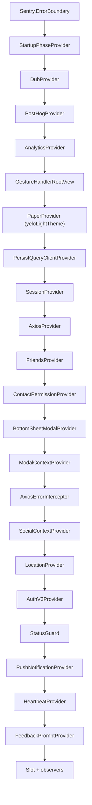

`yelo-frontend` is the rider and driver app for iOS and Android. It is a single Expo Router project. One binary serves both roles, and the server decides which role is active (see [Navigation](/engineering/mobile/navigation)).

This page covers how the app is put together. For running it locally, see [Local development](/engineering/local-development). For the generated API client, see [OpenAPI and clients](/engineering/openapi-and-clients).

<Note>
The repo's `AGENTS.md` is the source of truth for conventions. `CLAUDE.md` only points to it. Read it before your first PR.
</Note>

## Stack

Versions come from `package.json` and `app.json` on `main`.

| Layer | Library | Version |
| --- | --- | --- |
| Runtime | Expo SDK | `~57.0.22` |
| Runtime | React Native (New Architecture) | `0.86.3` |
| Runtime | React (React Compiler on) | `19.2.3` |
| Routing | `expo-router` (typed routes on) | `~57.0.21` |
| Server state | `@tanstack/react-query` + persist client | `^5.102.8` |
| Client state | `zustand` | `^5.0.15` |
| HTTP | `axios` + Orval-generated hooks | `^1.20.0` / Orval `8.31.0` |
| Validation | `zod` | `^4.6.2` |
| UI theme | `react-native-paper` (MD3) + `phosphor-react-native` icons | `^5.15.3` / `^3.0.6` |
| Maps | `@rnmapbox/maps` (Mapbox SDK `11.20.1` via plugin) | `^10.3.5` |
| Animation | `react-native-reanimated` + `react-native-worklets` | `4.5.1` / `^0.10.3` |
| Sheets | `@gorhom/bottom-sheet` | `^5.2.14` |
| Payments | `@stripe/stripe-react-native` | `0.64.0` |
| Errors | `@sentry/react-native` | `^8.24.0` |
| Analytics | `posthog-react-native` + session replay | `^4.70.0` |
| Attribution | `@dub/react-native` | `^0.0.3` |
| Logging | `react-native-logs` | `^5.6.0` |
| Tooling | oxlint, oxfmt, ESLint (React Compiler rules), `tsgo`, Jest (`jest-expo`) | see `package.json` |

`app.json` enables `experiments.typedRoutes` and `experiments.reactCompiler`. The package manager is pnpm (`packageManager: pnpm@11.5.2`). iOS targets `16.4` and up through `expo-build-properties`.

## Directory layout

```text
app/            Expo Router routes only. Layouts compose providers.
components/
  design-system/  Shared UI kit (Yelo*, Haptic*, BottomButton, YeloBottomSheet ...).
                  Lint forbids it from importing feature code, providers, hooks, or stores.
  <feature>/      Feature components: ride/, drive/, map/, onboarding/, driver-signup/ ...
providers/      App-lifetime React context (Session, AuthV3, Location, Ride, Drive, QueryPollers ...).
stores/         Zustand stores for transient UI state; some persist to AsyncStorage.
hooks/          Reusable hooks not tied to one provider.
api/            axios instance, Orval output (api/generated, never hand-edited), helpers/.
lib/            Shared non-UI code by domain: analytics, auth, contacts, map, ride, payments,
                format, storage, prompts, theme, observability, platform, navigation,
                notifications, experiments, query, ui, dev (mocks).
tasks/          expo-task-manager background tasks (driver location).
widgets/        expo-widgets Live Activity scaffold, registered at startup.
e2e/            agent-device flows. See /engineering/testing.
scripts/        Dev, simulator, E2E, release, and color tooling.
```

A few rules the linter enforces:

- No `console.*` in app code. Use `log` from `@/lib/observability/logger`.
- `expo-haptics` is imported only by `lib/platform/haptics`.
- Icons come from `phosphor-react-native`, never `@expo/vector-icons`.
- `date-fns` is imported by subpath, for example `date-fns/format`.
- No `as never` on routes. Type dynamic targets as `Href`.
- Persisted storage keys are an on-device contract. Never rename an existing AsyncStorage or SecureStore key.

## Root layout and provider tree

`app/_layout.tsx` runs module-level setup, then renders the provider tree around `<Slot />`.

### Module-level setup

Before any component mounts, the root layout:

- Imports `@/widgets` so Live Activity layouts register with the native module.
- Calls `installRideStatusProtocol(queryClient)` to attach the ride-state interceptors to `/user/status`. See [State and data](/engineering/mobile/state-and-data).
- Configures `Observe` (`expo-observe`) with a list of filtered route params so IDs, codes, coordinates, and PKCE values never leave the device.
- Sets `Text.defaultProps.allowFontScaling = false`. This is a no-op under React 19, so OS font scaling still applies to plain `Text`. Only `YeloText`, `YeloTextInput`, and `cappedFontScale` enforce the font scale cap.
- Creates the `QueryClient` and the AsyncStorage persister.
- Wires React Query's `focusManager` to `AppState` and its `onlineManager` to NetInfo.
- Calls `Sentry.init` with the React Navigation integration.

### Provider order

The order matters. Each provider can only read the ones above it.



Headless components also mount inside the tree: `ProviderDiagnosticsObserver` (under `SessionProvider`), `RecentLocationsSync` (under `AxiosProvider`), and `EasUpdateObserver` (under `AxiosErrorInterceptor`). Next to `<Slot />`, the layout mounts `QueryPollers`, `RiderFlowObserver`, `ReferralCaptureObserver`, `FleetJoinIntentObserver`, `ContactMatchSync`, and `SessionReplayObserver`.

| Provider | Responsibility |
| --- | --- |
| `StartupPhaseProvider` | Exposes `isInteractive`. The first screen calls `markInteractive`, or a 10-second fallback releases it. Non-critical work (push setup, heartbeat, telemetry, Stripe warm-up) waits for it. |
| `SessionProvider` | Owns the JWT in SecureStore, `signIn`, `signOut`, and `isProfileReady`. See [Auth and onboarding](/engineering/mobile/auth-and-onboarding). |
| `AxiosProvider` | Attaches `Authorization: Bearer`, gates requests while a JWT swap is in flight, and signs out on an `AccountDeletedError` 401. |
| `AxiosErrorInterceptor` | Shows an error or warning modal for requests that opt in with `showErrorModal` or `showWarningModal`. |
| `LocationProvider` | Foreground location permission, a single `watchPositionAsync` client, and foreground location uploads. |
| `AuthV3Provider` | The Auth v3 sign-up and sign-in transaction. |
| `StatusGuard` | Forces `driving` users onto `/drive`. |
| `PushNotificationProvider` | Push token registration, foreground handling, and tap routing. |
| `HeartbeatProvider` | Periodic `POST /heartbeat` with location and device state. |

Feature-scoped providers mount in nested layouts, not the root: `RideProvider` in `app/(app)/ride/_layout.tsx`, `RideMatchingProvider` in `ride-matching/_layout.tsx`, `DriveProvider` and `MessagingProvider` in `drive/_layout.tsx`, `DriverSignupProvider` in `driver-signup/_layout.tsx`, and the `Map*` providers in `(tabs)/map/_layout.tsx`.

### Startup sequence

1. The native splash (`react-native-bootsplash`) shows while JS loads. Fonts are embedded by the `expo-font` plugin, so the root layout hides the splash right after the first React commit.
2. `SessionProvider` reads `session` from SecureStore. The read starts at module evaluation through `preloadStorageItem('session')`.
3. `app/(app)/index.tsx` redirects to `/(app)/(tabs)/map` when a JWT exists, or to `/(auth-v3)` when it does not.
4. The first screen marks itself interactive. Deferred work then runs through `scheduleWhenIdle`.
5. The root layout calls `reconcileDriverLocationUpdates()` to stop a stale background location task left over from a previous session.

The root layout also polls `GET /update-required` every 10 minutes while foregrounded. If the app is below the server minimum, it renders `UpdateRequiredScreen` instead of the tree. See [Releases](/engineering/mobile/releases#update-required-gate).

## Theming

The app has one light theme. There is no dark mode.

- `lib/theme/index.ts` exports `yeloLightTheme`, an MD3 theme extended with `yeloColors` and `textColors`, and passes it to `PaperProvider`. Read it with `useTheme()` from `@/lib/theme`.
- `rem(n)` converts to pixels on a 16px base and scales up to 1.5x on screens wider than 600pt. `remFixed(n)` skips the tablet scale for the driver overlays.
- `MAX_FONT_SIZE_MULTIPLIER` is `1.2`. `YeloText` and `YeloTextInput` enforce it in JS, because the native `maxFontSizeMultiplier` is not respected in this setup.
- Fonts are Switzer (Light through Bold) and Boston Angel Medium, embedded by the `expo-font` plugin. The auth entry screen also loads Instrument Serif at runtime.
- `lib/theme/glassCapability.ts` decides whether `YeloGlassView` renders native Liquid Glass. It requires both `isLiquidGlassAvailable()` and `isGlassEffectAPIAvailable()`, and falls back to a blur view otherwise.
- `lib/theme/navigation.ts` exports `transparentNavTheme` for stacks that render inside glass bottom sheets.

<Warning>
Pure white and black hex literals are banned outside map layers. Use `yeloColors.surface50`, `yeloColors.surface800`, or `theme.colors.text`. Add a token in `lib/theme` before adding any new color literal.
</Warning>

## Logging

`lib/observability/logger.ts` wraps `react-native-logs`.

- Call sites use dotted event names and structured context: `log.error('drive.setOnline.error', { error: serializeError(error) })`.
- When `EXPO_PUBLIC_IS_PRODUCTION` is `true`, logs go to the console and to daily files under the cache directory (`logs-YYYY-MM-DD.txt`). Files rotate at 2 MB, keep up to 7 archives, and are deleted after 7 days. Severity is `info`.
- Otherwise, logs go to the console only at `debug` severity.
- The shared axios instance logs every non-canceled failed request as `<path>.<METHOD>.error`.

## Error tracking and analytics

| Tool | Where | Notes |
| --- | --- | --- |
| Sentry | `Sentry.init` in `app/_layout.tsx` | Disabled in `__DEV__` and E2E builds. `tracesSampleRate` is `0.2`. Root `Sentry.ErrorBoundary` renders `ErrorBoundaryFallback`. |
| Feature boundaries | `components/FeatureErrorBoundary.tsx` | Tags the Sentry event with `feature`. Used by the `drive` and `ride` layouts. |
| PostHog | `PostHogProvider` + `lib/analytics` | Disabled in E2E or when `EXPO_PUBLIC_POSTHOG_API_KEY` is empty. The root error boundary also forwards exceptions to PostHog. |
| Session replay | `components/SessionReplayObserver.tsx` | Starts only after the app is interactive. Text inputs are masked and log capture is off. Excluded accounts never record. |
| Telemetry | `lib/observability/TelemetryService.ts` | Sends device and permission state to `/telemetry`, throttled to once every 5 minutes. |
| Expo Observe | `Observe.configure` | Route analytics with sensitive params filtered. Dispatch is off in E2E. |

Add new analytics events as typed hooks in `lib/analytics/events/`. Never inline event name strings. For dashboards and alerting, see [Observability](/engineering/observability).
