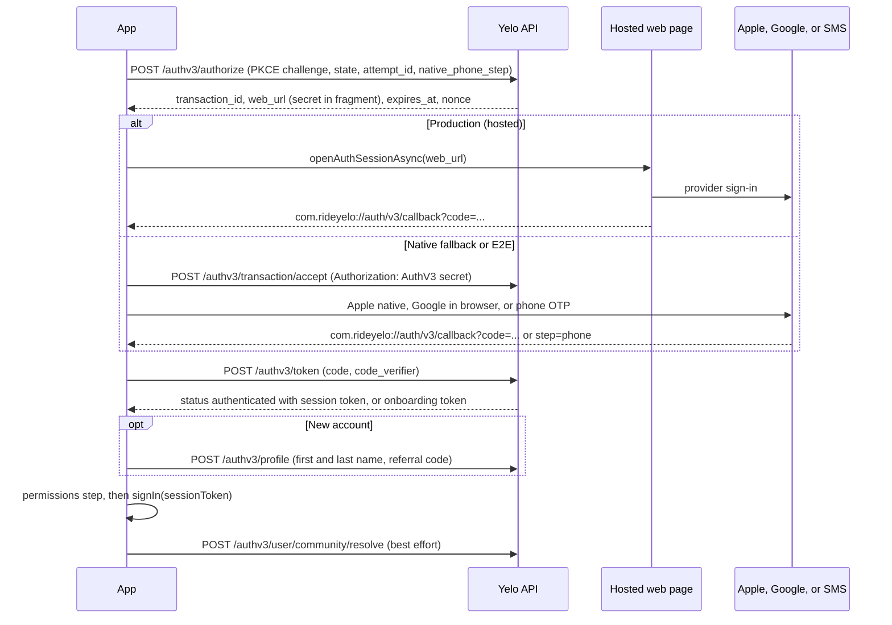

Sign-up and sign-in are one flow in the mobile app: an **Auth v3 transaction**. A returning user and a new user tap the same **Get Started** button. The server decides whether the identity already has an account.

This page covers the client implementation. For what users see and the account model, see [Accounts and sign-in](/concepts/accounts-and-sign-in). For driver onboarding, see [Driver onboarding](/concepts/driver-onboarding).

## Key files

| File | Role |
| --- | --- |
| `providers/SessionProvider.tsx` | Session JWT in SecureStore, `signIn`, `signOut`, `isProfileReady`, `isPresignup`. |
| `providers/AxiosProvider.tsx` | Bearer header, the JWT-swap request gate, and deleted-account sign-out. |
| `providers/AuthV3Provider.tsx` | The Auth v3 transaction state machine. |
| `lib/auth/client.ts` | Typed `fetch` client for `/authv3/*`. Auth v3 is excluded from Orval. |
| `lib/auth/security.ts` | PKCE proof, redirect URI, host allowlists, callback parsing. |
| `lib/auth/entryMode.ts` | `hosted` in production, `native` in E2E builds. |
| `lib/auth/permissions.ts` | Decides whether the permissions step can be skipped. |
| `lib/navigation/onboardingRoute.ts` | `resolveOnboardingRoute`, the single status-to-route rule. |
| `app/(auth-v3)/*` | Native sign-in screens. |
| `app/(app)/verify/*` | Post-signup student verification (Auth v2 email OTP and OAuth). |

## Session storage

The session is a single JWT.

- It lives in SecureStore under the key `session`. `useStorageState('session')` reads it, with up to 3 retries 500ms apart.
- There is no refresh token. When the API returns a replacement token (for example after a community change), the app calls `signIn(newToken)`.
- `isPresignup` is true when the JWT payload has `sub: "pending"`. Heartbeats and several startup tasks skip presignup sessions.
- `isProfileReady` becomes true only after a `/authv2/status` response authenticated with the current token succeeds. Cached profile data is presentation-only until then.

<Warning>
`session`, `authv3-onboarding-draft-v1`, `authv3-anonymous-id`, and `expoPushToken` are on-device contracts. Renaming any of them signs users out or strands in-flight transactions.
</Warning>

### Swapping tokens

`signIn(nextJwt)` does more than store the token:

<Steps>
  <Step title="Detach identity-bound caches">
    It cancels and removes the `/user/status` query and cancels `currentUser`, `currentCommunity`, and community-scoped queries, so a response for the old token cannot repopulate them.
  </Step>
  <Step title="Close the request gate">
    It sets `jwtUpdating`. `AxiosProvider` then holds every request (except `authv2` calls) until the swap finishes, for at most 15 seconds.
  </Step>
  <Step title="Verify the new token">
    It fetches `GET /authv2/status` into the `currentUser` key. On success it calls `confirmJwtReady()`, which reopens the gate and refetches the community.
  </Step>
</Steps>

A 15-second timeout forces `jwtUpdating` back to false if the verification never completes.

### Signing out

`signOut()` resets analytics, calls `POST /notification/clear-token` (skipped for deleted accounts), clears the JWT and stored push token, clears the whole React Query cache, and replaces to `/(auth-v3)`.

The app signs out automatically when:

- `AxiosProvider` sees a 401 whose body is a machine-readable `AccountDeletedError`.
- `useCurrentUser` gets a 200 with `status: "deleted"`.
- `useCurrentUser` gets a 401 and the JWT is expired, or a 401 that persists after one retry.

## Auth v3 transaction

Auth v3 is an OAuth-style authorization code flow with PKCE. The app is the client, and the Yelo API is both the authorization server and the provider broker.



### Entry: hosted first, native fallback

`app/(auth-v3)/index.tsx` calls `prefetchTransaction()` on mount so the authorize round trip is done before the user taps. **Get Started** calls `startEntryFlow()`:

1. In production (`entryMode` is `hosted`), the app probes the hosted page with `isHostedWebReachable` (4-second timeout), then opens `web_url` in `WebBrowser.openAuthSessionAsync`. The hosted page owns attribution, cookies, and any saved web session. This transaction uses `native_phone_step: false`.
2. If the page is unreachable or the browser cannot open, the app opens a fresh transaction with `native_phone_step: true` and routes to `/(auth-v3)/method`.
3. If the user closes the browser, the entry screen shows **Having trouble? Continue in app**. After two cancellations, the third tap goes native automatically.
4. E2E builds (`EXPO_PUBLIC_APP_ENV=e2e`) skip the browser and use the native screens with the same APIs.

`startWebFallback()` remains as a last resort. It is reachable from `(auth-v3)/error.tsx` when the native endpoints return 503.

### Transaction secret and draft

`POST /authv3/authorize` returns a `web_url`. The app checks it against `isSafeAuthV3WebURL` (`yelo.link`, `joinyelo.com`, and their subdomains, plus loopback in dev), then parses the **transaction secret** from its fragment. Native calls to `/authv3/transaction/accept`, `/authv3/providers/*`, and `/authv3/transaction/resume` send `Authorization: AuthV3 <secret>`.

The draft, including the secret, PKCE `verifier`, `state`, provider config, and profile prefill, is saved to SecureStore under `authv3-onboarding-draft-v1`. A backgrounded or killed app resumes the same step. A draft is reusable while it has more than a minute left before `expires_at`.

Each "Get Started" attempt carries an `attempt_id` (kept for 15 minutes). The server rotates the transaction under that id while it is still pristine. A 409 means the attempt cannot be reused, and the app retries once with a fresh attempt.

### Sign-in methods

| Method | Implementation |
| --- | --- |
| Apple | Native `expo-apple-authentication`, using the server-issued nonce. The result goes to `/authv3/providers/apple/native`. |
| Google | `/authv3/providers/google/start` returns an `accounts.google.com` URL, opened in `WebBrowser.openAuthSessionAsync`. There is no native Google SDK. `isSafeProviderURL` allowlists the host. |
| Phone | `/authv3/providers/phone/send` sends the OTP. `/authv3/providers/phone/verify` checks it and returns the callback URL. |

Every provider returns to `com.rideyelo://auth/v3/callback` with either `code` (exchange it) or `step=phone` (collect a phone on the same transaction). `parseAuthV3Redirect` validates `state` before anything else.

<Note>
Test accounts use phone numbers starting with `555` and accept OTP `12345`. E2E actors use reserved `+1555` numbers. See [Testing](/engineering/testing).
</Note>

### Exchange, profile, permissions

- `POST /authv3/token` returns `status`. If `authenticated`, the user is a returning user with a complete profile, and the app goes straight to permissions.
- Otherwise, the token is an onboarding token. The app routes to `finish-profile`. `POST /authv3/profile` submits the name and any captured referral code, and returns the session token.
- Before showing `permissions`, the app checks location, contacts, and notifications. If all three are already granted, it skips the screen. On a simulator, notifications count as granted.
- `completeSession` sets `phase` to `complete`, clears the draft, calls `signIn`, and replaces to `/(app)/(tabs)/map`.
- In the background, it calls `/authv3/user/community/resolve` with device coordinates. If the server reissues a community-scoped token, the app applies it only if the same session is still active.

## Guards for unfinished accounts

`resolveOnboardingRoute` in `lib/navigation/onboardingRoute.ts` is the only status rule:

```ts
return status?.profile_initialized ? HOME_ROUTE : AUTH_V3_ROUTE;
```

`app/(app)/_layout.tsx` runs it whenever the profile loads. If a signed-in account has no initialized profile, the layout signs out once so the user starts a clean Auth v3 transaction. There is no per-step resume route inside `(app)`.

Phone verification is required for app sign-ins. An Apple or Google sign-in on the `app` channel for an account without a phone number goes to the phone step before any token is issued (`requiresSupplementalPhone` in `internal/service/authv3/resolver.go`). Web-channel sign-ins can finish without a phone. See [Provider flows](/engineering/identity/provider-flows#the-supplemental-phone-step).

## After sign-in

These flows run for accounts that already exist. They are not part of the Auth v3 transaction.

| Flow | Routes | API |
| --- | --- | --- |
| Student verification | `verify/1-oauth` to `3-email-confirm` | StudID (`/authv3/user/student/studid/*`), Google or Microsoft OAuth (`/authv2/email/verify-oauth`), or `.edu` email OTP (`/authv2/email/request-otp`, `/authv2/email/verify-otp`) |
| Driver-signup student step | `driver-signup/verify/*` | Same endpoints |
| World Cup claim | `post-signup/14-student` | Opens `verify/1-oauth` with the claim email. The `(app)` layout pushes it once per claim on next app open. |
| Identity linking | `/(app)/profile/accounts` | `/authv3/user/link/authorize`, `/authv3/user/identities` |

Auth v2 endpoints are used only for these email verification steps and for `GET /authv2/status` (the `currentUser` query).

## Changing auth

- Adding or changing a provider callback scheme, Apple sign-in capability, or associated domain is a native change. See [Releases](/engineering/mobile/releases#ota-versus-native-rebuild).
- Changes to screens, copy, or `AuthV3Provider` logic can ship over the air.
- If you change the draft shape, keep old drafts readable. Users mid-transaction restore it on next launch.
