This page walks the driver side of `yelo-frontend` screen by screen. It assumes you know the provider and polling model from [Rider and driver flows](/engineering/mobile/rider-and-driver-flows#driver-flow) and the application rules from [Driver onboarding](/concepts/driver-onboarding). For dispatch and auto-queue on the server, see [Matching and auto-queue](/concepts/matching-and-auto-queue).

## Entering drive mode

Every "drive" entry point calls `useEnterDriverFlow()` in `hooks/useEnterDriverFlow.ts`:

| Condition | Destination |
| --- | --- |
| `EXPO_PUBLIC_ALWAYS_SHOW_DRIVER_MARKETING` set | `/(app)/driver-marketing` every time |
| `driver_application_status` is `approved` or `complete` | Marks the "why drive" flag seen, then `router.replace('/drive')` |
| First visit for this user | `/(app)/driver-marketing` (the `WhyDriveStories` carousel) |
| Otherwise | `/(app)/driver-signup/1-hub` |

The `from` param (`onboarding` or unset) rides along. It decides where the signup flow exits: `post-signup/10-marketing` for onboarding, the profile sheet otherwise.

Once the server reports `user_status: driving`, `StatusGuard` forces the user into `/drive`. See [Navigation](/engineering/mobile/navigation#route-guards).

## Driver signup screens

`app/(app)/driver-signup/_layout.tsx` mounts `DriverSignupProvider`, which holds the vehicle draft and wraps the upload mutations. `index` redirects to `1-hub`.

| Screen | What it collects or shows | Validation and behavior |
| --- | --- | --- |
| `1-hub` | **Complete your driver setup.** / "You keep 100% of every fare." Four task rows with **COMPLETED**, **IN REVIEW**, **NOT APPROVED**, or **UP NEXT**. Fleet drivers see "Finish setup in ~5 min and start driving with [fleet]." and badges "Payouts managed by [fleet]" or "Vehicle provided by your fleet". | Reads `GET /driver/signup-status`. Prefetches the Stripe onboarding link. |
| `2-profile-photo` | Tips: "Face front, well-lit", "No shades, no hats", "Just you in frame". **Take photo** or library upload. | `POST /driver/profile-photo`. Square crop, front camera. |
| `3-vehicle-basic` | Year, make, model, color | Only non-empty checks. Year is free text with a `2018` placeholder. |
| `4-vehicle-details` | Seat counter, plate state picker, plate number | Seats must be at least the vehicle type's `min_seats` (`GET /vehicle-types`, fallback 3) and at most 20. Default 4. `POST /vehicle/` or `PUT /vehicle/{id}`. |
| `5-license` | **STEP 3 OF 4 · DRIVER'S LICENSE**. Front and back tiles: **TAP TO CAPTURE**, then **CAPTURED · TAP TO RETAKE**. | Camera only, back camera, quality 0.8. `POST /driver/license-photos` as `license_front.jpg` and `license_back.jpg`. |
| `6-stripe` | Personal Stripe: requirements list and an open-Stripe button. Fleet payouts: **PAYOUTS READY** / "Managed by [fleet]." / **Continue driver setup**. | Opens the onboarding link with `Linking.openURL` in the system browser. Refetches signup status on focus and on every return to foreground. Advances to `7-student` once all sections are done. |
| `7-student` | Optional student verification | Skips straight to `8-submitted` for already-verified students. |
| `verify/1-oauth` to `3-email-confirm` | Same StudID, OAuth, and email OTP flow as `/verify` | Done route defaults to `8-submitted`. |
| `8-submitted` | Success hero and a friends-hub invite | Fires `submitted` analytics. |

## The drive screen

`app/(app)/drive/index.tsx` is a dark `CustomMapView` (zoom 14, community bounding box always shown) with overlays. `drive/_layout.tsx` wraps it in `StartupReadyView`, `FeatureErrorBoundary feature="drive"`, `DriveProvider`, and a `MessagingProvider` that watches the current and queued rides.

```mermaid
flowchart TD
  OFF["Shift sheet: YOU'RE OFFLINE"] -->|Go online| BG{"Always location?"}
  BG -->|no| LRS["LocationRequiredSheet"]
  BG -->|yes| GOS["GoOnlineConfirmationSheet"]
  GOS -->|Go Online| ON["Shift sheet: ONLINE"]
  ON -->|board ride| CARD["RideRequestCard modal"]
  CARD -->|Accept or 30s timeout| CUR["CurrentRideBottomSheet"]
  CARD -->|Decline| DEC["DeclineReasonSheet"]
  CUR -->|Complete ride| DONE["RideCompleteScreen overlay"]
  DONE -->|Continue or Next Ride| ON
  ON -->|hand icon| GOFF["End your shift?"]
  GOFF --> OFF
```

### Top chrome

When no ride card is showing, the overlay renders:

- **Menu** (list icon): opens `drive/driver-hub/1-hub`.
- **Chat**: opens `drive/queue`, then pushes the oldest unread thread if there is one. The button pulses and plays a light haptic when unread count rises.
- **Earnings pill**: `GET /earnings/balance` available plus pending, compact format (`$42`, `$1.2k`). Opens `driver-earnings/1-hub`.
- **Reconnecting to ride requests…** card when the board query errors while online.

On first load, if no navigation app is stored in SecureStore (`defaultNavApp`), `DriverHubNavigationSheet` opens so the driver picks Apple Maps, Google Maps, or Waze.

### Offline and going online

`DriverShiftSheet` shows `OfflineSheetContent`: a **YOU'RE OFFLINE** status and a **Go online** button. The button is enabled only when `driver_application_status` and `stripe_signup_status` are both `complete`. A `FirstDrivePromoTile` ("Ready for your first drive?") appears while `drive_count` is 0.

**Go online** checks background location first. See [Permissions](/engineering/mobile/permissions-and-device#location). Then `GoOnlineConfirmationSheet` shows:

- A **vehicle tile** (make and model of the vehicle chosen by `goOnlineVehicle` for the active fleet, or "No vehicle"). Tapping opens `VehiclePickerSheet`, which is locked while online ("You're online — go offline to change vehicles.") or on a ride.
- An **auto-queue tile** ("[N] min" or "Off"). Tapping opens `AutoQueueDurationSheet`.
- A **What is auto-queue?** link to `AutoQueueExplainerSheet`.
- A warning if the vehicle has `in_use_by_other_driver`.

**Go Online** refreshes vehicles ("Checking vehicle…"). If another driver has an open session, it asks **Vehicle already in use** with **Go online anyway**. Then `driveActions.setOnline(true, vehicleId)` runs. See [Rider and driver flows](/engineering/mobile/rider-and-driver-flows#going-online) for the API sequence.

Client-side errors from `setOnline`:

| Condition | Modal |
| --- | --- |
| No GPS fix and no last known position | **Location Error** / "Unable to determine your location. Please check your signal and try again." |
| Fix outside the community `bounding_box` | **Outside Service Area** / "You must be within the [community] community boundaries to go online…" |
| Version gate failure | **App update check** alert |
| Any server rejection | **Error** / "Failed to update online status. Please try again." |

### Online

`OnlineSheetContent` shows a green sonar pulse, **ONLINE** (or **ONLINE · PAUSED** with a countdown), an auto-queue chip (**Auto-queue on**, **Auto-queue off**, or **Paused · 4m**), a red hand button that opens **End your shift?** / "You'll stop getting ride requests.", and the list of eligible board rides.

### Auto-queue controls

| Sheet | Options | Endpoint |
| --- | --- | --- |
| `AutoQueueDurationSheet` | On or off, then 30, 45, 60, 90, or 120 minutes, filtered to `community_max_minutes` | `PUT /driver/auto-queue` with `enabled`, `max_minutes`. Turning it on runs the version gate first. |
| `AutoQueuePauseSheet` | Pause for 5, 10, 15, or 30 minutes, **Resume auto-queue now**, or **Turn on auto-queue** when off | `POST /driver/auto-queue/pause` with `duration_minutes` |
| `AutoQueueExplainerSheet` | **Show yourself to riders**: "Riders see you when picking a ride", "Riders can pick you by name", with a preview card | none |

Settings come from `GET /driver/auto-queue` (`enabled`, `paused_until`, `effective_max_minutes`, `community_max_minutes`). The save path updates the cache optimistically and refetches either way.

## Ride requests

### The ride card

When the driver is online and `DriveProvider` selects an `activeCardRide`, `DriverMapOverlay` opens a full-screen slide-up `Modal` with `RideRequestCard`, plays `ride_sound.mp3`, and disables map gestures.

The card shows the rider's initials, first name, and graduation year (`'27`), an elapsed timer since `request_time` (green, then yellow after 30 seconds, red after 120), total price and combined distance and duration, a dark route map, and **TO PICKUP** and **THE RIDE** legs.

<Warning>
The accept button auto-accepts by design. `RideAcceptButton` fills over 30 seconds (`durationSeconds={30}` in `RideRequestCard.tsx:365`) and calls `onAutoAccept` when it completes. The label reads "Accepting in [N]s", so the countdown is visible to the driver. The only way to avoid it is to tap **Decline**.
</Warning>

**Accept** (tap or timeout):

1. Marks the ride id as accepted locally so it leaves the board.
2. Runs the version gate, then `POST /ride/i/{id}/accept`.
3. On success: success haptic, status refresh, prefetch of ride details, board invalidation. The card stays up showing "Confirming…" until status lists the ride as current or queued, or 8 seconds pass.
4. On any failure except the version gate: the ride id is un-accepted and `TooSlowPopup` shows **RIDE GONE** / **Too slow this time.** / "Rides on Yelo move fast. Monitor your notifications and tap in fast." It auto-dismisses after 5 seconds.

**Decline** pauses the countdown and opens `DeclineReasonSheet` with four reasons: **Not enough money**, **Too far away**, **Not actively driving**, **Other**. Submitting hides the ride for the rest of the session before the network call, then sends `POST /ride/i/{id}/decline` with `reason` (retried twice with backoff). Cancelling the sheet resumes the countdown.

If a ride vanishes from the board within 15 seconds without being accepted, `DriveProvider` sets `tooSlowRideId` and the same popup shows.

### Queued rides

With auto-queue on, new queued rides play the ride sound. `GET /driver/queue` lists them every 10 seconds. The in-ride `QueueCard` ("UP NEXT IN QUEUE · +N more") renders but is disabled (`TODO: open queue sheet`). `QueuedRidesOverlay` exists but is commented out of `drive/index.tsx`.

## Current ride

`CurrentRideBottomSheet` replaces the shift sheet while `currRide` exists. The map shows the route and the pickup pin (en route, waiting) or dropoff pin (in progress), framed once per status change.

| Status | Header | Right label | CTA | Endpoint |
| --- | --- | --- | --- | --- |
| `driver_en_route` | EN ROUTE TO PICKUP | ESTIMATED TIME (pickup) | **I've arrived** | `POST /ride/i/{id}/at-pickup` |
| `driver_waiting` | AT PICKUP | AT PICKUP · Here | **Start ride** (green) | PIN sheet, or `POST /ride/i/{id}/pickup` with no body |
| `in_progress` | IN PROGRESS | ESTIMATED TIME (dropoff) | **Complete ride** | `POST /ride/i/{id}/complete` |

The card shows pickup and drop-off with ping markers, a **TOTAL LEFT** distance and time from map details, and a rider card with chat (opens `drive/queue/[rideId]`, with unread badge) and call (`tel:`). A cancel control on the status row opens `DriverCancelPopup`.

The navigation button opens the preferred app at the pickup (or the dropoff once in progress). For five seconds after a new pickup leg starts, the nav button is highlighted and the CTA switches to a glass style.

Every action goes through `useRideCommand`. Failures show **Couldn't confirm arrival**, **Couldn't start the ride**, or **Couldn't confirm completion** with "Check your ride status before trying again."

### Pickup and PIN

If `requires_confirm_code` is true, **Start ride** opens `SecurityPinBottomSheet`: a 4-digit code field (`PIN_LENGTH` in `hooks/drive/usePinEntry.ts`). It submits `POST /ride/i/{id}/pickup` with `confirm_code` as a number as soon as the fourth digit lands. The API generates codes from 1000 to 9999 (`generateConfirmCode` in `yelo-api/internal/service/ride/rider.go`), so leading zeros never occur. A wrong PIN shakes the field and shows "Incorrect PIN. Ask the rider for their code." Other failures keep the PIN and say "Could not confirm pickup. Your PIN is saved; check the ride status and try again."

### Driver cancel

`DriverCancelPopup` asks "Something wrong? Select a reason", then an optional comment, then **Cancel Ride**. Reasons and keys:

`accident` (Accepted trip by accident), `rider_behavior`, `pickup_problem`, `wrong_turn`, `pickup_not_worth` (Pickup isn't worth it), `not_safe`, `vehicle_issue`, `other`.

It sends `POST /ride/i/{id}/cancel` with `reason` and `comment`. There is no fee quote on the driver side.

### Completion overlay

`RideCompleteScreen` covers the map in a dark glass view with **Ride Complete**. For a paid fare it shows:

- **YELO** with the fare and **YOU KEEP 100%**.
- **UBER & LYFT** with 60% of the fare and **AFTER THEIR 40% CUT**.
- "You made $X more with Yelo" (40% of the fare).

Then **Rate rider** stars, **Add Rider Count**, and **Add Comment**. The button reads **Next Ride →** when a queued ride is waiting, else **Continue**. Dismissing fires `POST /ride/i/{id}/rate` with `rating`, `num_riders`, and `feedback` if anything was entered. Failures are silent.

Ratings of 4 or 5 count as positive for the shift. Going offline after 3 or more positive and zero negative (1 or 2 star) ratings requests the `driver-shift` feedback prompt.

## Chat and queue screens

| Route | Content |
| --- | --- |
| `drive/queue` | Recent chats (`useDriverGetRecentChats`) grouped as current, up next, and earlier, with unread badges |
| `drive/queue/[rideId]` | Thread header, context card, messages, and quick chips "On my way", "2 min out", "I'm here", "Running late". Drafts persist per ride. Failures: "Message failed to send", "Earlier messages could not be loaded". |

## Driver hub

`drive/driver-hub/1-hub` (**Driver Profile**) has a rider-mode switch (blocked mid-ride with **Finish your ride first**) and these rows:

| Section | Row | Target |
| --- | --- | --- |
| Header | Photo with camera button | `2-profile-photo` (same picker, `POST /driver/profile-photo`) |
| ACCOUNT | Education status (**Verified** or **Not verified**) | `driver-signup/verify/1-oauth` with `returnTo` set back to the hub |
| EARN | **Earnings & stats** ("$X this week") | `driver-earnings/1-hub` |
| EARN | **Payouts** ("Managed by [fleet]" or "Managed through your Stripe account") | `driver-signup/6-stripe` |
| EARN | **Drive history** ("[N] trips") | `3-drive-history`, then `4-ride-details` (`GET /user/drive-history`) |
| DRIVE | **My vehicles** | `DriverHubVehiclesSheet`: set default (`PUT /vehicle/{id}`), add or edit via `5-vehicle-basic` and `6-vehicle-details` |
| DRIVE | **Navigation** | `DriverHubNavigationSheet` |
| DRIVE | **Switch fleet** | `DriverHubFleetSwitcherSheet`: "Choose the network you're driving for right now." `POST /driver/active-fleet`. Blocked while online or on a ride. |
| Support | **Contact Yelo** | `ContactYeloSheet` |

## Earnings and payouts

`driver-earnings/1-hub` reads `GET /driver/signup-status` and branches on `payout_source`:

| `payout_source` | Screen |
| --- | --- |
| `fleet` | `FleetManagedEarnings`: `driver_earnings` from `/user/status` and the last 5 drives |
| `personal_stripe` | Balance (**Available**, **Pending**), `EarningsNextPayoutCard`, optional cash-out button, **Recent activity**, **Recent payouts** |
| `signup-status` request failed | `EarningsUnavailable` with retry |
| Anything else, including `personal_stripe` before the earnings data loads | Spinner |

The API always sends `fleet` or `personal_stripe`. `DriverApplication.GetStatuses` in `yelo-api/internal/models/driver.go` defaults to `personal_stripe` when no payout fleet is set.

Personal-Stripe data comes from `GET /earnings/balance`, `/earnings/external-account`, `/earnings/payout-schedule`, `/earnings/payouts`, and `/earnings/activity`.

- **Payout schedule** (`PayoutScheduleSheet`): **Daily** ("Every business day · free") or **Weekly** ("Every Friday · free"). `PUT /earnings/payout-schedule`.
- **Cash out** appears only when `instant_eligible`. **Cash out $X now** / "Arrives in seconds" opens `CashOutSheet`: available balance, **1% instant fee**, **You'll receive**, and "Skip the fee by waiting for your free weekly payout on [date]." It posts `POST /earnings/payouts/instant` with `amount` equal to the balance minus the 1% fee, rounded to the nearest cent.
- `StripeLinkButton` opens `GET /stripeaccount/login-link` (or the onboarding link) for the Stripe Express dashboard.
- `2-all-activity` and `3-all-payouts` page through the same endpoints (payouts up to 100). Payout rows show **PENDING**, **SCHEDULED**, or **FAILED**.

## Live Activities

`widgets/DriverOnlineActivity.tsx` (status, rider name, queue count, steering-wheel SF Symbol) and `widgets/RiderRideActivity.tsx` (status, driver name, ETA minutes, car SF Symbol) are stub layouts: "Stub layout so the widget extension ships in the review build; real UI lands in a later update." `widgets/index.ts` loads them only if the `ExpoWidgets` native module exists. No code starts, updates, or ends an activity.

## Where this lives in code

| Area | Path |
| --- | --- |
| Entry | `hooks/useEnterDriverFlow.ts`, `app/(app)/driver-marketing.tsx`, `components/onboarding/why-drive/` |
| Signup | `app/(app)/driver-signup/`, `providers/DriverSignupProvider.tsx`, `components/driver-signup/`, `hooks/useVehicleSeatLimits.ts` |
| Drive screen | `app/(app)/drive/index.tsx`, `app/(app)/drive/_layout.tsx`, `providers/DriveProvider.tsx` |
| Overlays and sheets | `components/drive/` |
| Ride card | `components/drive/RideRequestCard.tsx`, `RideAcceptButton.tsx`, `DeclineReasonSheet.tsx`, `TooSlowPopup.tsx` |
| Current ride | `components/drive/CurrentRideBottomSheet.tsx`, `SecurityPinBottomSheet.tsx`, `RideCompleteScreen.tsx`, `components/driver-flow/DriverCancelPopup.tsx` |
| Navigation app | `hooks/drive/useNavigationApp.ts`, `components/driver-hub/DriverHubNavigationSheet.tsx` |
| Chat | `app/(app)/drive/queue/`, `components/drive/queue/`, `hooks/drive/useRideMessages.ts`, `providers/MessagingProvider.tsx` |
| Hub | `app/(app)/drive/driver-hub/`, `components/driver-hub/` |
| Earnings | `app/(app)/driver-earnings/`, `components/driver-earnings/`, `hooks/driver-earnings/` |
| Live Activities | `widgets/` |

## Gotchas and edge cases

- **Silence means accept.** This is the intended card design, not a bug. A driver who looks away from a ride card for 30 seconds accepts it. Pausing only happens while the decline sheet is open.
- **Every accept failure reads as "too slow".** `DriverMapOverlay.tsx:282` sets `tooSlowRideId` for network errors, 5xx, and validation errors alike.
- **Server go-online reasons are hidden.** The API returns specific titles (Application Incomplete, Payment Setup Required, Fleet Not Found, No Vehicle, Outside Service Area), but `DriveProvider.tsx:369` replaces them all with "Failed to update online status."
- **Disabled Go online has no explanation.** When `canGoOnline` is false the button just greys out.
- **The demand dashboard is fetched and never shown.** `DriveProvider` prefetches `GET /driver/demand-dashboard` on mount (`DriveProvider.tsx:215`), but no component reads that query.
- **Earnings can spin forever.** For `personal_stripe`, `driver-earnings/1-hub` shows a spinner until the earnings data loads (`1-hub.tsx:96`). The hub never reads the earnings queries' `isError`, so a failing `/earnings/balance` (for example, a driver with no Stripe account yet) spins with no retry.
- **Cash-out fee is computed on the client.** `CashOutSheet.tsx:14` hard-codes 1% and ignores `GET /earnings/payouts/instant-quote`. The API fee (`instantFeeFor` in `yelo-api/internal/service/earnings/mappers.go`) rounds up and has a $0.50 minimum, so small cash-outs show the wrong fee. A failed payout is swallowed with the comment "Mock can't fail" (line 52). The sheet stays open with no error.
- **Waze falls back to Google.** See [Permissions](/engineering/mobile/permissions-and-device#gotchas-and-edge-cases). Apple Maps and Google Maps use `http://` URLs, which `canOpenURL` always accepts. On Android, choosing Apple Maps opens `maps.apple.com` in a browser.
- **`StatusGuard` matches by substring.** `pathname.includes('/drive')` (`StatusGuard.tsx:31`) also matches `/driver-earnings`, `/driver-signup`, and `/driver-marketing`, so an online driver can sit on those screens without being pulled back to the map. The earnings and payouts rows in the driver hub rely on this. An exact match would bounce them.
- **License step is skippable in dev.** `5-license.tsx:76` lets `__DEV__` builds continue without photos. Release builds require both.
- **Vehicle year has no validation.** Any non-empty string passes `3-vehicle-basic`.
- **Stripe onboarding opens in the system browser,** not an auth session. The app only notices completion when it returns to the foreground and refetches.
- **The `driver-approved` feedback and review prompts never fire.** `lib/prompts/feedbackPrompt.ts:116` and `reviewPrompt.ts:157` wait for `driver_application_status` to become `approved`, but the API only emits `not_applied`, `pending`, `complete`, `failed`, `restricted`, and `unknown`.
- **Dead code.** `useFleetSelection`, `FleetVehicleCard`, `QueuedRidesOverlay`, and `DriverCancelButton` have no callers.
- **Rating is fire-and-forget.** A failed driver rating is dropped without retry.
