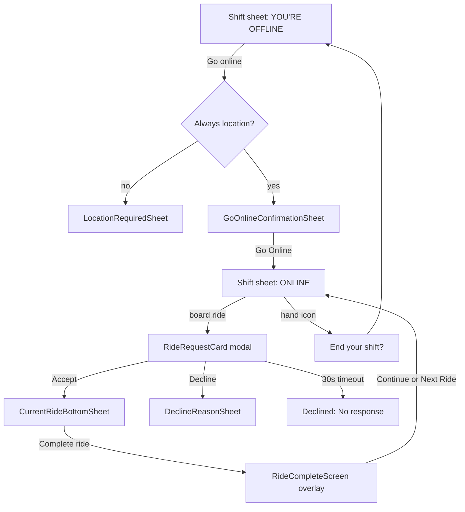
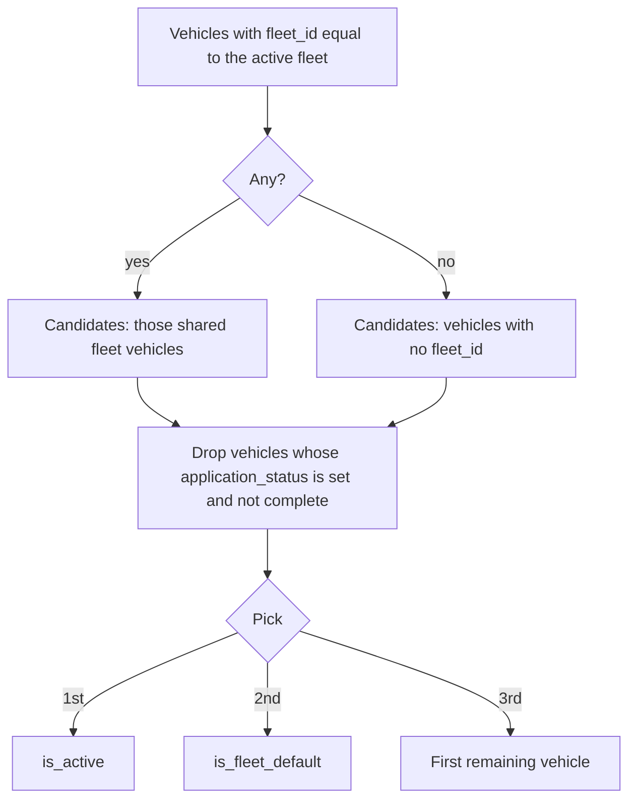

This page walks the driver side of `yelo-frontend` screen by screen. It assumes you know the provider and polling model from [Rider and driver flows](/engineering/mobile/rider-and-driver-flows#driver-flow) and the application rules from [Driver onboarding](/concepts/driver-onboarding). For dispatch and auto-queue on the server, see [Matching and auto-queue](/concepts/matching-and-auto-queue).

## Entering drive mode

Every "drive" entry point calls `useEnterDriverFlow()` in `hooks/useEnterDriverFlow.ts`:

| Condition | Destination |
| --- | --- |
| `EXPO_PUBLIC_ALWAYS_SHOW_DRIVER_MARKETING` set | `/(app)/driver-marketing` every time |
| `driver_application_status` is `approved` or `complete` | Marks the "why drive" flag seen, then `router.replace('/drive')` |
| First visit for this user | `/(app)/driver-marketing` (the `WhyDriveStories` carousel) |
| Otherwise | `/(app)/driver-signup/1-hub` |

The `from` param (`onboarding` or unset) rides along. It decides where the signup flow exits: `post-signup/10-marketing` for onboarding, the profile sheet otherwise.

Once the server reports `user_status: driving`, `StatusGuard` forces the user into `/drive`. See [Navigation](/engineering/mobile/navigation#route-guards).

## Driver signup screens

`app/(app)/driver-signup/_layout.tsx` mounts `DriverSignupProvider`, which holds the vehicle draft and wraps the upload mutations. `index` redirects to `1-hub`.

| Screen | What it collects or shows | Validation and behavior |
| --- | --- | --- |
| `1-hub` | **Complete your driver setup.** / "You keep 100% of every fare." Four task rows with **COMPLETED**, **IN REVIEW**, **NOT APPROVED**, or **UP NEXT**. Fleet drivers see "Finish setup in ~5 min and start driving with [fleet]." and badges "Payouts managed by [fleet]" or "Vehicle provided by your fleet". | Reads `GET /driver/signup-status`. Prefetches the Stripe onboarding link. |
| `2-profile-photo` | Tips: "Face front, well-lit", "No shades, no hats", "Just you in frame". **Take photo** or library upload. | `POST /driver/profile-photo`. Square crop, front camera. |
| `3-vehicle-basic` | Year, make, model, color | Only non-empty checks. Year is free text with a `2018` placeholder. |
| `4-vehicle-details` | Seat counter, plate state picker, plate number | Seats must be at least the vehicle type's `min_seats` (`GET /vehicle-types`, fallback 3) and at most 20. Default 4. `POST /vehicle/` or `PUT /vehicle/{id}`. |
| `5-license` | **STEP 3 OF 4 · DRIVER'S LICENSE**. Front and back tiles: **TAP TO CAPTURE**, then **CAPTURED · TAP TO RETAKE**. | Camera only, back camera, quality 0.8. `POST /driver/license-photos` as `license_front.jpg` and `license_back.jpg`. |
| `6-stripe` | Personal Stripe: requirements list and an open-Stripe button. Fleet payouts: **PAYOUTS READY** / "Managed by [fleet]." / **Continue driver setup**. | Opens the onboarding link with `Linking.openURL` in the system browser. Refetches signup status on focus and on every return to foreground. Advances to `7-student` once all sections are done. |
| `7-student` | Optional student verification | Skips straight to `8-submitted` for already-verified students. |
| `verify/1-oauth` to `3-email-confirm` | Same StudID, OAuth, and email OTP flow as `/verify` | Done route defaults to `8-submitted`. |
| `8-submitted` | Success hero and a friends-hub invite | Fires `submitted` analytics. |

## The drive screen

`app/(app)/drive/index.tsx` is a dark `CustomMapView` (zoom 14, community bounding box always shown) with overlays. `drive/_layout.tsx` wraps it in `StartupReadyView`, `FeatureErrorBoundary feature="drive"`, `DriveProvider`, and a `MessagingProvider` that watches the current and queued rides.

```mermaid
flowchart TD
  OFF["Shift sheet: YOU'RE OFFLINE"] -->|Go online| BG{"Always location?"}
  BG -->|no| LRS["LocationRequiredSheet"]
  BG -->|yes| GOS["GoOnlineConfirmationSheet"]
  GOS -->|Go Online| ON["Shift sheet: ONLINE"]
  ON -->|board ride| CARD["RideRequestCard modal"]
  CARD -->|Accept| CUR["CurrentRideBottomSheet"]
  CARD -->|Decline| DEC["DeclineReasonSheet"]
  CARD -->|30s timeout| TO["Declined: No response"]
  CUR -->|Complete ride| DONE["RideCompleteScreen overlay"]
  DONE -->|Continue or Next Ride| ON
  ON -->|hand icon| GOFF["End your shift?"]
  GOFF --> OFF
```

### Top chrome

When no ride card is showing, the overlay renders:

- **Menu** (list icon): opens `drive/driver-hub/1-hub`.
- **Chat**: opens `drive/queue`, then pushes the oldest unread thread if there is one. The button pulses and plays a light haptic when unread count rises.
- **Earnings pill**: `GET /earnings/balance` available plus pending plus `uncaptured`, compact format (`$42`, `$1.2k`). A yellow clock icon shows while any rides are uncaptured, and the accessibility label adds "includes pending earnings". The overlay requests the balance only when `GET /driver/signup-status` reports `payout_source: personal_stripe`. Other drivers get no balance request, and the pill shows `$0`. Opens `driver-earnings/1-hub`.
- **Reconnecting to ride requests…** card when the board query errors while online.

On first load, if no navigation app is stored in SecureStore (`defaultNavApp`), `DriverHubNavigationSheet` opens so the driver picks Apple Maps, Google Maps, or Waze.

### Offline and going online

`DriverShiftSheet` shows `OfflineSheetContent`: a **YOU'RE OFFLINE** status and a **Go online** button. The button is enabled only when `driver_application_status` and `stripe_signup_status` are both `complete`. A `FirstDrivePromoTile` ("Ready for your first drive?") appears while `drive_count` is 0.

**Go online** checks background location first. See [Permissions](/engineering/mobile/permissions-and-device#location). Then `GoOnlineConfirmationSheet` opens under **BEFORE YOU GO ONLINE** / **Ready to drive?** with:

- A **Vehicle** tile showing the make and model of the vehicle chosen by [`goOnlineVehicle`](#vehicle-choice), or "No vehicle". Tapping opens the [vehicle picker](#vehicle-picker). The tile is disabled and loses its caret when the active fleet has `has_owner_operators` set.
- An **Auto-queue** tile ("[N] min"), only when auto-queue is on. Tapping opens `AutoQueueDurationSheet`.
- A yellow warning when the chosen vehicle has `in_use_by_other_driver`: "Another driver has an open session with this vehicle. You can still go online."
- A caption under the button with the active fleet's name and, when auto-queue is on, a **What is auto-queue?** link to `AutoQueueExplainerSheet`.

Two other paths open the same sheet without the background location check in `handlePressGoOnline`: the `FirstDrivePromoTile` on the shift sheet, and the `openReadyToDrive=1` route param that the promo tiles on the driver hub and the vehicle add and edit screens set.

**Go Online** runs these steps:

1. The button reads "Checking vehicle…" while `refreshGoOnlineVehicle` refetches the vehicle list and picks again from the fresh response, not from the provider's cached list.
2. If no approved vehicle comes back, or the refetch fails, an alert shows **Could not check vehicle** / "Check your connection and approved vehicle selection, then try again."
3. If the fresh vehicle has `in_use_by_other_driver`, an alert asks **Vehicle already in use** with **Cancel** and **Go online anyway**.
4. `driveActions.setOnline(true, vehicleId)` runs and the sheet dismisses. See [Rider and driver flows](/engineering/mobile/rider-and-driver-flows#going-online) for the API sequence.

The sheet drops a stale check. Dismissing it, or a change to `driver_active_fleet` while the check is in flight, cancels the attempt without an alert.

#### Vehicle choice

`goOnlineVehicle(vehicles, fleetId)` in `lib/vehicles/goOnlineVehicle.ts` decides which vehicle goes online. The go-online tile and the **Go Online** button both use it.

```mermaid
flowchart TD
  A["Vehicles with fleet_id equal to the active fleet"] --> B{"Any?"}
  B -->|yes| C["Candidates: those shared fleet vehicles"]
  B -->|no| D["Candidates: vehicles with no fleet_id"]
  C --> E["Drop vehicles whose application_status is set and not complete"]
  D --> E
  E --> F{"Pick"}
  F -->|"1st"| G["is_active"]
  F -->|"2nd"| H["is_fleet_default"]
  F -->|"3rd"| I["First remaining vehicle"]
```

- Shared fleet vehicles win over personal ones. A driver's personal vehicles are only candidates when the active fleet has no shared vehicle for them.
- The fallback happens before the approval filter. If the fleet's shared vehicles all fail the filter, the function returns nothing, even when an approved personal vehicle exists.
- With no active fleet, only vehicles without a `fleet_id` are candidates.

#### Vehicle picker

`VehiclePickerSheet` (**Select vehicle**) lists every vehicle in the drive session, sorted by id. Each row is a `VehicleListRow`: a type illustration, the color, make, and model, a plate pill, the year, and "Shared fleet vehicle · managed by your fleet" for vehicles with a `fleet_id`. A yellow bar marks the vehicle with `is_active`.

- Tapping a row sends `PUT /vehicle/{id}` with the vehicle's existing fields and `is_active: true`, refreshes the vehicle list, and dismisses the sheet. A failure alerts "Failed to set vehicle."
- The row for the already-active vehicle is disabled.
- The pencil button, shown on personal vehicles only, selects the vehicle here. It does not open an editor.
- The sheet is locked while the driver is online or on a ride (`isDriverEngaged` in `lib/ride/tripGuards.ts`). The header shows "You're online — go offline to change vehicles." or "You're on a ride — finish it, then go offline to change vehicles." A tap alerts the same text.

The lock exists because the vehicle is bound to the online session at go-online and isn't re-registered when it changes.

Client-side errors from `setOnline`:

| Condition | Modal |
| --- | --- |
| No GPS fix and no last known position | **Location Error** / "Unable to determine your location. Please check your signal and try again." |
| Fix outside the community `bounding_box` | **Outside Service Area** / "You must be within the [community] community boundaries to go online…" |
| Version gate failure | **App update check** alert |
| Any server rejection | **Error** / "Failed to update online status. Please try again." |

### Online

`OnlineSheetContent` shows a green sonar pulse, **ONLINE** (or **ONLINE · PAUSED** with a countdown), an auto-queue chip (**Auto-queue on** or **Paused · 4m**), a red hand button that opens **End your shift?** / "You'll stop getting ride requests.", and the list of eligible board rides.

The auto-queue chip and the paused state only render when auto-queue is on. With it off, the sheet offers only going offline, and a leftover `paused_until` from an earlier opt-in doesn't show as paused.

### Auto-queue controls

Auto-queue is opt-in. Drivers turn it on from the **Auto-queue** row under DRIVE in the [driver hub](#driver-hub), which opens `AutoQueueDurationSheet`. Until then, the drive screen hides every auto-queue control.

| Sheet | Options | Endpoint |
| --- | --- | --- |
| `AutoQueueDurationSheet` | On or off, then 30, 45, 60, 90, or 120 minutes, filtered to `community_max_minutes` | `PUT /driver/auto-queue` with `enabled`, `max_minutes`. Turning it on runs the version gate first. |
| `AutoQueuePauseSheet` | Pause for 5, 10, 15, or 30 minutes, or **Resume now** while paused. Reachable only when auto-queue is on. | `POST /driver/auto-queue/pause` with `duration_minutes` |
| `AutoQueueExplainerSheet` | **Show yourself to riders**: "Riders see you when picking a ride", "Riders can pick you by name", with a preview card | none |

Settings come from `GET /driver/auto-queue` (`enabled`, `paused_until`, `effective_max_minutes`, `community_max_minutes`). The hub row, the go-online sheet, and the drive screen share one save path (`useAutoQueueSettings`). It updates the cache optimistically, runs the version gate when turning on, and refetches either way.

## Ride requests

### The request overlay

`DriverMapOverlay` (`components/drive/DriverMapOverlay.tsx`) is the layer between the map and the shift sheet. `drive/index.tsx` creates the sheet refs and passes them in, and the overlay mounts `GoOnlineConfirmationSheet`, `VehiclePickerSheet`, the three auto-queue sheets, `GoOfflineConfirmationSheet`, `TooSlowPopup`, and the ride request `Modal`.

A potential ride exists when `driver_is_online` is true and `DriveProvider` has an `activeCardRide`. While one exists:

- The [top chrome](#top-chrome) is hidden. The **Reconnecting to ride requests…** card can still show.
- Map gestures are disabled through `setMapInteractionsEnabled(false)`.
- `ride_sound.mp3` plays once per new card ride id. It also plays when the queue grows while auto-queue is on. Playback is skipped when the app isn't in the `active` state, and a refused audio session is swallowed.

The `Modal` stays visible while any of three things is true: a potential ride exists, the decline sheet is open, or an accept is waiting for confirmation. Three pieces of local state keep the card stable:

| State | Purpose |
| --- | --- |
| `renderedRide` | The last ride drawn. It keeps the card mounted during the slide-out animation. It doesn't swap to the next ride while the decline sheet is open or an accept is pending. |
| `pendingAcceptedRideId` | Set on accept. Cleared when status lists the ride as current or queued, when the accept fails, or after 8 seconds. |
| `declineSheetOpen` | Pauses the card's countdown and keeps the modal up behind `DeclineReasonSheet`. |

`DeclineReasonSheet` renders inside the modal in its own `BottomSheetModalProvider`, so it presents above the card.

The overlay also invalidates the `/user/status` query when `current_ride_status` goes from set to empty.

### The ride card

When the driver is online and `DriveProvider` selects an `activeCardRide`, `DriverMapOverlay` opens a full-screen slide-up `Modal` with `RideRequestCard`, plays `ride_sound.mp3`, and disables map gestures.

The card has three parts:

- **Header band**: **YOU EARN** with the driver's pay, a rider tile, and a wait ticker. Pay is `driver_earnings` (the fare plus any tip, less the Stripe fee). Against an API without that field, the card falls back to `price`. The rider tile shows the photo or initials, the first name and last initial (`Elle A.`), and the school and graduation year (`'27`). The **WAITING** ticker counts up from `request_time` as `m:ss` and turns from green to yellow after 30 seconds and red after 120.
- **Route map**: a large map with the driver's position, the pickup leg, and the trip.
- **Mileage table**: **TO PICKUP**, **TO DROPOFF**, and **TOTAL** rows with miles and minutes for each leg and the sum.

The pickup leg is routed on the device. `RideRequestCard` requests a Mapbox Directions driving route from the current GPS fix to the pickup. When GPS or Mapbox is unavailable, the card uses the board's `pickup_distance` and `pickup_duration` instead.

Driver views outside the card follow the same rules. The queue and chat threads show `driver_earnings` and the rider's first name and last initial. Drive history rows show `driver_earnings`, and ride details shows the abbreviated rider name. Earnings activity shows the abbreviated rider name and the activity item's `earnings` amount.

<Warning>
An unanswered request is declined, not accepted. `RideAcceptButton` reads **Accept $X.XX** with the seconds remaining on the right. Its yellow fill drains over 30 seconds. When it empties without a tap, `DriverMapOverlay` declines the ride with reason `No response`, using the same path as a manual decline.
</Warning>

**Accept** (tap only):

1. Marks the ride id as accepted locally so it leaves the board.
2. Runs the version gate, then `POST /ride/i/{id}/accept`.
3. On success: success haptic, status refresh, prefetch of ride details, board invalidation. The card stays up showing "Confirming…" until status lists the ride as current or queued, or 8 seconds pass.
4. On any failure except the version gate: the ride id is un-accepted and `TooSlowPopup` shows **RIDE GONE** / **Too slow this time.** / "Rides on Yelo move fast. Monitor your notifications and tap in fast." It auto-dismisses after 5 seconds.

**Decline** pauses the countdown and opens `DeclineReasonSheet` with four reasons: **Not enough money**, **Too far away**, **Not actively driving**, **Other**. Submitting hides the ride for the rest of the session before the network call, then sends `POST /ride/i/{id}/decline` with `reason` (retried twice with backoff). Cancelling the sheet resumes the countdown.

**Timeout** hides the ride for the rest of the session and sends `POST /ride/i/{id}/decline` with `reason` set to `No response`. The API stores the reason verbatim, so timeouts show up alongside manual decline reasons.

If a ride vanishes from the board within 15 seconds without being accepted, `DriveProvider` sets `tooSlowRideId` and the same popup shows.

### Queued rides

With auto-queue on, new queued rides play the ride sound. `GET /driver/queue` lists them every 10 seconds. The in-ride `QueueCard` ("UP NEXT IN QUEUE · +N more") renders but is disabled (`TODO: open queue sheet`). `QueuedRidesOverlay` exists but is commented out of `drive/index.tsx`.

## Current ride

`CurrentRideBottomSheet` replaces the shift sheet while `currRide` exists. The map shows the route and the pickup pin (en route, waiting) or dropoff pin (in progress), framed once per status change.

| Status | Header | Right label | CTA | Endpoint |
| --- | --- | --- | --- | --- |
| `driver_en_route` | EN ROUTE TO PICKUP | ESTIMATED TIME (pickup) | **I've arrived** | `POST /ride/i/{id}/at-pickup` |
| `driver_waiting` | AT PICKUP | AT PICKUP · Here | **Start ride** (green) | PIN sheet, or `POST /ride/i/{id}/pickup` with no body |
| `in_progress` | IN PROGRESS | ESTIMATED TIME (dropoff) | **Complete ride** | `POST /ride/i/{id}/complete` |

The card shows pickup and drop-off with ping markers, a **TOTAL LEFT** distance and time from map details, and a rider card with chat (opens `drive/queue/[rideId]`, with unread badge) and call (`tel:`). A cancel control on the status row opens `DriverCancelPopup`.

The navigation button opens the preferred app at the pickup (or the dropoff once in progress). For five seconds after a new pickup leg starts, the nav button is highlighted and the CTA switches to a glass style.

Every action goes through `useRideCommand`. Failures show **Couldn't confirm arrival**, **Couldn't start the ride**, or **Couldn't confirm completion** with "Check your ride status before trying again."

### Pickup and PIN

If `requires_confirm_code` is true, **Start ride** opens `SecurityPinBottomSheet`: a 4-digit code field (`PIN_LENGTH` in `hooks/drive/usePinEntry.ts`). It submits `POST /ride/i/{id}/pickup` with `confirm_code` as a number as soon as the fourth digit lands. The API generates codes from 1000 to 9999 (`generateConfirmCode` in `yelo-api/internal/service/ride/rider.go`), so leading zeros never occur. A wrong PIN shakes the field and shows "Incorrect PIN. Ask the rider for their code." Other failures keep the PIN and say "Could not confirm pickup. Your PIN is saved; check the ride status and try again."

### Driver cancel

`DriverCancelPopup` asks "Something wrong? Select a reason", then an optional comment, then **Cancel Ride**. Reasons and keys:

`accident` (Accepted trip by accident), `rider_behavior`, `pickup_problem`, `wrong_turn`, `pickup_not_worth` (Pickup isn't worth it), `not_safe`, `vehicle_issue`, `other`.

It sends `POST /ride/i/{id}/cancel` with `reason` and `comment`. There is no fee quote on the driver side.

### Completion overlay

`RideCompleteScreen` covers the map in a dark glass view with **Ride Complete**. For a paid fare it shows:

- **YELO** with the fare and **YOU KEEP 100%**.
- **UBER & LYFT** with 60% of the fare and **AFTER THEIR 40% CUT**.
- "You made $X more with Yelo" (40% of the fare).

Then **Rate rider** stars, **Add Rider Count**, and **Add Comment**. The button reads **Next Ride →** when a queued ride is waiting, else **Continue**. Dismissing fires `POST /ride/i/{id}/rate` with `rating`, `num_riders`, and `feedback` if anything was entered. Failures are silent.

Ratings of 4 or 5 count as positive for the shift. Going offline after 3 or more positive and zero negative (1 or 2 star) ratings requests the `driver-shift` feedback prompt.

## Chat and queue screens

| Route | Content |
| --- | --- |
| `drive/queue` | Recent chats (`useDriverGetRecentChats`) grouped as current, up next, and earlier, with unread badges |
| `drive/queue/[rideId]` | Thread header, context card, messages, and quick chips "On my way", "2 min out", "I'm here", "Running late". Drafts persist per ride. Failures: "Message failed to send", "Earlier messages could not be loaded". |

## Driver hub

`drive/driver-hub/1-hub` (**Driver Profile**) is the driver's settings screen. `driver-hub/_layout.tsx` wraps the stack in `DriverHubVehicleProvider`, which holds the vehicle draft for the add and edit screens.

The header has a **Rider mode** button. Mid-ride it alerts **Finish your ride first**. Otherwise it calls `setOnline(false)` and navigates to the map tab. A `FirstDrivePromoTile` shows under the profile summary while the first-drive promo applies, and opens `/drive?openReadyToDrive=1`.

| Section | Row | Subtitle | Target |
| --- | --- | --- | --- |
| Header | Photo with camera button | none | `2-profile-photo` (same picker, `POST /driver/profile-photo`) |
| ACCOUNT | **Student verification** | "Not verified", or the school and "Class of [year]" with a **Verified** badge | `driver-signup/verify/1-oauth` with `returnTo` set back to the hub. Not tappable once verified. |
| EARN | **Earnings & stats** | "$X this week" | `driver-earnings/1-hub` |
| EARN | **Payouts** | "Managed by [fleet]" or "Managed through your Stripe account" | `driver-signup/6-stripe`. No target when `payout_source` is `fleet`. |
| EARN | **Drive history** | "[N] trips" | `3-drive-history`, then `4-ride-details` (`GET /user/drive-history`) |
| DRIVE | **My vehicles** | The default vehicle's color, make, and model plus "· +N", "No vehicle set", or "Locked during ride" | [Vehicles sheet](#vehicles) |
| DRIVE | **Navigation** | Apple Maps, Google Maps, or Waze | [Navigation sheet](#navigation-app) |
| DRIVE | **Switch fleet** | The active fleet's name, "No fleets available", or "Locked during ride" | [Fleet switcher](#fleet-switcher) |
| DRIVE | **Auto-queue** | "On · up to [N] min ahead" or "Off" | `AutoQueueDurationSheet`: `PUT /driver/auto-queue` |
| HELP | **Contact Yelo** | "Support · Safety" | `ContactYeloSheet` |
| HELP | **Driver handbook** | "Policies · best practices" | Opens `DRIVER_HANDBOOK_URL` (`lib/constants.ts`) with `Linking.openURL` |
| HELP | **Call 911** | "Emergency" | `tel:911` |

Most rows end in a `DriverHubCta` pill (**View**, **Manage**, **Change**, **Switch**, **Verify**, **Contact**, **Open**, **Call**) that does the same thing as tapping the row.

The three DRIVE sheets live in `components/driver-hub/` and share one layout on `DriverDarkBottomSheet`: a title, a close button, a list of options, and a bottom button.

### Fleet switcher

`DriverHubFleetSwitcherSheet` (**Switch fleet**, "Choose the network you're driving for right now.") lists the fleets from `GET /driver/fleet`. Each option shows the fleet's `logo_url` or a fallback icon, its name, and a radio mark. The current `driver_active_fleet` starts selected.

- **Switch fleet** calls `driveActions.setActiveFleet`, which sends `POST /driver/active-fleet` with `fleet_id`. It then refreshes user status and invalidates the fleets, signup status, current user, and current community queries.
- Picking the fleet that is already active just dismisses the sheet.
- A failed switch is swallowed. The sheet stays open with no message.
- The sheet is locked while the driver is online or on a ride. The subtitle changes to "You're online — go offline to switch fleets." or "You're on a ride — finish it, then go offline to switch fleets.", and the button is disabled.
- The hub row is disabled mid-ride or when the driver has no fleets. The hub mounts the sheet only when at least one fleet exists.

Switching fleets changes which vehicle goes online. See [Vehicle choice](#vehicle-choice).

### Vehicles

`DriverHubVehiclesSheet` (**My vehicles**) lists every vehicle, sorted by id, with the hint "Tap a vehicle to make it your default." It uses the same `VehicleListRow` as the [vehicle picker](#vehicle-picker).

| Action | Behavior |
| --- | --- |
| Tap a row | `PUT /vehicle/{id}` with the vehicle's existing fields and `is_active: true`, then a vehicle refresh. The yellow default bar moves immediately and the other rows are disabled until the request settles. A failure alerts "Failed to set default vehicle." |
| Pencil button | Copies the vehicle into the draft and opens `5-vehicle-basic` (**Edit vehicle**). Hidden on shared fleet vehicles. |
| **Add vehicle** | Clears the draft and opens `5-vehicle-basic` (**Add vehicle**), then `6-vehicle-details`. Saving returns to the hub. |

The hub row is disabled mid-ride. Unlike the vehicle picker, this sheet doesn't check `isDriverEngaged`, so an online driver between rides can still change the default here.

### Navigation app

`DriverHubNavigationSheet` (**Navigation app**, "Open turn-by-turn directions in your preferred app.") offers **Apple Maps**, **Google Maps**, and **Waze**. **Set as default** saves the choice and dismisses.

`useNavigationApp` (`hooks/drive/useNavigationApp.ts`) backs it with a module-level store, so the hub row and the in-ride navigation button update together. It persists the choice to SecureStore under `defaultNavApp`. Until a valid value is stored, the app is `google` and `needsSelection` is true.

The drive screen mounts the same sheet and presents it when `needsSelection` is true. Dismissing it without **Set as default** stores nothing, so `needsSelection` stays true.

### Fleet selection hook

`useFleetSelection` (`hooks/drive/useFleetSelection.ts`) resolves the active `Fleet` object from a fleet list and drives a dropdown animation. It is not wired in. Only the `hooks/drive/index.ts` barrel exports it, and no screen or component calls it. The fleet switcher reads `driver_active_fleet` directly instead.

## Earnings and payouts

`driver-earnings/1-hub` reads `GET /driver/signup-status` and branches on `payout_source`:

| `payout_source` | Screen |
| --- | --- |
| `fleet` | `FleetManagedEarnings`: `driver_earnings` from `/user/status` and the last 5 drives |
| `personal_stripe` | Balance (**Available**, **Pending**), `EarningsNextPayoutCard`, optional cash-out button, **Recent activity**, **Recent payouts** |
| `signup-status` request failed | `EarningsUnavailable` with retry |
| Anything else, including `personal_stripe` before the earnings data loads | Spinner |

The API always sends `fleet` or `personal_stripe`. `DriverApplication.GetStatuses` in `yelo-api/internal/models/driver.go` defaults to `personal_stripe` when no payout fleet is set.

Personal-Stripe data comes from `GET /earnings/balance`, `/earnings/external-account`, `/earnings/payout-schedule`, `/earnings/payouts`, and `/earnings/activity`.

- **Payout schedule** (`PayoutScheduleSheet`): **Daily** ("Every business day · free") or **Weekly** ("Every Friday · free"). `PUT /earnings/payout-schedule`.
- **Cash out** appears only when `instant_eligible`. **Cash out $X now** / "Arrives in seconds" opens `CashOutSheet`: available balance, **1% instant fee**, **You'll receive**, and "Skip the fee by waiting for your free weekly payout on [date]." It posts `POST /earnings/payouts/instant` with `amount` equal to the balance minus the 1% fee, rounded to the nearest cent.
- `StripeLinkButton` opens `GET /stripeaccount/login-link` (or the onboarding link) for the Stripe Express dashboard.
- `2-all-activity` and `3-all-payouts` page through the same endpoints (payouts up to 100). Payout rows show **PENDING**, **SCHEDULED**, or **FAILED**.

### Pending earnings

Rides in the rider's tip window have an authorized but uncaptured fare, so they aren't in Stripe's balance yet. The app shows them as pending:

- **Hub total** adds `uncaptured` to available plus pending. **Pending** adds `uncaptured` to Stripe's pending bucket. The next payout card and the cash-out amount use Stripe's buckets only.
- **Activity rows**, **drive history rows**, and **ride details** show a yellow `PendingBadge` (clock icon and **PENDING**) when the API sends `pending: true`.
- **Ride details** (`4-ride-details`) leads with `driver_earnings`, what the driver keeps. For a pending ride it adds "Estimate. Final once the rider rates or tips." and labels the fee row **Est. Stripe fee**.
- Ride amounts on activity rows use `earnings`, then `gross`, then `net`.

The app refreshes `/earnings/balance`, `/earnings/activity`, and `/user/drive-history` when the driver completes a ride. It also refreshes them on ride-status pushes with status `pending_rider_rating` or `complete`. The API sends that push to the driver when the rider rates.

## Live Activities

`useDriverLiveActivity` runs inside `app/(app)/drive/_layout.tsx` and keeps `DriverOnlineActivity` in sync with the shift. While you're online it shows open board rides, the queue, and the day's earnings. On a ride it shows the pickup or drop-off stop, an ETA, and the fare. It ends when you're offline with no current ride. `widgets/index.ts` loads the layout only if the `ExpoWidgets` native module exists. See [Live Activities](/engineering/mobile/live-activities#driver-activity).

## Where this lives in code

| Area | Path |
| --- | --- |
| Entry | `hooks/useEnterDriverFlow.ts`, `app/(app)/driver-marketing.tsx`, `components/onboarding/why-drive/` |
| Signup | `app/(app)/driver-signup/`, `providers/DriverSignupProvider.tsx`, `components/driver-signup/`, `hooks/useVehicleSeatLimits.ts` |
| Drive screen | `app/(app)/drive/index.tsx`, `app/(app)/drive/_layout.tsx`, `providers/DriveProvider.tsx` |
| Overlays and sheets | `components/drive/` |
| Ride card | `components/drive/RideRequestCard.tsx`, `RideAcceptButton.tsx`, `DeclineReasonSheet.tsx`, `TooSlowPopup.tsx` |
| Current ride | `components/drive/CurrentRideBottomSheet.tsx`, `SecurityPinBottomSheet.tsx`, `RideCompleteScreen.tsx`, `components/driver-flow/DriverCancelPopup.tsx` |
| Navigation app | `hooks/drive/useNavigationApp.ts`, `components/driver-hub/DriverHubNavigationSheet.tsx` |
| Chat | `app/(app)/drive/queue/`, `components/drive/queue/`, `hooks/drive/useRideMessages.ts`, `providers/MessagingProvider.tsx` |
| Go-online vehicle | `lib/vehicles/goOnlineVehicle.ts`, `components/drive/GoOnlineConfirmationSheet.tsx`, `VehiclePickerSheet.tsx`, `components/driver/VehicleListRow.tsx` |
| Hub | `app/(app)/drive/driver-hub/`, `components/driver-hub/`, `providers/DriverHubVehicleProvider.tsx` |
| Engagement guards | `lib/ride/tripGuards.ts` |
| Earnings | `app/(app)/driver-earnings/`, `components/driver-earnings/`, `hooks/driver-earnings/` |
| Live Activities | `widgets/`, `hooks/drive/useDriverLiveActivity.ts`, `lib/ride/driverLiveActivity.ts`, `hooks/useLiveActivity.ts` |

## Gotchas and edge cases

- **Silence means decline.** A driver who looks away from a ride card for 30 seconds declines it with reason `No response`, and the ride doesn't return for the rest of that drive session. Pausing only happens while the decline sheet is open.
- **Every accept failure reads as "too slow".** `DriverMapOverlay.tsx:255` sets `tooSlowRideId` for network errors, 5xx, and validation errors alike.
- **Server go-online reasons are hidden.** The API returns specific titles (Application Incomplete, Payment Setup Required, Fleet Not Found, No Vehicle, Outside Service Area), but `DriveProvider.tsx:369` replaces them all with "Failed to update online status."
- **Disabled Go online has no explanation.** When `canGoOnline` is false the button just greys out.
- **The demand dashboard is fetched and never shown.** `DriveProvider` prefetches `GET /driver/demand-dashboard` on mount (`DriveProvider.tsx:215`), but no component reads that query.
- **Earnings can spin forever.** For `personal_stripe`, `driver-earnings/1-hub` shows a spinner until the earnings data loads (`1-hub.tsx:96`). The hub never reads the earnings queries' `isError`, so a failing `/earnings/balance` (for example, a driver with no Stripe account yet) spins with no retry.
- **Cash-out fee is computed on the client.** `CashOutSheet.tsx:14` hard-codes 1% and ignores `GET /earnings/payouts/instant-quote`. The API fee (`instantFeeFor` in `yelo-api/internal/service/earnings/mappers.go`) rounds up and has a $0.50 minimum, so small cash-outs show the wrong fee. A failed payout is swallowed with the comment "Mock can't fail" (line 52). The sheet stays open with no error.
- **Waze falls back to Google.** See [Permissions](/engineering/mobile/permissions-and-device#gotchas-and-edge-cases). Apple Maps and Google Maps use `http://` URLs, which `canOpenURL` always accepts. On Android, choosing Apple Maps opens `maps.apple.com` in a browser.
- **`StatusGuard` matches by substring.** `pathname.includes('/drive')` (`StatusGuard.tsx:31`) also matches `/driver-earnings`, `/driver-signup`, and `/driver-marketing`, so an online driver can sit on those screens without being pulled back to the map. The earnings and payouts rows in the driver hub rely on this. An exact match would bounce them.
- **License step is skippable in dev.** `5-license.tsx:76` lets `__DEV__` builds continue without photos. Release builds require both.
- **Vehicle year has no validation.** Any non-empty string passes `3-vehicle-basic`.
- **Stripe onboarding opens in the system browser,** not an auth session. The app only notices completion when it returns to the foreground and refetches.
- **The `driver-approved` feedback and review prompts never fire.** `lib/prompts/feedbackPrompt.ts:116` and `reviewPrompt.ts:157` wait for `driver_application_status` to become `approved`, but the API only emits `not_applied`, `pending`, `complete`, `failed`, `restricted`, and `unknown`.
- **Dead code.** `useFleetSelection`, `FleetVehicleCard`, `QueuedRidesOverlay`, and `DriverCancelButton` have no callers.
- **Rating is fire-and-forget.** A failed driver rating is dropped without retry.
