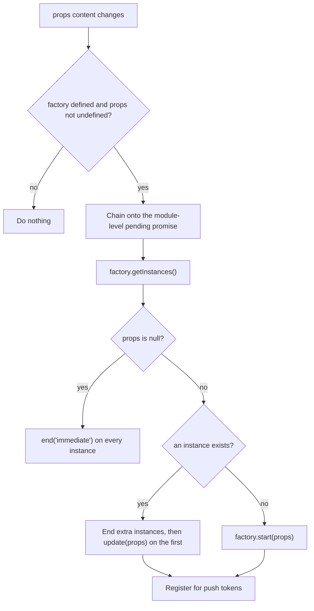
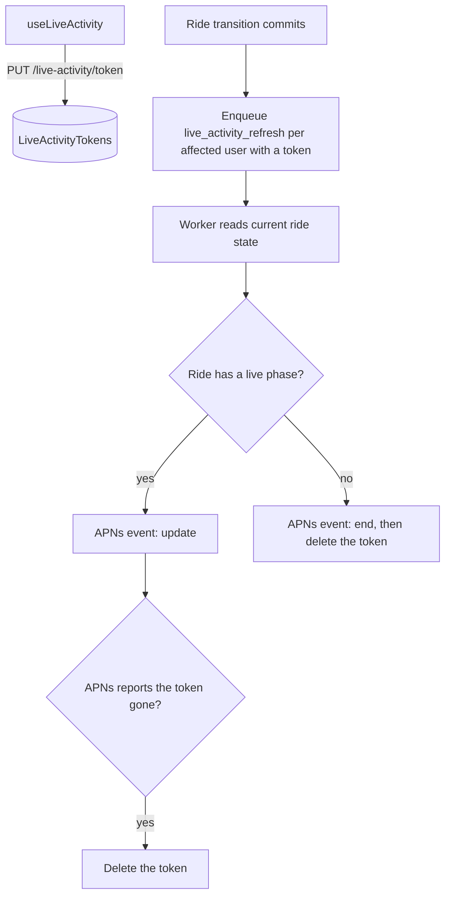

The app shows two iOS Live Activities. `RiderRideActivity` follows a rider's confirmed ride. `DriverOnlineActivity` follows a driver's shift. While the app runs, its JavaScript drives both: a hook turns data the app already has into props, and one shared hook starts, updates, or ends the activity to match. The shared hook also uploads each activity's ActivityKit push token to `yelo-api`. The API then pushes rider ride changes to the Lock Screen over APNs while the app is backgrounded. See [Background updates over APNs](#background-updates-over-apns).

For the widget extension target and its bundle IDs, see [Widgets, experiments, and client toggles](/engineering/mobile/widgets-and-experiments#native-target) and [Native configuration](/engineering/mobile/native-config). For the queries that feed the props, see [Rider and driver flows](/engineering/mobile/rider-and-driver-flows#polling-and-push).

## Pieces

| Piece | File | Role |
| --- | --- | --- |
| Layouts | `widgets/RiderRideActivity.tsx`, `widgets/DriverOnlineActivity.tsx` | `createLiveActivity(name, layout)` for each activity, plus the props types |
| Guarded exports | `widgets/index.ts` | Exports each factory, or `undefined` when the `ExpoWidgets` native module is missing |
| Sync hook | `hooks/useLiveActivity.ts` | Keeps one activity per factory showing the given props, and uploads its push token |
| Rider wiring | `hooks/ride/useRiderLiveActivity.ts`, called from `app/(app)/_layout.tsx` | Reads user status, ride details, and map details |
| Driver wiring | `hooks/drive/useDriverLiveActivity.ts`, called from `app/(app)/drive/_layout.tsx` | Reads `useDriveSession()` |
| Props builders | `lib/ride/riderLiveActivity.ts`, `lib/ride/driverLiveActivity.ts` | Pure functions from API data to props, each with a `.test.ts` beside it |
| Dev preview | `app/live-activity-preview.tsx` | Starts any state from fixture props |

## Lifecycle

`useLiveActivity(factory, props, kind, rideId?)` takes one of three kinds of `props`. `kind` is `rider` or `driver`. `rideId` is the ride a rider activity follows. `useRiderLiveActivity` passes `current_ride_id`, and the driver hook passes none.

| `props` | Meaning | Result |
| --- | --- | --- |
| An object | Show this content | Updates the existing activity, or starts one |
| `null` | Nothing should show | Ends every activity of that factory |
| `undefined` | Not known yet | Does nothing, and leaves any running activity alone |

The hook serializes `props` with `JSON.stringify` and uses the string as its effect key. A re-render with the same content does not touch the activity.



- **Syncs run one at a time.** Each sync awaits the previous one through a module-level `pending` promise. Two overlapping syncs could otherwise both see no activity and start two. The chain is shared by the rider and driver activities.
- **Every end is immediate.** The only dismissal policy used is `end('immediate')`.
- **Duplicates are cleaned up.** When more than one instance exists, the hook keeps the first and ends the rest.
- **Failures are logged, not thrown.** A failed sync logs `liveActivity.syncFailed` at info level with the `activity` kind (`rider` or `driver`) and the error. The code comment names two expected causes: Live Activities disabled in Settings, and a start attempted while the app is in the background.
- **Nothing ends on unmount.** The effect has no cleanup function. An activity ends only when a later sync receives `null`.

### Push token upload

After every update or start, the hook registers the activity for push updates and sends its ActivityKit push token to [`PUT /live-activity/token`](#token-endpoint):

- **On start and rotation.** The hook adds one push token listener per activity ID. The first token arrives a moment after start, and iOS may rotate it later. Each event uploads the new token.
- **On an activity that outlived the JS runtime.** The hook also calls `getPushToken()` on every sync. An activity that survived an app restart already has a token, so no listener event fires for it.
- **Deduplicated per kind.** A module-level map remembers the last token and ride ID uploaded for each kind. An unchanged pair is not sent again.
- **Retried on the next sync.** A failed upload logs `liveActivity.tokenUploadFailed` at info level with the `activity` kind and the error. It is not recorded as uploaded, so the next sync tries again.

The app never requests a push-to-start token. The API can update or end an activity the app started, but it can't start one.

## Background updates over APNs

`yelo-api` keeps the rider activity current while the app is backgrounded. It stores the push token the app uploads and, when a ride transition touches that rider, sends fresh content straight to APNs. Expo's push service doesn't relay Live Activity updates, so the API uses its own APNs client.



### Token endpoint

`PUT /live-activity/token` is an authenticated route that stores the push token of the activity the app started, or the token iOS just rotated.

```json
{
  "kind": "rider",
  "ride_id": "8b7f6c1e-2a4d-4f0e-9c3b-5d1a7e2f9b60",
  "token": "80f1a3c4..."
}
```

| Field | Rule |
| --- | --- |
| `kind` | `rider` or `driver` |
| `ride_id` | Required when `kind` is `rider`. The ride must be one the caller is the rider on. Ignored and stored as `NULL` for `driver`. |
| `token` | Non-empty hex string of at most 512 characters |

The API keeps one token per user and kind in [`LiveActivityTokens`](/reference/database/growth-notifications-and-messaging#liveactivitytokens). A new upload replaces the previous token of the same kind. A successful call returns `200` with `{"success": true}`. A validation failure returns `400`. A rider token for a ride the caller can view but isn't the rider on returns `403`. A ride with an assigned driver that the caller has no part in returns `401`, and an unknown ride returns `404`.

### Refresh job

When a ride transition commits, the ride revision finalizer enqueues one `live_activity_refresh` River job for each affected user that has a stored token. The insert runs in the ride transaction, so the job exists only if the ride change commits. It runs even for a silent cancellation, because the Lock Screen follows the ride whether or not a push notification is sent. A process without a River client skips the enqueue rather than failing the ride command.

The job carries only the user ID and has at most 3 attempts. The worker reads the ride's current state when it runs, so a late, duplicate, or reordered job is harmless, and the next transition enqueues a fresh one.

For each rider token, the worker builds the same props the app builds:

| Ride status | APNs event | Content |
| --- | --- | --- |
| `confirmed`, `queued`, `driver_en_route`, `driver_waiting`, `in_progress`, `pending_rider_rating` | `update` | The [phase](#phases) and [props](#props) for that status |
| Any other status | `end` with an immediate dismissal date | `phase: "completed"`, then the API deletes the token |

For `driver_en_route` and `in_progress`, the worker reads map details for the ETA. If routing fails, it sends the update without an ETA rather than holding back the phase change. A `queued` ride uses the ride's `queue_eta_minutes` and `queue_position`. Unlike the app, the worker doesn't fall back to the map's queue position.

### When the API deletes a token

The API deletes a stored rider token when:

- It sends an `end` event because the ride no longer has a live phase.
- APNs responds with status `410`.
- APNs responds with reason `Unregistered`, `BadDeviceToken`, `DeviceTokenNotForTopic`, or `ExpiredToken`.

Any other APNs failure fails the job attempt, and River retries it.

<Warning>
  Driver tokens are stored but never pushed to. The worker skips every `driver` token, so the driver activity still updates only while the app runs.
</Warning>

### Configuration

Pushes need an APNs token-based (`.p8`) credential set through `APNS_PRIVATE_KEY`, `APNS_KEY_ID`, `APNS_TEAM_ID`, `APNS_BUNDLE_ID`, and `APNS_HOST`. When `APNS_PRIVATE_KEY` is empty, the API still stores tokens, but every refresh job does nothing and activities update only while the app is open. See [Configuration](/engineering/api/configuration#environment-variables).

## Rider activity

### Wiring

`app/(app)/_layout.tsx` calls the hook with the user status it already fetches:

```ts
useRiderLiveActivity(jwt ? userStatus : isLoadingJWT ? undefined : null);
```

| App state | Argument | Effect |
| --- | --- | --- |
| Signed in, status not loaded | `undefined` | Leaves any activity alone |
| Signed in, status loaded | `UserStatusDetails` | Syncs to the ride status |
| JWT still loading | `undefined` | Leaves any activity alone |
| Signed out | `null` | Ends the activity |

`useRiderLiveActivity` then:

1. Treats the user as not riding when `user_status` is `driving`. That yields `null` props and ends the rider activity.
2. Reads `current_ride_status` and `current_ride_id` from the status.
3. Enables `useRideGetRide` and `useRideGetMapDetails` for that ride only when the status maps to a phase. A `requested` draft never fetches for the activity.
4. Ignores ride details whose `id` differs from the current ride ID, so a cached response for a previous ride can't describe this one.

The hook passes only `enabled` to both queries and sets no `refetchInterval`. The content refreshes when something else refetches those queries.

### Phases

`riderLiveActivityProps` in `lib/ride/riderLiveActivity.ts` maps the ride status to a phase. Any other status, including `requested` and `complete`, returns `null`.

| Ride status | Phase | Title | Detail line | Progress |
| --- | --- | --- | --- | --- |
| `confirmed` | `matching` | **Finding your driver** | Pickup name | 0.1 |
| `queued` | `enroute` (queue variant) | **You're next in line**, or **N ride(s) ahead of you** | Driver name and vehicle | 0.25 |
| `driver_en_route` | `enroute` | **\<driver\> is on the way** | Vehicle | 0.4 |
| `driver_waiting` | `arrived` | **\<driver\> is here** | Vehicle | 0.6 |
| `in_progress` | `riding` | **To \<destination\>** | **Riding with \<driver\>** | 0.8 |
| `pending_rider_rating` | `completed` | **You've arrived** | **Thanks for riding with \<driver\>** | 1 |

The layout falls back to "your driver" when `driverName` is missing and "your destination" when `destination` is missing.

### Props

| Prop | Source |
| --- | --- |
| `phase` | The table above |
| `driverName` | `ride.driver.first_name` |
| `vehicle` | `"<color> <make> <model> · <license_plate>"` from `ride.vehicle` |
| `etaMinutes` | `ride.queue_eta_minutes` when the status is `queued`. Otherwise `map.duration` in seconds, rounded to minutes with a floor of 1. Absent when there are no map details. |
| `pickup`, `destination` | `ride.pickup.name`, `ride.destination.name` |
| `queuePosition` | `ride.queue_position`, falling back to `map.queue_position`. Set only when the status is `queued` and the position is non-zero. |

The layout shows the ETA only in the `enroute` and `riding` phases. The queue variant applies when the phase is `enroute` and `queuePosition` is at least 1. `queuePosition` 1 means next in line. A `queued` ride without a queue position renders the plain `enroute` copy.

### Layout

The Lock Screen banner is yellow (`#FAFE06`) with black text. Dynamic Island regions use yellow icons and text, except `expandedBottom`, which uses white text with a yellow progress bar or capsule.

| Region | Content |
| --- | --- |
| `banner` (Lock Screen) | Phase icon, title, and detail line. The ETA number with **MIN AWAY** (or **MIN LEFT** while riding) on the right. A progress bar below, replaced by a **Rate & tip \<driver\>** capsule when completed. |
| `compactLeading` | **Next** or **N ahead** in the queue variant, otherwise the phase icon |
| `compactTrailing` | **Rate** when completed, `N min` when an ETA shows, `…` while matching, otherwise the phase label |
| `minimal` | `Nm` when an ETA shows, otherwise the phase icon |
| `expandedLeading` | Phase icon and label |
| `expandedTrailing` | The ETA block, when an ETA shows |
| `expandedBottom` | Title, detail line, and the progress bar or **Rate & tip** capsule |

Phase labels are **Matching**, **In queue**, **En route**, **Here**, **Riding**, and **Arrived**. Icons are the SF Symbols `magnifyingglass`, `person.2.fill`, `car.fill`, `figure.wave`, `location.fill`, and `checkmark.circle.fill`.

## Driver activity

### Wiring

`useDriverLiveActivity` runs inside `MessagingProviderBridge` in `app/(app)/drive/_layout.tsx`, below `DriveProvider`. It reads `userStatus`, `currRide`, `currRideMapDetails`, `queueDetailRides`, and `rideQueue` from `useDriveSession()` and adds no queries of its own.

While `userStatus` is not loaded, the hook passes `undefined` and leaves any activity alone. The driver activity syncs only while the drive layout is mounted.

### Phases

`driverLiveActivityProps` in `lib/ride/driverLiveActivity.ts` uses the current ride only when `ride.id` equals `status.current_ride_id`.

| Condition | Phase | Title | Detail line |
| --- | --- | --- | --- |
| Offline and no ride in a mapped status | none (`null`) | | |
| Online, no ride in a mapped status, board empty | `online` | **You're online** | **Waiting for ride requests** |
| Online, no ride in a mapped status, board has rides | `online` | **N rides available** | **Open Yelo to accept** |
| Current ride is `driver_en_route` | `pickup` | **Pick up \<rider\>** | Pickup name |
| Current ride is `driver_waiting` | `arrived` | **Waiting for \<rider\>** | Pickup name |
| Current ride is `in_progress` | `dropoff` | **Drop off \<rider\>** | Destination name |

A driver with a current ride in one of the three mapped statuses gets an activity even when `driver_is_online` is false.

### Props

| Prop | Source |
| --- | --- |
| `phase` | The table above |
| `riderName` | `ride.rider.first_name`. The layout falls back to "rider". |
| `stopName` | `ride.destination.name` in `dropoff`, otherwise `ride.pickup.name` |
| `etaMinutes` | Absent in `arrived`. Otherwise `map.duration`, falling back to `ride.destination_duration` in `dropoff` or `ride.pickup_duration` in `pickup`. Seconds rounded to minutes with a floor of 1. |
| `rideFare` | `ride.discounted_price` when `is_discounted` (falling back to `price`), otherwise `ride.price`, rounded to whole dollars |
| `queueCount`, `queueFare` | Length of `queueDetailRides` and the sum of their `price`, rounded |
| `availableCount`, `availableFare` | Length of `rideQueue` (board rides the driver can still accept) and the sum of their `price`, rounded |
| `shiftEarnings` | `status.driver_earnings.daily_earnings`, rounded, defaulting to 0 |

The `online` phase carries only `phase` and the last five props. Money sums are rounded after adding, not per ride.

### Layout

The Lock Screen banner is blue (`#1166E2`) with white text. Dynamic Island regions use a lighter blue (`#7FB0F5`), except `expandedBottom`, which uses white text.

The layout picks one headline number, the hero. On a ride it is the ETA with the label **MIN**, when `etaMinutes` is set. While online with board rides it is `$<availableFare>` with the label **AVAILABLE**. Otherwise there is none.

| Region | Content |
| --- | --- |
| `banner` (Lock Screen) | Phase icon, title, detail line, and the hero on the right. A row of stat chips below. |
| `compactLeading` | Phase icon |
| `compactTrailing` | `N min` on a ride, the dollar amount while online, or the phase label when there is no hero |
| `minimal` | `Nm` on a ride, the dollar amount while online, or the phase icon when there is no hero |
| `expandedLeading` | Phase icon and label |
| `expandedTrailing` | The hero as one line, when there is one |
| `expandedBottom` | Title and detail on one line, then the stat chips |

| Stat chip | Shown | Value |
| --- | --- | --- |
| **THIS RIDE** | On a ride, when `rideFare` is set | `$<rideFare>` |
| **QUEUE** | Always | `<queueCount> · $<queueFare>`, or **Empty** |
| **AVAILABLE** | On a ride | `<availableCount> · $<availableFare>`, or **None** |
| **EARNED** | While online, when `shiftEarnings` is set | `$<shiftEarnings>` |

Phase labels are **Online**, **Pickup**, **Waiting**, and **Drop-off**. Icons are `steeringwheel`, `arrow.triangle.turn.up.right.diamond.fill`, `figure.wave`, and `location.fill`.

## Dev preview route

`app/live-activity-preview.tsx` is a dev-only gallery at `/live-activity-preview`. It starts any state with fixture props, so you can screenshot the layouts on a simulator without a real ride. The file sits outside the `(app)` group, so it does not need a session.

Open it by hand, or pass a scenario in the URL:

```bash
xcrun simctl openurl <udid> "yelo://live-activity-preview?scenario=driver-pickup"
```

The screen lists a row per scenario under **RIDER** and **DRIVER** headers, plus a `none` row. Tapping a row, or loading the route with `?scenario=`, ends every running rider and driver activity and then starts the chosen one.

| Scenario | Activity | Fixture |
| --- | --- | --- |
| `rider-matching` | Rider | `matching` |
| `rider-enroute` | Rider | `enroute`, ETA 4 |
| `rider-queued` | Rider | `enroute`, ETA 11, queue position 3 |
| `rider-queued-next` | Rider | `enroute`, ETA 6, queue position 1 |
| `rider-arrived` | Rider | `arrived` |
| `rider-riding` | Rider | `riding`, ETA 8 |
| `rider-completed` | Rider | `completed` |
| `driver-online-idle` | Driver | `online`, every count and amount 0 |
| `driver-online-board` | Driver | `online`, empty queue, 5 available for $68, $127 earned |
| `driver-pickup` | Driver | `pickup` at Sproul Hall, ETA 4 |
| `driver-arrived` | Driver | `arrived` at Sproul Hall |
| `driver-dropoff` | Driver | `dropoff` at Downtown BART, ETA 9 |
| `none` | Neither | Ends everything |

Rider fixtures use driver Maya, vehicle `White Corolla · 7XYZ123`, pickup Sproul Hall, and destination Downtown BART. Driver ride fixtures use rider Sam, a $14 fare, a queue of 3 for $42, 5 available for $68, and $127 earned.

The status line under the title starts as **Pick a state, then lock the device** and then reports the result:

| Status text | Cause |
| --- | --- |
| `Showing <scenario>` | The activity started |
| `Ended` | The scenario was `none` |
| `Unknown scenario: <scenario>` | No fixture has that name |
| `ExpoWidgets native module missing: rebuild the dev client` | Either factory is `undefined` |
| `Failed: <error>` | Ending or starting threw. Also logs `liveActivityPreview.failed` at warn level. |

Each row has the test ID `live-activity-<scenario>`, and the status line has `live-activity-status`.

<Note>
  In a build where `__DEV__` is false, the route renders `<Redirect href="/" />` and the `scenario` effect does nothing.
</Note>

## Platform gating

- **The only gate is the native module.** `widgets/index.ts` calls `requireOptionalNativeModule('ExpoWidgets')`. When it returns nothing, both factories are `undefined`, and `useLiveActivity` skips every sync. None of these files check `Platform.OS`.
- **Older binaries are safe.** The guard exists because binaries built before `expo-widgets` was added lack the module, and both `expo-widgets` and `@expo/ui` touch native code at import time. The code comment dates this to builds before 5.6.1.
- **The root layout registers the layouts.** `app/_layout.tsx` imports `@/widgets` for its side effect at startup.
- **Layouts run in the extension.** Each layout function carries the `'widget'` directive. It is serialized to a string and evaluated inside the widget extension, so it can't close over anything in its module. Colors and helpers are declared inside the function.

## Where this lives in code

| Concern | Path |
| --- | --- |
| Layouts and props types | `yelo-frontend/widgets/RiderRideActivity.tsx`, `widgets/DriverOnlineActivity.tsx` |
| Native module guard | `yelo-frontend/widgets/index.ts` |
| Sync hook and token upload | `yelo-frontend/hooks/useLiveActivity.ts` |
| Rider hook and props | `yelo-frontend/hooks/ride/useRiderLiveActivity.ts`, `lib/ride/riderLiveActivity.ts` |
| Driver hook and props | `yelo-frontend/hooks/drive/useDriverLiveActivity.ts`, `lib/ride/driverLiveActivity.ts` |
| Props tests | `yelo-frontend/lib/ride/riderLiveActivity.test.ts`, `lib/ride/driverLiveActivity.test.ts` |
| Mount points | `yelo-frontend/app/(app)/_layout.tsx`, `app/(app)/drive/_layout.tsx` |
| Registration at startup | `yelo-frontend/app/_layout.tsx` |
| Dev preview | `yelo-frontend/app/live-activity-preview.tsx` |
| Driver data sources | `yelo-frontend/providers/DriveProvider.tsx` |
| Token endpoint | `yelo-api/internal/server/http/liveactivity/handler.go` |
| Token storage and refresh | `yelo-api/internal/service/liveactivity/liveactivity.go`, `rider.go` |
| APNs client | `yelo-api/internal/utilities/notification/apns.go` |
| Refresh job and worker | `yelo-api/internal/notify/jobs.go`, `internal/notify/queue/queue.go` |

## Gotchas and edge cases

<AccordionGroup>
  <Accordion title="Driver content goes stale in the background">
    The API pushes only rider activities. The driver queries that feed the driver props (ride board, queue detail, map details) all set `refetchIntervalInBackground: false`. A driver activity on the Lock Screen keeps its last content until the app runs a sync again. Rider activities also stay stale in the background when `APNS_PRIVATE_KEY` is unset.
  </Accordion>
  <Accordion title="The server props must match the layout">
    The API builds rider props itself to mirror `riderLiveActivityProps`. The layouts ship over the air, so field names and phases are a contract: only ever add fields.
  </Accordion>
  <Accordion title="The driver ETA depends on the drive map being visible">
    `DriveProvider` polls map details only while the path is `/drive` and the screen is presented. On other drive screens, `etaMinutes` comes from whatever map details are cached, or from `pickup_duration` and `destination_duration` on the ride.
  </Accordion>
  <Accordion title="Leaving the drive layout does not end the driver activity">
    `useLiveActivity` has no unmount cleanup, and only the drive layout syncs `DriverOnlineActivity`. Going offline while the layout is mounted ends it. Unmounting the layout does not.
  </Accordion>
  <Accordion title="A driving user never gets the rider activity">
    The rider hook returns `null` props whenever `user_status` is `driving`. That ends any rider activity, even when the status also carries a ride.
  </Accordion>
  <Accordion title="Mismatched ride details fall back to online">
    When `currRide.id` differs from `status.current_ride_id`, the driver props use the `online` phase. An offline driver in that state gets no activity until the ride details catch up.
  </Accordion>
  <Accordion title="A zero duration shows as one minute">
    Both builders floor the ETA at 1 minute. A `map.duration` of 0 is treated as a real "pulling up" reading. Only missing data produces no ETA.
  </Accordion>
  <Accordion title="The board title is not pluralized">
    The `online` title is always `N rides available`, including when `availableCount` is 1.
  </Accordion>
  <Accordion title="Rate and tip is not a button">
    The **Rate & tip** capsule is text and an icon. Neither layout defines a button or a link.
  </Accordion>
  <Accordion title="The preview and the hooks share the same activities">
    The preview calls `start` and `end` directly and does not use the hook's `pending` chain. A later sync from `useRiderLiveActivity` or `useDriverLiveActivity` updates or ends a previewed activity of the same type. `StatusGuard` can also move a signed-in user whose status is `driving` from the preview route to `/drive`.
  </Accordion>
  <Accordion title="A missing native module is silent">
    When `ExpoWidgets` is missing, the factories are `undefined` and no log line is written. The preview route is the only place that reports it.
  </Accordion>
</AccordionGroup>
