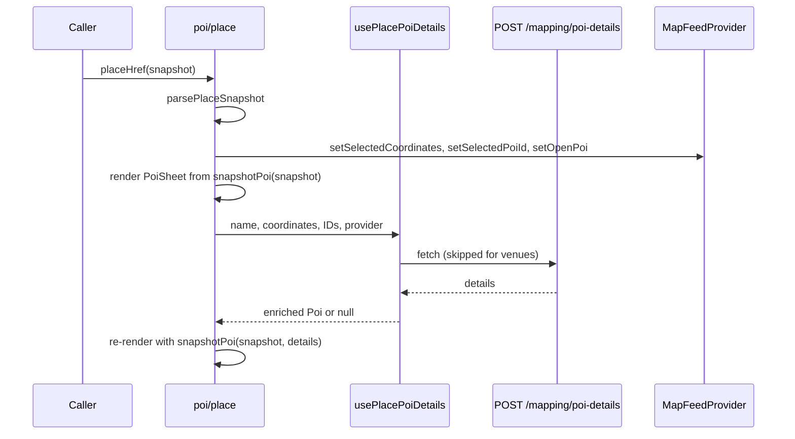

Tapping a pin, a basemap label, a feed card, or a search result on the rider map opens a detail screen inside the map tab's glass sheet. This page covers the three detail routes under `app/(app)/(tabs)/map/` and the helpers behind them.

For the server side of search, retrieve, enrichment, and likes, see [Search and places](/engineering/location/search-and-places). For the camera, snap points, and pan-to-dismiss behavior that every detail screen shares, see [Map tab internals](/engineering/mobile/map-tab-internals). For the route list, see [Screen catalog](/engineering/mobile/screen-catalog#home-and-map).

## Routes

| Route | Component | Opens from | Top bar |
| --- | --- | --- | --- |
| `map/poi/place` | `MapBasemapPoiDetail` | Every `placeHref` caller: pins, basemap taps, search, feed cards | `PoiTopBar` (close) |
| `map/poi/[poiId]` | `MapPoiDetail` | The bump sheet, for a spot that has a `poiId` but no coordinates | `PoiTopBar` (close) |
| `map/vehicle/[vehicleId]` | `VehicleDetail` | A Yelo vehicle marker in `VehiclesLayer` | `BackOnlyTopBar` (back) |

All three are registered in `map/_layout.tsx` with `animation: 'none'`. Both top bars call `dismissToMapFeed`, which runs `router.dismissAll()` when the stack can dismiss and otherwise replaces the route with `/(app)/(tabs)/map`. The fallback covers a detail screen that is the stack root.

Both POI routes render the same `PoiSheet`. They differ only in how they resolve the place.

## Place snapshots

`lib/map/poi/placeSnapshot.ts` defines `PlaceSnapshot`, the one shape that navigation, list rows, and saved locations pass around. A place opens from its snapshot alone. Provider details are optional enrichment.

| Field | Meaning |
| --- | --- |
| `name`, `latitude`, `longitude` | Required |
| `id` | The source row's identity, such as a like ID or a venue key |
| `mapbox_id` | The legacy provider reference. It may hold a Google ID |
| `provider` | `'mapbox'` or `'google'`. Only a raw basemap tap sets `'mapbox'` |
| `yelo_place_id` | The catalog UUID, when the source row has one |
| `address`, `categories` | Optional display data |
| `community` | The pin came from the community POI list |
| `venue` | The pin is an event venue |

### Navigation

`placeHref(place, extra)` returns an href to `map/poi/place` with one `snapshot` param: the JSON from `serializePlaceSnapshot`. Extra params ride alongside it.

| Extra param | Set by | Effect in `PoiSheet` |
| --- | --- | --- |
| `room: '1'` | `FeaturedSpotOverlay`, `FeaturedSpotAuraLayer` | Shows the **Unlock** button next to **Ride** and treats the place as auto-liked |
| `releaseAt` | Same callers, as epoch milliseconds | Drives the locked countdown on the **Unlock** button |
| `animateIn: '1'` | No caller sets it today | Fades the sheet content in over 260 ms |

`parsePlaceSnapshot` reads the params back:

- It rejects a `snapshot` string longer than 16,384 characters.
- Without a `snapshot` param, it builds one from the legacy `name`, `latitude`, and `longitude` params.
- It returns `null` when JSON parsing throws or `validPlaceSnapshot` fails.

`validPlaceSnapshot` enforces these limits:

| Field | Rule |
| --- | --- |
| `name` | Non-blank string, at most 256 characters |
| `latitude`, `longitude` | Finite numbers within ±90 and ±180 |
| `provider` | Absent, `'mapbox'`, or `'google'` |
| `yelo_place_id` | Absent or a UUID |
| `id`, `mapbox_id`, `address` | Absent or a string of at most 1,024 characters |
| `categories` | Absent or at most 32 strings of at most 64 characters each |
| `community`, `venue` | Absent or boolean |

An invalid snapshot renders `PoiSheetNotFound`: **Couldn't find this place**, with "This link is missing location details. Try opening the spot from the map."

### Identity

Two functions produce keys, and they answer different questions.

| Function | Result | Used for |
| --- | --- | --- |
| `placeSelectionId` | `id`, else `place:{mapbox_id}`, else `place:{lat6}:{lng6}:{name}` | The selected POI ID in `MapFeedProvider` and the `Poi.id` on the sheet |
| `placeIdentityKey` | `yelo:{yelo_place_id}`, else `snapshot:{lat5}:{lng5}:{lowercased trimmed name}` | Cross-source de-duplication in `PinnedMarkersLayer` |

`placeIdentityKey` never treats a provider ID or a shared address as identity.

### Merging enrichment

`snapshotPoi(place, details)` builds the `Poi` the sheet renders. The snapshot always wins on `name`, `latitude`, and `longitude`, so enrichment can't move or rename the selected pin. The `id` is always `placeSelectionId(place)`.

| Field | Rule |
| --- | --- |
| `address` | The snapshot's, else the details' |
| `mapbox_id`, `yelo_place_id` | The snapshot's, else the details' |
| `categories` | `mergeCategories`, in an order that depends on the source (see below) |
| `pin` | The details' pin, else a neutral `mapPin` |
| Everything else | Spread from the details: hours, rating, price, photos, description, attribution |

A raw map selection is the exception. When `provider` is `'mapbox'` and the snapshot has no `yelo_place_id`, the details' `address`, `mapbox_id`, and `yelo_place_id` are not copied. The tap hasn't been registered under the provider's catalog ID.

`mergeCategories(base, fallback)` in `lib/map/poi/mergeCategories.ts` keeps `base` when it resolves to a category other than `misc`, and otherwise uses `fallback` when that one is specific. The snapshot's categories are the base for community pins, venues, and anything tagged `frat` or `sorority`. For every other place, the enrichment's categories are the base.

## Entry points

Every caller except the bump sheet's fallback goes through `placeHref`. Most also call `setSelectedCoordinates` first, which makes the layout fly the camera. See [Focus and fly-to](/engineering/mobile/map-tab-internals#focus-and-fly-to).

| Source | File | Snapshot notes |
| --- | --- | --- |
| Basemap label tap | `map/_layout.tsx` (`handleBasemapPoiPress`) | `provider: 'mapbox'`. Heavy haptic |
| Community, saved, top, and friend-liked pins | `components/map/pinned/PinnedSymbolsLayer.tsx` | The pin itself. Community pins carry `community: true`. Heavy haptic |
| Event venue marker | `components/map/pinned/EventMarker.tsx` | `id` is the venue key, `venue: true` |
| Community move marker | `components/map/CommunityMovesLayer.tsx` | The feature's `place` property when it parses, else name and coordinates |
| Search result, recent, or pinned row | `map/index.tsx` (`handleSelectLocation`) | `provider` cleared. Live suggestions are retrieved first. See [Search pipeline](/engineering/mobile/rider-experience#search-pipeline) |
| Likes rail | `components/map/feed/MapFeedLikesRail.tsx` | Own likes, plus friend-liked spots with `id` set to `friend-liked-{id}` |
| Moves and activity cards | `MapFeedMovesCard.tsx`, `MapFeedActivityCards.tsx` | The ride destination or the place on the card |
| Featured spot banner and marker | `FeaturedSpotOverlay.tsx`, `FeaturedSpotAuraLayer.tsx` | Adds `room` and `releaseAt` |
| Bump sheet spot | `components/bottom-sheets/BumpFriendsBottomSheet.tsx` | With coordinates: `placeHref`, with `mapbox_id` set to the bump's `poiId`. Without coordinates: `map/poi/[poiId]` |

### Basemap tap lookup

Mapbox Standard's own POI labels can't be hit-tested through the installed wrapper. `queryBasemapPoi` in `components/map/customMapView/basemapPoi.ts` approximates it with a nearby lookup against the Streets tileset:

- It calls the Mapbox Tilequery API on `mapbox.mapbox-streets-v8`, layer `poi_label`, with a 40 m radius (`POI_TILEQUERY_RADIUS_M`) and `limit=5`.
- It times out after 2,500 ms (`POI_TILEQUERY_TIMEOUT_MS`).
- It returns the nearest feature that is a `Point` with a non-blank name of at most 256 characters and in-range coordinates.
- The result's `id` is `mapbox:streets-v8:poi_label:{feature id}` when the feature has an ID.
- Any HTTP error, timeout, or exception returns `null`. Nothing opens.

`CustomMapView.handleMapPress` fires the background-press dismiss immediately, then runs the lookup behind it. A new tap or an unmount aborts the pending lookup, so a slow response can't open a sheet for an old tap.

## The place route

`map/poi/place` renders from the snapshot on the first frame and layers enrichment on when it arrives.

- The route sets `selectedCoordinates` itself, because it can also open from outside the map, where no caller seeded the camera.
- Enrichment is disabled when the snapshot has `venue: true`.
- `isCommunityPoi` on the sheet comes from the snapshot's `community` flag.
- The body is `PoiSheet` whenever the snapshot is valid. There is no skeleton on this route.

## The POI ID route

`map/poi/[poiId]` has only an ID, so it resolves the place from data the app already holds. The first match wins.

| Order | Source | Matches when | Enriched |
| --- | --- | --- | --- |
| 1 | Likes (`GET /user/likes`) | The like's `id` or `mapbox_id` equals `poiId` | Yes |
| 2 | Venues with feed items (`useVenuesWithFeedItems`) | `venueKey` equals `poiId` | No |
| 3 | Community POIs (`useCommunityPois`) | The POI's `id` equals `poiId` | Yes |
| 4 | Friend-liked spots (`useFriendActivity`) | `poiId` is `friend-liked-{id}`, `friend-liked-{mapboxId}`, or the `mapboxId` | Yes |
| 5 | Top locations (`MapFeedProvider`) | `poiId` is `top-{id}`, the `id`, or the `mapbox_id` | Yes |

Sources 1 to 3 also compute a straight-line distance from the last device position, and an ETA at 10 m/s (`URBAN_SPEED_MPS`).

When the place is enriched, the base keeps its identity fields (`id`, `pin`, `mapbox_id`, coordinates, and name). The enrichment supplies the description, photos, rating, rating count, price, and hours, and fills the address and `yelo_place_id` only when the base lacks them. Categories go through `mergeCategories` with the same base-selection rule as `snapshotPoi`. The result is marked `attribution: 'google'`.

### Body states

| State | Renders |
| --- | --- |
| Place resolved | `PoiSheet`, with `detailsLoading` while enrichment fetches |
| Place no longer in its source list, but shown earlier | `PoiSheet` with the retained copy |
| Likes, community POIs, or friend activity still pending | `PoiSheetSkeleton` |
| Nothing matched | `PoiSheetNotFound` |

The retained copy lives in a ref keyed by `poiId`. Unliking a place removes it from the likes query, and the sheet would otherwise blank out. Navigating to a different ID clears it.

## Enrichment

`usePlacePoiDetails` in `components/map/poi/usePlacePoiDetails.ts` wraps `POST /mapping/poi-details` (`mappingPOIDetails`) in a React Query. The server behavior is in [POI enrichment](/engineering/location/search-and-places#poi-enrichment).

| Setting | Value |
| --- | --- |
| Request body | `name`, `latitude`, `longitude`, `place_id` (the snapshot's `mapbox_id`), `yelo_place_id`, `provider` |
| Query key | `['mapping', 'poi-details', provider, yeloPlaceId, placeId, name, latitude, longitude]` |
| Enabled | `enabled` is true, the name is non-empty, and both coordinates are finite |
| Retries | None (`retry: false`) |
| Stale time | 1 hour (`POI_DETAILS_STALE_MS`) when the response has a `place_id`, otherwise 0 |
| Cancellation | The query's abort signal is passed to the request |

### Response mapping

The hook returns a `Poi` only when `details.place_id` is present.

| `Poi` field | Source |
| --- | --- |
| `id` | `details.yelo_place_id`, else `details.place_id` |
| `mapbox_id` | `details.place_id`. The legacy field keeps the provider reference that save and like use |
| `description` | `details.summary` |
| `rating`, `ratingCount` | `details.rating`, `details.user_rating_count` |
| `price` | `price_level` 2 to 5 becomes `$` to `$$$$`. Lower or missing levels show nothing |
| `hours` | `computeOpenStatus`, else the cached `open_now` (see [Hours](#hours)) |
| `photos` | `details.photo_urls`, with empty entries dropped |
| `pin` | A yellow `mapPin` (`BASEMAP_POI_PIN`) |
| `attribution` | `'google'` |

### Failure and recovery

The hook separates three outcomes.

| Hook state | Condition | `poi` |
| --- | --- | --- |
| `isLoading` | The query is fetching | The previous value, if any |
| `isUnavailable` | A successful response with no `place_id`, or a 404 | `null` |
| `isError` | Any other failure, once fetching stops | `null` |

In every failure case the sheet keeps rendering the snapshot. A failed enrichment never replaces a usable place with the not-found page.

<Warning>
The hook also returns `isError`, `isUnavailable`, and `retry` (a `refetch` that doesn't cancel an in-flight request). Neither POI route reads them. Both destructure only `poi` and `isLoading`, so the sheet has no error message and no retry button.
</Warning>

Recovery today is implicit:

- A snapshot-only response has a stale time of 0, so React Query refetches it the next time the same place mounts.
- A failed first fetch leaves no data, so the stale time is 0 and the next mount fetches again.
- An enriched response stays fresh for 1 hour and is not refetched on re-taps.

## The sheet

`PoiSheet` (`components/map/poi/PoiSheet.tsx`) has a pinned header, a scrolling body, and a **Ride** button docked outside the sheet.

### Collapsed and expanded layouts

The sheet cross-fades between two layouts as it moves from the peek snap to the resting snap. `useSheetExpandProgress` in `sheetTransition.ts` reads the layout's position-derived `feedPeekProgress`, and falls back to Gorhom's `animatedIndex` outside the map layout. See [Snap points](/engineering/mobile/map-tab-internals#snap-points).

| Constant | Value | Meaning |
| --- | --- | --- |
| `SHEET_FADE_INPUT` | `[0.15, 0.5]` | The progress range the opacity cross-fade runs over |
| `SHEET_EXPANDED_THRESHOLD` | `0.32` | Above this, the expanded controls take touches. Below it, the collapsed ones do |

| Layout | Header controls | Body |
| --- | --- | --- |
| Collapsed | Name plus a compact **Ride** button. Tapping the rest of the header expands the sheet | Hidden, no touches |
| Expanded | Name plus the send and heart buttons | Visible, with the docked **Ride** button |

### Body content

The body renders these rows in order. Each appears only when its data exists.

1. **Loading extra details…** with a loader, while enrichment is fetching and the sheet is expanded.
2. The status row: the hours chip, then `★ {rating}` with the rating count in parentheses and the price.
3. The description.
4. A horizontal photo rail. Tapping a photo opens `YeloPhotoViewer` at that index.
5. The address.
6. **Upcoming here**: the feed items for a venue whose `venueKey` equals the POI's `id`.
7. **Powered by Google**, when `attribution` is `'google'`.

The sheet measures its header and body and reports the total through `setContentHeight`, so a short sheet doesn't cover the map. It clears the value on unmount.

### Ride button

`useGetRide` pushes `map/request` with the POI serialized as the `dropoff` param (`serializeRideStop`). The compact header button and the docked `RidePillButton` share it. See [Request sheet](/engineering/mobile/rider-experience#request-sheet).

The docked button is published through `setSheetOverlay` on focus and cleared on blur. A ride request pushed on top would otherwise leave the button floating over the new screen.

### Unlock button

When the route has `room: '1'`, the docked row splits in half between **Ride** and `UnlockRoomButton`. While `releaseAt` is in the future, the button shows a lock and a live countdown and takes no touches. After that it becomes a tappable **Unlock** button.

<Note>
The unlocked button's `onPress` is an empty function in `PoiSheet`. The unlock flow is not wired.
</Note>

### Send button

The send button opens `BumpFriendsBottomSheet` with a custom location built from the POI. The location's `poiId` is `yelo:{yelo_place_id}` when the place has a catalog ID, else `mapbox_id`, else the POI's `id`. See [Friend bumps](/engineering/mobile/social-and-contacts#friend-bumps).

## Hours

`computeOpenStatus` in `lib/map/poi/poiHours.ts` works out open or closed at render time from Google's opening-hours periods. The server caches place details for days, so a cached `open_now` flag goes stale.

- **Input.** Periods with `open_day` and `close_day` (0 is Sunday) and `open_minute` and `close_minute` (minutes since midnight), plus the place's `utc_offset_minutes`.
- **Always open.** Any period with `close_day` of `-1` returns open with the text `24 hours`.
- **Local time.** "Now" is shifted by the UTC offset and converted to minutes into the week.
- **Intervals.** Each period becomes a week-minute interval. A close at or before the open wraps into the next week. Each interval is also checked shifted back one week, so Saturday 9 PM to Sunday 2 AM matches Sunday 1 AM.
- **Open.** The text is `until {close}`.
- **Closed.** The text is `until {next open}`, using the soonest upcoming open.
- **Boundary format.** Time only (`9 PM`, `9:30 PM`) when the boundary is within 24 hours. Otherwise the weekday comes first (`Mon 9 AM`).
- **No periods.** The function returns `undefined`.

When there are no periods, `usePlacePoiDetails` falls back to `details.open_now` with the text `now`. When that is also missing, the sheet shows no chip.

`PoiStatusChip` renders **Open** in green or **Closed** in red, followed by the text.

## Likes

`PoiHeader` owns the heart. It has two modes.

| Mode | Applies to | State | Toggle |
| --- | --- | --- | --- |
| Hidden set | Community POIs (`isCommunityPoi`) and room spots (`room: '1'`) | Liked unless the POI's `id` is in the hidden set | `hide` or `unhide` in `useHiddenCommunityPois`. No API call |
| Real like | Everything else | `findSavedMatch` finds the place in `GET /user/likes` | `POST /user/likes` or `DELETE /user/likes/{id}` |

The matching rules for `findSavedMatch` are in [Other helpers](/engineering/mobile/map-tab-internals#other-helpers). The server rules are in [Recents and likes](/engineering/location/search-and-places#recents-and-likes).

### Real likes

Both mutations update the likes query cache optimistically and roll back on failure.

| Action | Optimistic change | Request | On failure |
| --- | --- | --- | --- |
| Like | Prepends a stub with `id` of `temp-{timestamp}` | `POST /user/likes` with `name`, `address`, `categories`, `latitude`, `longitude`, `mapbox_id` | Restores the cache. Snackbar: **Couldn't save — try again** |
| Unlike | Removes the matched like | `DELETE /user/likes/{id}` | Restores the cache. Snackbar: **Couldn't unsave — try again** |

A success invalidates the likes query. The like request carries the categories so the saved pin keeps its real icon. It does not send `yelo_place_id`.

### Hidden community POIs

`hooks/useHiddenCommunityPois.ts` keeps one module-level store per user, so every hook instance sees the same set. It persists to AsyncStorage under `community-pois:hidden:{userId}`, with writes debounced 150 ms. `CommunityPoisLayer` reads the same set to decide which community pins draw a heart.

### Reported state

`PoiHeader` reports the result through `setSelectedPoiSaved` and resets it to `false` on unmount. The open-POI marker reads it to decide whether to draw the heart.

## Friend activity

`useFriendActivity` (`hooks/useFriendLocations.ts`) selects `moves` and `likedSpots` from the shared `GET /map/friends` query. The server side is in [Friends layer](/engineering/location/map-layers-and-mobility#friends-layer).

The detail sheets use it in one place: `map/poi/[poiId]` resolves a friend-liked spot by ID, and waits on the query before showing not-found.

Friend-liked spots reach the sheet as ordinary snapshots:

| Surface | ID | Friend attribution |
| --- | --- | --- |
| Likes rail (`MapFeedLikesRail`) | `friend-liked-{spot.id}` | A subtitle from `likedByLabel`, on the rail card only |
| Map pin (`PinnedMarkersLayer`) | `friend-liked-{spot.id}` | None |

The rail drops a friend-liked spot when the rider already likes a place with the same `mapbox_id`.

<Note>
The sheet itself shows no friend attribution. The `Poi` type has `savedByFriends`, `friendsVerb`, and `savedCount` fields, but nothing sets or renders them.
</Note>

## Open-POI marker

While a place sheet is open, one marker represents it on the map, whatever layer it came from.

- **Publishing.** Both POI routes call `setOpenPoi` with the display coordinates and categories, and clear it on unmount. `poi/place` also passes the tapped coordinates as `sourceCoordinates`. Venues publish `null`, because `EventMarker` already draws them.
- **Rendering.** `OpenPoiMarker` draws one symbol with the category sprite, using the saved variant when `selectedPoiSaved` is true. Liking swaps the heart without moving or re-animating the pin.
- **Pop-in.** The icon grows from 1× to 1.8× (`SELECTED_SCALE`) over 380 ms with an overshoot. With reduced motion, or when the presentation isn't active, it starts at 1.8×.
- **Clearance.** The symbol reserves 20 px of collision padding, so nearby pins that allow culling drop away.
- **Suppression.** `isOpenPoiLocation` in `lib/map/poi/openPoiSuppression.ts` matches a pin to the open POI's `coordinates` or `sourceCoordinates` at 5 decimal places. `CommunityPoisLayer` and `PinnedMarkersLayer` skip matching pins, so the place never draws twice.
- **Exceptions.** The marker doesn't render on the ride request route. It also yields when the open POI is within 0.0001° of the featured spot, which draws its own marker.

## Fleet vehicle sheet

`map/vehicle/[vehicleId]` shows the fleet behind a tapped vehicle.

### Opening

`VehiclesLayer` handles the tap:

- Only vehicles with `isYelo` open the sheet. Third-party vehicles are not interactive.
- Tapping the vehicle that is already focused calls `router.back()`.
- With another friend or vehicle focused, the route is replaced. Otherwise it is pushed.

The screen sets the map focus to `{ type: 'vehicle', id }` and clears it on unmount only if the focus is still its own. The camera then follows the vehicle. See [Entity follow](/engineering/mobile/map-tab-internals#entity-follow).

### Data

The sheet makes no request of its own.

| Value | Source |
| --- | --- |
| Vehicle | `useVehicleLocations()`, the shared `GET /map/vehicles` query, found by `id` |
| Fleet count | Vehicles with the same `fleet_name` whose `status` isn't `in_ride` |
| Distance | `calculateDistance` (straight-line miles) from the last device position to the vehicle |
| ETA | Distance at a fixed speed per vehicle type, rounded, with a 1-minute minimum |
| Zone | `useCurrentZone`: the rider's position tested against the community's zones |

The sheet doesn't pass `poll`, so it adds no timer. Only the map layout polls, every 60 seconds (`VEHICLES_LAYER_POLL_MS`). See [Vehicles layer](/engineering/location/map-layers-and-mobility#vehicles-layer).

| Vehicle `type` | Assumed speed |
| --- | --- |
| `x`, `xl` | 25 mph |
| `van` | 20 mph |
| `cart` | 10 mph |
| Anything else | 20 mph (`DEFAULT_MPH`) |

`useCurrentZone` (`hooks/useCurrentZone.ts`) ray-casts the position against each active zone's outer ring. It returns the containing zone with the highest `priority`, breaking ties by the lower ID, or `null`. See [Zones geometry](/engineering/location/zones-geometry).

### Layout

| Element | Content |
| --- | --- |
| Title | **{Fleet} is nearby**, with the fleet name capitalized |
| Subtitle | Operating hours text |
| Coverage button | Calls `seeCoverage`, which stops following and fits the camera to the user and the community box |
| Info button | Opens `FleetBioBottomSheet` |
| Zone pill | The zone's name tinted with the zone's color, or **Outside zone** in red |
| Count pill | **{N} vehicles online** (or **1 vehicle online**) |
| ETA pill | **~{N} min away**, hidden without a device position or vehicle type |
| **Ride** button | Opens search and dismisses to the map feed |

When the vehicle isn't in the query data, the screen shows **Vehicle not found**.

<Warning>
The fleet's hours and bio are hardcoded in the screen, because the API has no fields for them. `FLEET_OPERATING_HOURS` has entries for `yelo` (**Open · 24 hours**) and `breeze` (**Open · 6am – 12am**), and falls back to **Hours unavailable**. `FLEET_BIO` holds text that starts with the literal word "Placeholder:". Riders see that text in the bio sheet.
</Warning>

## Where this lives in code

| Concern | Path |
| --- | --- |
| Place route | `yelo-frontend/app/(app)/(tabs)/map/poi/place.tsx` |
| POI ID route | `yelo-frontend/app/(app)/(tabs)/map/poi/[poiId].tsx` |
| Vehicle route | `yelo-frontend/app/(app)/(tabs)/map/vehicle/[vehicleId].tsx` |
| Snapshot type, validation, identity, href, merge | `yelo-frontend/lib/map/poi/placeSnapshot.ts` |
| Hours | `yelo-frontend/lib/map/poi/poiHours.ts` |
| Category merge, pin suppression, `Poi` type | `yelo-frontend/lib/map/poi/` (`mergeCategories.ts`, `openPoiSuppression.ts`, `types.ts`) |
| Basemap tap lookup | `yelo-frontend/components/map/customMapView/basemapPoi.ts`, `components/map/CustomMapView.tsx` |
| Enrichment hook | `yelo-frontend/components/map/poi/usePlacePoiDetails.ts` |
| Sheet, header, and states | `yelo-frontend/components/map/poi/` (`PoiSheet`, `PoiHeader`, `PoiStatusChip`, `PoiTopBar`, `PoiBottomBar`, `PoiSheetSkeleton`, `PoiSheetNotFound`, `UnlockRoomButton`, `sheetTransition.ts`, `useGetRide.ts`) |
| Open-POI marker | `yelo-frontend/components/map/poi/OpenPoiMarker.tsx` |
| Community POI query and layer | `yelo-frontend/components/map/poi/` (`useCommunityPois.ts`, `queryConfig.ts`, `CommunityPoisLayer.tsx`) |
| Like matching and hidden set | `yelo-frontend/lib/map/savedLocationsMatch.ts`, `hooks/useHiddenCommunityPois.ts` |
| Friend activity and vehicles | `yelo-frontend/hooks/useFriendLocations.ts`, `hooks/useVehicleLocations.ts`, `lib/map/mapLayers.ts` |
| Vehicle tap, zone, bio sheet | `yelo-frontend/components/map/VehiclesLayer.tsx`, `hooks/useCurrentZone.ts`, `components/bottom-sheets/FleetBioBottomSheet.tsx` |
| Close behavior | `yelo-frontend/components/map/dismissToMapFeed.ts` |

## Gotchas and edge cases

<AccordionGroup>
  <Accordion title="Enrichment errors have no UI">
    `usePlacePoiDetails` distinguishes an outage from a place with no Google match and exposes `retry`. No screen consumes them. A failed lookup looks the same as a place with no extra details.
  </Accordion>
  <Accordion title="mapbox_id is not always a Mapbox ID">
    `mapbox_id` is the legacy provider reference. Enrichment writes Google's `place_id` into it, and the bump sheet can write a `yelo:{uuid}` reference into it.
  </Accordion>
  <Accordion title="A yelo: bump ID without coordinates doesn't resolve">
    The send button prefers `yelo:{yelo_place_id}` as the bump's `poiId`. `map/poi/[poiId]` matches only like IDs, like `mapbox_id` values, venue keys, community POI IDs, friend-liked IDs, and top-location IDs. A bump that arrives with that `poiId` and no coordinates shows the not-found state.
  </Accordion>
  <Accordion title="Distance and ETA are computed but not shown">
    Both POI paths compute `distanceMeters` and `etaSeconds` at 10 m/s. `PoiSheet` and `PoiHeader` never render them.
  </Accordion>
  <Accordion title="Unused Poi fields">
    `lib/map/poi/types.ts` carries a TODO to delete the file once generated POI types exist. Its `contacts`, `event`, `photoCount`, `savedByFriends`, `friendsVerb`, and `savedCount` fields are never set or rendered.
  </Accordion>
  <Accordion title="Unliking a community POI is device-local">
    The hidden set lives in AsyncStorage per user. It doesn't sync, so the heart returns on another device or after a reinstall.
  </Accordion>
  <Accordion title="The basemap lookup is approximate">
    The lookup queries the Streets v8 tileset, not the Standard style's rendered labels. A tap can resolve to a POI up to 40 m away, or to nothing when the visible label has no Streets counterpart.
  </Accordion>
  <Accordion title="The vehicle Ride button doesn't select the fleet">
    It opens search and returns to the feed. Nothing about the tapped vehicle or its fleet is passed to the request.
  </Accordion>
  <Accordion title="The vehicle count excludes only in_ride">
    The count pill includes every vehicle in the fleet whose status isn't `in_ride`. It is not a count of vehicles near the rider.
  </Accordion>
</AccordionGroup>
