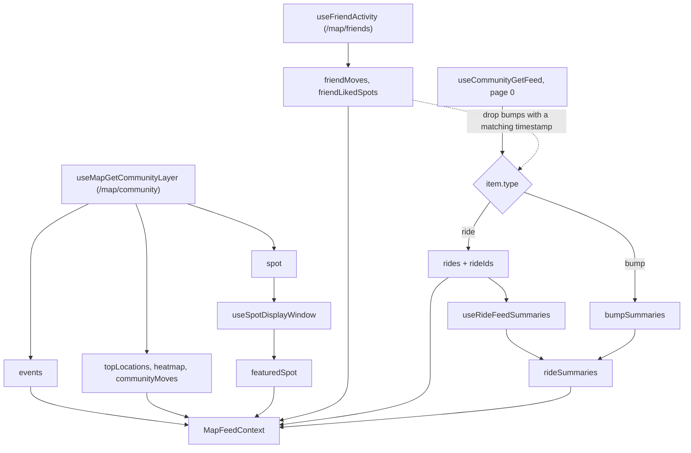
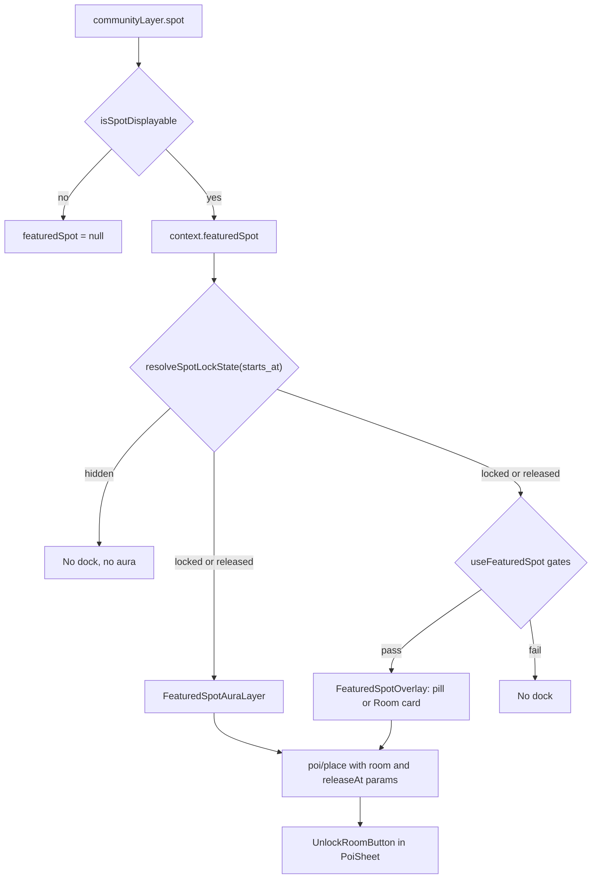

The map feed is the content of the glass sheet on the rider map tab when nothing is selected and search isn't focused. `app/(app)/(tabs)/map/index.tsx` renders it as four horizontal rails. `MapFeedProvider` supplies the data, and the same context also drives the featured-spot dock above the sheet and the aura marker on the map.

For the server side (feed generation, the Spot rules, caching), see [Events and feed](/engineering/domains/events-and-feed). For the `/map/community` and `/map/friends` payloads, see [Map layers and mobility](/engineering/location/map-layers-and-mobility#community-layer). For the provider stack, camera, and sheet geometry around the feed, see [Map tab internals](/engineering/mobile/map-tab-internals).

## Rails

`MapFeedBody` in `map/index.tsx` renders the rails in this order inside a `BottomSheetScrollView`. Each one is wrapped in `MapFeedRail` (`components/map/feed/MapFeedRail.tsx`), which draws the title, optional subtitle, and the right-hand link (default label **See all**).

| Rail | Subtitle | Right-hand link | Contents |
| --- | --- | --- | --- |
| **Moves** | "See where people are moving in your city" | **See all** opens `/(app)/(tabs)/map/moves` | A bump card as the list header, then move cards. See [Moves ordering](#moves-ordering) |
| **Friends** | "People you ride with" | **+ Invite** below 5 friends, **See all** from 5 up | Optional contacts tile, one avatar per friend, then dashed empty slots padding the row to 3 |
| **Likes** | "Spots you love", or "Like your first spot to show it on your map" when the rail holds only placeholders | **See all** opens `/(app)/save-location` with `focusSearch: '1'` | The rider's own likes, then friend-liked spots, then one trailing placeholder |
| **Featured** | "Get the most out of Yelo" | **See all** opens `/(app)/(tabs)/map/featured` | Event cards, or four action cards |

Every **See all** handler that pushes a map route first calls `onOpenSeeAll`, which snaps the sheet to index 2.

### Moves ordering

`map/index.tsx` builds the Moves list from three context fields:

1. `friendMoves`, from `/map/friends`.
2. `rides`, the community feed IDs (rides and bumps) in feed order.
3. `communityMoves`, the anonymized destination counts from `/map/community`.

When the combined list has 5 items or fewer (`MAX_MOVES_WITH_QUIET_CARD`), a quiet-city card is prepended. `MapFeedBumpCard` is the list header, so it always renders first.

When `useIsCommunityInactive` is true (`rides_disabled` is set or `is_active` isn't true on the current community, which includes the time before the community loads), the rail has no subtitle and shows only the bump card and the quiet-city card.

### Friends rail

`MapFeedFriendsRail` reads friends from `useFriendList`.

- The `ContactsAccessTile` leads the row when there are no friends or `useContactsAccessAction('home')` returns a prompt.
- `getFriendsRailLink` (`friendsRailLink.ts`) picks the link. Below `FRIENDS_SEE_ALL_THRESHOLD` (5) it returns **+ Invite** in the accent color, which opens the friends hub. From 5 up it returns **See all**, which opens `/(app)/(tabs)/map/friends`.

### Likes rail

`MapFeedLikesRail` merges two sources:

- The rider's own likes from `useUserGetLikes`, enabled once `baseMapReady` is set.
- `likedSpots` from `useFriendActivity`, filtered to drop any spot whose `mapboxId` matches one of the rider's own likes. The subtitle of a friend-liked card comes from `likedByLabel`.

With no likes from either source, the rail shows two `AddLikePlaceholderCard` items. Otherwise it appends one placeholder at the end.

### Featured rail

`useFeaturedCards` decides what the **Featured** rail and the `map/featured` screen show:

| Condition | Cards |
| --- | --- |
| Community is active and `events` is non-empty | One `event` card per event |
| Community is inactive, or `events` is empty | Four action cards |

The action cards, in order:

| ID | Title | Subtitle | Action |
| --- | --- | --- | --- |
| `first-like` | **Add your first like** with no likes, otherwise **Like another spot** | "Add a spot on the map" | Push `/(app)/save-location` with `focusSearch: '1'` |
| `add-friends` | **Add your first friend** with no friends, otherwise **Add more friends** | "Build your crew" | `openFriendsHub` |
| `sign-up-to-drive` | **Start driving** when `driver_application_status` is `approved` or `complete`, otherwise **Sign up to drive** | "Drive and earn" | `useEnterDriverFlow` |
| `invite-city` | **Invite your city** | "Get Yelo buzzing" | `openFriendsHub` |

Background and blob colors come from `FEATURED_PALETTE` in `featuredConstants.ts`.

## Card types

All paths are under `yelo-frontend/components/map/feed/`.

| Component | File | Shows | On press |
| --- | --- | --- | --- |
| `MapFeedBumpCard` | `MapFeedBumpCard.tsx` | **Bump your friends**, "Tell friends where you go" | Push `/(app)/(tabs)/map/request` with `bump: 'true'` |
| `MapFeedQuietCityCard` | `MapFeedQuietCityCard.tsx` | **Your city is quiet on Yelo**, **Share with friends** | `openFriendsHub` |
| `MapFeedFriendMoveCard` | `MapFeedActivityCards.tsx` | Friend first name (fallback "A friend"), "is heading to" the destination, time as `h:mma` | Open the destination place sheet |
| `MapFeedMovesCard` | `MapFeedMovesCard.tsx` | Rider first name or initials (fallback `LR`), "is heading to" the destination, time as `h:mma` | Open the destination place sheet |
| `MapFeedCommunityMoveCard` | `MapFeedActivityCards.tsx` | "1 person" or "N people", "heading to" the place name, count badge | Open the destination place sheet |
| `FriendAvatarSlot` | `FriendsRailSlots.tsx` | Avatar and full name | Push `/(app)/(tabs)/map/friend/[friendId]` |
| `EmptyFriendSlot` | `FriendsRailSlots.tsx` | Dashed circle with a plus icon | Friends hub |
| `LikeCard` | `LikeCard.tsx` | Category emoji, heart badge, name, and address or the liked-by label | Push the place sheet, when the spot has a name and coordinates |
| `AddLikePlaceholderCard` | `AddLikePlaceholderCard.tsx` | **Add a like**, "Pin a spot you love" | Push `/(app)/save-location` with `focusSearch: '1'` |
| `MapFeedEventCard` | `MapFeedCard.tsx` | `EVENT` eyebrow, name, start time, up to 2 tags from `selectTags` | `onEventPress` |
| `FeaturedActionCard` | `FeaturedActionCard.tsx` | Icon, title, subtitle with an arrow | The card's `onPress` |

Details that affect behavior:

- **Move cards read from context.** `MapFeedMovesCard` looks up `rideSummaries[uuid]`. It renders an empty `View` until the summary arrives, and `null` when the summary has no destination name. It mounts no query of its own.
- **Opening a destination.** The three move cards call `setSelectedCoordinates([longitude, latitude])` and then push `placeHref(place)`, which targets `/(app)/(tabs)/map/poi/place` with a serialized snapshot. The coordinates seed the camera fly described in [Focus and fly-to](/engineering/mobile/map-tab-internals#focus-and-fly-to).
- **Event routing.** `onEventPress` calls `routeToFeedItem`, which pushes `/(app)/events/[eventId]` for every event, including one tagged `deal`. The deals screen and the `deal` featured card variant were retired in October 2026. See [Deprecated and legacy code](/engineering/history/deprecated-and-legacy#retired-ads-coupons-and-event-attendance).
- **Full-width variants.** The cards accept `fullWidth` for the see-all screens. Rail cards are `rem(16)` wide.

### See-all screens

Each screen wraps its rows in `SeeAllShell`, a `BottomSheetFlatList` with a back header and an optional sticky footer.

| Route | Title | Rows | Empty state |
| --- | --- | --- | --- |
| `map/moves` | **Moves** | Friend moves, then feed rides and bumps, then community moves, all full width | "Moves appear here as friends head out." |
| `map/friends` | **Friends** | Three-column grid of avatars, padded to 3 cells, plus one trailing empty slot. Sticky **Bump** footer pushes `map/request` with `bump: 'true'` | None |
| `map/featured` | **Featured** | The same cards as the rail, full width | None |
| `map/drops` | **Drops** | One `MapFeedEventCard` per `events` entry | "Drops appear here as events go live." |

No rail links to `map/drops`. `SeeAllSection` still lists `drops`, but `handleSeeAll` is only called with `moves`.

## MapFeedProvider

`providers/MapFeedProvider.tsx` is the outermost provider in the map layout. It runs the feed queries once and exposes the result, plus POI selection state, through `MapFeedContext` (`components/map/feed/MapFeedContext.tsx`). `useMapFeedContext` throws when the provider is missing.

### Data flow

### Queries

| Query | Key | Timing | Feeds |
| --- | --- | --- | --- |
| `useMapGetCommunityLayer` | `communityLayerQueryKey(communityId)` | `staleTime` and `refetchInterval` of 5 minutes (`COMMUNITY_LAYER_STALE_MS`), no background refetch, `throwOnError: false` | `events`, `topLocations`, `heatmap`, `communityMoves`, and the raw spot |
| `useFriendActivity` | The shared `/map/friends` layer query | Owned by `hooks/useFriendLocations.ts` | `friendMoves`, `friendLikedSpots` |
| `useCommunityGetFeed({ page: 0 })` | `communityFeedQueryKey(communityId, 0)` | No retry on a 400, otherwise up to 3 retries | `rides`, and the inline bump summaries |
| `useRideFeedSummaries` | `['/ride/feed-summaries', ids, communityId]` | `staleTime` 5 minutes, batches of 50 IDs, 15-second request timeout | `rideSummaries` |

The community layer and community feed queries share one gate. Both wait for all of these:

- `usePresentationActive()`: the screen is focused and the app is in the foreground.
- A JWT exists and isn't being refreshed.
- `signup_status.profile_initialized` is `true`.
- `baseMapReady` is set in `mapStartupStore`.
- A current community ID exists.

A community layer failure logs `map.communityLayer.error` and leaves every derived field at its stable empty default. A successful load logs `map.communityLayer.loaded` with the section counts.

### Shaping the feed

The provider walks page 0 of the community feed in order:

- A `ride` item adds its ID to `rides` and to the list sent to `useRideFeedSummaries`.
- A `bump` item adds its ID to `rides` and is shaped inline as a `FeedSummaryV2`: `created_at` becomes `confirm_time`, the sender's first name and initials become the rider fields, `price` is `0`, and `pickup` is `null`. That lets `MapFeedMovesCard` render rides and bumps the same way.
- A bump is skipped when its `created_at` equals the `createdAtMs` of any friend move, because that friend move already leads the rail.
- Every other item type is ignored. That includes the `spot` item the server prepends to page 0.

`rideSummaries` merges the fetched ride summaries with the inline bump summaries.

The context's `events` is the community layer's `events` with nulls removed. When that list is empty and `EXPO_PUBLIC_ENABLE_MOCK_DATA` is `true`, it falls back to `MOCK_EVENTS`.

### Context value

| Field | Source | Consumers |
| --- | --- | --- |
| `rides`, `rideSummaries` | Community feed and ride summaries | Moves rail, `map/moves` |
| `events` | Community layer | Featured rail, `map/drops`, `useVenuesWithFeedItems` |
| `friendMoves` | `/map/friends` | Moves rail, `map/moves` |
| `friendLikedSpots` | `/map/friends` | `PinnedMarkersLayer` |
| `communityMoves` | Community layer | Moves rail, `map/moves`, `CommunityMovesLayer` |
| `topLocations` | Community layer | `PinnedMarkersLayer`, `map/poi/[poiId]` |
| `heatmap` | Community layer | `CommunityHeatLayer` |
| `featuredSpot` | Community layer `spot`, filtered by `useSpotDisplayWindow` | `useFeaturedSpot`, `FeaturedSpotAuraLayer`, `OpenPoiMarker` |
| `selectedPoiId`, `selectedCoordinates`, `selectedPoiSaved`, `openPoi` and their setters | Local state | POI routes, camera bridge, open-POI overlay |
| `offPeakVisible`, `setOffPeakVisible` | Local state | Search bar status chip, `OffPeakHoursOverlay`, `useFeaturedSpot` |
| `onUse` | Pushes `map/request` with the location as `dropoff`. The provider sets it on the value, but `MapFeedContextValue` doesn't declare it | No consumer |
| `onEventPress` | `routeToFeedItem` | Event cards |
| `onOpenSeeAll` | `bottomSheetRef.snapToIndex(2)` | Rails |
| `openFriendsHub` | `friendsHubRef.present()` | Rails, action cards, quiet-city card |
| `flyToRegion` | `customMapRef.control.flyTo` | Featured spot dock and aura |

When the community ID changes to a different value, the provider clears `selectedPoiId`, `selectedCoordinates`, `selectedPoiSaved`, `openPoi`, and `offPeakVisible`.

### Venue grouping

`useVenuesWithFeedItems` groups `events` by venue for the pinned markers and the POI sheet.

- The key is `venue.id` when the venue has a non-nil ID and coordinates. Otherwise it is `inline:<lat>:<lng>` from the event's own `location_*` fields, rounded to 5 decimals. Events with neither are dropped.
- `feedItems` are sorted with in-progress events first, then by start time.
- `closestFeedItem` is the earliest in-progress event, else the next upcoming one, else the most recently ended.
- `poiId` equals the venue key, which is what `PoiSheet` matches against `poi.id` to list a venue's events.

## Featured spot

The featured spot is the community's single active Spot. The server picks the row. The app then decides whether, where, and in what state to show it. The UI calls it **Your Room**.

### Display window

`isSpotDisplayable` in `lib/map/featuredSpot.ts` returns `true` when all of these hold:

- `spot.is_active` is true.
- `display_start_time` is null or not after now.
- `display_end_time` is null or not before now. The end bound is inclusive.

`useSpotDisplayWindow` (`hooks/useSpotDisplayWindow.ts`) applies that check without polling:

- It evaluates the spot in an effect and stores the result.
- While the presentation is active, it schedules one `setTimeout` for the nearest future boundary plus 1 ms, capped at `2^31 - 1` ms, and re-evaluates when it fires.
- It returns `null` for any render where the stored spot isn't the current `spot` object. A replaced or removed spot is never shown for a frame before its own window is checked.

The server doesn't filter on the display window. See [The Spot](/engineering/domains/events-and-feed#the-spot).

### Lock state

`resolveSpotLockState(startsAt, now)` derives a state from the spot's release time, `starts_at`. `LOCK_WINDOW_MS` is 24 hours.

| State | Condition | Effect |
| --- | --- | --- |
| `released` | `starts_at` is null or not in the future | Dock and aura show the unlocked look |
| `locked` | `starts_at` is within the next 24 hours | Dock shows a lock and a live countdown. The aura shows |
| `hidden` | `starts_at` is more than 24 hours away | No dock and no aura |

Countdowns come from `useCountdown` and render through `formatCountdownHMS` as `H:MM:SS`, clamped to 24 hours. A surface is unlocked when the release time is null or the countdown has expired.

### Dock gating

`useFeaturedSpot` (`components/map/feed/useFeaturedSpot.ts`) is the single source for whether the dock shows. `visible` is true when all of these hold:

- The off-peak popup is closed.
- No POI is open (`openPoi` is null).
- `featuredSpot` is non-null.
- Both persisted ID sets have hydrated from AsyncStorage.
- The lock state isn't `hidden`.
- The spot ID isn't in the dismissed set.

While the state is `hidden`, the hook schedules a re-render at `starts_at` minus 24 hours, capped at `2^31 - 1` ms and re-armed after each capped fire.

The map layout also reads `visible` and hides `SavedSpotsBar` (the recenter and bump controls) while the dock shows, so the two never share the space above the sheet. See [Home dock controls](/engineering/mobile/rider-experience#home-dock-controls).

Two per-user AsyncStorage sets back the hook, both through `usePersistedSpotIdSet` (writes debounced by 150 ms):

| Key | Hook | Meaning |
| --- | --- | --- |
| `featured-spot:dismissed:<userId>` | `useDismissedSpots` | Spots hidden from the dock |
| `featured-spot:collapsed:<userId>` | `useCollapsedSpots` | Spots the rider has expanded into the full card |

### Pill and Room card

`FeaturedSpotOverlay` (`components/map/FeaturedSpotOverlay.tsx`) renders inside `SwipeDismissDock`, which tracks the sheet's top edge.

| Surface | When | Locked | Unlocked | Tap |
| --- | --- | --- | --- | --- |
| `FeaturedSpotPill` | Default | Lock icon, **Your Room**, countdown | Spinning clock icon, **Unlock Room** | Expand to the card |
| `FeaturedSpotRoomCard` | Spot ID is in the expanded set | Frosted card with **Your Room**, the title and subtitle behind a blur, lock icon, countdown | **Your Room**, the title, **Unlock Room**, a disco-ball icon | Open the place sheet |

- Swiping the card down collapses it back to the pill. The pill itself has swipe disabled.
- `resolveContent` picks the title from `spot.title`, then the event name, then the location name. The subtitle joins a date (`EEE · MMM d` from `display_start_time` or the event start) and a place name or address.

Tapping the card runs `openPoi`:

1. `resolveSpotPlace` picks the target. A location spot uses its location. An event spot uses its venue, or the event's `location_*` fields when it has no venue. With no coordinates it returns null and nothing happens.
2. `setSelectedCoordinates` and `flyToRegion(..., 16)` move the camera.
3. The router pushes `placeHref(place, { room: '1', releaseAt })`, where `releaseAt` is `starts_at` in epoch milliseconds, or an empty string.

### Aura layer

`FeaturedSpotAuraLayer` (`components/map/pinned/FeaturedSpotAuraLayer.tsx`) marks the featured place on the map. `MapDataLayers` mounts it once sprites are ready and no ride request route is active. See [Data layer order](/engineering/location/map-rendering#data-layer-order).

It reads the raw `featuredSpot` from context, not `useFeaturedSpot`. The aura therefore stays lit while a POI is open or the spot is in the dismissed set. It renders nothing when there is no spot, `resolveSpotPlace` returns null, or the lock state is `hidden`.

The glow is three static `CircleLayer`s on one `ShapeSource` (`featured-spot-src`), all with `circlePitchAlignment: 'map'`:

| Layer ID | Color | Radius | Blur | Opacity |
| --- | --- | --- | --- | --- |
| `featured-aura-wide` | `#8B5CF6` | `rem(3.5)` | 1 | 0.16 |
| `featured-aura-mid` | `#8B5CF6` | `rem(2.1)` | 0.7 | 0.35 |
| `featured-aura-core` | `#C4B5FD` | `rem(1.05)` | 0.5 | 0.58 |

A `MarkerView` (`featured-spot-marker`) sits on top with up to three tappable parts:

- A cover thumbnail, when `resolveContent` returns an image URL.
- A ticket sticker, for event spots only.
- A category emoji from `categoryToEmojiIcon`, always shown and anchored on the coordinate. The lookup uses the event venue's categories. A location spot passes `null`.

Tapping any part does the same as the Room card: set the coordinates, fly to zoom 16, and push the place route with `room` and `releaseAt`.

`OpenPoiMarker` yields to the aura. It renders nothing when the open POI is within `1e-4` degrees of the featured place on both axes, so two icons never stack.

## Unlock Room button

`UnlockRoomButton` (`components/map/poi/UnlockRoomButton.tsx`) is a call to action on the place sheet. It has no working action yet.

`PoiSheet` reads the `room` and `releaseAt` route params. When `room === '1'`, the bottom overlay splits into two halves: `PoiBottomBar` on one side and `UnlockRoomButton` on the other. Only the Room card and the aura marker set that param, so the button appears only when the sheet is opened from one of them. The sheet runs its own `useCountdown` on `releaseAt`.

| State | Condition | Rendering | Test ID |
| --- | --- | --- | --- |
| Locked | `releaseAt` is set and the countdown hasn't expired | A plain `View`, not pressable. The purple button is blurred under a lock icon and the `H:MM:SS` countdown | `poi-unlock-room-button-locked` |
| Unlocked | `releaseAt` is empty or the countdown has expired | A pressable purple button with a ticket icon, the label **Unlock**, and a shimmer while the presentation is active | `poi-unlock-room-button` |

<Warning>
  The unlocked button does nothing when pressed. `PoiSheet` passes an empty function as `onPress`, with the comment `TODO(yelo-986): wire the unlock-room flow`. There is no API call, navigation, or state change behind it.
</Warning>

## Where this lives in code

| Concern | Path |
| --- | --- |
| Feed screen and Moves rail | `yelo-frontend/app/(app)/(tabs)/map/index.tsx` |
| See-all screens | `yelo-frontend/app/(app)/(tabs)/map/moves.tsx`, `friends.tsx`, `featured.tsx`, `drops.tsx` |
| Provider and context | `yelo-frontend/providers/MapFeedProvider.tsx`, `components/map/feed/MapFeedContext.tsx` |
| Rails | `yelo-frontend/components/map/feed/` (`MapFeedRail`, `MapFeedFriendsRail`, `MapFeedLikesRail`, `MapFeedFeaturedRail`, `friendsRailLink.ts`) |
| Cards | `yelo-frontend/components/map/feed/` (`MapFeedCard`, `MapFeedMovesCard`, `MapFeedActivityCards`, `MapFeedBumpCard`, `MapFeedQuietCityCard`, `LikeCard`, `AddLikePlaceholderCard`, `FriendsRailSlots`, `FeaturedCard`, `FeaturedActionCard`) |
| Featured rail cards | `yelo-frontend/components/map/feed/useFeaturedCards.tsx`, `featuredConstants.ts` |
| Event routing and venue grouping | `yelo-frontend/components/map/feed/routeToFeedItem.ts`, `useVenuesWithFeedItems.ts` |
| Ride summaries | `yelo-frontend/hooks/useRideFeedSummaries.ts` |
| Spot selection helpers | `yelo-frontend/lib/map/featuredSpot.ts`, `hooks/useSpotDisplayWindow.ts` |
| Dock gating and persistence | `yelo-frontend/components/map/feed/useFeaturedSpot.ts`, `hooks/useDismissedSpots.ts`, `hooks/useCollapsedSpots.ts`, `hooks/usePersistedSpotIdSet.ts` |
| Dock UI | `yelo-frontend/components/map/FeaturedSpotOverlay.tsx`, `components/map/feed/FeaturedSpotPill.tsx`, `FeaturedSpotRoomCard.tsx`, `components/map/SwipeDismissDock.tsx` |
| Aura layer | `yelo-frontend/components/map/pinned/FeaturedSpotAuraLayer.tsx`, `components/map/layout/MapDataLayers.tsx` |
| Unlock Room button | `yelo-frontend/components/map/poi/UnlockRoomButton.tsx`, `components/map/poi/PoiSheet.tsx` |

## Gotchas and edge cases

<AccordionGroup>
  <Accordion title="The server never sends a spot before its release time">
    `/map/community` gets its spot from `GetActiveSpotByCommunity`, which requires `starts_at IS NULL OR starts_at <= NOW()`. A spot whose `starts_at` is still in the future isn't returned, so by the server's clock `resolveSpotLockState` only ever sees `released`. The `locked` and `hidden` branches, the countdown on the pill, the Room card, and the locked Unlock Room button all exist in the app, but the current API doesn't produce the input that reaches them.
  </Accordion>
  <Accordion title="The spot comes from the map layer, not the feed">
    The comment on `featuredSpot` in `MapFeedContext.tsx` says it comes from `/community/feed`. The provider actually reads `communityLayer.spot` from `/map/community` and ignores `spot` items in the feed. A spot change can take up to the 5-minute server cache plus the 5-minute client refetch interval to appear.
  </Accordion>
  <Accordion title="Nothing calls dismiss">
    `useFeaturedSpot` returns `dismiss`, and `visible` checks the dismissed set, but no component calls it. Swiping the Room card down calls `collapse`, which returns to the pill. The dismissed set can only hold IDs persisted by an earlier build.
  </Accordion>
  <Accordion title="The collapsed key stores expanded spots">
    `useCollapsedSpots` persists under `featured-spot:collapsed:<userId>`, and its own doc comment describes collapsed spots. `useFeaturedSpot` uses the set the other way round: an ID in the set means the rider expanded the spot into the card, and the hook's `expand` calls the store's `collapse` (add). Absent means the default pill.
  </Accordion>
  <Accordion title="Unused selection helpers">
    `selectFeaturedSpot`, `resolveSpotPoiId`, and `resolveSpotRoute` in `lib/map/featuredSpot.ts` have no callers outside tests. Selection is `useSpotDisplayWindow` on the layer's single spot, and both entry points navigate with `resolveSpotPlace`.
  </Accordion>
  <Accordion title="Exported cards that nothing renders">
    `MapFeedCard`, `MapFeedRideCard`, `MapInactiveMovesCard`, and `MapInactiveDropCard` are exported from `components/map/feed/index.ts` but no screen renders them. `MapFeedRideCard` still mounts its own per-ride summary query, which the batched `useRideFeedSummaries` replaced. `MapFeedStackParamList` also lists a `spots` route that has no screen file.
  </Accordion>
  <Accordion title="Friend bump dedupe is by timestamp">
    The provider drops a feed bump when its `created_at` equals a friend move's `createdAtMs` exactly. It doesn't compare sender or destination.
  </Accordion>
  <Accordion title="The aura has no clock of its own">
    `FeaturedSpotAuraLayer` computes the lock state with `new Date()` during render and sets no timer. It picks up a state change only when something else re-renders it, such as a context update.
  </Accordion>
  <Accordion title="The button label is Unlock, not Unlock Room">
    The pill and the Room card say **Unlock Room**. The button on the place sheet says **Unlock** in both states.
  </Accordion>
</AccordionGroup>
