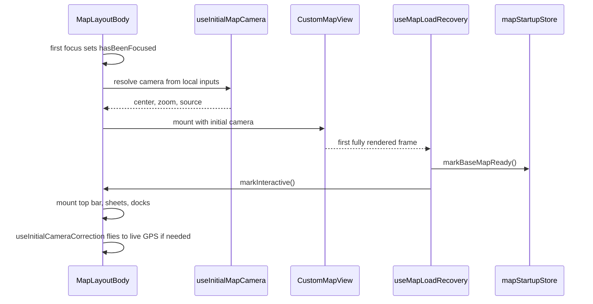

The rider map tab (`app/(app)/(tabs)/map/`) is one Mapbox view with a glass bottom sheet on top. A stack of small providers lets detail screens, markers, and the camera talk to each other without re-rendering the map on every frame. This page covers that plumbing.

For what the map draws and in what order, see [Map rendering](/engineering/location/map-rendering). For the feed, search, and request flows that live in the sheet, see [Rider experience](/engineering/mobile/rider-experience). For the route list, see [Screen catalog](/engineering/mobile/screen-catalog).

## Provider stack

`app/(app)/(tabs)/map/_layout.tsx` wraps `MapLayoutBody` in this order, outermost first:

| Provider | State | Used by |
| --- | --- | --- |
| `MapFeedProvider` | Selected POI, selected coordinates, feed data | Feed rails, POI screens, camera bridge. See [Events and feed](/engineering/domains/events-and-feed) |
| `MapFocusProvider` | `focus`: the focused friend or vehicle (type and ID), or `null` | Friend and vehicle detail screens, camera bridge |
| `MapBoundingBoxLabelProvider` | Optional label for the community box corner | `BoundingBoxLabel` |
| `MapTopBarProvider` | Stack of top bar claims | `MapTopBar`, detail screens |
| `MarkerProximityProvider` | Ref-based enter and exit pub/sub keyed by marker ID | Camera bridge publishes, pinned markers subscribe |
| `MapCameraFrameProvider` | Ref-based per-frame pub/sub | Camera bridge publishes, POI layers subscribe |
| `CenteredPoiProvider` | Global nearest-to-center POI across layers | `PinnedSymbolsLayer` instances |
| `MapTutorialProvider` | First-run tutorial steps | Feed, friends hub, saved spots |
| `MapSearchProvider` | `focused`, `openSearch`, `closeSearch` | Search bar, feed screen, sheet gestures |

The pub/sub providers keep subscribers in refs and never hold React state. A camera frame calls every subscriber synchronously, and only a leaf that chooses to `setState` re-renders.

## Mount sequence

### First camera

`resolveInitialMapCamera` in `components/map/initialCamera.ts` picks the first camera from local data only, so Mapbox never loads tiles for `[0, 0]` and then again:

1. **`provider`**: a usable device fix, at zoom 13 (`DEFAULT_ZOOM` in `components/map/layout/constants.ts`).
2. **`persisted`**: the last useful center from AsyncStorage key `map:last-useful-center:v1`, if it lies inside the community box.
3. **`community`**: the community box center.
4. **`persisted`** again, when it exists but lies outside the box.
5. **`fallback`**: the center of the contiguous US (`-98.5795, 39.8283`) at zoom 3.5.

The map mounts only after the tab has been focused once and a camera is resolved. `startup.map.initialCameraReady` logs the source and elapsed time. Every settled camera (`handleMapSettled`) and every provider-sourced start writes the center back to that key.

### Camera correction

`useInitialCameraCorrection` runs once after the basemap is ready. When a usable GPS fix arrives, it flies to it over 500 ms if the displayed center is more than 0.1 miles away or the zoom is below 13. It gives up without moving if the user has panned, or a POI, entity, or ride request is open. It logs `startup.map.initialCameraCorrected` with the drift.

### Load recovery

`useMapLoadRecovery` releases deferred work on the map's first fully rendered frame. If Mapbox reports a load error before the map loads, it releases the same work after 5 seconds (`MAP_LOAD_ERROR_RECOVERY_DELAY_MS`), so a failed style or tile load never strands the screen. Both paths call `markBaseMapReady` and `markInteractive`. Staged mounting after that is described in [Map rendering](/engineering/location/map-rendering#staged-mounting).

## Camera bridge

`useMapCameraBridge` (`components/map/layout/useMapCameraBridge.ts`) owns the camera callbacks. It mirrors the center, zoom, and bounds into refs, so a frame costs no state update on the map screen.

On each `onCameraChanged`:

1. Update `currentCenterRef`, `currentZoomRef`, and `currentBoundsRef`.
2. Skip the rest unless `hasCameraMoved` (`lib/map/cameraMovement.ts`) reports motion beyond the frame epsilons, compared against the last forwarded pose. Headings compare by shortest angle, so a wrap from 359° to 1° isn't a jump.
3. Run the marker proximity check.
4. Call `notifyFrame` on `MapCameraFrameProvider`.
5. Check pan-to-dismiss.
6. On gesture start with an entity focused, stop following it.

`onMapSettled` bumps `cameraTick`, which POI layers use to re-sample visible bounds.

### Focus and fly-to

| Selection | Camera behavior |
| --- | --- |
| POI or place | `flyTo` zoom 16 with padding: top = safe area + `MAP_TOP_UI_HEIGHT`, bottom = 50% of the window. When the POI has an event, the focal point shifts down 166 px (`EVENT_HERO_CARD_ABOVE_ANCHOR_PX`) so the hero card is centered. Gestures stay enabled |
| Friend or vehicle, first selection | Save the current camera, lock gestures, fly to zoom 16 over 350 ms, then unlock and start following |
| Friend or vehicle, switch | Keep the originally saved camera |
| Clear focus | Fly back to the saved camera over 600 ms |

The fly targets the marker's displayed, interpolated position from `lib/map/mapEntityPositions.ts`, falling back to the last polled position if the marker hasn't mounted.

### Entity follow

Following runs on the UI thread. `useAnimatedReaction` watches the focused marker's latitude and longitude shared values, registered in `mapEntityPositions.ts` by the marker, and calls `snapTo` at most every 100 ms (`FOLLOW_SNAP_INTERVAL_MS`). The native camera interpolates between those targets. Any user gesture turns following off. `seeCoverage`, the zoom-to-community control, also blocks snaps for 600 ms so a stale frame can't cancel its animation.

## Sheet and touch geometry

### Snap points

`useMapSheetSnaps` builds the glass sheet's snap points with `resolveMapSheetSnapPoints` (`lib/map/mapSheetSnap.ts`):

| Snap | Value |
| --- | --- |
| Peek | `max(13% of window, bottom inset + rem(5.25))`, in pixels, so the search bar clears the home indicator |
| Resting | `40%` |
| Top | Window height minus top inset minus `rem(0.5)`, capped to the active screen's reported content height, but never below 45% of the window |

Child screens drive the sheet through `MapSheetController`:

| Method | Owner | Effect |
| --- | --- | --- |
| `setContentHeight` | POI screens | Caps the top snap so a short sheet doesn't cover the map |
| `setSnapOverride` | Ride request | Replaces the snap list entirely |
| `setBottomBar`, `setSheetOverlay` | Various | Content docked above the sheet instead of clipped inside it |
| `expandSheet`, `collapseSheet`, `snapToSheetIndex` | Various | Programmatic snaps. `snapToSheetIndex` clamps to the current list |

The layout clears the override whenever the request route isn't active, and clears the content-height cap whenever neither a POI nor the request route is active. This stops a stale value from clipping the next screen.

Progress values (`feedPeekProgress`, `sheetExpandProgress`, `sheetSolidProgress`) are derived from the sheet's real top-edge position, not Gorhom's `animatedIndex`, because the index can settle out of sync after the deferred mount or a snap override swap.

### Map touches

`useMapTouchHandlers` decides what a touch on the map does:

| State | Touch | Pan |
| --- | --- | --- |
| Feed, nothing selected | Collapse to peek | No effect |
| Detail open | Record the pan-dismiss baseline on the first touch. Collapse to peek only when the finger is within `rem(4)` above the sheet's top edge | Same edge rule |
| Ride request | No effect | No effect |

Pans bind to touch-move, so tapping another marker navigates instead of collapsing.

### Pan to dismiss

A detail sheet (POI, place, friend, or vehicle) closes back to the feed when the map center moves far from where the user first touched it. `shouldDismissDetailOnPan` in `lib/map/mapPanDismiss.ts` requires both:

- More than 300 m of real distance (`DETAIL_DISMISS_MIN_METERS`).
- More screen pixels than the window's shorter side (`DETAIL_DISMISS_SCREEN_PX`), using Web Mercator meters per pixel at the current zoom and latitude.

The baseline is set only by a real touch, so the open-time fly and programmatic recenters never dismiss. The check runs mid-drag, and the ride request screen is exempt.

## Marker emphasis

### Proximity pop

`useMarkerCenterProximity` checks pinned markers against a radius of 22.5% of the window width (`PROXIMITY_RADIUS_PX`) around the camera center, from zoom 11 (`PINNED_MIN_ZOOM`) up. It is throttled to 100 ms. On enter, it fires a light haptic (during gestures only) and publishes to `MarkerProximityProvider`. `useMarkerProximityScale` animates the subscribed marker to 1.08× over 180 ms and back to 1× over 200 ms on exit.

### Centered POI

Community POIs and saved places are drawn by separate `PinnedSymbolsLayer` instances. Only one pin across both should grow and show its name.

- Each layer runs `pickCenteredPoi` (`components/map/pinned/findCenteredPoi.ts`) on every frame. Distance is measured as a fraction of the visible span. A pin gains emphasis within 0.18, keeps it until 0.22, and loses it to a challenger only if the challenger is closer than 0.85× the holder's distance.
- Each layer reports its candidate to `CenteredPoiProvider`, which keeps the global nearest and applies the same 0.85 switch margin across layers.
- Candidate lookup uses `createPointIndex` (`lib/map/pointIndex.ts`): coordinates sorted by latitude and longitude, binary-searched on whichever axis gives fewer candidates, with antimeridian wrap. Results keep the input order.

### Visible marker caps

`selectVisibleMarkers` (`lib/map/visibleMarkers.ts`) mounts only markers inside the visible bounds plus 20% overscan, so small pans don't remount rich annotations. The selected marker always keeps a slot and renders last, on top.

| Layer | Cap |
| --- | --- |
| Friends (`FriendsLayer`) | 30 (`MAX_RENDERED_FRIENDS`) |
| Event venues (`PinnedMarkersLayer`) | 30 |

## Top bar ownership

`MapTopBarProvider` keeps a stack of claims. A screen calls `useMapTopBarContent(<Bar />)` on mount, and its release on unmount removes only its own entry. The top of the stack renders, or the default `NavBar` when the stack is empty. The stack exists so an outgoing screen's late cleanup can't remove a bar that a newer screen already claimed.

| Screen | Bar |
| --- | --- |
| `request` | `RequestTopBar` |
| `poi/[poiId]`, `poi/place` | `PoiTopBar` |
| `friend/[friendId]`, `vehicle/[vehicleId]` | `BackOnlyTopBar` |

The node is captured once on mount, so callers must pass a static element.

## Other helpers

| Helper | Path | Purpose |
| --- | --- | --- |
| `createMapFrameRate` | `lib/map/mapFrameRate.ts` | One settle timer per map. `markActive` requests the high rate, and the map drops to idle after the idle delay. `retainMotion` holds the high rate while a visible animation runs. Values are in [Map rendering](/engineering/location/map-rendering#camera-and-frame-rate) |
| `findSavedMatch` | `lib/map/savedLocationsMatch.ts` | Decides whether a place is already saved: same `yelo_place_id` first, then same `mapbox_id` and name, then same name plus 5-decimal coordinates or normalized address. Used by `PoiHeader`, `useSavedLocations`, and the save-location search |
| `isRidePlanningPath` | `lib/map/ridePreparation.ts` | `/map`, `/events`, `/deals`, and `/save-location` (and their children). `LocationProvider` warms location for ride preparation only on these paths |

## Community change

When the current community ID changes to a different non-empty value, the layout closes search, dismisses the friends hub, and returns POI, event, and vehicle routes to the feed. An in-progress ride request stays open.

## Where this lives in code

| Concern | Path |
| --- | --- |
| Layout and provider stack | `yelo-frontend/app/(app)/(tabs)/map/_layout.tsx` |
| Providers | `yelo-frontend/providers/Map*Provider.tsx`, `MarkerProximityProvider.tsx`, `CenteredPoiProvider.tsx`, `mapTopBarSlots.ts` |
| Layout hooks and constants | `yelo-frontend/components/map/layout/` (`useMapCameraBridge`, `useMapSheetSnaps`, `useMapTouchHandlers`, `useInitialMapCamera`, `useInitialCameraCorrection`, `useMapLoadRecovery`, `constants.ts`) |
| First camera | `yelo-frontend/components/map/initialCamera.ts` |
| Pinned layers | `yelo-frontend/components/map/pinned/` (`findCenteredPoi.ts`, `useMarkerProximityScale.ts`, `constants.ts`) |
| Pure helpers | `yelo-frontend/lib/map/` (`cameraMovement`, `mapPanDismiss`, `mapSheetSnap`, `pointIndex`, `visibleMarkers`, `mapEntityPositions`, `mapFrameRate`, `savedLocationsMatch`, `ridePreparation`) |
| Proximity detection | `yelo-frontend/hooks/useMarkerCenterProximity.ts` |

## Gotchas and edge cases

<AccordionGroup>
  <Accordion title="Two DEFAULT_ZOOM constants">
    `components/map/layout/constants.ts` sets `DEFAULT_ZOOM = 13` for the map tab's first camera and correction. `components/map/customMapView/constants.ts` sets `DEFAULT_ZOOM = 17` for ride and drive screens. Import the one that matches your screen.
  </Accordion>
  <Accordion title="The bounding box label never shows">
    `BoundingBoxLabel` renders only when a screen sets a label through `useMapBoundingBoxLabel`, and no screen does. The provider and marker are mounted but inert.
  </Accordion>
  <Accordion title="Top bar content is captured once">
    `useMapTopBarContent` stores the node in a ref on mount. Props that change later don't reach the rendered bar. Put dynamic state inside the bar component instead.
  </Accordion>
  <Accordion title="Proximity scale comment is stale">
    The comment in `useMarkerProximityScale.ts` says markers grow to 1.3×, but `PROXIMITY_SCALE` is 1.08. The 1.3× value is `POI_CENTER_ICON_SCALE`, used for the centered POI.
  </Accordion>
  <Accordion title="Two meters-per-pixel constants">
    `lib/map/mapPanDismiss.ts` uses 78,271.5 m per pixel at zoom 0, which matches Mapbox's 512 px tiles. `hooks/useMarkerCenterProximity.ts` uses 156,543 m per pixel, the 256 px tile value. At the same zoom, the proximity radius converts to about twice the intended meters, so the pop triggers from roughly twice as far as `PROXIMITY_RADIUS_PX` suggests.
  </Accordion>
  <Accordion title="Returning from profile doesn't recenter">
    The map is deliberately not recentered on re-focus, because the profile screen slides over it. Only the first mount resolves a camera.
  </Accordion>
  <Accordion title="Queued search focus">
    Screens outside the map stack can request search focus through `mapSearchIntentStore`. The layout consumes it on focus, first dismissing any open detail back to the feed, then clears the flag so it can't fire later.
  </Accordion>
</AccordionGroup>
