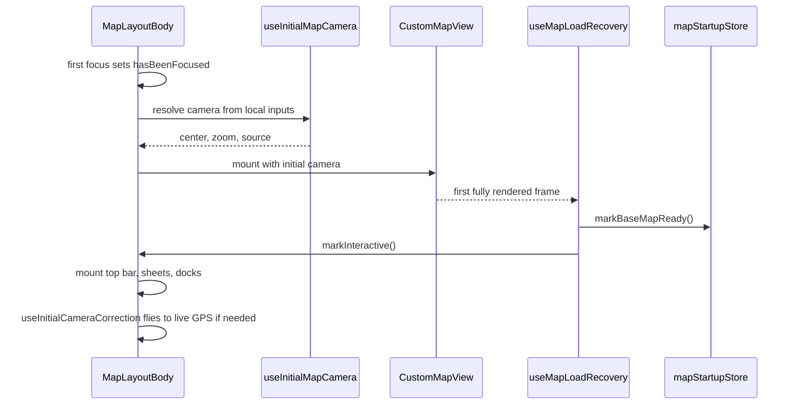

The rider map tab (`app/(app)/(tabs)/map/`) is one Mapbox view with a glass bottom sheet on top. A stack of small providers lets detail screens, markers, and the camera talk to each other without re-rendering the map on every frame. This page covers that plumbing.

For what the map draws and in what order, see [Map rendering](/engineering/location/map-rendering). For the feed, search, and request flows that live in the sheet, see [Rider experience](/engineering/mobile/rider-experience). For the route list, see [Screen catalog](/engineering/mobile/screen-catalog).

## Provider stack

`app/(app)/(tabs)/map/_layout.tsx` wraps `MapLayoutBody` in this order, outermost first:

| Provider | State | Used by |
| --- | --- | --- |
| `MapFeedProvider` | Selected POI, selected coordinates, feed data | Feed rails, POI screens, camera bridge. See [Events and feed](/engineering/domains/events-and-feed) |
| `MapFocusProvider` | `focus`: the focused friend or vehicle (type and ID), or `null` | Friend and vehicle detail screens, camera bridge |
| `MapBoundingBoxLabelProvider` | Optional label for the community box corner | `BoundingBoxLabel` |
| `MapTopBarProvider` | Stack of top bar claims | `MapTopBar`, detail screens |
| `MarkerProximityProvider` | Ref-based enter and exit pub/sub keyed by marker ID | Camera bridge publishes, pinned markers subscribe |
| `MapCameraFrameProvider` | Ref-based per-frame pub/sub | Camera bridge publishes, POI layers subscribe |
| `CenteredPoiProvider` | Global nearest-to-center POI across layers | `PinnedSymbolsLayer` instances |
| `MapTutorialProvider` | First-run tutorial steps | Feed, friends hub, saved spots |
| `MapSearchProvider` | `focused`, `openSearch`, `closeSearch` | Search bar, feed screen, sheet gestures |

The pub/sub providers keep subscribers in refs and never hold React state. A camera frame calls every subscriber synchronously, and only a leaf that chooses to `setState` re-renders.

## Mount sequence

```mermaid
sequenceDiagram
  participant L as MapLayoutBody
  participant C as useInitialMapCamera
  participant M as CustomMapView
  participant R as useMapLoadRecovery
  participant S as mapStartupStore
  L->>L: first focus sets hasBeenFocused
  L->>C: resolve camera from local inputs
  C-->>L: center, zoom, source
  L->>M: mount with initial camera
  M-->>R: first fully rendered frame
  R->>S: markBaseMapReady()
  R->>L: markInteractive()
  L->>L: mount top bar, sheets, docks
  L->>L: useInitialCameraCorrection flies to live GPS if needed
```

### First camera

`resolveInitialMapCamera` in `components/map/initialCamera.ts` picks the first camera from local data only, so Mapbox never loads tiles for `[0, 0]` and then again:

1. **`provider`**: a usable device fix, at zoom 13 (`DEFAULT_ZOOM` in `components/map/layout/constants.ts`).
2. **`persisted`**: the last useful center from AsyncStorage key `map:last-useful-center:v1`, if it lies inside the community box.
3. **`community`**: the community box center.
4. **`persisted`** again, when it exists but lies outside the box.
5. **`fallback`**: the center of the contiguous US (`-98.5795, 39.8283`) at zoom 3.5.

The map mounts only after the tab has been focused once and a camera is resolved. `startup.map.initialCameraReady` logs the source and elapsed time. Every settled camera (`handleMapSettled`) and every provider-sourced start writes the center back to that key.

### Camera correction

`useInitialCameraCorrection` runs once after the basemap is ready. When a usable GPS fix arrives, it flies to it over 500 ms if the displayed center is more than 0.1 miles away or the zoom is below 13. It gives up without moving if the user has panned, or a POI, entity, or ride request is open. It logs `startup.map.initialCameraCorrected` with the drift.

### Load recovery

`useMapLoadRecovery` releases deferred work on the map's first fully rendered frame. If Mapbox reports a load error before the map loads, it releases the same work after 5 seconds (`MAP_LOAD_ERROR_RECOVERY_DELAY_MS`), so a failed style or tile load never strands the screen. Both paths call `markBaseMapReady` and `markInteractive`. Staged mounting after that is described in [Map rendering](/engineering/location/map-rendering#staged-mounting).

## Camera bridge

`useMapCameraBridge` (`components/map/layout/useMapCameraBridge.ts`) owns the camera callbacks. It mirrors the center, zoom, and bounds into refs, so a frame costs no state update on the map screen.

On each `onCameraChanged`:

1. Update `currentCenterRef`, `currentZoomRef`, and `currentBoundsRef`.
2. Skip the rest unless `hasCameraMoved` (`lib/map/cameraMovement.ts`) reports motion beyond the frame epsilons, compared against the last forwarded pose. Headings compare by shortest angle, so a wrap from 359° to 1° isn't a jump.
3. Run the marker proximity check.
4. Call `notifyFrame` on `MapCameraFrameProvider`.
5. Check pan-to-dismiss.
6. On gesture start with an entity focused, stop following it.

`onMapSettled` bumps `cameraTick`, which POI layers use to re-sample visible bounds.

### Focus and fly-to

| Selection | Camera behavior |
| --- | --- |
| POI or place | `flyTo` zoom 16 with padding: top = safe area + `MAP_TOP_UI_HEIGHT`, bottom = 50% of the window. When the POI has an event, the focal point shifts down 166 px (`EVENT_HERO_CARD_ABOVE_ANCHOR_PX`) so the hero card is centered. Gestures stay enabled |
| Friend or vehicle, first selection | Save the current camera, lock gestures, fly to zoom 16 over 350 ms, then unlock and start following |
| Friend or vehicle, switch | Keep the originally saved camera |
| Clear focus | Fly back to the saved camera over 600 ms |

The fly targets the marker's displayed, interpolated position from `lib/map/mapEntityPositions.ts`, falling back to the last polled position if the marker hasn't mounted.

### Entity follow

Following runs on the UI thread. `useAnimatedReaction` watches the focused marker's latitude and longitude shared values, registered in `mapEntityPositions.ts` by the marker, and calls `snapTo` at most every 100 ms (`FOLLOW_SNAP_INTERVAL_MS`). The native camera interpolates between those targets. Any user gesture turns following off. `seeCoverage`, the zoom-to-community control, also blocks snaps for 600 ms so a stale frame can't cancel its animation.

## Sheet and touch geometry

### Snap points

`useMapSheetSnaps` builds the glass sheet's snap points with `resolveMapSheetSnapPoints` (`lib/map/mapSheetSnap.ts`):

| Snap | Value |
| --- | --- |
| Peek | `max(13% of window, bottom inset + rem(5.25))`, in pixels, so the search bar clears the home indicator |
| Resting | `40%` |
| Top | Window height minus top inset minus `rem(0.5)`, capped to the active screen's reported content height, but never below 45% of the window |

Child screens drive the sheet through `MapSheetController`:

| Method | Owner | Effect |
| --- | --- | --- |
| `setContentHeight` | POI screens | Caps the top snap so a short sheet doesn't cover the map |
| `setSnapOverride` | Ride request | Replaces the snap list entirely |
| `setBottomBar`, `setSheetOverlay` | Various | Content docked above the sheet instead of clipped inside it |
| `expandSheet`, `collapseSheet`, `snapToSheetIndex` | Various | Programmatic snaps. `snapToSheetIndex` clamps to the current list |

The layout clears the override whenever the request route isn't active, and clears the content-height cap whenever neither a POI nor the request route is active. This stops a stale value from clipping the next screen.

Progress values (`feedPeekProgress`, `sheetExpandProgress`, `sheetSolidProgress`) are derived from the sheet's real top-edge position, not Gorhom's `animatedIndex`, because the index can settle out of sync after the deferred mount or a snap override swap.

### Map touches

`useMapTouchHandlers` decides what a touch on the map does:

| State | Touch | Pan |
| --- | --- | --- |
| Feed, nothing selected | Collapse to peek | No effect |
| Detail open | Record the pan-dismiss baseline on the first touch. Collapse to peek only when the finger is within `rem(4)` above the sheet's top edge | Same edge rule |
| Ride request | No effect | No effect |

Pans bind to touch-move, so tapping another marker navigates instead of collapsing.

### Pan to dismiss

A detail sheet (POI, place, friend, or vehicle) closes back to the feed when the map center moves far from where the user first touched it. `shouldDismissDetailOnPan` in `lib/map/mapPanDismiss.ts` requires both:

- More than 300 m of real distance (`DETAIL_DISMISS_MIN_METERS`).
- More screen pixels than the window's shorter side (`DETAIL_DISMISS_SCREEN_PX`), using Web Mercator meters per pixel at the current zoom and latitude.

The baseline is set only by a real touch, so the open-time fly and programmatic recenters never dismiss. The check runs mid-drag, and the ride request screen is exempt.

## Request sheet geometry

The ride request screen (`app/(app)/(tabs)/map/request.tsx`) replaces the feed's snap points through `setSnapOverride`. The maths lives in `components/map/request/sheetGeometry.ts` as pure functions, and the route memoizes the results. For what the sheet shows, see [Rider experience](/engineering/mobile/rider-experience#request-sheet).

The screen has three content modes, and each one sizes the sheet differently:

| Mode | Flag | When |
| --- | --- | --- |
| Yelo options | Neither flag | The default, including while the options load |
| Aggregator | `showAggregator` | A pickup is set and the community is inactive or the draft returned no vehicle options, with Fare Finder enabled (no `fare_finder_disabled` kill switch on the community) |
| Deep-link fallback | `showDeepLinkFallback` | Same condition, with the community's `fare_finder_disabled` kill switch on |

### Request snap points

All values are sheet heights in pixels.

| Snap | Function | Value |
| --- | --- | --- |
| Top | `computeTopSheetHeight` | A fixed anchor: window height minus top inset minus `MAP_TOP_UI_HEIGHT` (`rem(8.375)`) minus `rem(3)` (`ACTION_BAR_TOP_SNAP_RESERVE`). The deep-link fallback instead fits its measured content plus `rem(2)`, or `rem(29.5)` before measurement, capped at the anchor |
| Collapsed | `computeCollapsedSheetHeight` | Measured summary height plus `rem(0.5)`, plus the measured bottom stack (CTA and payment row), plus `rem(2)` of sheet padding. Never above the top snap |
| Middle peek | `computeMiddleSheetHeight` | 48% of the window, clamped between the collapsed and top snaps, then aligned to a whole option card |

Until the first layout lands, the collapsed snap uses estimates: `rem(4)` for the summary and `rem(9)` for the bottom stack. The aggregator uses its own measured summary and CTA with the same estimates. The deep-link fallback collapses to its measured header and first card plus `rem(2)`, or `rem(10.5)` before measurement.

`resolveSheetBaseHeight` returns the chrome around the options list: `rem(14.5)` when payment is required, and `rem(3.25)` less for a free ride, which hides the payment row. The route subtracts it from the top snap to get the expanded list height.

### Card-aligned peek

A plain 48% line can cut an option card in half. `RideOptions` reports the bottom offset of each parent option group once every group has measured, and `RideAggregatorSection` does the same in aggregator mode. `snapPeekToParent` uses those boundaries:

1. Work out how much of the list the 48% peek would show, using the same linear mapping as the morph.
2. Find the last boundary inside that viewport and the next one past it.
3. Round up to the next boundary when at least 40% of that card is already showing (`PARENT_ROUND_UP_THRESHOLD`). Otherwise round down.
4. Add `rem(0.75)` (`PARENT_REVEAL_MARGIN`) below the card, then invert the mapping to get a sheet height.

It returns `null`, and the peek stays at 48%, until the morph heights and at least one boundary exist.

### Snap override list

`computeSnapOverridePoints` returns `[collapsed, middle, top]`. Two rules keep the list valid for Gorhom:

- The top is at least 1 px above the collapsed snap, so the list always has two strictly increasing entries and the sheet's `index={1}` stays in range.
- The middle peek is included only when it sits more than 1 px from both neighbours.

The deep-link fallback returns `[collapsed, top, top + 1]`. The extra 1 px entry is an unreachable top, so the sheet rests at the second-highest snap and the glass stays clear. Only the highest snap turns the sheet opaque.

### Installing and syncing snaps

`useRequestSheetSnaps` owns the override while the screen is focused. It has three effects:

| Effect | Trigger | Action |
| --- | --- | --- |
| Focus setup | Screen focus | Dismiss the keyboard, install the override, set the map's bottom padding to the middle height, and snap to index 1 on the next frame. On blur, clear the override and the bottom bar |
| Sync | Any snap height change while focused, when Yelo options or the third-party fallback are showing | Re-install the override and the map padding. Never moves the sheet |
| One-shot open | Options or the aggregator list first arrive | Snap to index 1 once per screen |

The focus effect reads the snap heights from a ref, not from its dependencies. Re-running it on every re-measure would re-open the sheet while you drag it down.

The one-shot open waits for the card boundaries so its single snap already lands card-aligned. If they haven't arrived after 200 ms (`PEEK_ALIGN_FALLBACK_MS`), it opens at the estimate.

### Keyboard-deferred snaps

Every snap change above goes through `afterKeyboardHidden` (`components/map/request/afterKeyboardHidden.ts`). It runs the callback immediately when the keyboard is hidden. Otherwise it waits for `keyboardDidHide`, not `keyboardWillHide`, so the sheet doesn't resize during the keyboard animation. It returns a cancel function. A blur, an unmount, or a newer measurement cancels the pending call, so only the latest geometry is applied.

### Collapsed-to-full morph

`sheetExpandProgress` from `useMapSheetSnaps` runs from 0 at the first override entry to 1 at the last. It is derived from the sheet's real top-edge position. `useSheetMorphAnimations` turns it into four animated styles and two JS-side latches:

| Output | Driven by | Used for |
| --- | --- | --- |
| `morphAreaStyle` | Height from the summary height to the expanded list height | Yelo options wrapper |
| `fallbackMorphStyle` | Height between the fallback's collapsed and expanded scroll heights | Third-party fallback scroll area |
| `optionsFadeStyle` | Opacity 0 to 1 across `summaryFadeStart` to `summaryFadeEnd` | Options list |
| `summaryFadeStyle` | Opacity 1 to 0 across the same range | Compact summary |
| `sheetCollapsed` | Progress below `summaryFadeEnd` | Sets the options layer to `pointerEvents="none"` so the summary takes taps |
| `sheetFullyExpanded` | Progress at or above 0.99 | Enables the list's inner scroll. Below it, an upward drag raises the sheet instead |

The route sets `summaryFadeEnd` to `max(0.12, middleProgress × 0.6)` and `summaryFadeStart` to 30% of that. `middleProgress` is the middle peek's fraction of the collapsed-to-top distance. The cross-fade therefore finishes before the peek, so the peek and top snaps show only the list.

`RideSheetMorph` renders the two layers inside one `overflow: hidden` wrapper. The summary is absolutely positioned at the top and wrapped in a touchable with the accessibility label `Show ride options` that snaps to the peek. The options layer stays in normal flow with `flex: 1`, which keeps Gorhom's scroll and tap gesture coordination working.

### Route drawing

`useRequestMapDrawing` draws the trip on the shared map. On focus it:

1. Shows the community bounding box and zones.
2. Turns on smart label placement and registers two keep-outs: a full-width strip `rem(4)` tall at the top-left, and a `rem(7.5)` by `rem(7)` box at the bottom-right for the action cluster. See [Label placement](#label-placement).
3. Runs `setMapElements`: `clearMap`, then `setPickup`, `setDropoff`, and `setRoute` when a pre-ride route exists, then `focusMap(['pickup', 'dropoff', 'route'], padding)`.

The framing padding is the middle sheet height plus `rem(3)`. The pickup pin uses `resolvePickupDisplayName`, so it matches the sheet header.

Each `setMapElements` run increments an epoch counter and bails after every awaited step if a newer run has started. The callback depends on the stops' primitive coordinates, names, and addresses, not on object identity or sheet height. Either would clear and redraw the pins on unrelated re-renders.

A UI-thread reaction buckets `sheetExpandProgress` into snap index 0, 1, or 2 at the midpoints between snaps. When the bucket changes while the screen is focused, the hook reframes the route against the collapsed or middle height. It skips index 2 because the strip above the top snap is too small to frame a route.

On blur, the hook bumps the epoch, stops the camera, turns smart placement off, clears the keep-outs, and clears the map.

## Marker emphasis

### Proximity pop

`useMarkerCenterProximity` checks pinned markers against a radius of 22.5% of the window width (`PROXIMITY_RADIUS_PX`) around the camera center, from zoom 11 (`PINNED_MIN_ZOOM`) up. It is throttled to 100 ms. On enter, it fires a light haptic (during gestures only) and publishes to `MarkerProximityProvider`. `useMarkerProximityScale` animates the subscribed marker to 1.08× over 180 ms and back to 1× over 200 ms on exit.

### Centered POI

Community POIs and saved places are drawn by separate `PinnedSymbolsLayer` instances. Only one pin across both should grow and show its name.

- Each layer runs `pickCenteredPoi` (`components/map/pinned/findCenteredPoi.ts`) on every frame. Distance is measured as a fraction of the visible span. A pin gains emphasis within 0.18, keeps it until 0.22, and loses it to a challenger only if the challenger is closer than 0.85× the holder's distance.
- Each layer reports its candidate to `CenteredPoiProvider`, which keeps the global nearest and applies the same 0.85 switch margin across layers.
- Candidate lookup uses `createPointIndex` (`lib/map/pointIndex.ts`): coordinates sorted by latitude and longitude, binary-searched on whichever axis gives fewer candidates, with antimeridian wrap. Results keep the input order.

### Label placement

Pickup, dropoff, and driver callout pills can sit at any of four corners of their pin: `TR`, `TL`, `BR`, or `BL`. `components/map/labelPlacement/` picks the corner that keeps each pill on screen and clear of other pills and floating UI. The resting corner is `TR` (`PREFERRED_CORNER`).

`computeLabelPlacements` (`placement.ts`) scores every corner for every marker and picks the lowest total. Penalties come from `DEFAULT_PLACEMENT_CONFIG` in `constants.ts`:

| Term | Weight | Applies when |
| --- | --- | --- |
| Clip | 100,000 per unit | Part of the pill falls outside the usable band. Horizontal and vertical fractions add |
| Overlap | 10,000 per unit | Two pills intersect, normalized by the smaller pill's area |
| Exclusion | 4,000 per unit | The pill covers a keep-out rect, as a fraction of the pill's area |
| Preempt | 1,000 | The pin is within 2× the label height of the band edge the corner leans toward |
| Switch | 200 | The corner differs from the marker's current corner |
| Preference | 50 | The corner isn't `TR` |
| Spread | 10 | The corner leans toward the band's vertical center |

With up to four markers (`MAX_EXHAUSTIVE_MARKERS`), it scores all 4^N combinations, including pairwise overlap. Above that, each marker takes its own lowest-penalty corner and overlap is ignored. `CORNERS` order breaks ties.

`useMarkerLabelPlacement` runs the loop. On camera frames it projects each marker with `getPointInView`, at most once per 100 ms (`PROJECT_INTERVAL_MS`). It writes the result to per-marker shared values: `cornerById` and `readyById`. `AnnotatedMarker` animates the pill to the new corner over 180 ms and fades it in over 150 ms once `ready` is true. If the first projection fails, the hook retries on the next frame, up to 60 times.

Keep-outs come in two kinds:

| Kind | Type | Anchored to | Source |
| --- | --- | --- | --- |
| Screen chrome | `LabelKeepOut` | A corner of the band, with a width and height | The host screen, through `display.setLabelExclusions` |
| Map obstacle | `LabelObstacle` | A map coordinate, projected on every pass | Zone name pills. `ZoneLabel` reports its measured size through `CommunityZonesLayer` |

At most 8 obstacles are projected per pass (`MAX_PROJECTED_OBSTACLES`). A failed obstacle projection is dropped without aborting the pass. Zone obstacles count only while the zones are visible.

`useMapLabelPlacement` (`components/map/customMapView/useMapLabelPlacement.ts`) wires this into `CustomMapView` for the `pickup` and `dropoff` markers. The band is the window inset by 8 px on each side, below the top safe area and above the map's bottom padding. Pill sizes start at 150 by 44 and update from measurement.

Placement is off by default. A screen turns it on with `display.setSmartLabelPlacement(true)`:

| Caller | Keep-outs |
| --- | --- |
| Ride request (`useRequestMapDrawing`) | Top strip and bottom-right action cluster. See [Route drawing](#route-drawing) |
| Driver home (`app/(app)/drive/index.tsx`), while a ride is active | Top-left `remFixed(8)` by `remFixed(3.5)`, top-right `remFixed(7.5)` by `remFixed(3.5)` |

`RouteMap` calls `useMarkerLabelPlacement` directly for its static preview, with `pickup`, `dropoff`, and `driver` markers, a band inset 8 px from the map's own bounds, and no keep-outs.

### Edge pointers

`components/map/edgePointers/` draws bubbles at the edge of the map that point toward off-screen community POIs. The feature is disabled. `EDGE_POINTERS_ENABLED` in `components/map/edgePointers/constants.ts` is `false`, and `_layout.tsx` mounts `EdgePoiPointersLayer` only when it is `true`. The constant is a compile-time value, not a remote flag.

When enabled, the layer works like this:

- `buildPointerFeatures` (`features.ts`) keeps POIs that are off-screen and within 8 km of the map center (`MAX_POINTER_DISTANCE_KM`), then takes the 5 nearest (`MAX_POINTERS`). It returns nothing below zoom 11 (`POINTER_MIN_ZOOM`, an alias of `PINNED_MIN_ZOOM`).
- Each pointer sits where the ray from the center to the POI exits an inset rectangle. The top inset clears the safe area plus `MAP_TOP_UI_HEIGHT`, and the bottom inset follows the sheet's top edge. Each adds 5% of the center-to-edge distance. The sides use 30%. No inset exceeds 85% (`MAX_INSET_FRACTION`).
- Pointers on the same edge slide apart to at least 22% of the inset edge's length, and stay 12% clear of each corner.
- The chevron rotates to the POI's bearing minus the map heading.
- `stepPointers` (`pointerAnimation.ts`) fades each pointer by 0.12 opacity per frame (`FADE_STEP`). A leaving pointer holds its last position until it has faded out.
- The layout passes `enabled` as false while a POI, friend, or vehicle is selected, which fades the pointers out.
- Tapping a bubble flies the camera to that POI.

The bubble is three native layers on one `ShapeSource`: a chevron glyph, a circle with a 20 px radius, and the category icon. Icons are registered under the `yelo-edge-` prefix, separate from the pins' images.

### Visible marker caps

`selectVisibleMarkers` (`lib/map/visibleMarkers.ts`) mounts only markers inside the visible bounds plus 20% overscan, so small pans don't remount rich annotations. The selected marker always keeps a slot and renders last, on top.

| Layer | Cap |
| --- | --- |
| Friends (`FriendsLayer`) | 30 (`MAX_RENDERED_FRIENDS`) |
| Event venues (`PinnedMarkersLayer`) | 30 |

## Top bar ownership

`MapTopBarProvider` keeps a stack of claims. A screen calls `useMapTopBarContent(<Bar />)` on mount, and its release on unmount removes only its own entry. The top of the stack renders, or the default `NavBar` when the stack is empty. The stack exists so an outgoing screen's late cleanup can't remove a bar that a newer screen already claimed.

| Screen | Bar |
| --- | --- |
| `request` | `RequestTopBar` |
| `poi/[poiId]`, `poi/place` | `PoiTopBar` |
| `friend/[friendId]`, `vehicle/[vehicleId]` | `BackOnlyTopBar` |

The node is captured once on mount, so callers must pass a static element.

## Other helpers

| Helper | Path | Purpose |
| --- | --- | --- |
| `createMapFrameRate` | `lib/map/mapFrameRate.ts` | One settle timer per map. `markActive` requests the high rate, and the map drops to idle after the idle delay. `retainMotion` holds the high rate while a visible animation runs. Values are in [Map rendering](/engineering/location/map-rendering#camera-and-frame-rate) |
| `findSavedMatch` | `lib/map/savedLocationsMatch.ts` | Decides whether a place is already saved: same `yelo_place_id` first, then same `mapbox_id` and name, then same name plus 5-decimal coordinates or normalized address. Used by `PoiHeader`, `useSavedLocations`, and the save-location search |
| `isRidePlanningPath` | `lib/map/ridePreparation.ts` | `/map`, `/events`, and `/save-location` (and their children). `LocationProvider` warms location for ride preparation only on these paths |

## Community change

When the current community ID changes to a different non-empty value, the layout closes search, dismisses the friends hub, and returns POI, event, and vehicle routes to the feed. An in-progress ride request stays open.

## Where this lives in code

| Concern | Path |
| --- | --- |
| Layout and provider stack | `yelo-frontend/app/(app)/(tabs)/map/_layout.tsx` |
| Providers | `yelo-frontend/providers/Map*Provider.tsx`, `MarkerProximityProvider.tsx`, `CenteredPoiProvider.tsx`, `mapTopBarSlots.ts` |
| Layout hooks and constants | `yelo-frontend/components/map/layout/` (`useMapCameraBridge`, `useMapSheetSnaps`, `useMapTouchHandlers`, `useInitialMapCamera`, `useInitialCameraCorrection`, `useMapLoadRecovery`, `constants.ts`) |
| First camera | `yelo-frontend/components/map/initialCamera.ts` |
| Pinned layers | `yelo-frontend/components/map/pinned/` (`findCenteredPoi.ts`, `useMarkerProximityScale.ts`, `constants.ts`) |
| Pure helpers | `yelo-frontend/lib/map/` (`cameraMovement`, `mapPanDismiss`, `mapSheetSnap`, `pointIndex`, `visibleMarkers`, `mapEntityPositions`, `mapFrameRate`, `savedLocationsMatch`, `ridePreparation`) |
| Proximity detection | `yelo-frontend/hooks/useMarkerCenterProximity.ts` |
| Request sheet geometry | `yelo-frontend/components/map/request/` (`sheetGeometry.ts`, `useRequestSheetSnaps.ts`, `useSheetMorphAnimations.ts`, `useRequestMapDrawing.ts`, `RideSheetMorph.tsx`, `afterKeyboardHidden.ts`) |
| Label placement | `yelo-frontend/components/map/labelPlacement/` (`constants.ts`, `geometry.ts`, `placement.ts`, `useMarkerLabelPlacement.ts`), `components/map/customMapView/useMapLabelPlacement.ts`, `components/map/AnnotatedMarker.tsx` |
| Edge pointers (disabled) | `yelo-frontend/components/map/edgePointers/` (`EdgePoiPointersLayer.tsx`, `features.ts`, `geometry.ts`, `pointerAnimation.ts`, `constants.ts`) |

## Gotchas and edge cases

<AccordionGroup>
  <Accordion title="Two DEFAULT_ZOOM constants">
    `components/map/layout/constants.ts` sets `DEFAULT_ZOOM = 13` for the map tab's first camera and correction. `components/map/customMapView/constants.ts` sets `DEFAULT_ZOOM = 17` for ride and drive screens. Import the one that matches your screen.
  </Accordion>
  <Accordion title="The bounding box label never shows">
    `BoundingBoxLabel` renders only when a screen sets a label through `useMapBoundingBoxLabel`, and no screen does. The provider and marker are mounted but inert.
  </Accordion>
  <Accordion title="Top bar content is captured once">
    `useMapTopBarContent` stores the node in a ref on mount. Props that change later don't reach the rendered bar. Put dynamic state inside the bar component instead.
  </Accordion>
  <Accordion title="Proximity scale comment is stale">
    The comment in `useMarkerProximityScale.ts` says markers grow to 1.3×, but `PROXIMITY_SCALE` is 1.08. The 1.3× value is `POI_CENTER_ICON_SCALE`, used for the centered POI.
  </Accordion>
  <Accordion title="Two meters-per-pixel constants">
    `lib/map/mapPanDismiss.ts` uses 78,271.5 m per pixel at zoom 0, which matches Mapbox's 512 px tiles. `hooks/useMarkerCenterProximity.ts` uses 156,543 m per pixel, the 256 px tile value. At the same zoom, the proximity radius converts to about twice the intended meters, so the pop triggers from roughly twice as far as `PROXIMITY_RADIUS_PX` suggests.
  </Accordion>
  <Accordion title="Edge pointers are built but switched off">
    `EDGE_POINTERS_ENABLED` is `false`, so `EdgePoiPointersLayer` never mounts. Flip the constant in `components/map/edgePointers/constants.ts` to enable it. Nothing else gates the layer.
  </Accordion>
  <Accordion title="Three copies of MAP_TOP_UI_HEIGHT">
    `components/map/layout/constants.ts` exports `MAP_TOP_UI_HEIGHT = rem(8.375)`. `components/map/request/sheetGeometry.ts` and `components/map/tutorial/BumpAutoOpen.tsx` each declare a private copy with the same value. Change all three together, or the request sheet's top snap drifts from the top bar.
  </Accordion>
  <Accordion title="Snap sync must never expand the sheet">
    The sync effect in `useRequestSheetSnaps` only swaps the snap array. Async re-measures, such as the payment row settling, land while you may be mid-drag. Expanding there snaps a collapsed sheet back open.
  </Accordion>
  <Accordion title="Greedy label placement ignores overlap">
    With more than four markers, `computeLabelPlacements` picks each corner independently. Pills can overlap in that mode. Current callers pass at most three markers.
  </Accordion>
  <Accordion title="Returning from profile doesn't recenter">
    The map is deliberately not recentered on re-focus, because the profile screen slides over it. Only the first mount resolves a camera.
  </Accordion>
  <Accordion title="Queued search focus">
    Screens outside the map stack can request search focus through `mapSearchIntentStore`. The layout consumes it on focus, first dismissing any open detail back to the feed, then clears the flag so it can't fire later.
  </Accordion>
</AccordionGroup>
