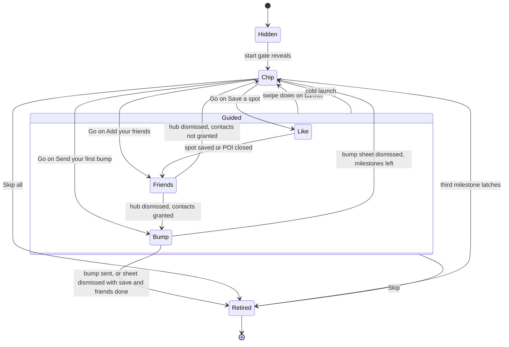

The map tutorial teaches a new rider three things on the map tab: save a spot, add friends, and send a bump. It never opens on its own. An eligible user first sees a progress chip, and guided coaching starts only when they tap **Go** on a checklist row.

`MapTutorialProvider` sits in the map tab's [provider stack](/engineering/mobile/map-tab-internals#provider-stack). For the friends hub and bump sheet that the tutorial points at, see [Social and contacts](/engineering/mobile/social-and-contacts).

## Pieces

| Piece | Path | Role |
| --- | --- | --- |
| `mapTutorialStore` | `stores/mapTutorialStore.ts` | Persisted per-user state: status, current step, milestone latches, retire and reveal flags |
| `MapTutorialProvider` | `providers/MapTutorialProvider.tsx` | Loads the user's slice, runs the start gate, derives sub-states and the highlight, latches milestones, fires analytics |
| Pure rules | `lib/map/mapTutorial.ts` | Step order, start rule, surface rule, flow counter, demo spot picker, override parsing |
| `MapTutorialOverlay` | `components/map/tutorial/MapTutorialOverlay.tsx` | Renders the chip, banner, coach-mark, contacts primer, and confetti |
| `TutorialProgressChip` | `components/map/tutorial/TutorialProgressChip.tsx` | The **Unlock Map** pill and its checklist |
| `TutorialCoachMark` | `components/map/tutorial/TutorialCoachMark.tsx` | Arrow callout anchored under a measured control |
| `BumpAutoOpen` | `components/map/tutorial/BumpAutoOpen.tsx` | Renders nothing. Opens a demo spot during the bump step |
| `useTutorialFeedReturn` | `components/map/layout/useTutorialFeedReturn.ts` | Returns the sheet to the feed when the friends step begins |

`MapAboveSheetOverlays` mounts `MapTutorialOverlay` and `BumpAutoOpen`. The overlay isn't mounted while the ride request route is active.

## Status, surface, and steps

The store holds a `status` (`unstarted`, `active`, `completed`, `skipped`) and a `currentStep` (`like`, `friends`, `bump`). `resolveTutorialSurface` turns that state into one of three surfaces:

| Surface | When |
| --- | --- |
| `hidden` | The user is off the map, `progressRetired` is set, `revealed` is false, or all three milestones are done. Also while the user's slice hasn't loaded |
| `banner` | `status` is `active` |
| `chip` | Any other status, once revealed |

"Off the map" means the pathname doesn't start with `/map` and isn't `/`.

`Guided` is `status: 'active'`. `Retired` is `progressRetired: true`, which hides every surface for good. The third-milestone edge retires progress only when `status` isn't `unstarted`; see [Gotchas and edge cases](#gotchas-and-edge-cases).

### Start gate

The provider's start gate runs at most once per mount and account, after the logged-in user's slice has loaded. `shouldStartTutorial` passes when all of these hold:

1. The override isn't `never`.
2. Location permission is granted.
3. The user is on the map.
4. `status` is `unstarted`.

When it passes and `revealed` is still false, the provider calls `reveal()` and fires `tutorial_map_started`. Only the chip appears. A returning user who is already revealed keeps the chip, and the event doesn't fire again.

### Chip and checklist

The chip is a glass pill labelled **Unlock Map** with a red badge showing how many milestones are left. Tapping it expands a checklist upward:

| Row | Step | Done when |
| --- | --- | --- |
| **Save a spot** | `like` | `savedSpotDone` |
| **Add your friends** | `friends` | `addedFriendDone` |
| **Send your first bump** | `bump` | `sentBumpDone` |

Only the first incomplete row shows **Go**. It calls `focusStep`, which sets `status: 'active'` and `currentStep` to that row's step. The last row also carries **Skip all**. An outside tap closes the checklist.

While any tutorial surface is showing, the layout passes `hideControls` to `SavedSpotsBar`, and the overlay hosts its own recenter button in the same dock. The featured spot pill renders beside the chip in a horizontal scroll row.

### Guided surfaces

In the `banner` surface, the overlay checks these conditions in order and renders the first match:

| Condition | What renders |
| --- | --- |
| Contacts primer is anchored | The contacts primer tooltip |
| A control is highlighted and has reported its rect | `TutorialCoachMark` under that control, with **Skip** |
| `heart` or `send` is highlighted with no rect | Nothing but the recenter button |
| `friends` is highlighted with no rect | Nothing but the recenter button for 300 ms, then the docked banner |
| Friends step, `needInvite` | Nothing but the recenter button. The friends hub is the UI |
| Bump step, `needSave` or `needPoi` | Nothing but the recenter button for 2 seconds, then the docked banner |
| Just saved in the like step | Confetti only |
| Otherwise | The docked `YeloTutorialBanner` with **Skip** |

The docked banner tracks the sheet's top edge. A downward swipe past `rem(1)`, or with a velocity above 600, dismisses guidance.

The step label reads `Step X of Y` from `resolveFlowProgress`. Each step numbers its own sub-steps: like and friends are two each, and bump is a single step with no label.

## Steps and sub-states

Sub-states are derived on every render and never persisted.

### Like

| Sub-state | When | Highlight | Banner copy |
| --- | --- | --- | --- |
| `needPoi` | No POI is open | none | **Tap a place on the map** |
| `needHeart` | A POI is open and not saved | `heart` | **Tap the heart to save it** |
| `alreadySaved` | The open POI is already saved | none | **Already saved** |

The heart coach-mark reads **Tap to save this spot**. `PoiHeader` reports the open POI's saved flag through `setSelectedPoiSaved` and measures the heart for the coach-mark. The heart is spotlighted only while the POI header is expanded.

The step ends one of two ways:

- **Saved.** The open POI's saved flag flips from false to true. Confetti bursts from the heart's last measured position. After 1,200 ms (`SAVE_ROUTE_BACK_DELAY_MS`) the provider advances to friends.
- **Closed without saving.** A POI was open and is now closed, with no qualifying save and `savedSpotDone` not yet latched. The provider latches the save milestone and advances immediately, with no confetti.

Both paths fire `tutorial_map_step_completed` with `step: 'like'`.

Tapping send on a POI during the like step calls `showNudge` instead of opening the bump sheet. The nudge swaps the docked banner copy to **Save a spot first** for 2,200 ms.

### Friends

| Sub-state | When | Highlight | Banner copy |
| --- | --- | --- | --- |
| `needOpen` | The friends hub hasn't opened in this step | `friends` | **Yelo works best with friends** |
| `needInvite` | The hub has opened | none | Suppressed |

On entry, `useTutorialFeedReturn` runs once: it dismisses an open POI back to the feed and snaps the sheet to index 1. The coach-mark, **Tap to add friends**, points at the friends button in the top-right profile dock (`ProfileDriveBubble`).

If contacts permission isn't granted, tapping the friends button, or an empty slot or invite link in the feed's friends rail, shows a contacts primer tooltip instead of the hub:

- **Allow contacts** requests the permission, then opens the friends hub whatever the answer.
- **Not now** hides the primer.

Both friends hub sheets report `onOpened` and `onDismiss` to the provider. Opening sets `needInvite` and latches `friendsHubOpened`. Dismissing the hub during this step fires `tutorial_map_step_completed` with `step: 'friends'`, then:

- Advances to bump when contacts permission is granted.
- Sets `status: 'completed'` otherwise, which drops back to the chip.

### Bump

| Sub-state | When | Highlight | Banner copy |
| --- | --- | --- | --- |
| `needPoi` | No POI open, likes still loading or the user has a saved spot | none | **Finding a spot for you…** |
| `needSave` | No POI open, likes loaded and empty | none | **Finding a spot for you…** |
| `needSend` | A POI is open | `send` | **Bump = ping your friends** |
| `needFind` | The demo spot was shown and closed, or no spot could be found | none | **Pick a place to bump** |

The send coach-mark reads **Tap to bump**. `PoiSheet` reports the bump sheet's `onSent` and `onDismiss`:

| Call | Guard | Effect |
| --- | --- | --- |
| `reportBumpSent` | Revealed and not retired, in any status | Latches all three milestones. In the active bump step, also fires `tutorial_map_step_completed` and completes |
| `reportBumpSheetDismissed` | Active bump step only | Latches the bump milestone only if save and friend are already done. Fires `tutorial_map_step_completed` and completes |

### Demo spot auto-open

`BumpAutoOpen` opens one spot per entry into the bump step, so the user lands on the bump button without hunting for a pin. `resolveBumpAutoOpenTarget` picks the target:

1. The first entry in the user's likes.
2. The community POI nearest the user, or the first valid one when the user's location is unknown.
3. A place named **A spot nearby** at the user's own location.
4. `null` when none of those exist.

The sequence:

1. Wait 600 ms (`BUMP_AUTO_OPEN_DELAY_MS`) after the step begins, on the map, with no POI open.
2. Set the selected coordinates and push the POI route with `animateIn: '1'`, which fades the sheet content in.
3. Wait 550 ms (`BUMP_FLY_DELAY_MS`), then fly the camera to the spot at zoom 16.

Both timers re-read the store before acting. They stop if the status, step, retired flag, or loaded user changed. The component never reopens a spot the user closed. It reports "no target" only after both the likes and community POI queries settle, which switches the sub-state to `needFind`.

## Milestones

The chip and the finale read three persisted latches. Each latches independently and never regresses.

| Latch | Set when |
| --- | --- |
| `savedSpotDone` | The likes query has loaded with at least one like. Also when a POI is closed without saving during the like step, and on any sent bump |
| `addedFriendDone` | Friends plus sent invites total at least 3 (`FRIENDS_MILESTONE_TARGET`) and `friendsHubOpened` is latched. Also on any sent bump |
| `sentBumpDone` | A bump is sent. Also when the bump sheet is dismissed in the active bump step with the other two already done |

A user who already has three friends must still open the friends hub once before the friend milestone latches.

When the count reaches three, the finale effect fires `tutorial_map_completed`, calls `retireProgress()`, and shows a confetti burst for 2,800 ms. The burst comes from the send button's last measured position, or the screen center if it was never measured. The effect runs once per account and doesn't run while `status` is `unstarted`.

## Skipping

| Control | Store action | Result |
| --- | --- | --- |
| **Skip** on the banner or coach-mark | `skipAll` | `status: 'skipped'` and `progressRetired: true`. No surface returns |
| **Skip all** on the checklist | `skipAll` | Same |
| Swipe down on the banner | `skip` | `status: 'skipped'`. The chip stays, and **Go** resumes guidance |

All three fire `tutorial_map_skipped` with the current step. A second **Skip** is a no-op once progress is retired.

## Persistence

The store persists to AsyncStorage through Zustand's `persist` middleware with `skipHydration: true`. The provider calls `loadForUser(userId)` instead, which reads the user's own key and applies it in one `set`.

| Key | Purpose |
| --- | --- |
| `map-tutorial:<userId>` | The user's slice |
| `map-tutorial:__pending` | Placeholder name before the first load. Never read |
| `map-tutorial` | Legacy device-wide blob. Migrated once into its owner's slice, then removed |

| Field | Default | Meaning |
| --- | --- | --- |
| `status` | `unstarted` | Tutorial status |
| `currentStep` | `like` | Step the guided flow is on |
| `savedSpotDone`, `addedFriendDone`, `sentBumpDone` | `false` | Milestone latches |
| `progressRetired` | `false` | Hides every surface permanently |
| `revealed` | `false` | Whether the chip has ever been shown |
| `friendsHubOpened` | `false` | Whether the user has ever opened the friends hub |

Load rules:

- A persisted `active` status loads as `unstarted`. Guidance never resumes on a cold launch; the chip is the way back in.
- A slice written before `revealed` existed counts as revealed when it shows any progress.
- The legacy blob migrates only when its `ownerUserId` is missing or matches. Its step position implies which milestones were done, and a completed legacy user stays retired.
- The provider renders nothing and latches nothing until `hydratedUserId` equals the logged-in user. It also resets all per-session state on every account change, because the provider isn't remounted on logout and login.

## Override env var

`EXPO_PUBLIC_MAP_TUTORIAL_OVERRIDE` is read once at module load in `lib/map/mapTutorial.ts`. Any value other than the two below is ignored.

| Value | Effect |
| --- | --- |
| `always` | Every launch, once location is granted and the user is on the map: resets the store, clears sent invites, calls `start()` so guidance opens directly on the like step, and fires `tutorial_map_started`. Milestone counts are baselined at the start of the run, so the chip fills from 0. `FriendsProvider` also removes the persisted sent-invite and favorites-prompt keys |
| `never` | The start gate never reveals the tutorial |

The variable isn't gated by `__DEV__` and isn't listed in `.env.example`. See [Developer and QA toggles](/engineering/mobile/widgets-and-experiments#developer-and-qa-toggles).

## Analytics events

`useMapTutorialAnalytics` in `lib/analytics/events/mapTutorial.ts` defines four events. The full catalog is in [Analytics events](/reference/analytics-events).

| Event | Properties | Fired when |
| --- | --- | --- |
| `tutorial_map_started` | none | The start gate first reveals the chip. Also every launch under `always` |
| `tutorial_map_step_completed` | `step` | A guided step ends: save or close for like, hub dismissal for friends, send or sheet dismissal for bump |
| `tutorial_map_skipped` | `step` | **Skip**, **Skip all**, or a swipe down on the banner |
| `tutorial_map_completed` | none | The finale fires after the third milestone |

## Where this lives in code

| Concern | Path |
| --- | --- |
| Store and its tests | `yelo-frontend/stores/mapTutorialStore.ts`, `mapTutorialStore.test.ts` |
| Provider and anchor hook | `yelo-frontend/providers/MapTutorialProvider.tsx` (`useMapTutorial`, `useMapTutorialOptional`, `useReportControlAnchor`) |
| Pure rules and their tests | `yelo-frontend/lib/map/mapTutorial.ts`, `mapTutorial.test.ts` |
| Overlay, chip, coach-mark, auto-open | `yelo-frontend/components/map/tutorial/` |
| Feed return and overlay mount | `yelo-frontend/components/map/layout/useTutorialFeedReturn.ts`, `MapAboveSheetOverlays.tsx` |
| Analytics | `yelo-frontend/lib/analytics/events/mapTutorial.ts` |
| Controls that report to the tutorial | `yelo-frontend/components/map/poi/PoiHeader.tsx`, `PoiSheet.tsx`, `components/home/ProfileDriveBubble.tsx`, `components/map/feed/MapFeedFriendsRail.tsx` |
| Banner and coach-mark cards | `yelo-frontend/components/design-system/YeloTutorialBanner.tsx`, `CoachMarkCard.tsx` |

## Gotchas and edge cases

<AccordionGroup>
  <Accordion title="A bump sent from the chip never fires the completed event">
    A revealed user who never taps **Go** stays at `status: 'unstarted'`. Sending a bump latches all three milestones, so the chip hides. The finale effect returns early for `unstarted`, so `tutorial_map_completed` doesn't fire and `progressRetired` stays false. The same applies after a cold launch, which resets `active` to `unstarted`.
  </Accordion>
  <Accordion title="Closing a spot counts as saving one">
    During the like step, opening a POI and closing it latches `savedSpotDone`. The checklist then shows **Save a spot** as done even though nothing was saved.
  </Accordion>
  <Accordion title="Dismissing the friends hub ends the step, not the milestone">
    The friends step completes on any hub dismissal. The **Add your friends** row stays open until friends plus sent invites reach three.
  </Accordion>
  <Accordion title="Without contacts permission, guidance stops after friends">
    Dismissing the friends hub without contacts permission sets `status: 'completed'` instead of advancing. The bump row's **Go** still starts the bump step from the chip.
  </Accordion>
  <Accordion title="Drivers have no friends button">
    `ProfileDriveBubble` swaps the friends button for the drive button when `driver_application_status` is `approved` or `complete`. The friends highlight never gets a rect, so the overlay falls back to the docked banner after 300 ms. Its subtitle still says **Tap the glowing button, top-right**.
  </Accordion>
  <Accordion title="The nudge is hidden behind the heart coach-mark">
    The overlay returns the coach-mark branch before it reads `nudgeVisible`. With an unsaved POI open, the heart is highlighted, so **Save a spot first** doesn't render.
  </Accordion>
  <Accordion title="never doesn't hide an existing chip">
    `never` blocks only the start gate. `resolveTutorialSurface` doesn't read the override, so a user who was already revealed still sees the chip.
  </Accordion>
  <Accordion title="Unused helpers">
    `isLikeSatisfied`, `deriveMilestones`, and `allMilestonesDone` in `lib/map/mapTutorial.ts` are called only by tests. The provider qualifies the like step from the open POI's saved flag and reads milestones from the store's latches. The `needSave` and `needPoi` sub-states also share the same copy.
  </Accordion>
</AccordionGroup>
