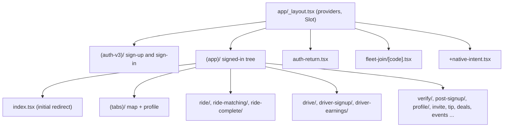

Every file under `app/` is a route. Layouts (`_layout.tsx`) compose providers and stacks. Route groups in parentheses, like `(app)` and `(auth-v3)`, organize files without adding a URL segment.

<Warning>
Route files are URLs. Numbered names such as `1-hub.tsx` are deliberate, and push notifications and deep links may target them. Do not rename them casually.
</Warning>

## Top-level structure

`app/(app)/index.tsx` is the initial route. Once the session read finishes, it replaces itself with `/(app)/(tabs)/map` if a JWT exists, or `/(auth-v3)` if not.

## Route map

### Sign-in: `app/(auth-v3)/`

| Route | Purpose |
| --- | --- |
| `index` | Entry screen. **Get Started** starts the Auth v3 flow. |
| `method` | Native method chooser (Apple, Google, phone). |
| `phone`, `phone-confirm` | Native phone number and OTP entry. |
| `finish-profile` | First and last name for new accounts. |
| `permissions` | Location, notifications, and contacts. Skipped when all three are already granted. |
| `error` | Terminal Auth v3 errors, with the hosted-web fallback. |

See [Auth and onboarding](/engineering/mobile/auth-and-onboarding) for the flow.

### Signed-in: `app/(app)/`

| Route | Purpose |
| --- | --- |
| `(tabs)/map/index` | Home map with the glass bottom sheet feed. |
| `(tabs)/map/request` | Ride request sheet: stops, vehicle selection, payment, confirm. |
| `(tabs)/map/poi/[poiId]`, `poi/place` | Place detail sheets. |
| `(tabs)/map/friend/[friendId]`, `friends` | Friend detail and friends hub. |
| `(tabs)/map/vehicle/[vehicleId]` | Vehicle detail on the map. |
| `(tabs)/map/moves`, `drops`, `featured` | "See all" lists for feed sections. |
| `(tabs)/profile` | Profile sheet, presented from the bottom. |
| `profile/settings`, `accounts`, `ride-details`, `community-switch` | Settings, connected accounts and student verification proofs, ride history detail, community switcher. |
| `profile/experiments`, `glass-lab`, `color-lab`, `design-system-lab` | Internal labs, gated by experiments. |
| `ride/4-ride` | Active rider trip (`driver_en_route`, `driver_waiting`, `in_progress`). |
| `ride/pickup`, `ride/dropoff`, `ride/3-ride-matching` | Legacy rider screens still registered in the ride stack. The lifecycle router no longer targets them. |
| `ride-matching/1-waiting`, `2-queued`, `leave-queue` | Matching and queued states. `index` redirects to `1-waiting`. |
| `ride-complete/index` | Rating and tip for `pending_rider_rating`. |
| `tip/[slug]` | Opens the web tip page for a driver tip code. |
| `drive/index` | Driver map: shift sheet, ride cards, current ride. |
| `drive/queue/index`, `queue/[rideId]` | Driver queue and per-ride chat or detail. |
| `drive/driver-hub/1-hub` to `6-vehicle-details` | Driver hub: photo, history, vehicle. |
| `driver-signup/1-hub` to `8-submitted`, `driver-signup/verify/*` | Driver application steps. `index` redirects to `1-hub`. |
| `driver-earnings/1-hub`, `2-all-activity`, `3-all-payouts` | Earnings and payouts. |
| `driver-marketing` | "Why drive" marketing screen. |
| `verify/1-oauth`, `2-email`, `3-email-confirm` | Post-signup student verification. |
| `post-signup/10-marketing`, `14-student` | Post-profile tail: driver-signup exit and World Cup student claim. |
| `invite/[code]` | Friend invite preview and connect. |
| `link` | Decodes an encoded `yeloLink` param through `/link/decode` and navigates to the result. |
| `referral-share` | Referral share card. |
| `scan-qr` | Camera QR scanner. Opens the scanned URL with `Linking.openURL`. |
| `connect-uber`, `connect-lyft`, `connect-empower` | Third-party rideshare account connection for the price aggregator. |
| `deals/[dealId]`, `events/[eventId]` | Deal and event detail. |
| `save-location` | Save a named place. |

<Note>
Despite its name, `(tabs)/_layout.tsx` is a `Stack`, not a tab navigator. It holds `map` and `profile`, with `profile` sliding up from the bottom. The map tab is itself a `Stack` rendered inside a `GlassBottomSheet`, wrapped in `transparentNavTheme`.
</Note>

### Outside both groups

| Route | Purpose |
| --- | --- |
| `auth-return.tsx` | Landing route for the Auth v3 callback. Redirects to `/`, to `/(app)/profile/accounts` if an identity link is pending, or to `/(auth-v3)`. |
| `fleet-join/[code].tsx` | Fleet invite. Sends signed-out users to `/(auth-v3)`, then routes drivers to driver signup or the driver hub. |
| `+native-intent.tsx` | Rewrites incoming OS URLs before routing. See [Deep links](#deep-links). |
| `+not-found.tsx` | Fallback for unknown paths. |

## Route guards

Several pieces decide where a user belongs. Each owns one concern.

| Guard | File | What it does |
| --- | --- | --- |
| Initial redirect | `app/(app)/index.tsx` | JWT present: map. No JWT: `/(auth-v3)`. |
| Profile guard | `app/(app)/_layout.tsx` | Calls `resolveOnboardingRoute`. If `signup_status.profile_initialized` is false, it signs the session out once so the user starts a clean Auth v3 transaction. |
| Driver guard | `components/auth/StatusGuard.tsx` | If `user_status` is `driving` and the path does not contain `/drive`, it replaces to `/(app)/drive`. |
| Rider lifecycle | `hooks/ride/useRideLifecycleNavigation.ts` | The only owner of status-driven rider navigation. Mounted by `app/(app)/_layout.tsx`. |
| Auth v3 screens | `app/(auth-v3)/*` | Each screen bounces to the entry screen when there is no live transaction, unless `phase` is `complete`. |

Both `StatusGuard` and the rider lifecycle hook skip `/scan-qr`, `/tip/`, and (for `StatusGuard`) `/fleet-join/`. A rider can scan a driver's tip code while still marked as riding, so the tip flow must win.

<Warning>
`StatusGuard` ignores stale cached status while a refetch is in flight. It waits for a fresh `/user/status` response before redirecting, so a persisted or retained status never yanks the user on cold start.
</Warning>

## Server-driven mode

The client never decides whether a user is riding or driving. `GET /user/status` returns `user_status`, `current_ride_id`, `current_ride_status`, and the `ride_state` snapshot. The app routes from that.

- `driving`: `StatusGuard` forces the `/drive` tree.
- `riding`: `useRideLifecycleNavigation` maps the ride status to a screen.
- Anything else: the user navigates freely.

`lib/ride/riderRoute.ts` holds the rider mapping:

| `current_ride_status` | Target |
| --- | --- |
| `requested` | No redirect. The request sheet is still being configured. |
| `confirmed`, `no_drivers_available` | `/(app)/ride-matching/1-waiting` |
| `queued` | `/(app)/ride-matching/2-queued` |
| `driver_en_route`, `driver_waiting`, `in_progress` | `/(app)/ride/4-ride` |
| `pending_rider_rating` | `/(app)/ride-complete?rideId=<id>` |
| `complete` | `/(app)/(tabs)/map` |

`lib/ride/lifecycleNavigation.ts` adds the edge cases:

- It stays put on `leave-queue` while the ride is still matching.
- If a status response clears the ride while the user is inside the ride flow, it returns to the map. If the previous status was restartable and the persisted `rideMatchingSnapshotStore` belongs to the same account and ride, it reopens `map/request` with the old pickup and dropoff.
- An incomplete payload is never treated as proof that the ride ended.

For how the status cache is kept fresh, see [Rider and driver flows](/engineering/mobile/rider-and-driver-flows#polling-and-push). For the product semantics of each status, see [Ride lifecycle](/concepts/ride-lifecycle).

## Deep links

### URL schemes and domains

| Kind | Value | Source |
| --- | --- | --- |
| Custom schemes | `com.rideyelo`, `yelo` | `app.json` `scheme` |
| E2E schemes | `com.rideyelo.e2e`, `yelo-e2e` | `app.config.ts` when `EXPO_PUBLIC_APP_ENV=e2e` |
| iOS universal links | `yelo.link`, `join.yelo.link`, `invite.yelo.link` | `ios.associatedDomains` |
| Android App Links | `yelo.link` (root and `/fleet-*`), `join.yelo.link`, `invite.yelo.link` | `android.intentFilters` with `autoVerify` |
| Android Uber callback | `uberauth://` | `app.config.ts`, non-E2E builds only |
| Auth v3 callback | `com.rideyelo://auth/v3/callback` | `lib/auth/security.ts` |

Changing any of these is a native change. See [Releases](/engineering/mobile/releases#ota-versus-native-rebuild).

### Rewrites in `+native-intent.tsx`

`redirectSystemPath` rewrites URLs that have no matching file route:

| Incoming URL | Rewritten to |
| --- | --- |
| `com.rideyelo://auth/v3/callback?...` | `/auth-return`. Ignored while an Auth v3 browser session is active, because `WebBrowser.openAuthSessionAsync` consumes it. |
| `uberauth://...` | `/connect-uber`. Credentials stay out of router params. |
| `https://yelo.link/fleet-<code>` | `/fleet-join/<code>` |
| `https://invite.yelo.link/fleet/<code>` | `/fleet-join/<code>` |
| `https://join.yelo.link/<code>`, `https://invite.yelo.link/<code>` | `/invite/<code>`, or `/` without a code |
| `https://signup.yelo.link/.../tip/<slug>` | `/tip/<slug>` with the original query string |
| `https://joinyelo.com/...` | `/` |
| Any other `*.yelo.link` URL | `/` |

Any other URL passes through unchanged, so `com.rideyelo://<route>` opens that route directly.

<Note>
`signup.yelo.link` is handled in `+native-intent.tsx` but is not in `ios.associatedDomains` or the Android intent filters. A tip link on that host only reaches the app if something else, such as the QR scanner, opens it.
</Note>

### Building links

- `lib/navigation/deepLink.ts` wraps a router path as `http://redirect.rideyelo.com/?deepLink=com.rideyelo://<path>`.
- Push notifications carry a `url` or `route` field in their data. Tapping one calls `router.push` with that value. See [Rider and driver flows](/engineering/mobile/rider-and-driver-flows#push-notifications).

## Adding a route

<Steps>
  <Step title="Create the file">
    Add the screen under the right group, for example `app/(app)/my-feature/index.tsx`. Add a `_layout.tsx` if the feature needs its own stack or provider.
  </Step>
  <Step title="Register stack options">
    If the route sits directly under `(app)`, add a `Stack.Screen` entry in `app/(app)/_layout.tsx` for its animation and gesture options.
  </Step>
  <Step title="Navigate with typed routes">
    Run Metro once so `.expo/types/router.d.ts` regenerates. Then `router.push('/(app)/my-feature')` is type-checked by `make typecheck`.
  </Step>
  <Step title="Check the guards">
    If the screen must stay open while the user is riding or driving, add an exemption to `StatusGuard` and `decideRideNavigation`. Otherwise, the guards redirect away from it.
  </Step>
</Steps>
