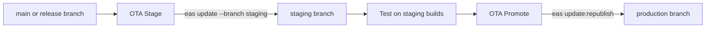

The mobile app ships two ways:

- **OTA updates** (EAS Update) replace the JavaScript bundle and assets on installed binaries. They reach users in minutes.
- **Store builds** (EAS Build and Submit) produce a new native binary. They go through App Store and Google Play review.

The deciding question for every change is whether it alters the native layer. The **fingerprint** answers it.

For the API and web deploys, see [Deployment](/engineering/deployment).

## Branch model

- `main` is the next release.
- When a store version goes live, a **release branch** named after the version (for example `5.7.4`) is cut from its tag. It takes OTA backports until the next store version ships.
- `version` in `app.json` is the only hand-edited version. It is `5.7.4` on `main` today.

## OTA versus native rebuild

`runtimeVersion` uses the `fingerprint` policy. EAS hashes the native inputs, and an OTA update only reaches binaries with the same hash. Bumping `version` alone does not orphan shipped binaries.

| Ships over the air | Needs a store build |
| --- | --- |
| Screens, components, styles, copy | `package.json` or `pnpm-lock.yaml` changes |
| Providers, hooks, stores, navigation | `app.json` or `app.config.ts` |
| Polling intervals, query config | `eas.json` (except the `submit` section) |
| Regenerated Orval client | `patches/` |
| | Adding or upgrading a native module |
| | Permissions, background modes, entitlements |
| | URL schemes, associated domains, intent filters |
| | Expo config plugins (Mapbox, Stripe, fonts, splash, notifications) |
| | Expo SDK upgrades |

<Warning>
Any change to a native input needs a new build and a human decision. Put it in its own PR and say so in the description. This includes `package.json` and lockfile changes, even for pure-JS packages that do not change the fingerprint. The **Fingerprint** check comments on every same-repo PR and warns when the native fingerprint changes.
</Warning>

`fingerprint.config.js` keeps two things out of the hash:

- The `submit` section of `eas.json` is normalized, so changing submit settings does not create a new runtime.
- `platforms` in the Expo config is pinned to Expo's default while hashing.

On Android, the fingerprint includes `google-services.json`. CI pulls it from the production EAS environment as a sensitive file variable with `eas env:pull`. Keep it in EAS, not in GitHub.

## Build profiles

Profiles live in `eas.json`. `appVersionSource` is `remote`, so EAS owns build numbers.

| Profile | Distribution | Channel | EAS environment | Notes |
| --- | --- | --- | --- | --- |
| `production` | Store | `production` | `production` | `autoIncrement` build number |
| `staging` | Internal | `staging` | `production` | Installable staging build for the team |
| `preview` | Internal | `preview` | `production` | |
| `development` | Internal | `development` | `production` | `autoIncrement`. `developmentClient` is false. |
| `simulator` | Internal | `development` | `production` | iOS simulator build |
| `e2e-simulator` | Internal | `e2e` | `preview` | Sets `EXPO_PUBLIC_APP_ENV=e2e` and the E2E API URL. OTA updates are disabled. Android builds an APK. |

The E2E variant has its own bundle id (`io.flutterflow.ridedesi.desirider.e2e`), Android package (`com.rideyelo.e2e`), app name, and URL schemes, all set in `app.config.ts`. See [Testing](/engineering/testing).

Production identifiers:

| Platform | Identifier |
| --- | --- |
| iOS bundle id | `io.flutterflow.ridedesi.desirider` |
| Android package | `com.rideyelo` |
| Expo owner and slug | `rideyelo/yelo` |

## Store builds

<Steps>
  <Step title="Dispatch the build">
    In GitHub Actions, run **EAS Build** (`.github/workflows/build.yml`) from `main`. Pick targets: iOS or Android, staging or production, and whether to submit. Production targets require the actor to be in the `RELEASE_ADMINS` repo variable and the ref to be `main`, unless `allow_non_main` is set.
  </Step>
  <Step title="EAS runs the workflow">
    The action queues `.eas/workflows/build-and-submit.yml` and returns. EAS builds each selected profile. For iOS production, a verify job downloads the IPA and refuses to submit if Reanimated and Worklets are linked inconsistently.
  </Step>
  <Step title="Submit and tag">
    With `submit_ios` on, EAS submits the build to App Store Connect (`ascAppId` in `eas.json`). A successful iOS submit creates the immutable tag `v<version>-<build>` and a draft GitHub release.
  </Step>
  <Step title="Finalize when live">
    After the version is live in the App Store, run **Finalize App Store release** with the tag. It checks the public store version, creates the release branch from the tag, and publishes the GitHub release as latest.
  </Step>
</Steps>

Staging iOS builds post an install link and QR code to Slack through the **Staging Build Slack** workflow. To install staging builds on a new device, register it with `pnpm dlx eas-cli@22.0.0 device:create`, then rerun the build with `refresh_ios_staging_profile`.

For a local iOS build, run `make build-app`.

## OTA updates

OTA is a two-step flow: stage, then promote.

### Stage

**OTA Stage** (`.github/workflows/ota-stage.yml`) bundles a source ref and publishes it to the `staging` branch.

- Run it manually with `source_ref`, `platforms`, and `message`, or with `make eas-stage MESSAGE="..." [REF=main] [PLATFORM=all]`.
- It also runs nightly at 09:00 UTC. The nightly run skips platforms already staged from the same commit.
- Before publishing, it computes the fingerprint for each platform and requires a finished `staging` or `preview` build with that runtime. If a platform has none, nothing is staged.
- The bundle always targets `https://api.rideyelo.com/`.

### Promote

**OTA Promote** (`.github/workflows/ota-promote.yml`) republishes exact staged update groups to the `production` branch.

- Pass the staged `source_commit`, or exact group ids. `make eas-promote GROUP=<uuid> MESSAGE="approved"` dispatches it with a group id.
- It requires a release admin, checks that the groups match the requested commit, and skips platforms that are already current.
- It requires a finished `production` channel build with the same runtime before republishing. It does not recompute the fingerprint.
- To roll back, run it with `action: rollback` and the production group id to restore.

### Backports

Every OTA-safe PR merged to `main` is considered for the supported release branch by `backport-supported-release.yml`. Add the `skip-supported-release-backport` label to opt out. PRs that touch native inputs are never auto-backported, and the Fingerprint check blocks native drift on release branches.

- The workflow triggers only on PRs merged into `main`. Merging a rolling backport PR into a release branch does not re-trigger it. You can also run it manually with a merged `main` PR number.
- The supported branch comes from the latest GitHub release tag (for example `v5.7.3-269` maps to `5.7.3`).
- The yelo-bot app keeps one rolling draft PR per release branch, from `backport/<branch>/rolling`, titled `backport(<branch>): rolling OTA-safe changes`. Each eligible PR's commits are appended and listed under **Queued source PRs**.
- Keep the rolling PR in draft while it collects changes. Mark it ready when you want CI and the release fingerprint gate to run for the batch, then merge it and stage the release branch.

### How devices pick up updates

- `updates.checkAutomatically` is `ON_LOAD` with a 3-second `fallbackToCacheTimeout`. A cold launch checks for an update natively, which recovers even when JS cannot mount.
- `providers/EasUpdateObserver.tsx` checks again when the app returns to the foreground, at most every 30 minutes, and only when `EXPO_PUBLIC_IS_PRODUCTION` is `true`. It downloads the update for the next restart. It does not reload the app.
- After sign-in, the `(app)` layout reports `app_version` and `Updates.updateId` to the API with `useUserUpdateAppVersion`.
- `lib/analytics/AnalyticsProvider.tsx` registers `ota_update_id` (`embedded` when running the binary's bundle), `ota_runtime_version`, and `ota_is_embedded` as PostHog super properties, so every event records which update was loaded.
- Tapping repeatedly on the auth entry screen reveals the app version and the first 8 characters of the update id.

## Update-required gate

The API sets a minimum store version. `GET /update-required?version=<native version>` answers:

- `200` with `data.needs_update: false` when the version is supported.
- `426 Upgrade Required` with `app_link` (in `data` and at the top level) when it is not.

The minimum lives in `minimumFrontendVersion` in `yelo-api` `internal/server/http/healthcheck/healthcheck_handler.go`. It is `5.7.3` today.

The app checks it in two places:

| Where | Behavior |
| --- | --- |
| `app/_layout.tsx` | On launch and every 10 minutes while foregrounded. A 426 replaces the whole app with `UpdateRequiredScreen`, which opens the store link. Errors are logged and ignored. |
| `ensureRideEntryVersion()` | Before confirming a ride request and before a driver goes online. A 426 shows an alert. An error or malformed response blocks the action with a retryable message. |

<Note>
The ride-entry gate is admission only. Never put it on cancel, pickup, or completion of an existing ride. A store-version floor also does not prove OTA or protocol support. It only checks `Application.nativeApplicationVersion`.
</Note>

To force an update, raise `minimumFrontendVersion` in the API and deploy it. Only raise it once the new version is live in both stores.

## Release checklist

<Steps>
  <Step title="Confirm the change type">
    Check the Fingerprint comment on your PR. No change means OTA. A change means a store build.
  </Step>
  <Step title="Run the gates">
    Run `make check` locally. CI runs the same lint, format, typecheck, type-aware lint, Jest, and `api-check` jobs.
  </Step>
  <Step title="For OTA">
    Merge to `main`, run **OTA Stage**, verify on a staging build, then run **OTA Promote** with the staged commit.
  </Step>
  <Step title="For a store build">
    Bump `version` in `app.json`, merge, run **EAS Build** for production, then run **Finalize App Store release** when the version is live.
  </Step>
</Steps>
