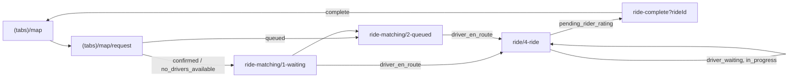

The rider and driver experiences share one binary and one status cache. `GET /user/status` says whether the user is riding or driving and which ride is current. Providers read that cache, fetch ride details, and draw the map. Pushes make the cache fresh. Polls are the safety net.

For status meanings and transitions, see [Ride lifecycle](/concepts/ride-lifecycle). For how status drives navigation, see [Navigation](/engineering/mobile/navigation#server-driven-mode).

## Rider flow

### Screens by status

| Stage | Route | Provider | What happens |
| --- | --- | --- | --- |
| Request | `(tabs)/map/request` | `usePreRideRequest` | Picks stops, calls `POST /ride/v2/` with `X-Features: tips,driver-options`, shows vehicle options and third-party quotes. The server ride is `requested`. |
| Confirm | same | `StripePaymentScreen` | Runs `ensureRideEntryVersion()`, confirms a Stripe PaymentSheet setup intent, then calls `POST /ride/i/:id/confirm`. |
| Matching | `ride-matching/1-waiting`, `2-queued` | `RideMatchingProvider` | Shows the persisted `rideMatchingSnapshotStore` summary while pinging. `leave-queue` handles cancellation. |
| Active | `ride/4-ride` | `RideProvider` | Draws driver, pickup, dropoff, and route. Hosts the rider chat sheet and cancel modal. |
| Rate and tip | `ride-complete` | none | `POST /ride/i/:id/rate` with `rating`, `feedback`, and `tip_amount`. Skipping sends nulls. |

`ride/pickup`, `ride/dropoff`, and `ride/3-ride-matching` are still registered in the ride stack but are no longer lifecycle targets.

### `RideProvider`

`providers/RideProvider.tsx` is mounted by `app/(app)/ride/_layout.tsx` with a ref to the ride map. It:

- Reads `/user/status` from the cache. It never sets its own interval on that key.
- Pings `GET /ride/i/:id/ping` every 5 seconds while the status is `requested`, `confirmed`, or `no_drivers_available`.
- Fetches `GET /ride/:id` when the current ride id changes, and invalidates it when the status or `ride_state.session_revision` changes.
- Polls `GET /ride/i/:id/map-details` every 3 seconds during `driver_en_route`, `driver_waiting`, and `in_progress`.
- Pushes pickup, dropoff, route, and driver markers into `CustomMapView` for each status group.
- Exposes `createRide`, `submitIssue` (`POST /issue/`), and `cancelModalRef`.

`RideMatchingProvider` is a slimmer version for the matching stack: status from the cache, the same 5-second ping, and ride details refreshed on every status or revision change.

### Command safety

Rider and driver mutations go through `hooks/useRideCommand.ts`. It captures the ride id and allowed statuses when the user opens a screen, refreshes status before sending, drops the command if the ride changed, and reconciles status after every attempt. Use it for any new ride action.

## Driver flow

### Screens

| Route | Purpose |
| --- | --- |
| `drive/index` | Driver map. Shift sheet (online, vehicle, auto-queue), incoming ride cards, the current ride sheet, security PIN entry, and the ride-complete overlay. |
| `drive/queue/index`, `queue/[rideId]` | Queued rides and per-ride chat. |
| `drive/driver-hub/*` | Profile photo, drive history, vehicle details. |
| `driver-earnings/*` | Earnings, activity, payouts. |
| `driver-signup/*` | The driver application. See [Driver onboarding](/concepts/driver-onboarding). |

`StatusGuard` keeps any user with `user_status: driving` inside `/drive`.

### `DriveProvider`

`providers/DriveProvider.tsx` is mounted by `app/(app)/drive/_layout.tsx`, inside `FeatureErrorBoundary feature="drive"` and `StartupReadyView`. A `MessagingProvider` bridge watches the current and queued rides for chat.

| Data | Endpoint | Cadence |
| --- | --- | --- |
| Ride board | `GET /ride/v2/board` | Every 10s while `driver_is_online` |
| Queue detail | `GET /driver/queue` | Every 10s while there are queued rides |
| Current ride map | `GET /ride/i/:id/map-details` | Every 10s, only while `/drive` is visible |
| Vehicles | `driverGetVehicles` | On mount and on demand |
| Demand dashboard | `driverGetDemandDashboard` | On mount. No component reads the result. |

The provider filters the board through locally declined and accepted ids (`eligibleBoardRides`) and picks the active card (`selectActiveCardRide`). If a card disappears in under 15 seconds without being accepted, it sets `tooSlowRideId` so the UI can tell the driver someone else took it.

### Going online

`driveActions.setOnline(true, vehicleId)`:

<Steps>
  <Step title="Check the version gate">
    `ensureRideEntryVersion()` calls `/update-required`. A failed or positive check blocks going online.
  </Step>
  <Step title="Get a fix and check the service area">
    Reads the current position (falls back to last known) and rejects it if it is outside the community `bounding_box`.
  </Step>
  <Step title="Tell the server">
    Calls `POST /user/location`, then `POST /driver/refresh-online` with the vehicle id.
  </Step>
  <Step title="Update local state">
    Sends an immediate heartbeat with the driver presence override, invalidates `currentUser`, registers `user_role: driver` in analytics, and sets audio to play in silent mode so ride alerts are audible.

    `useCurrentUser` registers `user_role: rider` after every successful `currentUser` fetch (`api/helpers/authUser.ts:102`), and the `setOnline` error path also registers `rider`. So an online driver's `user_role` super property usually reads `rider`.
  </Step>
</Steps>

Going offline calls `POST /driver/cancel-online`, clears the presence override, and restores the audio mode. A shift with three or more positive ratings and no negative ones requests the driver-shift feedback prompt.

Ride actions such as accept, decline, arrive, pickup, complete, and cancel use the generated hooks for `/ride/i/:id/accept`, `/decline`, `/at-pickup`, `/pickup`, `/complete`, and `/cancel`, wrapped in `useRideCommand`.

## Polling and push

Pushes are the source of freshness. Every interval below is a safety net for a missed push. Do not tighten a poll to paper over a missing push. Fix the push.

| What | Owner | Interval |
| --- | --- | --- |
| `/user/status` | `providers/QueryPollers.tsx` | 10s during an active ride on a `/ride*` path, 15s elsewhere on `/ride*`, 30s otherwise |
| `/community/current` | `QueryPollers` | 60s |
| Community zones | `QueryPollers` | 5 min, only while a live map is visible |
| Ride ping | `RideProvider`, `RideMatchingProvider` | 5s while matching |
| Rider map details | `RideProvider` | 3s during an active ride |
| Driver board, queue, map | `DriveProvider` | 10s (see above) |
| Ride chat | `hooks/drive/useRideMessages.ts` | 30s fallback, plus push events |
| Chat inbox | `providers/MessagingProvider.tsx` | 60s fallback, plus push events |
| Friends and vehicles map layers | `lib/map/mapLayers.ts` | 60s |
| Community POIs | `components/map/poi/queryConfig.ts` | 5 min |

`focusManager` is wired to `AppState`, and the pollers set `refetchIntervalInBackground: false`, so they pause while the app is backgrounded. Every new `refetchInterval` must set that flag explicitly, or explain in a comment why it must run in the background. The status poller halts after a 401 until the JWT changes.

<Warning>
`/user/status` and `/community/current` are polled only in `QueryPollers`. React Query runs one timer per observer, so adding `refetchInterval` to another observer of the same key doubles the requests.
</Warning>

## Heartbeat

`providers/HeartbeatProvider.tsx` sends `POST /heartbeat/` with the last known position, `app_state`, screen name, battery, network type, heading, speed, and (for online drivers) `vehicle_id` and `auto_queue`. The response carries online user and driver counts.

`lib/platform/heartbeatUtils.ts` sets the cadence:

| Condition | Interval |
| --- | --- |
| App not active | 45s |
| Path contains `/drive` | 10s |
| Path contains `/ride` | 15s |
| Anything else | 30s |

Interval changes are debounced by 500ms. A heartbeat also fires immediately on foreground resume. Heartbeats need a JWT, a non-presignup session, location permission, and an interactive app. A driver on `/drive` who is offline reports the screen as `drive_offline`.

## Location

### Foreground

`LocationProvider` runs one `watchPositionAsync` client: balanced accuracy with 50m distance filter, or high accuracy with no filter when a screen asks for it, both with a 10-second time interval. `lib/platform/foregroundLocationUploader.ts` sends fixes to the server at most every 10 seconds, backing off to 60 seconds on failure. Watching stops when the app leaves the foreground.

### Background driver task

`tasks/DriverLocationTask.ts` defines `DRIVER_LOCATION_SYNC_TASK` with `expo-task-manager`.

- `drive/index.tsx` starts it while the driver is online or has a current ride, and stops it otherwise.
- Options: balanced accuracy, 15-second `timeInterval`, 25-meter `distanceInterval`, automotive activity type, deferred updates, and the iOS background location indicator. Android shows a foreground service notification titled "Location sharing active".
- The task uploads only the newest fix in a batch. `createLocationUploadScheduler` enforces at least 5 seconds between sends and backs off up to 60 seconds on failure.
- It reads the JWT from SecureStore (`session`) and calls `POST /user/location` with an explicit `Authorization` header, because no React providers exist in the background.

The task tears itself down when any of these are true:

- The SecureStore flag `driver_should_share_location` is not `1`.
- There is no stored session.
- The server responds with `stop_sharing: true`.
- The API returns an `AccountDeletedError` 401.

On every cold start, `reconcileDriverLocationUpdates()` stops a still-registered task if the flag is off.

<Note>
iOS background modes are `location` and `remote-notification`. `app.config.ts` removes the `fetch` mode that `expo-task-manager` adds.
</Note>

## Push notifications

`providers/PushNotificationProvider.tsx` handles registration, display, and taps.

- **Registration.** After the first screen is interactive, the provider gets an Expo push token with `EXPO_PUBLIC_PROJECT_ID`. It retries 3 times, skips simulators, and calls `POST /notification/set-token` only when the token differs from the one in SecureStore (`expoPushToken`). It never prompts on mount. The prompt happens on the Auth v3 permissions screen or through `requestPermissions()`.
- **Display.** Foreground notifications show a banner and play their sound, except `map_content_changed`, which is silent.
- **Android channels.** `default` and `kaching-channel` (plays `kaching.wav`).
- **Cache invalidation.** Every received notification, and every tap, runs `invalidateForPush` from `lib/notifications/pushInvalidation.ts`.
- **Taps.** `processNotificationTap` reads `url` or `route` from the payload and calls `router.push`. If `notification_delivery_id` is present, it records `POST /notification/opened` once.

`invalidateForPush` maps `data.type` to query invalidations:

| `data.type` | Invalidates |
| --- | --- |
| `ride_status_changed`, any payload with `ride_id` and `status`, legacy templates such as `ride_confirmed` or `driver_arrived` | `/user/status`, `/driver/queue`, ride boards, history, feed summaries, and that ride's queries |
| `ride_state_changed` | Same as above, only if `user_id` matches the signed-in user |
| `ride_auto_queued` | Same as a status change |
| `message_received` (and legacy `message_sent`) | Message queries for that ride |
| `ride_request` | Ride boards |
| `map_content_changed` | Map queries for the `scope`: `place_metadata`, `community_pois`, or `friends` |

It also emits `yelo.push` on `DeviceEventEmitter` so non-React Query pollers, such as ride chat, can refresh.

## Live Activities

`widgets/` defines `RiderRideActivity` and `DriverOnlineActivity` with `expo-widgets`. The root layout registers them at startup, but nothing starts an activity yet. The module loads only when the `ExpoWidgets` native module exists, so older binaries do not crash.
