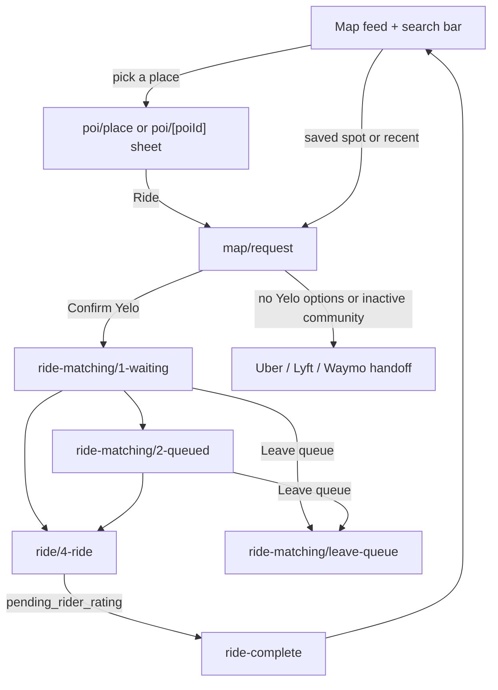

This page walks the rider journey through the actual screens and branches in `yelo-frontend`. It goes one level below [Rider and driver flows](/engineering/mobile/rider-and-driver-flows), which covers providers and polling. For status semantics, see [Ride lifecycle](/concepts/ride-lifecycle). For fees and pricing rules, see [Cancellations](/concepts/cancellations) and [Pricing](/concepts/pricing).

## Home map and search

### What renders

`app/(app)/(tabs)/map/index.tsx` renders inside the map layout's `GlassBottomSheet`. It has two modes, switched by `useMapSearch().focused`:

- **Feed.** A **Moves** rail ("See where people are moving in your city"), then `MapFeedFriendsRail`, `MapFeedLikesRail`, and `MapFeedFeaturedRail`. The Moves rail leads with a bump card, then friend moves, community-feed rides, and anonymized "N people heading to X" counts. A "quiet city" filler card appears only when there are 5 or fewer moves. An inactive community shows just the bump card and the quiet-city card.
- **Search.** Focusing `MapSearchBar` expands the sheet, raises the keyboard, and swaps the feed for `LocationSearchResults`.

The search bar carries a status chip from the current community:

| Community state | Chip | Tap behavior |
| --- | --- | --- |
| `rides_disabled` | **COMING** | Opens search |
| `market_status: OFF_PEAK` | `next_operating_window` or **OFF-PEAK** | Collapses the sheet and opens the off-peak popup |
| Otherwise | **LIVE** | Opens search |

`LocationGate` covers the whole map when foreground location is missing. See [Permissions](/engineering/mobile/permissions-and-device#location).

### Search pipeline

`hooks/useSearchSuggestions.ts` drives both modes.

| Step | Endpoint | Notes |
| --- | --- | --- |
| Browse (empty query) | `GET /mapping/search-context` | Recents plus "Top locations" rails |
| Suggest | `POST /mapping/search-suggestions` | Throttled to one call per 300 ms. Response carries a `session_token` that is copied onto every suggestion. |
| Retrieve | `POST /mapping/search-result` | Only for live suggestions without coordinates. Recents and pinned spots already carry coordinates and skip it. |

A failed retrieve keeps search open and shows **Couldn't load this location** / "Tap the search result to try again." A successful selection is recorded as a recent location and opens the place sheet (`poi/place`), which flies the camera to the pin.

### Recents and saved places

| Kind | Storage | Limit |
| --- | --- | --- |
| Recent locations | `RecentLocationsController` in AsyncStorage, synced through `GET /user/recent-locations` and `POST /user/recent-locations/sync` | 50 entries (`lib/search/recentLocations.ts`) |
| Saved places (likes) | Server, `GET /user/likes`, `POST /user/likes`, `DELETE /user/likes/{id}` | none in client |
| Community POIs | `GET /location/pois`, merged into saved places unless hidden per user | n/a |
| Pinned spots | AsyncStorage `spots:pinnedIds:<userId>` and `spots:unpinnedOrder:<userId>` | 2 pinned (`MAX_PINNED` in `hooks/usePinnedSpots.ts`) |

`SavedSpotsBar` docks above the sheet and opens `/(app)/save-location` for management. The save-location screen can start a ride directly by pushing `map/request` with the spot as `dropoff`.

## Request sheet

`app/(app)/(tabs)/map/request.tsx` is the core rider screen. It takes `pickup`, `dropoff`, and `bump` as JSON route params.

### Entry guards

- No dropoff and no `bump=true`: it replaces back to the map.
- `bump=true` without a dropoff: it opens the change-stop sheet in destination mode first. Dismissing that sheet without choosing goes back.
- The pickup seeds from the `pickup` param, else the last GPS fix. If neither exists, `useSeedRideStops` shows **Choose pickup**.

### Draft creation

Whenever the stop identity changes (`rideStopsKey`: coordinates plus `mapbox_id`, `event_id`, `feature_type`), `usePreRideRequest.createRide` runs:

<Steps>
  <Step title="Validate stops">
    Missing names, addresses, or coordinates fail with "Pickup or dropoff details are incomplete. Choose your stops again."
  </Step>
  <Step title="Check the app version">
    `ensureRideEntryVersion()` calls `/update-required`. See [Releases](/engineering/mobile/releases#update-required-gate).
  </Step>
  <Step title="Get distance and duration">
    `POST /mapping/distance`. A null result fails with "Could not calculate your route. Please try again."
  </Step>
  <Step title="Serialize and re-check status">
    Writes queue behind the previous one. A fresh `/user/status` must show no ride, or a `requested` or `complete` ride. Otherwise: "You already have a ride. Return to your current ride to continue."
  </Step>
  <Step title="Create the draft">
    `POST /ride/v2/` with `X-Features: tips,driver-options`. Success plays a success haptic and fires `rideCreated`.
  </Step>
</Steps>

Out-of-order responses are dropped by a sequence counter. A response only shows if its `stopsKey` matches the stops on screen, so a stale price is never actionable.

Error branches in the sheet:

| Condition | UI |
| --- | --- |
| Session not ready (`isProfileReady` false) | "Your account is reconnecting. Retry to check your connection." |
| 400 `PickupAddressRequired` | Change-stop sheet opens in pickup mode. Button reads **Confirm pickup**. |
| 400 `DestinationAddressRequired` | Change-stop sheet opens in destination mode. Button reads **Confirm destination**. |
| Other 4xx with a string `error.body` | That body text, with **Retry ride options** |
| Anything else | "Could not load ride options. Check your connection and try again." |

### Vehicle options

`components/map/request/RideOptions.tsx` renders server groups (`vehicle_option_groups`) or groups options locally. The first parent option auto-selects. Each `RideOptionCard` shows:

- The vehicle image, or the driver's photo for a driver-specific option.
- Title, seat count pill, and a description (fallback: "[Vehicle] just for your group!").
- Badges from `badges`: `verified_student`, `fleet` (with `fleet_name`), `cheapest`, `fastest`.
- Price: **Free** at 0, a strikethrough with a shiny tag when discounted, otherwise `$0.00` format.

The floating `RideActionBar` has **Fastest** and **Cheapest** segments that jump the selection, plus a bump button. The CTA caption "You'll save about 30% on average vs. Uber & Lyft" hides when every option is free.

The sheet morphs between a compact `CollapsedRideSummary` and the full list as it is dragged. At 130% font scale or more, cards drop the vehicle image to make room for text.

### No Yelo options

If the community is inactive, or the draft returns zero `vehicle_options`, the sheet falls back to third-party options:

| `rideshare-price-aggregator` experiment | UI |
| --- | --- |
| Off | `ThirdPartyDeepLinkFallback`: static Uber, Lyft, and Waymo cards that deep-link with the dropoff |
| On | Live quotes from connected Uber, Lyft, and Empower accounts. The CTA reads **Open [provider]** and stays disabled until that app is confirmed installed. With nothing connected, it becomes a **Sign in** CTA that opens **Accounts**. |

In aggregator mode the action bar adds **Accounts** (badge counts unconnected providers, "!" on an auth error) and **Refresh** with a cooldown countdown. See [Social and contacts](/engineering/mobile/social-and-contacts#connect-uber-lyft-and-empower) for the connection screens.

## Payment and confirm

Payment is headless. `components/ride/StripePaymentScreen.tsx` renders nothing and exposes `openPaymentSheet` and `confirmAndCreateRide` through a ref.

- Stripe is initialized once with the key from `GET /payment/publishable-key` (`lib/payments/ensureStripeInitialized.ts`). The `(app)` layout warms it 2 seconds after the app is interactive.
- The sheet is a Stripe **PaymentSheet custom flow on a SetupIntent** (`customFlow: true`). The draft response supplies `stripe_customer_id`, `ephemeral_key`, and `setup_intent_client_secret`. Nothing is charged at confirm time.
- Apple Pay shows three cart lines: **Ride fare**, a pending **Tip authorization** of $5 (mirrors the API `TipBuffer`), and a pending **Yelo** total. Apple Pay is suppressed only for a live key on a simulator.
- A free option (price 0) skips Stripe entirely and hides the payment row.

`YeloPaymentRow` states are `loading`, `method`, `empty`, and `error`. **Confirm Yelo** is disabled until an option is selected, the sheet is ready, and (for paid rides) a payment method is chosen.

Tapping **Confirm Yelo**:

1. Seeds `rideMatchingSnapshotStore` so the waiting screen can paint pickup, dropoff, price, and vehicle before any fetch.
2. Re-runs the version gate.
3. Calls `confirmPaymentSheetPayment()` and `retrieveSetupIntent()` to get the `payment_method_id`.
4. Re-reads `/user/status`. If the ride moved past `requested` or changed id: "Your ride has changed. Check your current ride before continuing."
5. `POST /ride/i/{id}/confirm` with `vehicle_type`, `fleet_id`, `payment_method_id`, and `driver_id` for a driver-specific option.
6. Always reconciles status afterward. Success fires the PostHog `confirm_ride` event. Navigation comes from the lifecycle hook, not the screen.

A cancelled PaymentSheet is ignored. Any other failure shows "Could not confirm this request. Check your ride status before trying again."

## Matching and queue

`RouteMatchingLayout` wraps both screens with a status chip, a yellow ping animation (paused under Reduce Motion), the tip "You won't be charged until your driver arrives.", and a **Leave queue** link.

### Waiting (`ride-matching/1-waiting`)

- Status chip **FINDING YOUR SPOT**.
- Headline rotates every 10 seconds and stops on the last entry: "Looking for a spot.", "Pinging drivers.", "Finding drivers nearby.", "Waiting on drivers.", "Still searching."
- A driver placeholder card, a route and fare card (from ride details, else the snapshot), and **Share ETA** plus **Bump** action cards. Both open the same bump sheet.
- `no_drivers_available` routes here too. There is no distinct UI for it.

### Queued (`ride-matching/2-queued`)

- Status chip **QUEUED** or **QUEUED · ~N MIN** from `queue_eta_minutes`.
- Headline "Holding your place in line", a yellow card with the ordinal position ("3rd") when `queue_position` and ETA are valid.
- If the driver, position, or ETA is missing, it shows "Updating your driver and place in line…" with **Refresh ride details**.
- The assigned driver's card offers text and call. The fare card's bottom row reads **ESTIMATED TIME**.

### Leave queue (`ride-matching/leave-queue`)

**Leave the queue?** / "You'll lose your spot in line." with five reasons mapped to API keys:

| Label | `reason` |
| --- | --- |
| Waited too long | `wait` |
| Too expensive | `price` |
| Found another ride | `another_ride` |
| Not riding anymore | `changed_mind` |
| Changed my mind | `changed_mind` |

**Sacrifice my spot** first calls `POST /ride/i/{id}/cancel-intent`. If the quoted fee is above zero, it refuses with "A $X.XX cancellation fee now applies. Return to your ride to review cancellation." Otherwise it calls `POST /ride/i/{id}/cancel`. The caption reads "We'll check the cancellation fee before cancelling."

## Active ride (`ride/4-ride`)

The screen renders only when `/user/status` and ride details agree on an assigned driver (`hasCoherentAssignedRide`). Otherwise it shows **Updating your ride** with **Refresh ride**.

### Stages

`resolveInRideStage` in `lib/ride/inRidePresentation.ts` maps status to one of four stages. Each stage recolors the sheet and changes the copy.

| Status | Stage | Pill | Title | Subtitle | ETA caption |
| --- | --- | --- | --- | --- | --- |
| `driver_en_route`, ETA over 3 min | `en_route` | HEADED YOUR WAY | "[First name] is on the way" | Car color and model | TO PICKUP |
| `driver_en_route`, ETA 3 min or less | `pulling_up` | PULLING UP | "Pulling up now" | "Look out the window" | ARRIVING |
| `driver_waiting` | `waiting` | YOUR RIDE IS HERE | "[First name] is here" | "Show your pin to the driver" or "Hop in when you're ready" | AT PICKUP (value "Now") |
| `in_progress` | `in_progress` | ON THE MOVE | "On your way to [destination]" | none | TO DROP-OFF |

ETA comes from `GET /ride/i/{id}/map-details` (every 3 seconds). It shows "30+ min" at 30 minutes or more.

### PIN

When `requires_confirm_code` is true, the waiting stage shows a `PinHero` with `confirm_code` (four digits, "----" while loading). The rider reads it to the driver, who enters it. See [Driver experience](/engineering/mobile/driver-experience#pickup-and-pin).

### Controls

| Control | Location | Action |
| --- | --- | --- |
| Shield | Top right | `SafetyToolkitBottomSheet`: **Report safety issue** (opens SMS to support) and **Call 911** (`tel:911`) |
| Dots | Top right | `RideToolsBottomSheet`: **Contact Yelo** (SMS) and **Cancel ride** ("No charge until driver arrives") |
| QR | Bottom bar | `QRBottomSheet`: your referral QR, save, copy, scan, or upload a QR image |
| Crosshair | Bottom bar | Re-frames the camera for the stage |
| Chat, call | Driver card | Chat opens `RiderChatSheet`. Call opens `tel:` after `canOpenURL`. |
| Share ETA, Bump | Action cards | Bump sheet with a fixed arrival time |

### Chat

`components/ride/chat/RiderChatSheet.tsx` uses `useRideMessages` (30-second fallback poll plus push events) and `usePersistedMessageDraft`. Quick chips: "Coming out now", "One minute", "Where are you?", "Running late", "Thanks!". A failed send shows "Message failed to send".

### Cancellation and fee disclosure

The cancel modal (`components/rider-flow/RiderCancelButton.tsx`, mounted by `RideProvider`) always quotes the fee first with `POST /ride/i/{id}/cancel-intent`.

| Quote | UI |
| --- | --- |
| Loading | Spinner |
| Error | "We need to check the cancellation fee before you cancel." with **Retry fee check** |
| Fee above 0 | **Cancel ride?** / "Your driver is on the way. Cancelling now charges a fee." A red **Cancellation fee** pill with the amount, a required reason picker, and an optional comment |
| Fee 0 | **Cancel ride?** / "You won't be charged for cancelling — your ride hasn't started yet." |

On confirm it re-quotes. If the fee changed: "The cancellation fee changed. Review the fee before confirming again." A zero-fee cancel always sends `reason: changed_mind`. Rider reasons with a fee:

`wait`, `changed_mind`, `too_long`, `not_moving`, `another_ride`, `price`, `accident`, `wrong_pickup`, `driver_asked`, `unsafe`, `other`.

After a cancel the lifecycle hook returns to the map. If the previous status was restartable and the snapshot matches, it reopens the request sheet with the same stops.

## Rating and tip (`ride-complete`)

Shown for `pending_rider_rating` with `?rideId=`. The Android back button is swallowed.

- Title "How was your trip to [destination]?", a driver card with photo or initials and school.
- **Rate your ride** stars, **Add a tip** presets from `GET /ride/i/{id}/tip-options` (default `[2, 5, 10]`) plus a custom amount clamped to $100 (`MAX_TIP`), and **Leave a comment**.
- **Done** is disabled until at least one star is set. It sends `POST /ride/i/{id}/rate` with `rating`, `feedback`, and `tip_amount`.
- **Skip** sends `rating: null, tip_amount: null`.
- A 4 or 5 star rating requests the feedback prompt (`ride-positive`).

## Receipts

The profile sheet lists history from `GET /user/ride-history` (last 200 completed or rating-pending rides). Tapping one opens `profile/ride-details?id=`, which finds the ride in that cached list.

It shows **YOU PAID** (price plus tip), pickup and drop-off, a route map, **Base fare**, **Tip**, **Distance** (meters to miles), **Duration**, **Date**, **Paid with** (`payment_method_brand` or "Card"), and **Get help** (opens `ContactYeloSheet`).

## Where this lives in code

| Area | Path |
| --- | --- |
| Home feed and search | `app/(app)/(tabs)/map/index.tsx`, `components/search/`, `hooks/useSearchSuggestions.ts`, `hooks/useRecentLocations.ts` |
| Saved places | `app/(app)/save-location/index.tsx`, `components/home/SavedSpotsBar.tsx`, `hooks/useSavedLocations.ts`, `hooks/usePinnedSpots.ts` |
| Request sheet | `app/(app)/(tabs)/map/request.tsx`, `components/map/request/`, `hooks/usePreRideRequest.ts` |
| Vehicle options | `components/ride/RideOptionCard.tsx`, `RideOptionGroup.tsx`, `RideOptionBadges.tsx`, `lib/ride/rideOptionGrouping.ts` |
| Payment | `components/ride/StripePaymentScreen.tsx`, `lib/payments/` |
| Aggregator | `lib/ride/useAggregatorPlatforms.ts`, `lib/ride/thirdPartyDeepLink.ts`, `components/ride/RideAggregator*.tsx` |
| Matching | `app/(app)/ride-matching/`, `components/ride-matching/`, `stores/rideMatchingSnapshotStore.ts` |
| Active ride | `app/(app)/ride/4-ride.tsx`, `components/ride-matching/4-ride/`, `lib/ride/inRidePresentation.ts` |
| Cancel | `components/rider-flow/RiderCancelButton.tsx` |
| Chat | `components/ride/chat/RiderChatSheet.tsx`, `hooks/drive/useRideMessages.ts` |
| Rating and tip | `app/(app)/ride-complete/index.tsx`, `components/ride-complete/` |
| Receipts | `app/(app)/profile/ride-details.tsx`, `api/helpers/authUser.ts` (`useRideHistory`) |

## Gotchas and edge cases

- **`no_drivers_available` riders can't leave the queue.** `leave-queue.tsx:51` captures the command target only for `confirmed` or `queued`. A rider in `no_drivers_available` sees the waiting screen and its **Leave queue** link, but submitting always yields "Your ride changed…".
- **Receipt duration is wrong.** The history query returns `duration` in seconds (`complete_time - request_time`), but `ride-details.tsx:155` renders `` `${item.duration} min` ``. It also measures from request, not pickup.
- **Receipts older than the list are "Ride not found".** The detail screen looks the id up in the 200-row history cache. There is no fetch by id.
- **Stripe `returnURL` targets a missing route.** `lib/payments/paymentSheetConfig.ts:80` uses `createDeepLink('ride/2-select-ride')`, which has no file under `app/`. A bank-redirect payment method returning to the app would land on `+not-found`.
- **Google Pay is never offered.** The Stripe plugin sets `enableGooglePay: true`, but `buildPaymentSheetParams` passes only `applePay`, so Android users see cards only.
- **Tip authorization is fixed at $5,** while the custom tip allows up to $100. The Apple Pay sheet shows only the $5 buffer.
- **"No charge until driver arrives" is inaccurate.** `RideToolsBottomSheet` shows that subtitle on **Cancel ride**, but the cancel modal can quote a fee while the driver is still en route.
- **Tip analytics mislabel custom tips.** `ride-complete/index.tsx:71` always sends `is_preset: true`.
- **Tips require a rating.** **Done** is disabled without stars, and **Skip** sends `tip_amount: null`, so a rider can't tip without rating.
- **Queue-leave analytics always report zero.** `leave-queue.tsx:88` sends `seconds_in_queue: 0`.
- **Unreachable branches in `4-ride`.** `chatDisabled` and `callDisabled` check `queued`, and `mapFocusButton` handles `complete`, but the screen only renders for the three assigned statuses.
- **Support SMS goes to `QUO_PHONE_NUMBER`** in `lib/constants.ts`, which is a `555` exchange number. Verify it routes before relying on **Report safety issue**.
- **Queued driver card passes the phone number as `driverId`** (`2-queued.tsx:185`).
- **Legacy screens still mount.** `ride/pickup`, `ride/dropoff`, and `ride/3-ride-matching` are registered in the ride stack, and `ride/index` redirects to the map. The lifecycle router never targets them.
