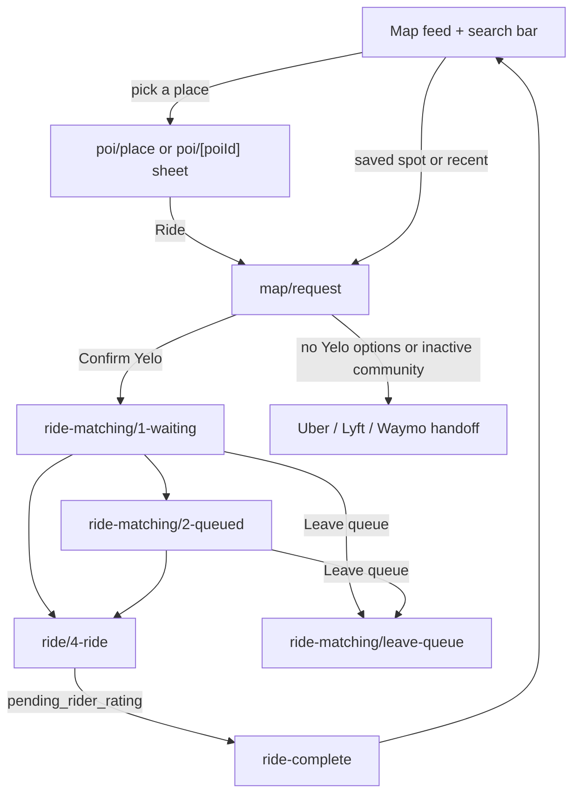
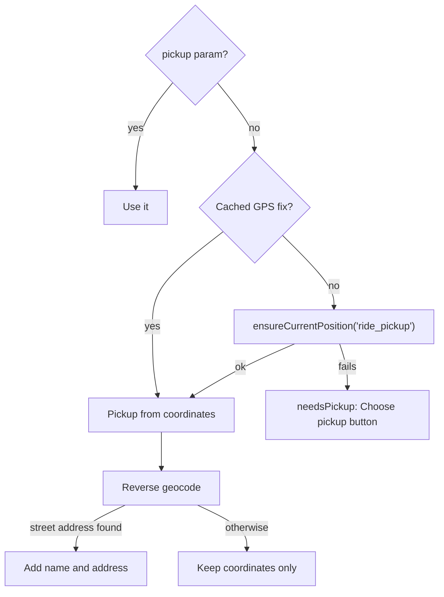

This page walks the rider journey through the actual screens and branches in `yelo-frontend`. It goes one level below [Rider and driver flows](/engineering/mobile/rider-and-driver-flows), which covers providers and polling. For status semantics, see [Ride lifecycle](/concepts/ride-lifecycle). For fees and pricing rules, see [Cancellations](/concepts/cancellations) and [Pricing](/concepts/pricing).

```mermaid
flowchart TD
  HOME["Map feed + search bar"] -->|pick a place| PLACE["poi/place or poi/[poiId] sheet"]
  PLACE -->|Ride| REQ["map/request"]
  HOME -->|saved spot or recent| REQ
  REQ -->|Confirm Yelo| WAIT["ride-matching/1-waiting"]
  REQ -->|no Yelo options or inactive community| AGG["Uber / Lyft / Waymo handoff"]
  WAIT --> QUEUE["ride-matching/2-queued"]
  WAIT --> RIDE["ride/4-ride"]
  QUEUE --> RIDE
  WAIT -->|Leave queue| LEAVE["ride-matching/leave-queue"]
  QUEUE -->|Leave queue| LEAVE
  RIDE -->|pending_rider_rating| RATE["ride-complete"]
  RATE --> HOME
```

## Home map and search

### What renders

`app/(app)/(tabs)/map/index.tsx` renders inside the map layout's `GlassBottomSheet`. It has two modes, switched by `useMapSearch().focused`:

- **Feed.** A **Moves** rail ("See where people are moving in your city"), then `MapFeedFriendsRail`, `MapFeedLikesRail`, and `MapFeedFeaturedRail`. The Moves rail leads with a bump card, then friend moves, community-feed rides and bumps (skipping bumps already shown as friend moves), and anonymized "N people heading to X" counts. A "quiet city" filler card appears only when there are 5 or fewer moves. An inactive community shows just the bump card and the quiet-city card.
- **Search.** Focusing `MapSearchBar` expands the sheet, raises the keyboard, and swaps the feed for `LocationSearchResults`.

The search bar carries a status chip from the current community:

| Community state | Chip | Tap behavior |
| --- | --- | --- |
| `rides_disabled` | **COMING** | Opens search |
| `market_status: OFF_PEAK` | `next_operating_window` or **OFF-PEAK** | Collapses the sheet and opens the [off-peak overlay](#off-peak-overlay) |
| Otherwise | **LIVE** | Opens search |

`LocationGate` covers the whole map when foreground location is missing. See [Permissions](/engineering/mobile/permissions-and-device#location).

### Search pipeline

`hooks/useSearchSuggestions.ts` drives both modes.

| Step | Endpoint | Notes |
| --- | --- | --- |
| Browse (empty query) | `GET /mapping/search-context` | Recents plus "Top locations" rails. `buildBrowseSections` drops `needs_review` top locations, dedupes by `yelo_place_id` (then `mapbox_id`, then `id`), and omits empty sections. |
| Suggest | `POST /mapping/search-suggestions` | Throttled to one call per 300 ms. Response carries a `session_token` that is copied onto every suggestion. |
| Retrieve | `POST /mapping/search-result` | Only for live suggestions without coordinates. Recents and pinned spots already carry coordinates and skip it. |

A failed retrieve keeps search open and shows **Couldn't load this location** / "Tap the search result to try again." A successful selection is recorded as a recent location and opens the place sheet (`poi/place`), which flies the camera to the pin.

### Recents and saved places

| Kind | Storage | Limit |
| --- | --- | --- |
| Recent locations | `RecentLocationsController` in AsyncStorage, synced through `GET /user/recent-locations` and `POST /user/recent-locations/sync` | 50 entries (`lib/search/recentLocations.ts`) |
| Saved places (likes) | Server, `GET /user/likes`, `POST /user/likes`, `DELETE /user/likes/{id}` | none in client |
| Community POIs | `GET /location/pois`, merged into saved places unless hidden per user | n/a |
| Pinned spots | AsyncStorage `spots:pinnedIds:<userId>` and `spots:unpinnedOrder:<userId>` | 2 pinned (`MAX_PINNED` in `hooks/usePinnedSpots.ts`) |
| Hidden community POIs | AsyncStorage `community-pois:hidden:<userId>` | none in client |

`useSavedLocations` (`hooks/useSavedLocations.ts`) is the single source for "saved spots". It returns the user's likes followed by community POIs. It skips a community POI that is hidden, that lacks a name or coordinates, or that `findSavedMatch` matches to an existing like. Pinned state stores IDs only, so both `SavedSpotsBar` and the save-location screen resolve those IDs against this combined list.

`SavedSpotsBar` docks above the sheet. It shows the pinned spots and opens `/(app)/save-location` for management. A pinned spot pushes `map/request` with the spot as `dropoff`. An empty pin slot opens the screen with `focusSearch=1`, which focuses the search input on mount. `MapFeedLikesRail` and the first-like featured card use the same param.

#### Save-location screen

`app/(app)/save-location/index.tsx` is titled **Liked Spots**. It has a search input (**Search a place to like**) above two lists rendered by `components/save-location/SpotsList.tsx`:

- **PINNED n/2.** The pinned spots, in pin order. Each empty slot renders a dashed placeholder, "Tap a pin icon to fill this slot".
- **LIKED n.** Every other saved spot. Spots with no stored position come first, so a newly liked place lands at the top. The rest follow the stored `unpinnedOrder`.

Each row supports these actions:

| Action | Control | Behavior |
| --- | --- | --- |
| Start a ride | Tap the row | Pushes `map/request` with the spot as `dropoff`. Ignored when the spot has no name or coordinates |
| Reorder | Long-press the six-dot handle for 200 ms, then drag | Reorders within the section only. Dragging never moves a spot between **PINNED** and **LIKED**. The pinned handle appears only when two spots are pinned |
| Pin | Tap the outline pin | Appends the spot to the pinned list. With both slots full, the spot in the first slot moves to the top of **LIKED** |
| Unpin | Tap the filled pin | Moves the spot to the top of **LIKED** |
| Remove | Tap the heart | See below |

Removing a spot depends on where it came from:

- **A like.** The screen drops the ID from the pin state and from the `GET /user/likes` query cache at once, then calls `DELETE /user/likes/{id}`. On failure it restores both and shows "Couldn't remove — try again".
- **A community POI.** The screen adds the ID to the hidden set. It makes no API call and shows no snackbar.

Every pin, unpin, and reorder goes through `setPinnedAndUnpinned`. Once the pin state is hydrated, the screen also strips IDs that no longer resolve to a saved spot.

#### Search overlay

Typing in the input shows `components/save-location/SearchOverlay.tsx` over the top half of the list. It is separate from the home search pipeline.

- Suggestions come from `POST /mapping/search-suggestions` with `limit: 10`, the community ID, and the device position when available. The screen asks for foreground location on focus and reads one balanced-accuracy fix for this.
- Calls are throttled to one per 200 ms, firing on the first keystroke and once more at the end of the window with the latest text.
- An empty result shows "No places found."
- A place that is already saved shows a filled heart and ignores taps.

Tapping a suggestion saves it:

1. A suggestion without coordinates is resolved through `POST /mapping/search-result`. A failure shows "Couldn't save — try again".
2. The resolved place is checked against saved spots again. A match shows "Already liked".
3. A stub with a `temp-<timestamp>` ID is prepended to the likes cache. The search clears and the keyboard closes.
4. `POST /user/likes` runs. Success refetches likes. Failure restores the cache and shows "Couldn't save — try again".

A first-ever like requests the feedback prompt (`first-like`). Tapping the overlay background clears the search. The clear button empties the input and keeps the keyboard up.

#### Per-user sets

Four hooks keep per-user ID sets in AsyncStorage. Nothing in them reaches the API, so the state stays on the device and does not follow the user to another one.

| Hook | Key | Holds | Written by |
| --- | --- | --- | --- |
| `usePinnedSpots` | `spots:pinnedIds:<userId>`, `spots:unpinnedOrder:<userId>` | Pinned IDs (truncated to 2 on read and write) and the **LIKED** order | Save-location screen |
| `useHiddenCommunityPois` | `community-pois:hidden:<userId>` | Community POIs the user un-hearted | Save-location remove, and the heart in `components/map/poi/PoiHeader.tsx`, which toggles `hide` and `unhide` |
| `useDismissedSpots` | `featured-spot:dismissed:<userId>` | Featured spots hidden from the dock. The hook has no remove | Nothing today: `useFeaturedSpot` returns `dismiss`, but no component calls it |
| `useCollapsedSpots` | `featured-spot:collapsed:<userId>` | Featured spots the user expanded into the card | `expand` and `collapse` from `useFeaturedSpot`, called by `FeaturedSpotOverlay` and `MapTutorialOverlay` |

- **One store per user.** Each hook keeps a module-level store keyed by user, so every mounted instance sees the same state. `useDismissedSpots` and `useCollapsedSpots` share the implementation in `hooks/usePersistedSpotIdSet.ts`.
- **Debounced writes.** State updates at once. The AsyncStorage write follows 150 ms later.
- **No user, no state.** Without a `userId` the hooks return an empty set with `ready: false`, and writes do nothing.
- **Hidden means un-hearted, not removed.** A hidden community POI leaves saved spots, but `CommunityPoisLayer` still draws it on the map without the heart. `PoiHeader` uses the same hidden set for community POIs and for spots flagged `liked`, so their heart never calls the likes API.
- **`useCollapsedSpots` is named backwards.** `components/map/feed/useFeaturedSpot.ts` treats the set as the spots the user expanded. A spot that is absent renders as the compact pill.

### Off-peak overlay

`components/map/OffPeakHoursOverlay.tsx` is the **Operating hours** card that the **OFF-PEAK** chip opens. `MapAboveSheetOverlays` mounts it in the dock above the sheet, and `offPeakVisible` in `MapFeedProvider` controls it.

- Swiping the card down or tapping anywhere outside it dismisses it.
- Focusing search or switching community also closes it.
- The featured-spot banner hides while it is open.

The card has two modes, chosen by whether the community carries a `calendar_schedule`.

#### Calendar mode

With a schedule, `buildUpcomingCalendarWindows` (`lib/map/calendarHours.ts`) compacts the imported hours into days, then zones. To set up the calendar that feeds it, see [Operating hours](/admin/operating-hours).

<Steps>
  <Step title="Filter">
    It keeps hours that end after now and start within the next 7 days. It drops hours with an unparseable date or an end at or before the start.
  </Step>
  <Step title="Group by day">
    It sorts by start, then end, and groups by the start date in the schedule's `time_zone`. A window that runs past midnight appears only under the day it starts.
  </Step>
  <Step title="Group by zone">
    Within a day, each hour is added to every active zone listed in its `zone_ids`. Inactive zones are skipped. A day with no active zone is left out.
  </Step>
  <Step title="Format">
    Times render in the schedule's time zone as compact ranges such as `10PM–2AM` or `2:30PM–6PM`. Identical ranges in a zone collapse into one.
  </Step>
</Steps>

Each row shows a short weekday (`Wed`), then one line per zone with its ranges joined by commas. A zone shows its `name`. When two active zones share a name, each shows its `key` instead, title-cased with underscores and hyphens turned into spaces.

| Condition | Text |
| --- | --- |
| No upcoming windows | "No upcoming operating hours." |
| Schedule `state` is not `ready`, with hours | "Showing the last imported schedule." |
| Schedule `state` is not `ready`, without hours | "The schedule is being updated." |

The list scrolls inside the card once it is taller than `rem(18)`.

#### Weekly mode

Without a schedule, `buildOperatingWeek` (`lib/map/operatingHours.ts`) expands the community's `operating_windows` into seven rows, Sunday first (`day_of_week` 0 is Sunday).

- Each window renders as `9:00 PM – 2:00 AM`, from `open_time` and `close_time` in `HH:MM`. Windows sort by open time and join with commas.
- A day with no window reads **Off-peak**.
- Today's row is semibold. "Today" is the device's local day, not the community's.

#### Place hours are separate

The open or closed chip on a place sheet does not use community hours. `computeOpenStatus` (`lib/map/poi/poiHours.ts`) derives it at render time from the place's opening periods and UTC offset, because cached place details go stale.

| Case | Chip |
| --- | --- |
| Any period never closes | Open, "24 hours" |
| Inside a period | Open, "until [closing time]" |
| Outside every period | Closed, "until [next opening time]" |
| No periods, cached `open_now` present | Open or closed, "now" |

A boundary more than 24 hours away gains a weekday prefix, as in "until Mon 9 AM".

## Request sheet

`app/(app)/(tabs)/map/request.tsx` is the core rider screen. It takes `pickup`, `dropoff`, and `bump` as route params. Callers build stops with `serializeRideStop`, and the screen reads them with `parseRideStop` (`lib/ride/stopData.ts`). The parser decodes once only for legacy callers that pass URI-encoded JSON.

`RideRequestSession` (`components/map/request/RideRequestSession.tsx`) keys the screen body on the `pickup`, `dropoff`, and `bump` params. A deep link that updates the mounted route starts a fresh selection and draft. The draft write queue outlives that remount, so a request already in flight still finishes before the next one starts.

A pickup with no name shows as **Pickup pin** (`resolvePickupDisplayName` in `lib/ride/stopDisplay.ts`).

### Entry guards

- No dropoff and no `bump=true`: it replaces back to the map.
- `bump=true` without a dropoff: it opens the change-stop sheet in destination mode first. Dismissing that sheet without choosing goes back.
- The pickup seeds from the `pickup` param, else the last GPS fix. If neither exists, `useSeedRideStops` shows **Choose pickup**. See [How stops are seeded](#how-stops-are-seeded).

### Editing stops

`RequestTopBar` replaces the map top bar with a back button and `RequestRouteHeader` (`components/map/RequestRouteHeader.tsx`). The header is two cards, **FROM** and **TO**. Tapping one opens `ChangeStopBottomSheet` in `pickup` or `destination` mode.

The header reads its labels from `stores/requestRouteStore.ts`, because it renders in the shared top bar slot and can't see the screen's state. The request screen mirrors the labels into the store, and the header truncates them to 20 characters.

| Stop | Label |
| --- | --- |
| Pickup from the device position | **Current Location** |
| Pickup with a name | The name |
| Pickup without a name | **Pickup pin** |
| No pickup | **Choose pickup** |
| Dropoff with a name | The name |
| Dropoff without a name | **Destination pin** |
| No dropoff | **Choose destination** |

#### Change-stop sheet

`components/bottom-sheets/ChangeStopBottomSheet.tsx` opens at 85% height with the input focused. It runs its own `useSearchSuggestions` instance, so it uses the same [search pipeline](#search-pipeline) as the home sheet.

| Mode | Placeholder | List |
| --- | --- | --- |
| `destination` | **Where to?** | `LocationSearchResults`: the browse rails while the query is empty, then suggestions |
| `pickup` | **Pickup from?** | `LocationItemsList`, with a **Current location** row first while the query is empty |

The **Current location** row is not a search result. It carries the sentinel `mapbox_id` `current` (`CURRENT_LOCATION_ID`), and it disappears once you type. Its subtitle is the reverse-geocoded address of the last GPS fix, looked up when the sheet opens in pickup mode. The subtitle stays blank if that lookup fails.

`resolveStopLocation` (`components/map/request/stopLocations.ts`) turns the tapped row into a stop:

| Row | Resolution |
| --- | --- |
| Sentinel `current` | Reads the device position and builds a pickup with coordinates, an empty name and address, and `isCurrentLocation: true` |
| Has coordinates | Normalized as is, with no network call |
| No coordinates | `POST /mapping/search-result` with the suggestion's ID, `session_token`, and `provider` |

A row that fails to resolve leaves the sheet open, with no error dialog, so you can pick another. On success the screen records the stop as a recent location (except the device position), applies it, and dismisses the sheet. A selection counter drops a result that resolves after a newer tap or after the sheet closes.

The bump sheet reuses this component for its own location picker and passes `selectionLoading` ("Loading spot…") and `selectionError`. The request screen passes neither.

#### Forced stop confirmation

The request screen computes a `recoveryStop` when a stop is unusable:

- A `pickup` or `dropoff` param is present but `parseRideStop` can't read it, and the session holds no stop for that side.
- The draft failed for the stops on screen and named a stop to fix. See [Draft creation](#draft-creation).

While `recoveryStop` is set, the screen opens the sheet in that mode by itself. It does this once per draft state, and only while the screen is focused and the app is in the foreground. The sheet shows a line above the input:

| Mode | Text |
| --- | --- |
| `pickup` | "Confirm your pickup: choose where your driver should meet you." |
| `destination` | "Confirm your destination: choose where you want to arrive." |

The line shows only when the sheet's mode matches the stop being recovered. If you dismiss the sheet, the request sheet keeps a **Confirm pickup** or **Confirm destination** button that reopens it.

#### How stops are seeded

`useSeedRideStops` (`components/map/request/useSeedRideStops.ts`) fills the stops when the screen mounts.

```mermaid
flowchart TD
  P{"pickup param?"} -->|yes| USE["Use it"]
  P -->|no| C{"Cached GPS fix?"}
  C -->|yes| GPS["Pickup from coordinates"]
  C -->|no| E["ensureCurrentPosition('ride_pickup')"]
  E -->|ok| GPS
  E -->|fails| NEED["needsPickup: Choose pickup button"]
  GPS --> RG["Reverse geocode"]
  RG -->|street address found| ADDR["Add name and address"]
  RG -->|otherwise| KEEP["Keep coordinates only"]
```

- **Dropoff.** The hook seeds it only from the `dropoff` param. A bump entry without one picks it in the change-stop sheet, as in [Entry guards](#entry-guards).
- **Pickup param.** It wins and counts as an explicit selection.
- **Automatic pickup.** It runs only while the screen is focused, the app is in the foreground, and the `pickup` param is not unreadable. A cached fix is used synchronously, so the common path makes no permission or location call.
- **Coordinates first.** A GPS pickup is complete as soon as it has coordinates, so the draft can start. The address arrives later and is kept only when the reverse geocode returns an `address` result with address text. The pickup still displays as **Current Location**.
- **Explicit beats automatic.** Any explicit pickup invalidates automatic results still in flight. A reverse geocode is discarded if the pickup changed while it ran.
- **Paused while choosing.** Opening the sheet in pickup mode pauses automatic seeding. Dismissing it resumes, and retries if there is still no pickup.

### Draft creation

Whenever the stop identity changes (`rideStopsKey`: coordinates plus `provider`, `yelo_place_id`, `mapbox_id`, `event_id`, `feature_type`), `usePreRideRequest.createRide` runs:

<Steps>
  <Step title="Validate stops">
    Only coordinates are required. A stop without a name or address is sent as a coordinate stop. A missing pickup coordinate opens the change-stop sheet in pickup mode with "Choose where your driver should meet you." A missing dropoff coordinate opens it in destination mode with "Choose where you want to arrive."
  </Step>
  <Step title="Check the app version">
    `ensureRideEntryVersion()` calls `/update-required`. See [Releases](/engineering/mobile/releases#update-required-gate).
  </Step>
  <Step title="Get distance and duration">
    `POST /mapping/distance`. A null result fails with "Could not calculate your route. Please try again."
  </Step>
  <Step title="Serialize and re-check status">
    Writes queue behind the previous one. A fresh `/user/status` must show no ride, or a `requested` or `complete` ride. Otherwise: "You already have a ride. Return to your current ride to continue."
  </Step>
  <Step title="Create the draft">
    `POST /ride/v2/` with `X-Features: tips,driver-options`. Success plays a success haptic and fires `rideCreated`.
  </Step>
</Steps>

Out-of-order responses are dropped by a sequence counter. A response only shows if its `stopsKey` matches the stops on screen, so a stale price is never actionable.

Error branches in the sheet:

| Condition | UI |
| --- | --- |
| `pickup` or `dropoff` param that `parseRideStop` can't read | Change-stop sheet opens for that stop, as in [Validate stops](#draft-creation) |
| Pickup or dropoff without coordinates | Change-stop sheet opens in pickup mode (**Confirm pickup**) or destination mode (**Confirm destination**) |
| Session not ready (`isProfileReady` false) | "Your account is reconnecting. Retry to check your connection." |
| 4xx with a string `error.body` | That body text, with **Retry ride options** |
| Anything else | "Could not load ride options. Check your connection and try again." |

### Vehicle options

`components/map/request/RideOptions.tsx` renders server groups (`vehicle_option_groups`) or groups options locally. The first parent option auto-selects. Each `RideOptionCard` shows:

- The vehicle image, or the driver's photo for a driver-specific option.
- Title, seat count pill, and a description (fallback: "[Vehicle] just for your group!").
- Badges from `badges`: `verified_student`, `fleet` (with `fleet_name`), `cheapest`, `fastest`. The API sends at most one badge per option and omits `fleet` for the community's primary fleet. See [Rider option ordering and badges](/engineering/fleets/isolation#rider-option-ordering-and-badges).
- Price: **Free** at 0, a strikethrough with a shiny tag when discounted, otherwise `$0.00` format.

The floating `RideActionBar` has **Fastest** and **Cheapest** segments that jump the selection, plus a bump button. The CTA caption "You'll save about 30% on average vs. Uber & Lyft" hides when every option is free.

The sheet morphs between a compact `CollapsedRideSummary` and the full list as it is dragged. At 130% font scale or more, cards drop the vehicle image to make room for text.

### No Yelo options

If the community is inactive, or the draft returns zero `vehicle_options`, the sheet falls back to third-party options:

| `rideshare-price-aggregator` experiment | UI |
| --- | --- |
| Off | `ThirdPartyDeepLinkFallback`: static Uber, Lyft, and Waymo cards that deep-link with the dropoff |
| On | Live quotes from connected Uber, Lyft, and Empower accounts. The CTA reads **Open [provider]** and stays disabled until that app is confirmed installed. With nothing connected, it becomes a **Sign in** CTA that opens **Accounts**. |

In aggregator mode the action bar adds **Accounts** (badge counts unconnected providers, "!" on an auth error) and **Refresh** with a cooldown countdown. See [Social and contacts](/engineering/mobile/social-and-contacts#connect-uber-lyft-and-empower) for the connection screens.

#### Citi Bike card

Lyft's live bike-share tiers appear on their own **Citi Bike** card instead of the Lyft card. The app detects bike tiers by name (bike or e-bike) and moves them off the Lyft quote.

- The card only appears when Lyft is connected, so its prices are always live.
- Electric bikes are the main option. Classic bikes are nested below.
- Booking hands off to the Lyft app. The CTA reads **Open Lyft**.
- Bike tiers never get the **Cheapest** or **Fastest** badges and are never auto-selected.
- The Citi Bike card always sorts last.

## Payment and confirm

Payment is headless. `components/ride/StripePaymentScreen.tsx` renders nothing and exposes `openPaymentSheet` and `confirmAndCreateRide` through a ref.

- Stripe is initialized once with the key from `GET /payment/publishable-key` (`lib/payments/ensureStripeInitialized.ts`). The `(app)` layout warms it 2 seconds after the app is interactive.
- The sheet is a Stripe **PaymentSheet custom flow on a SetupIntent** (`customFlow: true`). The draft response supplies `stripe_customer_id`, `ephemeral_key`, and `setup_intent_client_secret`. Nothing is charged at confirm time.
- Apple Pay shows three cart lines: **Ride fare**, a pending **Tip authorization** of $5 (mirrors the API `TipBuffer`), and a pending **Yelo** total. Apple Pay is suppressed only for a live key on a simulator.
- A free option (price 0) skips Stripe entirely and hides the payment row.

`YeloPaymentRow` states are `loading`, `method`, `empty`, and `error`. **Confirm Yelo** is disabled until an option is selected, the sheet is ready, and (for paid rides) a payment method is chosen.

Tapping **Confirm Yelo**:

1. Seeds `rideMatchingSnapshotStore` so the waiting screen can paint pickup, dropoff, price, and vehicle before any fetch.
2. Re-runs the version gate.
3. Calls `confirmPaymentSheetPayment()` and `retrieveSetupIntent()` to get the `payment_method_id`.
4. Re-reads `/user/status`. If the ride moved past `requested` or changed id: "Your ride has changed. Check your current ride before continuing."
5. `POST /ride/i/{id}/confirm` with `vehicle_type`, `fleet_id`, `payment_method_id`, and `driver_id` for a driver-specific option.
6. Always reconciles status afterward. Success fires the PostHog `confirm_ride` event. Navigation comes from the lifecycle hook, not the screen.

A cancelled PaymentSheet is ignored. Any other failure shows "Could not confirm this request. Check your ride status before trying again."

## Matching and queue

`RouteMatchingLayout` wraps both screens with a status chip, a yellow ping animation (paused under Reduce Motion), the tip "You won't be charged until your driver arrives.", and a **Leave queue** link.

### Waiting (`ride-matching/1-waiting`)

- Status chip **FINDING YOUR SPOT**.
- Headline rotates every 10 seconds and stops on the last entry: "Looking for a spot.", "Pinging drivers.", "Finding drivers nearby.", "Waiting on drivers.", "Still searching."
- A driver placeholder card, a route and fare card (from ride details, else the snapshot), and **Share ETA** plus **Bump** action cards. Both open the same bump sheet.
- `no_drivers_available` routes here too. There is no distinct UI for it.

### Queued (`ride-matching/2-queued`)

- Status chip **QUEUED** or **QUEUED · ~N MIN** from `queue_eta_minutes`.
- Headline "Holding your place in line", a yellow card with the ordinal position ("3rd") when `queue_position` and ETA are valid.
- If the driver, position, or ETA is missing, it shows "Updating your driver and place in line…" with **Refresh ride details**.
- The assigned driver's card offers text and call. The fare card's bottom row reads **ESTIMATED TIME**.

### Leave queue (`ride-matching/leave-queue`)

**Leave the queue?** / "You'll lose your spot in line." with five reasons mapped to API keys:

| Label | `reason` |
| --- | --- |
| Waited too long | `wait` |
| Too expensive | `price` |
| Found another ride | `another_ride` |
| Not riding anymore | `changed_mind` |
| Changed my mind | `changed_mind` |

**Sacrifice my spot** first calls `POST /ride/i/{id}/cancel-intent`. If the quoted fee is above zero, it refuses with "A $X.XX cancellation fee now applies. Return to your ride to review cancellation." Otherwise it calls `POST /ride/i/{id}/cancel`. The caption reads "We'll check the cancellation fee before cancelling."

## Active ride (`ride/4-ride`)

The screen renders only when `/user/status` and ride details agree on an assigned driver (`hasCoherentAssignedRide`). Otherwise it shows **Updating your ride** with **Refresh ride**.

### Stages

`resolveInRideStage` in `lib/ride/inRidePresentation.ts` maps status to one of four stages. Each stage recolors the sheet and changes the copy.

| Status | Stage | Pill | Title | Subtitle | ETA caption |
| --- | --- | --- | --- | --- | --- |
| `driver_en_route`, ETA over 3 min | `en_route` | HEADED YOUR WAY | "[First name] is on the way" | Car color and model | TO PICKUP |
| `driver_en_route`, ETA 3 min or less | `pulling_up` | PULLING UP | "Pulling up now" | "Look out the window" | ARRIVING |
| `driver_waiting` | `waiting` | YOUR RIDE IS HERE | "[First name] is here" | "Show your pin to the driver" or "Hop in when you're ready" | AT PICKUP (value "Now") |
| `in_progress` | `in_progress` | ON THE MOVE | "On your way to [destination]" | none | TO DROP-OFF |

ETA comes from `GET /ride/i/{id}/map-details` (every 3 seconds). It shows "30+ min" at 30 minutes or more.

### PIN

When `requires_confirm_code` is true, the waiting stage shows a `PinHero` with `confirm_code` (four digits, "----" while loading). The rider reads it to the driver, who enters it. See [Driver experience](/engineering/mobile/driver-experience#pickup-and-pin).

### Controls

| Control | Location | Action |
| --- | --- | --- |
| Shield | Top right | `SafetyToolkitBottomSheet`: **Report safety issue** (opens SMS to support) and **Call 911** (`tel:911`) |
| Dots | Top right | `RideToolsBottomSheet`: **Contact Yelo** (SMS) and **Cancel ride** ("No charge until driver arrives") |
| QR | Bottom bar | `QRBottomSheet`: your referral QR, save, copy, scan, or upload a QR image |
| Crosshair | Bottom bar | Re-frames the camera for the stage |
| Chat, call | Driver card | Chat opens `RiderChatSheet`. Call opens `tel:` after `canOpenURL`. |
| Share ETA, Bump | Action cards | Bump sheet with a fixed arrival time |

### Chat

`components/ride/chat/RiderChatSheet.tsx` uses `useRideMessages` (30-second fallback poll plus push events) and `usePersistedMessageDraft`. Quick chips: "Coming out now", "One minute", "Where are you?", "Running late", "Thanks!". A failed send shows "Message failed to send".

### Cancellation and fee disclosure

The cancel modal (`components/rider-flow/RiderCancelButton.tsx`, mounted by `RideProvider`) always quotes the fee first with `POST /ride/i/{id}/cancel-intent`.

| Quote | UI |
| --- | --- |
| Loading | Spinner |
| Error | "We need to check the cancellation fee before you cancel." with **Retry fee check** |
| Fee above 0 | **Cancel ride?** / "Your driver is on the way. Cancelling now charges a fee." A red **Cancellation fee** pill with the amount, a required reason picker, and an optional comment |
| Fee 0 | **Cancel ride?** / "You won't be charged for cancelling — your ride hasn't started yet." |

On confirm it re-quotes. If the fee changed: "The cancellation fee changed. Review the fee before confirming again." A zero-fee cancel always sends `reason: changed_mind`. Rider reasons with a fee:

`wait`, `changed_mind`, `too_long`, `not_moving`, `another_ride`, `price`, `accident`, `wrong_pickup`, `driver_asked`, `unsafe`, `other`.

After a cancel the lifecycle hook returns to the map. If the previous status was restartable and the snapshot matches, it reopens the request sheet with the same stops.

## Rating and tip (`ride-complete`)

Shown for `pending_rider_rating` with `?rideId=`. The Android back button is swallowed.

- Title "How was your trip to [destination]?", a driver card with photo or initials and school.
- **Rate your ride** stars, **Add a tip** presets from `GET /ride/i/{id}/tip-options` (default `[2, 5, 10]`) plus a custom amount clamped to $100 (`MAX_TIP`), and **Leave a comment**.
- **Done** is disabled until at least one star is set. It sends `POST /ride/i/{id}/rate` with `rating`, `feedback`, and `tip_amount`.
- **Skip** sends `rating: null, tip_amount: null`.
- A 4 or 5 star rating requests the feedback prompt (`ride-positive`).

## Receipts

The profile sheet lists history from `GET /user/ride-history` (last 200 completed or rating-pending rides). Tapping one opens `profile/ride-details?id=`, which finds the ride in that cached list.

It shows **YOU PAID** (price plus tip), pickup and drop-off, a route map, **Base fare**, **Tip**, **Distance** (meters to miles), **Duration**, **Date**, **Paid with** (`payment_method_brand` or "Card"), and **Get help** (opens `ContactYeloSheet`).

## Where this lives in code

| Area | Path |
| --- | --- |
| Home feed and search | `app/(app)/(tabs)/map/index.tsx`, `components/search/`, `hooks/useSearchSuggestions.ts`, `hooks/useRecentLocations.ts` |
| Saved places | `app/(app)/save-location/index.tsx`, `components/save-location/`, `components/home/SavedSpotsBar.tsx`, `hooks/useSavedLocations.ts`, `hooks/usePinnedSpots.ts`, `hooks/useHiddenCommunityPois.ts` |
| Featured-spot sets | `hooks/usePersistedSpotIdSet.ts`, `hooks/useDismissedSpots.ts`, `hooks/useCollapsedSpots.ts`, `components/map/feed/useFeaturedSpot.ts` |
| Off-peak overlay | `components/map/OffPeakHoursOverlay.tsx`, `lib/map/calendarHours.ts`, `lib/map/operatingHours.ts`, `components/map/layout/MapAboveSheetOverlays.tsx` |
| Place hours | `lib/map/poi/poiHours.ts`, `components/map/poi/usePlacePoiDetails.ts` |
| Editing stops | `components/map/RequestTopBar.tsx`, `components/map/RequestRouteHeader.tsx`, `components/bottom-sheets/ChangeStopBottomSheet.tsx`, `components/map/request/useSeedRideStops.ts`, `components/map/request/stopLocations.ts`, `stores/requestRouteStore.ts` |
| Request sheet | `app/(app)/(tabs)/map/request.tsx`, `components/map/request/`, `hooks/usePreRideRequest.ts` |
| Vehicle options | `components/ride/RideOptionCard.tsx`, `RideOptionGroup.tsx`, `RideOptionBadges.tsx`, `lib/ride/rideOptionGrouping.ts` |
| Payment | `components/ride/StripePaymentScreen.tsx`, `lib/payments/` |
| Aggregator | `lib/ride/useAggregatorPlatforms.ts`, `lib/ride/thirdPartyDeepLink.ts`, `components/ride/RideAggregator*.tsx` |
| Matching | `app/(app)/ride-matching/`, `components/ride-matching/`, `stores/rideMatchingSnapshotStore.ts` |
| Active ride | `app/(app)/ride/4-ride.tsx`, `components/ride-matching/4-ride/`, `lib/ride/inRidePresentation.ts` |
| Cancel | `components/rider-flow/RiderCancelButton.tsx` |
| Chat | `components/ride/chat/RiderChatSheet.tsx`, `hooks/drive/useRideMessages.ts` |
| Rating and tip | `app/(app)/ride-complete/index.tsx`, `components/ride-complete/` |
| Receipts | `app/(app)/profile/ride-details.tsx`, `api/helpers/authUser.ts` (`useRideHistory`) |

## Gotchas and edge cases

- **`no_drivers_available` riders can't leave the queue.** `leave-queue.tsx:51` captures the command target only for `confirmed` or `queued`. A rider in `no_drivers_available` would see the waiting screen and its **Leave queue** link, but submitting would always yield "Your ride changed…". No API code path on `main` writes that status (see [Ride lifecycle](/concepts/ride-lifecycle)), so this only matters for legacy rows.
- **Receipt duration is wrong.** The history query returns `duration` in seconds (`complete_time - request_time`), but `ride-details.tsx:155` renders `` `${item.duration} min` ``. It also measures from request, not pickup.
- **Receipts older than the list are "Ride not found".** The detail screen looks the id up in the 200-row history cache. There is no fetch by id.
- **Stripe `returnURL` targets a missing route.** `lib/payments/paymentSheetConfig.ts:80` uses `createDeepLink('ride/2-select-ride')`, which has no file under `app/`. A bank-redirect payment method returning to the app would land on `+not-found`.
- **Google Pay is never offered.** The Stripe plugin sets `enableGooglePay: true`, but `buildPaymentSheetParams` passes only `applePay`, so Android users see cards only.
- **Tip authorization is fixed at $5,** while the custom tip allows up to $100. The Apple Pay sheet shows only the $5 buffer.
- **"No charge until driver arrives" is inaccurate.** `RideToolsBottomSheet` shows that subtitle on **Cancel ride**, but the cancel modal can quote a fee while the driver is still en route.
- **Tip analytics mislabel custom tips.** `ride-complete/index.tsx:71` always sends `is_preset: true`.
- **Tips require a rating.** **Done** is disabled without stars, and **Skip** sends `tip_amount: null`, so a rider can't tip without rating.
- **Queue-leave analytics always report zero.** `leave-queue.tsx:88` sends `seconds_in_queue: 0`.
- **Unreachable branches in `4-ride`.** `chatDisabled` and `callDisabled` check `queued`, and `mapFocusButton` handles `complete`, but the screen only renders for the three assigned statuses.
- **Support SMS goes to `QUO_PHONE_NUMBER`** in `lib/constants.ts`, `(203) 555-9356`. Only `555-0100` to `555-0199` is reserved for fiction, so this may be a real line, but confirm it routes before relying on **Report safety issue**. Driver signup's hub and submitted screens text the same number.
- **Queued driver card passes the phone number as `driverId`** (`2-queued.tsx:185`).
- **`buildCalendarWeek` is not wired.** `lib/map/calendarHours.ts` exports it, but only its test calls it. The overlay uses `buildUpcomingCalendarWindows`.
- **Pins, order, and hidden POIs are per device.** They live in AsyncStorage keyed by user ID and are never synced. See [Per-user sets](#per-user-sets).
- **Legacy screens still mount.** `ride/pickup`, `ride/dropoff`, and `ride/3-ride-matching` are registered in the ride stack, and `ride/index` redirects to the map. The lifecycle router never targets them.
