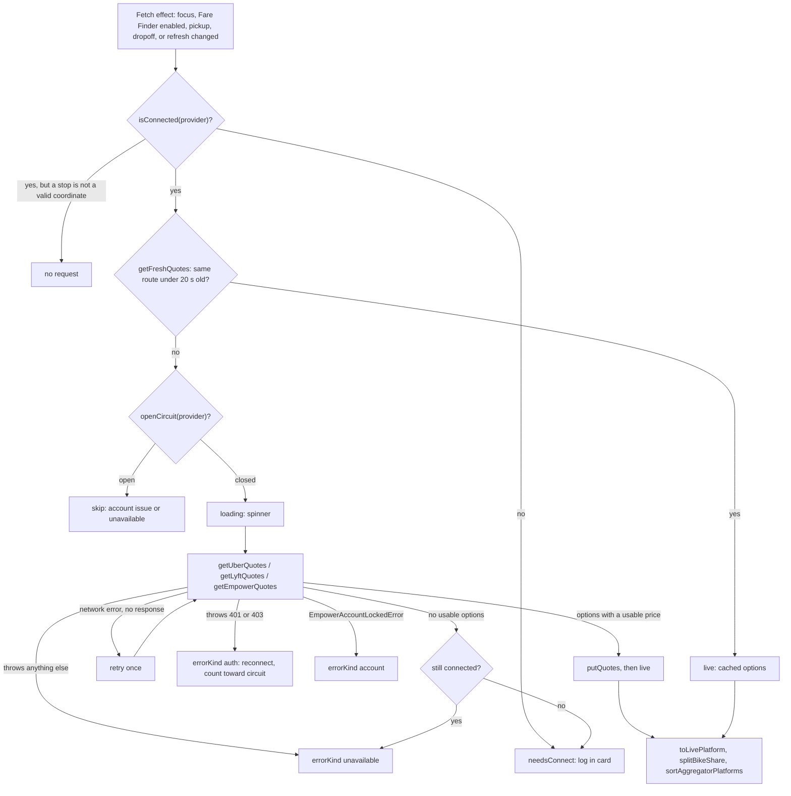

The rideshare aggregator ships to riders as **Fare Finder**. It is a client-only subsystem in `yelo-frontend`. The app holds the rider's own Uber, Lyft, and Empower sessions on the device, calls each provider's API directly for quotes, and opens the provider's app to book. `yelo-api` is not involved: it never sees provider tokens, quote requests, or quote responses.

For where the aggregator appears in the rider journey, see [Rider experience](/engineering/mobile/rider-experience#no-yelo-options). For the one-time setup step, see [Fare Finder disclosure](#fare-finder-disclosure). For the privacy summary, see [PII and retention](/engineering/security/pii-and-retention#third-party-provider-diagnostics).

## When it runs

Fare Finder is on for every rider. Two conditions gate it on the request sheet (`app/(app)/(tabs)/map/request.tsx`):

1. The sheet is in its third-party fallback: a pickup is set, and the community is inactive or the draft returned zero `vehicle_options`.
2. `useFareFinder().enabled` is true (`lib/ride/fareFinder.ts`).

`isFareFinderEnabled` is the only gate. It returns false only when the loaded community has `fare_finder_disabled: true`, the per-community kill switch in `yelo-api`. The check fails open: a community payload without the field counts as enabled. A community that hasn't loaded yet counts as not enabled, so the sheet never fetches quotes before the switch is known.

With the kill switch on, the same fallback renders the static `ThirdPartyDeepLinkFallback` cards and the app makes no provider quote call. The connect screens and **Fare Finder accounts** (`profile/accounts?mode=rideshare`) redirect to **Accounts**.

Fare Finder also changes the home screen. `WhereTo` no longer shows a rides-disabled community as "coming soon" while Fare Finder is enabled, because the rider can still book through a provider.

`ride_aggregator_shown` fires each time the third-party surface becomes visible, with `surface` (`fare_finder` or `deeplink_fallback`) and `reason` (`community_inactive` or `no_vehicle_options`). `ProviderDiagnosticsObserver` registers `fare_finder_enabled` and `fare_finder_disclosed` as PostHog super properties.

## Fare Finder disclosure

The rider accepts a one-time disclosure before their first provider sign-in, not before seeing the sheet. Each connect screen (`connect-uber.tsx`, `connect-lyft.tsx`, `connect-empower.tsx`) renders `FareFinderDisclosure` in place of the sign-in UI until `useFareFinder().disclosed` is true.

The screen is titled **Set up Fare Finder** and lists three points from `FARE_FINDER_POINTS` (`lib/ride/aggregatorDisclosure.ts`):

| Point | Body |
| --- | --- |
| Connect what you want | Link only the services you choose. Sign out of any of them anytime. |
| Your logins stay yours | Yelo never receives your passwords, cookies or payment details. |
| Estimates, not quotes | Prices and times can change. The final fare is set by the ride service when you book. |

Below them, `FARE_FINDER_FINE_PRINT` states that Fare Finder is provided as is, that Yelo collects diagnostic data while the rider uses it, and that Yelo is not affiliated with the providers. The screen links the Terms of Service and Privacy Policy.

- **Agree and continue** writes the per-user, on-device flag `price-aggregator-disclaimer:diagnostics-v1:<userId>` and fires `fare_finder_disclosure_confirmed`. The connect screen then renders its sign-in UI. If the AsyncStorage write throws, the screen logs `fareFinder.disclosure.save.error`, shows the alert **Could not continue** ("Please try again. Your confirmation could not be saved."), stays on the disclosure, and fires no confirmation event.
- **Not now** fires `fare_finder_disclosure_cancelled` and goes back.

Opening the screen fires `fare_finder_disclosure_shown`. The flag key is unchanged from the beta, so riders who accepted the `diagnostics-v1` disclaimer during the experiment are not asked again. The flag is per device, so a reinstall asks again.

Riders who never connect a provider see Fare Finder's log-in cards, but no provider request leaves the device and no provider diagnostics are sent.

## Quote pipeline

`useAggregatorPlatforms(pickup, dropoff)` in `lib/ride/useAggregatorPlatforms.ts` owns the pipeline. It returns `platforms`, `refresh`, `routeKey`, and `settled`.



The effect runs only while the request screen is focused and Fare Finder is enabled. It re-runs when focus returns, when a stop's coordinates change, and when `refresh()` bumps a nonce. Returning from a connect screen therefore re-checks the connection.

For each of `uber`, `lyft`, and `empower`, in parallel:

1. **Connection check.** `isConnected` reads SecureStore. A provider with no stored session stops here and shows the log-in card. A connected provider whose route lacks a valid pickup or dropoff also stops here, with no request, and its card shows the spinner.
2. **Cache check.** `getFreshQuotes` serves the cached options for the same route. See [Quote cache and cooldown](#quote-cache-and-cooldown).
3. **Circuit check.** `openCircuit` skips a provider whose circuit is open, with no request. See [Provider circuit breaker](#provider-circuit-breaker).
4. **Fetch.** The provider module gets a valid access token, calls the provider, and parses the response into `RideQuoteOption[]` (`lib/ride/types.ts`). Each provider's fare request has a 10-second timeout. Empower's bootstrap lookup allows 15 seconds. If the call fails with no HTTP response at all (`error_kind: network`), the hook retries it once before reporting an error.
5. **Filter.** `toAggregatorOptions` maps quotes to `AggregatorRideOption`. `hasUsablePrice` drops any option with no numeric fare and a blank label.
6. **Empty result.** An empty list can mean a dead refresh cleared the tokens, so the hook calls `isConnected` again. Disconnected becomes the log-in card. Still connected becomes `unavailable`.
7. **Error.** `classifyQuoteError` maps an `EmpowerAccountLockedError` to `account` and a thrown HTTP 401 or 403 to `auth`. Every other failure (5xx, timeout, network after the retry) is `unavailable`. Any HTTP rejection also counts toward the provider's circuit, and the failure that opens an auth circuit sets the card's `errorKind` to `account` instead. Its `ride_aggregator_provider_result` event still carries `error_kind: auth`. The hook logs `ride.quotes.error`. A successful fetch clears the provider's circuit.

`validRideCoord` validates both stops before anything leaves the device. It rejects a missing or non-finite value, a latitude outside ±90 or a longitude outside ±180, and any point within 0.01 degrees of (0, 0), which is how an unset location reads. No provider is called without two valid stops.

### Quote passes

Each run of the fetch effect is one quote pass. `beginQuotePass` (`lib/ride/quotePass.ts`) mints a `quote_pass_id` UUID, and every provider request, per-provider result, price snapshot, selection, and handoff that follows carries it. Filter on one `quote_pass_id` in PostHog to see what a rider saw and why.

| Event | When |
| --- | --- |
| `ride_aggregator_quote_pass_started` | The effect starts. `trigger` is `route`, `refresh`, or `focus`. |
| `ride_aggregator_provider_result` | Each provider reaches a terminal state. `result` is `live`, `cached`, `not_connected`, `no_route`, `empty`, `session_lost`, or `error`. |
| `ride_aggregator_quote_pass_finished` | Every provider settled (`outcome: settled`), or the effect was torn down first (`outcome: cancelled`) |

A thrown error that is not an HTTP or network failure, such as a parser bug, is also sent to PostHog error tracking as `RideQuoteLoopError` with the provider name and the error's class name only. Telemetry failures inside a pass are swallowed and never change what the rider sees.

When the route changes, the hook clears every provider's options before any request starts, so one trip's prices never show on another. `settled` turns true only after every provider reaches a terminal state. The request screen uses that edge to fire `ride_aggregator_prices_loaded` once per route and once per manual refresh.

### Platform states

`toLivePlatform` turns the static registry entry (`RIDE_AGGREGATOR_PLATFORMS` in `lib/ride/aggregatorPlatforms.ts`) plus the provider's live state into one `AggregatorPlatform`. `RideAggregatorCard` renders the right-hand slot from it.

| State | Fields set | Card |
| --- | --- | --- |
| Not connected | `needsConnect`, `connectRoute` | Provider name and a blurred teaser price. Tapping opens the connect screen. |
| Loading | `loading` | Provider name and a spinner |
| Live | `live`, `options` | A lead card for the provider's standard ride, over at most one ride row. See [Card layout](#card-layout). |
| Session rejected | `errorKind: 'auth'`, `connectRoute` | Same teaser as not connected. Tapping opens the connect screen to reconnect. |
| Account flagged | `errorKind: 'account'` | No card. The provider is removed from the list, and **Accounts** shows **Account issue**. |
| No rides | `errorKind: 'unavailable'` | Provider name and **Unavailable** |

The teaser price is not a quote. `teaserPriceLabel` derives a fixed fake amount between $14 and $39 from the provider name and renders it blurred.

A platform without live quotes carries no prices. The static options in `RIDE_AGGREGATOR_PLATFORMS` (for example "UberX" and "UberXL") have an empty `priceLabel`, so no placeholder amount can reach a card or the action bar.

`visibleAggregatorPlatforms` (`components/map/request/selectionHelpers.ts`) hides Empower until it is connected, and removes any platform with `errorKind: 'account'`. A flagged account has no truthful price and a reconnect prompt wouldn't help, so the **Accounts** screen carries the status instead. Uber and Lyft otherwise always show. Because the **Accounts** badge counts only visible cards, an unconnected Empower never adds to it.

## Provider sign-in

Each provider has its own route under `app/(app)/`. The Uber, Lyft, and Empower screens render `ProviderAccountView` for the signed-out, error, and signed-in states, and read their state from `useProviderAccount`.

| Provider | Screen | Method | Callback |
| --- | --- | --- | --- |
| Uber | `connect-uber.tsx` | `WebBrowser.openAuthSessionAsync` to Uber's hosted login with PKCE | `uberauth://` |
| Lyft | `connect-lyft.tsx` | Native phone, SMS code, and optional email challenge against Lyft's API | none |
| Empower | `connect-empower.tsx` | `WebBrowser.openAuthSessionAsync` to Empower's Azure AD B2C page with PKCE | `rideyazam://login.token` |
| Citi Bike | `connect-citibike.tsx` | No sign-in. An on/off switch that rides on the Lyft session. | none |

`lib/ride/providerConfig.ts` holds every endpoint, client identifier, and header set. The requests present as each provider's own first-party mobile app. Uber's login, refresh, and fare calls all read one `UBER_CLIENT_VERSION` constant so a session is minted and used at the same app version.

### Uber

<Steps>
  <Step title="Authorize">
    `uberBuildAuthorize` generates a 32-byte PKCE verifier and its SHA-256 challenge, then builds the authorize URL. The screen opens it in an auth session.
  </Step>
  <Step title="Parse the callback">
    `parseUberCallback` reads the session value from the `uberauth://` URL and splits it at the last dot into an in-auth session ID and a verification code. The screen never logs the URL.
  </Step>
  <Step title="Exchange">
    `uberExchangeSession` posts the verification code and the PKCE verifier. The response carries the access token, refresh token, and the account email, which `saveTokens('uber', …)` persists.
  </Step>
</Steps>

On iOS, after a cancelled or failed attempt, the screen offers **Try a fresh sign-in**, which repeats the flow with `preferEphemeralSession`. A failure shows the alert **Could not connect to Uber**. `app/+native-intent.tsx` rewrites any `uberauth://` URL to `/connect-uber`, and `app.config.ts` registers the `uberauth` intent filter on Android.

**Quotes.** `getUberQuotes` posts the pickup and destination coordinates to Uber's fare-estimate endpoint with a bearer token and device headers, with a 10-second timeout. The device-location headers carry the pickup, not `0.0`. With zeros, Uber doesn't answer when the pickup is outside the city the account was last in.

In parallel, `getUberVehicleViews` posts the pickup to Uber's rider status endpoint (10-second timeout) to get the city's product catalog and nearby-vehicle ETAs. The request body carries only `targetLocation`. The response is cached in memory, keyed by the pickup rounded to two decimal places. The cache is reused only when it named at least one product, so a response with ETAs and no names is refetched on the next quote. A catalog failure is swallowed.

`parseUberFareEstimate` (`lib/ride/parsers.ts`) walks `packageVariants`:

- **Name and seats** come from `resolveUberTier`. See [Uber tier names](#uber-tier-names).
- **Zero-seat products** (delivery and package tiers) are dropped.
- **Price** is the numeric upfront fare. The label falls back through the formatted fare, the formatted numeric fare, the styled fare text, and the estimate string.
- **Pickup ETA** comes only from the live catalog. If the catalog call fails, Uber options have no ETA.
- **`deepLinkId`** is the product UUID.
- **Unnamed tiers** fold into one row at their cheapest fare. The row is named **Uber** when nothing in the response is named, or **Other Uber rides** beside named tiers. Its price label reads "from" and it has no `deepLinkId`, because the tier is unknown.

#### Uber tier names

Uber's fare estimate identifies each tier by `vehicleViewId` only. The status catalog carries the id-to-name mapping only some of the time, so the app keeps every name it sees. `resolveUberTier` (`lib/ride/parsers.ts`) takes the first name it finds, in this order:

| Order | Source | Reported as |
| --- | --- | --- |
| 1 | The live status catalog for this pickup | `live` |
| 2 | A status-catalog name this device saw earlier | `learned` |
| 3 | The bundled table `UBER_VEHICLE_VIEWS` | `bundled` |
| 4 | A copy-mined name this device saw earlier | `learned_copy` |
| 5 | A name extracted from this response's copy | `copy` |
| 6 | None. The tier joins the generic row. | `unknown` |

The app never guesses a name. `recordUberCatalog` (`lib/ride/uberCatalog.ts`) merges new names into AsyncStorage under `ride-uber-vehicle-views:v1`. Entries hold public product IDs, names, and seat counts only. A status-catalog name always wins over a copy-mined one. Names must match a short letters-and-digits pattern, at most 40 characters.

Each distinct quote result fires `ride_uber_catalog_resolved` with the named and unknown IDs, the count per name source, and any names the device just learned. Uber's city ID and name (for example `190` and `new_orleans`) are attached only when the Fare Finder permission is current. See [Analytics events](/reference/analytics-events#mobile).

#### Bundled catalog

`lib/ride/uberVehicleViews.generated.ts` holds the bundled table. It is the fallback for when Uber's live catalog call fails. `scripts/uber-catalog.mjs` regenerates it from the `learned` names riders' devices reported in `ride_uber_catalog_resolved` over the last 180 days. Refresh it with:

```bash
POSTHOG_PERSONAL_API_KEY=... POSTHOG_PROJECT_ID=... make uber-catalog
```

The generated file is code, so ship the diff as an OTA update. Don't edit it by hand. Products with `seats: 0` are delivery or rental products and are dropped from quotes.

### Lyft

The Lyft flow has no web view. `connect-lyft.tsx` moves through three phases:

| Phase | CTA | Call | Result |
| --- | --- | --- | --- |
| `phone` | **Send code** | `lyftSendCode`: gets an anonymous client token, then requests an SMS | Moves to `otp` |
| `otp` | **Verify** (auto-submits at 6 digits) | `lyftSubmitOtp`: phone grant with the code | `ok` connects. A 401 with `challenge_required` moves to `email` with Lyft's hint. |
| `email` | **Continue** | `lyftSubmitEmail`: the same grant plus the typed email | Connects |

`normalizeLyftPhone` keeps a number that starts with `+`, prefixes `+1` to a 10-digit number, and prefixes `+` otherwise. Any failure shows "Something went wrong. Please try again." and stays on the current phase. A failed code also clears the code field.

After a successful login, `syncLyftAccountEmail` reads the canonical account email in the background and merges it into the stored session. `updateStoredEmail` applies it only if the stored refresh token still matches the session the lookup started with.

**Quotes.** `getLyftQuotes` posts the origin and destination as microdegrees (`latitude_e6`, `longitude_e6`) to Lyft's offerings endpoint with a 10-second timeout. `parseLyftOfferings` walks `offers`:

- **Name** is the ride type's display name, defaulting to "Lyft".
- **Price** is `upfront_cost_cents`, or `estimated_cost_cents_min`, divided by 100. The label prefers Lyft's final price text.
- **Pickup ETA** is the pickup estimate's duration in minutes, with a minimum of 1.
- **`deepLinkId`** is the offer's `ride_type`.

Lyft returns bike-share tiers in the same list. See [Bike-share split](#bike-share-split).

### Empower

`empowerBuildAuthorize` builds a standard OIDC authorization-code URL with PKCE and `prompt=login`. The rider signs in on Empower's hosted page. `parseEmpowerCallback` reads `code` from the redirect, and `empowerExchangeCode` exchanges it. `toTokens` decodes two JWTs locally: the account email from the ID token, and the passenger ID (`sub`, falling back to `oid`) from the access token.

**Quotes.** `getEmpowerQuotes` is a two-step call:

1. `resolveEstimateUrl` fetches the passenger record and finds the operation named `put-rideEstimate`. The URL is cached in memory per passenger ID.
2. A `PUT` to that URL sends the passenger ID and two stops as plain decimal `lat` and `lon`, with a 10-second timeout.

`parseEmpowerEstimates` returns nothing when `serviceAvailable` is false. Otherwise it reads the `estimates` map, one entry per vehicle type, and sorts `STANDARD`, `STANDARD_XL`, `PREMIUM`, `PREMIUM_XL`. Those display as "Everyday", "Everyday XL", "Premium", and "Premium XL".

Empower's requests send the same first-party headers as Empower's iOS passenger app: its API key, app and platform headers, device model, user agent, and an `x-device-handle` minted once per app launch. Estimate calls add geolocation headers for the pickup, use `?version=2`, and send a blank `placeaddress` on each stop. After the bootstrap, the module posts a fresh session ID to the passenger's `session-id` endpoint, as Empower's app does. Diagnostics report that call as operation `session`.

Empower's quote calls use `validateStatus: () => true`, so a non-200 response never throws. The module logs `ride.empower.bootstrap.status`, `ride.empower.bootstrap.noEstimateOp`, `ride.empower.noPassengerId`, or `ride.empower.estimate.status` and returns an empty list. Each early stop fires `ride_provider_quotes_skipped`, because the pass would otherwise report `empty` with no reason:

| `reason` | When |
| --- | --- |
| `no_passenger_id` | The stored session has no passenger ID |
| `bootstrap_failed` | The passenger bootstrap returned a non-200 status, sent as `status` |
| `no_estimate_operation` | The bootstrap listed no `put-rideEstimate` operation |
| `account_locked` | The estimate halt is active, with `status: 401` |

#### Account locks

Empower can flag an account and keep answering 200 with null prices. Two signals turn that into `errorKind: 'account'`, which removes Empower from the list and shows **Account issue** on **Accounts**:

- **Bootstrap lock.** The passenger bootstrap returns a `lockedCategory`, for example `MultipleAccounts`. The module logs `ride.empower.bootstrap.accountLocked` and throws `EmpowerAccountLockedError`. It fires `ride_provider_account_flagged` with `locked_category` and `is_low_risk_multi_account`, once per category per app session.
- **Estimate halt.** The estimate `PUT` returns 401 or 403 twice in a row, after the bootstrap accepted the same token. The module logs `ride.empower.estimate.unauthorized` and throws `EmpowerAccountLockedError` with category `EstimateUnauthorized`. For the next 30 minutes it skips the bootstrap and estimate calls entirely. It fires `ride_provider_account_flagged` once per session with `locked_category: EstimateUnauthorized`, `status`, `estimate_host`, and `token_audience` (the token's `aud` app ID). Those fields tell an audience mismatch apart from App Check enforcement. A fresh Empower sign-in clears the halt. The halt lives in memory, so an app restart also clears it.

Empower's lock errors never count toward the generic [circuit breaker](#provider-circuit-breaker), so one failure is never counted twice.

### Citi Bike

Citi Bike has no login of its own. Its prices are the bike tiers Lyft returns, so it is an opt-in switch on top of the Lyft session. It is off by default.

**Accounts** lists a **Citi Bike** row below the other providers. Its subtitle follows the state:

| Lyft | Switch | Row subtitle |
| --- | --- | --- |
| Not connected | Any | **Sign in to Lyft first**, with the row dimmed. The row stays tappable. |
| Connected | Off | **Off** |
| Connected | On | **On, using your Lyft account**, with a check mark |

Tapping the row fires `ride_provider_card_tapped` with `provider: citibike` and opens `/connect-citibike`. The screen shows a **Show Citi Bike in Fare Finder** switch:

- **Lyft not connected.** The switch is disabled and reads "Needs a Lyft sign-in". The button reads **Continue to Lyft** and opens `/connect-lyft`.
- **Lyft connected.** The switch is enabled and reads "Listed below the ride options". The button reads **Done**. Toggling it fires `ride_provider_citibike_toggled` with `enabled`.

`stores/citiBikeStore.ts` persists the choice per device in AsyncStorage under `fare-finder-citibike`. The switch only counts while Lyft is connected. Signing out of Lyft hides the Citi Bike card without clearing the stored value. Like the other connect screens, `/connect-citibike` redirects to **Accounts** when Fare Finder is off for the community.

## Token storage and refresh

`lib/ride/tokenStore.ts` stores one `StoredTokens` JSON record per provider in `expo-secure-store` under `ride_tokens_<provider>`.

| Field | Notes |
| --- | --- |
| `accessToken` | Bearer for quote calls |
| `refreshToken` | Optional. Uber and Lyft rotate it on every refresh. |
| `expiresAt` | Epoch milliseconds. `buildStoredTokens` defaults the lifetime to 3,600 seconds when the provider gives none. |
| `email` | Captured at connect. Refresh responses carry none, so the stored value is kept. |
| `passengerId` | Empower only |

Uber and Lyft also persist a per-install device UUID in SecureStore (`ride_uber_device_id`, `ride_lyft_device_id`, from `lib/ride/deviceId.ts`), so every call presents the same device.

Two mechanisms keep concurrent work safe:

- **Single flight.** `getValidAccessToken` runs once per provider at a time. Parallel quote and catalog calls share one refresh, so two refreshes can't invalidate each other's rotated token.
- **Write lock.** `saveTokens`, `clearTokens`, `updateStoredEmail`, and the refresh write are serialized per provider. The lock wraps only keychain reads and writes, never the network call.

`getValidAccessToken` returns a token or `null`:

| Condition | Result | Stored session |
| --- | --- | --- |
| Nothing stored | `null` | none |
| Token expires more than 60 seconds from now (`EXPIRY_SKEW_MS`) | Stored access token | Unchanged |
| Expired, no refresh token | `null` | Cleared, reason `missing_refresh_token` |
| Refresh returns no access token | `null` | Cleared, reason `missing_access_token` |
| Refresh throws with HTTP 400, 401, or 403 | `null` | Cleared, reason `refresh_rejected` |
| Refresh throws anything else (network, 5xx) | `null` | Kept for a later retry |
| Stored session was cleared or replaced during the refresh | `null` | Left as is. The refreshed tokens are discarded. |
| Refresh succeeds | New access token | Rewritten, keeping the stored `email` and `passengerId` |

Every `null` makes the provider module return an empty quote list. The pipeline's connection re-check then decides between the log-in card and **Unavailable**.

Signing out from a provider screen calls `clearTokens(provider)` with reason `sign_out` and resets that provider's entry in the [account status store](#account-status-store). Every `saveTokens` and `clearTokens` call also resets the provider's [circuit](#provider-circuit-breaker), because the rejected credential is gone.

## Provider circuit breaker

`lib/ride/providerCircuit.ts` stops a provider from retrying a rejected session on every quote pass. Repeated rejected calls are the pattern that gets a provider account locked. The circuit counts consecutive HTTP rejections on quote calls per provider:

| Kind | Counts | Opens after | Hold | Card while open |
| --- | --- | --- | --- | --- |
| `auth` | HTTP 401 or 403 | 2 in a row | 30 minutes | `errorKind: 'account'`. The provider leaves the list and **Accounts** shows **Account issue**. |
| `http` | Any other HTTP status | 3 in a row | 10 minutes | `errorKind: 'unavailable'`, so the card reads **Unavailable** |

- **What doesn't count.** Timeouts and network drops have no HTTP status, so they never count. A rejection of a different kind starts a new count. Two 401s then a 500 is not three of anything.
- **While open.** The pass skips the provider with no request. It fires `ride_provider_quotes_skipped` with `reason: circuit_open` and the last `status`, and reports `ride_aggregator_provider_result` as `error`.
- **When it opens.** `ride_provider_circuit_opened` fires once per open with `provider`, `kind`, `status`, `failures`, and `hold_ms`.
- **Reset.** A successful fetch, a saved session, or a cleared session resets the provider's circuit.

The circuit is module-level, like the quote cache, so an app restart clears it.

## Quote cache and cooldown

`lib/ride/quoteRateLimiter.ts` keeps one cache entry per provider at module level: the route key, a timestamp, and the options. `MIN_FETCH_INTERVAL_MS` is 20,000.

- **Route key.** `routeKeyOf` joins the exact pickup and dropoff coordinates. Any coordinate change is a different route.
- **Hit.** A request for the same route within 20 seconds serves the cached options with no provider call. Because the cache is module-level, this covers cancelling and reopening the request sheet.
- **Write.** `putQuotes` runs only after a fetch returns at least one usable option. Errors and empty results don't start a cooldown.
- **Scope.** The cache holds only the latest route per provider and lives in memory, so it doesn't survive an app restart.

`useRefreshCooldown` (`components/map/request/useAggregatorSheet.ts`) drives the action bar's **Refresh** pill. It takes the longest `cooldownRemainingMs` across the three providers and ticks once a second while it is above zero. During that time the pill is disabled and shows the remaining seconds, for example "12s". The pill is also disabled, with no countdown, until the current quote pass settles. Tapping an enabled pill fires `ride_aggregator_prices_refreshed` and calls `refresh()`.

## Grouping and ranking

`lib/ride/rideAggregatorSelect.ts` holds the pure ranking helpers.

### Platform order

`sortAggregatorPlatforms` orders the cards:

1. The Citi Bike card last.
2. Connected providers before log-in cards.
3. Lowest lead-card fare first. The lead is the provider's standard tier, so cards compare like for like. A platform with no numeric price sorts after the priced ones.

### Card layout

Each provider renders as one `RideAggregatorGroup`:

- **Lead card.** `RideAggregatorCard` shows the provider's standard ride: its ride type, price, seats, pickup ETA, and badge. Tapping it selects that ride. The price reads "from" only when rows sit below it and none of them is cheaper than the lead.
- **Ride rows.** `RideAggregatorChildCard` rows sit below the lead card. Each row shows the ride type, price, seats, and pickup ETA, with the **Cheapest** or **Fastest** badge inline in the same row.
- **Show N more / Show less.** A footer row appears when the provider has tiers outside the compact view. **Show N more** names how many tiers are hidden and lists every tier in price order. **Show less** folds back.

The selection ring marks one ride: the lead card or one row, never both. A platform that needs sign-in, is loading, or has an error shows the lead card alone, titled with the provider name.

Only one provider can be expanded at a time. `CommunityInactivePlaceholder` folds an open list back when the sheet collapses or when the group scrolls out of view, and expands the sheet when a list opens.

### Compact view

`partitionRides` in `lib/ride/rideAggregatorSelect.ts` splits a platform's named tiers into the compact view and the tiers behind **Show N more**. The compact view is the lead card plus at most one row.

The lead is the provider's standard tier, never a saver, wait, or shared tier. `partitionRides` takes the first match, cheapest first:

1. The provider's X tier.
2. The cheapest standard-size ride that is not a saver.
3. The cheapest ride that is not a saver.
4. The cheapest ride.

A saver is any tier whose name contains "saver", "save", "share", "shared", "wait", or "pool", such as "UberX Saver", "Wait & Save", or "UberX Share". Savers always sit behind **Show N more**, so a saver can undercut the lead. That's why the lead only reads "from" when it is the provider's lowest fare.

The one row under the lead is the cheapest large ride (6 or more seats, or the provider's XL tier). With no large ride, it is the next ride that is not a saver.

| Provider | X tier | XL tier |
| --- | --- | --- |
| Uber | `UberX` | `UberXL` |
| Lyft | `Standard`, `Lyft`, or `Core` | `XL` or `Lyft XL` |
| Empower | `Everyday` | `Everyday XL` |

For example, an Uber quote with UberX at $12.40, Wait & Save at $9.80, and UberXL at $18.10 leads with UberX at $12.40 and no "from", shows UberXL as the row, and puts Wait & Save behind **Show 1 more**.

A selected tier stays on screen in the compact view even when it lives behind **Show N more**.

### Niche tiers

`isObscure` marks a tier as niche when its name matches wheelchair, WAV, assist, car seat, pet, women, comfort, black, lux, premier, green, electric, hourly, taxi, bike, e-bike, scooter, XXL, or **Other Uber rides**. Niche tiers are never removed, so a rider who needs WAV can always reach it. They sit behind **Show N more**. A provider that offers only niche tiers picks its lead and row from them.

The Citi Bike card shows every bike tier with no **Show N more**. An electric bike leads and a classic bike follows.

### Cheapest and fastest

`pickGlobalCheapest` and `pickGlobalFastest` each pick one option across all providers. Both pick only from tiers in a compact view, so a badge never lands behind **Show N more**.

| Pick | Eligible | Primary | Tie-break |
| --- | --- | --- | --- |
| Cheapest | Any car ride on screen. Bikes, scooters, and **Other Uber rides** are excluded. | Lowest `priceValue` | Lower effective ETA |
| Fastest | Non-niche tiers | Lowest effective ETA | Lower `priceValue` |

The effective ETA is `etaMaxMinutes` when the provider gives a range, otherwise `etaMinutes`. A "2–11 min" option competes on 11. Options with no numeric value for the primary measure are skipped.

The picks have two uses:

- **Badges.** `RideAggregatorSection` passes them down so at most one row carries the **Cheapest** badge and at most one the **Fastest** badge. The lead card can carry either badge.
- **Quick picks.** `useAggregatorQuickPicks` wires the action bar's **Fastest** and **Cheapest** segments to select the pick. They fire `ride_aggregator_fastest_selected` or `ride_aggregator_cheapest_selected`.

### Default selection

Until the rider taps an option, the request screen keeps the selection on the lead ride of the first platform that is connected, has no error, is not Citi Bike, and has a lead option. With no selection, the action bar also takes its price from the first healthy connected platform, so an errored provider never drives it. A manual pick stops the tracking. If the selected option disappears from the live list, the selection clears and tracking resumes.

### Bike-share split

`splitBikeShare` (`lib/ride/splitBikeShare.ts`) runs on the Lyft platform after `toLivePlatform`. Lyft exposes no vehicle mode, so the only signal is a display name that contains "bike", "ebike", or "e-bike" (singular or plural) as a whole word. Matching options leave the Lyft card, which keeps the cars. When the rider turned Citi Bike on (see [Citi Bike](#citi-bike)), the options move to a synthesized platform with `provider: 'citibike'`, Citi Bike branding, and `live: true`. Otherwise they are dropped and no Citi Bike card shows.

The Citi Bike card is display-only. `resolveHandoffProvider` maps it to Lyft for the install probe and the handoff, and the CTA reads **Open Lyft**. Analytics fold it back into `lyft` for provider counts.

## Account status store

`stores/rideAccountStatusStore.ts` is a Zustand store with one `ProviderStatus` per provider: `errorKind` (`auth`, `account`, or `unavailable`) and `loading`. It is not persisted.

| Writer | Writes |
| --- | --- |
| `useAggregatorPlatforms` | `{ loading: true }` when a fetch starts, `{ errorKind }` on a thrown error, an open circuit, or an empty result from a connected provider, `{}` on success, cache hit, not connected, or no route |
| `useProviderAccount.signOut` | `{}` for that provider |

| Reader | Use |
| --- | --- |
| `useProviderAccount` | The connect screen's state: `signed-out`, `error` (connected and `errorKind` is `auth`), or `signed-in` |
| `useConnectedAccounts` | The **Fare Finder** list on `profile/accounts`, which also re-reads stored tokens on focus |

`auth` and `account` are account errors. `AccountProviderCard` shows a red warning for both, and replaces the email with **Account issue** for `account`. `unavailable` means no rides for that route and never flags the account. Because the store is session-scoped, opening **Accounts** after a cold start shows no error until a quote fetch has run.

The action bar's **Accounts** badge does not read the store. It reads the live platforms directly: the count of unconnected providers among the visible cards, or "!" when any platform has `errorKind: 'auth'`. `AccountsCoachMark` shows a one-time **Sign in** tooltip above the pill while nothing is connected. Opening **Accounts** dismisses it through the `accounts-tooltip:dismissed:` user flag.

## Deep-link handoff

`RideAggregatorOpenButton` is the pinned CTA. Its label follows this order:

| Condition | Label | Action |
| --- | --- | --- |
| No provider connected | **Sign in to see prices** | Opens `profile/accounts?mode=rideshare` |
| No option selected | **Select an option** | Disabled |
| Provider app not confirmed installed | **[Provider] not installed** | Disabled |
| Otherwise | **Open [Provider]** | Hands off |

`useThirdPartyInstalled` probes the provider's bare scheme with `Linking.canOpenURL`. The CTA stays disabled until the probe returns true. The schemes are declared in `LSApplicationQueriesSchemes` in `app.json` and in `RIDE_PROVIDER_SCHEMES` in `app.config.ts`.

`openAggregatorRide` (`components/map/request/aggregatorHandoff.ts`) fires `ride_aggregator_provider_opened`, adds a `ride_aggregator` Sentry breadcrumb, and calls `openThirdPartyRide` with the dropoff and the option's `deepLinkId`. When the link resolves, it fires `ride_aggregator_handoff_result` with `result` (`app`, `web`, `failed`, or `no_dropoff`).

| Provider | App link | Tier | Web fallback |
| --- | --- | --- | --- |
| Uber | `uber://riderequest` with `pickup=my_location` and the dropoff coordinates, name, and address | `product_id` | none |
| Lyft | `lyft://ridetype` with the destination coordinates | `id`, defaulting to `lyft` | `https://ride.lyft.com/ridetype` with the same parameters |
| Empower | `rideyazam://` with no parameters | none | `https://empower.co/` |
| Citi Bike | Lyft's link | The bike tier's `ride_type` | Lyft's fallback |

The handoff passes only the dropoff. No link carries the Yelo pickup. The web fallback opens only when `Linking.openURL` throws for the app link. `openThirdPartyRide` does nothing when the dropoff has no coordinates.

`THIRD_PARTY_PROVIDERS` also defines Waymo. Waymo is not in `RIDE_AGGREGATOR_PLATFORMS`, so it has no quotes and no card in the aggregator. Only the static fallback uses it.

## Provider diagnostics

Provider APIs are unofficial and change without notice, so each Uber, Lyft, and Empower request reports a structured summary of what came back. The design rule is projection, not redaction: the code copies named fields out of a response and never serializes a whole body.

### Consent

`stores/providerDiagnosticConsentStore.ts` holds `enabled` and a `generation` counter that increments on every change. `providers/ProviderDiagnosticsObserver.tsx`, mounted once in `app/_layout.tsx`, is the only long-lived writer. It sets `enabled` to true only when all of these hold:

- A JWT is present and not being updated.
- The current user ID is known.
- Fare Finder is enabled for the community and has finished resolving.
- The rider accepted the [Fare Finder disclosure](#fare-finder-disclosure) on this device.

It sets `enabled` to false when the user ID changes, before applying the new value, and on unmount. Turning on the community kill switch also disables it. Each change fires `ride_provider_diagnostics_consent_changed` with `enabled`, `scope: 'fare_finder'`, and `disclosure_version: 1`.

`diagnoseProviderRequest` reads the generation when a request starts and checks it again when the request finishes. A request that spans a disable, sign-out, or re-enable is treated as unconsented.

<Note>
Consent gates route coordinates and trip facts, not the event. Every wrapped request emits `ride_provider_request_completed` with its response summary. Consent adds `route` (pickup and dropoff latitude and longitude) and, on `quotes` calls, the [`trip` block](#trip-facts), and sets `detailed_diagnostics` to true. Coordinates are also dropped when any value is non-finite or out of range.
</Note>

The same consent gates the route fields on `ride_aggregator_prices_loaded` and `ride_aggregator_provider_opened` through `withConsentedAggregatorRoute`. It drops every `pickup_*`, `dropoff_*`, and `route_*` property as a group. See [Analytics events](/reference/analytics-events#redaction-and-exclusion).

### What is wrapped

`diagnoseProviderRequest(provider, operation, send, consume, route?)` in `lib/ride/providerDiagnostics.ts` wraps one HTTP request and its parsing. It never receives the request URL, headers, or body. It rethrows the original error, so token-refresh and quote error handling are unchanged. A failure inside the reporter is swallowed.

| Provider | Operations |
| --- | --- |
| Uber | `exchange`, `refresh`, `catalog`, `quotes` |
| Lyft | `anonymous_token`, `send_code`, `otp`, `email_challenge`, `refresh`, `quotes`, `profile` |
| Empower | `exchange`, `refresh`, `bootstrap`, `session`, `quotes` |

Only `quotes` calls pass a route. Each event also carries the `quote_pass_id` that was current when the request started.

### Summarization and redaction

`lib/ride/providerResponseSummary.ts` builds the summary.

| Operations | Fields projected |
| --- | --- |
| All | `body_kind`, `has_error`, `error_code` only when it is one of seven allowlisted codes, and `body_keys` (up to 12 top-level key names, no values) |
| `quotes`, `catalog`, `bootstrap` | `error_token`: an unlisted provider error enum, kept only when it is a short letters-and-underscores token |
| `exchange`, `refresh`, `anonymous_token`, `otp`, `email_challenge` | `has_access_token`, `has_refresh_token`, `expires_in_seconds`, `challenge_count`. Token values are never copied. |
| Uber and Lyft `quotes` | `has_offers_array`, `offer_count`, and one `fares` row per offer |
| Empower `quotes` | `service_available`, `estimate_count`, `estimate_tiers` (up to 8 tier keys), `locked_category`, `is_low_risk_multi_account`, and, only when a tier is priced, `estimate_shape`: up to 4 tiers with their key paths and numeric leaf values, no strings |
| Empower `bootstrap` | `operation_names`: up to 40 operation names |
| Uber `catalog` | `vehicle_view_count`, `named_view_count`, and `vehicle_views`: up to 60 named products with `id`, `name`, and `seats`. Nearby drivers are never copied. |
| `profile`, `send_code` | Shape only. These bodies can contain full account details. |

A `fares` row carries an array `index`. Uber product UUIDs and Lyft offer IDs are not copied:

- **Uber:** `title`, `formatted_fare`, `fare_estimate`, `vehicle_view_id`, `upfront_fare`, `currency_code`, `has_formatted_fare`, `has_styled_fare`.
- **Lyft:** `title`, `final_price_text`, `upfront_cost_cents`, `estimated_cost_cents_min`, `pickup_duration_ms`, `seats`, `has_final_price_text`.

Values are bounded. Display text is cut to 160 characters. Numbers must be finite and no larger than 1,000,000,000 in magnitude. Currency codes pass only if they are in a 10-code allowlist.

`summarizeParsedQuotes` adds the parser's output for `quotes` calls: `parsed_option_count` and one row per option with `title`, `price_label`, `price_value`, `has_price_label`, `eta_minutes`, `eta_max_minutes`, and `seats`. Sending both the raw projection and the parsed rows shows whether a bad price came from the provider or from the parser.

#### Trip facts

`summarizeQuoteTrip` adds a `trip` block to `quotes` events, only under current consent. It describes the trip more precisely than a fare, so Sentry never receives it. `trip.offer_key_paths` lists the field names of the first tier. `trip.offers[]` has one row per raw offer:

| Field | Uber | Lyft |
| --- | --- | --- |
| `index` | Array position | Array position |
| `product` | The parser's tier name, such as "UberX", matched by product UUID, package variant UUID, or `vehicleViewId` | The parser's tier name, such as "Standard", matched by offer product ID or display name |
| `fare` | Upfront fare in dollars, surge included | `upfront_cost_cents` (or `estimated_cost_cents_max`) in dollars |
| `surge` | `surgeMultiplier`, else the dynamic fare multiplier, else `1` | `primetime_multiplier`, else `1` |
| `trip_miles` | `unmodifiedDistance` converted from metres | `estimated_distance_in_miles` |
| `trip_minutes` | `estimatedTripTime`, the duration the fare was priced on, converted from seconds. Falls back to the solo trip time. | `estimated_duration_seconds` converted |
| `rate_card` | none | `base`, `minimum`, `per_mile`, `per_minute`, and `distance_units` from Lyft's pricing details, in dollars |
| `at_minimum` | none | True when the fare is at or below the rate card minimum |

Rows also keep the raw provider values: `vehicle_view_id`, `surge_multiplier`, `dynamic_fare_multiplier`, `unmodified_distance`, `estimated_trip_time`, `estimated_solo_trip_time`, `capacity`, `sort_weight`, and `is_default` for Uber, and `ride_type`, `estimated_cost_cents_max`, `estimated_duration_seconds`, `estimated_distance_in_miles`, `primetime_percentage`, `primetime_multiplier`, and `dropoff_duration_ms` for Lyft. `trip_miles` and `trip_minutes` use the same units for both providers, so you can compare them directly. These rows feed the competitor-quote parity view in the dashboard.

`summarizeProviderError` reduces an error to `error_kind` (`http`, `timeout`, `network`, `cancelled`, or `unexpected`) and the HTTP status. It never reads the error message, because Axios errors hold request headers and bodies. The Uber and Lyft connect screens use it too, and report a fixed message instead of the original exception.

### Outcomes

Each event carries one `outcome`, decided in this order:

| Outcome | When |
| --- | --- |
| `challenge` | Lyft `otp` returned 401 with `challenge_required` |
| `http_error` | Any other non-2xx status |
| `processing_error` | A response arrived but parsing threw |
| `timeout`, `network`, `cancelled`, `unexpected` | No response arrived |
| `missing_token` | A token operation returned 2xx with no access token |
| `unexpected_response` | A quotes response had no offers array |
| `empty` | The parser returned zero options |
| `success` | Everything else |

The event also carries `schema_version: 1`, a random `request_id`, `started_at_ms`, `duration_ms` (network time), `processing_ms` (parse time), and `status`. On a 401 or 403, `auth_challenge` carries the response's `www-authenticate` header, cut to 200 characters. Azure AD B2C puts the rejection reason there.

### Volume bounding

| Sink | What is sent | Bound |
| --- | --- | --- |
| PostHog | `ride_provider_request_completed` for every wrapped request | First 30 `fares` rows and 30 parsed options, with `offers_truncated` and `parsed_options_truncated` flags |
| PostHog | `ride_provider_request_options` | One event per further chunk of 30 rows, keyed by `request_id`, `chunk_index`, and `chunk_count`. Carries `trip_offers` for that chunk when the completion event had `trip`. |
| PostHog error tracking | `RideProviderRequestError` named `<provider> <operation> <outcome>` | Same throttle as the Sentry issue. Carries the bounded summary and `request_id`, never `route` or `trip`. |
| Sentry breadcrumb | Category `ride.provider`, message `<provider>.<operation>`, level `warning` on failure | Same 30-row bound, with `route` and `trip` removed |
| Sentry issue | `captureMessage('Ride provider request failed')` at `warning` | At most one per provider, operation, and outcome every 60 seconds |

Sentry never receives coordinates or trip facts from this path. An issue is raised for every outcome except `success`, `empty`, `challenge`, and `cancelled`. It uses a fixed message, the fingerprint `['ride-provider', provider, operation, outcome]`, and the sanitized summary as context, not the Axios exception. The 60-second throttle is an in-memory map, so it resets when the app restarts.

PostHog events go through the active analytics recorder (`getActiveRecorder`), which is a no-op recorder until one is registered.

### Session events

`tokenStore.ts` calls `reportProviderSession` on keychain changes for all three providers, including Empower. It fires `ride_provider_session_changed` and adds a `ride.provider.session` Sentry breadcrumb. These events are not gated by diagnostics consent and contain no token or email.

| `action` | When |
| --- | --- |
| `saved`, `save_failed` | A login writes a session |
| `load_failed` | SecureStore read or JSON parse threw |
| `cleared` | Session removed, with `reason`: `sign_out`, `missing_refresh_token`, `missing_access_token`, or `refresh_rejected` |
| `refreshed` | Rotated tokens persisted |
| `refresh_discarded` | The stored session changed during the refresh |
| `refresh_failed` | The refresh call threw |

Event properties are listed in [Analytics events](/reference/analytics-events#mobile).

## Where this lives in code

All paths are in `yelo-frontend`.

| Area | Path |
| --- | --- |
| Pipeline hook | `lib/ride/useAggregatorPlatforms.ts` |
| Provider transports | `lib/ride/uberProvider.ts`, `lyftProvider.ts`, `empowerProvider.ts` |
| Endpoints and client headers | `lib/ride/providerConfig.ts` |
| Circuit breaker | `lib/ride/providerCircuit.ts` |
| Response parsers | `lib/ride/parsers.ts` |
| Token and device ID storage | `lib/ride/tokenStore.ts`, `lib/ride/deviceId.ts` |
| Quote cache | `lib/ride/quoteRateLimiter.ts` |
| Registry and types | `lib/ride/aggregatorPlatforms.ts`, `lib/ride/types.ts` |
| Availability and quote passes | `lib/ride/fareFinder.ts`, `lib/ride/quotePass.ts` |
| Uber tier names | `lib/ride/uberCatalog.ts`, `lib/ride/uberVehicleViews.generated.ts`, `scripts/uber-catalog.mjs` |
| Ranking and bike split | `lib/ride/rideAggregatorSelect.ts`, `lib/ride/splitBikeShare.ts` |
| Deep links | `lib/ride/thirdPartyDeepLink.ts`, `components/map/request/aggregatorHandoff.ts`, `hooks/useThirdPartyInstalled.ts` |
| Sheet state | `components/map/request/useAggregatorSheet.ts`, `components/map/request/selectionHelpers.ts` |
| List UI | `components/ride/RideAggregatorSection.tsx`, `RideAggregatorGroup.tsx`, `RideAggregatorCard.tsx`, `RideAggregatorChildCard.tsx`, `RideAggregatorCollapsedSummary.tsx`, `RideAggregatorOpenButton.tsx` |
| Action bar | `components/ride/RideActionBar.tsx`, `components/ride/AccountsCoachMark.tsx` |
| Account screens | `app/(app)/connect-uber.tsx`, `connect-lyft.tsx`, `connect-empower.tsx`, `connect-citibike.tsx`, `app/(app)/profile/accounts.tsx`, `components/ride/ProviderAccountView.tsx`, `components/ride/FareFinderDisclosure.tsx` |
| Account state | `stores/rideAccountStatusStore.ts`, `stores/citiBikeStore.ts`, `hooks/useProviderAccount.ts`, `hooks/useConnectedAccounts.ts` |
| Diagnostics | `lib/ride/providerDiagnostics.ts`, `lib/ride/providerResponseSummary.ts`, `lib/analytics/events/providerDiagnostics.ts` |
| Consent | `stores/providerDiagnosticConsentStore.ts`, `providers/ProviderDiagnosticsObserver.tsx`, `lib/ride/aggregatorDisclosure.ts` |
| Analytics | `lib/analytics/events/rideAggregator.ts`, `lib/analytics/events/rideProviders.ts` |

## Gotchas and edge cases

- **Empower never shows a reconnect prompt.** Its quote requests accept every status. A single estimate 401 or 403 becomes an empty list and the card reads **Unavailable**. A second one in a row halts Empower as an account issue. See [Account locks](#account-locks).
- **Empower connect reports the original error.** `connect-empower.tsx` passes the caught error straight to `analytics.captureException`. Uber and Lyft send a fixed message with `summarizeProviderError`. It also shows no alert on failure.
- **Two log lines bypass the error summary.** `ride.quotes.error` and `ride.tokens.refresh.error` pass the caught error object to the logger. In production builds the logger writes to the console and to a rotating file in the app cache directory (`lib/observability/logger.ts`).
- **Empower's handoff ignores the selected tier.** `buildUrl` returns `rideyazam://` with no destination and no vehicle type.
- **Placeholder options carry no price.** A platform that is unconnected, loading, or in an error state keeps the static options from `RIDE_AGGREGATOR_PLATFORMS`, such as "UberX", with an empty price label. They have no `priceValue` or ETA, so they never win cheapest or fastest. `ride_aggregator_prices_loaded` reports only live providers' options and records the others in `provider_states`.
- **The default selection can land on a loading platform.** The default-selection rule skips unconnected and errored platforms. If the first connected platform is still loading, its placeholder lead is selected, and a handoff from it carries no tier ID.
- **Circuit holds and the Empower halt reset on restart.** Both live in memory. Relaunching the app lets the next pass call the provider again.
- **`highlighted` is unused.** `toAggregatorOptions` marks each provider's cheapest option as `highlighted`, but no component reads the field. The badges come from the global picks.
- **The kill switch waits for the community.** `isFareFinderEnabled` treats an unloaded community as disabled. During a token or profile handoff the sheet briefly shows the static deep-link cards.
- **Older app versions still read the experiment.** Communities keep the `rideshare-price-aggregator` key so builds from before Fare Finder still see their opt-in.
- **Bike detection is by name.** Any Lyft option whose name contains the word "bike", "ebike", or "e-bike" leaves the Lyft card, whatever the market's bike-share brand is. It shows on the Citi Bike card only when the rider turned Citi Bike on.
- **Uber ETAs depend on the catalog call.** When the status request fails or times out, Uber options have prices but no ETA and can't win **Fastest**.
- **The route key is exact.** A pickup that drifts by any amount is a new route, which bypasses the 20-second cache.
- **Third-party tokens survive Yelo sign-out.** Nothing clears `ride_tokens_<provider>` when the Yelo session ends. See [Social and contacts](/engineering/mobile/social-and-contacts#gotchas-and-edge-cases).
- **`rideAccountStatusStore.reset` has no production caller.** Only its test calls it.
