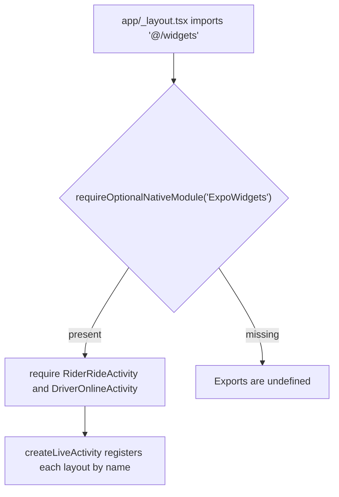
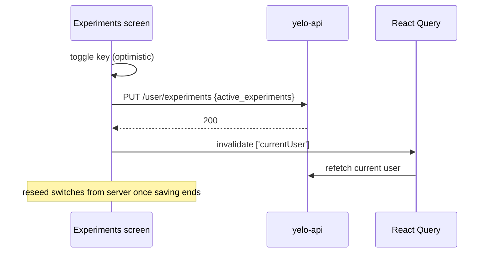

This page covers the switches that change what the mobile app does without a server deploy: the iOS Live Activity scaffold, opt-in experiments, the feedback and review prompts, and build-time `EXPO_PUBLIC_*` flags. For the native config that ships the widget extension, see [Native configuration](/engineering/mobile/native-config).

## iOS Live Activities

### Current status

The widget extension ships in every iOS build, but no Live Activity ever starts. Two activity layouts are registered and nothing calls them.

| Activity | File | Props | Layout |
| --- | --- | --- | --- |
| `RiderRideActivity` | `widgets/RiderRideActivity.tsx` | `status`, `driverName`, `etaMinutes` | Stub. Banner with status, driver name, and ETA. Compact and minimal views use the `car.fill` SF Symbol. |
| `DriverOnlineActivity` | `widgets/DriverOnlineActivity.tsx` | `status`, `riderName?`, `queueCount` | Stub. Banner with status, rider, and queue count. Compact and minimal views use `steeringwheel`. |

Both files say the stub layout exists "so the widget extension ships in the review build" and that the real UI comes later. There are no `.start()` calls, no push-to-start token listeners, and no API endpoints that store Live Activity push tokens.

### How the scaffold loads

- `widgets/index.ts` checks for the `ExpoWidgets` native module before importing the activity files. Binaries built before `expo-widgets` was added (before 5.6.1) and some dev clients lack the module. Both `expo-widgets` and `@expo/ui` touch native code at import time, so an unguarded import crashes those binaries at startup.
- The exports are typed `LiveActivityFactory<Props> | undefined`. Any future caller must handle `undefined`.
- Layout functions use the `'widget'` directive and `@expo/ui/swift-ui` primitives (`VStack`, `HStack`, `Text`, `Image`, `Spacer`). They're compiled for the widget extension, so they can't use app hooks or state.

### Native target

| Setting | Production | E2E |
| --- | --- | --- |
| Extension bundle ID | `io.flutterflow.ridedesi.desirider.ExpoWidgetsTarget` | `io.flutterflow.ridedesi.desirider.e2e.ExpoWidgetsTarget` |
| App group | `group.io.flutterflow.ridedesi.desirider` | `group.io.flutterflow.ridedesi.desirider.e2e` |
| Push updates | `enablePushNotifications: true` | Same |

Android has no widget equivalent.

<Warning>
  Changing activity names, props, or layouts changes the widget extension, which is a native change. `createLiveActivity('RiderRideActivity', ...)` names are the contract with any future server push payload. Don't rename them after a real layout ships.
</Warning>

## Experiments

Experiments are opt-in features that a community makes available and a user turns on. They're server-driven: the list of keys lives on the API, and the app only reads it.

### Enablement rule

An experiment is on when all of these are true:

1. The community's `active_experiments` contains the key. Admins edit this list in the dashboard community editor (`CommunityEditor.tsx`, **Experimental Features**).
2. The user's `active_experiments` contains the key. Users edit this list on **Settings** > **Experiments**.
3. For `rideshare-price-aggregator` only, the user has accepted the on-device disclosure.

### Keys

`lib/experiments/index.ts` defines every key in `EXPERIMENTS`. Never inline an experiment string.

| Constant | Key | Gates | Read in |
| --- | --- | --- | --- |
| `glassLab` | `glass_lab` | **Settings** > **Glass Lab**, a Liquid Glass diagnostic harness | `app/(app)/profile/settings.tsx`, `glass-lab.tsx` |
| `ridesharePriceAggregator` | `rideshare-price-aggregator` | Third-party quotes on the request sheet, provider connect screens, provider diagnostics | `map/request.tsx`, `connect-uber.tsx`, `connect-lyft.tsx`, `connect-empower.tsx`, `profile/accounts.tsx`, `lib/ride/useAggregatorPlatforms.ts`, `providers/ProviderDiagnosticsObserver.tsx` |
| `colorLab` | `color-lab` | **Settings** > **Color Lab** | `settings.tsx`, `color-lab.tsx` |
| `designSystemLab` | `design-system-lab` | **Settings** > **Design System Lab** | `settings.tsx`, `design-system-lab.tsx` |

### Hooks

| API | Returns | Use when |
| --- | --- | --- |
| `useExperiment(key)` | `{ enabled, loading, error }` | You must wait before redirecting, for example on a deep-linked screen. `loading` uses `isPending`, so a query disabled by a missing JWT still counts as loading. On `error`, fail open instead of redirecting. |
| `useExperimentEnabled(key)` | `boolean` | Most UI. False while loading or on error, so gated UI never flashes. |
| `<ExperimentGate experiment={key} fallback={...}>` | Children or fallback | Declarative gating |

The sources are `useCurrentUser` (user list) and `useCurrentCommunity` (community list). For the aggregator key, `useAggregatorDisclosure` is a third source.

### Experiments screen

`app/(app)/profile/experiments.tsx` lists every key in the community's `active_experiments`, including keys the app doesn't know, humanized for display (`new_map_ui` becomes **New Map UI**). **Settings** only shows the **Experiments** row when the community list is non-empty.

- Each toggle updates a local set, then `save()` sends the full sorted list with `PUT /user/experiments`. The API replaces the stored list.
- Saves are serialized. A toggle during a save sets a pending flag, and the loop resends the newest list. Only the last attempt's failure shows the **Something went wrong** alert.
- After each attempt the screen invalidates `['currentUser']`. The switches reseed from the server once no save is running, which reverts a failed toggle.

### Price aggregator disclosure

Turning on `rideshare-price-aggregator` for the first time shows `PRICE_AGGREGATOR_DISCLAIMER`. The switch stays off until the user confirms.

- Acceptance is a per-user, on-device flag (`createUserFlag('price-aggregator-disclaimer:diagnostics-v1:', ...)` in `lib/ride/aggregatorDisclosure.ts`). It's written to AsyncStorage before the experiment is enabled, and a storage failure blocks enabling.
- The `diagnostics-v1` prefix is a new disclosure version, so users who accepted the older disclaimer must accept again.
- Turning the experiment off also disables provider diagnostic consent (`useProviderDiagnosticConsentStore`). `ProviderDiagnosticsObserver` keeps that store in sync with the experiment state, the JWT, and the current user for non-React transports.
- The server-side user list can contain the key while the disclosure is missing, for example after a reinstall. The experiment stays off on that device until the user accepts again.

Analytics events: `experiments_screen_viewed`, `experiment_toggled`, `experiment_disclaimer_shown`, `experiment_disclaimer_confirmed`, `experiment_disclaimer_cancelled`, and `experiment_save_failed`.

## Feedback and review prompts

Two independent state machines decide when to ask for feedback. Both store per-user JSON in AsyncStorage.

| Module | Storage key | Cooldown | Decides |
| --- | --- | --- | --- |
| `lib/prompts/feedbackPrompt.ts` | `feedbackPrompt:{userId}` | 14 days (`FEEDBACK_COOLDOWN_MS`) | Whether to show Yelo's custom feedback funnel |
| `lib/prompts/reviewPrompt.ts` | `reviewPrompt:{userId}` | 90 days | Whether to call `StoreReview.requestReview()` |

### Triggers

| Reason | Caller | Rule in both modules |
| --- | --- | --- |
| `ride-positive` | `app/(app)/ride-complete/index.tsx` after a saved rating of 4 or 5 stars | Counts positive ratings. Eligible on the 1st and every 10th (`RIDE_POSITIVE_CADENCE`). |
| `first-like` | `components/save-location/SearchOverlay.tsx` when the user likes a place with zero existing likes | Once per user |
| `driver-approved` | `app/(app)/_layout.tsx` whenever `driver_application_status` changes | Once, and only on a real transition from a known non-approved status to `approved`. A first observation of `approved` only records the status. |
| `driver-shift` | `providers/DriveProvider.tsx` when a driver goes offline | 3 or more ratings of 4 to 5 stars and none of 1 to 2 stars during the shift. Shift counters reset on each online and offline. |

### Flow

<Steps>
  <Step title="Gate the funnel">
    `useFeedbackPrompt().requestFeedbackPrompt(reason)` calls `maybeShowFeedbackPrompt`. When it returns true, it has already written `lastShownAt` and any one-shot flag, so the cooldown starts even if the user dismisses the dialog.
  </Step>
  <Step title="Run the funnel">
    `FeedbackPromptProvider` shows **Thoughts on the app?** (**Meh** or **Love it!**), then **What can we improve?** (**Not Now** or **Give Feedback**), then an optional text modal. Rider reasons use the rider dialog variant. Driver reasons use the driver variant.
  </Step>
  <Step title="Hand off to the store prompt">
    **Not Now**, cancel, and submit call `finish()`, which calls `maybeRequestReview` regardless of sentiment. It checks its own cadence and cooldown, then `StoreReview.hasAction()`, then calls `requestReview()`.
  </Step>
</Steps>

Analytics events: `app_feedback_prompt_shown`, `app_feedback_sentiment`, `app_feedback_declined`, `app_feedback_submitted` (includes the full `text`), and `review_prompt_requested` with `was_shown` and `cooldown_active`. Feedback text only goes to PostHog, not to the Yelo API.

<Note>
  `maybeRequestReview` and `observeDriverStatusForReview` return immediately in `__DEV__`. To test the native prompt, use a release build. To test the custom funnel in dev, set `EXPO_PUBLIC_FEEDBACK_FORCE=true`. It bypasses every cadence and cooldown, never persists state, and shows floating dev buttons that trigger `ride-positive` and `driver-shift`.
</Note>

## Build-time environment flags

`EXPO_PUBLIC_*` variables are inlined into the JavaScript bundle by Metro at build or export time. Changing one needs a new bundle (an OTA update is enough), not a native build. `.env.example` lists the ones a local checkout usually needs. EAS builds read them from the EAS environment named by the profile, and `e2e-simulator` sets four inline. See [Native configuration](/engineering/mobile/native-config#eas-build-profiles).

<Warning>
  Never put a secret in an `EXPO_PUBLIC_*` variable. Everything with that prefix is readable in the shipped bundle.
</Warning>

### Environment and services

| Variable | Read in | Effect |
| --- | --- | --- |
| `EXPO_PUBLIC_APP_ENV` | `app.config.ts`, `lib/config.ts`, `lib/auth/security.ts`, `lib/auth/entryMode.ts`, `app/_layout.tsx`, `components/bottom-sheets/friends-hub/useFriendsHubData.ts` | `e2e` switches the native identity, API origin, auth scheme, and native (not hosted) Auth v3 entry. It also disables Sentry, PostHog, and Dub, and skips the system Messages composer for invites. |
| `EXPO_PUBLIC_API_URL` | `lib/config.ts` | API origin override. Honored in `__DEV__` and in E2E builds. Release builds that aren't E2E always use `https://api.rideyelo.com`. E2E rejects non-HTTPS origins, origins with a path or credentials, and the production origins. |
| `EXPO_PUBLIC_E2E_AUTH_ORIGIN` | `lib/auth/security.ts` | An extra origin that `isSafeAuthV3WebURL` accepts for Auth v3 web pages. Read only when the variant is `e2e`. |
| `EXPO_PUBLIC_IS_PRODUCTION` | `providers/EasUpdateObserver.tsx`, `lib/observability/logger.ts` | `true` enables OTA checks when the app returns to the foreground (at most every 30 minutes), the on-device file log transport, `info` severity, and async logging. Otherwise the logger is console-only at `debug`. |
| `EXPO_PUBLIC_POSTHOG_API_KEY` | `app/_layout.tsx` | PostHog key. Empty disables PostHog. |
| `EXPO_PUBLIC_SENTRY_DSN` | `app/_layout.tsx` | Sentry DSN. Sentry is also off in `__DEV__` and E2E. |
| `EXPO_PUBLIC_DUB_PUBLISHABLE_KEY`, `EXPO_PUBLIC_DUB_DOMAIN` | `app/_layout.tsx` | Dub attribution SDK. Blanked for E2E. |
| `EXPO_PUBLIC_PROJECT_ID` | `providers/PushNotificationProvider.tsx` | EAS project ID for `getExpoPushTokenAsync`. Missing throws during push token registration on a physical device. |
| `EXPO_PUBLIC_SOURCE_COMMIT` | `app/(app)/profile/settings.tsx` | Short commit shown in the Settings version footer. The **OTA Stage** workflow sets it. When unset, the footer shows `unknown`. |

### Developer and QA toggles

| Variable | Read in | Effect | Stripped from release builds |
| --- | --- | --- | --- |
| `EXPO_PUBLIC_FEEDBACK_FORCE` | `lib/prompts/feedbackPrompt.ts`, `providers/FeedbackPromptProvider.tsx` | `true` forces the feedback funnel and shows dev launcher buttons | Yes, gated by `__DEV__` |
| `EXPO_PUBLIC_FAKE_FRIENDS` | `lib/dev/devFakeFriends.ts`, used by `providers/FriendsProvider.tsx` | Injects up to 10 deterministic fake friends. The server rejects bumps to them. | Yes, gated by `__DEV__` |
| `EXPO_PUBLIC_DISABLE_ANIMATIONS` | `hooks/useReduceMotion.ts` | `true` makes `useReduceMotionState` report reduced motion, for deterministic E2E evidence | No |
| `EXPO_PUBLIC_LOG_REQUESTS` | `providers/AxiosProvider.tsx` | `true` logs `interceptor.receive` and `interceptor.block` for each request | No |
| `EXPO_PUBLIC_MAP_TUTORIAL_OVERRIDE` | `lib/map/mapTutorial.ts`, used by `providers/MapTutorialProvider.tsx` and `providers/FriendsProvider.tsx` | `always` restarts the map tutorial every launch. `never` suppresses it. | No |
| `EXPO_PUBLIC_ENABLE_MOCK_DATA` | `lib/dev/mockConfig.ts`, used by `hooks/useVehicleLocations.ts`, `providers/MapFeedProvider.tsx`, `app/(app)/ride-matching/2-queued.tsx` | `true` shows mock vehicles, mock events, and mock queued-ride details | No |
| `EXPO_PUBLIC_ALWAYS_SHOW_DRIVER_MARKETING` | `components/onboarding/why-drive/constants.ts`, used by `hooks/useEnterDriverFlow.ts` | `true` always routes to the **Why drive** marketing stories | No |

The last five aren't gated by `__DEV__`. They stay off only because no EAS environment sets them. Setting one in the `production` EAS environment would ship it to every user.

### Compile-time constants

| Constant | File | Value | Effect |
| --- | --- | --- | --- |
| `EDGE_POINTERS_ENABLED` | `components/map/edgePointers/constants.ts` | `false` | Hides off-screen edge pointers on the map tab (`app/(app)/(tabs)/map/_layout.tsx`) |

Ride creation also sends a capability header, `X-Features: tips,driver-options`. It describes what the client can render, not a user toggle. See [State and data](/engineering/mobile/state-and-data#x-features-header).

The app doesn't read PostHog feature flags.

## Where this lives in code

| Concern | Path |
| --- | --- |
| Live Activity layouts and guard | `widgets/index.ts`, `widgets/RiderRideActivity.tsx`, `widgets/DriverOnlineActivity.tsx` |
| Widget registration | `app/_layout.tsx` (`import '@/widgets'`) |
| Experiment keys and hooks | `lib/experiments/index.ts` |
| Experiments screen | `app/(app)/profile/experiments.tsx` |
| Aggregator disclosure | `lib/ride/aggregatorDisclosure.ts`, `providers/ProviderDiagnosticsObserver.tsx` |
| Experiments API | `yelo-api` `internal/server/http/user/user_routes.go` (`PUT /user/experiments`) |
| Feedback and review state | `lib/prompts/feedbackPrompt.ts`, `lib/prompts/reviewPrompt.ts` |
| Prompt UI | `providers/FeedbackPromptProvider.tsx`, `components/feedback/FeedbackTextModal.tsx` |
| API origin resolution | `lib/config.ts` |

## Gotchas and edge cases

- **Store review runs on its own cadence after the funnel.** `reviewPrompt.ts` counts `ride-positive` calls separately, and it's only called after a feedback funnel finishes. So the native prompt fires after the 1st and then the 10th completed ride-positive funnel, which is roughly the 100th positive rating, subject to both cooldowns.
- **Dismissing the first dialog skips the store prompt.** Dismissing **Thoughts on the app?** calls `reset()`, not `finish()`, so `maybeRequestReview` never runs. The feedback cooldown has already started.
- **Prompt state is per device.** Both state machines live in AsyncStorage. A reinstall or new device resets cadence, cooldowns, and one-shot flags. The iOS system also rate-limits `requestReview()` on its own.
- **Unknown experiment keys still show up.** The Experiments screen lists every community key, including ones no build gates. Users can toggle them with no visible effect.
- **Experiment keys are a cross-repo contract.** The dashboard stores free-text keys. A typo in the community editor silently makes the experiment unavailable.
- **The widget module guard hides import errors.** If `ExpoWidgets` is missing, both factories are `undefined` with no log line.
