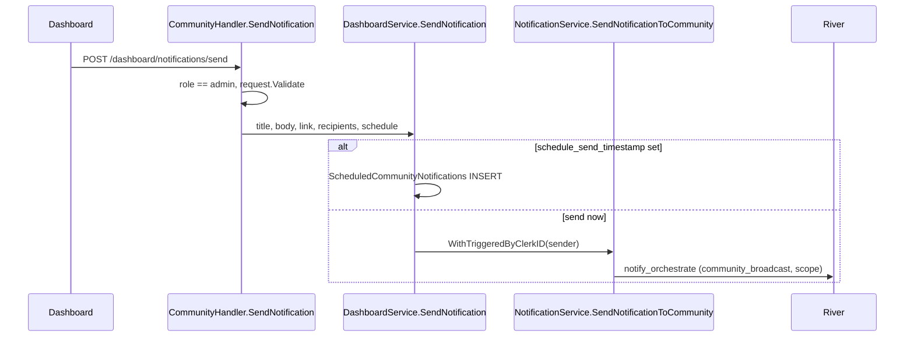

Admins reach users in four ways: the **Send Notification** sheet, scheduled sends from the same sheet, **Notify market** on Supply & Demand, and single-user pings. All four become push notifications through the standard pipeline. None of them send SMS.

For the admin workflow, see [Send notifications](/dashboard/notifications). For the pipeline, see [Push send pipeline](/engineering/notifications/send-pipeline).

## Entry points

| Entry point | Route | Guard | Code emitted | Audience |
| --- | --- | --- | --- | --- |
| Send now | `POST /dashboard/notifications/send` | Handler requires Clerk role `admin` | `community_broadcast` | Community scope |
| Schedule | Same route with `schedule_send_timestamp` | Same | Stored, later `community_broadcast` | Community scope |
| Notify market | `POST /dashboard/supply-demand/markets/{id}/notify` | Community resolved from path (admin) or claims (others). **No role check.** | `community_broadcast` | Community scope |
| Ping driver | `POST /dashboard/supply-demand/drivers/{id}/ping` | `requireAdmin` | `dashboard_ping_driver` | One user |
| Ping rider | `POST /dashboard/supply-demand/riders/{id}/ping` | `requireAdmin` | `dashboard_ping_rider` | One user |

The send and schedule route is registered by `registerNotificationRoutes` in `internal/server/http/community/community_router.go`. Its handler is `CommunityHandler.SendNotification`.



## Validation

`models.ValidateCommunityNotification` (`internal/models/notification_validation.go`) runs on send, on schedule, and again when a scheduled row fires:

- `community_id` is set.
- Title and body are non-blank and contain no NUL characters.
- `json.Marshal({title, body})` is at most 3,000 bytes. This bounds the JSON encoding, so characters that JSON escapes count more than once.
- `recipients` is one of `ALL`, `DRIVERS`, `RIDERS`, `ONLINE_DRIVERS`, `RECENTLY_ONLINE_DRIVERS`.
- On schedule, the timestamp must be in the future.

The dashboard form limits title to 60 characters and body to 200. The API does not.

`NotifyMarket` and the ping endpoints skip `ValidateCommunityNotification`. Their request structs (`MarketNotifyRequest`, `PingDriverRequest`, `PingRiderRequest` in `internal/models/supply_demand.go`) only declare `validate:"required"` on title and body or message. There is no 3,000-byte cap or NUL check, and `NotifyMarket` checks `recipient` only through the scope switch in `SendNotificationToCommunity`, which returns `400 Invalid recipient type`.

## Recipient group queries

`SendNotificationToCommunity` maps the recipient enum to a `notify.BroadcastScope`. The orchestrator resolves the scope when the job runs with `recipientRepository.ListBroadcastTokens` (`internal/notify/repository/recipients.go`).

Every scope starts from this base:

```sql
SELECT DISTINCT u.id, u.push_notification_token, u.community_id
  FROM "Users" AS u
  LEFT OUTER JOIN "DriverApplications" AS da ON da.user_id = u.id
 WHERE u.community_id = $1
   AND u.push_notification_token <> ''
   AND u.allow_notifications = true
```

| Dashboard label | Scope | Added condition |
| --- | --- | --- |
| **All Users** | `all` | none |
| **Drivers Only** | `drivers` | `da.is_active = true` |
| **Riders Only** | `riders` | `da.user_id IS NULL OR da.is_active = false` |
| **Online Drivers** | `online_drivers` | Joins an open `DriverSessions` row (`end_time IS NULL`), `u.is_online_driver = true`, `da.is_active = true` |
| **Recently Online Drivers** | `recently_online_drivers` | Joins any `DriverSessions` row with `end_time > NOW() - 60 minutes`, `da.is_active = true` |

Details that matter:

- Membership is by `Users.community_id` only. Schools and fleets are ignored.
- Deleted, banned, and locked users are not excluded. Only a token and `allow_notifications` are required.
- **Recently Online Drivers** includes drivers who are online now if they also ended a session in the last hour. A driver who has been online continuously for more than an hour is excluded.
- A driver with an active application who never drove is in **Drivers Only** and not in **Riders Only**.
- Recipients are resolved when the orchestrate job runs, not when you click **Send**. For a scheduled send, that is when the scheduler fires.

The legacy `ListRecentlyOnlineDriverPushTokens` query in `queries/community.sql` also windowed on the `DriverNotifications` table. The pipeline no longer uses it.

## Limits applied to broadcasts

| Limit | Value | Where |
| --- | --- | --- |
| Max recipients | none (`max_recipients` null) | Seed |
| User and community cooldowns | none by default | Seed. `NotificationPolicies` can add them. |
| Quiet hours | Only if a `NotificationPolicies` row sets them. Behavior is `defer`. | `applyQuietHours` |
| Freshness | Never expires | `orchestrationFreshnessForCode` |
| Deep link | `ride` | Seed |

## Dedupe collisions

`SendNotificationToCommunity` never passes `WithEventKey`. The default key is `community_broadcast:{community_id}:{unix/300}`, which does not include the scope or the copy.

Any second broadcast to the same community inside the same 5-minute bucket is dropped as `deduped`, including:

- Sending to **Drivers Only**, then to **Riders Only**, a minute apart.
- Two scheduled sends for the same community processed in the same minute.
- A **Notify market** send shortly after a dashboard broadcast.

The API still returns success, and the scheduled row is deleted. The only signal is the `deduped` metric and the missing `Notifications` row. Until the key includes a unique ID, space broadcasts to the same community at least 5 minutes apart, aligned to wall-clock 5-minute boundaries.

## The link field

The sheet's **Link (optional)** field is stored on scheduled rows (`ScheduledCommunityNotifications.link`) but never passed to `SendNotificationToCommunity`. Every broadcast opens the template's deep link, `ride`. That is a route that redirects to the map.

## Scheduling loop

Scheduled sends are not River jobs. They are rows in `ScheduledCommunityNotifications` processed by an in-process ticker.

| Step | Code |
| --- | --- |
| Insert | `DashboardService.SendNotification` → `CreateScheduledNotification` with `sender_clerk_id` |
| Tick | `Notifications` group in `startBackgroundTasks`, every 1 minute, 2-minute timeout per run |
| Select | `ListScheduledNotificationsBefore`: `schedule_send_timestamp < now()` |
| Claim | `MarkScheduledNotificationSending`: `SET is_sending = TRUE WHERE id = $1 AND NOT is_sending` |
| Validate | `ValidateCommunityNotification` again |
| Send | `SendNotificationToCommunity` with `WithTriggeredByClerkID(sender_clerk_id)` |
| Remove | `DeleteScheduledNotification` |

Timing:

- The ticker runs on every API instance. The `is_sending` update is the only guard against two instances sending the same row, and it works because the update is conditional.
- A row fires up to about 60 seconds after its scheduled time, plus orchestration latency.
- If `BACKGROUND_TASKS_ENABLED=false`, scheduled sends never fire.

### Cancel

`DELETE /dashboard/notifications/scheduled/{schedule_id}` deletes the row. The **Scheduled** tab only shows **Cancel** while `schedule_send_timestamp > NOW()` (`can_cancel` in `ListScheduledNotificationTable`). Once the time passes, the row is either sending or stuck.

### History merge

`ListNotificationHistoryByCommunity` unions `Notifications` rows for the community with pending `ScheduledCommunityNotifications`. Scheduled rows show `scheduled` before their time and `sending` after it. `sender_name` is computed in SQL: `triggered_by_clerk_id` if set, else `System / API` when there is no `triggered_by` user, else that user's name or `Deleted user`. For dashboard sends, the SQL returns the raw Clerk user ID, not a display name, and neither the API (`internal/data/repository/notification_log.go`) nor the dashboard tables (`NotificationsTable.tsx`, `NotificationLogsTable.tsx`) resolve it. Scheduled rows use `sender_clerk_id` the same way.

## Pings

`SupplyDemandService.PingDriver` and `PingRider` emit to one user with the default event key `{code}:{user}:{unix/300}`.

- A second ping to the same person with different copy inside the same 5-minute bucket is deduped.
- Both codes are time-sensitive. A ping still queued after 15 minutes is canceled.
- The response is `{ "sent": true }` when the job is enqueued. It does not mean the push reached the device. If enqueue fails, the API returns `200` with `{ "sent": false }`, not an error.
- Pings bypass `allow_notifications` checks at the API. The orchestrator then suppresses the delivery as `notifications_disabled` or `missing_push_token`.

## Where this lives in code

| Concern | Path |
| --- | --- |
| Send and schedule handler | `yelo-api/internal/server/http/community/community_handler.go` (`SendNotification`), `community_router.go` (`registerNotificationRoutes`) |
| Broadcast and schedule logic | `yelo-api/internal/service/dashboard/notification.go` |
| Scope mapping | `yelo-api/internal/service/notifications/notification.go` (`SendNotificationToCommunity`) |
| Scope SQL | `yelo-api/internal/notify/repository/recipients.go` (`ListBroadcastTokens`) |
| Scheduled rows SQL | `yelo-api/internal/data/repository/notification.go`, `queries/notification.sql` |
| Validation | `yelo-api/internal/models/notification_validation.go` |
| Market notify and pings | `yelo-api/internal/server/http/dashboard/supply_demand/handlers.go`, `internal/service/dashboard/supply_demand.go` |
| Ticker | `yelo-api/cmd/api/main.go` (`startBackgroundTasks`), `cmd/api/background_cleanup.go` |
| Dashboard UI | `yelo-web/src/sites/dashboard/pages/NotificationsPage.tsx`, `src/components/notifications/SendNotificationSheet.tsx` |

## Gotchas and edge cases

<AccordionGroup>
  <Accordion title="A failed scheduled send is stuck forever">
    If validation or `SendNotificationToCommunity` fails after `is_sending` is set, the loop logs and moves on without clearing the flag. On every later tick, `ListScheduledNotificationsBefore` returns the row again (it doesn't filter on `is_sending`), `MarkScheduledAsSending` affects zero rows, and the loop logs `likely already being processed`. The row never sends, is never deleted, and can no longer be cancelled from the UI because `can_cancel` is false. Delete it with the DELETE route or SQL.
  </Accordion>
  <Accordion title="A crash between send and delete leaves a phantom row">
    If the instance dies after the emit but before `DeleteScheduledNotification`, the row keeps `is_sending = true`. The broadcast went out, but the row stays on the **Scheduled** tab as `sending`.
  </Accordion>
  <Accordion title="Notify market has weaker guards">
    `notifyMarket` does not call `requireAdmin`, so any dashboard role scoped to a community can broadcast to it. It skips the size check, doesn't attribute the sender (history shows `System / API`), and always returns `{ "sent_to": 1 }` whatever the audience size.
  </Accordion>
  <Accordion title="Timezones">
    The dashboard sends the schedule timestamp in the browser's timezone. The server compares it with `NOW()` in UTC, which is correct for absolute timestamps. Community timezones only matter for quiet hours.
  </Accordion>
  <Accordion title="Quiet hours can defer a broadcast you scheduled">
    If a `NotificationPolicies` row sets quiet hours for `community_broadcast`, a scheduled send that fires inside the window is deferred to the window's end. If that end is further out than `max_defer_seconds`, recipients are suppressed as `quiet_hours_expired`. `max_defer_seconds` is null by default, which means no limit.
  </Accordion>
</AccordionGroup>
