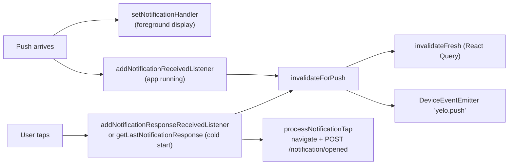

The app treats most pushes as two things at once: a message for the user and a signal that cached server data is stale. This page traces both paths through `yelo-frontend`. For the server side of each `data.type`, see [Notification catalog](/engineering/notifications/catalog). For the app's polling fallbacks, see [Rider and driver flows](/engineering/mobile/rider-and-driver-flows#polling-and-push).

## Token registration

`providers/PushNotificationProvider.tsx` owns the token.

| Step | Behavior |
| --- | --- |
| When | An effect runs once there is a JWT, the startup screen is interactive, and `userStateStore` has loaded. It is scheduled with `scheduleWhenIdle`. |
| Permission | `registerForPushNotificationsAsync(false)` never prompts. On iOS, "granted" also requires `allowsAlert`, `allowsBadge`, and `allowsDisplayInNotificationCenter`. |
| Simulators | `Device.isDevice` false returns no token and logs `push.token.register.skip`. |
| Token | `getExpoPushTokenAsync({ projectId: EXPO_PUBLIC_PROJECT_ID })`, 3 attempts with 1-second then 2-second backoff. A missing project ID throws. |
| Upload | `POST /notification/set-token` only when the fresh token differs from SecureStore key `expoPushToken`. The key is updated after a successful upload. |
| Sign-out | `SessionProvider.signOut` calls `POST /notification/clear-token` (skipped when the account was deleted) and deletes the SecureStore key. |

On the server, `setCanonicalPushNotificationToken` stores the token on `Users` and clears the same token from every other user, so a device belongs to one account at a time. Telemetry uploads write through the same function.

The OS prompt is only shown by `requestPermissions()`, called from `app/(auth-v3)/permissions.tsx` and `app/(app)/post-signup/10-marketing.tsx`. It obtains a token but does not upload it. The upload happens the next time the registration effect runs.

### In-app toggle

`components/bottom-sheets/profile-sheets/NotificationsSheet.tsx` calls `PUT /user/allow-notifications`. The server keeps the token and the orchestrator suppresses deliveries as `notifications_disabled`. The toggle has no effect on SMS.

## Foreground display

The module-level `Notifications.setNotificationHandler`:

| Field | Value |
| --- | --- |
| `shouldShowAlert`, `shouldShowBanner`, `shouldShowList` | `false` only when `data.type` is `map_content_changed`, otherwise `true` |
| `shouldPlaySound` | `true` when the content has a sound and it isn't `map_content_changed` |
| `shouldSetBadge` | Always `false`. The app never sets a badge count. |

Chat pushes show a banner even while the user is looking at that chat. Nothing dismisses presented notifications.

### Android channels

`configureAndroidNotificationChannels` creates two channels, both `AndroidImportance.HIGH`:

- `default`, named `Yelo notifications`, with the default sound.
- `kaching-channel`, named `Kaching`, with `kaching.wav`.

The channels are created inside `registerForPushNotificationsAsync`, not at startup. A push that targets `kaching-channel` before registration has run plays without the custom sound. `app.json` bundles `./assets/audio/kaching.wav` through the `expo-notifications` plugin with `defaultChannel: "default"`.

## Cache invalidation

`invalidateForPush` (`lib/notifications/pushInvalidation.ts`) runs for every received push and again for every tap, because a cold-start tap never passes through the received listener. Invalidation goes through `invalidateFresh` (`lib/query/invalidateFresh.ts`), which marks matching queries stale, then refetches only active ones, coalesced per frame.

### Type normalization

1. **Session gate.** For `ride_state_changed`, the push is ignored unless `data.user_id` equals the cached `['currentUser']` user ID. If that query isn't cached yet, the push is dropped.
2. **Ride status.** Any payload with a non-empty `ride_id` **and** `status` becomes `ride_status_changed`, whatever its `type`.
3. **Legacy types.** `ride_confirmed`, `driver_arrived`, `ride_completed`, `ride_canceled_by_driver`, `ride_canceled_by_rider`, `ride_requeued`, `ride_request_no_drivers`, and `direct_request_fallback` also become `ride_status_changed`.
4. **Chat.** `message_sent` becomes `message_received`.

### What each type invalidates

| Effective type | Invalidated query roots |
| --- | --- |
| Ride refresh: `ride_status_changed`, `ride_state_changed`, `ride_auto_queued` | `/user/status`, `/user/ride-state`, `/driver/queue`, ride boards, ride and drive history, `/ride/feed-summaries` batches containing the ride, and that ride's queries. With no `ride_id` (session pushes), every ride query. |
| `message_received` | Every root containing `/messages`, limited to the ride when `ride_id` is present |
| `ride_request` | Ride boards and `/ride/board/{ride_id}` |
| `map_content_changed`, scope `place_metadata` | `/map/friends`, `/map/community`, `/user/likes`, `/location/pois`, `/ride/feed-summaries`, `/user/recent-locations` |
| `map_content_changed`, scope `community_pois` | `/location/pois`, `/map/community`, `/mapping/search-context` for that `community_id` only |
| `map_content_changed`, scope `friends` | `/map/friends`, `/user/likes`, `/user/friends`, `friends` |
| Anything else | Nothing. No event is emitted. |

After invalidating, it emits `DeviceEventEmitter` event `yelo.push` with `{ type, rideId, scope }`. Listeners:

| Listener | Reacts to |
| --- | --- |
| `providers/MessagingProvider.tsx` | `message_received`, `ride_status_changed`, `ride_auto_queued`, only while the app is active. Syncs the inbox. |
| `hooks/drive/useRideMessages.ts` | `message_received` for the open ride, or with no ride ID. Syncs the thread. |
| `components/RecentLocationsSync.tsx` | `map_content_changed` with scope `place_metadata` |

### Coverage by code

| Server code | App handling |
| --- | --- |
| All rider and driver ride lifecycle codes | Ride refresh (legacy type set, and `ride_id` + `status`) |
| `ride_status_changed`, `ride_state_changed`, `ride_auto_queued` | Ride refresh |
| `message_sent` (sent as `message_received`) | Chat refresh and chat sync |
| `ride_available` (sent as `ride_request`) | Board refresh |
| `map_content_changed` | Scoped map refresh, silent in foreground |
| `unclaimed_ride`, `unclaimed_ride_fleet`, `driver_renew_online`, `community_broadcast`, `friend_bump`, `dashboard_*`, `driver_application_approved`, `payout_*` | None. Banner and tap navigation only. |

`data.vibration` (sent on `ride_auto_queued`) is never read.

## Silent pushes

The server sends `ride_status_changed`, `ride_state_changed`, and `map_content_changed` with no title, body, or sound and `_contentAvailable: true`. The app has no background notification task. The only `TaskManager.defineTask` is the driver location task. So:

- While the app is in the foreground, the received listener runs `invalidateForPush` immediately.
- While the app is backgrounded or killed, the push has no effect. The app catches up on its next foreground poll. Pollers pause in the background (`refetchIntervalInBackground: false`).

iOS enables `remote-notification` in `UIBackgroundModes`, which permits content-available delivery, but no JavaScript handles it.

## Taps

`handleNotificationResponse` in the provider:

1. Dedupes on `JSON.stringify([identifier, actionIdentifier])` in a ref. Expo replays the last response whenever listeners are reattached, and the listener effect re-runs when its callbacks change identity.
2. Runs `invalidateForPush`.
3. Calls `processNotificationTap` (`lib/notifications/processNotificationTap.ts`).

`processNotificationTap`:

- Reads `data.url`, or `data.route`, as the target.
- Reads `notification_delivery_id` as the tracking ID. If it's already in the in-memory `openedTrackingIds` set, it stops, skipping analytics and navigation.
- Sends a tap analytics event with `cohort_id`, `deep_link_path`, `notification_delivery_id`, `notification_id`, `notification_type`, and `variant_id`.
- Fires `POST /notification/opened` with `{ tracking_id }` without waiting. On failure, the ID is removed from the set so a later tap can retry.
- Calls `router.push(url)` as-is.

On the server, `RecordOpened` sets `opened_at = COALESCE(opened_at, NOW())` where `tracking_id` and `user_id` match. A tracking ID from another user's push returns `404`.

### Deep link resolution

The URL goes straight to `router.push`. There is no normalization, and `app/+native-intent.tsx` only rewrites OS-delivered URLs, not in-app pushes.

| Seeded deep link | Result |
| --- | --- |
| `ride/4-ride` | Resolves relative to the current route. Works from the root. The screen ignores params and reads `current_ride_id` from status. |
| `ride`, `ride?rate={id}` | `app/(app)/ride/index.tsx` redirects to the map. `rate` is never read. Rating lives at `ride-complete?rideId=`. |
| `drive` | Driver map (`app/(app)/drive/index.tsx`). Also relative. |
| `/map` | Map tab. |
| `/driver-signup/1-application-status` | No such route. Falls to `+not-found`. The folder has `1-hub` through `8-submitted`. |
| `yelo://drive/earnings` | No `drive/earnings` route. Earnings is `driver-earnings/1-hub`. |

Friend bump pushes carry `destination_poi_id` and coordinates, and the seed comment says the client promotes them to a place sheet. The current app does not read those keys. Bump taps open `/map`.

## Live Activities

`widgets/RiderRideActivity.tsx` and `widgets/DriverOnlineActivity.tsx` define Live Activities with `expo-widgets` (`createLiveActivity`). Both are stub layouts that exist so the widget extension ships in review builds.

- `widgets/index.ts` loads them only when the `ExpoWidgets` native module exists, so older binaries don't crash.
- Nothing starts, updates, or ends an activity. No push-to-start or activity push tokens are requested or sent to the API, and the server has no Live Activity sender.
- `app.json` enables `enablePushNotifications` on the widgets plugin. `app.config.ts` (`withProductionAps`) forces `aps-environment` back to `production` because the plugin overwrites it with `development`.

## Where this lives in code

| Concern | Path |
| --- | --- |
| Registration, display, listeners | `yelo-frontend/providers/PushNotificationProvider.tsx` |
| Cache invalidation | `yelo-frontend/lib/notifications/pushInvalidation.ts`, `lib/query/invalidateFresh.ts` |
| Tap handling | `yelo-frontend/lib/notifications/processNotificationTap.ts` |
| Token storage | `yelo-frontend/stores/userStateStore.ts` |
| Sign-out clear | `yelo-frontend/providers/SessionProvider.tsx` |
| Push event consumers | `yelo-frontend/providers/MessagingProvider.tsx`, `hooks/drive/useRideMessages.ts`, `components/RecentLocationsSync.tsx` |
| Notification toggle | `yelo-frontend/components/bottom-sheets/profile-sheets/NotificationsSheet.tsx` |
| Live Activities | `yelo-frontend/widgets/`, `app.json`, `app.config.ts` |
| Server endpoints | `yelo-api/internal/server/http/notification/notification_routes.go` |

## Gotchas and edge cases

<AccordionGroup>
  <Accordion title="A payload with ride_id and status is always a ride push">
    The normalization in `invalidateForPush` checks `ride_id` + `status` before `type`. If you add a non-ride push that happens to carry both keys, the app treats it as a ride transition and refetches ride state.
  </Accordion>
  <Accordion title="Session pushes before the user loads">
    `ride_state_changed` is dropped when `['currentUser']` isn't cached. On a cold start triggered by a tap, the first session push can be ignored. The status poller covers the gap.
  </Accordion>
  <Accordion title="Open tracking is once per process">
    `openedTrackingIds` lives in a ref. After an app restart, tapping the same notification from the notification center records another open request, which the server ignores because `opened_at` is already set.
  </Accordion>
  <Accordion title="Cold-start navigation doesn't wait for auth">
    `getLastNotificationResponse` is handled as soon as the listener effect mounts in the root layout. `router.push` can run before the session or navigator is ready, and route guards may then redirect.
  </Accordion>
  <Accordion title="Changing data.type is a client contract change">
    The app keys on `data.type`, not on the template code. Renaming a template's `client_data_type` in the dashboard can silently stop cache refreshes. Keep `ride_available` as `ride_request` and `message_sent` as `message_received`.
  </Accordion>
</AccordionGroup>
