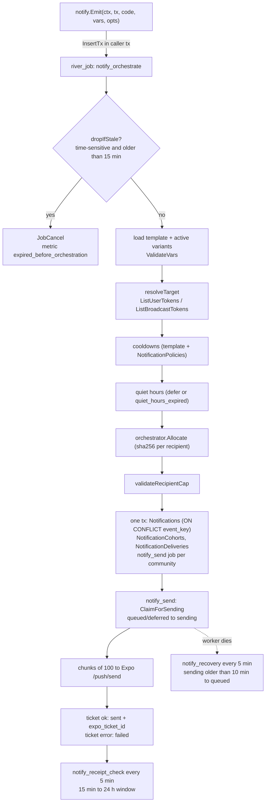

Every templated push in Yelo goes through one pipeline in `yelo-api/internal/notify`. Service code writes an intent into the River job table, a worker turns the intent into database rows, and a second worker hands those rows to Expo. This page explains each stage and the constants that control it. For the product view, see [Notifications](/concepts/notifications). For what each code sends, see [Notification catalog](/engineering/notifications/catalog).

## Stage 1: emit

`notify.Emit` (`internal/notify/emit.go`) is the only entry point. It does no delivery work. It builds `OrchestrateArgs` and calls `river.Client.InsertTx` on the transaction you pass in.

- **Transactional outbox.** If your transaction rolls back, the job never existed. The ride expiry sweep (`CancelUnmatchedRides` in `internal/data/repository/ride_lifecycle.go`), chat messages (`enqueueMessage` in `internal/service/ride/messaging.go`), and ride-state revisions (`emitRideStateRevision` in `internal/data/repository/ride_revision.go`) rely on this.
- **No transaction.** Most service code goes through `NotificationService.emit`, which uses `notify.NewPoolEmitter` and `EmitNoTx`. That opens its own short transaction. The job is still durable, but it commits separately from the caller's writes.
- **Type safety.** Each code has a `Vars` struct in `codes.go`. `EmitWithClient` rejects a struct whose `TemplateCode()` differs from the code argument (`ErrInvalidCodeForVars`). `VarsToMap` flattens fields to strings using the `notify:"name[,required]"` tag. Supported field kinds are `string`, `uuid.UUID`, and integers.
- **Recipients.** You must pass `WithRecipient`, `WithRecipients`, or `WithCommunityBroadcast`. Otherwise Emit returns `ErrMissingRecipients`.
- **Locale.** Emit always sets `Locale: "en"`.
- **Tracing.** If the context carries a valid span, its trace ID is copied into `args.TraceID` and later stored on the `Notifications` row.

### Emit options

| Option | Effect |
| --- | --- |
| `WithRecipient(id)`, `WithRecipients(ids)` | Explicit user list. Resolved to tokens when the job runs, not at emit time. |
| `WithCommunityBroadcast(communityID, scope)` | Audience comes from a scope query at run time. Also sets `communityID`. |
| `WithRideID(id)` | Binds a ride. Used for the default event key and for ride timeline events. |
| `WithCommunityID(id)` | Audit only. Stored on `Notifications.community_id`. |
| `WithTriggeredBy(userID)`, `WithTriggeredByClerkID(id)` | Sender attribution. Clerk IDs come from dashboard actions. |
| `WithEventKey(key)` | Overrides the dedupe key. Required when there are several recipients and no ride or broadcast binding (`ErrMissingEventKey`). |
| `WithData(map)` | Extra keys merged over the template-derived payload. Caller keys win. |

### Event keys and dedupe

The `Notifications` table has a unique `event_key`. `InsertIdempotent` (`internal/notify/repository/notifications.go`) uses `ON CONFLICT (event_key) DO NOTHING`. A conflict is not an error: the orchestrator records the metric status `deduped` and returns success.

`resolveEventKey` derives the default key as `{code}:{entity}:{unix/300}`. The entity is the ride, then the broadcast community, then the single recipient. The last segment is a 5-minute bucket, so a retried emit inside the same bucket dedupes, but a later occurrence sends again.

Callers override the key when the default is wrong:

| Code | Key | Why |
| --- | --- | --- |
| `ride_status_changed` | `ride_status_changed:{ride}:{status}` | One per transition. A 5-minute ride bucket would swallow the next status. |
| `ride_state_changed` | `ride_state:{user}:{revision}` | One per revision. |
| `message_sent` | `message_sent:{message_id}` | Each chat message is distinct. |
| `ride_request_no_drivers` | `ride_expired:{ride}` | Once per ride, ever. |
| `direct_request_fallback` | `direct_request_fallback:{ride}` | Once per ride, ever. |
| `unclaimed_ride` | `unclaimed_ride:{ride}:tier:{n}:recipients:{sha256(sorted ids)}` | A retry with the same recipients dedupes. A replacement set sends. |
| `unclaimed_ride_fleet` | `unclaimed_ride_fleet:{ride}` | Once per ride. |
| `ride_available` | `ride_available:{ride}:direct:{driver}`, `…:fleet-t0:{fleet}`, `…:driver-online:{driver}` | One per dispatch path. |
| `payout_*` | `{stripe event type}:{stripe event id}` | Stripe webhook redelivery dedupes. |
| `driver_application_approved` | `driver_approved_{user}_{step}_{review unix}` | Re-approving the same review does not resend. |
| `map_content_changed` | `map_content_changed:{random uuid}` | Every mutation sends. |
| `friend_bump` | `friend_bump:{sender}:{client idempotency key}:push` | Client retries dedupe. |
| Dashboard test send | `test:{code}:{user}:{uuid}` | Always unique. |

<Warning>
`community_broadcast` never overrides the key. Two broadcasts to the same community within one 5-minute bucket share `community_broadcast:{community}:{bucket}`, and the second is dropped as `deduped` even if the scope or copy differs. See [Operator broadcasts](/engineering/notifications/broadcasts-and-scheduling#dedupe-collisions).
</Warning>

## Stage 2: orchestrate

`orchestrateWorker.Work` in `internal/notify/queue/orchestrate.go` runs on the River `default` queue (10 workers).

### Freshness

`orchestrationFreshnessForCode` returns 15 minutes (`orchestrateFreshness`) for codes that describe a live moment, and zero (never expires) for everything else.

| Expires after 15 minutes | Never expires |
| --- | --- |
| `ride_confirmed`, `driver_arrived`, `ride_canceled_by_driver`, `ride_canceled_by_rider`, `ride_requeued`, `direct_request_fallback`, `ride_request_no_drivers`, `ride_available`, `unclaimed_ride`, `unclaimed_ride_fleet`, `ride_auto_queued`, `ride_status_changed`, `driver_renew_online`, `friend_bump`, `friend_bump_sms`, `dashboard_ping_driver`, `dashboard_ping_rider` | `ride_state_changed`, `ride_completed`, `map_content_changed`, `message_sent`, `waitlist_cleared`, `welcome_to_yelo`, `community_broadcast`, `dashboard_send`, `driver_application_approved`, `payout_paid`, `payout_failed`, `payout_canceled`, and any unknown future code |

Three mechanisms enforce it:

1. `dropIfStale` cancels the job with `river.JobCancel` if `now > created_at + 15m`.
2. `NextRetry` keeps River's default exponential backoff but clamps the next attempt to the deadline. If the deadline has already passed, it schedules one second from now so `Work` can cancel it.
3. On boot, `CancelStaleOrchestrationJobs` (`queue/stale.go`) lists `notify_orchestrate` jobs in `available`, `pending`, `retryable`, or `scheduled` state older than 15 minutes with a time-sensitive code, in pages of 1,000, and cancels them before `notifyClient.Start`.

### Template and variant checks

`loadRenderInputs` handles configuration outcomes:

| Condition | Outcome |
| --- | --- |
| No template row for `(code, locale)` | `JobCancel(ErrTemplateNotFound)`. Never retried. |
| Template `channel` is not `push` | `JobCancel(ErrUnsupportedChannel)`. This is why `friend_bump_sms` can never reach Expo. |
| Template `is_active = false` (non-test) | Job succeeds silently. Metric `skipped_inactive`. No `Notifications` row. |
| Required var missing or empty, or enum mismatch | `JobCancel(ErrSchemaValidation)`. |
| No active variants | Job succeeds silently. Metric `skipped_no_variant`. |
| Active variant weights do not total 100 | `JobCancel` from `orchestrator.Allocate`. |
| Eligible count exceeds `max_recipients` | `JobCancel(ErrRecipientCapExceeded)`. `message_sent` is exempt. |

<Note>
The cap check runs after cooldown and quiet-hours filtering, so it counts eligible recipients only. Suppressed recipients do not count toward `max_recipients`.
</Note>

### Recipient resolution

`resolveTarget` expands the target to `UserToken` rows (`internal/notify/repository/recipients.go`):

- **Explicit users.** `ListUserTokens` returns every requested user, with a `SuppressionReason` of `notifications_disabled` (when `allow_notifications = false`) or `missing_push_token`. These become `suppressed` delivery rows, so history shows why a user got nothing.
- **Broadcasts.** `ListBroadcastTokens` filters out users without tokens or with notifications disabled in SQL, so they leave no delivery rows at all. The scope queries are documented in [Operator broadcasts](/engineering/notifications/broadcasts-and-scheduling#recipient-group-queries).
- **Deleted and banned users are not filtered here.** Only the token and `allow_notifications` matter at this stage.

If nothing resolves, the job logs `notify: no reachable recipients` or `notify: broadcast scope matched no recipients` and writes a `Notifications` row with status `suppressed` and `deferred_reason = no_reachable_recipients`.

### Cooldowns

`bypassesCooldowns` exempts `ride_state_changed`, `message_sent`, `ride_status_changed`, `ride_available`, and `map_content_changed`. These skip cooldowns and quiet hours entirely, whatever the template or policy says. Test sends also skip them.

For every other code, `effectivePolicy` builds a policy per recipient community:

1. Start from the template's `user_cooldown_seconds` and `community_cooldown_seconds`.
2. If a `NotificationPolicies` row exists for `(community_id, code, locale)` and `is_active`, its non-null cooldowns replace the template's, and its `quiet_start` and `quiet_end` apply.

Then:

- **Community cooldown.** `HasRecentCommunityNotification` checks for any non-test, non-suppressed delivery of this code in the community inside the window. If one exists, every recipient in that community is suppressed as `community_cooldown`.
- **User cooldown.** `FilterRecentRecipients` checks, per user, for any non-test, non-suppressed delivery of this code created inside the window. Matches are suppressed as `user_cooldown`.

Both checks key on template code, not on ride. A driver who got `unclaimed_ride` for ride A is in cooldown for ride B too.

### Quiet hours

`applyQuietHours` only acts when the template has `quiet_hours_behavior = defer` and is either category `marketing` or code `community_broadcast`. The seeder sets `defer` only for those (`quietHoursBehavior` in `seed/seed.go`), so `community_broadcast` is the only seeded code that can defer.

For each recipient community with both `quiet_start` and `quiet_end` set:

1. Load `Communities.time_zone`, defaulting to UTC. An invalid zone logs a warning and falls back to UTC.
2. `orchestrator.NextAllowedAt` returns the end of the current quiet window, or `nil` if now is allowed. Windows can cross midnight, for example `22:00` to `10:00`. Equal start and end mean no quiet hours.
3. If the window end is later than `now + max_defer_seconds`, recipients in that community are suppressed as `quiet_hours_expired`.
4. Otherwise their deliveries are written as `deferred` with `scheduled_for` set, and the send job for that community is scheduled at that time.

When every eligible delivery is deferred, the notification status is `deferred`. `expires_at` is set to `now + max_defer_seconds` when both apply.

<Note>
No API route writes `NotificationPolicies`. `PolicyRepository.Upsert` exists but nothing calls it outside tests. Quiet hours and per-community cooldown overrides only apply if you insert rows directly.
</Note>

### Variant allocation

`orchestrator.Allocate` (`internal/notify/orchestrator/allocate.go`) assigns each eligible recipient to exactly one active variant:

1. For each active variant with weight above zero, `baseCount = floor(n × weight / 100)`. Weights must total exactly 100.
2. Leftover recipients go to variants in descending order of remainder, with ties broken by variant ID.
3. Recipients are sorted by `sha256(event_key + ":" + user_id)`, then sliced into the variant buckets in variant ID order.

Because the hash includes the event key, a retry of the same job assigns every user to the same variant. A different notification reshuffles users.

A dashboard test send skips allocation and uses the selected variant.

### Persistence

`persistAndEnqueue` writes everything in one transaction on the River pool:

- One `Notifications` row with the first cohort's rendered copy, `data` (the client payload), `variables`, counts, and status (`pending`, `deferred`, or `suppressed`).
- One `NotificationCohorts` row per variant, with a snapshot of rendered title, body, and deep link, configured percentage, and template and variant versions.
- One `NotificationDeliveries` row per recipient. Eligible rows are `queued` or `deferred`. Suppressed rows carry `suppression_reason`. Each row gets a random `tracking_id` used for tap tracking. `ON CONFLICT (notification_id, user_id) DO NOTHING` drops duplicate user IDs.
- One `notify_send` job per community in the eligible set, `UniqueOpts{ByArgs: true}`. Deferred communities get `ScheduledAt`.

No send job is inserted when every recipient is suppressed.

After commit, `recordOrchestrationOutcome` records the `notification_dispatched` ride event (for ride-bound, non-test sends) with counts, status, reason, and cohorts.

## Stage 3: send

`sendWorker.Work` in `queue/send.go`:

1. **Load.** Reads the `Notifications` row, the current template, and cohorts.
2. **Claim.** `ClaimForSending` updates `queued` rows, and `deferred` rows whose `scheduled_for` has passed, to `sending` with `sending_started_at = NOW()`. It filters by community when the job carries one. In the same statement it **re-reads the push token** from `Users`, returning an empty token if the user has since disabled notifications or lost their token.
3. **Late suppression.** Rows with an empty token are finalized as `suppressed` with `token_unavailable_at_send`.
4. **Chunk.** Deliveries go out in chunks of 100 (`expoBatchSize`). Each message gets the cohort's rendered title and body and the stored payload plus four tracking keys: `notification_id`, `notification_delivery_id` (the tracking ID), `cohort_id`, and `variant_id`.
5. **Presentation.** `sound`, `priority`, and `channelId` come from the template at send time. Silent templates go through `applySilence`, which blanks title, body, and sound and sets `_contentAvailable: true`.
6. **Finalize.** A ticket with `status: ok` stores `expo_ticket_id` and marks the row `sent`. An error ticket marks it `failed` with the Expo error code. A `DeviceNotRegistered` ticket also clears that token from every user row (`ClearPushNotificationToken`), outside the transaction.
7. **Ride events.** Each accepted delivery on a ride-bound notification records a `notification_sent` ride event with the Expo ticket ID.
8. **Recount.** `RecomputeCounts` rolls delivery statuses up to the parent.

<Warning>
Rendered copy is frozen at orchestration time on the cohort, but presentation fields (`sound`, `priority`, `channelId`, `silent`) are read from the template when the send job runs. A template edit between orchestration and a deferred send changes how the push is presented but not what it says.
</Warning>

### Expo client

`internal/utilities/notification/expo.go` posts to `https://exp.host/--/api/v2/push/send` and `/--/api/v2/push/getReceipts`.

- 30-second HTTP timeout. No access-token header, no gzip, no circuit breaker, and no in-client retry.
- A non-200 response or any top-level `errors` entry fails the whole chunk. The send worker then calls `RevertToQueued` for that chunk, keeps sending later chunks, and returns the first error so River retries the job with default backoff and attempts.
- If Expo returns fewer tickets than messages, the extra deliveries stay in `sending` for the recovery job.

The template's `haptic` field is stored and editable but never sent. `PushMessage` has no haptic field.

## Stage 4: receipts

`notify_receipt_check` is a River periodic job every 5 minutes with `RunOnStart`.

1. `ExpireStaleSent` marks `sent` deliveries older than 24 hours as `failed` with `receipt_expired`.
2. `ListPendingReceipts` selects up to 1,000 `sent` deliveries with a ticket, sent between 15 minutes and 24 hours ago, oldest first.
3. Expo receipts with `ok` become `delivered`. `error` receipts become `failed` with the Expo error code. `MessageRateExceeded` is left as `sent` so the next cycle retries it.
4. `DeviceNotRegistered` receipts clear the token.
5. Touched notifications are recounted. The first time a ride-bound notification has no pending or receipt-pending deliveries, it records one `notification_delivered` ride event and stamps `delivery_event_recorded_at`.

The 1,000-row page is the throughput ceiling: about 12,000 receipts an hour. A larger backlog ages past 24 hours and is marked `receipt_expired`, which the dashboard counts as a failure.

### Notification status rollup

`RecomputeCounts` sets the parent status only when no delivery is `queued`, `deferred`, or `sending`:

| Condition | Status |
| --- | --- |
| No failed deliveries | `sent` |
| Every delivery failed | `failed` |
| Some failed | `partial_failure` |

`suppressed` deliveries count toward the total but not toward failures.

## Stage 5: recovery

`notify_recovery` runs every 5 minutes. `RequeueStaleSending` returns deliveries stuck in `sending` for more than 10 minutes (`sendingLease`) to `queued` and inserts a new `notify_send` job per affected notification, without a community filter.

## Delivery status reference

| Status | Set by | Meaning |
| --- | --- | --- |
| `queued` | Orchestrator, `RevertToQueued`, recovery | Waiting for a send job. |
| `deferred` | Orchestrator | Held for quiet hours until `scheduled_for`. |
| `sending` | `ClaimForSending` | Claimed by a worker. Leased for 10 minutes. |
| `sent` | Send worker | Expo accepted it and returned a ticket. |
| `delivered` | Receipt worker | Expo receipt `ok`. This means Expo handed it to APNs or FCM, not that the user saw it. |
| `failed` | Send or receipt worker | Ticket or receipt error, or `receipt_expired`. |
| `suppressed` | Orchestrator or send worker | Never attempted. See `suppression_reason`. |

`suppression_reason` values: `notifications_disabled`, `missing_push_token`, `community_cooldown`, `user_cooldown`, `quiet_hours_expired`, `token_unavailable_at_send`.

## Metrics

`RecordNotificationSent(code, status, count)` statuses: `dispatched`, `suppressed`, `no_recipients`, `deduped`, `skipped_inactive`, `skipped_no_variant`, `expired_before_orchestration`. `RecordNotificationReceiptStatus` records `delivered` and `failed`. Test traffic is excluded from both.

## Where this lives in code

| Concern | Path |
| --- | --- |
| Emit, options, event keys | `yelo-api/internal/notify/emit.go`, `notify.go` |
| Job args and kinds | `yelo-api/internal/notify/jobs.go` |
| Orchestrate worker | `yelo-api/internal/notify/queue/orchestrate.go` |
| Send worker | `yelo-api/internal/notify/queue/send.go` |
| Receipt and recovery workers | `yelo-api/internal/notify/queue/maintenance.go` |
| Stale-job cancellation on boot | `yelo-api/internal/notify/queue/stale.go` |
| River client, queues, constants | `yelo-api/internal/notify/queue/queue.go` |
| Variant allocation, quiet-hours math | `yelo-api/internal/notify/orchestrator/allocate.go`, `quiet_hours.go` |
| SQL for claim, receipts, cooldowns | `yelo-api/internal/notify/repository/deliveries.go`, `pipeline.go`, `recipients.go`, `policies.go` |
| Expo HTTP client | `yelo-api/internal/utilities/notification/expo.go` |
| Push token writes | `yelo-api/internal/data/repository/user_profile.go` (`setCanonicalPushNotificationToken`), `queries/push_tokens.sql` |

## Gotchas and edge cases

<AccordionGroup>
  <Accordion title="A deduped emit looks like success">
    `EmitNoTx` returns nil as soon as the job is inserted. If the event key already exists, the orchestrator quietly stops. The only traces are the `deduped` metric and the absence of a new `Notifications` row. When a push "never arrived", search `Notifications` by `event_key` before looking at Expo.
  </Accordion>
  <Accordion title="Freshness applies to orchestration, not to sending">
    The 15-minute cutoff is checked before orchestration. A `notify_send` job that keeps failing against Expo retries on River's default policy, so a time-sensitive push such as `driver_arrived` can still land long after the fact if Expo was down after orchestration succeeded.
  </Accordion>
  <Accordion title="Seeded cooldowns that never apply">
    `ride_available` is seeded with `user_cooldown_seconds = 900`, but `bypassesCooldowns` exempts it, so the value does nothing. Editing it in the dashboard has no effect.
  </Accordion>
  <Accordion title="Cooldowns are per code, not per ride">
    `unclaimed_ride` carries a 900-second user cooldown. The fourth default activation tier re-pings already-notified drivers at 8 minutes, but any driver who got an `unclaimed_ride` push in the previous 15 minutes, for any ride, is suppressed as `user_cooldown`. Lowering the activation **Cooldown** in the dashboard below 15 minutes does not lower this floor.
  </Accordion>
  <Accordion title="Tokens are re-read at send time">
    The token captured at orchestration is only a snapshot. `ClaimForSending` swaps in the user's current token and honors a later `allow_notifications = false`. A user who signs out between orchestration and send is suppressed as `token_unavailable_at_send`.
  </Accordion>
  <Accordion title="One token, one user">
    Setting a token clears it from every other user (`ClearCanonicalPushTokenOtherOwners`). When two accounts share a phone, only the most recent sign-in gets pushes.
  </Accordion>
  <Accordion title="A whole Expo chunk fails together">
    A request-level Expo error reverts all 100 deliveries in the chunk and retries the job. One malformed message can hold up the other 99 until River gives up.
  </Accordion>
  <Accordion title="Silent pushes still count as deliveries">
    `ride_status_changed`, `ride_state_changed`, and `map_content_changed` produce normal `Notifications` and delivery rows and appear in dashboard history and analytics. Filter them out when you measure tap rates.
  </Accordion>
</AccordionGroup>
