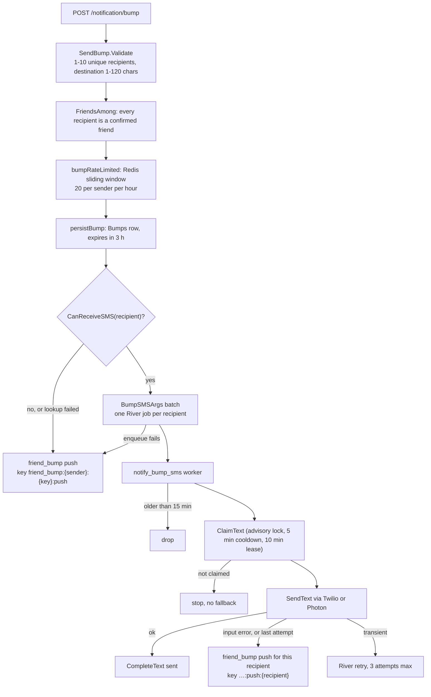

Yelo sends text messages for two things: friend bumps and phone sign-in codes. Friend bumps are the only user-to-user messaging, and they are the only place text and push compete for the same message. This page covers that flow in depth, then the providers and consent rules every text follows.

For the push pipeline that bump fallbacks use, see [Push send pipeline](/engineering/notifications/send-pipeline).

## Friend bump flow



### Request

`POST /notification/bump` (`NotificationHandler.SendBump`) takes `requests.SendBump`:

| Field | Rule |
| --- | --- |
| `recipient_user_ids` | 1 to 10 (`MaxBumpRecipients`), no duplicates, no nil UUIDs |
| `destination_name` | Required after trimming, at most 120 bytes |
| `arrival_label` | Optional, at most 32 bytes, for example `3:03pm`. The client formats it. The server never computes arrival times. |
| `destination_poi_id` | Optional, at most 64 bytes |
| `destination_latitude`, `destination_longitude` | Both or neither, within valid ranges |
| `idempotency_key` | Required, client-generated UUID |

### Authorization and rate limit

`NotificationService.NotifyFriendBump` (`internal/service/notifications/bump.go`):

1. **Friends only.** `Friendship.FriendsAmong` must return exactly the requested set. One non-friend rejects the whole bump with `You can only bump people who are already your friends on Yelo.`
2. **Rate limit.** `bumpRateLimited` calls `RedisClient.ReserveSlidingWindow` on key `friend_bump:{sender}` with the idempotency key as the member, a 1-hour window, and a limit of 20.
   - It's a reservation, not a count, so concurrent requests can't all pass.
   - A retry with the same idempotency key reuses its slot.
   - A refused bump releases its slot.
   - If Redis is disabled or errors, the limit **fails open**.
   - Over the limit, the API returns a rate-limit error: `Slow down` / `You've sent a lot of bumps recently. Try again in a little while.`
3. **Sender name.** A blank first name becomes `A friend`.

### Persistence

`persistBump` writes a `Bumps` row for the friends map layer before any delivery, with `expires_at = now + 3h`. All failures only log.

- If `destination_poi_id` resolves to a location that is `IsPublic` or `ShowOnMap`, the row gets that location's name, coordinates, address, categories, and Mapbox ID. Otherwise no coordinates are stored.
- `resolveBumpLocation` accepts `yelo:{uuid}` catalog IDs, raw location UUIDs, Mapbox IDs, and legacy place references.
- The sender's current position is attached from the Redis presence cache when available.

The `MapHeat` ticker deletes bumps that expired more than 7 days ago.

### Channel choice

`queueFriendBumpDeliveries` decides per recipient:

- **Text** if `userrequirements.CanReceiveSMS` is true: a non-blank `phone_number` and a null `sms_opted_out_at`. A stored phone number is the consent signal, because Auth v3 only stores OTP-verified numbers.
- **Push** otherwise, or if the recipient lookup fails.

`allow_notifications` does not gate text. Push consent and text consent are independent.

All texts for one bump are enqueued in one transaction (`NewPoolBumpSMSEnqueuer`). If that transaction fails, every recipient falls back to push. The HTTP request returns success once enqueueing is done. Provider errors never reach the sender.

### Copy

Seed copy for both channels (`internal/notify/friendbump.go`):

| Part | Value |
| --- | --- |
| Title | `{{sender_first_name}} bumped you 👋` |
| Body | `Heading to {{destination_name}}{{arrival_phrase}}.` |
| `arrival_phrase` | `, arriving around {label}` when `arrival_label` is set, or empty |

A text reads, for example, `Sam bumped you 👋 Heading to Student Union, arriving around 3:03pm.`

The push and text templates are separate rows (`friend_bump` and `friend_bump_sms`). Editing one does not change the other.

`GET /notification/bump/preview` (`PreviewFriendBump`) renders the current text for the signed-in sender without reserving a rate-limit slot or sending anything.

## Bump SMS worker

`notify_bump_sms` jobs (`bumpSMSWorker` in `internal/notify/queue/bump_sms.go`) run on the `default` queue.

| Setting | Value | Constant |
| --- | --- | --- |
| Max attempts | 3 | `notify.BumpSMSMaxAttempts` |
| Uniqueness | By all args (event key, recipient, body, and the rest) | `EnqueueBumpSMS` |
| Freshness | 15 minutes from job creation. Older jobs return success without sending. | `bumpSMSFreshness` |
| Per-recipient cooldown | 5 minutes across different bumps | `bumpSMSCooldown` |
| Claim lease | 10 minutes | `bumpSMSLease` |

### Rendering at send time

`bumpSMSBody` calls `notify.RenderFriendBumpSMS`. It reads active `friend_bump_sms` variants ordered by `label, id`, uses the **first** one (no A/B allocation for text), renders title and body, and joins them with a space. If the read fails, there are no active variants, or the result is empty, it uses the body computed at enqueue time from the compiled constants. A copy edit made after enqueue still applies to queued texts.

### The TextMessages claim

`sqlTextMessageRepository.ClaimText` (`internal/data/repository/text_messages.go`) decides whether this worker may send. It takes a transaction-scoped advisory lock on the recipient, then runs `ClaimTextMessage` (`queries/engagement.sql`):

- **Insert** a `sending` row with `claimed_at = clock_timestamp()` only if the recipient has no other `friend_bump:%` row that is either `sent` within the cooldown (measured from `sent_at`), or `sending` within the lease.
- **On conflict** with the same `(event_key, recipient_id)`, re-claim only if the existing row is `failed`, or `sending` with an expired lease.
- **No row returned** means cooldown, already sent, or in flight. The job ends successfully and sends nothing, **not even the push fallback**.

`clock_timestamp()` is used instead of `NOW()` so long transactions don't distort the lease. The advisory lock is what makes the `NOT EXISTS` check safe under `READ COMMITTED`.

### Outcomes

`CompleteText` writes `sent` with `sent_at`, or `failed` with the error message. Then:

| Provider result | Worker action |
| --- | --- |
| Success | Done. |
| Twilio error 21610 (`ErrUnsubscribedRecipient`) | Set `sms_opted_out_at` for every user with that number, then push fallback. |
| Other input error (4xx, invalid number) | Push fallback. No retry. |
| Server error or rate limit, attempt 1 or 2 | Return the error. River retries with backoff. The `failed` row can be re-claimed. |
| Server error or rate limit, attempt 3 | Push fallback. |

The push fallback emits `friend_bump` to that recipient only, with key `{event_key}:push:{recipient}` and the same data as the direct push path. Fallback errors are logged and swallowed.

<Note>
The fallback push goes through the normal pipeline, so the `friend_bump` template's 300-second user cooldown, 10-recipient cap, 15-minute freshness, and the recipient's `allow_notifications` all apply.
</Note>

## Providers

### Choosing a provider

`cmd/api/main.go` builds the bump sender once at boot:

```go
var bumpTexts notifyqueue.TextSender = twilio.NewTwilioProvider(cfg, l)
if cfg.Messaging.PhotonEnabled() {
    bumpTexts = photon.NewProvider(cfg, l)
}
```

`PhotonEnabled` is true when both `PHOTON_PROJECT_ID` and `PHOTON_PROJECT_SECRET` are set. Only bump texts switch. Sign-in codes always use Twilio.

### Twilio

`twilioProvider.SendText` (`internal/data/twilio/twilio.go`):

- Numbers in `+1555XXXXXXX` form (`phone.IsTestPhone`) return success without calling Twilio.
- Sends from `TWILIO_PHONE_NUMBER` through the `twilio` circuit breaker and `retry.NewNetworkRetrier` (5 attempts, jittered backoff). Input and rate-limit errors stop the in-process retries immediately.
- `classifyTwilioStatus` maps 4xx to input errors, 429 and Verify rate-limit codes to rate-limit errors, and 21610 to `ErrUnsubscribedRecipient`.
- Verify (`StartVerification`, `CheckVerification`) uses a separate `twilio-verify` breaker.

### Photon

`photon.Provider.SendText` (`internal/data/photon/photon.go`) sends through Photon's Spectrum iMessage data plane over gRPC. Photon picks iMessage or SMS/RCS per recipient.

- The chat GUID is `any;-;{E.164 number}`, which lets Photon choose the service.
- Each call mints or reuses a bearer token (cached, default TTL 5 minutes if the mint response omits one). An `Unauthenticated` status drops the cached token so the next retry mints a new one.
- 10-second timeout per mint and per send (`externalRequestTimeout`).
- gRPC `InvalidArgument`, `NotFound`, `PermissionDenied`, `FailedPrecondition`, `OutOfRange`, and `Unimplemented` are input errors. `ResourceExhausted` is a rate limit. Everything else is a server error.
- A successful RPC with a non-zero Apple `send_error_code` is logged as a warning and treated as sent.
- Test phones short-circuit the same way as Twilio.

## Consent: STOP and START

`POST /twilio-webhook` (`twiliowebhook.HandleInboundSMS`) receives inbound texts to the Twilio number:

1. Validates `X-Twilio-Signature` with `TWILIO_AUTH_TOKEN` over the public URL, rebuilt from `X-Forwarded-Proto` and `X-Forwarded-Host`. A missing token or signature is `401`.
2. Uppercases and trims `Body`.
   - `STOP`, `STOPALL`, `UNSUBSCRIBE`, `CANCEL`, `END`, `QUIT` set `sms_opted_out_at = NOW()`.
   - `START`, `UNSTOP`, `YES` clear it.
   - Any other text is ignored.
3. Normalizes `From` with region `US`. An unusable number is acknowledged and ignored.
4. `SetUsersSMSOptOut` updates **every** user with that `phone_number`.
5. Returns empty TwiML (`<Response></Response>`) with `Content-Type: text/xml`. Yelo never auto-replies. Twilio sends its own confirmation.

Keywords must be the whole message. `STOP please` does nothing in Yelo's records, although Twilio's own filtering may still block delivery, which the next send learns as error 21610.

## Other texts and emails

| Message | Channel | Copy | Trigger | Consent check |
| --- | --- | --- | --- | --- |
| Phone OTP (legacy and no-Verify path) | Twilio SMS | `Your Yelo verification code is: {code}` | `NotificationService.NotifyPhoneOTP` | None |
| Phone OTP (Auth v3) | Twilio Verify with a custom code | Twilio Verify template | `StartVerification` | None |
| OTP fallback | Twilio SMS | `Your Yelo verification code is: {code}` | `PhoneFallbackService.Run` when Verify never confirmed delivery after `TWILIO_OTP_FALLBACK_DELAY` (default 60 seconds), swept every `TWILIO_OTP_SWEEP_INTERVAL` (default 15 seconds) | None |
| Email verification code | Resend | Subject `Your Yelo verification code` | `NotificationService.NotifyEmailOTP` → `mail.SendEmailVerificationEmail` | None |

Sign-in codes ignore `sms_opted_out_at`, because a user who asks for a code is consenting to it. A failed fallback send stays claimed and is not retried.

There are no quiet hours, templates, or cooldowns on OTP texts. Auth v3 rate limits are covered in [Authentication](/engineering/api/authentication).

## Where this lives in code

| Concern | Path |
| --- | --- |
| Bump route and validation | `yelo-api/internal/server/http/notification/notification_handler.go`, `requests/bump.go` |
| Bump service and preview | `yelo-api/internal/service/notifications/bump.go`, `bump_preview.go` |
| Bump copy, rendering, enqueue | `yelo-api/internal/notify/friendbump.go`, `friendbump_render.go`, `bump_sms.go` |
| Bump SMS worker | `yelo-api/internal/notify/queue/bump_sms.go` |
| TextMessages claim | `yelo-api/internal/data/repository/text_messages.go`, `queries/engagement.sql` |
| SMS consent | `yelo-api/internal/service/userrequirements/user.go` (`CanReceiveSMS`), `queries/user_profile.sql` (`SetUsersSMSOptOut`) |
| STOP/START webhook | `yelo-api/internal/server/http/twiliowebhook/twiliowebhook.go` |
| Providers | `yelo-api/internal/data/twilio/twilio.go`, `internal/data/photon/photon.go` |
| OTP fallback | `yelo-api/internal/service/authv3/phone_fallback.go` |
| Email | `yelo-api/internal/utilities/mail/mail.go` |

## Gotchas and edge cases

<AccordionGroup>
  <Accordion title="A cooldown hit means the recipient gets nothing">
    If a second bump reaches a recipient within 5 minutes of a delivered bump text, `ClaimText` refuses and the worker exits cleanly. It does not fall back to push, so the recipient sees only the first bump.
  </Accordion>
  <Accordion title="iMessage replies don't reach the STOP webhook">
    With Photon enabled, bump texts don't come from the Twilio number, so a recipient's `STOP` reply never hits `/twilio-webhook`, and Photon never returns `ErrUnsubscribedRecipient`. Yelo has no opt-out path for Photon-delivered texts.
  </Accordion>
  <Accordion title="Photon idempotency is per call, not per job">
    `SendText` generates a new Photon idempotency key on every call. It is stable across the in-process network retries but not across River attempts, so an ambiguous failure followed by a River retry can deliver the same bump twice.
  </Accordion>
  <Accordion title="A shared phone number shares consent">
    `SetUsersSMSOptOut` matches on `phone_number`, so a STOP opts out every account with that number, including deleted ones.
  </Accordion>
  <Accordion title="Consent is checked at enqueue, not at send">
    `CanReceiveSMS` runs in the HTTP request. A STOP that arrives while a job waits for retry does not cancel it. Twilio would reject the send with 21610, which then falls back to push.
  </Accordion>
  <Accordion title="Rate limit fails open">
    When Redis is unavailable, `bumpRateLimited` allows every bump. The per-recipient 5-minute text cooldown and the 300-second push cooldown are then the only limits.
  </Accordion>
</AccordionGroup>
