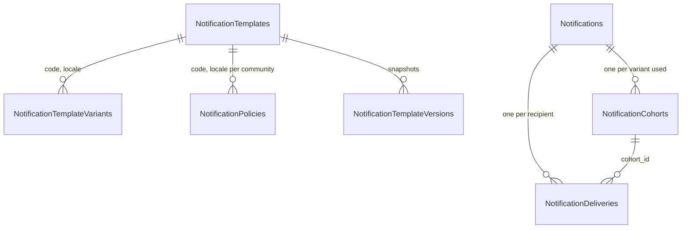

Notification copy lives in Postgres, not in code. Code declares which variables a template may use, the seeder creates the first row, and admins edit copy from the dashboard. This page covers the internals. For the admin workflow, see [Notification templates](/dashboard/notification-templates).

## Data model



| Table | Key | Holds |
| --- | --- | --- |
| `NotificationTemplates` | `(code, locale)` | `channel`, `deeplink`, `client_data_type`, `variables` (JSON schema), `haptic`, `sound`, `android_channel`, `priority`, `category`, `max_recipients`, `user_cooldown_seconds`, `community_cooldown_seconds`, `quiet_hours_behavior`, `max_defer_seconds`, `is_active`, `version`, `silent` |
| `NotificationTemplateVariants` | `id`, unique `(code, locale, label)` | `title`, `body`, `weight` (a percentage), `is_active`, `version` |
| `NotificationTemplateVersions` | `(source_table, source_id, version)` | JSON snapshot of the row before each edit, with the editor's Clerk ID |
| `NotificationPolicies` | `(community_id, template_code, template_locale)` | Per-community cooldown overrides and quiet hours |
| `Notifications` | unique `event_key` | One dispatch: rendered copy of the first cohort, `data`, `variables`, counts, status |
| `NotificationCohorts` | `id` | Per-variant snapshot: rendered title, body, deep link, configured percentage, allocated count, versions |
| `NotificationDeliveries` | unique `(notification_id, user_id)` | One recipient: token snapshot, status, Expo ticket and receipt, `tracking_id`, `opened_at` |

`channel` is part of the row, not the key. A push and an SMS template can't share a code. That is why `friend_bump` and `friend_bump_sms` are separate codes.

## Seeding

`seed.Loader.Run` (`internal/notify/seed/seed.go`) runs on every API boot, before River starts, in `cmd/api/main.go`. A seeding error is fatal, so Cloud Run never promotes a revision whose template catalog is incomplete.

For each `TemplateSeed` in `Templates()`, in its own transaction:

1. `TemplateRepository.Upsert` inserts the template with `ON CONFLICT (code, locale) DO NOTHING`, `is_active = true`, `version = 1`.
2. `VariantRepository.Insert` inserts each variant with `ON CONFLICT (code, locale, label) DO NOTHING`. A template with one seed variant gets weight 100.
3. `quiet_hours_behavior` is `defer` for `marketing` templates and `community_broadcast`, and `bypass` otherwise.

Because both inserts do nothing on conflict, **changing a seed never updates an existing database**. To ship new copy or settings for an existing code, edit it in the dashboard for each environment, or write a migration.

<Warning>
The variant insert matches on `label`, and the variant update endpoint accepts a new `label`. If an admin renames a seeded variant (`default`, or `silent` for the silent codes), the next boot inserts a fresh copy of it with weight 100 and `is_active = true`. The active total then exceeds 100, `orchestrator.Allocate` fails, and every emit of that code is canceled until someone fixes the weights. Keep the seeded label on one variant, and deactivate it rather than renaming it.
</Warning>

## Variables

There are two sources of truth, and they can drift:

| Source | Used by |
| --- | --- |
| Go `Vars` struct in `codes.go`, via `RegisteredVariableDefinitions` | The dashboard's variable list and insert buttons (`admin.Service.buildTemplate`). Operators can't redefine it. |
| `NotificationTemplates.variables` JSON, written by the seeder | Emit-time validation (`ValidateVars`), copy validation (`ValidateTemplatePlaceholders`), and preview and test-send validation. |

The stored schema is `{"var_name": {"type": "string", "required": true}}`. Types are `string`, `uuid`, `integer` (or `int`), `number`, and `boolean`. `enum` is supported but unused.

If you add a field to a `Vars` struct for an existing code, the dashboard shows the new variable, but the stored schema does not include it. Copy that uses it is rejected with `unknown template placeholder`. Update the stored `variables` column with a migration.

### Emit-time validation

`notify.ValidateVars` (`render.go`) runs in the orchestrator:

- A required variable must be present and non-empty. An empty string fails, which cancels the job. For example, `driver_arrived` with a blank `license_plate` never sends.
- Enum values are checked. Types are not, because values come from typed structs.

### Copy validation

`ValidateTemplatePlaceholders` (`typed_vars.go`) runs when an admin saves a variant or template, over title, body, and the deep link:

- Every `{` or `}` must start a `{{` placeholder that closes with `}}`.
- The trimmed name must be non-empty, contain no braces, and exist in the stored schema.

Errors surface as `400` with messages such as `braces must belong to a {{variable}} placeholder`, `unclosed template placeholder`, and `unknown template placeholder "x"`.

## Rendering

`notify.Render` (`render.go`) is a single-pass scanner:

```go
// Render substitutes {{key}} placeholders. Unknown keys render as "".
start := strings.Index(rest, "{{")
end := strings.Index(rest[start:], "}}")
key := strings.TrimSpace(rest[start+2 : start+end])
b.WriteString(vars[key])
```

- Whitespace inside braces is trimmed: `{{ ride_id }}` works.
- An unknown or missing key renders as an empty string. It never errors.
- An unclosed `{{` is emitted literally, along with the rest of the string.
- Values are inserted verbatim. There is no escaping, pluralization, or formatting. Numbers arrive preformatted, such as `formatRidePrice` for dollars.
- `$` before a placeholder is literal text, which is how `${{price_dollars}}` renders `$12.50`.

The orchestrator renders once per cohort and stores the result on `NotificationCohorts`. The deep link is rendered the same way and stored as `rendered_deeplink`.

## Client data payload

`notify.BuildClientData` (`client_data.go`) builds `data` for production sends and dashboard previews:

1. `type` is `client_data_type` if set, otherwise the code.
2. `url` is the rendered deep link, if not empty.
3. `ride_id` is added when the emit bound a ride.
4. Caller `WithData` keys are copied over the top with `maps.Copy`, so a caller can override `type` or `url`.

The send worker then adds `notification_id`, `notification_delivery_id`, `cohort_id`, and `variant_id`. All values are strings.

Admins can set `client_data_type` only to a registered code, `ride_request`, or `message_received` (`validateTemplatePresentation`).

## Editing, versioning, and concurrency

`admin.Service` (`internal/notify/admin/service.go`) enforces these rules. Every write takes the version the editor loaded.

| Operation | Rules |
| --- | --- |
| Update template | `version` must be at least 1 and match the row, or you get `409` with `template was edited by another administrator`. `channel` cannot change. Presentation fields must be allowed values. `category` is `transactional`, `marketing`, or `safety`. `quiet_hours_behavior` is `bypass` or `defer`. Numeric limits must be positive or null. If the template is active, active variant weights must total 100. |
| Create variant | Label is required and unique per template. Title is required except on SMS templates. Body is required. Weight is 0 to 100, and above zero if active. If the template is active, the new total must be 100. |
| Update variant | Same checks, plus version match. |

Each update first snapshots the prior row into `NotificationTemplateVersions` with `to_jsonb`, then increments `version`. Cohorts record both `template_version` and `variant_version`, so history can show exactly which copy each user got.

Nullable fields use `**T` in the request so the API can tell "not sent" from "clear". Clearing uses explicit flags such as `clear_user_cooldown_seconds`.

<Note>
Because active weights must always total 100 while a template is enabled, you can't move traffic between two variants one edit at a time. Disable the template, change both weights, then enable it again. The template-level update rechecks the total when you re-enable.
</Note>

## Preview

`POST /dashboard/notifications/templates/{code}/{locale}/preview` (`admin.Service.Preview`):

1. Validates the JSON variables against the stored schema with real JSON types (`ValidateTypedVars`). Unknown variables, wrong types, non-integer numbers for `integer`, and invalid UUIDs are rejected.
2. Runs `ValidateVars` on the flattened strings.
3. Renders the chosen variant's title and body and the deep link, and returns the same `data` the device would get, minus the tracking keys.

## Test send

`POST /dashboard/notifications/templates/{code}/{locale}/test-send` (`admin.Service.TestSend`):

1. Normalizes the phone number and resolves exactly one non-deleted user. Zero users is `404`. Two or more is `409`.
2. Requires the variant to belong to the template with weight above zero.
3. Requires the user to have a token and `allow_notifications`. Otherwise `409 user has no current opted-in push token`.
4. Enqueues through `notify.EmitTestNoTx` with `IsTest: true`, the selected variant, the caller's Clerk ID, and event key `test:{code}:{user}:{uuid}`.

Test sends differ from production:

- They send even if the template is inactive.
- They skip cooldowns, quiet hours, and variant allocation.
- They don't count toward cooldowns, metrics, or ride timeline events.
- Their `Notifications` and delivery rows have `is_test = true`, which the dashboard hides by default.

## Where this lives in code

| Concern | Path |
| --- | --- |
| Renderer and emit-time validation | `yelo-api/internal/notify/render.go` |
| Typed validation, placeholder parser, registered variables | `yelo-api/internal/notify/typed_vars.go` |
| Flattening `Vars` structs | `yelo-api/internal/notify/vars.go` |
| Client payload | `yelo-api/internal/notify/client_data.go` |
| Seed data and loader | `yelo-api/internal/notify/seed/templates.go`, `seed.go` |
| Admin service and request contracts | `yelo-api/internal/notify/admin/service.go`, `contracts.go` |
| Template, variant, cohort SQL | `yelo-api/internal/notify/repository/templates.go`, `variants.go`, `cohorts.go` |
| Allocation | `yelo-api/internal/notify/orchestrator/allocate.go` |
| Dashboard routes | `yelo-api/internal/server/http/dashboard/notifications/routes.go` |

## Gotchas and edge cases

<AccordionGroup>
  <Accordion title="A template with a typo still sends">
    A placeholder not in the variable map renders as empty text. Validation on save prevents unknown names, but a variable that is optional and empty (such as `fee_dollars` or `arrival_phrase`) renders as nothing. Write copy so it reads correctly with the optional variable missing.
  </Accordion>
  <Accordion title="Deactivating a template drops sends silently">
    An inactive template makes the orchestrator skip every emit with metric `skipped_inactive`. No `Notifications` row is written, so history shows nothing. This includes silent invalidation codes. Deactivating `ride_status_changed` or `map_content_changed` leaves the app relying on polling.
  </Accordion>
  <Accordion title="SMS templates are stored as title and body">
    `friend_bump_sms` still has title and body columns. The SMS worker joins them with a space (`JoinSMSCopy`). The dashboard shows one **Message** field, and an SMS variant may leave the title empty.
  </Accordion>
  <Accordion title="Only the first cohort's copy is on the Notifications row">
    `Notifications.rendered_title` and `rendered_body` come from `allocations[0]`, the first variant by ID. With an A/B split, read `NotificationCohorts` for the copy each group actually received.
  </Accordion>
  <Accordion title="Locale is always en">
    `Emit` hardcodes `Locale: "en"`. Adding a row for another locale has no effect until emit resolves a user's locale.
  </Accordion>
</AccordionGroup>
