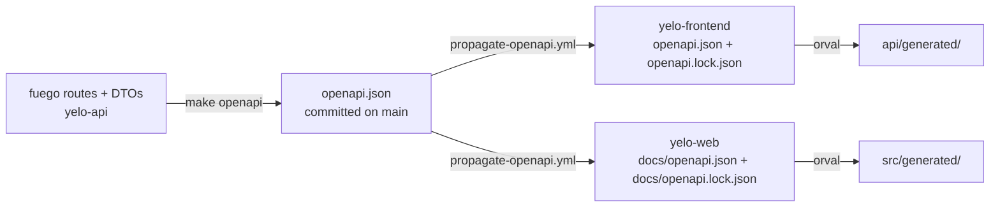

The API contract is a committed file, not something you download from a running server. `yelo-api` generates `openapi.json` from its route definitions. Each consumer pins an exact copy with a provenance lock and generates a typed client from it with Orval.



<Warning>
Never edit generated code by hand. That covers `yelo-api/openapi.json`, `yelo-frontend/api/generated/**`, `yelo-web/src/generated/**`, and the pinned spec copies. CI regenerates each one and fails if the result differs from what you committed. Change the Go handler or DTO instead, then regenerate.
</Warning>

## Generate the contract in yelo-api

The API uses fuego on top of chi. Fuego derives the OpenAPI document from typed route registrations, so the spec always reflects the handler signatures.

```bash
make openapi        # write openapi.json and print its SHA-256
make openapi-check  # fail if the committed openapi.json is stale
```

`make openapi` runs the `TestGenerateOpenAPIContract` test in `internal/server/http` with `OPENAPI_OUTPUT` set. The test:

1. Builds the router with stubbed dependencies, so it registers every route without a database, Redis, or provider credentials.
2. Rejects component schema names that do not match `^[a-zA-Z0-9._-]+$`.
3. Validates the document with kin-openapi.
4. Writes indented JSON with a trailing newline.

Because generation is environment-independent, the same commit always produces the same bytes. `make openapi-check` runs in the **Generated Code** CI job and in `make check`.

<Note>
`make openapi-download` fetches `/swagger/openapi.json` from a running local API into `bin/openapi.runtime.json`. Use it only for diagnostics. It is not the contract.
</Note>

See [API structure](/engineering/api/structure) for where route registration lives.

## Propagate the contract to consumers

`.github/workflows/propagate-openapi.yml` in `yelo-api` keeps both consumers current. It runs when:

- `openapi.json` changes on `main`
- a consumer sends a `reconcile-openapi-consumers` repository dispatch
- the hourly schedule fires (minute 17), as a fallback for missed events
- someone dispatches it manually

For each consumer, the workflow compares the SHA-256 of the API's `openapi.json` with `source.sha256` in the consumer's lock file. When they differ, it checks out the consumer, runs `make openapi orval` with `YELO_API_DIR` pointing at the API checkout, and opens or updates a pull request.

| Consumer | Lock file | Paths committed by the bot |
| --- | --- | --- |
| `yelo-frontend` | `openapi.lock.json` | `openapi.json`, `openapi.lock.json`, `api/generated` |
| `yelo-web` | `docs/openapi.lock.json` | `docs/openapi.json`, `docs/openapi.lock.json`, `src/generated` |

The bot always uses the branch `automation/update-openapi-contract`, so a newer contract replaces an older unmerged one. Pull requests are titled `chore(api): update OpenAPI contract to <short-sha>`. Commits are signed through a GitHub App, and the workflow fails unless GitHub reports them as verified. The App credentials come from the `OPENAPI_BOT_CLIENT_ID` variable and the `OPENAPI_BOT_PRIVATE_KEY` secret.

Review the bot pull request like any other change. It is the moment a breaking contract change reaches the clients, so CI in the consumer repo will show type errors in code that uses a changed endpoint.

## The lock file

Both consumers pin the contract with the same format:

```json
{
  "schemaVersion": 1,
  "source": {
    "repository": "rideyelo/yelo-api",
    "commit": "<full yelo-api commit SHA>",
    "path": "openapi.json",
    "sha256": "<SHA-256 of the pinned spec>"
  },
  "generator": {
    "name": "orval",
    "version": "<orval version from package.json>",
    "config": "orval.config.ts"
  }
}
```

The lock records which API commit the client came from and which Orval version generated it. An Orval upgrade without regenerating fails the lock check.

## Consumer scripts and targets

Both repositories expose the same Make targets:

| Target | What it does |
| --- | --- |
| `make openapi` | Run `scripts/sync-openapi.sh`: copy `openapi.json` from the paired `yelo-api` commit and rewrite the lock |
| `make openapi-lock-check` | Run `scripts/check-openapi-lock.sh`: verify the spec parses, its hash matches the lock, and the Orval version matches `package.json` |
| `make orval` | Run `orval --config orval.config.ts --clean --fail-on-warnings` |
| `make api-check` | `openapi-lock-check`, then `orval`, then `git diff --exit-code` on the spec, lock, and generated directory |
| `make api` | Mobile only. `openapi` then `orval` |

`sync-openapi.sh` reads the spec with `git show <commit>:openapi.json` from your `yelo-api` checkout. It uses `HEAD` of that checkout by default. `yelo-web` also accepts `YELO_API_COMMIT` to pin a specific commit.

<Warning>
The sync script reads committed content, not your working tree. If you change an API handler locally, run `make openapi` in `yelo-api` and commit `openapi.json` on your branch before you sync a client. Otherwise the script copies the old contract or fails because the commit has no `openapi.json`.
</Warning>

`make api-check` is the first step of mobile CI and the `api-contract` dependency of every web quality target.

## Orval configuration

<Tabs>
  <Tab title="yelo-web">
    `yelo-web/orval.config.ts` defines four independent clients so each site only bundles what it calls:

    | Client | Input filter | Output | Style |
    | --- | --- | --- | --- |
    | `dashboard` | Every tag except `Auth v3` | `src/generated/dashboard/{endpoints,models}` | React Query + axios, tags-split |
    | `event` | `public/events`, `Public Events` | `src/generated/event/...` | React Query + axios, tags-split |
    | `signup` | `authv2`, `AuthV2`, `tips`, `Tipping`, `user`, `User`, with Auth v3 operations removed | `src/generated/signup/...` | React Query + axios, tags-split |
    | `authV3` | `Auth v3`, without the Apple and Google OAuth callback paths | `src/generated/auth-v3/client/endpoints.ts` | Plain `fetch`, single file |

    The axios clients use the `customInstance` mutator in `src/lib/api-client.ts`, which resolves the base URL. The Auth v3 client uses `authV3Fetch` in `src/sites/signup/auth-v3/authV3Fetch.ts`.

    `docs/**` is listed in `.nxignore`, so a contract change alone does not mark every site as affected. Nx rebuilds only the sites whose imported generated files actually changed.
  </Tab>
  <Tab title="yelo-frontend">
    `yelo-frontend/orval.config.ts` defines one client, `yelo`:

    - Input: `./openapi.json`, excluding the `Auth v3`, `Dashboard`, and `System` tags.
    - Output: tags-split React Query hooks in `api/generated/endpoints` and models in `api/generated/models`.
    - Mutator: `customInstance` in `api/axios.ts`.
    - Options: `useTypeOverInterfaces` (Orval emits invalid syntax for nullable object interfaces), `formData`, and `useDates`.

    After generation, `make orval` strips trailing whitespace from every generated file. Hand-written wrappers around generated hooks live in `api/helpers/`. Auth v3 has its own hand-written client in `lib/auth/`.
  </Tab>
</Tabs>

## When the API contract changes

For a worked recipe, see [Change the API contract](/engineering/cookbook/change-the-api-contract).

<Steps>
  <Step title="Change the API and regenerate">
    Edit the handler, request, or response type in `yelo-api`. Run `make openapi` and commit `openapi.json` with your change. `make check` fails if you forget.
  </Step>
  <Step title="Build client changes against your branch">
    In the consumer repo, run `make openapi orval` (web) or `make api` (mobile) while your `yelo-api` checkout is on the API branch. Commit the spec, lock, and generated files along with the client code that uses them.
  </Step>
  <Step title="Merge the API first">
    Merge and release the API before you merge client code that depends on it. The mobile app can't call an endpoint that production does not serve yet.
  </Step>
  <Step title="Reconcile with the bot pull request">
    After the API merges, the propagation workflow opens `automation/update-openapi-contract` in each consumer. If you already merged an equivalent client update, the hashes match and the workflow skips that consumer.
  </Step>
</Steps>

<Note>
Additive changes, such as new endpoints or new optional fields, are safe for shipped mobile builds. Removing or renaming fields breaks installed app versions that still read them. Keep old fields until those builds age out. See [mobile releases](/engineering/mobile/releases).
</Note>
