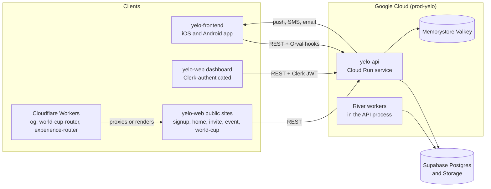

Yelo is built from three repositories in the `rideyelo` GitHub organization. Use this page to orient yourself before you work in any of them, then follow the cards at the bottom into the repo-specific sections.

| Repository | Stack | Audience | Runs on |
| --- | --- | --- | --- |
| `yelo-api` | Go, chi + fuego, PostgreSQL (Supabase) via pgx + sqlc, Redis/Valkey, River | Every client | Cloud Run (`prod-yelo`, `us-central1`) |
| `yelo-web` | React 19, Vite 8, Nx, Tailwind v4, shadcn/ui, Clerk | Admins and fleet staff (dashboard), public visitors (signup, home, invite, and other sites) | Firebase Hosting, plus Cloudflare Workers for edge routes |
| `yelo-frontend` | Expo SDK 57, React Native 0.86, Expo Router, TanStack Query, Zustand | Riders and drivers | App Store, Google Play, EAS Update (OTA) |

## How the pieces talk

All clients talk to the API over HTTPS and JSON. There is no shared database access from any client, and no client-to-client channel.

- The mobile app authenticates with Yelo-issued JWTs from the Auth v3 flow. The dashboard authenticates with Clerk. The API never matches identities across the two systems: dashboard actors use Clerk IDs, app accounts use Supabase user IDs.
- Both frontends consume the API through Orval-generated clients built from the API's committed `openapi.json`. See [OpenAPI and generated clients](/engineering/openapi-and-clients).
- Durable background work runs in River workers inside the API process, backed by the same Postgres database. See [background jobs](/engineering/api/background-jobs).

## External services

| Service | Used for | Used by |
| --- | --- | --- |
| Supabase | PostgreSQL database and object storage (public and private buckets) | API |
| Google Cloud | Cloud Run, Cloud Build, Artifact Registry, Secret Manager, Memorystore Valkey, Cloud Logging | API |
| Firebase Hosting | Static hosting for every `yelo-web` site (project `yelo-dashboard-v2`) | Web |
| Cloudflare Workers | OG image rendering and path routing on `rideyelo.com` and `joinyelo.com` | Web |
| Expo / EAS | Native builds, store submission, OTA updates, push delivery | Mobile, API (push) |
| Clerk | Dashboard authentication and roles | Web, API |
| Stripe | Payments, Connect payouts, webhooks | API, mobile |
| Twilio | SMS and Twilio Verify for OTP | API |
| Photon | iMessage delivery for bump texts, with SMS fallback | API |
| Resend | All transactional email, including OTPs, and contact sync | API |
| Quo | Contact sync and dashboard CRM reads | API |
| Dub | Referral and share links | API, mobile, web |
| Google Maps and Mapbox | Places, geocoding, routing, map rendering | API, mobile, web |
| StudID | Post-login student verification | API |
| Google Calendar | Fleet operating hours import | API |
| Sentry | Error tracking | API, web dashboard, mobile |
| PostHog | Product analytics, session replay, business metrics | API, mobile, signup Auth v3 |
| Grafana Cloud | OTLP trace ingestion in production | API |
| Slack | Deploy notifications and operational alerts | CI, API |

See [integrations](/engineering/api/integrations) for how the API wraps each provider.

## Environments

Yelo does not run a separate staging API. There is one production backend, an isolated E2E backend, and whatever you run locally.

| Environment | API | Database | Who uses it |
| --- | --- | --- | --- |
| Local (`ENVIRONMENT=dev`) | `make run` on port 8080 | Whatever `DSN` in your `.env` points at | You |
| E2E (`ENVIRONMENT=e2e`) | Cloud Run service `yelo-api-e2e` | Isolated `yelo_e2e` database in a separate Supabase project | Mobile E2E builds and the `maestro` evidence site |
| Production | Cloud Run service `yelo-api-testflight`, served at `https://api.rideyelo.com` and `https://api.joinyelo.com` | Production Supabase project | All shipped clients |

<Warning>
Several defaults point at production. The web dev server proxies `/api` to `https://api.rideyelo.com` unless you set `VITE_API_PROXY_TARGET`. The mobile `make sims` and `make asims` targets also use the production API. Any create or update action you take in those modes changes real data.
</Warning>

"Staging" in this codebase means release channels, not a backend:

- **Mobile**: the EAS `staging` build profile and OTA branch. Staging builds and staged OTA bundles still call the production API.
- **Web**: `yelo-web` deploys straight to production on every `main` push. The `home` site also gets a seven-day Firebase preview channel for each pull request.

See [deployment](/engineering/deployment) for the full pipeline per repo.

## Hard constraints

Keep these in mind when you scope a feature. Each one is enforced by code or infrastructure, not just convention.

<CardGroup cols={2}>
  <Card title="Realtime is polling plus push hints" icon="rotate">
    The API exposes no WebSocket or SSE endpoints. Clients poll REST endpoints with TanStack Query. On mobile, `/user/status` and `/community/current` are polled only in `providers/QueryPollers.tsx`. Push notifications carry a `data.type` that invalidates cached queries, but state always comes from the API.
  </Card>
  <Card title="Durable jobs use River" icon="list-check">
    Background work that must survive a restart runs as River jobs in Postgres. Workers run inside the API process, so there is no separate worker service to deploy. The API is capped at two Cloud Run instances to stay within Supabase connection limits.
  </Card>
  <Card title="OTA versus native builds" icon="mobile">
    JavaScript, styles, and pure-JS dependencies ship over the air. Changes to `package.json`, the lockfile, `app.json` or `app.config.ts`, `eas.json`, `patches/`, or native modules need a store build. Keep them in their own pull request.
  </Card>
  <Card title="The API contract is committed" icon="file-code">
    The API generates `openapi.json` from route types without starting the server. Consumers pin it with a SHA-256 lock file and never hand-edit generated clients.
  </Card>
  <Card title="Migrations are forward-only in production" icon="database">
    Applied migration files are immutable. Releases run migrations before the new revision takes traffic. A rollback only routes traffic to a schema-compatible revision. Down migrations never run automatically.
  </Card>
  <Card title="Persisted keys are a device contract" icon="key">
    Never rename an existing AsyncStorage or SecureStore key in the mobile app. Installed builds read those keys after an OTA update.
  </Card>
</CardGroup>

## Where to go next

<CardGroup cols={3}>
  <Card title="API" icon="server" href="/engineering/api/structure">
    Package layout, request lifecycle, auth, data layer, jobs, and configuration.
  </Card>
  <Card title="Web" icon="globe" href="/engineering/web/multisite">
    How one Vite project builds seven independently deployed sites, and how the dashboard is built.
  </Card>
  <Card title="Mobile" icon="mobile-screen" href="/engineering/mobile/architecture">
    App architecture, navigation, and the store and OTA release process.
  </Card>
</CardGroup>

<CardGroup cols={2}>
  <Card title="Local development" icon="laptop-code" href="/engineering/local-development">
    Set up and run each repo, and choose which API your clients call.
  </Card>
  <Card title="Contributing" icon="code-pull-request" href="/engineering/contributing">
    Branches, commit subjects, pull requests, and the checks you run before you push.
  </Card>
</CardGroup>
