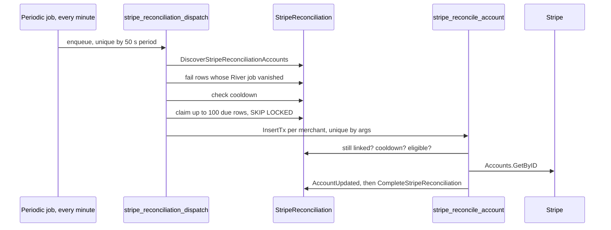

Drivers and payout-managing fleets each get a Stripe Connect **Express** account on the Yelo platform. This page covers how those accounts are created, how onboarding links are issued and refreshed, and how Yelo decides an account is ready to receive money. For the product view, see [Driver onboarding](/concepts/driver-onboarding) and [Fleets](/concepts/fleets).

## Account creation parameters

| Field | Driver (`CreateExpressAccount`) | Fleet (`CreateFleetExpressAccount`) |
| --- | --- | --- |
| `type` | `express` | `express` |
| `country` | `US` | `US` |
| `business_type` | `individual` | `company` |
| Capabilities | `card_payments`, `transfers` requested | Same |
| `business_profile.name` | Trimmed first and last name | Fleet name |
| `business_profile.product_description` | `Yelo Driver` | `Yelo Fleet - {name}` |
| `business_profile.url` | `YELO_WEBSITE_URL` | Same |
| Prefill | `individual.first_name`, `last_name`, and `email` and `phone` when set. Top-level `email` when set | `company.name` |
| Payout schedule | `daily` | Stripe default |

Neither call sends an idempotency key or metadata linking the account back to a Yelo ID. The only link is the `stripe_merchant_id` column.

## Driver onboarding

<Steps>
  <Step title="Request a link">
    The mobile driver signup hub (`app/(app)/driver-signup/1-hub.tsx`) and the Stripe step (`6-stripe.tsx`) call `GET /stripeaccount/onboarding-link` when `payout_source` is `personal_stripe`. The hub prefetches it to warm the cache.
  </Step>
  <Step title="Create the account if missing">
    `StripeAccountService.GetOnboardingLink` creates an Express account only when `Users.stripe_merchant_id` is blank. Before creating, `validateExpressAccountUser` requires a completed profile, and a verified phone when `driverVerifiedPhoneRequired` is on. The new ID is saved with `SetStripeMerchantId`.
  </Step>
  <Step title="Mint a reauth JWT">
    `jwt.GetJWToken(userID, ["user"], communityID, 24)` creates a 24-hour token.
  </Step>
  <Step title="Create the account link">
    `AccountLinks.New` with `type=account_onboarding`, `collection_options.fields=eventually_due`, `return_url = STRIPE_RETURN_URL`, and `refresh_url = {API_URL}/stripe-reauth/onboarding?jwt={token}`.
  </Step>
  <Step title="Open Stripe">
    The app opens the URL with `Linking.openURL`. On return it refetches `GET /driver/signup-status` on screen focus and when the app becomes active.
  </Step>
</Steps>

### Reauth links

Stripe account links are single-use and expire quickly. When a driver opens an expired or used link, Stripe redirects to the `refresh_url`:

1. `GET /stripe-reauth/onboarding?jwt=...` is unauthenticated. `ReauthOnboardingLink` requires the `jwt` query parameter and extracts the user ID with `jwt.GetUserIDFromToken`.
2. It calls the same `GetOnboardingLink`, which mints a new JWT and a new account link.
3. It responds `303 See Other` to the new Stripe URL.

The embedded JWT is valid for 24 hours, so a refresh link from the previous day fails with a token error.

### Login links

`GET /stripeaccount/login-link` fetches the account and returns "Payment Setup Incomplete" unless `details_submitted` is true. Otherwise it returns an Express dashboard login link. Mobile uses it in `components/driver-earnings/StripeLinkButton.tsx` and `components/drive/FullScreenFadeOverlay.tsx`.

## Fleet accounts

Fleet accounts are managed from the dashboard. All three routes live under `/communities/{id}/fleets/{fleet_id}/stripe/` in the dashboard API.

| Action | Route | Service | Behavior |
| --- | --- | --- | --- |
| Create fleet | Fleet create | `DashboardService.setupStripeForCloneOrNew` | `fleet_merchant` fleets get a new account and link, `stripe_status = pending`, `is_active = false`. Other models get `stripe_status = not_required`, `is_active = true` |
| Clone fleet | Fleet create with `source_fleet_id` | Same | Reuses the source fleet's `stripe_merchant_id` and `stripe_status`. `is_active` copies whether the source is `complete` |
| Refresh link | `POST .../refresh-link` | `RefreshStripeOnboardingLink` | New account link, stored in `stripe_onboarding_url`. Status unchanged |
| Relink | `POST .../unlink` | `UnlinkStripe` | Deletes the old account if no other fleet shares it, creates a new one, sets `stripe_status = pending` |
| Status | `GET .../status` | `GetFleetStripeStatus` | Live read: `payouts_enabled`, `charges_enabled`, requirements, `disabled_reason`, and a login link when details are submitted |

Fleet links use `refresh_url = STRIPE_RETURN_URL?fleet={fleetID}` and `return_url = STRIPE_RETURN_URL`. There's no fleet reauth endpoint, so an expired fleet link sends the admin to the marketing site. Use **Refresh link** in the dashboard instead.

Compensation on failure:

- Link creation fails after account creation: the new account is deleted.
- `CreateFleet` DB insert fails: the new account is deleted.
- `UnlinkStripe` merchant update fails: the new account is deleted.
- The old account is deleted **before** the new one is created. If creation then fails, the fleet still points at a deleted account.

## Status model

Three code paths compute a status from a Stripe account, with the same rules:

| Condition, checked in order | Status |
| --- | --- |
| `requirements.past_due` or `requirements.currently_due` non-empty | `restricted` |
| `payouts_enabled` is false | `pending` |
| Otherwise | `complete` |

`eventually_due` requirements and `charges_enabled` are ignored. A driver whose card payments capability is disabled but whose payouts are enabled reads as `complete`.

| Writer | Trigger | Writes | Side effects |
| --- | --- | --- | --- |
| `PaymentService.AccountUpdated` | `account.updated` webhook | Fleet `stripe_status`, or `DriverApplications.stripe_status` | Fleet activation and driver reconciliation on `complete`. Slack alert for drivers on `complete` |
| `PaymentService.reconcileAccount` | `stripe_reconcile_account` job | Same | Same, but with `WithReconciliation`, which suppresses the Slack alert |
| `DriverService.GetSignupStatus` | `GET /driver/signup-status` for self-onboarding drivers | `DriverApplications.stripe_status` | May call `ActivateDriver` when every step is complete |

`GetSignupStatus` skips Stripe entirely when the driver has a `PayoutFleetID`, and reports fleet-managed payouts instead.

### What each status unlocks

- A driver's Stripe step must be `complete` for the application to be complete, and `ActivateDriver` only runs then.
- A fleet is payout-ready (`Fleet.IsDriverPayoutReady`) only when it's active, uses `fleet_merchant`, has custom payouts, and has `stripe_status = complete`.
- `restricted` doesn't deactivate a fleet. `is_active` stays true, but the fleet stops being payout-ready.

## Daily reconciliation

Webhooks can be missed, so a River job re-reads every connected account about once a day.

| Setting | Value |
| --- | --- |
| Queue | `stripe_reconciliation`, 1 worker |
| Dispatch | Every minute, `RunOnStart`, disabled by `STRIPE_RECONCILIATION_ENABLED=false` |
| Discovery | Non-deleted users and non-deleted fleets with a non-blank `stripe_merchant_id` |
| Batch | 100 due accounts per dispatch, oldest `next_due_at` first |
| Job timeout | 1 minute |
| Max attempts | 12 |
| Backoff | `min(6h, 15s × 2^min(attempt, 11))` |
| Next due after success | 24 hours |
| Next due after failure | 24 hours, or 7 days for `stripe_account_invalid` |

### Failure classification

`stripeReconciliationFailure` inspects the Stripe error:

| Stripe response | Outcome |
| --- | --- |
| 429 | Global cooldown of at least 1 minute, or `Retry-After` if longer. Job snoozed |
| 401, 403 | Global cooldown of at least 15 minutes. Job snoozed |
| 400, 404 | Permanent: status `failed`, category `stripe_account_invalid`. Job canceled |
| Other | Returned to River for retry |
| No owner left | Status `ineligible`, category `no_eligible_owner`. Job canceled |

The cooldown lives in the single-row `StripeReconciliationControl` table, and `SetStripeReconciliationCooldown` only extends it. Both dispatch and workers honor it.

Each dispatch logs a coverage line with `discovered`, `succeeded_last_day`, `failed`, `pending`, `ineligible`, `invalid`, `overdue`, and `oldest_reconciled_at`. It's a warning, at most once an hour, when anything is failed or overdue by more than 25 hours.

## Where this lives in code

| Concern | Location |
| --- | --- |
| Account create and links | `yelo-api/internal/data/stripe/account.go` |
| Driver onboarding and login links | `yelo-api/internal/service/stripeaccount/stripeaccount.go`, `yelo-api/internal/server/http/stripeaccount/` |
| Fleet accounts | `yelo-api/internal/service/dashboard/fleet.go` (`setupStripeForCloneOrNew`, `RefreshStripeOnboardingLink`, `UnlinkStripe`, `cleanupOrphanedStripeAccount`, `GetFleetStripeStatus`) |
| Fleet routes | `yelo-api/internal/server/http/community/community_router.go` |
| Status mapping and webhook side effects | `yelo-api/internal/service/payment/payment.go` (`AccountUpdated`, `getDriverStripeAccountStatus`) |
| Live status refresh | `yelo-api/internal/service/driver/driver.go` (`GetSignupStatus`) |
| Reconciliation | `yelo-api/internal/service/payment/reconciliation_jobs.go`, `yelo-api/internal/data/repository/queries/stripe_reconciliation.sql`, `yelo-api/migrations/000304_stripe_reconciliation.up.sql` |
| Scheduling | `yelo-api/internal/notify/queue/queue.go` |
| Mobile | `yelo-frontend/app/(app)/driver-signup/6-stripe.tsx`, `1-hub.tsx`, `yelo-frontend/components/driver-earnings/StripeLinkButton.tsx` |

## Gotchas and edge cases

- **Duplicate driver accounts.** `GetOnboardingLink` checks and creates without a lock. Two concurrent calls for a driver without an account can create two Express accounts. The hub prefetch and the Stripe step can both fire, and the reauth endpoint can race with them. The loser is orphaned in Stripe.
- **JWT in a URL.** The refresh URL carries a 24-hour user JWT as a query parameter, so it can appear in Stripe logs, browser history, and proxy logs.
- **Deleting a live fleet account.** `UnlinkStripe` deletes the old Express account while rides may still hold uncaptured PaymentIntents on it, and while QR payment links still point at it. Those holds can't be captured afterward.
- **Shared accounts.** Cloned fleets share one account. `account.updated` updates every non-deleted fleet with that ID, and unlinking one clone leaves the account alive for the others.
- **Unknown accounts fail the webhook.** An `account.updated` for an account that belongs to no active fleet and no user returns 500, so Stripe retries it.
- **Nil requirements.** `GetSignupStatus` reads `stripeUser.Requirements.PastDue` without a nil check, unlike the webhook path.
- **Reconciliation doesn't create.** It only reads accounts Yelo already stores. Orphaned accounts in Stripe are never discovered.
