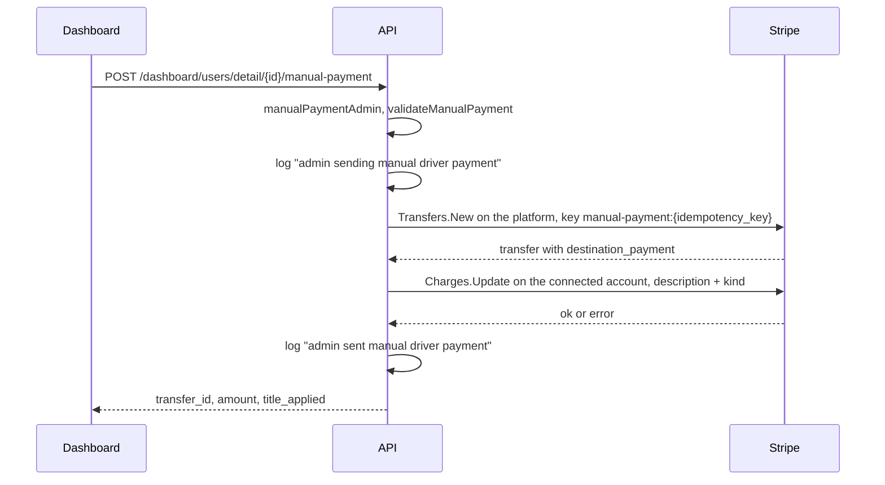

The driver earnings hub reads live data from the driver's Stripe Express account. Yelo stores almost none of it. This page covers how each endpoint maps Stripe data, the fee and idempotency rules for instant payouts, and the background job that copies Stripe fees onto rides. The endpoint list is in [Tips and earnings](/concepts/tips-and-earnings#driver-earnings).

## Account resolution

Every earnings method starts with `Service.getMerchantID`:

1. If the dev override is set, return it. `earningsOverrideForEnv` only passes `EARNINGS_DEV_OVERRIDE_MERCHANT_ID` through when `ENVIRONMENT` is `dev`, `development`, `local`, or `test`. The service logs `DEV OVERRIDE ACTIVE` at startup when it's in effect.
2. Otherwise read `Users.stripe_merchant_id`. Blank returns an input error: "Earnings unavailable. Finish setting up your driver payouts before viewing earnings."

<Note>
Only the driver's **own** account is read. Rides paid to a fleet account with custom payouts never appear in balances or payouts, but they do count in the weekly headline, which comes from the database. See [Weekly headline](#weekly-headline).
</Note>

## Balance and external account

| Endpoint | Stripe call | Mapping |
| --- | --- | --- |
| `GET /earnings/balance` | `Balance.Get` | `available`, `pending`, `instant_available` take the **first** entry of each Stripe array (`primaryAmount`). An empty array reads as 0 `usd`. `uncaptured` and `uncaptured_rides` come from Postgres, not Stripe |
| `GET /earnings/external-account` | `Accounts.GetByID` | `pickDefaultExternalAccount` returns the first entry with `default_for_currency`, else the first bank or card. None returns 404 |

`uncaptured` is the net earnings, in cents, of the driver's completed rides on this account whose fare is authorized but not captured (`ListDriverUncapturedRides`). `uncaptured_rides` is their count. Neither is part of Stripe's balance, and neither can be paid out, so clients label them as pending and estimated. A failed lookup is logged and reads as 0. See [Pending rides](/engineering/domains/driver-earnings-and-activity#pending-uncaptured-rides).

`InstantEligible` on the external account is true when Stripe's `available_payout_methods` includes `instant`, for both bank accounts and debit cards.

## Instant payouts

### Quote

`GET /earnings/payouts/instant-quote` (`GetInstantQuote`) makes two Stripe calls, balance and account, then:

```go
fee := int64(math.Ceil(float64(amount) * 0.01)) // instantFeePct
fee = max(fee, 50)                               // instantFeeMinCents
fee = min(fee, amount)
net := amount - fee
```

These constants mirror Stripe's standard Instant Payout pricing. They're display-only: Yelo doesn't charge the fee, Stripe deducts it. If the platform's negotiated pricing changes, update `instantFeePct` and `instantFeeMinCents` in `internal/service/earnings/earnings.go`.

Eligibility is evaluated in this order (`applyInstantEligibility`):

| Condition | `ineligible_reason` |
| --- | --- |
| No external account | `no external account on file` |
| Account doesn't support instant | `your bank doesn't support Instant Payouts` |
| Instant balance at most 0 | `no instantly-available balance` |
| Instant balance at most $0.50 | `balance is below the instant cash-out minimum` |
| Otherwise | eligible |

### Cash out

`POST /earnings/payouts/instant` with body `amount` in cents (`gte=0`). `createPayout`:

1. Rejects a negative amount.
2. Reads the balance and picks `instant_available`.
3. Returns "Nothing to cash out" when the bucket is at most 0.
4. Uses the full bucket when `amount` is 0 or exceeds it.
5. Calls `Payouts.New` with `method=instant`, the explicit amount, the bucket's currency, and description `Yelo instant cash-out`.

The server doesn't re-check the quote's eligibility rules. An ineligible request goes to Stripe, which returns its own error.

### Idempotency

`payoutIdempotencyKey` builds:

```text
payout:{connectedAccountID}:{method}:{amountCents}:{unixMinuteBucket}
```

The bucket is `time.Now().UTC().Truncate(time.Minute)`. Two identical taps in the same UTC minute share a key, and Stripe returns the first payout. Taps that straddle a minute boundary get different keys, but the second one usually fails because the instant balance is already spent.

Because the amount is resolved from the live balance before the key is built, a "cash out everything" retry after new funds arrive uses a different amount and a different key.

## Payout schedule

`GET /earnings/payout-schedule` maps `settings.payouts.schedule`. A missing schedule reads as `daily`. `next_payout_at` is Yelo's estimate from `computeNextPayoutAt`, not Stripe's:

| Interval | Estimate |
| --- | --- |
| `daily` | Next weekday after today |
| `weekly` | Next occurrence of the anchor, never today. Unknown anchors default to Friday |
| `monthly` | Next occurrence of `monthly_anchor`, default day 1 |
| `manual` | None |

`PUT /earnings/payout-schedule` validates `interval` as `daily`, `weekly`, `monthly`, or `manual`, and `weekly_anchor` as a weekday name. `weekly` with no anchor sends `friday`. The call is `Accounts.Update` on the connected account. It fires an `account.updated` webhook, which re-runs the status mapping on [Connect accounts](/engineering/payments/connect-accounts).

The estimate ignores `delay_days`, holidays, and the time of day Stripe runs payouts.

## Payouts list

`GET /earnings/payouts` calls `Payouts.List` with `limit` (default 25, max 100, `normalizeLimit`) and `starting_after = cursor`. `next_cursor` is the last payout's ID when `has_more`. Each payout maps status, method, failure code and message, arrival date, and the destination bank name or card brand with last 4.

## Activity feed

`GET /earnings/activity` accepts `from`, `to`, `limit`, and `cursor`. It calls `BalanceTransactions.List` with `expand[]=data.source`, so each charge carries its PaymentIntent.

<Steps>
  <Step title="Classify">
    `classifyTransactionType` maps `charge` and `payment` to charge or payment, `payout`, `payout_cancel`, and `payout_failure` to payout, three refund types to refund, `adjustment` to adjustment, `application_fee` and `stripe_fee` to fee, and everything else to other.
  </Step>
  <Step title="Group">
    `buildActivityPage` groups rows by UTC date (`2006-01-02`) and sums `net` per day. It also computes a page-local week total and ride count.
  </Step>
  <Step title="Enrich">
    `enrichActivityWithRides` collects PaymentIntent IDs and runs `GetRideEarningsByPaymentIntents`, matching `Rides.payment_intent_id`. Matched rows get `ride_id`, `rider_name` (first name and last initial), `tip_amount` in cents, `gross` from `driver_payout`, and `earnings` from `ride_driver_earnings_cents`. Lookup failures leave bare rows.
  </Step>
  <Step title="Add pending rides">
    On the first page only, `addPendingRides` adds one `pending: true` row per uncaptured ride, keyed `pending_{rideID}`, and re-sorts groups and rows newest first.
  </Step>
  <Step title="Replace the headline">
    On the first page only (`cursor` empty), `weeklySummary` replaces the page-local totals.
  </Step>
</Steps>

### Weekly headline

`GetDriverWeekEarnings` sums net earnings (`ride_driver_earnings_cents`, gross less Stripe fees) and counts rows where:

- `driver_id` is the driver,
- `status` is `complete` or `pending_rider_rating`,
- `complete_time` is on or after Monday 00:00 UTC, and
- `driver_payout` is not null.

Canceled rides have `status = complete` too. A cancellation fee ride counts once its webhook sets `driver_payout`. A $0 cancellation leaves `driver_payout` null and doesn't count.

## Payout notifications

`payout.paid`, `payout.failed`, and `payout.canceled` on a connected account send the driver a push through `NotifyPayout`, deduplicated by `{eventType}:{eventID}`. See [Stripe webhooks](/engineering/payments/webhooks).

## Stripe fee estimates

Driver earnings subtract Stripe's processing fee per charge. Until Stripe reports the actual fee, Yelo uses an estimate of 2.9% + 30¢ (`stripe_fee_estimate_cents`) on the authorized amount. A tips-enabled ride authorizes fare + $5.00, so its fare charge is estimated on that total.

The payout writers snapshot the estimate when they write `driver_payout`:

| Writer | Column | Estimated on |
| --- | --- | --- |
| `CompleteRideForRating`, `CompleteRideTip`, `MarkRidePaymentSucceeded` | `estimated_stripe_fee_cents` | Fare, plus the $5.00 buffer when tips are enabled (`ride_fare_fee_estimate_cents`) |
| `RecordCompletedRideTip` | `estimated_tip_stripe_fee_cents` | The dedicated tip charge alone |
| Cancellation fee operation | `estimated_stripe_fee_cents` | The cancellation fee |

`ride_driver_earnings_cents` prefers the actual fee, then the stored estimate, then a live estimate. The full formula is on [Driver earnings and activity](/engineering/domains/driver-earnings-and-activity#net-earnings-after-stripe-fees).

## Stripe fee backfill

Drive history and every net earnings figure use the actual Stripe fee once it's known. Two River jobs fill `Rides.stripe_fee_cents` (fare charge) and `Rides.tip_stripe_fee_cents` (dedicated tip charge) from balance transactions:

| Job | Schedule | Queue | Work |
| --- | --- | --- | --- |
| `stripe_drive_fee_scan` | Every 10 minutes, `RunOnStart`, unique by 9-minute period | `stripe`, 2 workers | `GetDriversWithMissingStripeFees`: up to 100 driver and merchant pairs with rides that have a `payment_intent_id` and no `stripe_fee_cents`, or a `tip_payment_intent_id` with `tip_amount > 0` and no `tip_stripe_fee_cents`, and a due `stripe_fee_repair_after`. Enqueues one repair job per pair |
| `stripe_drive_fee_repair` | On demand | `stripe` | Pages balance transactions from `oldest missing request_time - 8 days`, 100 per page, up to 10 pages per run |

Each repair page runs `PersistStripeFees`, which maps `source.charge.payment_intent` to `fee`. It updates `stripe_fee_cents` on rides whose `payment_intent_id` matches, and `tip_stripe_fee_cents` on rides whose `tip_payment_intent_id` matches. For every charge where the actual fee differs from the stored estimate, the worker logs a warning with the message `Stripe fee differs from stored estimate` and these fields:

```json
{
  "event": "stripe_fee_estimate_mismatch",
  "ride_id": "8c1f0f6e-...",
  "payment_intent_id": "pi_...",
  "stripe_merchant_id": "acct_...",
  "tip_charge": false,
  "estimated_fee_cents": 79,
  "actual_fee_cents": 80,
  "difference_cents": 1
}
```

The actual fee is already stored and wins. A steady stream of these warnings means `stripe_fee_estimate_cents` needs its rate or rounding adjusted in a new migration. Then:

- No rides left missing: done.
- Stripe has no more pages: `DeferMissingStripeFeeRepair` sets `stripe_fee_repair_after = now + 24h` for the rest.
- 10 pages read and still missing: enqueue a continuation with the cursor, 1 second later, up to 25 attempts.

Jobs are unique by merchant, driver, and cursor across active states (`activeJobUniqueOpts`).

## Manual payments

A manual payment is a one-off transfer from the platform balance to a driver's own connected account, sent by an admin from the dashboard user detail sheet. It's the only code path that creates a Stripe transfer. Yelo writes no database row for it: the transfer, its metadata, and two log lines are the whole record.

### Routes and authorization

| Route | Handler | Purpose |
| --- | --- | --- |
| `GET /dashboard/users/manual-payments/fund-sources` | `GetManualPaymentFundSources` | Platform sub-balances a payment can draw from |
| `POST /dashboard/users/detail/{id}/manual-payment` | `SendManualPayment` | Send one payment to the driver in `{id}` |

Both sit on the `/dashboard/users` group, which `router.go` gates with `getRequireClerkRoleMiddleware(["admin"])`. Both service methods then call `manualPaymentAdmin`, which requires two things:

- Clerk role `admin`.
- `CanSendManualPayments` on the Clerk user context. `populateClerkUserContext` copies it from the `metadata.manual_payments` session claim.

Either one missing returns a forbidden error with the message `Manual payment permission required`. The grant is per person, and the admin role alone isn't enough. No API route writes `manual_payments`, so someone sets it on the user's Clerk public metadata directly. The dashboard mirrors the check in `useRole` (`canSendManualPayments`) to decide whether to show **Send payment**. See the [authorization matrix](/engineering/security/authorization-matrix#route-matrix).

### Fund sources

`GetManualPaymentFundSources` calls `GetPlatformBalance`, which is `Balance.Get` with no `Stripe-Account` header. It sums `available[].source_types` across the `usd` entries and always returns two rows, in this order:

| `source_type` | `currency` | `available` |
| --- | --- | --- |
| `card` | `usd` | Cents available in the platform's card sub-balance |
| `bank_account` | `usd` | Cents available in the platform's bank account sub-balance |

A source Stripe doesn't report reads as 0. The chosen `source_type` becomes the transfer's `source_type`. The server doesn't compare the amount with the available figure. The dashboard does, and Stripe rejects a transfer the sub-balance can't cover.

### Request and validation

The body carries `amount` in cents, `description`, `internal_note`, `source_type`, and `idempotency_key`. `SendManualPayment` trims the three strings, then `validateManualPayment` checks in this order:

| Field | Rule | Constant |
| --- | --- | --- |
| `amount` | Greater than 0, at most 50000 cents ($500.00) | `manualPaymentMaxCents` |
| `description` | Required, at most 40 characters | `manualPaymentMaxDescriptionLen` |
| `internal_note` | Required, at most 500 characters, Stripe's limit for a metadata value | `manualPaymentMaxNoteLen` |
| `source_type` | `card` or `bank_account` | `ManualPaymentSourceCard`, `ManualPaymentSourceBankAccount` |
| `idempotency_key` | Required, at most 100 bytes | `manualPaymentMaxKeyLen` |

The $500.00 cap is a constant, not configuration. The dashboard mirrors it as `MAX_MANUAL_PAYMENT_CENTS` in `ManualPaymentDialog.tsx`, so raise both together.

The destination is `Users.stripe_merchant_id`, read through `GetDriverApplicationDetails`. A driver with no account of their own gets "driver has no Stripe account of their own to pay". Fleet accounts are never a destination.

### Transfer



`CreateTransfer` calls `Transfers.New` on the platform account with the amount, `usd`, the driver's account as `destination`, `description`, and `source_type`. The transfer metadata is:

| Key | Value |
| --- | --- |
| `kind` | `manual_payment` (`models.ManualPaymentKind`) |
| `user_id` | The driver's Yelo user ID |
| `actor_id` | The admin's Clerk user ID |
| `internal_note` | The trimmed internal note. The driver never sees it |

The first log line is written before the Stripe call, so an attempt Stripe refuses, or one whose outcome is lost, still names who tried to pay whom. Both lines carry `actor_id`, `user_id`, `source_type`, and `amount`. The second adds `transfer_id`.

`stripeRefusal` turns a Stripe rejection of the request itself into a bad-request error that carries Stripe's message. That covers any Stripe error whose type isn't `api_error` and that has a message, such as insufficient funds or an idempotency key reused with different parameters. Those errors are input errors, so they don't count against the shared circuit breaker. Stripe-side faults and transport errors stay server errors.

### Idempotency

The Stripe idempotency key is:

```text
manual-payment:{idempotency_key}
```

The client picks `idempotency_key`. A retry with the same key and the same parameters returns the original transfer instead of paying twice. The dashboard generates a `crypto.randomUUID()` for each distinct combination of amount, title, note, and source, and keeps it across retries of that payment. On a 4xx it rotates the key, because nothing was sent and Stripe replays the refusal for the old key. On a timeout or 5xx it keeps the key, because the payment may have gone through.

### Title follow-up and `title_applied`

A transfer's own description stays on the platform. The driver's activity row reads the destination payment on the connected account, so the title needs a second call.

When the transfer has a `destination_payment`, `UpdateConnectedPayment` calls `Charges.Update` on the connected account. It sets the payment's `description` to the title and its metadata to `kind = manual_payment`.

The response is `transfer_id`, `amount`, and `title_applied`:

| Case | `title_applied` | Response |
| --- | --- | --- |
| Title call succeeded | `true` | 200 |
| Title call failed | `false` | 200. Warning log `manual payment sent but driver-facing title was not applied` with `actor_id`, `user_id`, and `transfer_id` |
| Transfer has no destination payment | `false` | 200. No title call and no warning |

A title failure never fails the request. The money has already moved, and an error would invite a second send. The dashboard shows a warning toast ending in "Do not send it again." See [Payout issues](/runbooks/payout-issues#manual-payment-problems).

### Driver activity

The payment reaches the driver as a balance transaction on their account, so it appears in `GET /earnings/activity` and in the Stripe balance. `mappers.go` treats it differently from a ride:

- `isManualPayment` is true when the transaction's expanded source charge has metadata `kind = manual_payment`.
- `mapBalanceTransaction` uses the source charge's `description` for a manual payment when it's set. Ride and tip rows keep the balance transaction's own description.
- `buildActivityPage` adds the net to the day's group total and to the page-local week total, but skips the page-local ride count.

The row has no ride PaymentIntent, so `enrichActivityWithRides` leaves it without `ride_id`, `rider_name`, or `earnings`. The mobile app titles a row with the rider name, then the description, then `Ride`, so a titled manual payment shows the admin's title.

The first-page headline comes from `Rides` (`GetDriverWeekEarnings`), so a manual payment doesn't count in it. If that query fails, the page-local totals stand in and the payment's net is included. The payment is part of the driver's Stripe balance either way.

When `title_applied` is false, the destination payment has neither the title nor the `kind` marker. The row then keeps the balance transaction's own description. It also counts in the page-local ride count when its type maps to `charge` or `payment`.

## Where this lives in code

| Concern | Location |
| --- | --- |
| Earnings service | `yelo-api/internal/service/earnings/earnings.go` |
| Mapping, fee, eligibility, schedule estimate | `yelo-api/internal/service/earnings/mappers.go` |
| Payout webhook | `yelo-api/internal/service/earnings/webhook.go` |
| Routes and request validation | `yelo-api/internal/server/http/earnings/` |
| Stripe balance and payout calls | `yelo-api/internal/data/stripe/payout.go` (`CreatePayout`, `payoutIdempotencyKey`, `ListBalanceTransactions`, `FeeByPaymentIntent`) |
| Dev override gate | `yelo-api/internal/service/service.go` (`earningsOverrideForEnv`) |
| Fee backfill jobs | `yelo-api/internal/service/user/drive_fee_jobs.go`, `yelo-api/internal/data/repository/queries/ride_history.sql` |
| Manual payment service and validation | `yelo-api/internal/service/dashboard/manual_payment.go`, `yelo-api/internal/models/manual_payment.go` |
| Manual payment routes | `yelo-api/internal/server/http/dashboard/users/routes.go`, `handler.go`, `yelo-api/internal/server/http/router.go` |
| Manual payment grant | `yelo-api/internal/server/http/clerk_middleware.go` (`ClerkCustomClaims`, `populateClerkUserContext`) |
| Transfer, platform balance, title call | `yelo-api/internal/data/stripe/transfer.go` (`CreateTransfer`, `GetPlatformBalance`, `UpdateConnectedPayment`, `stripeRefusal`) |
| Manual payment dialog | `yelo-web/src/components/users/ManualPaymentDialog.tsx`, `UserDetailSheet.tsx`, `yelo-web/src/hooks/useRole.ts` |
| Mobile hub | `yelo-frontend/app/(app)/driver-earnings/`, `yelo-frontend/hooks/driver-earnings/` (`useInstantCashOut`, `useUpdatePayoutSchedule`) |

## Gotchas and edge cases

- **Headline versus balance.** The weekly headline counts every ride the driver drove, including rides paid to a fleet account. The balance and activity only show the driver's own account.
- **Overwritten tips.** The headline is computed from `driver_payout`, which the fare webhook can reset after an over-buffer tip. See [Ride tip charging](/engineering/payments/ride-tips#races).
- **Dedicated tip charges.** Tip PaymentIntents aren't in `payment_intent_id`, so their activity rows aren't enriched. Their fees land in `tip_stripe_fee_cents`, not `stripe_fee_cents`.
- **Pending isn't payable.** `uncaptured` is an estimate from Postgres. The next payout and instant cash-out read only Stripe's buckets.
- **Never-resolving rides.** Rides whose hold was canceled have a `payment_intent_id` but no charge, so the fee backfill can't resolve them. They're deferred and rescanned every 24 hours indefinitely.
- **Multi-currency.** `primaryAmount` takes the first currency entry. A connected account holding a second currency would show only one.
- **Cached errors.** Stripe replays the first response for a reused idempotency key, including an error. A failed cash-out retried within the same minute returns the same failure.
- **Manual payments leave no Yelo row.** Find one through the transfer metadata in Stripe or the `admin sent manual driver payment` log line. Nothing in the API reverses a transfer.
- **An untitled manual payment looks like a ride.** With `title_applied` false, the activity row has no `kind` marker. A `charge` or `payment` row then counts in the page-local ride count.
- **Fleet accounts.** There's no earnings API for fleet accounts. Fleet admins use the Express dashboard login link from `GET .../stripe/status`.
