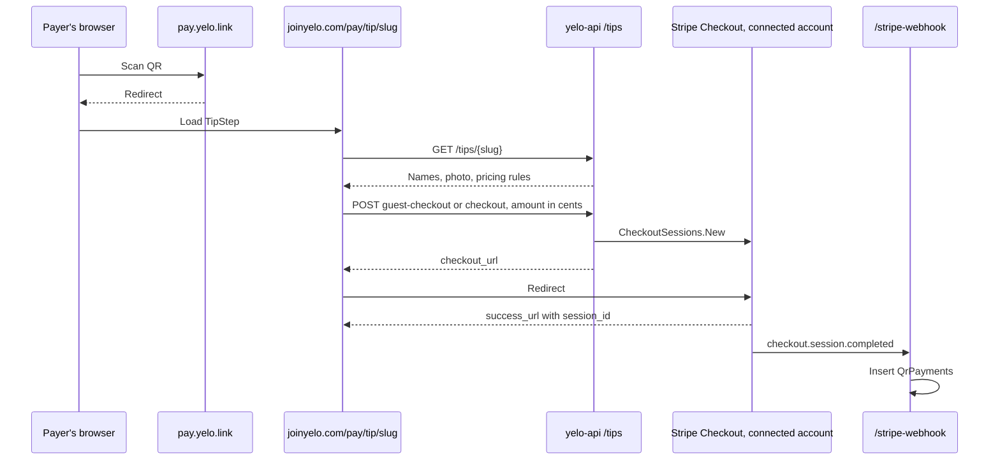

QR payments and driver tip links share one pipeline. A slug resolves to a payee, the API creates a Stripe Checkout Session on the payee's connected account, and the `checkout.session.completed` webhook records the payment. None of this touches rides.

For the admin view, see [QR payments](/dashboard/qr-payments). For the rider-facing summary, see [Tips and earnings](/concepts/tips-and-earnings#qr-tip-links).

## End-to-end flow

## Slug resolution

`TippingService.resolveTarget` in `internal/service/tipping/tipping.go` resolves in this order:

1. **QR config.** `GetActiveQrPaymentConfigBySlug` with the slug lowercased. A match returns the config.
2. **Driver referral code.** `GetAuthUserByReferralCode` with the slug as given, matching `referral_code` or `old_referral_code` exactly.
3. The driver must have `DriverApplicationStatus = complete` and not be banned or deleted. If the driver has an active fleet, the fleet must be active and not deleted.
4. Driver links get synthetic pricing: `custom`, min 100, max 50,000, preset 500 cents, product name `Driver tip`.

Anything else returns 404 "tip link not found".

A QR config slug shadows a driver's referral code with the same value.

## Payee resolution

`resolveMerchant` picks the connected account:

| Target | Account | Error when missing |
| --- | --- | --- |
| QR config | The config's fleet `stripe_merchant_id` | "this tip link is not ready to accept payments" |
| Driver in a fleet with `has_custom_payouts` and a merchant | The fleet's account | — |
| Other drivers | The driver's `stripe_merchant_id` | "this driver is not ready to accept tips" |

Neither path checks `stripe_status`. A payee whose account can't take charges yet fails inside Stripe during session creation.

## Amount validation

`validateAmount` works in cents:

- Every amount must be at least 50.
- `fixed`: must equal `fixed_amount` exactly.
- `custom`: must be between `custom_min` and `custom_max` inclusive.

The web client validates the same rules before posting, but the server is authoritative.

## Checkout Session parameters

`Client.CreateTipCheckoutSession` in `internal/data/stripe/checkout.go`:

| Parameter | Value |
| --- | --- |
| Account | The resolved payee, via `Stripe-Account` |
| `mode` | `payment` |
| `line_items` | One item, quantity 1, inline `price_data`: `usd`, `unit_amount` = amount, product name `Driver tip` for driver links or the config's `product_name` |
| `success_url` | `https://joinyelo.com/pay/tip/{slug}?status=success&checkout={guest or yelo}&session_id={CHECKOUT_SESSION_ID}` |
| `cancel_url` | `https://joinyelo.com/pay/tip/{slug}?status=canceled` |
| `customer_email` | Signed-in payer's email |
| `client_reference_id` | Signed-in payer's user ID |
| `metadata` and `payment_intent_data.metadata` | `yelo_user_id`, `customer_name`, `customer_phone`, `qr_config_id`, `recipient_driver_id`, `fleet_id`, each only when non-empty |

There's no idempotency key, no application fee, and no phone collection on the session. Each click creates a new session.

Attribution metadata:

- QR config: `qr_config_id` and `fleet_id` of the config's fleet.
- Driver link: `recipient_driver_id`, plus `fleet_id` whenever the driver has an active fleet, **even if the money goes to the driver's own account**.

## Endpoints and auth

| Endpoint | Auth | Handler | Extra work |
| --- | --- | --- | --- |
| `GET /tips/{slug}` | Public | `GetConfig` | Sets `Cache-Control: public, max-age=60, stale-while-revalidate=300` |
| `POST /tips/{slug}/guest-checkout` | Public | `CreateGuestCheckout` | None |
| `POST /tips/{slug}/visit` | Presignup JWT | `TrackVisit` | `SetAcquisitionSourceIfDefault(qr_payment)`, upsert into `QrTipVisits` |
| `POST /tips/{slug}/checkout` | Presignup JWT | `CreateCheckout` | Attaches the user's email, name, phone, and ID. Sets acquisition source. Records `checkout_started_at` and `stripe_checkout_session_id` in `QrTipVisits` |

The authenticated group uses `getValidatePresignupTokenMiddleware`, so it accepts signup-flow tokens. `requireUser` rejects tokens without a user ID with "Complete signup before tipping."

`QrTipVisits` is keyed by user and config, or user and recipient driver. Visits upsert `last_seen_at`. A second checkout overwrites `stripe_checkout_session_id`.

## Clients

<Tabs>
  <Tab title="Web signup site">
    `src/sites/signup/App.tsx` routes any path with a `tip/{slug}` segment:

    - `?status=success` renders `TipComplete` ("tip sent."). It doesn't verify the session with the API.
    - `?auth=complete` renders `TipStep` in signed-in mode, which calls `visit` and uses `checkout`.
    - Otherwise `TipStep` shows **tip with yelo**, which starts the Auth v3 web flow with intent `tip`, and **tip as guest**, which calls `guest-checkout`.

    `TipStep` reads an optional `?amount=` in cents and otherwise defaults to the fixed amount, the preset, or the minimum. Custom mode shows presets 500, 1000, 1500, and the config preset, filtered to the allowed range. A 401 from any call redirects into the Auth v3 flow.
  </Tab>
  <Tab title="Mobile app">
    `app/(app)/tip/[slug].tsx` opens `https://joinyelo.com/pay/tip/{slug}` in an in-app browser with `WebBrowser.openBrowserAsync`. The native app has no Checkout integration of its own.
  </Tab>
</Tabs>

## Recording the payment

`checkout.session.completed` runs `PaymentService.CheckoutSessionCompleted`. Field mapping, deduplication, and fallback attribution are covered in [Stripe webhooks](/engineering/payments/webhooks). The key rules:

- `fleet_id` comes from metadata first. Without it, the first non-deleted fleet with `stripe_merchant_id = event.account` is used.
- The row is inserted whatever the `payment_status`.
- Duplicate deliveries are dropped by the unique `stripe_session_id`.

The dashboard's **QR Payment History** and the **QR Payments** KPI read `QrPayments`, scoped by `fleet_id` for fleet managers.

## QR config Stripe objects

`QrPaymentService.CreateConfig` rejects a fleet that's archived, inactive, or has no `stripe_merchant_id`. It then creates these on the fleet's connected account:

1. `Products.New` with the product name.
2. `Prices.New`: `unit_amount` for fixed, or `custom_unit_amount` with `minimum`, `maximum`, `preset` for custom.
3. `PaymentLinks.New` with that price, quantity 1, and phone number collection enabled.
4. A Dub link on `pay.yelo.link/{slug}` pointing to `https://joinyelo.com/pay/tip/{slug}`. A Dub failure is logged and the config is saved without a short link.

If the config row isn't saved, a deferred `cleanupPaymentLink` deactivates the new payment link so it can't take money.

`UpdatePricing` rejects an inactive config and an archived or inactive fleet. It creates a new price and payment link, updates the Dub destination (a Dub failure aborts the update), and deactivates the old payment link. A failed deactivation aborts the update. The save is conditional on the stored `stripe_payment_link_id` still being the old one, so a concurrent edit fails with "QR payment config changed or is inactive; reload and retry". On any abort, the new payment link is deactivated.

`DeactivateConfig` deactivates the payment link on the fleet's current account, then sets `is_active = false` with the same conditional check. A Stripe failure aborts the deactivation. A config with a payment link on a fleet with no `stripe_merchant_id` is rejected with "restore the fleet Stripe account reference before deactivating its payment link".

Migration `000346_fleet_archive_reference_guards` adds a trigger that rejects inserting a config, activating it, or changing its payment link while its fleet is archived.

<Note>
The tip page never uses the stored Stripe price or payment link. Checkout Sessions use inline `price_data`, and amounts are validated against the config row. The Stripe Payment Link still works if someone has its `buy.stripe.com` URL. Its sessions arrive without Yelo metadata and are attributed by connected account only.
</Note>

## Where this lives in code

| Concern | Location |
| --- | --- |
| Slug and payee resolution, validation | `yelo-api/internal/service/tipping/tipping.go` |
| Routes and handlers | `yelo-api/internal/server/http/tipping/`, `yelo-api/internal/server/http/router.go` |
| Checkout Session | `yelo-api/internal/data/stripe/checkout.go` (`CreateTipCheckoutSession`) |
| QR configs | `yelo-api/internal/service/qrpayment/qrpayment.go`, `yelo-api/internal/server/http/dashboard/qrpayment/` |
| Stripe product, price, link | `yelo-api/internal/data/stripe/payment_link.go` |
| Webhook recording | `yelo-api/internal/service/payment/payment.go` (`CheckoutSessionCompleted`, `resolveCheckoutAttribution`) |
| SQL | `yelo-api/internal/data/repository/queries/education_commerce.sql` (`InsertQrPayment`, `GetActiveQrPaymentConfigBySlug`, `RecordQrTipVisit`, `RecordQrTipCheckout`) |
| Web page | `yelo-web/src/shared/signup/steps/TipStep.tsx`, `yelo-web/src/sites/signup/App.tsx` |
| Mobile | `yelo-frontend/app/(app)/tip/[slug].tsx` |

## Gotchas and edge cases

- **Fleet attribution for owner-operators.** A driver link for a driver in a fleet without custom payouts pays the driver's own account but writes `fleet_id` into metadata. The fleet then sees that tip in its QR history even though it never received the money.
- **Slug reuse.** `QrPaymentConfigs.slug` is unique across active and inactive configs, so a deactivated slug can't be recreated.
- **Case sensitivity.** Config slugs are lowercased before lookup. Referral codes are matched exactly as typed.
- **Success page trusts the URL.** Anyone can load `?status=success` and see "tip sent."
- **Deleted accounts.** If a fleet's account is replaced with **Unlink**, configs keep their old Stripe product and payment link IDs. New checkouts use the new account, but `UpdatePricing` tries to reuse the old product ID on the new account and fails. `DeactivateConfig` calls Stripe on the new account with the old payment link ID. Because a Stripe failure aborts it, such a config likely can't be deactivated from the dashboard.
- **Webhook failures.** A `QrPayments` insert failure returns 500 and Stripe retries. If the fleet lookup for attribution fails, the row is still inserted without `fleet_id`.
- **Phone numbers.** Checkout Sessions don't collect phones, so `customer_phone` is only present for signed-in payers, from metadata.
