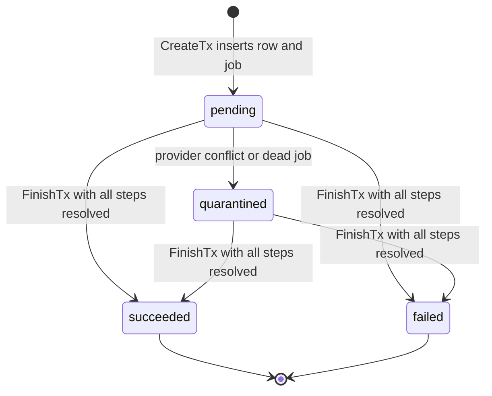

The ride operation journal is a second implementation of ride money movement that lives next to the live one. It records each financial command (accept, complete, cancel, tip) as a row before any Stripe call, then executes it from that row. This page explains the model and, more importantly, which parts of it actually run. For the tables, see [RideOperations](/reference/database/rides#rideoperations). For the flow that charges riders today, see [Ride PaymentIntent lifecycle](/engineering/payments/ride-payment-intents) and [Ride tip charging](/engineering/payments/ride-tips).

<Warning>
The journal does not process payments in production. `payment.NewRideOperations` is the only constructor that assembles it, and only integration tests call it. Read [What is live today](#what-is-live-today) before relying on anything else on this page.
</Warning>

## What is live today

Every claim in this section comes from tracing constructors and call sites in `yelo-api`.

### Not wired

| Piece | Evidence |
| --- | --- |
| `RideOperations` service | `NewRideOperations` in `internal/service/payment/ride_operations.go` has no caller outside `*_integration_test.go` files in the same package. Nothing in `cmd/` or `internal/service/ride` references it. |
| Every command entry point | `Accept`, `Complete`, `Cancel`, `QuoteCancellation`, `SettleTip`, `Tip`, `AbandonTip`, `PromoteIdle`, and the `*Legacy` adapters are methods on `RideOperations`. None has a non-test caller. |
| Journal writes | `RideOperationJournal.CreateTx` is the only writer of `RideOperations`. It is reached only through the command repositories that `NewRideOperations` builds. No production path inserts a row. |
| `ride_operation` worker | `RideOperations.RegisterWorkers` adds it. `internal/notify/queue/queue.go` (`New`) builds the River worker set and never calls `RegisterWorkers`. |
| `ride_operation_recovery` job | `RideOperationRecoveryJob()` has no caller. It is absent from the `PeriodicJobs` list in `queue.go`. |
| `ride_operations` queue | `queueConfigs` in `queue.go` does not define it. Only test River clients do. |
| `RideCancellationQuotes` writes | `InsertRideCancellationQuote` runs only from `RideCancellationCommands.SaveQuote`, which is part of the unwired service. The only other reference is cleanup in `internal/server/http/e2econtrol/ride_fixture.go`. |
| Journal Stripe methods | `CreateRideAuthorizationIntent`, `ConfirmRideAuthorization`, `InspectRideAuthorization`, `InspectExistingRideAuthorization`, `ExecuteRideCapture`, `ExecuteRideVoid`, `ExecuteRideClone`, `CreateRideTip`, `ConfirmRideTip`, `CancelRideTip`, and `InspectLegacyRideTip` are implemented on the real `stripe.Client` in `internal/data/stripe/ride_*.go`. Only the journal executors and the legacy tip adapter call them. |

The code says the same thing in comments. `RideOperationJournal` is "deliberately not wired into production service construction yet". `RegisterWorkers` must be called "only as part of the coordinated financial writer cutover". Migration `000339` opens with "Additive journal only".

### Wired and running

These pieces read or guard the journal tables in production. With no rows in `RideOperations`, each one is a no-op today.

| Piece | Where | Effect today |
| --- | --- | --- |
| Tables, triggers, and index | Migrations `000339_ride_operation_journal` and `000340_ride_cancellation_quotes` | The schema exists in every environment. The tables stay empty. |
| `Rides.payment_consent_at` | Migration `000340` adds and backfills it from `confirm_time` | `ConfirmRequestedRide` and `RequeueRideAfterDriverCancel` in `queries/ride_lifecycle.sql` also write it. |
| Ownership guard on live ride commands | `beginOwnedRideCommand` in `ride_command.go` and `finalizeRideRevisions` in `ride_revision.go` call `HasConflictingRideOperation` | Would reject a live lifecycle write with "Ride Unavailable" while another operation is `pending` or `quarantined`. Never blocks today. |
| Webhook wake-up | `PaymentService.PaymentIntentUpdated` in `internal/service/payment/payment.go` runs `WakeRidePaymentOperations` | Runs on six `payment_intent.*` event types. Updates zero `river_job` rows today. |
| Webhook payout fence | `MarkRidePaymentSucceeded` in `queries/ride_lifecycle.sql` has `NOT EXISTS (SELECT 1 FROM "RideOperations" ...)` | Would skip rides that have any operation row. Skips nothing today. |
| Snapshot flag | `GetRideSnapshotRows` in `queries/ride_snapshot.sql` computes `transition_pending` | Always `false` today. The mobile app reads it in `yelo-frontend/lib/ride/commandIdentity.ts`. |
| Admin silent-cancel block | `GetRideSilentCancellation` in `queries/ride_admin_cancel.sql` computes `has_operation` | The "A ride operation is unresolved" reason never triggers today. |
| `GET /ride/operations/{id}` | `registerOperationRoutes` in `internal/server/http/ride/operation_status.go` | Registered and authenticated. Returns 404 "ride operation not found" for every ID today. |

`GET /ride/operations/{id}` returns `id`, `ride_id`, `kind`, `state`, `lifecycle_revision`, and `assignment_generation` for an operation whose `actor_id` is the caller. It never returns inputs, step receipts, or client secrets. System-owned operations have a null `actor_id`, so no user can read them. The generated clients in `yelo-frontend` and `yelo-web` include the endpoint, and no hand-written code in either repo calls it.

## Reserve, then execute

Every command runs in two phases. `RideOperations.Complete` shows the shape:

```go
if _, err := s.completion.Reserve(ctx, command); err != nil { ... }
return s.worker.completion.Execute(ctx, command.ID)
```

<Steps>
  <Step title="Reserve">
    The command repository opens `beginOwnedRideCommand`, which takes the ride command locks described in [Matching concurrency](/engineering/matching/concurrency). It validates the ride status and the caller's `lifecycle_revision` and `assignment_generation`. It then freezes the financial decision (fare cents, PaymentIntent ID, connected account, currency) into `inputs` and calls `CreateTx`. `CreateTx` inserts the `RideOperations` row and a `ride_operation` River job in the same transaction. No Stripe call happens here.
  </Step>
  <Step title="Execute steps">
    The executor loads the row by ID and performs provider calls one step at a time. Each step commits its exact request to `RideOperationSteps` before calling Stripe, and commits the verified receipt afterwards. No transaction or ride lock is held during a Stripe call.
  </Step>
  <Step title="Finalize">
    The command repository retakes the ride locks, re-reads the step receipt from the journal, and checks it against the frozen inputs. It applies the ride lifecycle write, advances revisions, enqueues any rider or driver notification, and calls `FinishTx` in one transaction. Finalizers never call Stripe.
  </Step>
</Steps>

The HTTP caller and the queued job run the same executor against the same row. Whichever arrives second replays stored results instead of repeating work. `RideOperationArgs` carries only `operation_id`, so a worker can't recompute a price or pick a different account.

### Retry identity

`CreateTx` uses `ON CONFLICT DO NOTHING`. When the insert affects no rows, it runs `RideOperationInputsMatch` and fails with "ride operation ID reused with different inputs" unless the ride, actor, kind, revisions, and `inputs` are identical. A competing command with a different ID is rejected earlier. `beginOwnedRideCommand` runs `HasConflictingRideOperation` and returns "Ride Unavailable" while another operation on the ride is `pending` or `quarantined`. The unique index `ride_operations_one_unresolved` backs that up in the database: it allows one `pending` or `quarantined` operation per ride.

Each `Reserve` also reads the operation by ID before taking locks. A replay of a committed command returns the stored row and is not validated against the ride's successor state.

The trigger `protect_ride_operation_identity` makes identity columns and `inputs` immutable. `protect_ride_operation_step` does the same for a step's `request` and for any resolved `result`.

## Command kinds

The `kind` check constraint allows six values.

| Kind | Entry point | Actor type | Required ride status | Provider steps |
| --- | --- | --- | --- | --- |
| `accept` | `Accept` | `driver`, or `system` when `Automatic` | `confirmed` with no driver | `release_previous_authorization`, `clone_payment_method`, `create_authorization`, `confirm_authorization` |
| `promotion` | Reserved by other commands, or `PromoteIdle` | `system` | `queued` for `PromoteIdle` | `clone_payment_method`, `create_authorization`, `confirm_authorization` |
| `complete` | `Complete` | `driver` | `in_progress` | `capture` |
| `cancel` | `Cancel` | `rider` or `driver` | `requested`, `confirmed`, `queued`, `driver_en_route`, `driver_waiting`, or `in_progress`, unchanged since the quote | `capture` or `void` |
| `settle_tip` | `SettleTip` | `rider`, or `system` when `Automatic` | `pending_rider_rating` | `capture` |
| `tip` | `Tip`, `AbandonTip` | `rider` | `complete` or `pending_rider_rating` | `settle_fare`, `capture`, `clone_payment_method`, `create_tip`, `settle_dedicated_tip`, `authenticate_tip`, `abandon_tip` |

A system actor has a null `actor_id`. The table check enforces that pairing.

### Accept and promotion

`accept` and `promotion` share `RidePreparationExecutor`. `Reserve` assigns the ride to the driver inside the reservation transaction, so the row is stored with `lifecycle_revision` and `assignment_generation` one above the values the caller sent.

`RidePreparationPaymentExecutor.Prepare` decides the payment work from the frozen inputs:

- A hold left on an unassigned booking by a previous assignment is voided first, as step `release_previous_authorization`.
- A queued acceptance (`Queued` is true when the driver's queue length is above zero at reservation) does no payment work. Its later `promotion` reuses the accepted inputs.
- A promotion that already has a hold creates nothing. `InspectExistingRideAuthorization` verifies the existing intent read-only.
- A free ride creates nothing.
- Otherwise it clones the payment method, creates an unconfirmed manual-capture intent, and confirms it off-session.

The authorization amount is the fare, plus `models.TipBuffer` ($5.00) when the fare is above zero and tips are enabled.

If confirmation ends with the intent canceled, `FailAuthorization` finishes the operation as `failed`. In the same transaction it cancels the ride with reason "Payment Failed", promotes the driver's next queued ride, and notifies the rider. `Accept` then returns a "Payment Failed" input error.

`complete`, `cancel`, and a declined authorization each call `PromoteNextQueuedRide`. When a ride is promoted, `reserveRidePromotion` inserts the `promotion` operation for it in the same transaction. Its ID is deterministic: UUIDv5 of `yelo:ride:promotion:{rideID}:{assignmentGeneration}`.

### Complete

`RideCompletionExecutor` captures the fare only when the fare is above zero and tips are off. With tips on, completion performs no capture. It moves the ride to rating and leaves the hold for `settle_tip` or `tip`. `applyCompletion` sets the tip window to 24 hours after finalization.

### Cancel

A cancellation needs a `RideCancellationQuotes` row first. `QuoteCancellation` prices the fee with `pricing.GetCancellationFee` and stores it for 60 seconds. Driver cancellations and rides without a PaymentIntent get a zero-fee quote. `Reserve` rejects a quote that is expired, belongs to another actor, or was issued at a different revision.

Execution does no payment work when the ride has no PaymentIntent. Otherwise it captures the fee when it is above zero, and voids the hold when the fee is zero. A driver cancellation while the ride is `queued`, `driver_en_route`, or `driver_waiting` sets `Requeue`, and finalization returns the ride to `confirmed` instead of completing it.

### Settle tip and dedicated tip

`settle_tip` captures fare plus tip on the ride's own intent. The tip can be at most `models.TipBuffer`. The automatic variant requires a zero tip and an expired tip window.

`tip` charges a separate PaymentIntent, up to `models.MaxTip` ($100.00). When the ride is still `pending_rider_rating`, the tip must be above `models.TipBuffer`. The operation first captures the fare (`capture`) and records that phase as `settle_fare`. It then clones the payment method if the ride has no saved clone, creates the tip intent, and confirms it. A tip intent that reaches `succeeded` finishes the operation as `succeeded`. One that reaches `canceled` finishes it as `failed`.

## Operation states



| State | Meaning | Holds the ride |
| --- | --- | --- |
| `pending` | Reserved. Steps may be in flight. | Yes |
| `succeeded` | Lifecycle write and outcome committed together. | No |
| `failed` | A verified outcome that charged nothing: a canceled authorization (`accept`, `promotion`) or a canceled tip intent (`tip`). | No |
| `quarantined` | The provider outcome is unknown or contradicts the frozen decision. | Yes |

`FinishTx` in `ride_operation.go` enforces the transitions. It refuses `succeeded` or `failed` while any step has a null `result` ("ride operation has unresolved provider effects"). It lets `quarantined` through with unresolved steps. The database trigger rejects any update to a `succeeded` or `failed` row, and lets a `quarantined` row move only to `succeeded` or `failed`.

`failed` only ever comes from two places: `FailAuthorization` and `RideDedicatedTipCommands.Finalize`. `complete`, `cancel`, and `settle_tip` have no failure outcome. They stay `pending` and retry, or they quarantine.

## Steps and idempotency keys

A step is one row in `RideOperationSteps`, keyed by `(operation_id, name)`.

- `BeginStepTx` locks the operation, inserts the step if the operation is `pending`, and fails with "ride operation step reused with different inputs" if the stored `request` differs. On an operation that is not `pending` it only replays a step that already has a result.
- `ResolveStepTx` writes the verified receipt once. It accepts an identical repeat, and it still works on a `quarantined` operation.
- A transport error resolves nothing. The step stays open and the next attempt sends the same request.

Every Stripe write uses the key from `RideOperationStepKey`:

```text
ride_operation/{operationID}/{stepName}
```

| Step | Kinds | Stripe call | Key suffix |
| --- | --- | --- | --- |
| `release_previous_authorization` | `accept` | `PaymentIntents.Cancel` on the previous hold | `release_previous_authorization` |
| `clone_payment_method` | `accept`, `promotion`, `tip` | `PaymentMethods.New` on the connected account | `clone_payment_method` |
| `create_authorization` | `accept`, `promotion` | `PaymentIntents.New`, manual capture, `confirm=false` | `create_authorization` |
| `confirm_authorization` | `accept`, `promotion` | `PaymentIntents.Confirm`, off-session | `confirm_authorization`. Canceling a declined intent uses `confirm_authorization:cancel_declined` |
| `capture` | `complete`, `cancel`, `settle_tip`, `tip` | `PaymentIntents.Capture` with `final_capture=true` | `capture` |
| `void` | `cancel` | `PaymentIntents.Cancel` | `void` |
| `settle_fare` | `tip` | None. Marks the fare lifecycle write | Not sent to Stripe |
| `create_tip` | `tip` | `PaymentIntents.New`, automatic capture, `confirm=false` | `create_tip` |
| `settle_dedicated_tip` | `tip` | `PaymentIntents.Confirm`, off-session | `settle_dedicated_tip` |
| `abandon_tip` | `tip` | `PaymentIntents.Cancel` with `requested_by_customer` | `abandon_tip` |
| `authenticate_tip` | `tip` | None. Timestamps the first `requires_action` | Not sent to Stripe |

All calls set `Stripe-Account` to the frozen connected account.

### Creation window

A step keeps its original `first_attempt_at` across retries. `CreateRideAuthorizationIntent`, `ExecuteRideClone`, and `CreateRideTip` refuse to send once 23 hours have passed since that time (`rideIntentCreateWindow`). The code comment gives the reason: an hour of margin before Stripe may forget the key. After the window the provider returns a conflict error and the operation quarantines.

### Intent metadata

Journal intents carry more metadata than legacy ones. An authorization intent has `operation_id`, `ride_id`, `rider_id`, and `driver_id`. A tip intent adds `type=tip`. The authorization and tip methods re-verify this metadata, the amount, the currency, and the capture method on every read. Capture and void reads check the intent ID and `ride_id`, and void also checks the currency, manual capture, and that nothing was received. A mismatch is a conflict.

### Deterministic command IDs

New commands take a client-supplied ID. The legacy adapters and the system derive one with `uuid.NewV5(uuid.NamespaceOID, name)` so that retries without a command ID land on the same row.

| Command | Name hashed |
| --- | --- |
| Promotion | `yelo:ride:promotion:{rideID}:{assignmentGeneration}` |
| `AcceptLegacy` | `yelo:ride:accept:{rideID}:{driverID}:{assignmentGeneration}` |
| `CancelLegacy` | `yelo:ride:cancel:{rideID}:{actorID}:{quoteAssignmentGeneration}` |
| `CompleteLegacy` | `yelo:ride:complete:{rideID}:{driverID}` |
| `SettleTipLegacy` | `yelo:ride:settle_tip:{rideID}:{actorID}` |
| `TipLegacy` | `yelo:ride:tip:{rideID}:{actorID}:{tipCents}` |
| Adopted legacy tip | `yelo:ride:adopt-tip:{rideID}:{paymentIntentID}` |

Notifications use a third namespace. `notifyLifecycleTx` emits with event key `ride_operation:{operationID}:{templateCode}`, so a replayed finalizer can't send a second push.

## Quarantine

Quarantine means "do not retry, do not release". The operation keeps its slot in `ride_operations_one_unresolved`, so no other command can touch the ride.

| Outcome `reason` | Raised by |
| --- | --- |
| `authorization_requires_reconciliation` | `RideAuthorizationExecutor` on a `RideAuthorizationConflictError` |
| `clone_requires_reconciliation` | `RideCloneExecutor` on a `RideCloneConflictError` |
| `capture_requires_reconciliation` | `RideCaptureExecutor` on a `RideCaptureConflictError` |
| `void_requires_reconciliation` | `RideVoidExecutor` on a `RideVoidConflictError` |
| `tip_requires_reconciliation` | `RideTipExecutor` on a `RideAuthorizationConflictError` from a tip call |
| `job_exhausted` | Recovery, when the operation's River job is `discarded` |
| `job_canceled` | Recovery, when the operation's River job is `cancelled` |

Conflict errors come from the Stripe layer when the provider object contradicts the frozen request. Examples from `internal/data/stripe`: "intent is not capturable", "authorization does not match currency or amount", "intent is already captured", "intent belongs to another authorization attempt", and "creation retry window expired". Ordinary Stripe or network errors are not conflicts. They leave the operation `pending` for the next attempt.

When the worker finds a quarantined operation it returns `river.JobCancel`, which stops River from retrying the job.

Nothing in the repo reconciles a quarantine. No job, endpoint, or dashboard action writes a missing step result: `BeginStepTx` refuses new provider work on an operation that isn't `pending`, and the executors skip their Stripe calls. The primitives allow reconciliation: `ResolveStepTx` accepts a quarantined operation, and `FinishTx` can move it to `succeeded` or `failed` once every step has a result.

One path can finish a quarantined operation without new provider work. The finalizers for `complete`, `cancel`, `settle_tip`, and `tip` accept a `quarantined` row, so replaying the same command ID through its entry point finishes the operation when every receipt it needs is already stored. That is the state recovery leaves behind with `job_exhausted` or `job_canceled` after the provider step succeeded. The worker never does this, because it cancels the job first. `accept` and `promotion` have no such path: `decodeRidePreparationPayment` rejects any state other than `pending` or `succeeded`.

## Worker, queue, and recovery

| Item | Value |
| --- | --- |
| Job kind | `ride_operation` (`repository.RideOperationArgs`) |
| Queue | `ride_operations` |
| Inserted by | `CreateTx`, in the reservation transaction |
| Recovery kind | `ride_operation_recovery` (`payment.RideOperationRecoveryArgs`) |
| Recovery schedule | Every minute on the `ride_operations` queue, `RunOnStart`, unique by args across live job states |
| Recovery batch | 100 operations |

`RideOperationWorker.Work` loads the operation. If it isn't `pending`, the worker maps its state straight to a River result. Otherwise it dispatches on `kind`, with `accept` and `promotion` going to the preparation executor. After the executor returns, the worker re-reads the row and maps its state in `rideOperationJobResult`:

| State after the attempt | River result |
| --- | --- |
| `succeeded` or `failed` | Success |
| `quarantined` | `river.JobCancel` |
| `pending`, kind `tip` | `river.JobSnooze(time.Minute)` |
| `pending`, any other kind | Error, so River retries |

### Tip snooze

A dedicated tip can wait on the rider. Stripe may answer `requires_action` or `processing`, and neither is a failed attempt. The worker snoozes the job for one minute instead of erroring, so the wait doesn't spend retry attempts and the operation always has a live job.

The executor bounds the wait. The first `requires_action` observation writes the `authenticate_tip` step. Once 30 minutes have passed since that step's `first_attempt_at` (`rideTipAuthenticationWindow`), the executor records `abandon_tip` and cancels the intent. A `requires_payment_method` status triggers the same abandonment immediately. `AbandonTip` lets the rider do it explicitly. If authentication wins the race and the intent succeeds anyway, the operation still finishes as `succeeded`.

`WakeRidePaymentOperations` shortens the snooze. A `payment_intent.*` webhook for the same ride and connected account sets the job's `scheduled_at` to now. It only touches jobs in `scheduled` or `retryable` with attempts remaining. It also matches a `create_authorization` or `create_tip` step with no result through the intent's `operation_id` metadata, which covers an intent whose creation response was lost. The webhook is a wake-up only. The worker reads Stripe again and decides from its own persisted request. See [Stripe webhooks](/engineering/payments/webhooks).

### Recovery

`RecoverJobsTx` in `ride_operation_recovery.go` repairs delivery, not money.

1. `ClaimRideOperationsWithoutLiveJob` selects `pending` operations that have no `ride_operation` job in `available`, `pending`, `running`, `retryable`, or `scheduled`. It locks them with `FOR UPDATE SKIP LOCKED`.
2. For each one it re-reads the job state after taking the lock. A live job means another scanner got there first, and the operation is skipped.
3. A `discarded` or `cancelled` job quarantines the operation with `job_exhausted` or `job_canceled`. Recovery does not reset the retry budget.
4. A missing or `completed` job gets a new `ride_operation` job on `ride_operations`.

The worker logs "ride operation delivery recovery" with `requeued` and `quarantined` counts, at warn level when anything was quarantined.

## Legacy adoption

The `ride_legacy_*.go` files adapt clients that send no command ID or revision. Each adapter reads current state, finds or derives a stable command, and calls the normal entry point. They are part of the unwired service.

| Adapter | Behavior |
| --- | --- |
| `AcceptLegacy` | Reuses the driver's latest `accept` operation for the current assignment generation, with its original session, vehicle, and fleet. Otherwise it reads the active driver session and derives a new ID. |
| `CancelLegacy` | Resumes the actor's `cancel` operation when it covers the current state. Otherwise it needs a current quote. A rider with a PaymentIntent and no quote gets "Review cancellation fee". The adapter never creates a fee-bearing quote itself. |
| `CompleteLegacy` | One completion per ride and driver. A stored operation supplies its original revision. |
| `SettleTipLegacy` | One settlement per ride and actor. The automatic variant uses a nil actor. It resumes an explicit command that a newer client reserved. |
| `TipLegacy` | The ID includes the amount. An unfinished or succeeded tip can't be replaced with a different amount. Only a `failed` (canceled) tip allows a new amount. |
| `ConfirmTipLegacy` | Resumes the saved tip by rider and ride. It never accepts a client-supplied PaymentIntent ID and never creates a tip. |

### Adopting an existing tip intent

`adoptLegacyTip` handles a ride whose `tip_payment_intent_id` was written by the legacy tip flow. It requires a `complete`, tips-enabled ride with a driver, `tip_amount = 0`, and no `cancel_phase`. `InspectLegacyRideTip` reads the intent from Stripe, and `RideDedicatedTipCommands.Adopt` reserves a `tip` operation with `LegacyIntentID` frozen in its inputs.

From there the intent follows the normal executor. `RideTipExecutor.create` resolves `create_tip` with the adopted ID and never calls `CreateRideTip`. `tipMetadataMatches` accepts an adopted intent only when it has no `operation_id`, `rider_id`, or `driver_id` metadata. The requested amount must equal the intent's amount. If the adopted intent ends canceled, `ClearCanceledLegacyRideTip` clears `tip_payment_intent_id` so the rider can tip again.

### Stranded queues

`PromoteIdle` reserves a `promotion` for the head of an available driver's queue when no completing or canceling command did it. The code comment calls this a repair for pre-cutover stranded queues. It has no caller.

## Where this lives in code

| Concern | Location |
| --- | --- |
| Service assembly and entry points | `yelo-api/internal/service/payment/ride_operations.go` |
| Worker and River result mapping | `yelo-api/internal/service/payment/ride_operation_worker.go` |
| Recovery job and worker registration | `yelo-api/internal/service/payment/ride_operation_recovery.go`, `yelo-api/internal/data/repository/ride_operation_recovery.go` |
| Journal primitives and step key | `yelo-api/internal/data/repository/ride_operation.go` |
| Step executors | `yelo-api/internal/service/payment/ride_authorization_operation.go`, `ride_capture_operation.go`, `ride_void_operation.go`, `ride_clone_operation.go`, `ride_tip_operation.go`, `ride_payment_conflict.go` |
| Lifecycle executors | `yelo-api/internal/service/payment/ride_promotion_operation.go`, `ride_promotion_payment.go`, `ride_completion_operation.go`, `ride_cancellation_operation.go`, `ride_tip_settlement.go`, `ride_dedicated_tip.go` |
| Reserve and finalize | `yelo-api/internal/data/repository/ride_acceptance_operation.go`, `ride_promotion_operation.go`, `ride_idle_promotion.go`, `ride_authorization_failure.go`, `ride_completion_operation.go`, `ride_cancellation_operation.go`, `ride_tip_settlement.go`, `ride_dedicated_tip.go`, `ride_dedicated_tip_finalize.go` |
| Legacy adapters | `yelo-api/internal/service/payment/ride_legacy_*.go`, `ride_idle_promotion.go` |
| Stripe provider methods | `yelo-api/internal/data/stripe/ride_authorization.go`, `ride_existing_authorization.go`, `ride_capture.go`, `ride_void.go`, `ride_clone.go`, `ride_tip.go` |
| SQL | `yelo-api/internal/data/repository/queries/ride_operation.sql` |
| Schema | `yelo-api/migrations/000339_ride_operation_journal.up.sql`, `000340_ride_cancellation_quotes.up.sql` |
| Operation notifications | `yelo-api/internal/data/repository/ride_operation_notifications.go` |
| Status endpoint | `yelo-api/internal/server/http/ride/operation_status.go`, `yelo-api/internal/data/repository/ride_operation_status.go` |
| Live guards | `yelo-api/internal/data/repository/ride_command.go`, `ride_revision.go`, `queries/ride_snapshot.sql`, `queries/ride_admin_cancel.sql`, `queries/ride_lifecycle.sql` (`MarkRidePaymentSucceeded`) |
| Webhook wake-up | `yelo-api/internal/service/payment/payment.go` (`PaymentIntentUpdated`), `yelo-api/internal/server/http/payment/payment_handler.go` |

## Gotchas and edge cases

- **Four things are missing, not one.** Production startup doesn't construct `NewRideOperations`, doesn't call `RegisterWorkers`, doesn't list `RideOperationRecoveryJob()` in `PeriodicJobs`, and has no `ride_operations` entry in `queueConfigs`. `CreateTx` always inserts its job on `ride_operations`.
- **The guards are already armed.** Any row inserted into `RideOperations` in `pending` or `quarantined` blocks live ride commands and admin silent cancel for that ride. A row in any state makes `MarkRidePaymentSucceeded` skip the ride.
- **Quarantine has no reconciler.** A quarantined operation with an unresolved step holds its ride until someone resolves that step and finishes the operation by hand. See [Quarantine](#quarantine).
- **`failed` is narrow.** It means Stripe confirmed nothing was charged. A capture or void that can't complete never produces `failed`.
- **Reservation advances the ride revision only when it changes the ride.** `accept` and `PromoteIdle` assign or promote the ride while reserving, so they run the revision finalizer. `complete`, `cancel`, `settle_tip`, and `tip` store the ride's current revision unchanged and call `publishRideOperationReservation`, which advances per-user state revisions for the rider and driver.
- **A free ride with an intent can't complete.** `freezeCompletionPayment` rejects a zero fare that has a `payment_intent_id` with "free ride has a payment authorization requiring reconciliation".
- **System operations are invisible to the status endpoint.** `GetOwnedRideOperationStatus` matches on `actor_id`, which is null for automatic acceptance, promotions, and automatic tip settlement.
- **Tests are the only executable evidence.** `ride_completion_operation_integration_test.go` builds its own River client with `"ride_operations": {MaxWorkers: 2}`. Production has no equivalent.
