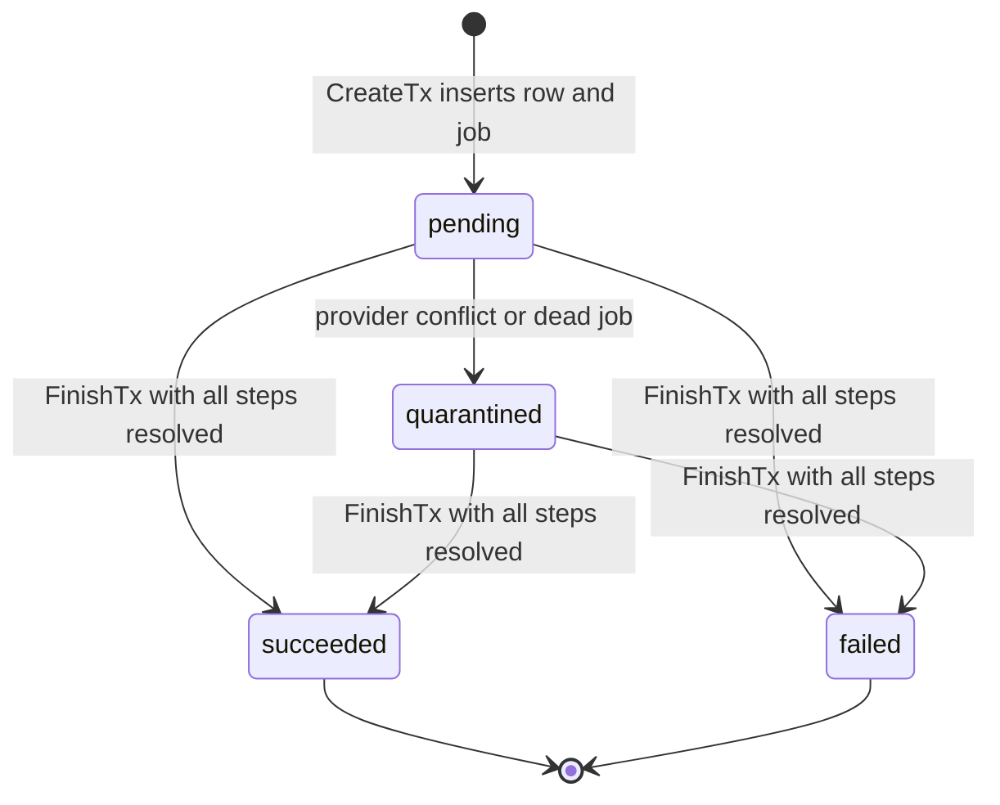

The ride operation journal is the only path that moves ride money. Every financial command (accept, promote, complete, cancel, expire, tip) is recorded as a row before any Stripe call, then executed from that row. `RideService` no longer calls Stripe for holds, captures, voids, or tips. It submits commands to `payment.RideOperations`, and the `ride_operation` River worker runs the same executors when a request dies midway. For the tables, see [RideOperations](/reference/database/rides#rideoperations). For the Stripe-level view, see [Ride PaymentIntent lifecycle](/engineering/payments/ride-payment-intents) and [Ride tip charging](/engineering/payments/ride-tips).

## Runtime wiring

Every claim in this section comes from tracing constructors and call sites in `yelo-api`.

| Piece | Where | What it does |
| --- | --- | --- |
| Assembly | `NewService` in `internal/service/service.go` | Calls `payment.NewRideOperations` with the database pool, the production Stripe client as payment provider, `RideService` as pickup-route provider, and the cached Mapbox client for cancellation quotes. The River client argument is `nil` at this point. |
| Effects | `RideOperations.BindEffects(rideSvc)` in `service.go` | Gives the worker `RideService.ReconcileRideOperation` for ride board and driver queue effects. Rejects `nil` and a second bind. |
| Command owner | `rideSvc.SetFinancialOperations(rideOperations)` in `service.go` | `RideService` holds the runtime as the `RideFinancialOperations` interface (`internal/service/ride/financial_commands.go`). The container also exposes it as `RideOperations`. |
| Job client | `service.RideOperations.BindJobs(notifyClient)` in `cmd/api/main.go` | Binds the notification River client to the journal after `notifyqueue.New` returns and before the server starts. A `nil` client or a second bind is a startup fatal. `CreateTx` and `RecoverJobsTx` fail with "ride operation job client is not configured" without it. |
| Workers, queue, recovery | `registerRideOperations` in `internal/notify/queue/queue.go` | Calls `RegisterWorkers`, which adds the `ride_operation` and `ride_operation_recovery` workers together. Adds the `ride_operations` queue with `MaxWorkers: 2` and appends `RideOperationRecoveryJob()` to the periodic jobs. |
| Guard | `requireFinancialOperations` in `financial_commands.go` | Every entry point returns the server error "ride financial operations are not configured" when the runtime is missing. |

### Entry points

`RideService` keeps its method names. Each one forwards to a `*Legacy` adapter or a system command on `RideOperations`, and maps the returned error through `financialCommandError`: a typed API error passes through, anything else becomes a server error.

| Caller | `RideService` method | Runtime call |
| --- | --- | --- |
| Driver accept | `AcceptRide`, through `acceptFinancialRide` | Takes the ride's advisory lock with `Ride.AcquireLock`, then `AcceptLegacy(rideID, driverID, false)` |
| Auto-queue assignment | `AutoAssignRide` | `AutoAssignLegacy(rideID, driverID, decision)` |
| Idle queue recovery | `RecoverIdleQueue` | `PromoteIdle(queueHeadID, driverID)` |
| Driver complete | `Complete`, through `completeFinancialRide` | `CompleteLegacy(rideID, driverID)` |
| Cancellation fee preview | `CancelIntent`, through `quoteFinancialCancellation` | `QuoteCancellation(rideID, actorID)`. Returns `fee_cents / 100` from the saved quote |
| Cancel | `Cancel`, through `cancelFinancialRide` | `CancelLegacy(rideID, actorID, reason, comment)` |
| Rider rating with tips enabled | `Rate`, through `captureTip` | `SettleTipLegacy` for a tip inside the buffer, `TipLegacy` for a dedicated tip |
| Tip-window sweeper | `AutoCaptureTipWindowExpired`, through `autoCaptureSingleRide` | `SettleTipLegacy(rideID, uuid.Nil, 0, true)` |
| Unmatched-request expiry | `CancelUnmatchedRides` | `ExpireUnmatched()` |

`AutoAssignRide` treats one error case as success. Reservation commits the assignment before any provider work, so when the command returns an error it rereads the ride. If the ride is assigned to that driver in `queued` or `driver_en_route`, it logs "Assigned ride awaits durable preparation" at warn level and returns `nil`. The queued job owns the retries, and matching doesn't offer the ride to anyone else.

### Guards and readers

These read the journal tables outside the runtime.

| Piece | Where | Effect |
| --- | --- | --- |
| Ownership guard on ride commands | `beginOwnedRideCommand` in `ride_command.go` and `finalizeRideRevisions` in `ride_revision.go` call `HasConflictingRideOperation` | Rejects a lifecycle write with "Ride Unavailable" while another operation on the ride is `pending` or `quarantined`. |
| Webhook wake-up | `PaymentService.PaymentIntentUpdated` in `internal/service/payment/payment.go` runs `WakeRidePaymentOperations` | Pulls a waiting `ride_operation` job forward on six `payment_intent.*` event types. See [Tip snooze](#tip-snooze). |
| Webhook payout fence | `MarkRidePaymentSucceeded` in `queries/ride_lifecycle.sql` has `NOT EXISTS (SELECT 1 FROM "RideOperations" ...)` | Skips any ride that has an operation row in any state. The finalizers write `driver_payout` for those rides instead. |
| Snapshot flag | `GetRideSnapshotRows` in `queries/ride_snapshot.sql` computes `transition_pending` | `true` while the ride has a `pending` or `quarantined` operation. The mobile app reads it in `yelo-frontend/lib/ride/commandIdentity.ts`. |
| Admin silent-cancel block | `GetRideSilentCancellation` in `queries/ride_admin_cancel.sql` computes `has_operation` | Blocks silent cancel with "A ride operation is unresolved" while an operation is `pending` or `quarantined`. |
| `GET /ride/operations/{id}` | `registerOperationRoutes` in `internal/server/http/ride/operation_status.go` | Returns the caller's own operation, or 404 "ride operation not found". |

`GET /ride/operations/{id}` returns `id`, `ride_id`, `kind`, `state`, `lifecycle_revision`, and `assignment_generation` for an operation whose `actor_id` is the caller. It never returns inputs, step receipts, or client secrets. System-owned operations have a null `actor_id`, so no user can read them. The generated clients in `yelo-frontend` and `yelo-web` include the endpoint, and no hand-written code in either repo calls it.

## Reserve, then execute

Every command runs in two phases. `RideOperations.Complete` shows the shape:

```go
if _, err := s.completion.Reserve(ctx, command); err != nil { ... }
return s.worker.completion.Execute(ctx, command.ID)
```

<Steps>
  <Step title="Reserve">
    The command repository opens `beginOwnedRideCommand`, which takes the ride command locks described in [Matching concurrency](/engineering/matching/concurrency). It validates the ride status and the caller's `lifecycle_revision` and `assignment_generation`. It then freezes the financial decision (fare cents, PaymentIntent ID, connected account, currency) into `inputs` and calls `CreateTx`. `CreateTx` inserts the `RideOperations` row and a `ride_operation` River job in the same transaction. No Stripe call happens here.
  </Step>
  <Step title="Execute steps">
    The executor loads the row by ID and performs provider calls one step at a time. Each step commits its exact request to `RideOperationSteps` before calling Stripe, and commits the verified receipt afterwards. No transaction or ride lock is held during a Stripe call.
  </Step>
  <Step title="Finalize">
    The command repository retakes the ride locks, re-reads the step receipt from the journal, and checks it against the frozen inputs. It applies the ride lifecycle write, advances revisions, enqueues any rider or driver notification, and calls `FinishTx` in one transaction. Finalizers never call Stripe.
  </Step>
</Steps>

The HTTP caller and the queued job run the same executor against the same row. Whichever arrives second replays stored results instead of repeating work. `RideOperationArgs` carries only `operation_id`, so a worker can't recompute a price or pick a different account.

The caller's request ends at finalization. Ride board and driver queue updates aren't part of it. The `ride_operation` job applies them afterwards. See [Terminal effects](#terminal-effects).

### Retry identity

`CreateTx` uses `ON CONFLICT DO NOTHING`. When the insert affects no rows, it runs `RideOperationInputsMatch` and fails with "ride operation ID reused with different inputs" unless the ride, actor, kind, revisions, and `inputs` are identical. A competing command with a different ID is rejected earlier. `beginOwnedRideCommand` runs `HasConflictingRideOperation` and returns "Ride Unavailable" while another operation on the ride is `pending` or `quarantined`. The unique index `ride_operations_one_unresolved` backs that up in the database: it allows one `pending` or `quarantined` operation per ride.

Each `Reserve` also reads the operation by ID before taking locks. A replay of a committed command returns the stored row and is not validated against the ride's successor state.

The trigger `protect_ride_operation_identity` makes identity columns and `inputs` immutable. `protect_ride_operation_step` does the same for a step's `request` and for any resolved `result`.

## Command kinds

The `kind` check constraint allows six values. `cancel` has two entry points.

| Kind | Entry point | Actor type | Required ride status | Provider steps |
| --- | --- | --- | --- | --- |
| `accept` | `Accept` | `driver`, or `system` when `Automatic` | `confirmed` with no driver | `release_previous_authorization`, `clone_payment_method`, `create_authorization`, `confirm_authorization` |
| `promotion` | Reserved by other commands, or `PromoteIdle` | `system` | `queued` for `PromoteIdle` | `clone_payment_method`, `create_authorization`, `confirm_authorization` |
| `complete` | `Complete` | `driver` | `in_progress` | `capture` |
| `cancel` | `Cancel` | `rider` or `driver` | `requested`, `confirmed`, `queued`, `driver_en_route`, `driver_waiting`, or `in_progress`, unchanged since the quote | `capture` or `void` |
| `cancel` | `ExpireUnmatched` | `system` | `confirmed` with no driver and `confirm_time` older than `config.RideRequestExpiry` (10 minutes) | `void`, only when the ride still carries a hold |
| `settle_tip` | `SettleTip` | `rider`, or `system` when `Automatic` | `pending_rider_rating` | `capture` |
| `tip` | `Tip`, `AbandonTip` | `rider` | `complete` or `pending_rider_rating` | `settle_fare`, `capture`, `clone_payment_method`, `create_tip`, `settle_dedicated_tip`, `authenticate_tip`, `abandon_tip` |

A system actor has a null `actor_id`. The table check enforces that pairing.

### Accept and promotion

`accept` and `promotion` share `RidePreparationExecutor`. `Reserve` assigns the ride to the driver inside the reservation transaction, so the row is stored with `lifecycle_revision` and `assignment_generation` one above the values the caller sent.

`reserveAcceptanceAssignment` in `ride_acceptance_operation.go` runs these checks under the ride command locks before it assigns:

- The driver's open session start time must equal the one the command carries.
- `validateRideAssignmentDriver` requires an online driver with exactly one open session, and that session must match the command's vehicle and fleet. An automatic assignment also requires the driver's auto-queue opt-in (`AcceptsAutoQueue`).
- `CanAcceptDirectRide` rejects a ride held for another driver until the 30-second offer lapses. An automatic assignment is checked as no driver, so it never passes a live hold.
- `validateRideAssignmentAdmission` rejects a fleet mismatch and a driver already at `matching.MaxQueueLength`.

`AssignAcceptedRideToDriver` then sets `driver_en_route` when the driver has no other open ride, and `queued` otherwise. An automatic assignment follows the same rule, and `MarkRideAutomaticallyAssigned` sets `auto_queued = true` afterwards. Its reservation also inserts a `ride_auto_queued` ride event that carries the matcher's decision: `elapsed_since_confirm_ms`, `candidate_count`, `deadhead_minutes`, `final_score`, and `queue_load`.

`RidePreparationPaymentExecutor.Prepare` decides the payment work from the frozen inputs:

- A hold left on an unassigned booking by a previous assignment is voided first, as step `release_previous_authorization`.
- A queued acceptance (`Queued` is true when the driver's queue length is above zero at reservation) does no payment work. Its later `promotion` reuses the accepted inputs.
- A promotion that already has a hold creates nothing. `InspectExistingRideAuthorization` verifies the existing intent read-only.
- A free ride creates nothing.
- Otherwise it clones the payment method, creates an unconfirmed manual-capture intent, and confirms it off-session.

The authorization amount is the fare, plus `models.TipBuffer` ($5.00) when the fare is above zero and tips are enabled.

For a ride that isn't queued, the executor then computes the pickup route with `RideService.PreparePickupRoute`. For a paid ride it re-inspects the hold at Stripe before finalizing, and `attachPromotionPayment` rejects evidence older than 30 seconds ("promotion requires fresh authorization evidence"). Finalization writes the payment columns with `AddRidePaymentIntent` and the route with `UpdateRidePickupRoute` in the transaction that finishes the operation.

If confirmation ends with the intent canceled, `FailAuthorization` finishes the operation as `failed`. In the same transaction it cancels the ride with reason "Payment Failed", promotes the driver's next queued ride, and notifies the rider. `Accept` then returns a "Payment Failed" input error.

`complete`, `cancel`, and a declined authorization each call `PromoteNextQueuedRide`. When a ride is promoted, `reserveRidePromotion` inserts the `promotion` operation for it in the same transaction. Its ID is deterministic: UUIDv5 of `yelo:ride:promotion:{rideID}:{assignmentGeneration}`.

### Complete

`RideCompletionExecutor` captures the fare only when the fare is above zero and tips are off. With tips on, completion performs no capture. It moves the ride to rating and leaves the hold for `settle_tip` or `tip`. `applyCompletion` sets the tip window to 24 hours after finalization.

`CompleteRideForRating` sets `status = 'pending_rider_rating'` and `driver_payout` to the fare for every completion, including free rides and rides with tips off. `tip_window_expires_at` is set only for a paid ride with tips on. `freezeCompletionPayment` rejects a paid ride that has no `payment_intent_id` or `stripe_merchant_id` ("paid ride has no recorded payment identity"), so a paid completion can't skip its capture.

### Cancel

A cancellation needs a `RideCancellationQuotes` row first. `QuoteCancellation` prices the fee with `pricing.GetCancellationFee` and stores it for 60 seconds. Driver cancellations and rides without a PaymentIntent get a zero-fee quote. `Reserve` rejects a quote that is expired, belongs to another actor, or was issued at a different revision.

Execution does no payment work when the ride has no PaymentIntent. Otherwise it captures the fee when it is above zero, and voids the hold when the fee is zero. A driver cancellation while the ride is `queued`, `driver_en_route`, or `driver_waiting` sets `Requeue`, and finalization returns the ride to `confirmed` instead of completing it.

A requeue always has a zero fee, so its hold is voided before the ride rejoins matching. `RequeueReservedRide` then clears `payment_intent_id`, `payment_intent_client_secret`, `stripe_merchant_id`, `cloned_payment_method_id`, and `pre_auth_amount`, resets `confirm_time`, and appends the driver to `declined_drivers`. A terminal cancellation runs `CancelReservedRide`, which sets `driver_payout` to the fee.

### Unmatched-request expiry

`RideOperations.ExpireUnmatched` in `ride_expiry_operation.go` expires unmatched requests one command at a time. It runs from `RideService.CancelUnmatchedRides` on the 30-second `Operational` ticker.

1. `ListExpiredRideOperationCandidates` returns up to 50 `confirmed` rides with no driver and `confirm_time` older than 10 minutes, oldest first. It skips rides that already have a `pending` or `quarantined` operation.
2. For each ride, `ReserveExpiry` opens `beginOwnedRideCommand`, the same locks an assignment takes, and reruns `RideRequestExpired` under them. A ride that was accepted or requeued in the meantime fails the recheck and is skipped.
3. It freezes a zero-fee cancellation as a `system` operation with `automatic = true` and reason `automatic`. The command ID is deterministic, so every instance and every tick reserve the same row.
4. `RideCancellationExecutor.Execute` runs. When the ride still carries a `payment_intent_id`, the `void` step must resolve before finalization.
5. Finalization sets `cancel_reason = 'automatic'` with a null `cancel_user`, and enqueues `ride_request_no_drivers` for the rider in the same transaction.

`ExpireUnmatched` continues past a failing ride and returns the first error. A ride whose void can't be verified keeps its `pending` or `quarantined` operation. It stays `confirmed`, and later ticks skip it.

<Note>
The E2E fixture transition `expire` in `internal/server/http/e2econtrol/ride_transition.go` still calls the repository's bulk `CancelUnmatchedRides`. It only advances the clock on a free, unassigned fixture ride with no PaymentIntent.
</Note>

### Settle tip and dedicated tip

`settle_tip` captures fare plus tip on the ride's own intent. The tip can be at most `models.TipBuffer`. The automatic variant requires a zero tip and an expired tip window.

`tip` charges a separate PaymentIntent, up to `models.MaxTip` ($100.00). When the ride is still `pending_rider_rating`, the tip must be above `models.TipBuffer`. The operation first captures the fare (`capture`) and records that phase as `settle_fare`. It then clones the payment method if the ride has no saved clone, creates the tip intent, and confirms it. A tip intent that reaches `succeeded` finishes the operation as `succeeded`. One that reaches `canceled` finishes it as `failed`.

## Operation states



| State | Meaning | Holds the ride |
| --- | --- | --- |
| `pending` | Reserved. Steps may be in flight. | Yes |
| `succeeded` | Lifecycle write and outcome committed together. | No |
| `failed` | A verified outcome that charged nothing: a canceled authorization (`accept`, `promotion`) or a canceled tip intent (`tip`). | No |
| `quarantined` | The provider outcome is unknown or contradicts the frozen decision. | Yes |

`FinishTx` in `ride_operation.go` enforces the transitions. It refuses `succeeded` or `failed` while any step has a null `result` ("ride operation has unresolved provider effects"). It lets `quarantined` through with unresolved steps. The database trigger rejects any update to a `succeeded` or `failed` row, and lets a `quarantined` row move only to `succeeded` or `failed`.

`failed` only ever comes from two places: `FailAuthorization` and `RideDedicatedTipCommands.Finalize`. `complete`, `cancel`, and `settle_tip` have no failure outcome. They stay `pending` and retry, or they quarantine.

### Timeline events

`FinishTx` calls `recordOperationEventTx` (`ride_operation_events.go`) when it moves an operation to `succeeded`. The ride event is inserted in the transaction that commits the outcome, so the timeline can't show a financial result that didn't commit. A replayed `FinishTx` returns before the insert. `failed` and `quarantined` outcomes insert nothing.

| Kind | Event type | Metadata besides `operation_id` |
| --- | --- | --- |
| `accept` | `ride_accepted` | `queued`, `automatic` |
| `promotion` | `queue_promoted` | None |
| `complete` | `ride_completed` | `fare` |
| `cancel` | `ride_canceled` | `reason`, `fee` |
| `cancel` with `requeue` | `auto_requeued` | `reason`, `fee` |
| `cancel` with `automatic` | `no_drivers_available` | `reason`, `fee` |
| `settle_tip`, `tip` | `tip_captured` | `fare`, `tip_amount` |
| `settle_tip` with `automatic` | `tip_window_expired` | `fare`, `tip_amount` |

The event's actor is the operation's `actor_id` and `actor_type`. `new_status` is the ride's status, read under lock in the same transaction. Amounts are dollars, converted from the frozen cents. The projection reads only `status`, `reason`, `fare_cents`, `tip_cents`, `fee_cents`, `queued`, `requeue`, and `automatic` from `inputs`. PaymentIntent IDs, connected accounts, mandate data, and client secrets stay in the journal.

The pre-cutover event types `merchant_selected`, `payment_intent_created`, `payment_confirmed`, `payment_canceled`, `payment_processing_failed`, and `pickup_route_calculated` have no emitter. `payment_intent_created` has no recorder at all, and the recorder helpers for the others in `internal/service/ride/events.go` have no caller.

## Steps and idempotency keys

A step is one row in `RideOperationSteps`, keyed by `(operation_id, name)`.

- `BeginStepTx` locks the operation, inserts the step if the operation is `pending`, and fails with "ride operation step reused with different inputs" if the stored `request` differs. On an operation that is not `pending` it only replays a step that already has a result.
- `ResolveStepTx` writes the verified receipt once. It accepts an identical repeat, and it still works on a `quarantined` operation.
- A transport error resolves nothing. The step stays open and the next attempt sends the same request.

Every Stripe write uses the key from `RideOperationStepKey`:

```text
ride_operation/{operationID}/{stepName}
```

| Step | Kinds | Stripe call | Key suffix |
| --- | --- | --- | --- |
| `release_previous_authorization` | `accept` | `PaymentIntents.Cancel` on the previous hold | `release_previous_authorization` |
| `clone_payment_method` | `accept`, `promotion`, `tip` | `PaymentMethods.New` on the connected account | `clone_payment_method` |
| `create_authorization` | `accept`, `promotion` | `PaymentIntents.New`, manual capture, `confirm=false` | `create_authorization` |
| `confirm_authorization` | `accept`, `promotion` | `PaymentIntents.Confirm`, off-session | `confirm_authorization`. Canceling a declined intent uses `confirm_authorization:cancel_declined` |
| `capture` | `complete`, `cancel`, `settle_tip`, `tip` | `PaymentIntents.Capture` with `final_capture=true` | `capture` |
| `void` | `cancel` | `PaymentIntents.Cancel` | `void` |
| `settle_fare` | `tip` | None. Marks the fare lifecycle write | Not sent to Stripe |
| `create_tip` | `tip` | `PaymentIntents.New`, automatic capture, `confirm=false` | `create_tip` |
| `settle_dedicated_tip` | `tip` | `PaymentIntents.Confirm`, off-session | `settle_dedicated_tip` |
| `abandon_tip` | `tip` | `PaymentIntents.Cancel` with `requested_by_customer` | `abandon_tip` |
| `authenticate_tip` | `tip` | None. Timestamps the first `requires_action` | Not sent to Stripe |

All calls set `Stripe-Account` to the frozen connected account.

### Creation window

A step keeps its original `first_attempt_at` across retries. `CreateRideAuthorizationIntent`, `ExecuteRideClone`, and `CreateRideTip` refuse to send once 23 hours have passed since that time (`rideIntentCreateWindow`). The code comment gives the reason: an hour of margin before Stripe may forget the key. After the window the provider returns a conflict error and the operation quarantines.

### Intent metadata

Journal intents carry more metadata than legacy ones. An authorization intent has `operation_id`, `ride_id`, `rider_id`, and `driver_id`. A tip intent adds `type=tip`. The authorization and tip methods re-verify this metadata, the amount, the currency, and the capture method on every read. Capture and void reads check the intent ID and `ride_id`, and void also checks the currency, manual capture, and that nothing was received. A mismatch is a conflict.

### Deterministic command IDs

New commands take a client-supplied ID. The legacy adapters and the system derive one with `uuid.NewV5(uuid.NamespaceOID, name)` so that retries without a command ID land on the same row.

| Command | Name hashed |
| --- | --- |
| Promotion | `yelo:ride:promotion:{rideID}:{assignmentGeneration}` |
| `AcceptLegacy`, `AutoAssignLegacy` | `yelo:ride:accept:{rideID}:{driverID}:{assignmentGeneration}` |
| `CancelLegacy` | `yelo:ride:cancel:{rideID}:{actorID}:{quoteAssignmentGeneration}` |
| `ExpireUnmatched` | `yelo:ride:expiry:{rideID}` |
| `CompleteLegacy` | `yelo:ride:complete:{rideID}:{driverID}` |
| `SettleTipLegacy` | `yelo:ride:settle_tip:{rideID}:{actorID}`. The automatic variant hashes the nil UUID as the actor |
| `TipLegacy` | `yelo:ride:tip:{rideID}:{actorID}:{tipCents}` |
| Adopted legacy tip | `yelo:ride:adopt-tip:{rideID}:{paymentIntentID}` |

Notifications use a third namespace. `notifyLifecycleTx` emits with event key `ride_operation:{operationID}:{templateCode}`, so a replayed finalizer can't send a second push.

## Quarantine

Quarantine means "do not retry, do not release". The operation keeps its slot in `ride_operations_one_unresolved`, so no other command can touch the ride.

| Outcome `reason` | Raised by |
| --- | --- |
| `authorization_requires_reconciliation` | `RideAuthorizationExecutor` on a `RideAuthorizationConflictError` |
| `clone_requires_reconciliation` | `RideCloneExecutor` on a `RideCloneConflictError` |
| `capture_requires_reconciliation` | `RideCaptureExecutor` on a `RideCaptureConflictError` |
| `void_requires_reconciliation` | `RideVoidExecutor` on a `RideVoidConflictError` |
| `tip_requires_reconciliation` | `RideTipExecutor` on a `RideAuthorizationConflictError` from a tip call |
| `job_exhausted` | Recovery, when the operation's River job is `discarded` |
| `job_canceled` | Recovery, when the operation's River job is `cancelled` |

Conflict errors come from the Stripe layer when the provider object contradicts the frozen request. Examples from `internal/data/stripe`: "intent is not capturable", "authorization does not match currency or amount", "intent is already captured", "intent belongs to another authorization attempt", and "creation retry window expired". Ordinary Stripe or network errors are not conflicts. They leave the operation `pending` for the next attempt.

When the worker finds a quarantined operation it returns `river.JobCancel`, which stops River from retrying the job.

Nothing in the repo reconciles a quarantine. No job, endpoint, or dashboard action writes a missing step result: `BeginStepTx` refuses new provider work on an operation that isn't `pending`, and the executors skip their Stripe calls. The primitives allow reconciliation: `ResolveStepTx` accepts a quarantined operation, and `FinishTx` can move it to `succeeded` or `failed` once every step has a result.

One path can finish a quarantined operation without new provider work. The finalizers for `complete`, `cancel`, `settle_tip`, and `tip` accept a `quarantined` row, so replaying the same command ID through its entry point finishes the operation when every receipt it needs is already stored. That is the state recovery leaves behind with `job_exhausted` or `job_canceled` after the provider step succeeded. The worker never does this, because it cancels the job first. `accept` and `promotion` have no such path: `decodeRidePreparationPayment` rejects any state other than `pending` or `succeeded`.

## Worker, queue, and recovery

| Item | Value |
| --- | --- |
| Job kind | `ride_operation` (`repository.RideOperationArgs`) |
| Queue | `ride_operations`, `MaxWorkers: 2` per API instance |
| Inserted by | `CreateTx`, in the reservation transaction |
| Recovery kind | `ride_operation_recovery` (`payment.RideOperationRecoveryArgs`) |
| Recovery schedule | Every minute on the `ride_operations` queue, `RunOnStart`, unique by args across live job states |
| Recovery batch | 100 operations |

`RideOperationWorker.Work` loads the operation. If it isn't `pending`, the worker goes straight to `finishDelivery`. Otherwise it dispatches on `kind`, with `accept` and `promotion` going to the preparation executor. After the executor returns, the worker re-reads the row and calls `finishDelivery`, which first maps the state in `rideOperationJobResult`:

| State after the attempt | River result |
| --- | --- |
| `succeeded` or `failed` | Continue to [terminal effects](#terminal-effects). Success only once they're acknowledged |
| `quarantined` | `river.JobCancel` |
| `pending`, kind `tip` | `river.JobSnooze(time.Minute)` |
| `pending`, any other kind | Error, so River retries |

### Terminal effects

A terminal operation isn't done when its outcome commits. The ride board in Redis and the driver's cached queue summary still have to match the new ride state. Those writes live outside Postgres, so they can't join the finalization transaction. The worker keeps the job alive until they succeed, and records that in `RideOperationEffectReceipts`.

`finishDelivery` in `ride_operation_worker.go` runs for a `succeeded` or `failed` operation:

1. `RideOperationEffectsCompleted` checks for a receipt. If one exists, the job succeeds.
2. Otherwise it calls `RideOperationEffects.ReconcileRideOperation`. A missing binding fails the job with "ride operation effects are not configured".
3. On success, `CompleteRideOperationEffects` inserts the receipt. The insert selects from `RideOperations` where the state is `succeeded` or `failed`, and uses `ON CONFLICT DO NOTHING`.
4. Any error returns from `Work`, so River retries the same job. No receipt is written.

`RideService.ReconcileRideOperation` in `internal/service/ride/operation_effects.go` works from the ride's current state, not from the operation's outcome. An old command replayed after a requeue, a reassignment, or a completion still leaves the caches correct.

1. It reads the ride. A `confirmed` ride is added to the board with `rideBoard.AddRide`. A ride in any other status is removed with `rideBoard.RemoveRide`.
2. It refreshes the queue summary for the driver frozen in the operation's `inputs` and for the ride's current driver, when they're set.
3. It reads the ride again. If `lifecycle_revision`, `status`, or the driver changed during the writes, it fails with "ride changed while reconciling operation effects" and the job retries against the newer state.
4. If the ride is `confirmed` and the operation is a `cancel` with `requeue`, it calls `dispatchRematchedRide`.

`dispatchRematchedRide` replays the new-ride alert for a requeued ride. It returns without sending when the ride has no fleet or `GetRideT0NotificationTargets` returns no drivers. Otherwise it calls `NotifyRideAvailable` with the event key `ride_available:{rideID}:rematch:{lifecycleRevision}`, then adds the targets to the notified-drivers cache with `AddNotifiedDrivers`. The key includes the ride's current revision, so each requeue of the same ride gets its own alert and a retried job doesn't send a second one. A failed enqueue or a failed cache write returns an error, and the job keeps its delivery.

The effects never call Stripe and never emit the lifecycle notifications. Those belong to the finalization transaction. See [Deterministic command IDs](#deterministic-command-ids) for their event keys.

<Note>
An HTTP caller that finalizes its own command returns before the effects run. The accepted ride leaves the board, and the driver's queue summary refreshes, when the `ride_operation` job for that command reaches `finishDelivery`.
</Note>

### Tip snooze

A dedicated tip can wait on the rider. Stripe may answer `requires_action` or `processing`, and neither is a failed attempt. The worker snoozes the job for one minute instead of erroring, so the wait doesn't spend retry attempts and the operation always has a live job.

The executor bounds the wait. The first `requires_action` observation writes the `authenticate_tip` step. Once 30 minutes have passed since that step's `first_attempt_at` (`rideTipAuthenticationWindow`), the executor records `abandon_tip` and cancels the intent. A `requires_payment_method` status triggers the same abandonment immediately. `AbandonTip` lets the rider do it explicitly. If authentication wins the race and the intent succeeds anyway, the operation still finishes as `succeeded`.

`WakeRidePaymentOperations` shortens the snooze. A `payment_intent.*` webhook for the same ride and connected account sets the job's `scheduled_at` to now. It only touches jobs in `scheduled` or `retryable` with attempts remaining. It also matches a `create_authorization` or `create_tip` step with no result through the intent's `operation_id` metadata, which covers an intent whose creation response was lost. The webhook is a wake-up only. The worker reads Stripe again and decides from its own persisted request. See [Stripe webhooks](/engineering/payments/webhooks).

### Recovery

`RecoverJobsTx` in `ride_operation_recovery.go` repairs delivery, not money.

1. `ClaimRideOperationsWithoutLiveJob` selects operations that have no `ride_operation` job in `available`, `pending`, `running`, `retryable`, or `scheduled`. It takes `pending` operations, and `succeeded` or `failed` operations that have no row in `RideOperationEffectReceipts`. It locks them with `FOR UPDATE SKIP LOCKED`.
2. For each one it re-reads the job state after taking the lock. A live job means another scanner got there first, and the operation is skipped.
3. For a `pending` operation, a `discarded` or `cancelled` job quarantines it with `job_exhausted` or `job_canceled` (`exhaustedFinancialDelivery`). Recovery does not reset the retry budget for provider work.
4. Everything else gets a new `ride_operation` job on `ride_operations`: a `pending` operation whose job is missing or `completed`, and a terminal operation without a receipt whatever happened to its job.

A terminal operation is never quarantined by recovery. Its money is settled, and the new job only reruns `finishDelivery`, so an exhausted effects job is replaced every minute until the caches reconcile.

The worker logs "ride operation delivery recovery" with `requeued` and `quarantined` counts, at warn level when anything was quarantined.

## Legacy adoption

The `ride_legacy_*.go` files adapt clients that send no command ID or revision. Each adapter reads current state, finds or derives a stable command, and calls the normal entry point. They are the entry points `RideService` uses. See [Entry points](#entry-points).

| Adapter | Behavior |
| --- | --- |
| `AcceptLegacy` | Reuses the driver's latest `accept` operation for the current assignment generation, with its original session, vehicle, fleet, and matcher decision. With no such operation, a ride already assigned to this driver in `queued` or `driver_en_route` returns success without creating an operation or an authorization. That covers assignments made before the cutover. Otherwise it reads the active driver session and derives a new ID. |
| `AutoAssignLegacy` | The same path with `Automatic` set and the matcher's `AutoQueueDecision` frozen into the inputs. |
| `CancelLegacy` | Resumes the actor's `cancel` operation when it covers the current state. Otherwise it needs a current quote. A rider with a PaymentIntent and no quote gets "Review cancellation fee". The adapter never creates a fee-bearing quote itself. |
| `CompleteLegacy` | One completion per ride and driver. A stored operation supplies its original revision. |
| `SettleTipLegacy` | One settlement per ride and actor. The automatic variant uses a nil actor. It resumes an explicit command that a newer client reserved. |
| `TipLegacy` | The ID includes the amount. An unfinished or succeeded tip can't be replaced with a different amount. Only a `failed` (canceled) tip allows a new amount. |
| `ConfirmTipLegacy` | No ride service caller since `POST /ride/i/{id}/confirm-tip` was removed in October 2026. Resumes the saved tip by rider and ride. It never accepts a client-supplied PaymentIntent ID and never creates a tip. With no `tip` operation and no legacy intent to adopt, it returns the input error "No tip". |

### Adopting an existing tip intent

`adoptLegacyTip` handles a ride whose `tip_payment_intent_id` was written by the legacy tip flow. It requires a `complete`, tips-enabled ride with a driver, `tip_amount = 0`, and no `cancel_phase`. `InspectLegacyRideTip` reads the intent from Stripe, and `RideDedicatedTipCommands.Adopt` reserves a `tip` operation with `LegacyIntentID` frozen in its inputs.

From there the intent follows the normal executor. `RideTipExecutor.create` resolves `create_tip` with the adopted ID and never calls `CreateRideTip`. `tipMetadataMatches` accepts an adopted intent only when it has no `operation_id`, `rider_id`, or `driver_id` metadata. The requested amount must equal the intent's amount. If the adopted intent ends canceled, `ClearCanceledLegacyRideTip` clears `tip_payment_intent_id` so the rider can tip again.

### Stranded queues

`PromoteIdle` reserves a `promotion` for the head of an available driver's queue when no completing or canceling command did it. The code comment calls this a repair for pre-cutover stranded queues. `RideService.RecoverIdleQueue` calls it for a driver who has queued rides and no active ride. `ReserveIdle` runs `PromoteAutoQueuedRide` under the ride command locks, so the presence, ping, and session guards still apply. See [Queue promotion and recovery](/engineering/matching/queue-promotion#idle-recovery).

## Where this lives in code

| Concern | Location |
| --- | --- |
| Startup wiring | `yelo-api/internal/service/service.go` (`NewService`), `yelo-api/cmd/api/main.go` (`BindJobs`), `yelo-api/internal/notify/queue/queue.go` (`registerRideOperations`) |
| Ride service command boundary | `yelo-api/internal/service/ride/financial_commands.go`, `driver.go`, `ride.go`, `tip_charge.go`, `tip_capture.go` |
| Service assembly and entry points | `yelo-api/internal/service/payment/ride_operations.go` |
| Unmatched-request expiry | `yelo-api/internal/service/payment/ride_expiry_operation.go`, `yelo-api/internal/data/repository/ride_expiry_operation.go` |
| Terminal effects | `yelo-api/internal/service/ride/operation_effects.go`, `yelo-api/internal/service/payment/ride_operation_worker.go` (`finishDelivery`) |
| Timeline events | `yelo-api/internal/data/repository/ride_operation_events.go` |
| Worker and River result mapping | `yelo-api/internal/service/payment/ride_operation_worker.go` |
| Recovery job and worker registration | `yelo-api/internal/service/payment/ride_operation_recovery.go`, `yelo-api/internal/data/repository/ride_operation_recovery.go` |
| Journal primitives and step key | `yelo-api/internal/data/repository/ride_operation.go` |
| Step executors | `yelo-api/internal/service/payment/ride_authorization_operation.go`, `ride_capture_operation.go`, `ride_void_operation.go`, `ride_clone_operation.go`, `ride_tip_operation.go`, `ride_payment_conflict.go` |
| Lifecycle executors | `yelo-api/internal/service/payment/ride_promotion_operation.go`, `ride_promotion_payment.go`, `ride_completion_operation.go`, `ride_cancellation_operation.go`, `ride_tip_settlement.go`, `ride_dedicated_tip.go` |
| Reserve and finalize | `yelo-api/internal/data/repository/ride_acceptance_operation.go`, `ride_promotion_operation.go`, `ride_idle_promotion.go`, `ride_authorization_failure.go`, `ride_completion_operation.go`, `ride_cancellation_operation.go`, `ride_tip_settlement.go`, `ride_dedicated_tip.go`, `ride_dedicated_tip_finalize.go` |
| Legacy adapters | `yelo-api/internal/service/payment/ride_legacy_*.go`, `ride_idle_promotion.go` |
| Stripe provider methods | `yelo-api/internal/data/stripe/ride_authorization.go`, `ride_existing_authorization.go`, `ride_capture.go`, `ride_void.go`, `ride_clone.go`, `ride_tip.go` |
| SQL | `yelo-api/internal/data/repository/queries/ride_operation.sql` |
| Schema | `yelo-api/migrations/000339_ride_operation_journal.up.sql`, `000340_ride_cancellation_quotes.up.sql`, `000355_ride_operation_effects.up.sql` |
| Operation notifications | `yelo-api/internal/data/repository/ride_operation_notifications.go` |
| Status endpoint | `yelo-api/internal/server/http/ride/operation_status.go`, `yelo-api/internal/data/repository/ride_operation_status.go` |
| Guards and readers | `yelo-api/internal/data/repository/ride_command.go`, `ride_revision.go`, `queries/ride_snapshot.sql`, `queries/ride_admin_cancel.sql`, `queries/ride_lifecycle.sql` (`MarkRidePaymentSucceeded`) |
| Webhook wake-up | `yelo-api/internal/service/payment/payment.go` (`PaymentIntentUpdated`), `yelo-api/internal/server/http/payment/payment_handler.go` |

## Gotchas and edge cases

- **Workers and recovery register together.** `registerRideOperations` adds both workers, the queue, and the periodic job in one call, and only when `Deps.RideOperations` is set. `CreateTx` always inserts its job on `ride_operations`.
- **An unresolved operation blocks the ride.** A `pending` or `quarantined` row rejects every other ride command and admin silent cancel for that ride, and hides the ride from the expiry sweep. A row in any state makes `MarkRidePaymentSucceeded` skip the ride.
- **Effects lag the response.** The board and queue summary change when the job runs, not when the request returns. A ride can show on the board for a moment after a driver accepted it. A second accept fails at reservation with "Ride Unavailable".
- **Effects reconcile to current state.** The receipt means "the caches matched the ride when this job ran". It doesn't record what the caches held.
- **Pre-cutover rides have no operation rows.** `AcceptLegacy` accepts their existing assignment without a receipt. Their requeued holds are voided by the next `accept` (`release_previous_authorization`) or by expiry.
- **Quarantine has no reconciler.** A quarantined operation with an unresolved step holds its ride until someone resolves that step and finishes the operation by hand. See [Quarantine](#quarantine).
- **`failed` is narrow.** It means Stripe confirmed nothing was charged. A capture or void that can't complete never produces `failed`.
- **Reservation advances the ride revision only when it changes the ride.** `accept` and `PromoteIdle` assign or promote the ride while reserving, so they run the revision finalizer. `complete`, `cancel`, `settle_tip`, and `tip` store the ride's current revision unchanged and call `publishRideOperationReservation`, which advances per-user state revisions for the rider and driver.
- **A free ride with an intent can't complete.** `freezeCompletionPayment` rejects a zero fare that has a `payment_intent_id` with "free ride has a payment authorization requiring reconciliation".
- **System operations are invisible to the status endpoint.** `GetOwnedRideOperationStatus` matches on `actor_id`, which is null for automatic acceptance, promotions, and automatic tip settlement.
- **E2E consumes only this queue.** With `E2E_ENABLED=true`, `registerRideOperations` replaces the queue map with `ride_operations` alone and the periodic jobs with the recovery job alone. `main.go` starts that client without River UI. Notification jobs are still inserted, and nothing sends them. See [E2E testing](/engineering/qa/e2e).
