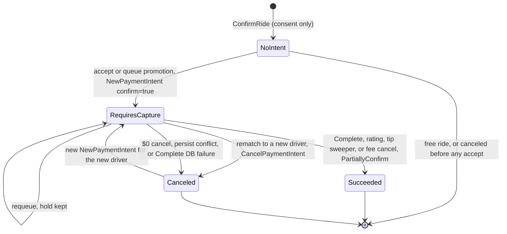

A paid ride has at most one live **ride PaymentIntent** at a time. It's created on a connected account with manual capture, and every later step captures part of it or cancels it. Tips above the buffer use a separate PaymentIntent, covered in [Ride tip charging](/engineering/payments/ride-tips).

For the product view, see [Payments and payouts](/concepts/payments-and-payouts) and [Cancellations](/concepts/cancellations). This page covers the call-level detail.

## State machine

The Stripe states below are the ones Yelo drives. The ride status that triggers each transition is in the edge label.



`Succeeded` here always means a **partial** capture. Stripe releases whatever wasn't captured.

## Step by step

<Steps>
  <Step title="Request: customer, ephemeral key, SetupIntent">
    `RideService.CreateRide` calls `ensureStripeCustomerSetup` (`internal/service/ride/rider.go`).

    - If `Users.stripe_customer_id` is empty, `Customers.New` with the trimmed email and full name. The ID is saved with `SetStripeCustomerId`.
    - Then, in parallel through an `errgroup`: `EphemeralKeys.New` for the customer with `stripe_version=2024-06-20`, and `SetupIntents.New` with `customer` and `automatic_payment_methods.enabled=true`, `allow_redirects=never`.
    - The response carries `stripe_customer_id`, `ephemeral_key`, and `setup_intent_client_secret`. Nothing is written to the ride.
  </Step>
  <Step title="Confirm: consent, no Stripe charge">
    `RideService.ConfirmRide` requires `payment_method_id` when the effective price is above 0 (`validatePaymentMethod`, error title "Payment Required").

    - `processPaymentMethodParallel` fetches the PaymentMethod to derive `payment_method_brand`: the card brand, or `Apple Pay` or `Google Pay` for wallet cards.
    - If the request sets `save_payment_method`, `AllowPaymentMethodRedisplay` sets `allow_redisplay=always`. The mobile app doesn't send this flag.
    - The handler stores `rider_ip_address` from `X-Real-IP`, then the first `X-Forwarded-For` entry, then `RemoteAddr`, and `rider_user_agent`. `confirm_time` and `payment_consent_at` are set to now.
  </Step>
  <Step title="Authorize: clone and create the hold">
    `processRidePayment` in `internal/service/ride/driver.go` runs for any ride with an effective price above 0. It runs from `AcceptRide` before `Ride.Accept`, and from `authorizeRidePickup` when a queued ride is prepared for the active slot.

    1. `selectStripeMerchantID` picks the fleet account when the driver's session fleet has `has_custom_payouts` and a `stripe_merchant_id`, otherwise the driver's `Users.stripe_merchant_id`.
    2. If the ride already has a `payment_intent_id`, `reuseRideAuthorization` decides whether to reuse, replace, or fail. See [Reuse after requeue](#reuse-after-requeue).
    3. `ClonePaymentMethod`: `PaymentMethods.New` on the connected account with `customer` = the rider's platform customer and `payment_method` = `Rides.payment_method_id`.
    4. `NewPaymentIntent` on the connected account. Parameters are listed in [Authorization parameters](#authorization-parameters).
    5. `AddPaymentIntent` writes the IDs, but only if `lifecycle_revision` still matches the value read at the start. A mismatch cancels the new hold.
    6. A `payment_intent_created` ride event records `payment_intent_id`, `amount`, `auth_amount`, and `merchant_id`.
  </Step>
  <Step title="Capture">
    Every capture is `PartiallyConfirm`, which calls `PaymentIntents.Capture` with `amount_to_capture`. See [Capture paths](#capture-paths).
  </Step>
</Steps>

## Authorization parameters

`Client.NewPaymentIntent` in `internal/data/stripe/intent.go` sends exactly this:

```go
params := &stripe.PaymentIntentParams{
    Amount:        new(int64(request.Amount)),           // cents
    Currency:      new("usd"),
    CaptureMethod: stripe.String("manual"),
    Confirm:       new(true),
    OffSession:    new(true),
    PaymentMethod: new(request.PaymentMethodId),        // the clone
    Description:   new("Yelo Ride"),
    AutomaticPaymentMethods: &stripe.PaymentIntentAutomaticPaymentMethodsParams{
        Enabled: new(true), AllowRedirects: new("never"),
    },
    Metadata: map[string]string{
        "ride_id": ..., "rider_id": ..., "driver_id": ..., "description": "Yelo Ride",
    },
    MandateData: /* type online, accepted_at = Rides.confirm_time,
                    ip_address = rider_ip_address, user_agent = rider_user_agent */,
}
params.SetStripeAccount(request.MerchantId)
```

- **No idempotency key.** A timeout after Stripe accepted the request leaves a hold Yelo doesn't know about.
- **Off-session.** A card that needs 3D Secure fails with `authentication_required`. Yelo has no on-session fallback for ride holds.
- `createPaymentIntent` rejects the call before Stripe when the ride lacks `confirm_time`, IP, or user agent ("ride missing required payment metadata"), or when the request fails `PaymentIntentRequest.Validate` (amount must be above 0).
- After Stripe returns, the service treats a nil intent, an empty ID, or an empty client secret as a payment failure and calls `Cancel` with reason `Payment Failed`.

## Amount math

| Amount | Formula | Code |
| --- | --- | --- |
| Effective fare | `discounted_price` if not null, else `price` | `RideDetails.GetEffectivePrice` |
| Authorization | `int((fare + 5.00) * 100)` with tips, `int(fare * 100)` without | `processRidePayment` |
| Capture at `Complete` | `int(fare * 100)` | `confirmPaymentIntent` |
| Capture at rating, no tip or tip over buffer | `math.Round(fare * 100)` | `captureFareOnly` |
| Capture at rating, tip within buffer | `math.Round((fare + tip) * 100)` | `captureTipWithinBuffer` |
| Capture by sweeper | `int(fare * 100)` | `autoCaptureSingleRide` |
| Cancellation fee | `int(fee * 100)` | `applyCancellationPayment` |

`int()` truncates. `Rides.price` and `discounted_price` are `real` (float4), so a price such as $4.35 reads back as `4.349999904632568`.

<Warning>
Truncation and rounding disagree for some prices. For a $4.35 fare with tips on, the hold is `int(9.3499999 * 100)` = 934 cents, but a $5.00 tip captures `round(934.99999)` = 935 cents. Stripe rejects a capture above `amount_capturable`, so the rating fails. The same fare captures 434 cents at `Complete` and by the sweeper, one cent under the fare. Jitter pricing produces arbitrary cents, so this is reachable.
</Warning>

## Reuse after requeue

When the assigned driver cancels before pickup, `requeueAfterDriverCancel` puts the ride back to `confirmed` and appends the driver to `declined_drivers`. The ride keeps `payment_intent_id` and `stripe_merchant_id`. `RequeueRideAfterDriverCancel` also sets `confirm_time` to the requeue time and preserves the original in `payment_consent_at`.

When any driver next authorizes this ride, `reuseRideAuthorization` fetches the intent with `GetPaymentIntent` on the **stored** merchant and checks it:

| Check | Failure result |
| --- | --- |
| Ride has a `stripe_merchant_id` | Server error "ride authorization merchant is missing" |
| ID matches, `capture_method=manual`, `currency=usd`, `amount` equals the recomputed hold, `amount_received=0`, metadata `ride_id` and `rider_id` match | Server error "ride authorization does not match booking" |
| Same `driver_id` in metadata and same merchant | Reuse, if `status=requires_capture` and `amount_capturable` equals the hold. Otherwise "ride authorization is not ready for this assignment" |
| Different driver | The metadata driver must be in `declined_drivers` and must not be the new driver. Otherwise "ride authorization belongs to an unknown assignment" |
| Previous driver's intent already `canceled` | Create a new hold. This covers a retry after a cancel whose reply was lost |
| Previous driver's intent `requires_capture` with the full amount | `CancelPaymentIntent` on the old merchant, then create a new hold |

Any server error here fails the accept, so a mismatched hold blocks the ride from being accepted until it expires.

The new hold's mandate `accepted_at` is the requeue time, because `createPaymentIntent` reads `confirm_time`, not `payment_consent_at`.

## Capture paths

| Trigger | Condition | Call | Amount |
| --- | --- | --- | --- |
| `Complete` | Tips disabled, or effective price 0 | `PartiallyConfirm`, only if `payment_intent_id` is set | `int(fare * 100)` |
| `Complete` | Tips enabled and price above 0 | None. Sets `pending_rider_rating` and `tip_window_expires_at = now + 24h` | — |
| `Rate` by rider | Tips enabled, ride pending, paid | `captureFareOnly` or `captureTipWithinBuffer` | See [Ride tip charging](/engineering/payments/ride-tips) |
| `TipCapture` sweeper | Window expired | `PartiallyConfirm` | `int(fare * 100)` |
| `Cancel` | Fee above 0 | `PartiallyConfirm` | `int(fee * 100)` |

`Complete` recomputes the merchant with `selectStripeMerchantID` from the driver's **current** session fleet. It doesn't read `Rides.stripe_merchant_id`. Every other path uses the stored merchant.

If `Ride.Complete` fails after a capture, `handleCompleteDBFailure` runs:

- Tips disabled: `CancelPaymentIntent`. On an already-captured intent this fails and is logged as "manual reconciliation required".
- Tips enabled: nothing was captured. It logs "needs manual review" and leaves the hold.

## Cancellation

`RideService.Cancel` in `internal/service/ride/ride.go` orders the work like this:

1. `isReQueueEligible`: driver cancels from `queued`, `driver_en_route`, or `driver_waiting` take the requeue path. No Stripe call.
2. `handleCancellationPayment`: no `payment_intent_id` means $0 and no call. A PaymentIntent without `stripe_merchant_id` is a server error.
3. `pricing.GetCancellationFee`. Above 0: `PartiallyConfirm(fee)`. Exactly 0: `CancelPaymentIntent`.
4. `Ride.Cancel` with a state expectation of the status and driver read in step 1.

Stripe is called **before** the database write. The fee capture lands on the connected account, and the ride's `driver_payout` is set later by the `payment_intent.succeeded` webhook to the fee amount. `Ride.Cancel` itself doesn't touch `driver_payout`.

For queued rides that are canceled terminally while being prepared for pickup, `releaseCancelledQueueAuthorization` cancels the hold if the ride ended with `cancel_phase = queued` and the intent isn't already canceled.

## Free rides

A ride with an effective price of 0 never touches Stripe during the trip:

- `ConfirmRide` doesn't require a payment method, and the mobile app skips PaymentSheet confirmation.
- `AcceptRide` and `authorizeRidePickup` skip `processRidePayment`.
- `Complete` skips the tip window and completes directly, even with tips enabled.
- A tip on a free ride clones the saved payment method at rating time, if the rider saved one. See [Ride tip charging](/engineering/payments/ride-tips#free-rides).

## Failure outcomes

| Failure | Where | What the driver or rider sees |
| --- | --- | --- |
| Clone fails | `clonePaymentMethodToMerchant` | Driver's accept returns the Stripe error as "Something Went Wrong". `Cancel` with `Payment Failed` runs as the driver, who isn't assigned yet, so it's rejected. The ride stays on the board |
| Card declined or needs authentication | `createPaymentIntent` | Same as above. Each failed attempt counts toward the Stripe breaker |
| Persist conflict | `persistPaymentIntent` | New hold canceled. Accept returns a server error |
| Persist with unknown outcome | `persistPaymentIntent` | Hold kept, error returned. The ride may or may not reference it |
| Capture fails at `Complete` | `confirmPaymentIntent` | Driver can't complete. The ride stays `in_progress` |
| Fee capture fails | `applyCancellationPayment` | Cancel returns the error. The ride isn't canceled |

See [Payment failure modes and invariants](/engineering/payments/failure-modes-and-invariants) for the full matrix.

## Where this lives in code

| Concern | Location |
| --- | --- |
| Customer and SetupIntent | `yelo-api/internal/service/ride/rider.go` (`ensureStripeCustomerSetup`) |
| Confirm-time payment checks | `yelo-api/internal/service/ride/rider.go` (`validatePaymentMethod`, `processPaymentMethodParallel`, `extractPaymentBrand`) |
| IP and user agent capture | `yelo-api/internal/server/http/ride/ride_handler.go`, `yelo-api/internal/utilities/network/ip.go` |
| Authorization and reuse | `yelo-api/internal/service/ride/driver.go` (`processRidePayment`, `reuseRideAuthorization`, `clonePaymentMethodToMerchant`, `createPaymentIntent`, `persistPaymentIntent`) |
| Queue promotion auth | `yelo-api/internal/service/ride/driver.go` (`prepareAndPromoteQueuedRide`, `prepareActiveRide`, `authorizeRidePickup`, `releaseCancelledQueueAuthorization`) |
| Capture at complete | `yelo-api/internal/service/ride/driver.go` (`Complete`, `confirmPaymentIntent`, `handleCompleteDBFailure`) |
| Cancellation charges | `yelo-api/internal/service/ride/ride.go` (`Cancel`, `handleCancellationPayment`, `applyCancellationPayment`) |
| Stripe calls | `yelo-api/internal/data/stripe/intent.go`, `method.go` |
| SQL | `yelo-api/internal/data/repository/queries/ride_lifecycle.sql` (`AddRidePaymentIntent`, `RequeueRideAfterDriverCancel`) |

## Gotchas and edge cases

- **Two drivers, two holds.** `AddPaymentIntent` checks `lifecycle_revision` but doesn't bump it, and `AcceptRide` takes no lock before authorizing. Two drivers accepting the same board ride at once can both create holds and both pass the revision check. The later write wins `payment_intent_id`, the other hold is never canceled, and `Ride.Accept` may pick the other driver.
- **Complete uses the live merchant.** If a driver's session fleet changes between accept and complete, `Complete` captures against an account that doesn't own the hold, and Stripe returns "No such payment_intent".
- **Cancel races.** A $0 rider cancel voids the hold before `Ride.Cancel` checks state. If the driver advances the ride in between, the cancel fails but the hold is already gone, and `Complete` can't capture later.
- **Requeued rides that expire.** `CancelUnmatchedConfirmedRides` ends unmatched `confirmed` rides without a Stripe call. A requeued ride still holds the previous driver's authorization, which stays on the rider's card until Stripe expires it.
- **Paid ride without a hold.** `confirmPaymentIntent` silently skips capture when `payment_intent_id` is null. A tips-enabled ride in that state never leaves `pending_rider_rating`, because the sweeper only selects rides with a PaymentIntent.
- **Hold expiry.** Card authorizations expire after about 7 days. Queued or requeued rides don't renew them.
- **Reuse is strict.** Any drift between the stored price and the Stripe `amount`, such as a price edit after authorization, turns every future accept into "ride authorization does not match booking".
- **Tips are always on from mobile.** `usePreRideRequest` always sends `X-Features: tips,driver-options`, so every mobile ride authorizes the $5.00 buffer. Rides created without that header, such as from older clients, authorize the fare only. See [Mobile PaymentSheet and wallets](/engineering/payments/mobile-payment-sheet).
