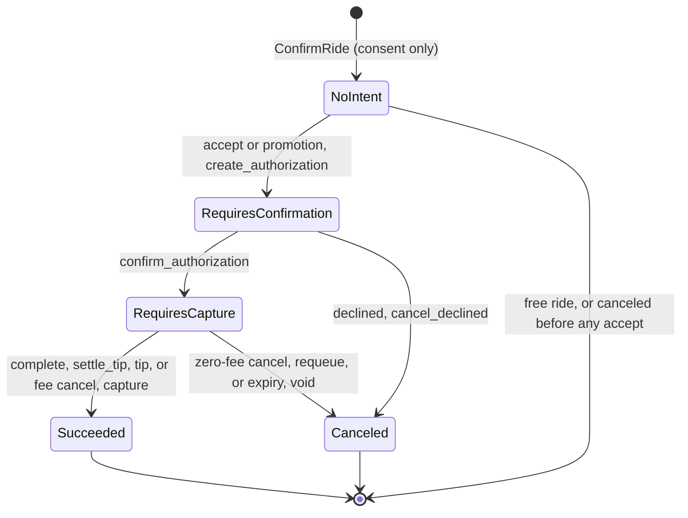

A paid ride has at most one live **ride PaymentIntent** at a time. It's created on a connected account with manual capture, and every later step captures part of it or cancels it. Tips above the buffer use a separate PaymentIntent, covered in [Ride tip charging](/engineering/payments/ride-tips).

Every Stripe write on this page after ride confirmation runs as a step of a ride operation. `RideService` submits a command, the command freezes its amounts and account in `RideOperations.inputs`, and an executor performs the call. This page covers what Stripe sees. For reservation, retries, quarantine, and recovery, see [Ride operation journal](/engineering/payments/ride-operation-journal).

For the product view, see [Payments and payouts](/concepts/payments-and-payouts) and [Cancellations](/concepts/cancellations). This page covers the call-level detail.

## State machine

The Stripe states below are the ones Yelo drives. The operation kind that triggers each transition is in the edge label.


```mermaid
stateDiagram-v2
    [*] --> NoIntent: ConfirmRide (consent only)
    NoIntent --> RequiresConfirmation: accept or promotion, create_authorization
    NoIntent --> [*]: free ride, or canceled before any accept
    RequiresConfirmation --> RequiresCapture: confirm_authorization
    RequiresConfirmation --> Canceled: declined, cancel_declined
    RequiresCapture --> Succeeded: complete, settle_tip, tip, or fee cancel, capture
    RequiresCapture --> Canceled: zero-fee cancel, requeue, or expiry, void
    Succeeded --> [*]
    Canceled --> [*]
```

`Succeeded` means one final capture of a frozen amount. Stripe releases whatever wasn't captured.

## Step by step

<Steps>
  <Step title="Request: customer, ephemeral key, SetupIntent">
    `RideService.CreateRideV2` calls `ensureStripeCustomerSetup` (`internal/service/ride/rider.go`).

    - `CustomerProvisioner.Ensure` (`internal/service/payment/customer.go`) returns the rider's Stripe customer. Most riders already have one, because the `stripe_customer_provision` job creates it after signup. See [On-demand jobs](/engineering/api/background-jobs#on-demand-jobs).
    - If the loaded user has no `stripe_customer_id`, `Ensure` re-reads the column in case the job finished meanwhile. If it is still empty, it calls `Customers.New` with only `metadata.yelo_user_id` and the idempotency key `yelo-customer-v1-<user id>`, then saves the ID with `ClaimUserStripeCustomerID`. That query keeps an ID another request already stored and never writes to a deleted user. `Ensure` then enqueues the job to set the customer's email and name.
    - Then, in parallel through an `errgroup`: `EphemeralKeys.New` for the customer with `stripe_version=2024-06-20`, and `SetupIntents.New` with `customer` and `automatic_payment_methods.enabled=true`, `allow_redirects=never`.
    - The response carries `stripe_customer_id`, `ephemeral_key`, and `setup_intent_client_secret`. Nothing is written to the ride.
  </Step>
  <Step title="Confirm: consent, no Stripe charge">
    `RideService.ConfirmRide` requires `payment_method_id` when the effective price is above 0 (`validatePaymentMethod`, error title "Payment Required").

    - `processPaymentMethodParallel` fetches the PaymentMethod to derive `payment_method_brand`: the card brand, or `Apple Pay` or `Google Pay` for wallet cards.
    - If the request sets `save_payment_method`, `AllowPaymentMethodRedisplay` sets `allow_redisplay=always`. The mobile app doesn't send this flag.
    - The handler stores `rider_ip_address` from `X-Real-IP`, then the first `X-Forwarded-For` entry, then `RemoteAddr`, and `rider_user_agent`. `confirm_time` and `payment_consent_at` are set to now.
  </Step>
  <Step title="Authorize: clone, create, confirm">
    `RidePreparationPaymentExecutor.Prepare` in `internal/service/payment/ride_promotion_payment.go` runs inside an `accept` or `promotion` operation. It does payment work only for a ride with a fare above 0 that is taking the driver's active slot. A queued acceptance defers all of it to the later `promotion`.

    1. The connected account is frozen at reservation by `GetRidePaymentPreparation`: the ride's fleet account when the fleet has `has_custom_payouts` and a `stripe_merchant_id`, otherwise the driver's `Users.stripe_merchant_id`.
    2. If the unassigned ride still carried a hold from an earlier assignment, `release_previous_authorization` voids it first. See [Requeue and expiry](#requeue-and-expiry).
    3. `clone_payment_method`: `PaymentMethods.New` on the connected account with `customer` = the rider's platform customer and `payment_method` = `Rides.payment_method_id`.
    4. `create_authorization`: `PaymentIntents.New` with `confirm=false`. The intent ID is stored as the step result before any hold exists.
    5. `confirm_authorization`: `PaymentIntents.Confirm`, off-session, with the mandate data.
    6. The executor reads the intent back with `InspectRideAuthorization`. Finalization accepts that evidence only when it's at most 30 seconds old, then `AddRidePaymentIntent` writes `payment_intent_id`, `payment_intent_client_secret`, `pre_auth_amount`, `cloned_payment_method_id`, and `stripe_merchant_id` in the transaction that finishes the operation.
  </Step>
  <Step title="Capture or void">
    Every capture is `ExecuteRideCapture`, which calls `PaymentIntents.Capture` with `amount_to_capture` only. It doesn't send `final_capture`, because standard authorizations reject that multicapture field. The default capture is final and releases the uncaptured remainder. Every release is `ExecuteRideVoid`, which calls `PaymentIntents.Cancel`. See [Capture paths](#capture-paths).
  </Step>
</Steps>

## Authorization parameters

`Client.CreateRideAuthorizationIntent` in `internal/data/stripe/ride_authorization.go` sends this:

```go
params := &stripe.PaymentIntentParams{
    Amount: &p.Amount, Currency: &p.Currency, PaymentMethod: &p.PaymentMethodID, // cents, "usd", the clone
    CaptureMethod: new("manual"), Confirm: new(false), Description: new("Yelo Ride"),
    AutomaticPaymentMethods: &stripe.PaymentIntentAutomaticPaymentMethodsParams{
        Enabled: new(true), AllowRedirects: new("never"),
    },
    Metadata: map[string]string{
        "operation_id": ..., "ride_id": ..., "rider_id": ..., "driver_id": ...,
    },
}
params.SetStripeAccount(p.MerchantID)
params.SetIdempotencyKey(p.IdempotencyKey) // ride_operation/{operationID}/create_authorization
```

`ConfirmRideAuthorization` then confirms that intent:

```go
params := &stripe.PaymentIntentConfirmParams{
    OffSession:  new(true),
    MandateData: /* type online, accepted_at = COALESCE(payment_consent_at, confirm_time),
                    ip_address = rider_ip_address, user_agent = rider_user_agent */,
}
params.SetStripeAccount(p.MerchantID)
params.SetIdempotencyKey(p.IdempotencyKey) // ride_operation/{operationID}/confirm_authorization
```

- **Create and confirm are separate calls.** A timeout on create can't leave an unknown hold, because an unconfirmed intent holds nothing. A retry sends the same key and gets the same intent.
- **Creation has a 23-hour window.** `CreateRideAuthorizationIntent` refuses to send once 23 hours have passed since the step's first attempt, and each call is bounded to 30 seconds. See [Creation window](/engineering/payments/ride-operation-journal#creation-window).
- **Off-session.** Yelo has no on-session fallback for ride holds. When the confirmed intent lands in `requires_payment_method` with nothing capturable, the client cancels it with the key suffix `confirm_authorization:cancel_declined` and returns a canceled receipt.
- **A lost confirm response is read, not resent blind.** If `Confirm` errors, the client reads the intent with `PaymentIntents.Get` and decides from its actual status.
- **Every read re-verifies identity.** `verifyAuthorizationIdentity` checks the payment method, amount, currency, manual capture, and all four metadata values. A mismatch is a conflict, which quarantines the operation.
- **Validation happens before Stripe.** `RideAuthorizationRequest.validate` rejects an amount at or below 0, a missing account, method, or key, missing ownership IDs, and missing consent (`mandate_accepted_at`, IP, user agent). `ValidateRidePaymentPreparation` runs the same consent checks at reservation, before the assignment commits.

## Amount math

Amounts are integer cents, computed once in SQL when the command is reserved and frozen in the operation's `inputs`. Executors never recompute them.

| Amount | Formula | Code |
| --- | --- | --- |
| Fare cents | `ROUND(COALESCE(discounted_price, price)::numeric * 100)` | `GetRideOperationPaymentDecision`, `GetRideCancellationBasis`, `GetRideTipSettlementDecision` in `queries/ride_operation.sql` |
| Authorization | Fare cents, plus 500 (`models.TipBuffer`) when the fare is above 0 and tips are enabled | `freezeRidePreparation` |
| Capture at `complete`, tips off | Fare cents | `RideCompletionExecutor` |
| Capture at `settle_tip` | Fare cents plus tip cents. The tip is 0 for a rating without a tip and for the sweeper | `RideTipSettlementExecutor` |
| Capture of the fare inside a `tip` operation | Fare cents | `RideDedicatedTipExecutor.prepare` |
| Cancellation fee | `math.Round(fee * 100)` from `pricing.GetCancellationFee`, stored in the quote | `RideCancellationQuotes.Quote` |
| `Rides.pre_auth_amount` | The authorized amount divided by 100 | `attachPromotionPayment` |

`ExecuteRideCapture` requires `amount_capturable` to cover the frozen amount before it captures, and requires `amount_received` to equal it afterwards. `ValidateRidePaymentPreparation` rejects an authorization amount that isn't exactly fare plus buffer.

## Requeue and expiry

A hold never outlives the assignment it was made for.

| Event | What happens to the hold | Code |
| --- | --- | --- |
| Driver cancels from `queued`, `driver_en_route`, or `driver_waiting` | The `cancel` operation voids it (`void` step), then `RequeueReservedRide` clears `payment_intent_id`, `payment_intent_client_secret`, `stripe_merchant_id`, `cloned_payment_method_id`, and `pre_auth_amount` | `ride_cancellation_operation.go` |
| Next driver accepts | A new clone and a new intent on the new driver's account, with new metadata | `RidePreparationPaymentExecutor.Prepare` |
| Queued ride is promoted | No intent exists yet for a ride accepted into the queue. The `promotion` creates one, reusing the inputs frozen at acceptance | `reserveRidePromotion` |
| A queued ride that already has `payment_intent_id` set is promoted | `InspectExistingRideAuthorization` verifies the recorded intent read-only: method, amount, currency, manual capture, `ride_id`, `rider_id`, `driver_id`, `requires_capture`, and the full amount capturable. Nothing is created | `ride_existing_authorization.go` |
| Unmatched request expires | The system `cancel` voids any remaining hold before the ride is completed | `ReserveExpiry` |

One compatibility case remains. A ride that was requeued before the journal took over can sit `confirmed` with a `payment_intent_id` still set. `HasRequeuedAuthorization` detects it on the next `accept`, and `release_previous_authorization` voids the old intent on its recorded account before the new hold is created. `clearReleasedAuthorization` then clears the old payment columns, and fails with "previous hold changed before assignment readiness" unless exactly one row matched. Expiry voids the same kind of hold.

`ExecuteRideVoid` reads the intent before canceling. An already `canceled` intent with nothing capturable counts as released. A `succeeded` intent is a conflict ("intent is already captured"). It never refunds.

## Capture paths

| Operation | Condition | Step | Amount |
| --- | --- | --- | --- |
| `complete` | Fare above 0 and tips off | `capture` | Fare cents |
| `complete` | Fare above 0 and tips on | None. The ride moves to `pending_rider_rating` with `tip_window_expires_at` 24 hours after finalization | — |
| `complete` | Fare 0 | None | — |
| `settle_tip`, rider | Rating on a `pending_rider_rating` ride with a hold, tip at most $5.00 | `capture` | Fare cents plus tip cents |
| `settle_tip`, system | Tip window expired | `capture` | Fare cents |
| `tip` | Rating on a `pending_rider_rating` ride, tip above $5.00 | `capture`, then the tip steps | Fare cents |
| `cancel` | Fee above 0 | `capture` | Fee cents |
| `cancel` | Fee 0 and a hold exists | `void` | — |

Every path captures against the `payment_intent_id` and `stripe_merchant_id` stored on the ride and frozen into the operation at reservation. No path looks up the driver's current fleet.

A capture is verified before the ride changes. Each finalizer re-reads the `capture` step receipt and compares it with the frozen inputs, then writes the ride and finishes the operation in one transaction. When that transaction fails, the receipt is still in the journal, and the next attempt finalizes without calling Stripe again.

`driver_payout` is written by the finalizers: the fare at `complete`, fare plus tip at `settle_tip`, and the fee at a terminal `cancel`. The `payment_intent.succeeded` webhook skips any ride that has an operation row. See [Stripe webhooks](/engineering/payments/webhooks#payment_intentsucceeded).

## Cancellation

Cancellation is two requests.

1. `RideService.CancelIntent` calls `QuoteCancellation`. A driver, or a ride without a PaymentIntent, gets a zero-fee quote. Otherwise `pricing.GetCancellationFee` prices the fee. The quote is stored in `RideCancellationQuotes` for 60 seconds. It's bound to the ride's `lifecycle_revision` and `assignment_generation`, and it records the status, PaymentIntent, and account it was priced against.
2. `RideService.Cancel` calls `CancelLegacy`, which reserves a `cancel` operation from the actor's current quote. A rider whose ride has a PaymentIntent and who has no current quote gets "Review cancellation fee". The adapter never creates a fee-bearing quote on its own.

Execution captures the fee when it's above 0 and voids the hold when it's 0. The ride changes only after that step's receipt is verified. An unresolved `cancel` operation blocks every other command on the ride, so the driver can't advance a ride whose hold is being voided.

A cancel that leaves the driver's active slot promotes the driver's next queued ride in the same transaction, and reserves that ride's `promotion` operation.

## Free rides

A ride with a fare of 0 never touches Stripe during the trip:

- `ConfirmRide` doesn't require a payment method, and the mobile app skips PaymentSheet confirmation.
- `accept` and `promotion` create no steps. `attachPromotionPayment` rejects payment evidence on a free ride.
- `complete` performs no capture and sets no tip window. The ride still moves to `pending_rider_rating`.
- `freezeCompletionPayment` rejects a free ride that has a `payment_intent_id` ("free ride has a payment authorization requiring reconciliation").
- A tip on a free ride is a dedicated charge. See [Ride tip charging](/engineering/payments/ride-tips#free-rides).

## Failure outcomes

The reservation commits before any Stripe call. A failure during execution leaves the ride assigned and the operation unresolved, and the `ride_operation` job continues the work.

| Failure | Operation state | What the driver or rider sees |
| --- | --- | --- |
| Reservation rejected: ride no longer `confirmed`, stale revision, session mismatch, driver offline, queue full, or a hold for another driver | No operation | Accept returns "Ride Unavailable". Nothing changed |
| Missing consent, payment method, customer, or connected account | No operation | Accept returns a server error. `ValidateRidePaymentPreparation` fails inside the reservation transaction, so the assignment rolls back |
| Stripe or network error on clone, create, or confirm | `pending` | Accept returns a server error. The ride is already assigned and `transition_pending` is `true`. The job retries the same step with the same key |
| Card declined: intent ends `canceled` with nothing capturable | `failed` | Accept returns "Payment Failed". The ride is canceled with `cancel_reason = 'Payment Failed'`, the rider gets `ride_payment_failed`, and the driver's next queued ride is promoted |
| Provider object contradicts the frozen request | `quarantined` | The command returns a server error. The ride keeps its assignment and accepts no other command until someone reconciles it |
| Capture or void hits a Stripe or network error | `pending` | Complete or cancel returns a server error. The ride keeps its status. The job retries |
| Intent already captured for a different amount, or not capturable | `quarantined` | Same as a contradiction above |

See [Quarantine](/engineering/payments/ride-operation-journal#quarantine) and [Payment failure modes and invariants](/engineering/payments/failure-modes-and-invariants) for the full matrix.

## Where this lives in code

| Concern | Location |
| --- | --- |
| Customer and SetupIntent | `yelo-api/internal/service/ride/rider.go` (`ensureStripeCustomerSetup`) |
| Confirm-time payment checks | `yelo-api/internal/service/ride/rider.go` (`validatePaymentMethod`, `processPaymentMethodParallel`, `extractPaymentBrand`) |
| IP and user agent capture | `yelo-api/internal/server/http/ride/ride_handler.go`, `yelo-api/internal/utilities/network/ip.go` |
| Command boundary | `yelo-api/internal/service/ride/financial_commands.go`, `driver.go` (`AcceptRide`, `AutoAssignRide`, `RecoverIdleQueue`, `Complete`), `ride.go` (`Cancel`, `CancelIntent`, `CancelUnmatchedRides`) |
| Payment decision and amounts | `yelo-api/internal/data/repository/ride_promotion_operation.go` (`freezeRidePreparation`, `attachPromotionPayment`, `clearReleasedAuthorization`), `yelo-api/internal/models/ride_payment_preparation.go` |
| Authorization steps | `yelo-api/internal/service/payment/ride_promotion_payment.go`, `ride_promotion_operation.go`, `ride_authorization_operation.go`, `ride_clone_operation.go` |
| Capture and void steps | `yelo-api/internal/service/payment/ride_capture_operation.go`, `ride_void_operation.go`, `ride_completion_operation.go`, `ride_cancellation_operation.go` |
| Stripe calls | `yelo-api/internal/data/stripe/ride_authorization.go`, `ride_existing_authorization.go`, `ride_clone.go`, `ride_capture.go`, `ride_void.go` |
| SQL | `yelo-api/internal/data/repository/queries/ride_operation.sql`, `queries/ride_lifecycle.sql` (`AddRidePaymentIntent`, `CompleteRideForRating`) |

## Gotchas and edge cases

- **Accepting assigns before authorizing.** The assignment commits at reservation, and the hold is created afterwards. A paid ride can be `driver_en_route` with no `payment_intent_id` while its operation is `pending`. The ride accepts no other command until that operation resolves.
- **A second accept can't create a second hold.** `acceptFinancialRide` takes the ride's advisory lock, reservation requires `confirmed` with no driver under the ride command locks, and `ride_operations_one_unresolved` allows one unresolved operation per ride. The loser gets "Ride Unavailable" before any Stripe call.
- **The account is fixed at acceptance.** Completion, cancellation, and tips use the account frozen into the hold. A driver who changes fleets mid-ride still settles on the original account.
- **A queued ride has no hold.** A ride accepted into a driver's queue is authorized only when it's promoted. A decline at that point cancels the ride with "Payment Failed", after the rider has been waiting.
- **Free completions and tips-off completions wait for a rating.** `complete` always sets `pending_rider_rating`. The sweeper selects only tips-enabled rides with an expired window and a PaymentIntent, so the rider's rating is what moves those rides to `complete`.
- **Hold expiry.** Card authorizations expire after about 7 days. Nothing renews them. A capture against an expired hold finds an intent that isn't capturable, which is a conflict, and the operation quarantines.
- **A price edit after authorization blocks settlement.** The frozen fare must match the hold. `ExecuteRideCapture` rejects a capture above `amount_capturable`, and promotion of a ride that kept its hold rejects an amount that isn't fare plus buffer.
- **Tips are always on from mobile.** `usePreRideRequest` always sends `X-Features: tips,driver-options`, so every mobile ride authorizes the $5.00 buffer. Rides created without that header, such as from older clients, authorize the fare only. See [Mobile PaymentSheet and wallets](/engineering/payments/mobile-payment-sheet).
