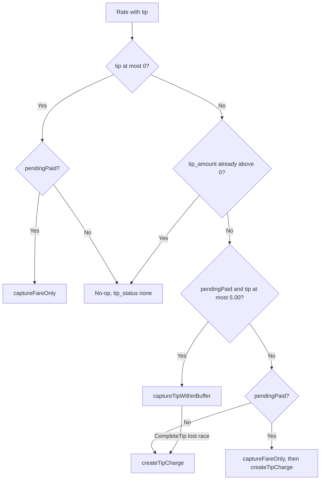

In-app tips ride on the fare's PaymentIntent when they fit inside the $5.00 buffer, and on a second PaymentIntent when they don't. This page traces both paths at the Stripe-call level. For the rider-facing rules, see [Tips and earnings](/concepts/tips-and-earnings). For the fare hold itself, see [Ride PaymentIntent lifecycle](/engineering/payments/ride-payment-intents).

## Preconditions

A tip is only considered when all of these hold:

- The ride row has `tips_enabled = true`. The API sets it at `CreateRide` from the `X-Features` header containing `tips` (`features.HasFeature`, case-sensitive).
- The caller of `POST /ride/i/{id}/rate` is the rider. Driver ratings never touch payments.
- The ride is `pending_rider_rating` or `complete`. Any other status returns "Ride is not reviewable".
- `tip_amount` in the body is between 0 and 100.00 (`RatingRequest.Validate` against `models.MaxTip`).

`GET /ride/i/{id}/tip-options` is stricter: rider only, status `pending_rider_rating`, tips enabled. It returns fixed presets `[2, 5, 10]` from `models.GetTipOptions`, which ignores the fare.

## Decision tree

`RideService.captureTip` in `internal/service/ride/tip_charge.go` evaluates in this order. `pendingPaid` means status `pending_rider_rating` with both `payment_intent_id` and `stripe_merchant_id` set.



## In-buffer capture

`captureTipWithinBuffer` makes one Stripe call:

```text
PaymentIntents.Capture(payment_intent_id, amount_to_capture = round((fare + tip) * 100))
  Stripe-Account: Rides.stripe_merchant_id
```

Then `Ride.CompleteTip(rideID, tip, fare + tip)` runs `CompleteRideTip`:

```sql
UPDATE "Rides" SET tip_amount = $tip, driver_payout = $fare_plus_tip, status = 'complete'
WHERE id = $ride AND status = 'pending_rider_rating';
```

It records `payment_confirmed` and `tip_captured` ride events and returns `tip_status: captured`.

If `CompleteRideTip` updates zero rows, the sweeper already settled the fare. In that case the capture call above hit `charge_already_captured`, which `PartiallyConfirm` swallows, so the tip wasn't collected. The code falls back to `createTipCharge`.

## Fare-only capture

`captureFareOnly` captures `round(fare * 100)` and then calls `CompleteTip(rideID, 0, fare)`. An input-type error from `CompleteTip`, meaning the ride is no longer pending, is ignored. This is what a rating with no tip does on a pending paid ride.

## Dedicated tip charge

`createTipCharge` runs for tips above the buffer, tips on free rides, and tips on rides that are already `complete`.

<Steps>
  <Step title="Resolve the merchant">
    `resolveTipMerchant` returns `Rides.stripe_merchant_id` when set. For free rides it loads the driver and the ride's fleet and calls `selectStripeMerchantID`. An empty result returns "This driver can't accept tips right now."
  </Step>
  <Step title="Resolve the payment method">
    `resolveTipPaymentMethod` returns `cloned_payment_method_id` when set. Otherwise it clones `payment_method_id` onto the merchant now. No saved method returns "Add a payment method to leave a tip."
  </Step>
  <Step title="Check mandate data">
    The ride must have `confirm_time`, `rider_ip_address`, and `rider_user_agent`. Otherwise it's a server error.
  </Step>
  <Step title="Cancel the previous tip intent">
    If `tip_payment_intent_id` is set, `CancelPaymentIntent` runs on it. Failures are only logged.
  </Step>
  <Step title="Create and confirm">
    `CreateTipPaymentIntent` creates an automatic-capture, off-session intent. See the parameters below.
  </Step>
  <Step title="Persist and record">
    `SetRideTipPaymentIntentID` stores the new ID. If Stripe returned `succeeded`, `RecordTip` runs `RecordCompletedRideTip` and the result is `captured`. Otherwise the result is `requires_action`.
  </Step>
</Steps>

`Client.CreateTipPaymentIntent` parameters:

| Parameter | Value |
| --- | --- |
| `amount` | `round(tip * 100)` |
| `currency` | `usd` |
| `capture_method` | `automatic` |
| `confirm`, `off_session` | `true`, `true` |
| `payment_method` | The cloned method |
| `automatic_payment_methods` | enabled, `allow_redirects=never` |
| `mandate_data` | online, `accepted_at = confirm_time`, rider IP and user agent |
| `description` | `Yelo Tip` |
| `metadata` | `ride_id`, `type=tip` |
| Idempotency key | `tip_{rideID}_{tipCents}` |

When Stripe answers with an `authentication_required` error that carries a PaymentIntent, the client returns that intent with no error. Its status is `requires_action`, and the rate response includes `tip_client_secret` and `tip_connected_account_id`.

`RecordCompletedRideTip` is additive and single-shot:

```sql
UPDATE "Rides" SET tip_amount = $tip, driver_payout = COALESCE(driver_payout, 0) + $tip
WHERE id = $ride AND status = 'complete' AND tip_amount = 0;
```

### Confirm-tip

`POST /ride/i/{id}/confirm-tip` (`RideService.ConfirmTip`) finishes a `requires_action` tip:

1. The caller must be the rider, and `tip_payment_intent_id` must be set.
2. It fetches the intent from Stripe on the resolved merchant. It never trusts a client-supplied ID.
3. Only `status=succeeded` is accepted. The recorded tip is the intent's `amount` divided by 100, not the rider's original input.
4. `RecordTip` writes it. A second call hits `tip_amount = 0` and returns "Ride is not complete or was already tipped".

<Warning>
The mobile app doesn't handle `requires_action`. `app/(app)/ride-complete/index.tsx` only checks `response.success` and never presents a sheet or calls `confirm-tip`. A tip that needs authentication is silently not collected, and the rider sees "Review saved".
</Warning>

## Free rides

A free ride goes straight to `complete` at `Complete`, so every tip on it takes the dedicated path. The payment method is cloned onto the driver's or fleet's account at rating time. The ride must still have `payment_method_id`, but `ConfirmRide` doesn't require one for free rides, so many free rides can't be tipped.

## Tip-window sweeper

`RideService.AutoCaptureTipWindowExpired` in `tip_capture.go` runs from the `TipCapture` ticker every 5 minutes in `cmd/api/main.go`. It's an in-process loop, so every API instance runs it.

1. `ListRidesWithExpiredTipWindows` selects up to 50 rides with status `pending_rider_rating`, `tips_enabled`, `tip_window_expires_at` in the past, and a `payment_intent_id`, ordered oldest window first.
2. For each: `PartiallyConfirm(int(fare * 100))` on the stored merchant.
3. `CompleteTip(ride, 0, fare)`. If it fails, the ride was rated concurrently. The sweeper returns success, because the capture already went through.
4. Records `tip_window_expired`.

A failed ride is retried on the next tick. After an hour past its window, each failure logs "ride stuck past tip window for >1 hour, needs manual review" at error level. There's no terminal state, so a permanently uncapturable ride logs every 5 minutes forever.

## Races

| Race | Outcome |
| --- | --- |
| Sweeper and in-buffer rating hit Stripe together | Whichever captures first wins. The loser gets `charge_already_captured`, treated as success. `CompleteRideTip`'s status guard picks one DB winner. If the sweeper won, the rating falls back to a dedicated tip charge |
| Two instances sweep the same ride | Same as above. Both captures are fare-only, so the amounts agree |
| Rider rates twice with the same over-buffer tip after a `requires_action` result | Second call cancels the first tip intent, then reuses the idempotency key. Stripe replays the first response, so the caller gets `requires_action` and a client secret for an intent that's now canceled. The tip can't be completed without changing the amount |
| In-buffer capture succeeds, `CompleteRideTip` fails with a server error | The rider paid fare plus tip. The sweeper later captures fare-only, gets `charge_already_captured`, and records `tip_amount = 0` |
| Fare capture, then tip charge, then the fare's `payment_intent.succeeded` webhook | The webhook sets `driver_payout = amount_received`, which is the fare. That overwrites the fare plus tip written by `RecordTip`. See [Stripe webhooks](/engineering/payments/webhooks) |

## Where this lives in code

| Concern | Location |
| --- | --- |
| Rate entry point | `yelo-api/internal/service/ride/ride.go` (`Rate`, `GetTipOptions`) |
| Tip routing and charges | `yelo-api/internal/service/ride/tip_charge.go` (`captureTip`, `captureTipWithinBuffer`, `captureFareOnly`, `createTipCharge`, `ConfirmTip`) |
| Sweeper | `yelo-api/internal/service/ride/tip_capture.go`, `yelo-api/cmd/api/main.go` (`TipCapture`) |
| Constants | `yelo-api/internal/models/tip.go` (`TipBuffer`, `MaxTip`, `GetTipOptions`) |
| Stripe tip intent | `yelo-api/internal/data/stripe/intent.go` (`CreateTipPaymentIntent`) |
| SQL | `yelo-api/internal/data/repository/queries/ride_lifecycle.sql` (`CompleteRideTip`, `RecordCompletedRideTip`, `SetRideTipPaymentIntentID`, `ListRidesWithExpiredTipWindows`) |
| Feature header | `yelo-api/internal/utilities/features/features.go`, `yelo-frontend/hooks/usePreRideRequest.ts` |
| Rider UI | `yelo-frontend/app/(app)/ride-complete/index.tsx`, `yelo-frontend/components/ride-complete/TipSelector.tsx` |

## Gotchas and edge cases

- **No deadline for late tips.** `Rate` accepts `complete` rides, so the API will charge a dedicated tip on any completed tips-enabled ride with `tip_amount = 0`, at any time. Only the app's navigation limits this.
- **Sub-minimum tips.** The mobile custom field accepts any positive amount, such as $0.10. Inside the buffer that's fine. As a dedicated charge, Stripe rejects anything under $0.50 and the rating fails with a server error.
- **Idempotency key lifetime.** Stripe keeps keys for 24 hours. Changing the amount from A to B and back to A inside that window replays A's original response, including a canceled intent.
- **Tip charges aren't enriched.** The earnings activity feed joins on `payment_intent_id`, so a dedicated tip's charge appears as a bare Stripe row without rider name. `stripe_fee_cents` also covers only the fare charge.
- **Recorded tip source.** In-buffer and immediate dedicated tips record the requested amount. Confirm-tip records Stripe's `amount`. They only differ if a client sends fractional cents.
- **Presets are fixed.** `GetTipOptions` returns `[2, 5, 10]` for every fare, and the mobile screen falls back to the same presets when the endpoint fails. A $10 preset always exceeds the buffer and takes the dedicated path.
