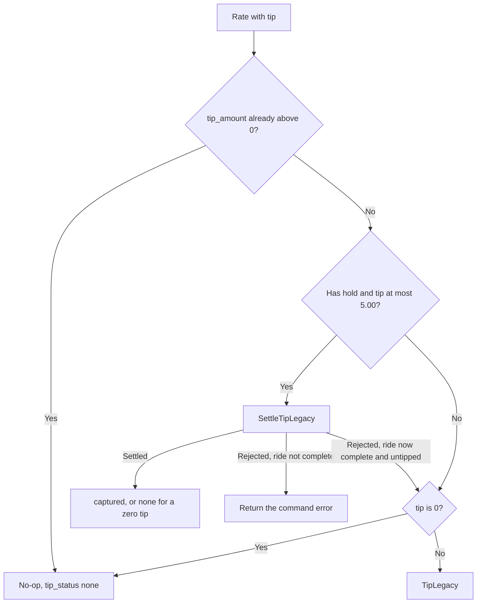

In-app tips ride on the fare's PaymentIntent when they fit inside the $5.00 buffer, and on a second PaymentIntent when they don't. This page traces both paths at the Stripe-call level. Both run as ride operations: `settle_tip` for the in-buffer capture and `tip` for the dedicated charge. See [Ride operation journal](/engineering/payments/ride-operation-journal) for reservation, retries, and quarantine. For the rider-facing rules, see [Tips and earnings](/concepts/tips-and-earnings). For the fare hold itself, see [Ride PaymentIntent lifecycle](/engineering/payments/ride-payment-intents).

## Preconditions

A tip is only considered when all of these hold:

- The ride row has `tips_enabled = true`. The API sets it at `POST /ride/v2/` (`CreateRideV2`) from the `X-Features` header containing `tips` (`features.HasFeature`, case-sensitive).
- The caller of `POST /ride/i/{id}/rate` is the rider. Driver ratings never touch payments.
- The ride is `pending_rider_rating` or `complete`. Any other status returns "Ride is not reviewable".
- `tip_amount` in the body is between 0 and 100.00 (`RatingRequest.Validate` against `models.MaxTip`). `financialTipCents` rejects NaN, infinity, negatives, and anything above `models.MaxTip` again with "Invalid tip", then converts with `math.Round(tip * 100)`.

`GET /ride/i/{id}/tip-options` requires the rider, tips enabled, no `cancel_phase`, and status `pending_rider_rating` or `complete`. It returns fixed presets `[2, 5, 10]` from `models.GetTipOptions`, which ignores the fare. It also returns `tip_amount`, plus `has_tip_payment` and `pending_tip_amount` from `TipSummary`. The summary exposes only whether the rider has a resumable `tip` operation (or a pre-journal intent to adopt) and its frozen amount. It never returns intent IDs, funding, or client secrets.

## Decision tree

`RideService.captureTip` in `internal/service/ride/tip_charge.go` evaluates in this order. "Has hold" means status `pending_rider_rating` with `payment_intent_id` set.


```mermaid
flowchart TD
    A[Rate with tip] --> E{tip_amount already above 0?}
    E -- Yes --> N[No-op, tip_status none]
    E -- No --> F{Has hold and tip at most 5.00?}
    F -- Yes --> G[SettleTipLegacy]
    G -- Settled --> C[captured, or none for a zero tip]
    G -- Rejected, ride not complete --> X[Return the command error]
    G -- Rejected, ride now complete and untipped --> H
    F -- No --> H{tip is 0?}
    H -- Yes --> N
    H -- No --> J[TipLegacy]
```

A rating without a tip on a ride that has a hold still runs `SettleTipLegacy` with 0 cents. That is the capture that settles the fare and completes the ride.

## In-buffer settlement

`SettleTipLegacy` reserves a `settle_tip` operation with the rider as actor. `freezeTipSettlement` requires status `pending_rider_rating`, `tips_enabled`, `tip_amount = 0`, no `tip_payment_intent_id`, a `payment_intent_id`, a `stripe_merchant_id`, a tip window, and a fare above 0. The tip can be at most `models.TipBuffer` ($5.00).

The executor makes one Stripe call, step `capture`:

```text
PaymentIntents.Capture(payment_intent_id, amount_to_capture = fare_cents + tip_cents, final_capture = true)
  Stripe-Account: Rides.stripe_merchant_id
  Idempotency-Key: ride_operation/{operationID}/capture
```

`RideTipSettlementCommands.Finalize` then verifies the capture receipt against the frozen fare and tip and runs `CompleteRideTip`:

```sql
UPDATE "Rides" SET tip_amount = $tip, driver_payout = $fare_plus_tip, status = 'complete'
WHERE id = $ride AND status = 'pending_rider_rating';
```

The ride update, the revision bump, the operation outcome, and the `tip_captured` ride event commit in one transaction. `captureTip` returns `captured` when the settled tip is above 0 and `none` otherwise.

If `SettleTipLegacy` returns an error, `settleBufferedTip` rereads the ride. A ride that isn't `complete` returns the error to the rider. A ride that is now `complete` with `tip_amount = 0` means the sweeper settled the fare between the snapshot and the reservation. A tip above 0 then falls through to a dedicated charge.

## Dedicated tip charge

`TipLegacy` runs for tips above the buffer, tips on rides without a hold, and tips on rides that are already `complete`. It reserves a `tip` operation. `freezeDedicatedTip` requires the caller to be the rider, a driver on the ride, status `complete` or `pending_rider_rating`, `tips_enabled`, `tip_amount = 0`, no `cancel_phase`, and no `tip_payment_intent_id` other than one being adopted.

<Steps>
  <Step title="Freeze the account and funding">
    The account is `Rides.stripe_merchant_id` when the ride has one. Otherwise `GetRidePaymentPreparation` picks the fleet account when the fleet has `has_custom_payouts` and a `stripe_merchant_id`, else the driver's account. Consent must be present: `COALESCE(payment_consent_at, confirm_time)`, `rider_ip_address`, and `rider_user_agent`. With no saved clone, the ride also needs the rider's Stripe customer and `payment_method_id`. Any gap fails the reservation.
  </Step>
  <Step title="Settle the fare first">
    When the ride is still `pending_rider_rating`, the operation captures the fare on the ride's own intent (step `capture`, fare cents). `FinalizeFare` runs `CompleteRideTip` with a zero tip, which sets the ride to `complete`, and resolves the `settle_fare` step. The tip charge can't start until that step has a result.
  </Step>
  <Step title="Clone the payment method">
    Step `clone_payment_method` runs only when the ride has no `cloned_payment_method_id`.
  </Step>
  <Step title="Create the tip intent">
    Step `create_tip` calls `CreateRideTip` with `confirm=false`. The intent ID is stored as the step result. If Stripe rejects the create request with a typed `invalid_request_error` (HTTP 400, no PaymentIntent), the step stores the Stripe request ID instead. The operation then finishes as `failed` with outcome status `rejected`, and nothing is charged.
  </Step>
  <Step title="Confirm">
    Step `settle_dedicated_tip` calls `ConfirmRideTip` on-session with `use_stripe_sdk=true` and the mandate data, so a card challenge comes back as `requires_action` for the mobile SDK.
  </Step>
  <Step title="Finalize">
    A `succeeded` intent finishes the operation as `succeeded`. `RecordCompletedRideTip` writes the tip, and `SetRideTipPaymentIntentID` stores the intent ID. A `canceled` intent finishes it as `failed` and writes nothing to the ride.
  </Step>
</Steps>

`Client.CreateRideTip` parameters (`internal/data/stripe/ride_tip.go`):

| Parameter | Value |
| --- | --- |
| `amount` | Frozen tip cents |
| `currency` | `usd` |
| `capture_method` | `automatic` |
| `confirm` | `false` |
| `payment_method` | The cloned method |
| `automatic_payment_methods` | enabled, `allow_redirects=never` |
| `description` | `Yelo Tip` |
| `metadata` | `type=tip`, `operation_id`, `ride_id`, `rider_id`, `driver_id` |
| Idempotency key | `ride_operation/{operationID}/create_tip` |

`ConfirmRideTip` sends `off_session=false`, `use_stripe_sdk=true`, and online mandate data (`accepted_at`, rider IP, user agent) with the key `ride_operation/{operationID}/settle_dedicated_tip`. It reads the intent first and only confirms one that is still `requires_confirmation`.

`RecordCompletedRideTip` is additive and single-shot:

```sql
UPDATE "Rides" SET tip_amount = $tip, driver_payout = COALESCE(driver_payout, 0) + $tip
WHERE id = $ride AND status = 'complete' AND tip_amount = 0;
```

`applyDedicatedTip` first checks that `driver_payout` still equals the base payout frozen at reservation and that the ride is still untipped. A mismatch is a command conflict.

### What the response carries

`legacyTipResult` in `financial_commands.go` maps the command's progress to `tip_status` for both `rate` and `tip`:

| Progress | `tip_status` | Extra fields |
| --- | --- | --- |
| Outcome `succeeded` | `captured` | — |
| Outcome `canceled` or `rejected` | `canceled` | — |
| No outcome, intent `requires_action` with a client secret | `requires_action` | `tip_client_secret`, `tip_connected_account_id` |
| No outcome and the intent is `processing`, or no secret or account is available | `pending` | — |

The client secret is a live read from Stripe. It is never stored in the journal.

### Authentication window

A tip can wait on the rider. The first time the executor sees `requires_action`, it writes the `authenticate_tip` step. Once 30 minutes have passed since that step's first attempt (`rideTipAuthenticationWindow`), the next attempt records `abandon_tip` and cancels the intent with `requested_by_customer`. A `requires_payment_method` status triggers the same abandonment immediately.

While it waits, the `ride_operation` job snoozes for a minute at a time and a `payment_intent.*` webhook can wake it early. See [Tip snooze](/engineering/payments/ride-operation-journal#tip-snooze).

### Rider tip command

`POST /ride/i/{id}/tip` (`RideService.Tip` in `internal/service/ride/tip.go`) submits or resumes the rider's dedicated tip. It's independent of rating and of the rider's current ride.

1. The caller must be the ride's rider. The ride must have `tips_enabled`, no `cancel_phase`, and status `pending_rider_rating` or `complete`. Anything else returns "Tip unavailable": "This ride is not eligible for tipping."
2. A ride with `tip_amount` above 0 returns `captured` without a command.
3. With `amount` set, `TipAttempt` runs with the client's `operation_id` and `math.Round(amount * 100)` cents. Zero returns "Choose a tip greater than zero." A missing `operation_id` returns "Please retry your tip."
4. With no `amount`, `ConfirmTipLegacy` resumes the rider's latest `tip` operation with its frozen amount, or adopts a pre-journal intent. It never creates a tip.

```json
{ "amount": 7.5, "operation_id": "6f1c2d3e-4b5a-4c7d-9e8f-0a1b2c3d4e5f" }
```

The body never accepts a PaymentIntent ID, and a resume can't replace the frozen funding. `pending` and `requires_action` responses aren't proof of payment.

`TipAttempt` resolves the command in this order:

| Situation | Result |
| --- | --- |
| `operation_id` already exists | Resumes that operation. The reservation checks the actor, ride, and frozen amount. A mismatch returns "Ride Unavailable" |
| The rider has a `tip` operation for the ride that isn't `failed` | Resumes it, regardless of the new ID. Its amount can't change: a different amount returns "Ride Unavailable" |
| No operation, but a pre-journal tip intent exists | Adopts it |
| The rider's previous `tip` operation `failed` | Reserves a new operation with the new ID and amount |

Replaying an old ID never turns a canceled attempt into a new charge.

On a `complete` ride the command doesn't change the ride's status. On a ride that is still `pending_rider_rating`, `freezeDedicatedTip` sets `SettleFare`: the tip must be above `models.TipBuffer`, and the operation captures the fare and moves the ride to `complete` before it charges the tip. A smaller tip, or any tip on a free ride in that status, fails at reservation with a server error ("invalid dedicated tip fare settlement").

Rating a `complete` ride uses a review-only admission (`beginRideReviewCommand`). It ignores unfinished `tip` operations but still blocks on any other pending or quarantined operation (`HasConflictingRideReviewOperation`). On a completed ride, the review publishes participant revisions without bumping the lifecycle revision, so the pending tip's frozen revision stays valid.

### Mobile authentication

The mobile app handles `requires_action` from both endpoints.

- **From ride-complete.** When `rate` returns `requires_action`, `pending`, or `canceled`, the screen marks a handoff in `rideReviewNavigationStore`. `useRideLifecycleNavigation` then replaces the screen with `/tip/ride?rideId=…&resume=1` instead of the map, even if a status push already cleared the current ride. If the rider has moved on to a different current ride, the handoff is dropped.
- **From ride history.** `profile/ride-details` shows **Add a tip** or **Continue tip payment** when `tip-options` succeeds with `tip_amount = 0`, based on `has_tip_payment`.

The `tip/ride` screen rereads `tip-options` before each command. For a new tip it generates `operation_id` with `randomUUID()` and keeps the same ID and amount across uncertain responses. On `requires_action`, `authenticateRideTip` retrieves the intent on `tip_connected_account_id` and calls `handleNextAction` with `stripeReturnURL` (`yelo://stripe-redirect` on iOS, `com.rideyelo://stripe-redirect` on Android). Afterward, even on cancellation, the screen calls `POST /ride/i/{id}/tip` with `{}` and trusts only that result.

| Server result | Screen |
| --- | --- |
| `captured` | "Tip sent. Thank you!" |
| `canceled` | "Payment canceled. No tip was charged. You can try again." Clears the attempt, so the next send uses a new ID |
| Native challenge canceled, tip still unresolved | "Payment canceled. Your tip has not been confirmed. Continue to retry." |
| Anything else | "Your tip has not been confirmed yet. Continue to check or finish payment." |

### Retry identity

`TipLegacy` derives the command ID from the ride, the rider, and the amount (`yelo:ride:tip:{rideID}:{riderID}:{tipCents}`), so a retry with the same amount lands on the same operation.

| Situation | Result |
| --- | --- |
| Same amount again while the tip is unfinished | Resumes the operation and returns its current progress |
| Same amount again after success | Replays the `succeeded` outcome. No second charge |
| Different amount while the rider's latest tip is unfinished or succeeded | Rejected with "Ride Unavailable". The reservation compares the amount |
| Different amount after the latest tip `failed` (intent canceled) | A new operation with the new amount |
| Same amount again after it `failed` | Replays the canceled outcome, `tip_status: canceled` |

### Tips started before the journal

`adoptLegacyTip` handles a ride whose `tip_payment_intent_id` was written by the pre-journal tip flow and whose `tip_amount` is still 0. It reads that intent from Stripe, reserves a `tip` operation around it, and never creates a replacement. The requested amount must equal the intent's amount. See [Adopting an existing tip intent](/engineering/payments/ride-operation-journal#adopting-an-existing-tip-intent).

## Free rides

A free ride has no hold, so every tip on it takes the dedicated path. The payment method is cloned onto the driver's or fleet's account inside the `tip` operation. The ride must have `payment_method_id`, and `ConfirmRide` doesn't require one for free rides, so many free rides can't be tipped.

<Warning>
A free ride can't be tipped while it's `pending_rider_rating`. `freezeDedicatedTip` sets `SettleFare` for every ride in that status, and `validateDedicatedTipAmounts` then requires a fare intent, a fare above 0, and a tip above the buffer ("invalid dedicated tip fare settlement"). The rating request fails with a server error before the rating is saved. A rating without a tip succeeds and moves the ride to `complete`, and a tip sent after that reserves normally.
</Warning>

## Tip-window sweeper

`RideService.AutoCaptureTipWindowExpired` in `tip_capture.go` runs from the `TipCapture` ticker every 5 minutes in `cmd/api/main.go`. It's an in-process loop, so every API instance runs it.

1. `ListRidesWithExpiredTipWindows` selects up to 50 rides with status `pending_rider_rating`, `tips_enabled`, `tip_window_expires_at` in the past, and a `payment_intent_id`, ordered oldest window first.
2. For each: `SettleTipLegacy(rideID, uuid.Nil, 0, true)`. This reserves a system `settle_tip` operation with a zero tip. The reservation rechecks under lock that the window has expired.
3. The operation captures the fare cents and completes the ride with `tip_amount = 0`. It records `tip_window_expired`.

The command ID is derived from the ride alone, so every instance and every tick address the same operation. A failed ride is retried on the next tick, and its `ride_operation` job retries in between. After an hour past its window, each failure logs "ride stuck past tip window for >1 hour, needs manual review" at error level. Before that it logs "failed to auto-capture expired tip window, will retry next run" at warn level.

A ride with a quarantined operation keeps failing here every 5 minutes until someone reconciles that operation.

## Races

A ride has at most one unresolved operation. Every race below resolves at reservation, before any Stripe call.

| Race | Outcome |
| --- | --- |
| Sweeper and an in-buffer rating reserve together | One `settle_tip` wins. The other is rejected as a conflict. If the sweeper won and already finished, the rating falls through to a dedicated tip when the tip is above 0. If the sweeper's operation is still unresolved, the rating returns the error and the rider can retry |
| Two instances sweep the same ride | Same command ID, same operation. The second caller replays the first one's steps and outcome |
| Rider rates twice with the same over-buffer tip after a `requires_action` result | Same operation. The second call returns the current state of the same intent |
| Capture succeeds, then finalization fails | The receipt is already in the journal. The next attempt, from the job or a retry, finalizes without another capture |
| Fare capture, then tip charge, then the fare's `payment_intent.succeeded` webhook | The webhook skips the ride, because it has an operation row. `driver_payout` keeps the fare plus tip written by the finalizers. See [Stripe webhooks](/engineering/payments/webhooks) |

## Where this lives in code

| Concern | Location |
| --- | --- |
| Rate entry point | `yelo-api/internal/service/ride/ride.go` (`Rate`, `GetTipOptions`) |
| Tip routing | `yelo-api/internal/service/ride/tip_charge.go` (`captureTip`, `settleBufferedTip`), `tip.go` (`Tip`), `financial_commands.go` (`legacyTipResult`, `financialTipCents`) |
| Tip attempts and summary | `yelo-api/internal/service/payment/ride_tip_attempt.go` (`TipAttempt`, `TipSummary`) |
| Adapters | `yelo-api/internal/service/payment/ride_legacy_tip_settlement.go`, `ride_legacy_dedicated_tip.go` |
| In-buffer settlement | `yelo-api/internal/service/payment/ride_tip_settlement.go`, `yelo-api/internal/data/repository/ride_tip_settlement.go` |
| Dedicated tip | `yelo-api/internal/service/payment/ride_dedicated_tip.go`, `ride_tip_operation.go`, `yelo-api/internal/data/repository/ride_dedicated_tip.go`, `ride_dedicated_tip_finalize.go` |
| Sweeper | `yelo-api/internal/service/ride/tip_capture.go`, `yelo-api/cmd/api/main.go` (`TipCapture`) |
| Constants | `yelo-api/internal/models/tip.go` (`TipBuffer`, `MaxTip`, `GetTipOptions`) |
| Stripe tip intent | `yelo-api/internal/data/stripe/ride_tip.go` (`CreateRideTip`, `ConfirmRideTip`, `CancelRideTip`, `InspectLegacyRideTip`) |
| SQL | `yelo-api/internal/data/repository/queries/ride_lifecycle.sql` (`CompleteRideTip`, `RecordCompletedRideTip`, `SetRideTipPaymentIntentID`, `ListRidesWithExpiredTipWindows`), `queries/ride_operation.sql` (`GetRideTipSettlementDecision`, `GetDedicatedRideTipDecision`) |
| Feature header | `yelo-api/internal/utilities/features/features.go`, `yelo-frontend/hooks/usePreRideRequest.ts` |
| Rider UI | `yelo-frontend/app/(app)/ride-complete/index.tsx`, `yelo-frontend/app/(app)/tip/ride.tsx`, `yelo-frontend/app/(app)/profile/ride-details.tsx`, `yelo-frontend/components/ride-complete/TipSelector.tsx` |
| Mobile authentication | `yelo-frontend/lib/payments/authenticateRideTip.ts`, `yelo-frontend/lib/payments/stripeRedirect.ts`, `yelo-frontend/stores/rideReviewNavigationStore.ts` |

## Gotchas and edge cases

- **No deadline for late tips.** `Rate` and `Tip` accept `complete` rides, so the API will charge a dedicated tip on any completed tips-enabled ride with `tip_amount = 0`, at any time. The app exposes this from ride history.
- **Sub-minimum tips.** The mobile custom field accepts any positive amount, such as $0.10. Inside the buffer that's fine. As a dedicated charge, Stripe rejects anything under $0.50 at creation. The `tip` operation finishes `failed` with outcome `rejected`, and the response is `tip_status: canceled`.
- **One tip operation at a time.** An unfinished tip pins the amount. The rider can't switch amounts until the first intent succeeds or is canceled.
- **A declined tip returns `canceled`.** A dedicated tip whose intent ends `canceled` returns `tip_status: canceled` with a successful rating.
- **Tip charges aren't enriched.** The earnings activity feed joins on `payment_intent_id`, so a dedicated tip's charge appears as a bare Stripe row without rider name. The tip charge's fee is tracked separately in `tip_stripe_fee_cents` (actual) and `estimated_tip_stripe_fee_cents`, and both are subtracted from the driver's net earnings.
- **`tip_payment_intent_id` is written on success only.** A tip that is waiting on authentication has no trace on the ride row. Look in `RideOperations` and `RideOperationSteps`.
- **Recorded tip source.** Every path records the frozen tip cents. A dedicated tip must also match Stripe's `amount_received`.
- **Presets are fixed.** `GetTipOptions` returns `[2, 5, 10]` for every fare, and the mobile screen falls back to the same presets when the endpoint fails. A $10 preset always exceeds the buffer and takes the dedicated path.
