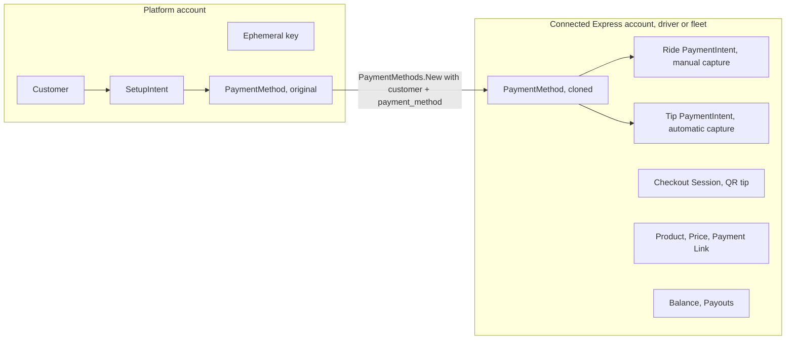

This page is the index for Yelo's Stripe integration. It lists every Stripe object the API touches, the account that owns it, and the Yelo table and column that remembers it. For the product-level money flow, read [Payments and payouts](/concepts/payments-and-payouts) first.

## Account topology

Yelo uses **Stripe Connect with direct charges**. There are two kinds of Stripe accounts in play:

- **The platform account.** Owns rider customers, SetupIntents, ephemeral keys, and the rider's original payment methods. The API authenticates with `STRIPE_API_KEY`, which is a platform key.
- **Connected Express accounts.** One per driver who self-onboards, one per fleet that uses the `fleet_merchant` payment model. Every ride PaymentIntent, tip PaymentIntent, QR Checkout Session, product, price, payment link, balance, and payout lives on one of these.

Every connected-account call sets the `Stripe-Account` header through `params.SetStripeAccount(merchantID)`. No call sets `application_fee_amount` or creates a transfer, so Yelo takes nothing from ride charges on `main`. Because charges are direct, Stripe processing fees are debited from the connected account, not the platform.

## Object map

| Stripe object | Account | Created by | Yelo storage |
| --- | --- | --- | --- |
| Customer | Platform | `RideService.ensureStripeCustomerSetup` on `CreateRide`, only when `Users.stripe_customer_id` is empty | `Users.stripe_customer_id` |
| Ephemeral key | Platform | `Client.NewEphemeralKey`, on every `CreateRide`, pinned to Stripe version `2024-06-20` | Not stored. Returned as `ephemeral_key` |
| SetupIntent | Platform | `Client.NewSetupIntent`, on every `CreateRide` | Not stored. Only the client secret is returned |
| PaymentMethod (original) | Platform | Mobile PaymentSheet, by confirming the SetupIntent | `Rides.payment_method_id` at confirm |
| PaymentMethod (clone) | Connected | `Client.ClonePaymentMethod` at authorization, or at tip time for free rides | `Rides.cloned_payment_method_id` |
| Ride PaymentIntent | Connected | `Client.NewPaymentIntent` from `RideService.processRidePayment` | `Rides.payment_intent_id`, `Rides.payment_intent_client_secret`, `Rides.pre_auth_amount`, `Rides.stripe_merchant_id` |
| Tip PaymentIntent | Connected | `Client.CreateTipPaymentIntent` from `RideService.createTipCharge` | `Rides.tip_payment_intent_id` |
| Express account (driver) | Platform-owned connected account | `Client.CreateExpressAccount` from `StripeAccountService.GetOnboardingLink` | `Users.stripe_merchant_id` |
| Express account (fleet) | Platform-owned connected account | `Client.CreateFleetExpressAccount` from fleet create or unlink | `Fleets.stripe_merchant_id`, `Fleets.stripe_status`, `Fleets.stripe_onboarding_url` |
| Account link | n/a | `Client.GetExpressAccountOnboardingLink` | `Fleets.stripe_onboarding_url` for fleets. Not stored for drivers |
| Login link | n/a | `Client.GetExpressAccountLoginLink` | Not stored |
| Product, Price, Payment Link | Connected (fleet) | `QrPaymentService.CreateConfig` and `UpdatePricing` | `QrPaymentConfigs.stripe_product_id`, `stripe_price_id`, `stripe_payment_link_id`, `stripe_payment_link_url` |
| Checkout Session | Connected (fleet or driver) | `TippingService.createCheckout` | `QrTipVisits.stripe_checkout_session_id` for signed-in tippers, `QrPayments.stripe_session_id` after the webhook |
| Payout | Connected (driver) | `Client.CreatePayout` from `POST /earnings/payouts/instant`, or Stripe's automatic schedule | Not stored |
| Balance transaction | Connected | Stripe | Only the fee: `Rides.stripe_fee_cents`, filled by the drive fee repair job |

<Note>
The `PaymentIntents` table (migration `000017`) is legacy. `PaymentIntentRepository.Create` has no callers, so the table never gets new rows. Webhook handlers still run `UpdatePaymentIntentStatus` against it, which updates zero rows.
</Note>

## Where each ID comes from, per ride

These `Rides` columns carry the whole payment state of a ride:

| Column | Type | Written by | Meaning |
| --- | --- | --- | --- |
| `payment_method_id` | text | `ConfirmRide` | Platform PaymentMethod the rider picked |
| `rider_ip_address`, `rider_user_agent` | text | `ConfirmRide` handler (`network.GetRealIP`, `r.UserAgent()`) | Mandate evidence for off-session charges |
| `confirm_time` | timestamptz | `ConfirmRide`, reset on requeue | Used as the mandate `accepted_at` |
| `payment_consent_at` | timestamptz | `ConfirmRide`, preserved on requeue | Original consent time. Not read by Go code |
| `payment_intent_id`, `payment_intent_client_secret` | text | `AddRidePaymentIntent` | Current ride hold |
| `pre_auth_amount` | real | `AddRidePaymentIntent` | Dollars authorized: fare, plus $5.00 when tips are on |
| `cloned_payment_method_id` | text | `AddRidePaymentIntent` | PaymentMethod on the connected account |
| `stripe_merchant_id` | text | `AddRidePaymentIntent` | Connected account that owns the hold |
| `tip_payment_intent_id` | text | `SetRideTipPaymentIntentID` | Latest dedicated tip charge |
| `tip_amount` | numeric(10,2) | `CompleteRideTip`, `RecordCompletedRideTip` | Tip actually recorded |
| `driver_payout` | real | `Ride.Complete`, tip paths, and the `payment_intent.succeeded` webhook | Gross amount on the connected account for this ride |
| `stripe_fee_cents` | bigint | Drive fee repair job | Stripe fee on the fare charge |

`price` and `discounted_price` are `real` (float4). This matters for cent rounding. See [Ride PaymentIntent lifecycle](/engineering/payments/ride-payment-intents#amount-math).

## The Stripe client

All calls go through `internal/data/stripe` (`stripe-go/v79`, v79.12.0). `cmd/api/main.go` builds the SDK client with `client.API.Init` and an `http.Client` with a **10-second timeout**. The `--stripe-key` flag overrides `STRIPE_API_KEY`. The SDK pins API version `2024-06-20`.

`StripeProvider` in `provider.go` is the interface services depend on. Mocks live in `internal/data/stripe/mocks`.

### Resilience per call

Calls use one of three wrappers. They are not applied consistently, so check this table before relying on one:

| Call | Circuit breaker | Retries | Idempotency key |
| --- | --- | --- | --- |
| `NewPaymentIntent` | Yes | None | None |
| `PartiallyConfirm` (capture with amount) | No | 3 attempts, 100 ms base, 5 s max, full jitter. Skips retry on `charge_already_captured` | None |
| `Confirm` (full capture) | No | `NewCriticalRetrier`, 3 attempts | None. No callers on `main` |
| `CancelPaymentIntent` | No | `NewCriticalRetrier`, 3 attempts | None |
| `GetPaymentIntent` | Yes | None | n/a |
| `CreateTipPaymentIntent` | Yes | None | `tip_{rideID}_{cents}` |
| `ClonePaymentMethod`, `AllowPaymentMethodRedisplay` | No | None | None |
| `NewCustomer`, `NewEphemeralKey`, `NewSetupIntent` | Yes | None | None |
| `CreateExpressAccount`, `CreateFleetExpressAccount`, `DeleteAccount` | Yes | None | None |
| `GetExpressAccount` | Yes. 400, 404, 429, and caller cancellation are excluded from breaker accounting | None | n/a |
| Account links, login links | Yes | None | None |
| `CreatePayout` | Yes | None | `payout:{account}:{method}:{amount}:{minuteBucket}` |
| Balance, payouts list, balance transactions, payout schedule | Yes | None | n/a |
| Product, price, payment link, checkout session | Yes | None | None |

The breaker is a single `gobreaker` instance named `stripe`, shared by every wrapped call (`circuitbreaker.NewSettings`):

- It trips after **5 consecutive failures** and stays open for **60 seconds**. Half-open allows 3 probe requests.
- Every Stripe error counts as a failure unless excluded, including card declines on `NewPaymentIntent`.
- Tripping logs `CIRCUIT_BREAKER_TRIPPING` and posts a Slack alert. See [Integrations](/engineering/api/integrations).

<Warning>
Because the breaker is shared and counts declines, five declined authorizations in a row open the breaker for every wrapped Stripe call for 60 seconds. That includes SetupIntents on new ride requests, account lookups, tip charges, and earnings screens. Capture and cancel calls are not wrapped, so in-flight rides can still settle.
</Warning>

### Retry classification

`NewCriticalRetrier` retries unless the error is a Yelo error of a terminal type, such as input, validation, or not found. Every Stripe error is wrapped with `errors.NewServerErrorFromError`, which has type `server`, so card errors are retried too. `PartiallyConfirm` uses its own `RetryIf` that inspects the raw `*stripe.Error` and only stops on `charge_already_captured`.

## Configuration

| Variable | Default | Used for |
| --- | --- | --- |
| `STRIPE_API_KEY` | none, required | Platform secret key. E2E mode requires an `sk_test_` key |
| `STRIPE_PUBLISHABLE_KEY` | none | Served by `GET /payment/publishable-key` to the mobile app. E2E requires `pk_test_` |
| `STRIPE_WEBHOOK_SECRET` | none | Webhook signature verification |
| `STRIPE_RETURN_URL` | `https://rideyelo.com` | Account link `return_url` for everyone, and the fleet `refresh_url` base |
| `STRIPE_RECONCILIATION_ENABLED` | `true` | Enables the account reconciliation dispatcher |
| `EARNINGS_DEV_OVERRIDE_MERCHANT_ID` | empty | Points every earnings call at one account. Honored only when `ENVIRONMENT` is `dev`, `development`, `local`, or `test` (`earningsOverrideForEnv`) |
| `YELO_WEBSITE_URL` | `https://rideyelo.com` | `business_profile.url` on new Express accounts |

Never commit or paste these values. See [Configuration](/engineering/api/configuration) for how the API loads them.

## Dead and unused surface

The provider exposes methods with no production callers on `main`. Don't assume they're exercised:

- `GetCustomerByEmail`, `NewPaymentMethod`, `AttachPaymentMethod`, `GetPaymentMethods`
- `Confirm` (uncapped full capture)
- `CancelPayout`
- `PaymentIntentRepository.Create` and the `PaymentIntents` table
- `PaymentService.Attached`

## Where this lives in code

| Concern | Location |
| --- | --- |
| Provider interface | `yelo-api/internal/data/stripe/provider.go` (`StripeProvider`) |
| Client construction | `yelo-api/internal/data/stripe/stripe.go` (`NewStripeClient`), `yelo-api/cmd/api/main.go` |
| PaymentIntents, SetupIntents | `yelo-api/internal/data/stripe/intent.go` |
| Customers, ephemeral keys | `yelo-api/internal/data/stripe/customer.go` |
| PaymentMethod clone | `yelo-api/internal/data/stripe/method.go` (`ClonePaymentMethod`) |
| Connected accounts and links | `yelo-api/internal/data/stripe/account.go` |
| Products, prices, links, Checkout | `yelo-api/internal/data/stripe/payment_link.go`, `checkout.go` |
| Balance and payouts | `yelo-api/internal/data/stripe/payout.go` |
| Breaker and retry | `yelo-api/internal/utilities/circuitbreaker/`, `yelo-api/internal/utilities/retry/` |
| Config | `yelo-api/internal/utilities/config/config.go` (`Stripe` struct) |
| Ride payment columns | `yelo-api/internal/data/repository/queries/ride_lifecycle.sql` |

## Gotchas and edge cases

- **Two customers for one rider.** `ensureStripeCustomerSetup` checks `stripe_customer_id` and then creates a customer without a lock or idempotency key. Two concurrent `CreateRide` calls for a new rider can create two customers. The last `SetStripeCustomerId` wins, and PaymentMethods saved against the other customer can't be cloned later.
- **Orphaned SetupIntents.** Every `CreateRide`, including abandoned quotes, creates a SetupIntent and an ephemeral key. Nothing cancels unused SetupIntents.
- **Clones are not attached.** `ClonePaymentMethod` creates a PaymentMethod on the connected account from the platform customer and payment method. It doesn't create a customer on the connected account, so the clone is single-purpose. Tips reuse `cloned_payment_method_id` rather than cloning again.
- **Deleted customers.** `UserService.Delete` deletes the Stripe customer first. If Stripe fails, account deletion fails.
- **Ten-second ceiling.** A Stripe call that takes longer than 10 seconds fails on the Yelo side even if Stripe completes it. For `NewPaymentIntent`, which has no idempotency key, that can leave an authorized hold Yelo never recorded.
