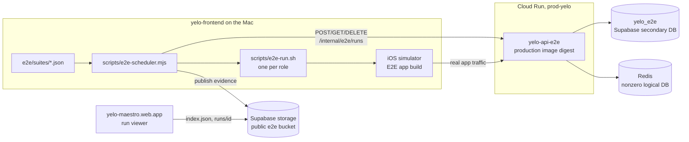

Mobile E2E drives the real iOS app on simulators against an isolated copy of the production API. Every test owns a throwaway fixture of synthetic users, created and deleted through an authenticated control API. This page covers each piece in depth. [Testing](/engineering/testing#mobile-e2e) has the short version, and the [E2E environment reset](/runbooks/e2e-environment-reset) runbook covers recovery.



## The E2E API

The `yelo-api-e2e` Cloud Run service runs the exact image digest currently serving production. `release-e2e.yml` keeps it converged: see [Deployment](/engineering/deployment#e2e-api-convergence). `cloudbuild.e2e.yaml` never rebuilds the API. It builds only a matching migration image, migrates `yelo_e2e`, and deploys the production digest.

### Startup safety checks

The process refuses to start in E2E mode unless every check in `Config.validateE2E` (`internal/utilities/config/config.go`) passes.

| Check | Rule |
| --- | --- |
| Mode | `E2E_ENABLED=true` and `ENVIRONMENT=e2e` must be set together |
| Required values | `DSN`, `KEY`, `E2E_CONTROL_API_KEY`, `E2E_DATABASE_NAME`, `E2E_DATABASE_PROJECT_REF`, `E2E_PRODUCTION_DATABASE_PROJECT_REF` |
| Control key | At least 32 bytes |
| Background jobs | `E2E_BACKGROUND_JOBS_ENABLED` must be false |
| Fixture TTL | `E2E_FIXTURE_TTL` greater than zero and at most 24 hours (default 30 minutes) |
| Database | `DSN` must be a PostgreSQL URL whose database name equals `E2E_DATABASE_NAME`, whose Supabase project ref equals `E2E_DATABASE_PROJECT_REF`, and differs from the production ref. Both `db.<ref>.supabase.co` and pooler usernames are parsed. |
| Redis | Enabled, `redis://` or `rediss://`, and a logical database of 1 or higher |
| Stripe | `STRIPE_API_KEY` starts with `sk_test_` and `STRIPE_PUBLISHABLE_KEY` starts with `pk_test_` |
| Integrations | `CONTACT_SYNC_RESEND_ENABLED` and `GOOGLE_PLAY_RELEASE_MONITORING_ENABLED` false. Twilio, Resend, Photon, Quo, Dub, Slack webhook, and Google or Apple Auth v3 credentials must all be unset. |
| Auth v3 | See [Test, E2E, and internal auth paths](/engineering/identity/test-and-internal-auth#e2e-mode) |

`cmd/api/main.go` skips notification workers, River UI, and mutating background tasks while E2E is enabled. Ride expiry, auto-queue tickers, and push delivery don't run on their own. The fixture API invokes the few production commands a test needs, such as `CancelUnmatchedRides`.

### Deployed configuration

`cloudbuild.e2e.yaml` sets these on the service. Secrets come from Secret Manager with the `yelo-e2e-` prefix.

| Setting | Value |
| --- | --- |
| Environment | `ENVIRONMENT=e2e`, `E2E_ENABLED=true`, `E2E_BACKGROUND_JOBS_ENABLED=false`, `E2E_DATABASE_NAME=yelo_e2e` |
| Scaling | `--min-instances=0`, `--max-instances=2`, `--concurrency=20`. The runner wakes the service before creating fixtures. |
| Observability | `OTEL_ENABLED=false`, `PPROF_ENABLED=false`, `SWAGGER_ENABLED=false` |
| Auth v3 origin | `AUTH_V3_PUBLIC_WEB_ORIGIN` and `AUTH_V3_CORS_ORIGINS` are `https://yelo-maestro.web.app` |
| Redirect allowlist | `yelo-ios` and `yelo-android`, each only `com.rideyelo.e2e://auth/v3/callback` |
| Secrets | `DSN`, `KEY`, `REDIS_URL`, `E2E_CONTROL_API_KEY`, `STRIPE_API_KEY`, `STRIPE_PUBLISHABLE_KEY`, `GOOGLE_MAPS_API_KEY`, `MAPBOX_API_KEY`, and the five `AUTH_V3_*` key secrets |

## Database and baseline seed

`yelo_e2e` is a secondary database in the Yelo development Supabase project. Schema comes only from API migrations. Business data comes only from the fixture API, which deletes it after each test.

The migration job runs `scripts/release/run-migrations.sh` with `E2E_BOOTSTRAP_SUPABASE_SECONDARY_DATABASE=true`. After `migrate up`, the script applies `scripts/release/seed-e2e-baseline.sql`, which the migration image copies to `/usr/local/share/yelo/seed-e2e-baseline.sql`.

The seed is deliberately tiny. It upserts one row in `VehicleTypes`: slug `x`, display name `YeloX`, 1 to 4 seats, active, with `metadata = {"e2e": true}`. It then raises an exception if that row isn't present and active. The API needs an active vehicle type registry at startup, and every fixture fleet uses type `x`.

<Warning>
Don't add scenario rows to the seed. Rows that no run owns leak across tests and never get cleaned up. Extend the fixture API instead.
</Warning>

`E2ERuns` records every fixture. Its `scenario` column has a `CHECK` constraint, extended by migrations `000337_e2e_confirmed_ride`, `000341_e2e_queued_pair`, and `000342_e2e_notification_rider`. Migration `000336_e2e_fixture_school_identity` backfills `is_synthetic = true` on schools referenced by `E2ERuns.school_id`.

## Fixture API

`internal/server/http/router.go` mounts the group at `/internal/e2e` only when `E2E.Enabled` is true, behind `getE2EKeyMiddleware`. Every request needs the header `X-E2e-Key` with the control key. The handlers live in `internal/server/http/e2econtrol`.

| Method and path | Operation ID | Purpose |
| --- | --- | --- |
| `POST /internal/e2e/runs` | `e2e.CreateRun` | Sweep expired runs, then create or return a fixture |
| `GET /internal/e2e/runs/{id}` | `e2e.GetRun` | Read run state, actors, fixtures, and the owned ride |
| `POST /internal/e2e/runs/{id}/ride-transition` | `e2e.TransitionRide` | Advance a ride fixture through a production command |
| `DELETE /internal/e2e/runs/{id}` | `e2e.DeleteRun` | Delete everything the run owns |

### Create a run

The request body is `{"scenario": "...", "idempotency_key": "..."}`. The key is required and at most 200 characters. A repeated key returns the existing run instead of creating a new one.

Before it creates anything, `Create` cleans up to 100 `active` runs whose `expires_at` has passed and marks them `expired`. A sweep failure is only logged.

Creation runs in one transaction. Every scenario gets:

| Row | Values |
| --- | --- |
| `Communities` | Named `E2E <run prefix>`, bounds 37.30 to 37.40 latitude and -122.10 to -121.90 longitude, `is_active`, `is_test`, primary fleet set, primary vehicle type `x` |
| `Fleets` | `E2E Fleet <run prefix>`, `owner_operator`, `stripe_status = 'not_required'`, type `x` |
| `Schools` | `is_synthetic = true`, extension `e2e.invalid` |
| `RidePriceParameters` and one `RidePriceTiers` row | `per_ride`, base $3.00, $0.50 per minute, $2.00 per mile, featured |
| Rider in `Users` | `E2E Rider`, `rider-<run id>@e2e.invalid`, verified, terms agreed, `is_test`, `profile_completed`, `account_type = 'student'`, graduation year 2030, referral code `e2er<28 hex>` |

Pair scenarios add a driver: `E2E Driver`, with a complete and active `DriverApplications` row, a 2025 Yelo E2E `Vehicles` row of type `x` with plate `E2E<4 hex>` in CA, and `FleetDrivers` and `FleetVehicles` rows.

Phones are deterministic: `+1555` plus seven digits from an FNV-32a hash of the run ID and role (`testPhoneForRole`). The response returns `run_id`, `api_revision`, `scenario`, `status`, `created_at`, `expires_at`, `actors.rider`, `actors.driver` when present, and `fixtures` (`community_id`, `school_id`, `fleet_id`, `vehicle_id`).

### Scenarios

| Scenario | Actors | Initial state | Supported transitions |
| --- | --- | --- | --- |
| `auth_existing_rider` | Rider | Idle | none |
| `auth_rider_driver_pair` | Rider, driver | Both idle | `prepare_assignment`, `accept`, `prepare_idle_assignment`, `auto_assign`, `prepare_idle_queue`, `recover_idle_queue` |
| `ride_confirmed_rider` | Rider | One free, unassigned `confirmed` ride from `E2E Pickup` to `E2E Destination`. `metadata.ride_id` records it. | none |
| `ride_queued_pair` | Rider, driver, plus a fixture-only `Active Rider` | The driver is online with an open `DriverSessions` row and serves a free `in_progress` ride for the active rider. The main rider's confirmed ride is `queued` to that driver with pickup PIN `1234`. No Redis queue state is written, so the app must rebuild the queue from the database. | none |
| `ride_notification_rider` | Rider | Idle, so the app can request notification permission first | `prepare`, `expire` |

### Ride transitions

`POST /runs/{id}/ride-transition` with `{"action": "..."}`. Each action locks the run row and checks that the run is `active`, unexpired, of the right scenario, and that its actors are `is_test` users in the run's community.

<AccordionGroup>
  <Accordion title="Notification fixture: prepare and expire">
    - `prepare` creates the free confirmed ride and bumps the rider's `ride_state_revision` in the same transaction, so the already-signed-in app sees the new ride.
    - `expire` requires a prepared ride. It sets that ride's `confirm_time` to `RideRequestExpiry` plus one second in the past, only if the ride is still confirmed, unassigned, unpaid, and free. After commit it calls the production `CancelUnmatchedRides`. The production lifecycle and notification transactions do the cancellation.
  </Accordion>
  <Accordion title="Pair fixture: assignment actions">
    - `prepare_assignment` creates a confirmed, unassigned ride for the rider, puts the driver online serving an in-progress ride for a new active rider, and bumps both users' revisions.
    - `prepare_idle_assignment` does the same, then completes the driver's active ride and sets `auto_queue = true`, so the driver is idle and auto-queue eligible.
    - `prepare_idle_queue` also seeds the ride as `queued` and `auto_queued` to the driver's open session, simulating a stranded idle queue.
    - `accept` calls the production `RideService.AcceptRide` as the driver.
    - `auto_assign` calls `RideService.AutoAssignRide`.
    - `recover_idle_queue` calls `RideService.RecoverIdleQueue`.

    Before a service call, the handler checks that the ride is still free, unpaid, and either confirmed and unassigned or, for `recover_idle_queue`, queued to this driver.
  </Accordion>
</AccordionGroup>

### Cleanup

`DELETE` runs one transaction and is idempotent. An already `cleaned` or `expired` run returns as is.

<Steps>
  <Step title="Lock owned rides">
    Selects rides whose ID is in `metadata.ride_id` or `metadata.active_ride_id`, or any `requested` unassigned ride, only where the rider is the run's rider or active rider, the rider is `is_test`, and the community is `is_test`. Unconfirmed drafts created by the real app after setup are included.
  </Step>
  <Step title="Delete ride data">
    `RideEvents`, `RideCancellationQuotes`, `RideNotifications`, `RideMessages`, `RideDeclineReasons`, then `Rides`. Financial journal rows are not deleted, so a run that created one fails cleanup visibly.
  </Step>
  <Step title="Delete auth and actors">
    The active fixture rider, `AttributionTouches` and `AuthTransactions` found through the actors' `AuthPhoneAttempts`, driver sessions and application, the vehicle, and both users.
  </Step>
  <Step title="Delete shared fixtures">
    The school, `FleetCommunityServiceHistory` and `FleetCommunityServices` for this fleet and community, the fleet, then the community.
  </Step>
  <Step title="Mark the run">
    Sets `status` to `cleaned` (or `expired` from the sweep), sets `cleaned_at`, and nulls every foreign key.
  </Step>
</Steps>

### Add a scenario

<Steps>
  <Step title="Extend the constraint">
    Add a migration that drops and re-adds `E2ERuns_scenario_check` with the new value. Keep the down migration additive so historical rows stay valid.
  </Step>
  <Step title="Extend the handler">
    Add the constant, accept it in `Create`, create its rows inside the create transaction, and record any ride IDs in `metadata`. Make sure cleanup finds every row the scenario or the app can create.
  </Step>
  <Step title="Test it">
    Add a case to `fixtures_integration_test.go` that creates two fixtures side by side and cleans each twice.
  </Step>
  <Step title="Ship it">
    The scenario is usable only after a production release, because the E2E service runs the production image. Then reference it from a suite.
  </Step>
</Steps>

## The E2E app

| Aspect | Value |
| --- | --- |
| Bundle ID | `io.flutterflow.ridedesi.desirider.e2e` |
| EAS profile | `e2e-simulator`: internal distribution, channel `e2e`, EAS environment `preview`, iOS simulator build, Android APK |
| Build env | `EXPO_PUBLIC_APP_ENV=e2e`, `EXPO_PUBLIC_API_URL` set to the E2E Cloud Run URL, `EXPO_PUBLIC_E2E_AUTH_ORIGIN=https://yelo-maestro.web.app`, `EXPO_PUBLIC_DISABLE_ANIMATIONS=true` |
| API guard | `lib/config.ts` throws unless an E2E build's API URL is HTTPS, has no credentials, path, query, or fragment, and isn't the production API |
| Auth | Native Auth v3 screens and the `com.rideyelo.e2e` callback scheme |

## Flows and suites

### Flows

Each `.ad` file in `e2e/flows` is a deterministic agent-device program for one role. The runner injects these variables:

| Variable | Scope |
| --- | --- |
| `APP_ID`, `APP_URL_SCHEME`, `E2E_RUN_ID`, `E2E_ROLE`, `ACTOR_ID`, `ACTOR_PHONE`, `ACTOR_PHONE_DISPLAY`, `RIDER_ID`, `RIDER_PHONE`, `RIDER_PHONE_DISPLAY` | Every role |
| `DRIVER_ID`, `COMMUNITY_ID`, `SCHOOL_ID`, `FLEET_ID`, `VEHICLE_ID` | When the fixture has them |
| `AD_ARTIFACTS` | Evidence directory |

`APP_URL_SCHEME` comes from the built app's `Info.plist`, so deep-link flows such as `${APP_URL_SCHEME}://ride/4-ride` use whatever scheme the binary actually registered.

Every flow signs in through the real screens: `get-started`, `method-phone`, `phone-input`, `continue`, then `otp-input` with `12345`. `auth-existing-actor.ad` then waits for `home-action-bar`, `location-gate-enable`, or `where-to`.

### Suites

A suite is a JSON manifest with `schemaVersion: 1`, a `name`, a list of `tests`, and an optional `coverageCatalog`. Each test has a unique `id`, a `scenario`, and one to ten `roles`, each with `name`, `actor`, `flow`, and optional `startDelayMs` or `startAfterTransition`. Tests can also declare:

- `freshDeviceState: true` to erase and reinstall the leased simulators before the fixture is created. Use it when the flow depends on OS state, such as notification permission or URL hand-off approval.
- `rideTransitions`: an ordered list of `{role, action, afterScreenshot, notification}`. The scheduler calls the transition after the role writes `afterScreenshot`. With `notification`, it injects the payload from `e2e/notifications/*.json` into the simulator only after the transition commits.

| Suite | Tests | Scenarios |
| --- | --- | --- |
| `core-smoke.json` | Cold launch, existing rider auth, rider and driver auth | `auth_existing_rider`, `auth_rider_driver_pair` |
| `ride-recovery.json` | Confirmed ride restart and abort, then cancel | `ride_confirmed_rider` |
| `ride-link-recovery.json` | Six stale and root deep links, warm and cold, confirmed and canceled | `ride_confirmed_rider` |
| `ride-notification-smoke.json` | Canceled tap, auto-expiry tap, queued-assignment tap | `ride_confirmed_rider`, `ride_notification_rider`, `auth_rider_driver_pair` |
| `ride-autoqueue.json` | Idle auto-queue becomes active, stranded queue recovers, arrival across a restart | `auth_rider_driver_pair` |
| `ride-pickup.json` | Arrival, valid PIN, invalid PIN, PIN recovery | `ride_queued_pair` |
| `ride-queue-promotion.json` | Driver completes or cancels, and the queued rider is promoted | `ride_queued_pair` |
| `ride-queued-cancellation.json` | Queued rider cancels while the driver keeps the active ride | `ride_queued_pair` |
| `ride-queued-recovery.json` | Queued cache recovery on restart, legacy link warm and cold | `ride_queued_pair` |
| `ride-driver-requeue.json` | Driver cancels before pickup | `ride_queued_pair` |
| `ride-coordinate-stops.json` | Addressless POI ride options | `auth_existing_rider` |

`e2e/suites/ride-notification-regressions.md` is a plan, not a runnable suite.

### Scheduler

`scripts/e2e-scheduler.mjs` drains a suite with up to `E2E_MAX_DEVICES` simulators (at most 10):

1. It takes a worktree lock at `.expo/e2e-suite.lock`, so only one scheduler runs per worktree.
2. It starts the earliest queued test whose full role set fits. Smaller tests can backfill idle slots, and a large test never starts partially.
3. It creates the fixture, starts one `scripts/e2e-run.sh` per role with its own simulator, agent-device session, and recording, and runs the roles concurrently. Recorder startup is briefly serialized because CoreSimulator rejects bursts.
4. It deletes the fixture, then resets each device: app reinstall, keychain reset, known location and permission grants, and XCTest cleanup.
5. It returns the slots and writes the aggregate manifest.

### Evidence

Each run writes `.artifacts/e2e/<run-id>/`, with roles under `scenarios/<index>-<test-id>/<role>/`. A run passes only with an MP4, at least one PNG, a non-empty timeline, JUnit XML, and a manifest. Missing evidence, a failed fixture, a failed role, or a failed cleanup fails the scenario and the aggregate.

A suite with `coverageCatalog` (such as `e2e/coverage/ride-workflows.json`) also gets `workflow-coverage.json`. A case counts as verified only when its mapped test passed, every role ran exactly once with complete evidence, and the reported app and API revisions match. Local builds write `<archive>.provenance.json` with source and bundle hashes. Runs on archives without provenance can't earn coverage credit.

## Evidence viewer

The `maestro` site in `yelo-web` (`src/sites/maestro`) is the viewer, deployed to `https://yelo-maestro.web.app`. The hostname is historical: no Maestro runs anywhere.

- `App.tsx` lists runs from `<ARTIFACT_ROOT>/index.json` with **all**, **failed**, and **passed** filters. Pins are stored in `localStorage` under `e2e-report:pins`.
- `?run=<run-id>` opens `RunViewer`, which loads `<ARTIFACT_ROOT>/runs/<run-id>/` and shows each test and role's recording beside a searchable action log that seeks the video.
- `WorkflowCoverage.tsx` shows mapped and verified percentages.
- `ARTIFACT_ROOT` is `VITE_E2E_ARTIFACT_BASE_URL` when set, otherwise `<VITE_SUPABASE_URL>/storage/v1/object/public/e2e`.
- The site also serves `/auth/v3`, a copy of the hosted Auth v3 page built against `VITE_E2E_API_URL` with the `com.rideyelo.e2e` scheme. Its `firebase.json` sets `no-store` and a strict CSP for that path. See [Sites](/engineering/web/sites#maestro).

The bucket is public. Publish only synthetic runs.

## Test accounts

There are no persistent E2E accounts. Each test gets new actors from its fixture:

- Phone `+1555` plus seven digits, derived from the run ID and role. Enter it through the real phone screen. `ACTOR_PHONE_DISPLAY` holds the formatted value.
- OTP `12345`. Twilio is never called for `+1555` numbers. See [Test, E2E, and internal auth paths](/engineering/identity/test-and-internal-auth#reserved-phone-numbers).
- Drivers arrive approved, active, in a fleet, and with a vehicle. Tests never walk driver onboarding.
- Auth v3 rate limits are multiplied by 100 in E2E mode, so parallel sign-ins don't trip them.

## Run it

<Tabs>
  <Tab title="Locally">
    Prerequisites: Xcode with an iOS runtime, `jq`, `ffmpeg`, `pnpm install`, Expo login for a new build, and a `gcloud` identity that can read `yelo-e2e-control-api-key` in `prod-yelo`.

    ```bash
    make e2e-doctor
    make pool-status
    make e2e-build-local
    make e2e-local FLOW=e2e/flows/auth-existing-actor.ad

    # One driver flow against a pair fixture
    E2E_SCENARIO=auth_rider_driver_pair E2E_ACTOR_ROLE=driver E2E_ROLE=driver \
      make e2e-local FLOW=e2e/flows/my-driver-flow.ad

    make e2e-suite-local SUITE=e2e/suites/ride-pickup.json MAX_DEVICES=4
    make e2e-signoff SUITE=e2e/suites/core-smoke.json MAX_DEVICES=8
    ```

    | Variable | Effect |
    | --- | --- |
    | `E2E_APP_PATH` | Use this `.app` instead of building |
    | `E2E_AUTO_BUILD=0` | Don't build. Use with a supplied archive. |
    | `E2E_BUILD_PROVENANCE` | Provenance record for a supplied `.app` |
    | `E2E_OPEN_SIMULATOR=1` | Show the simulators |
    | `E2E_KEEP_DEVICES_BOOTED=1` | Leave simulators booted for debugging |
    | `E2E_SKIP_INSTALL=1` | Skip install. Still requires `E2E_APP_PATH` when a fixture is used. |

    Clean builds are cached by Git SHA under `~/.cache/yelo-e2e-builds`. Edits limited to flows, suites, runner scripts, and E2E docs can reuse a cached ancestor. App changes force an exact build.
  </Tab>
  <Tab title="GitHub Actions">
    **Mobile E2E** (`e2e-agent-device.yml`) is manual only and never a merge gate. It shares one concurrency group, `mobile-e2e-publish`, and doesn't cancel in-progress runs.

    | Input | Options | Default |
    | --- | --- | --- |
    | `runner` | `self-hosted`, `github-hosted` (paid) | `self-hosted` |
    | `app_source` | `local`, `eas` | `local` |
    | `app_url` | EAS simulator archive URL | blank: build the commit |
    | `mode` | `flow`, `schedule` | `schedule` |
    | `flow` | Flow file or directory | `e2e/flows` |
    | `suite` | Suite path | `e2e/suites/core-smoke.json` |
    | `max_devices` | 1 to 10 | 8 |

    ```bash
    gh workflow run e2e-agent-device.yml --repo rideyelo/yelo-frontend --ref main \
      -f runner=self-hosted -f app_source=local -f mode=schedule \
      -f suite=e2e/suites/core-smoke.json -f max_devices=8
    ```

    The self-hosted runner has labels `self-hosted`, `macOS`, `ARM64`, and `yelo-e2e`. Run one runner process only. Artifacts upload as `e2e-<github-run-id>` for 14 days.

    Repository configuration: variables `E2E_API_URL`, `E2E_ARTIFACT_SUPABASE_URL`, and `E2E_VIEWER_URL`, and secrets `EXPO_TOKEN`, `E2E_CONTROL_API_KEY`, and `E2E_ARTIFACT_SUPABASE_SECRET_KEY`.
  </Tab>
  <Tab title="Against the API directly">
    ```bash
    curl -sS -X POST -H "X-E2e-Key: $E2E_CONTROL_API_KEY" \
      -H 'Content-Type: application/json' \
      -d '{"scenario":"auth_rider_driver_pair","idempotency_key":"manual-<unique>"}' \
      "$E2E_API_URL/internal/e2e/runs"

    curl -sS -H "X-E2e-Key: $E2E_CONTROL_API_KEY" "$E2E_API_URL/internal/e2e/runs/<run-id>"
    curl -sS -X DELETE -H "X-E2e-Key: $E2E_CONTROL_API_KEY" "$E2E_API_URL/internal/e2e/runs/<run-id>"
    ```

    Delete what you create. An abandoned run is cleaned only by the next `POST` after its TTL.
  </Tab>
</Tabs>

Before you hand off a runner change, run `node --test scripts/e2e-resource-queue.test.mjs` and `make check`. `make test` already runs all nine `scripts/e2e-*.test.mjs` suites.

## Reset

Follow the [E2E environment reset](/runbooks/e2e-environment-reset) runbook. In short:

| Stuck part | Fix |
| --- | --- |
| Leaked fixture | `DELETE /internal/e2e/runs/{id}`, or wait for the next create after the TTL |
| Simulator leases | `make pool-clean` for dead worktrees, `make pool-reset` for the whole machine |
| Suite lock | Confirm the PID in `.expo/e2e-suite.lock` is dead, then delete the file |
| API drift | `gh workflow run release-e2e.yml --repo rideyelo/yelo-api --ref main` |
| Wrong app | `make e2e-build-local` |

## Authoring rules

- Drive real controls. Don't add test-only UI, session injection, or deep-link authentication.
- Prefer stable `testID`s, then stable text. Use a recorded coordinate only for a real control hidden by native accessibility, and comment why.
- Wait for the next meaningful state instead of sleeping. `startDelayMs` only staggers startup.
- Give `BottomSheetModal` `accessible={false}` so inner `testID`s reach UI Automation. `YeloGlassView` can hide children.
- Capture a success screenshot for every role.
- Keep retries at zero. A flake is a failure to diagnose.

## Gotchas and edge cases

- **Workers are off.** The shared E2E API can't test ride expiry, auto-queue, push delivery, or any River job except through a fixture transition. Unreleased workers need an isolated candidate deployment.
- **E2E follows production, including rollbacks.** A new scenario works only after its migration and handler are released. After a rollback across a migration, convergence fails until production is back on the newest version.
- **Idempotency keys are forever.** A repeated key returns the old run, even if it's `cleaned`. Use a unique key per attempt.
- **Assignment transitions on the wrong run return 500.** `transitionAssignment` wraps `pgx.ErrNoRows` in `fmt.Errorf` when the run isn't an active pair (`assignment_transition.go:34`). The expiry path maps the same case to 404.
- **Fixture coordinates are fixed.** Riders are inserted at latitude and longitude 0, drivers at the fixture school (37.3349, -122.0090), and fixture rides run between `1 Test Way` and `2 Test Way` near that point.
- **In-repo docs lag the code.** `yelo-api/docs/E2E_CONTROL_PLANE.md` and `yelo-frontend/E2E.md` list three scenarios and old migration numbers. `e2e/README.md`'s suite example uses `ride_rider_driver_pair`, which the API rejects. Trust `Handler.Create` and the constraint migrations.

## Where this lives in code

| Concern | Path |
| --- | --- |
| Config validation | `yelo-api/internal/utilities/config/config.go` (`validateE2E` and helpers) |
| Route mount and key middleware | `yelo-api/internal/server/http/router.go`, `middleware.go` |
| Fixture handlers | `yelo-api/internal/server/http/e2econtrol/routes.go`, `ride_fixture.go`, `queued_fixture.go`, `ride_transition.go`, `assignment_transition.go` |
| Fixture tests | `yelo-api/internal/server/http/e2econtrol/*_integration_test.go` |
| Baseline seed and migration runner | `yelo-api/scripts/release/seed-e2e-baseline.sql`, `run-migrations.sh` |
| Deploy | `yelo-api/cloudbuild.e2e.yaml`, `.github/workflows/release-e2e.yml` |
| Background job switch | `yelo-api/cmd/api/main.go` |
| Flows, suites, catalog | `yelo-frontend/e2e/` |
| Runner | `yelo-frontend/scripts/e2e-*.mjs`, `e2e-run.sh`, `e2e-local.sh` |
| Workflow | `yelo-frontend/.github/workflows/e2e-agent-device.yml` |
| Build profile and API guard | `yelo-frontend/eas.json`, `yelo-frontend/lib/config.ts` |
| Viewer | `yelo-web/src/sites/maestro/` |
