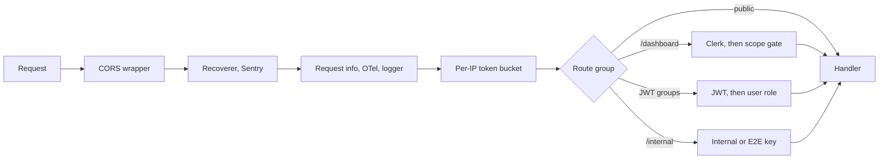

This page lists every route that `yelo-api` serves on `main`, grouped by area. For each route it gives the credential the router requires, the role or dashboard scope that must match, and any ownership check the handler or service performs after that. How each credential is minted and validated is covered in [Authentication](/engineering/api/authentication). The fleet-manager slice of the dashboard is covered in more depth in [Fleet manager authorization](/engineering/fleets/dashboard-authorization).

<Note>
The router is the source of truth, not the OpenAPI spec. Dashboard routes carry no security scheme in `openapi.json`, `/dashboard/pricing/overview` and `/dashboard/pricing/preview` are labeled `JWT` even though they use Clerk, and hidden routes (`option.Hide()`) and raw mux mounts are absent. Everything below comes from `internal/server/http/router.go` and the handlers it registers.
</Note>

## Mechanisms

| Label | Credential | Middleware or check | Rejection |
| --- | --- | --- | --- |
| **None** | Nothing | Global middleware only | Not applicable |
| **Webhook signature** | Provider signature header | Verified inside the handler | 401, or 500 for Stripe |
| **Internal key** | `X-Internal-Key` equal to `INTERNAL_API_KEY` | `getInternalKeyMiddleware`, constant-time compare, fails closed when unset | 401 |
| **E2E key** | `X-E2e-Key` equal to `E2E_CONTROL_API_KEY` | `getE2EKeyMiddleware`. Group mounted only when `E2E_ENABLED=true` | 401, or 404 when not mounted |
| **Metrics token** | `Authorization: Bearer` equal to `METRICS_AUTH_TOKEN` | `metricsAuthMiddleware`. Routes mounted only when the token is set | 401, or 404 when not mounted |
| **User JWT** | App JWT with role `user` | `getValidateJWTMiddleware` then `getRequireRoleMiddleware(["user"])`. Rejects deleted and banned users through `AuthCache` | 401 |
| **Presignup or user JWT** | Presignup JWT or app JWT | `getValidatePresignupTokenMiddleware`. Checks signature and expiry only, not deleted or banned status | 401 |
| **Optional JWT** | App JWT if present | `getOptionalAuthMiddleware`. Never rejects. Invalid, deleted, or banned callers continue anonymously | Never |
| **Onboarding token** | Auth v3 onboarding JWT | `ValidateOnboardingTokenMiddleware`, separate key `AUTH_V3_ONBOARDING_JWT_KEY` | 401 |
| **Clerk** | Clerk session JWT | `getClerkAuthMiddleware`, then `getDashboardScopeMiddleware` on `/dashboard` | 401 with no body |
| **Clerk role gate** | Clerk session with listed role | `getRequireClerkRoleMiddleware(roles)` | 401 without a session, 403 for the wrong role |
| **GitHub OIDC** | GitHub Actions OIDC token | `vehiclecatalog` verifier | 401 or 403 |

Global middleware order is set in `router()` and `Serve()`: `enableCORS` wraps the whole mux, then `Recoverer`, Sentry (when configured), `contextSetRequestInfo`, `otelInstrumentation`, `contextSetLogger`, and `rateLimit`. Raw mux mounts (`/metrics`, `/debug/pprof/`, `/riverui/`, and the disabled `/authv3` stub) bypass the Fuego middleware chain and only get CORS.

## Dashboard scope

`dashboardScopeAllows` in `dashboard_scope.go` runs on every `/dashboard` request after Clerk. It is a path allowlist:

| Role | Requirement | Allowed paths |
| --- | --- | --- |
| `admin` | None | Everything |
| `intern` | Valid `community_id` claim (called C below) | `GET /dashboard/rides`. `/dashboard/leads/drivers/*`. `GET /dashboard/community/C/cancellations*` and `uncompletes*`. `/dashboard/communities/C/events/*` and `locations/*` with any method. `GET /dashboard/communities/C/feed`, `zones`, `map/*`. `/dashboard/C/top-locations/*` with any method. `GET /dashboard/C/` plus one of `kpis`, `drivers`, `demographics`, `fleets`, `users`, `search-insights`, `search-map-data`. |
| `fleet` | At least one assignment with valid fleet and community UUIDs | See [Layer 1](/engineering/fleets/dashboard-authorization#layer-1-scope-middleware) |
| Anything else, including `operator` and empty | Not applicable | Nothing |

An intern's community is always forced to the claim: `ResolveDashboardCommunity` ignores the requested value for interns. In the tables below, **Admin** means only `admin` passes the scope gate, and handlers may add stricter rules.

## Route matrix

<AccordionGroup>
  <Accordion title="Health, system, and tooling">
    | Method | Path | Auth | Role or scope | Handler checks |
    | --- | --- | --- | --- | --- |
    | GET | `/healthcheck` | None | | |
    | GET | `/healthcheck/deep` | None | | Pings Postgres on every call. Returns environment, pool stats, disk, and runtime memory |
    | GET | `/error` | None | | Hidden. Always returns a sample server error |
    | POST | `/score-driver` | None | | Hidden. Computes a matching score from the request body |
    | GET | `/update-required` | None | | Compares `version` with the minimum app version |
    | GET | `/redirect` | None | | Deep link, then App Store fallback page |
    | GET | `/swagger`, `/swagger/openapi.json` | None | | Fuego serves both whenever OpenAPI is enabled. `SWAGGER_ENABLED` only changes a startup log line |
    | GET | `/metrics` | Metrics token | | Mounted only when `METRICS_AUTH_TOKEN` is set |
    | GET | `/debug/pprof/*` | Metrics token | | Mounted only when `METRICS_AUTH_TOKEN` is set and `PPROF_ENABLED=true` (default false) |
    | POST | `/riverui/session` | Clerk (header) | `admin` role gate | Copies the bearer token into a 60-second `__session` cookie scoped to `/riverui` |
    | ANY | `/riverui/*` | Clerk (`__session` cookie) | `admin` role gate | Mounted only when River UI is configured |
    | GET | `/oauth/google-calendar/callback` | None | | Hidden. Requires exactly one `state`. The service validates the stored OAuth flow |
    | POST | `/mobile-vehicle-catalog` | GitHub OIDC | | Hidden. Token must be RS256 from GitHub, for `rideyelo/yelo-frontend` on `refs/heads/main` via `workflow_dispatch`, from `ota-promote.yml` (environment `ota-production`) or `finalize-app-store-release.yml` (environment `yelo-bot`). Body capped at 20 MB |
    | ANY | `/authv3`, `/authv3/*` | None | | Only when `AUTH_V3_ENABLED` is false. Always returns 503 `AuthV3Unavailable` |
  </Accordion>

  <Accordion title="Webhooks">
    | Method | Path | Auth | Handler checks |
    | --- | --- | --- | --- |
    | POST | `/stripe-webhook` | Webhook signature | `webhook.ConstructEvent` with `STRIPE_WEBHOOK_SECRET`. Unset secret or bad signature returns 500. See [Stripe webhooks](/engineering/payments/webhooks) |
    | POST | `/appstore-webhook` | Webhook signature | HMAC-SHA256 of the body against `X-Apple-Signature` with `APP_STORE_WEBHOOK_SECRET`. Unset secret returns 500. Body capped at 64 KB |
    | POST | `/twilio-webhook` | Webhook signature | Twilio request validator on the reconstructed public URL and form params, keyed by `TWILIO_AUTH_TOKEN`. Missing token or header fails |
    | POST | `/twilio-verify-events` | Webhook signature | Twilio body validator with `TWILIO_AUTH_TOKEN`, plus basic auth when `TWILIO_EVENTS_WEBHOOK_USER` and `TWILIO_EVENTS_WEBHOOK_PASSWORD` are both set |
  </Accordion>

  <Accordion title="Internal and E2E">
    | Method | Path | Auth | Handler checks |
    | --- | --- | --- | --- |
    | GET | `/internal/context/user` | Internal key | Looks up any user by `phone` or `user_id`. Returns profile, test and ban flags, and driver progress |
    | POST | `/internal/e2e/runs` | E2E key | Creates fixture actors with `+1555` numbers |
    | GET | `/internal/e2e/runs/{id}` | E2E key | |
    | POST | `/internal/e2e/runs/{id}/ride-transition` | E2E key | Drives ride state through the real services |
    | DELETE | `/internal/e2e/runs/{id}` | E2E key | Deletes the run's fixtures and their auth transactions |
  </Accordion>

  <Accordion title="Auth v2">
    | Method | Path | Auth | Handler checks |
    | --- | --- | --- | --- |
    | POST | `/authv2/phone/request-otp` | None | Durable per-requester and global send limits when Auth v3 is enabled. Redis cooldown |
    | POST | `/authv2/phone/verify-otp` | None | 5 failed verifies delete the code |
    | POST | `/authv2/email/verify-oauth`, `/authv2/email/request-otp`, `/authv2/email/verify-otp` | Presignup or user JWT | Uses the phone and user ID from the token claims |
    | POST | `/authv2/community/verify-oauth`, `/authv2/community/request-email-otp`, `/authv2/community/verify-email-otp` | Presignup or user JWT | Same |
    | POST | `/authv2/profile/setup`, `/authv2/profile/draft`, `/authv2/referral-source` | Presignup or user JWT | Same |
    | GET | `/authv2/status` | Presignup or user JWT | Reports `deleted` for a deleted account instead of rejecting |

    Limits are detailed in [Phone OTP and abuse controls](/engineering/identity/phone-otp-and-rate-limits#auth-v2-legacy-limits).
  </Accordion>

  <Accordion title="Auth v3">
    All routes exist only when `AUTH_V3_ENABLED=true`. `FunnelContextMiddleware` runs on the whole group.

    | Method | Path | Auth | Handler checks |
    | --- | --- | --- | --- |
    | GET | `/authv3/config` | None | Durable limit `configuration` |
    | POST | `/authv3/authorize` | None | Durable limit `authorize`. Redirect URI must match `AUTH_V3_CLIENT_REDIRECT_ALLOWLIST` |
    | POST | `/authv3/transaction/resume`, `/authv3/transaction/accept` | None | Request secret (`Authorization: AuthV3 ...`). Shared durable limit `accept` |
    | POST | `/authv3/providers/google/start`, `/authv3/providers/apple/start`, `/authv3/providers/apple/native` | None | Request secret (`Authorization: AuthV3 ...`). Durable limit `provider_start` |
    | GET | `/authv3/providers/google/callback` | None | HMAC-signed state (`AUTH_V3_STATE_HMAC_KEYS`). Durable limit `provider_callback` |
    | POST | `/authv3/providers/apple/callback` | None | Same |
    | POST | `/authv3/providers/phone/send`, `/authv3/providers/phone/verify` | None | Request secret, durable HTTP limits, and per-transaction, per-number, and per-requester phone limits |
    | POST | `/authv3/token` | None | One-time handoff code. Durable limit `token` |
    | POST | `/authv3/session/refresh`, `/authv3/session/logout` | Refresh cookie `__Host-yelo_refresh` | Rotating session. No HTTP limit |
    | GET | `/authv3/status` | Onboarding token | Token is bound to one user and one transaction |
    | POST | `/authv3/profile`, `/authv3/community/resolve` | Onboarding token | Same |
    | POST | `/authv3/user/link/authorize` | User JWT | Durable limit `authorize`. Links to the caller only |
    | GET | `/authv3/user/identities` | User JWT | Caller's identities |
    | POST | `/authv3/user/community/resolve` | User JWT | Caller only |
    | POST | `/authv3/user/student/studid/start`, `/authv3/user/student/studid/complete` | User JWT | Caller only |
    | GET | `/authv3/user/student/connections` | User JWT | Caller only |
    | DELETE | `/authv3/user/student/connections/{provider}` | User JWT | Caller only |

    Flow details are in [Auth v3 transactions](/engineering/identity/auth-v3-transactions) and [Phone OTP and abuse controls](/engineering/identity/phone-otp-and-rate-limits).
  </Accordion>

  <Accordion title="User and social graph">
    Every route here is **User JWT** and acts on the caller from the token. No route reads another user's ID from the path.

    | Method | Path | Handler checks |
    | --- | --- | --- |
    | GET | `/user/current-user`, `/user/status`, `/user/ride-state`, `/user/ride-history`, `/user/drive-history` | Caller |
    | PUT | `/user/name`, `/user/profile-picture`, `/user/community`, `/user/app-version`, `/user/allow-notifications`, `/user/experiments`, `/user/location-sharing` | Caller. Community switch validates the target community |
    | GET | `/user/profile-picture/thumbnail` | Caller |
    | POST | `/user/location` | Caller |
    | GET, POST | `/user/recent-locations`, `/user/recent-locations/sync` | Caller |
    | GET | `/user/friends` | Caller's friendships |
    | POST | `/user/friends/connect`, `/user/friends/contacts` | Caller. Contact upload limited to 30 per hour |
    | GET, POST | `/user/likes` | Caller |
    | DELETE | `/user/likes/{id}` | Deletes only the caller's like |
    | DELETE | `/user/i/{id}` | Ignores `{id}` and always deletes the caller. See [Account deletion](/engineering/identity/account-deletion) |
  </Accordion>

  <Accordion title="Communities, events, and growth">
    | Method | Path | Auth | Handler checks |
    | --- | --- | --- | --- |
    | GET | `/community/` | None | Community list |
    | GET | `/community/current`, `/community/feed`, `/community/driver-leaderboard` | User JWT | Caller's community |
    | GET | `/community/{id}/zones` | User JWT | Any community ID |
    | GET | `/school/` | None | School list |
    | GET | `/vehicle-types` | User JWT | Active types |
    | GET | `/event/upcoming` | User JWT | Caller's community |
    | GET | `/event/{id}` | User JWT | Adds the caller's attendance state |
    | GET | `/event/{id}/attendees` | User JWT | None. Returns names and photos of every attendee of any event ID |
    | POST, DELETE | `/event/{id}/attend` | User JWT | Caller's attendance |
    | POST | `/event/{id}/view` | User JWT | Caller |
    | GET | `/public/events/slug/{slug}` | None | Published event by slug |
    | GET | `/referral/`, `/referral/link` | User JWT | Caller |
    | GET | `/referral/invite/{code}` | None | Returns the inviter's user ID, first name, and photo for any referral code |
    | GET | `/coupon/`, `/coupon/i/{couponId}/available` | User JWT | |
    | POST | `/coupon/i/{couponId}/claim` | User JWT | Claims for the caller |
    | GET | `/promobar/` | User JWT | |
    | GET | `/ad/`, `/ad/{id}` | User JWT | |
    | POST | `/ad/impression` | User JWT | |
    | POST | `/link/encode` | None | Stores any non-empty path and returns a short code |
    | GET | `/link/decode` | None | Returns the stored path for a code |
    | GET | `/world-cup/standings`, `/world-cup/activity` | None | Aggregates only |
    | PUT | `/world-cup/education-claim` | Presignup or user JWT | Caller from claims |
    | PATCH | `/world-cup/education-claim/prompt-dismissed` | Presignup or user JWT | Caller from claims |
    | POST | `/notification/set-token`, `/notification/clear-token`, `/notification/opened` | User JWT | Caller |
    | POST | `/notification/bump` | User JWT | Every recipient must be the caller's friend. 20 bumps per hour per sender |
    | GET | `/notification/bump/preview` | User JWT | Caller |
    | POST | `/issue/` | User JWT | Records the issue against the ride ID in the body. No check that the caller rode in it |
  </Accordion>

  <Accordion title="Rides">
    | Method | Path | Auth | Handler checks |
    | --- | --- | --- | --- |
    | GET | `/ride/{id}` | Optional JWT | Anonymous callers and board viewers get full details without the confirm code. A signed-in caller who is not the rider, the driver, or the offered driver is rejected only when a driver is assigned |
    | POST | `/ride/`, `/ride/v2/` | User JWT | Creates a ride for the caller |
    | DELETE | `/ride/` | User JWT | Handler returns 401 unless `ENVIRONMENT=dev`. Repository refuses when `RIDE_STATE_SNAPSHOT_ENABLED` is true |
    | GET | `/ride/v2/board` | User JWT | Board for the fleet of the caller's active driver session. Empty without one |
    | GET | `/ride/board/{id}` | User JWT | Any confirmed ride. No fleet or driver check |
    | POST | `/ride/feed-summaries` | User JWT | |
    | GET | `/ride/i/{id}/feed-summary-v2` | User JWT | Any ride. Destination only when public |
    | POST | `/ride/i/{id}/confirm` | User JWT | Ride must be `requested`. No check that the caller is the ride's rider |
    | POST | `/ride/i/{id}/accept` | User JWT | `validateRideRequestAcceptance` and fleet session checks |
    | POST | `/ride/i/{id}/decline` | User JWT | Records the caller's decline |
    | POST | `/ride/i/{id}/at-pickup`, `/ride/i/{id}/pickup`, `/ride/i/{id}/complete` | User JWT | Caller must be the assigned driver |
    | POST | `/ride/i/{id}/cancel`, `/ride/i/{id}/cancel-intent` | User JWT | Caller must be the rider or the driver |
    | POST | `/ride/i/{id}/rate` | User JWT | Caller must be the rider or the driver |
    | GET | `/ride/i/{id}/tip-options` | User JWT | Caller must be the rider |
    | POST | `/ride/i/{id}/confirm-tip` | User JWT | Caller must be the rider |
    | GET | `/ride/i/{id}/map-details` | User JWT | None. Returns driver position, heading, speed, and route for any ride ID |
    | GET | `/ride/i/{id}/ping` | User JWT | None. Returns status and driver position for any ride ID |
    | GET, POST | `/ride/i/{id}/messages`, `/messages/new`, `/messages/v2` | User JWT | `requireRideParticipant`: rider or driver |
    | GET | `/ride/i/{id}/messages/delta`, `/messages/history` | User JWT | Repository `requireMessageParticipant` |
    | POST | `/ride/i/{id}/messages/read`, `/ride/messages/inbox` | User JWT | Caller's read state and rides |
    | GET | `/ride/operations/{id}` | User JWT | Looked up by operation ID and the caller as actor |
  </Accordion>

  <Accordion title="Drivers, vehicles, and fleet join">
    Every route here is **User JWT** except the preview.

    | Method | Path | Handler checks |
    | --- | --- | --- |
    | GET | `/driver/signup-status`, `/driver/queue`, `/driver/fleet`, `/driver/vehicle`, `/driver/auto-queue`, `/driver/demand-dashboard` | Caller |
    | POST | `/driver/refresh-online`, `/driver/cancel-online`, `/driver/active-fleet`, `/driver/auto-queue/pause` | Caller |
    | PUT | `/driver/auto-queue` | Caller |
    | POST | `/driver/profile-photo`, `/driver/license-photos` | Caller |
    | GET | `/driver/profile-photo/thumbnail` | Caller |
    | GET, POST | `/vehicle/` | Caller's vehicles |
    | PUT | `/vehicle/{id}` | Personal vehicle must belong to the caller. A fleet vehicle can only be selected, not edited |
    | POST | `/driver/fleet-join/{code}` | Redeems a join code for the caller |
    | GET | `/fleet-join/{code}` | **None**. Fleet name, logo, and community for a valid code |
  </Accordion>

  <Accordion title="Payments, earnings, and tips">
    | Method | Path | Auth | Handler checks |
    | --- | --- | --- | --- |
    | GET | `/payment/publishable-key` | User JWT | Returns `STRIPE_PUBLISHABLE_KEY` |
    | GET | `/stripeaccount/onboarding-link`, `/stripeaccount/login-link` | User JWT | Caller's Express account |
    | GET | `/stripe-reauth/onboarding` | JWT in the `jwt` query parameter | Only verifies the signature and reads `sub`. No role, deleted, or banned check. Redirects to a fresh onboarding link |
    | GET | `/earnings/balance`, `/earnings/activity`, `/earnings/payouts`, `/earnings/payouts/instant-quote`, `/earnings/external-account`, `/earnings/payout-schedule` | User JWT | Caller's merchant account |
    | PUT | `/earnings/payout-schedule` | User JWT | Caller |
    | POST | `/earnings/payouts/instant` | User JWT | Caller |
    | GET | `/tips/{slug}` | None | Active QR config by slug |
    | POST | `/tips/{slug}/guest-checkout` | None | Creates a Stripe Checkout session |
    | POST | `/tips/{slug}/checkout`, `/tips/{slug}/visit` | Presignup or user JWT | Requires a user ID in the claims |
  </Accordion>

  <Accordion title="Maps, search, and device">
    Every route here is **User JWT** and scoped to the caller or the caller's community.

    | Method | Path | Notes |
    | --- | --- | --- |
    | POST | `/mapping/search-suggestions`, `/mapping/search-result`, `/mapping/poi-details`, `/mapping/reverse-geocode`, `/mapping/distance` | Calls Mapbox or Google on cache misses |
    | GET | `/mapping/search-context`, `/location/pois` | |
    | GET | `/map/community`, `/map/mobility`, `/map/vehicles`, `/map/friends` | Friends layer honors location sharing |
    | POST | `/heartbeat/` | Caller's presence and location |
    | POST | `/telemetry/` | Caller's device snapshot |
  </Accordion>

  <Accordion title="Dashboard: access, users, and notifications">
    All routes are **Clerk**. Roles are the effective result of the scope gate, role gates, and handler checks.

    | Method | Path | Roles | Handler checks |
    | --- | --- | --- | --- |
    | POST | `/dashboard/access/invite` | Admin | Writes Clerk metadata through the Clerk backend API |
    | GET | `/dashboard/access/users` | Admin | |
    | PATCH | `/dashboard/access/users/{clerk_user_id}` | Admin | |
    | GET | `/dashboard/users` | `admin` role gate | |
    | GET | `/dashboard/users/detail/{id}` and `/fleets`, `/messages`, `/notifications` | `admin` role gate | |
    | PUT | `/dashboard/users/detail/{id}/profile`, `/tags`, `/test-status`, `/fleet`, `/fleets`, `/fleet-transfer` | `admin` role gate | Fleet membership changes also require admin in the service |
    | POST | `/dashboard/users/detail/{id}/move-to-yelo` | `admin` role gate | |
    | GET | `/dashboard/{id}/users` | Admin, intern | Intern forced to own community |
    | GET | `/dashboard/notifications`, `/history`, `/detail/{id}`, `/analytics/types`, `/analytics/variants` | `admin` role gate | |
    | POST | `/dashboard/notifications/send` | `admin` role gate | |
    | DELETE | `/dashboard/notifications/scheduled/{schedule_id}` | `admin` role gate | |
    | GET, PATCH | `/dashboard/notifications/templates/*`, `/dashboard/notifications/variants/{id}` | `admin` role gate | |
    | POST | `/dashboard/notifications/templates/{code}/{locale}/preview`, `/test-send`, `/variants` | `admin` role gate | |
    | GET | `/dashboard/{id}/notifications/history`, `/dashboard/{id}/notifications/scheduled` | Admin | |
    | GET, POST, PUT, DELETE | `/dashboard/contact-sync`, `/dashboard/contact-sync/segments*` | Admin | |
    | GET, POST | `/dashboard/education-claims/unmatched`, `/rematch` | `admin` role gate | |
  </Accordion>

  <Accordion title="Dashboard: communities, markets, and places">
    | Method | Path | Roles | Handler checks |
    | --- | --- | --- | --- |
    | POST | `/dashboard/manage`, `/dashboard/manage/timezone-preview` | Admin | |
    | PATCH, DELETE | `/dashboard/manage/{id}` | Admin | |
    | GET, PUT, POST | `/dashboard/manage/{id}/activation-config*`, `/operating-windows` | Admin | |
    | POST, DELETE | `/dashboard/manage/{id}/schools/{school_id}` | Admin | |
    | POST | `/dashboard/zones` | Admin | |
    | PATCH, DELETE | `/dashboard/zones/{id}` | Admin | |
    | PUT, DELETE | `/dashboard/zone-pricing` | Admin | |
    | GET | `/dashboard/communities/{id}/zones` | Admin, intern | |
    | GET | `/dashboard/communities/{id}/zone-pricing`, `/zone-pricing/backtest` | Admin | |
    | GET | `/dashboard/communities/{id}/map/community`, `/map/mobility`, `/map/ride-routes` | Admin, intern | |
    | GET | `/dashboard/communities/{id}/feed` | Admin, intern | |
    | GET, POST, PUT | `/dashboard/communities/{id}/events*` | Admin, intern | `requireEventInCommunity` on by-ID routes |
    | GET, POST, PUT, DELETE | `/dashboard/communities/{id}/locations*` | Admin, intern | `requireLocationInCommunity`. `user-coords` and `ride-destinations` are admin-only in the handler |
    | GET, POST, PUT, DELETE | `/dashboard/communities/{id}/spot*` | Admin | |
    | GET, POST, PATCH, DELETE | `/dashboard/communities/{id}/mobility-feeds*`, `/mobility-feed-suggestions` | Admin | |
    | GET, POST, PATCH, DELETE | `/dashboard/{id}/top-locations*` | Admin, intern | `assertTopLocationInCommunity` on by-ID routes |
    | GET | `/dashboard/{id}/kpis`, `/drivers`, `/demographics`, `/search-insights`, `/search-map-data` | Admin, intern | Intern forced to own community |
    | GET | `/dashboard/{id}/fleets` | Admin, intern, fleet | Fleet results filtered to assigned fleets |
    | GET | `/dashboard/{id}/in-process-drivers`, `/pending-drivers` | Admin | |
    | GET | `/dashboard/community/{id}/cancellations*`, `/uncompletes*` | Admin, intern | |
    | GET, POST, PUT | `/dashboard/schools*` | Admin | |
    | GET, PUT | `/dashboard/pricing/jitter` | Admin | |
    | GET, POST | `/dashboard/pricing/overview`, `/dashboard/pricing/preview` | Admin | |
    | GET, POST, PATCH, DELETE | `/dashboard/communities/{id}/price-parameters*` | Admin, fleet | See [Layer 2](/engineering/fleets/dashboard-authorization#layer-2-handler-checks) |
    | GET, POST, PATCH, DELETE | `/dashboard/vehicle-types*` | Admin | |
    | GET | `/dashboard/vehicle-artwork` | Admin | Handler also requires admin |
  </Accordion>

  <Accordion title="Dashboard: fleets, drivers, and payments">
    | Method | Path | Roles | Handler checks |
    | --- | --- | --- | --- |
    | GET | `/dashboard/fleets` | Admin | |
    | POST | `/dashboard/communities/{id}/fleets` | Admin | `assertAdmin` |
    | GET, PATCH, DELETE | `/dashboard/communities/{id}/fleets/{fleet_id}` | Admin, fleet | `assertFleetAccess`. Path community must be the fleet's home community |
    | GET, POST | `/dashboard/communities/{id}/fleets/{fleet_id}/stripe/*` | Admin, fleet | `refresh-link` admin-only. `unlink` and `status` allow the fleet's manager |
    | GET, POST, PATCH | `/dashboard/communities/{id}/fleets/{fleet_id}/whitelist*` | Admin, fleet | `assertFleetInCommunity`, `assertWhitelistEntryInFleet` |
    | GET | `/dashboard/fleet/{fleet_id}/kpis`, `/histogram` | Admin, fleet | `HasFleetAccess` |
    | GET | `/dashboard/fleet/{fleet_id}/drivers` | Admin, fleet | Manager needs an exact fleet and `community_id` assignment |
    | POST | `/dashboard/fleet/{fleet_id}/drivers` | Admin | Handler and service both require admin |
    | GET, DELETE, POST | `/dashboard/fleets/driver-join-link/{fleet_id}*` | Admin, fleet | `authorizeFleet` |
    | GET, PUT | `/dashboard/fleets/services/*` | Admin | |
    | GET | `/dashboard/fleets/{fleet_id}/communities/{community_id}/calendar` | Admin, fleet | `CalendarAccess` |
    | PUT, PATCH | `/dashboard/fleets/{fleet_id}/communities/{community_id}/calendar*` | Admin | Attach and prefix rename are admin-only |
    | GET, POST | `/dashboard/calendar-owner*` | Admin | Scope admits fleet, handler `requireAdmin` rejects it |
    | GET, POST, PUT, DELETE | `/dashboard/vehicles*` | Admin | |
    | GET | `/dashboard/drivers/global/*`, `/dashboard/drivers/{user_id}/application` | Admin | |
    | POST | `/dashboard/drivers/review` | Admin | |
    | GET, POST, PATCH | `/dashboard/leads/drivers*` | `admin`, `intern` role gate | Create, import, referrer, tags, disqualify, and activate are admin-only. Interns see and annotate leads in their community |
    | GET | `/dashboard/qr/qr-configs`, `/dashboard/qr/qr-payments` | Admin, fleet | `FleetScope` limits managers to assigned fleets |
    | POST | `/dashboard/qr/qr-configs` | Admin | |
    | PATCH | `/dashboard/qr/qr-configs/{id}/deactivate`, `/pricing` | Admin, fleet | Loads the config and 404s outside the manager's fleets |
    | GET | `/dashboard/rides` | Admin, intern, fleet | Intern forced to own community. Fleet limited to assigned fleets in the requested community. `all=true` only for admin |
    | GET | `/dashboard/rides/{id}/events`, `/route` | Admin | |
    | GET, POST | `/dashboard/rides/{id}/silent-cancellation`, `/silent-cancel` | Admin | Handler also requires admin |
    | GET | `/dashboard/presence/*`, `/dashboard/telemetry/summary`, `/dashboard/driver-ops` | Admin | |
    | GET, POST | `/dashboard/live/*` | Admin | Includes driver and rider pings, market notify, and surge |
    | GET, POST | `/dashboard/kpi/*` | Admin | |
  </Accordion>
</AccordionGroup>

## Routes weaker than their data

These routes pass their gate as designed, but the gate is looser than the data they return or the action they allow. Each was checked against the code on `main`.

| Route | What's exposed or allowed | Why |
| --- | --- | --- |
| `GET /ride/{id}` | Rider and driver first and last name, phone number, photo, school, rating, pickup and destination coordinates, routes, and vehicle plate | Anonymous callers are accepted by design (`userId == uuid.Nil` branch in `RideService.GetPublicDetails`). Any signed-in user can also read an unassigned ride. The ride UUID is the only secret |
| `POST /ride/i/{id}/confirm` | Confirming another user's requested ride with the caller's payment method | `prepareConfirmRide` loads the ride by ID and checks only `status = requested`. `ConfirmRequestedRide` matches on ride ID and status |
| `GET /ride/i/{id}/map-details`, `GET /ride/i/{id}/ping` | Live driver position, heading, and speed | No participant check in `GetMapDetails` or `PingRide` |
| `GET /ride/board/{id}` | Board details of any confirmed ride | No fleet session check, unlike `/ride/v2/board` |
| `GET /event/{id}/attendees` | Names and photos of every attendee | No community check |
| `GET /referral/invite/{code}` | Inviter's user ID, first name, and photo | Unauthenticated, keyed by referral code |
| `POST /issue/` | Issue records and Slack alerts against any ride ID | No participant check |
| `GET /stripe-reauth/onboarding` | A fresh Stripe onboarding link for the token's user | JWT travels in the URL query string, so it lands in request logs. No deleted or banned check |
| Presignup-or-user routes (`/authv2/*` phases 2 and 3, `/tips/{slug}/checkout`, `/tips/{slug}/visit`, `/world-cup/education-claim*`) | Actions by banned or deleted users | The presignup middleware skips `AuthCache` |
| `POST /link/encode` | Unbounded rows in `ShortenedLinks` | Unauthenticated write with no length or content validation |
| `GET /healthcheck/deep` | Database round trip and internal stats | Unauthenticated, and each call pings Postgres |

## Where this lives in code

| Concern | Path |
| --- | --- |
| Route groups | `yelo-api/internal/server/http/router.go` |
| JWT, presignup, optional, internal, and E2E middleware | `yelo-api/internal/server/http/middleware.go` |
| Clerk middleware and role gate | `yelo-api/internal/server/http/clerk_middleware.go` |
| Dashboard scope gate | `yelo-api/internal/server/http/dashboard_scope.go` |
| Metrics and pprof mount | `yelo-api/internal/server/http/middleware_metrics_auth.go`, `middleware_pprof.go` |
| Claim helpers | `yelo-api/internal/utilities/context/context.go` |
| Ride participant checks | `yelo-api/internal/service/ride/ride.go`, `driver.go`, `messaging.go`, `tip_charge.go` |
| Catalog OIDC verifier | `yelo-api/internal/server/http/vehiclecatalog/oidc.go` |
| Gate tests | `yelo-api/internal/server/http/dashboard_admin_gate_test.go`, `dashboard_scope_test.go`, `*/gate_enumeration_test.go` |

## Gotchas and edge cases

- **Scope rejections are 401, not 403.** A payload-less 401 from `/dashboard` usually means the scope gate, not an expired Clerk token.
- **The scope gate matches paths, not routes.** A new route under an allowed prefix, such as `/dashboard/communities/{id}/locations/...`, is reachable by interns immediately. Add a handler check when the new route is sensitive.
- **Interns can mutate.** Interns can create, update, and delete events, locations, and top locations in their own community.
- **Fleet managers pass the gate for `/dashboard/calendar-owner`.** Only the handler's `requireAdmin` blocks them.
- **Optional auth hides token errors.** `GET /ride/{id}` treats an expired or banned token as anonymous, and anonymous callers see everything except the confirm code.
- **Clerk verification has no authorized-party check.** `clerkAuthMiddleware` passes no `AuthorizedPartiesChecker` to `clerkhttp.WithHeaderAuthorization`.
- **`ValidateJwt` doesn't check `iss` or `aud`.** `parseToken` verifies the HMAC signature and expiry only. Any token signed with `KEY` or a `KEY_LEGACY` key is accepted.
