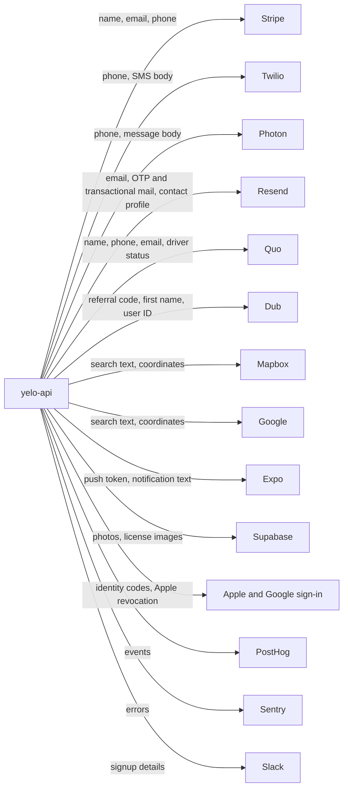

This page inventories personal data handled by `yelo-api` and its clients. It answers three questions: where a piece of personal data lives, how long it stays, and which outside services receive it. Column-level schema details live in the [database reference](/reference/database/overview). The deletion sequence itself is in [Account deletion and retention](/engineering/identity/account-deletion).

<Note>
Nothing in the codebase implements a time-based retention policy for core user data. Rides, messages, search history, and most analytics tables grow indefinitely. The only automatic deletes are the short-lived auth, bump, OAuth-flow, and job-queue cleanups listed under [Cleanup jobs](#cleanup-jobs).
</Note>

## Postgres inventory

<AccordionGroup>
  <Accordion title="Accounts and identity">
    | Table | Personal data | Retention |
    | --- | --- | --- |
    | `Users` | Name, email, phone, photo URLs, gender, graduation year, school, current latitude and longitude with heading and speed, push token, Stripe customer and merchant IDs, referral code, Quo contact ID, contact-sync hashes and timestamps, driver's license photo URLs | Soft-deleted only. See [What deletion scrubs](#what-deletion-scrubs) |
    | `AuthIdentities` | Provider subject (Apple, Google, or phone number), provider email, encrypted Apple refresh token | Hard-deleted on account deletion |
    | `AuthTransactions`, `AuthHandoffCodes`, `AuthPhoneAttempts` | Phone number under verification, provider claims, client metadata | Deleted by the `AuthV3Runtime` sweep after expiry |
    | `AuthRateLimitCounters` | HMAC-pseudonymized requester prefixes and phone numbers. Raw IPs are never stored | Deleted by the `AuthV3Runtime` sweep |
    | `AuthWebSessions` | Session rows per user | No cleanup. Revoked on deletion |
    | `AuthDeniedSubjects` | Disabled provider subjects | Kept |
    | `UserLegalAcceptances` | Accepted Terms and Privacy versions per user | Kept after deletion |
    | `EducationVerifications`, `StudIDVerificationAttempts`, `UserEducationClaims` | Verified school email, provider subject, StudID attempts | Kept after deletion. No cleanup |
    | `DeviceTelemetry` | Device model, OS, carrier, locale, time zone, install referrer, permission states | One row per user, overwritten on upload. Cascades only on a hard delete |
    | `DriverApplications` | Application status and review state | Kept after deletion |
    | `EmailOTPs`, `PhoneOTPs`, `Waitlist` | Emails, phone numbers, names | Retired. No code writes them |

    Schema: [Users and identity tables](/reference/database/users-and-identity).
  </Accordion>
  <Accordion title="Rides, messaging, and location history">
    | Table | Personal data | Retention |
    | --- | --- | --- |
    | `Rides` | Rider and driver IDs, pickup and destination names, addresses, and coordinates, routes, driver position, price, payment method ID and brand, `rider_ip_address`, `rider_user_agent`, ratings, feedback, cancellation comments | No cleanup |
    | `RideEvents`, `RideOperations`, `RideOperationSteps` | Actor IDs and state transitions | No cleanup |
    | `RideMessages` and related stream, read, and count tables | Rider and driver chat text | No cleanup |
    | `Issues`, `RideIssues` | Issue text tied to a ride and user | No cleanup |
    | `RecentLocations` | Places a user selected | Pruned to the newest 50 per user on each sync |
    | `LikedLocations`, `SavedLocations` | Saved places per user | Until the user removes them |
    | `LocationSearches`, `LocationBrowses` | Searched destinations with coordinates, user, community, and class year | No cleanup |
    | `Bumps` | Sender's origin coordinates and destination | Deleted 7 days after expiry by `PurgeExpiredBumps` |
    | `DriverAutoQueueLog`, `DriverSessions` | Driver activity and fleet sessions | No cleanup |

    Schema: [Rides tables](/reference/database/rides) and [Locations and places](/reference/database/markets-locations-and-places).
  </Accordion>
  <Accordion title="Social graph and contacts">
    | Table | Personal data | Retention |
    | --- | --- | --- |
    | `Friendships` | Who is friends with whom | No cleanup |
    | `UserContacts` | HMAC hashes of the uploader's address-book phone numbers, keyed with `CONTACT_HASH_PEPPER`. Raw numbers are not stored | Replaced wholesale on each complete upload |
    | `EventAttendees`, `EventShares`, `EventStoryViews` | Attendance and engagement per user | No cleanup |
    | `Referrals`, `ReferralRewards`, `ReferralPayouts` | Referrer and referee IDs | Kept after deletion |
    | `AttributionTouches`, `UserAttribution` | Install and sign-up attribution, UTM data | Kept after deletion |
    | `AdImpressions`, `CouponClaims`, `QrTipVisits` | Per-user engagement | No cleanup |

    Schema: [Events and social](/reference/database/growth-events-and-social) and [Growth and engagement](/reference/database/growth-and-engagement).
  </Accordion>
  <Accordion title="Messaging, notifications, and CRM">
    | Table | Personal data | Retention |
    | --- | --- | --- |
    | `TextMessages` | Recipient phone number and friend-bump SMS body | No cleanup |
    | `Notifications`, `NotificationDeliveries`, `NotificationRecipients`, `NotificationLog` | Recipient IDs, rendered content, delivery status | No cleanup |
    | `PushNotificationTickets` | Expo ticket IDs per send | No cleanup |
    | `DriverLeads`, `DriverLeadNotes` | Prospective drivers' names, phone numbers, emails, operator notes | No cleanup |
    | `ContactSyncState`, `ContactSyncIdentities`, `QuoSyncRequests`, `QuoSyncOutbox` | Remote contact IDs and sync state | Requests and outbox rows drained by workers |
    | `MarketingSegmentMembers` | Segment membership | Until the segment changes |
    | `river_job` | Job arguments. `notify_bump_sms` args hold the recipient phone number, SMS body, sender first name, and destination | River defaults: completed and cancelled jobs after 24 hours, discarded jobs after 7 days |

    Schema: [Notifications and messaging](/reference/database/growth-notifications-and-messaging) and [Platform and admin](/reference/database/platform-and-admin#river-job-queue).
  </Accordion>
  <Accordion title="Payments">
    | Table | Personal data | Retention |
    | --- | --- | --- |
    | `Rides` payment columns | Stripe payment intent IDs, tip amounts | No cleanup |
    | `QrPayments`, `QrPaymentConfigs` | Payer and driver references, amounts | No cleanup |
    | `StripeReconciliation` | Connected account IDs and balances | No cleanup |

    Card data never touches Yelo servers. Stripe holds payment methods and Connect identity documents. See [Payments tables](/reference/database/payments).
  </Accordion>
</AccordionGroup>

## Object storage

`internal/data/supabasestorage/storage.go` writes every upload to the bucket named by `STORAGE_PUBLIC_BUCKET_ID` and stores the object's public URL. `STORAGE_PRIVATE_BUCKET_ID` is read into config but never used.

| Path prefix | Content | Deleted on account deletion |
| --- | --- | --- |
| `profile_pictures/<user id>/` | Rider photo and thumbnail | Yes, the file named in `photo_url` |
| Driver profile photo | Driver photo submitted for review | No. Only the URL is blanked |
| `license_images/<user id>/` | Front and back of the driver's license | No. URLs and files both remain |
| `event_photos/`, `spot_photos/` | Operator-uploaded content | Not personal |

<Warning>
Driver's license images are stored in the public bucket and are reachable by anyone who has the URL. The URL contains the user ID and a random photo UUID. They are never deleted.
</Warning>

## Redis

Redis holds short-lived copies. Most keys expire on their own.

| Key pattern | Content | TTL |
| --- | --- | --- |
| `authv2:phone_otp:<E.164 phone>` | OTP record for a phone number | 15 minutes |
| `authv2:email_otp:<email>`, `authv2:community_email_otp:<email>` | OTP record for an email | 15 minutes |
| `auth:user:<id>` | Deleted, banned, and community flags | 15 minutes |
| `user:profile:<id>` | Cached profile, including name, email, and phone | 5 minutes |
| `driver:loc:<id>` | Driver latitude, longitude, timestamp | 2 hours |
| `presence:*`, `community:online:*`, `community:drivers:*` | Online presence sorted sets | 120-second window |
| `contacts_match:<id>:<hour>` | Upload counter | 1 hour |
| `friend_bump:<sender id>` | Sliding-window bump limiter | 1 hour window |
| `search_session:*`, `place:*`, `reverse:*` | Search and place caches keyed by provider session or place | Per cache |

Cache invalidation after account changes is covered in [Data layer](/engineering/api/data-layer#caches).

## Logs, analytics, and error reporting

| Sink | What arrives | Safeguards |
| --- | --- | --- |
| Cloud Logging (API logs) | Request method and path, user ID and community ID on authenticated requests, masked phone numbers (`maskPhone`, `phone.MaskPhone`), IP addresses on rate-limit rejections | Phone numbers are masked in auth and SMS logs |
| Cloud Logging, ride pricing | Full `user_email` on `Test account detected` lines in `internal/service/ride/rider.go` | None |
| Cloud Logging, Slack skips | Full Slack payload, including names and emails, when `ENVIRONMENT` is not `production` | None |
| Cloud Logging, Clerk | `raw_custom_claims` of every dashboard session at debug level | Debug level only |
| PostHog (API) | Auth v2 and Auth v3 funnel events. Distinct IDs are user IDs, transaction IDs, or masked emails and phones | See [Analytics events](/reference/analytics-events) |
| PostHog (mobile) | Product events and session replay | Replay masks text inputs but not images, and captures no logs (`app/_layout.tsx`) |
| PostHog (web) | Auth v3 funnel on production builds only | `VITE_APP_ENV` gate |
| Sentry (API) | Panics caught by the `sentryhttp` middleware. `Logger.ErrorC` can also forward errors, but only when Sentry was initialized before the logger was built. `cmd/api/main.go` builds the logger first, so the main logger's `sendEvents` flag is false | Tracing disabled. No explicit PII scrubbing configured |
| Sentry (dashboard) | Errors, 100% of traces, and session replay for 10% of sessions and 100% of error sessions | SDK default replay privacy settings |
| Sentry (mobile) | Errors and 20% of traces | Disabled in dev and E2E builds |
| OpenTelemetry collector | Spans with user, ride, driver, and fleet IDs as attributes | Sent to `OTEL_OTLP_ENDPOINT` |
| Slack | Signup alerts with name, email, city, school, graduation year, referrer. Driver application and support alerts | Production only. Test schools and `test*` emails are skipped. See [Slack alerts](/engineering/notifications/slack-alerts) |

## Third parties

| Provider | Data sent | Trigger | Code |
| --- | --- | --- | --- |
| Stripe | Customer name and email. Connect Express account with first name, last name, email, phone, and business name. Payment method IDs | Rider payment setup, driver onboarding | `internal/data/stripe/customer.go`, `account.go` |
| Twilio | Phone number for Verify. Phone number and body for SMS | Sign-in codes, friend bumps, legacy SMS | `internal/data/twilio/twilio.go` |
| Photon | Phone number and message body over iMessage | Friend-bump texts when Photon is configured (`PhotonEnabled`) | `internal/data/photon/photon.go` |
| Resend | Email for transactional mail. Contact email, name, and properties when contact sync is on | Email OTP, contact sync | `internal/data/resend/` |
| Quo (OpenPhone) | Contact first and last name, emails, phone numbers, custom fields such as driver status | Contact sync and legacy Quo writer | `internal/data/quo/` |
| Dub | Referral code, user ID as external ID, link title and description with the inviter's first name, OG image URL. Lead events keyed by user ID | Referral link creation, conversions | `internal/data/dub/dub.go`, `internal/service/referral/referral.go` |
| Mapbox, Google Maps and Places | Search text, proximity coordinates, reverse-geocode coordinates | Search, routing, reverse geocoding | `internal/data/mapbox/`, `googlemaps/`, `googleplaces/` |
| Expo push | Push token and notification text | Every push | `internal/notify/` |
| Supabase Storage | Photos and license images | Uploads | `internal/data/supabasestorage/` |
| Apple, Google | Authorization codes, refresh-token revocation | Sign-in and deletion | `internal/service/authv3/providers/` |
| StudID | Verification attempt | Student verification | `internal/service/authv3/student/studid.go` |
| Google Calendar | Operator calendar data, not rider data | Operating hours sync | `internal/data/googlecalendar/` |
| Clerk | Dashboard staff identity and role metadata | Dashboard sign-in and access management | `internal/service/dashboard/dashboard.go` |

## What deletion scrubs

`DELETE /user/i/{id}` runs `UserService.Delete`. In summary:

| Scrubbed or removed | Kept |
| --- | --- |
| `Users` name, email, phone, rider and driver photo URLs | The `Users` row, IDs, community, school, referral code, Stripe IDs, `is_test` |
| Every `AuthIdentities` row, after Apple refresh-token revocation | License photo URLs and files, driver photo file |
| Stripe customer | Stripe Connect Express account |
| Rider profile photo file | Rides, messages, payments, tips, ratings, issues |
| Web sessions (revoked) | `EducationVerifications`, `UserLegalAcceptances`, attribution, referrals, `DriverApplications` |
| Remote Resend and Quo contacts, through contact sync in `generic` mode | `LocationSearches`, `RecentLocations`, `Friendships`, `UserContacts`, `TextMessages`, `DeviceTelemetry`, notification history |

The full ordered sequence and its failure modes are in [Account deletion and retention](/engineering/identity/account-deletion). Contact-sync removal is described in [Contact sync](/engineering/domains/contact-sync).

## Cleanup jobs

| Job | Cadence | Deletes | Code |
| --- | --- | --- | --- |
| `AuthV3Runtime` | 5 minutes, only with Auth v3 enabled | Expired `AuthTransactions`, `AuthHandoffCodes`, `AuthPhoneAttempts`, `AuthRateLimitCounters` | `RuntimeCleanupService.Run` |
| `MapHeat` / `PurgeExpiredBumps` | 5 minutes | `Bumps` more than 7 days past expiry | `internal/service/maplayer/bump_retention.go` |
| `community_geography_maintenance` | 15 seconds (River) | Expired `GoogleCalendarOAuthFlows` | `internal/notify/queue/community_timezone.go` |
| Recent locations prune | On each sync | `RecentLocations` beyond the newest 50 per user | `PruneRecentLocations` in `queries/recent_locations.sql` |
| Contact upload | On each complete upload | The uploader's previous `UserContacts` rows | `queries/contacts.sql` |
| River job cleaner | River maintenance | Finished `river_job` rows after 24 hours, discarded after 7 days | River defaults. `internal/notify/queue/queue.go` sets no override |
| Contact sync | Continuous | Drained request and outbox rows. Remote contacts of deleted users | `internal/service/contactsync/`, `internal/service/quo/` |

Background loop details are in [Background jobs](/engineering/api/background-jobs).

## Where this lives in code

| Concern | Path |
| --- | --- |
| Deletion | `yelo-api/internal/service/user/user.go`, `yelo-api/internal/data/repository/authv3.go` |
| Storage uploads | `yelo-api/internal/data/supabasestorage/storage.go` |
| Log masking | `maskPhone` in `yelo-api/internal/server/http/middleware.go`, `yelo-api/internal/utilities/phone/phone.go` |
| PostHog from the API | `yelo-api/internal/utilities/metrics/posthog.go`, `captureEvent` in `yelo-api/internal/service/authv2/authv2.go` |
| Contact hashing | `hashPhone` in `yelo-api/internal/service/user/contacts.go` |
| Redis key prefixes | `yelo-api/internal/data/redis/*_cache.go`, `yelo-api/internal/service/authv2/authv2.go` |
| Mobile analytics privacy | `yelo-frontend/app/_layout.tsx` |
| Dashboard Sentry | `yelo-web/src/sites/dashboard/main.tsx` |

## Gotchas and edge cases

- **`GET /ride/{id}` is public.** Anyone with a ride ID gets rider and driver names, phone numbers, photos, pickup and destination coordinates, and the vehicle plate. See [Authorization matrix](/engineering/security/authorization-matrix#routes-weaker-than-their-data).
- **Scrubbed users still appear by ID.** Rides, messages, and referrals keep the user ID, so joins still work, but names and phones come back empty.
- **The legacy Quo writer never deletes.** Only `generic` contact sync removes remote contacts for deleted users.
- **River keeps SMS job args.** Friend-bump phone numbers and bodies stay in `river_job` for up to 7 days after a job is discarded.
- **Rotating `CONTACT_HASH_PEPPER` orphans stored hashes.** Every `UserContacts` hash was keyed with the old pepper, so matches stop until each user re-uploads.
- **`CaptureError` is unused.** `internal/utilities/logger/posthog.go` would send raw error strings to PostHog as event names, but nothing calls it.
