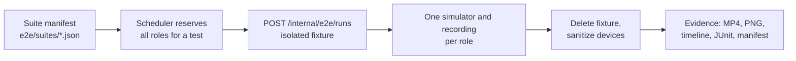

Every repository exposes one command that runs exactly what CI runs. Run it before you push.

| Repository | Local gate | CI workflow | Runs on |
| --- | --- | --- | --- |
| `yelo-api` | `make check` (also the pre-commit hook) | `ci.yml` | Pull requests |
| `yelo-web` | `pnpm nx run workspace-quality:ci` | `ci.yml` | Non-draft pull requests |
| `yelo-frontend` | `make check` | `ci.yml`, `fingerprint.yml` | Non-draft pull requests |

Mobile device E2E is a separate, manually triggered suite. It is not a merge gate.

For release sign-off by hand, use the [Manual QA checklists](/engineering/qa/manual-qa-checklists).

## API

### Unit and integration tests

The API has two test modes, separated by a build tag:

| Mode | How to mark it | What it may use | Command |
| --- | --- | --- | --- |
| Unit | No build tag | Mocks, in-memory fakes | `make test-unit` |
| Integration | `//go:build integration` | Real Postgres and Redis through testcontainers-go | `make test-integration` |

`make tf` runs unit tests in parallel and then integration tests one package at a time. Integration tests need Docker. The Makefile sets `TESTCONTAINERS_RYUK_DISABLED=true` and a 180-second container wait timeout.

<Warning>
Integration packages are listed explicitly in `INTEGRATION_PKGS` in the `Makefile`, because `go list ./...` can't see files behind a build tag. When a package gets its first integration-tagged test, add it to that list or CI never runs it. This command finds every candidate:

```bash
grep -rln '^//go:build integration' --include='*_test.go' internal \
  | xargs -n1 dirname | sort -u
```
</Warning>

For the test packages, harnesses, and fakes in depth, see [API tests](/engineering/qa/api-tests).

`internal/data/twilio` is deliberately excluded. Its integration test calls the live Twilio API and skips itself unless `TWILIO_TEST_ACCOUNT_SID` and the matching auth token are set.

Test conventions:

- Put tests next to the code as `*_test.go` and use testify assertions.
- Generate mocks with mockery (`make mocks`). The interfaces to mock are listed in `.mockery.yaml`, and mocks land in adjacent `mocks/` packages. Commit them.
- Use the shared helpers in `internal/utilities/testutils` for database and Redis setup. Dashboard handler tests use the `dashboardtest` harness.

### Coverage floor

CI merges unit and integration coverage profiles and enforces a floor of **77.8%**.

```bash
make cover-check   # both profiles, merged, compared with the floor
make cover-unit    # fast, no Docker, understates real coverage
```

- The floor lives in `COVERAGE_FLOOR` in the `Makefile`. Raise it in the same pull request that raises coverage. Never lower it.
- Generated mocks, sqlc output, test harnesses, standalone scripts, and `cmd/` are excluded. Repositories, dashboard handlers, and request DTOs are included on purpose.

### Other checks in `make check`

| Target | What it verifies |
| --- | --- |
| `check-migration-policy` | Migration filenames, up/down pairs, and version order. Existing migration files are unchanged relative to `BASE_REF`. Release and school-catalog script tests pass |
| `check-generated` | `openapi.json`, sqlc output, and mocks match a fresh generation. Includes the Python and shell tests for the generator scripts |
| `lint` | golangci-lint with the pinned version and `.golangci.yml` |

In CI these run as separate jobs: **Migration Policy**, **Generated Code**, **Lint**, **Unit Tests**, **Integration Tests**, and **Coverage**, which merges the two uploaded profiles. Locally, `make check` runs them one after another.

## Web

`workspace-quality:ci` is an Nx target that depends on six cached checks. For the test runners and what each suite covers, see [Web tests](/engineering/qa/web-tests). Every one depends on `api-contract` (`make api-check`), so a stale generated client fails first.

| Check | Command |
| --- | --- |
| Format | `pnpm format:check` (oxfmt) |
| Lint | `pnpm lint`: `oxlint --deny-warnings`, then ESLint for React Hooks rules |
| Type-aware lint | `pnpm lint:type-aware` |
| Typecheck | `pnpm typecheck` (`tsc -b`) |
| Tests | `pnpm test` |
| Firebase config | `pnpm firebase:config:check` |

After the quality gate, CI builds every affected site. A site that type-checks but fails to build still blocks the pull request.

`pnpm test` chains several runners:

- **Vitest** for React components and hooks. `test:components` lists each test file explicitly.
- **`node --test`** with `--experimental-strip-types` for pure TypeScript modules, such as the Auth v3, invite, schools, and notification helpers.
- **Worker tests**: `pnpm test:og` runs Vitest SVG snapshots and signing tests for the OG worker. Run `pnpm test:og -u` to accept intentional layout changes. The router workers use `node --test`.
- **Shell tests** for the Slack deploy formatter.

<Note>
Because the test scripts list files explicitly, a new test file does not run until you add it to the matching script in `package.json`.
</Note>

## Mobile

`make check` runs the same six steps as `ci.yml`, in one job. For the Jest setup and what the unit tests cover, see [Mobile tests](/engineering/qa/mobile-tests).

| Step | Command | What it covers |
| --- | --- | --- |
| API contract | `make api-check` | Spec matches its lock, generated client is current |
| Format | `make fmt-check` | oxfmt, no writes |
| Typecheck | `make typecheck` | `tsgo --noEmit`, strict with `noUncheckedIndexedAccess` |
| Lint | `make lint` | oxlint with every category as an error, then ESLint for React Compiler and React Native rules |
| Type-aware lint | `make lint-types` | `no-floating-promises`, `await-thenable`, unsafe `any` |
| Unit tests | `make test` | Jest, plus `node --test` for scripts and the vehicle catalog check |

Jest uses the `jest-expo` preset and matches `**/*.test.ts` and `**/*.test.tsx`. Keep unit tests deterministic and backend-free. They cover pure logic such as guards, matchers, formatters, and API helpers. Device UI belongs in E2E.

`fingerprint.yml` also runs on pull requests from the same repository. It computes the native fingerprint and comments when a change is not OTA-safe. It blocks only on release branches.

## Mobile E2E

Mobile E2E uses [agent-device](https://agent-device.dev/) replay files, not Maestro. `yelo-frontend/E2E.md` is the operating guide, and `yelo-api/docs/E2E_CONTROL_PLANE.md` documents the fixture API. For the full suite catalog and runner internals, see [E2E environment](/engineering/qa/e2e).



### The pieces

- **Flows.** Declarative `.ad` files in `e2e/flows`, one per role. Suites in `e2e/suites` compose tests that need one to ten devices.
- **App.** A release-like build with the bundle ID `io.flutterflow.ridedesi.desirider.e2e`, from the `e2e-simulator` EAS profile or a local build. It embeds the isolated E2E API URL and uses the native Auth v3 screens. `lib/config.ts` refuses to let an E2E build target the production API.
- **API.** The `yelo-api-e2e` Cloud Run service runs the exact production image against the separate `yelo_e2e` database, a nonzero Redis database, and Stripe test keys. Background consumers and messaging credentials are disabled. See [deployment](/engineering/deployment#e2e-api-convergence).
- **Fixtures.** Routes under `/internal/e2e/runs` create, read, and delete an isolated scenario per test. They require the `X-E2e-Key` header and exist only when `E2E_ENABLED=true` and `ENVIRONMENT=e2e`. Each run owns its synthetic `+1555` actors, school, community, fleet, pricing, and optional vehicle. OTP is always `12345`.

Suites include `core-smoke.json` and `ride-coordinate-stops.json`. The latter runs `e2e/flows/ride-addressless-poi.ad` as an `auth_existing_rider`: it opens a saved-place deep link with coordinates and an empty address, presses the POI sheet's **Ride** button (`poi-get-ride-button`), and checks that a draft with vehicle options is created without a confirm-location or confirm-stop prompt.

Supported scenarios include `auth_existing_rider`, `auth_rider_driver_pair`, `ride_confirmed_rider`, `ride_queued_pair`, and `ride_notification_rider`. Adding a scenario requires an API change and a migration that extends the scenario constraint.

### Run it

```bash
make e2e-doctor                                          # check Xcode, jq, ffmpeg, agent-device
make e2e-build-local                                     # build the E2E app without devices or fixtures
make e2e-local FLOW=e2e/flows/auth-existing-actor.ad     # one flow, fastest loop
make e2e-suite-local SUITE=e2e/suites/core-smoke.json MAX_DEVICES=8
make e2e-signoff                                         # full suite, zero retries, publish evidence
```

The **Mobile E2E** workflow (`e2e-agent-device.yml`) runs the same scheduler on the self-hosted Mac. Dispatch it manually from GitHub Actions.

### Rules

- Tests run with zero retries. A flake is a failure to diagnose.
- A run passes only when it produces an MP4, at least one PNG, a non-empty timeline, JUnit XML, and a manifest.
- Use stable accessibility IDs on real controls. Do not add test-only controls or app-side state bypasses.
- Never create fixtures by hand in Supabase, and never point an E2E build at production.
- Published runs appear at `https://yelo-maestro.web.app/?run=<run-id>`. The hostname is historical. Publish only synthetic data.

<Note>
The E2E API runs the promoted production image with background workers off. It cannot validate an unreleased worker or a job-driven flow. Those need an isolated candidate deployment, as described in `E2E_CONTROL_PLANE.md`.
</Note>
