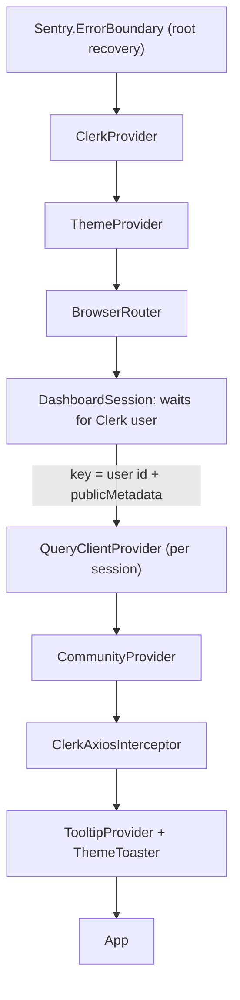

The dashboard is the `dashboard` site in `yelo-web` (`src/sites/dashboard/`). It is a client-rendered React 19 single-page app that uses Clerk for authentication, React Router v7 for routing, and TanStack Query over an Orval-generated axios client. This page covers the implementation. For what each role can see from an operator's point of view, see [Dashboard roles](/administration/dashboard-roles).

## Boot sequence

The dashboard does not use the shared `renderSite()` helper. `src/sites/dashboard/main.tsx` builds its own provider tree:

Key behavior:

- **Fail fast on config.** `main.tsx` throws if `VITE_CLERK_PUBLISHABLE_KEY` is missing. Sentry initializes only when `VITE_SENTRY_DSN` is set. See [Observability](/engineering/observability) for sampling.
- **Per-session cache.** `DashboardSession` keys `DashboardData` on the Clerk user ID and `publicMetadata`. When a user signs in as someone else or their role or assignments change, the whole data layer remounts and the old `QueryClient` is cleared. Cached data never leaks across roles.
- **Bearer tokens.** `ClerkAxiosInterceptor` (`src/lib/clerk-axios-interceptor.tsx`) adds `Authorization: Bearer <token>` from `getToken()` to every request on the shared `axiosInstance`. If Clerk fails to return a token, the request is rejected rather than sent unauthenticated.
- **Base URL.** `src/lib/api-client.ts` uses `VITE_API_URL`, or `/api` through the Vite dev proxy. In production builds, a relative value falls back to `https://api.joinyelo.com` because Firebase Hosting cannot proxy.

## Routing

All routes are declared in `src/sites/dashboard/App.tsx`. There is no file-based routing.

- Signed-out users see Clerk's `<SignIn routing="hash" />`. Signed-in users get `DashboardLayout` wrapping `RouteBoundary`, `Suspense`, and `Routes`.
- Every page is lazy-loaded through `lazyDashboardRoute(path, select)` from `routeModules.ts`. The `routeImporters` map in that file is the single list of page modules. The loader retries a failed chunk import at 0, 150, and 500 ms before it throws.
- `prefetchDashboardRoute(path)` warms a page chunk. The sidebar calls it on hover, focus, and pointer down, and prefetches every route the user can access when the browser is idle.
- Unknown paths render a "Coming Soon" placeholder.

### Route and role map

| Path | Page module | Allowed roles |
| --- | --- | --- |
| `/` | `OverviewPage` via `RootRoute` | `admin`, `intern` (fleet redirects to `/fleets`) |
| `/kpi` | `KpiPage` | `admin` |
| `/drivers` | `LeadsPage` | `admin`, `intern`, `fleet` |
| `/users` | `UsersPage` | `admin`, `intern` |
| `/rides` | `RidesShellPage` | `admin`, `intern`, `fleet` |
| `/supply-demand` | `SupplyDemandPage` | `admin` |
| `/map` | `CommunityMapPage` | `admin`, `intern` |
| `/events` | `FeedPage` | `admin`, `intern` |
| `/community` | `CommunityPage` | `admin`, `intern` |
| `/fleets` | `FleetsPage` | `admin`, `fleet` |
| `/searches` | `SearchesPage` | `admin`, `intern` |
| `/pricing` | `PricingPage` | `admin` |
| `/manage`, `/manage/:fleetId` | `ManageFleetsPage` | `admin` |
| `/notifications` | `NotificationsPage` | `admin` |
| `/communities` | `CommunitiesPage` | `admin` |
| `/access` | `AccessPage` | `admin` |
| `/telemetry` | `TelemetryPage` | `admin` |
| `/jobs` | `JobsPage` (River UI iframe) | `admin` |
| `/contact-sync` | `ContactSyncPage` | `admin` |

Legacy paths redirect and preserve the query string where it matters:

| Legacy path | Redirects to |
| --- | --- |
| `/leads` | `/drivers` |
| `/schools` | `/communities?tab=schools` |
| `/activation` | `/notifications?notification_tab=activation` |
| `/vehicles` | `/manage?tab=vehicles` |
| `/cancels`, `/uncompletes` | `/rides` |
| `/qr-payments` | `/fleets` |
| `/settings` | `/access` |
| `/feed` | `/community` |
| `/feeds`, `/spot` | `/events` |
| `/presence`, `/driver-ops` | `/supply-demand` |
| `/locations`, `/zones` | `/map` |

<Note>
`src/sites/dashboard/pages/` still contains modules for some retired routes, such as `CancellationsPage`, `PresencePage`, and `SettingsPage`. `SchoolsPage`, `VehiclesPage`, and `ActivationPage` remain in `routeImporters` so the search index can read their copy, but their routes are redirects. Check `App.tsx` before you assume a page file is reachable.
</Note>

## Role gating

### useRole

`src/hooks/useRole.ts` reads Clerk `user.publicMetadata` and returns:

| Field | Source |
| --- | --- |
| `role` | `publicMetadata.role`, or `'unknown'` |
| `isAdmin`, `isIntern`, `isFleetManager` | `role === 'admin' / 'intern' / 'fleet'` |
| `fleetAssignments` | `publicMetadata.fleet_assignments` (array of `{ fleet_id, community_id }`), filtered to valid entries. If that is absent, it falls back to the legacy single `fleet_id` + `community_id`. |
| `communityId` | `publicMetadata.community_id`, or the first assignment's community for fleet users |
| `fleetId` | `publicMetadata.fleet_id`, or the first assignment's fleet |
| `isOnboarded` | `publicMetadata.onboarded` |
| `isLoaded` | `false` until Clerk has loaded a signed-in user |

The dashboard writes these fields through the Access page API (`src/hooks/useAccess.ts`). The API enforces the same roles server-side; client gating only controls what renders.

### ProtectedRoute and RootRoute

`ProtectedRoute` in `App.tsx` takes an `allowedRoles` array. While roles load, it renders the skeleton `PageLoader`. If the role is not allowed, it redirects `fleet` users to `/fleets` and everyone else to `/`. `RootRoute` renders the overview for `admin` and `intern`, redirects `fleet` to `/fleets`, and shows an "Unauthorized — You do not have a valid role assigned" message for any other role.

### Sidebar

`src/components/Sidebar.tsx` hardcodes `navGroups`:

| Group | Items |
| --- | --- |
| Global | KPI, Drivers, Users, Rides, Supply & Demand |
| Community | Map, Events, Community, Fleet (`/fleets`) |
| Configuration | Pricing, Fleets (`/manage`), Notifications, Communities |
| Administration | Access, Telemetry, Jobs, Contact sync (collapsed by default) |

Items the user cannot access render dimmed and unclickable rather than hidden. `isAccessible()` keeps its own allowlists: `fleet` gets `/fleets`, `/drivers`, and `/rides`; `intern` gets `/users`, `/rides`, `/searches`, `/community`, `/drivers`, `/events`, `/map`, and `/leads`. For admins, the Drivers item shows a badge with the count from `useDriversGetGlobalPendingDrivers`.

<Warning>
Role rules live in three places that must agree: `allowedRoles` in `App.tsx`, `isAccessible()` in `Sidebar.tsx`, and the API's own authorization. The global search index reads `allowedRoles` from `App.tsx` at build time, so search stays in sync automatically. The sidebar does not.
</Warning>

## Community scope

Most pages show data for one community, called a market in the UI. `CommunityProvider` (`src/contexts/CommunityProvider.tsx`) owns the selection, and `useCommunity()` from `src/contexts/CommunityContext.ts` exposes it:

- `selectedCommunityId` and `setSelectedCommunityId`
- `selectedCommunity` (the full `CommunitiesDataItem`) and `setSelectedCommunity`
- `rememberedFleetId` and `rememberFleetId`, a per-path, per-community memory of the last selected fleet

Resolution rules:

1. A `?community=<id>` query parameter wins, unless its value is `new`.
2. Otherwise the provider uses the last selection for the current path, then the value saved in `localStorage` under `selectedCommunityId`.
3. Admins can select any community. Interns are pinned to their `community_id`. Fleet managers can choose only among their `fleet_assignments` communities. The setter ignores disallowed IDs.

The `Topbar` loads all communities with `useCommunityGetAllCommunities`, filters them by role, and renders `CommunityDropdown`. The dropdown is disabled for interns and for fleet managers with a single assignment. On `/pricing`, `/communities`, and `/rides`, admins can choose **All markets**, and the selection is written to the URL. `/kpi` always shows **All markets**.

For pages that aggregate across communities by default, use `useGlobalCommunityFilter()` from `src/hooks/useGlobalCommunityFilter.ts` with `CommunityFilterDropdown` instead of the global context. Its `communityParam` is `undefined` when **All** is selected.

## Data fetching

- **Generated client.** `src/generated/dashboard/endpoints/<tag>/<tag>.ts` exports a plain function and `use*` React Query hooks for every operation, and `src/generated/dashboard/models/` holds the types. Regenerate the client and never edit it by hand; see [OpenAPI and clients](/engineering/openapi-and-clients).
- **Query defaults.** `staleTime` is 5 minutes and `retry` is 1. Override these per query, for example the Contact sync page polls every 15 seconds with `refetchInterval` and `refetchIntervalInBackground: false`.
- **Wrapper hooks.** `src/hooks/` holds hooks that wrap generated functions when a page needs stable query keys for invalidation, a response cast, or a different endpoint. For example, `useZonesList` calls the Clerk-authenticated `communityGetCommunityZonesDashboard` because the generated `useCommunityGetCommunityZones` targets an app-JWT route. Wrapper hooks export a key factory such as `accessKeys` or `zoneKeys`, and mutations call `queryClient.invalidateQueries` on success.
- **Response envelope.** Dashboard endpoints return `{ success, data, error }`. Check `response.success` before you read `data`, because some failures arrive as `200` with `success: false`.
- **Lint guardrails.** ESLint forbids importing `@/lib/api-client` directly and forbids raw `fetch` in `src/components`, `src/hooks`, and `src/sites/dashboard`. Only `JobsPage.tsx` and `TopLocationsManager.tsx` are exempt.
- **Global loading bar.** `GlobalLoadingBar` shows a thin bar whenever `useIsFetching()` is non-zero.

## Error handling

| Layer | Mechanism |
| --- | --- |
| Whole app | A root `Sentry.ErrorBoundary` in `main.tsx` shows a skeleton shell and calls `resetError` with exponential backoff (100 ms × 2ⁿ), up to three attempts per session, tracked in `sessionStorage`. |
| Per route | `RouteBoundary` (`src/components/RouteBoundary.tsx`) is a Sentry boundary keyed by pathname with the same backoff. A crashing page retries behind a content skeleton without taking down the sidebar, and navigating away clears it. |
| Chunk loads | `lazyDashboardRoute` retries the dynamic import three times. |
| Queries | React Query errors do not throw into boundaries. Each page renders its own state from `isError` or `success: false`, for example an inline `role="alert"` panel. |
| Mutations | Show `toast.error(getApiErrorMessage(error, 'Fallback'))`. `getApiErrorMessage` in `src/lib/api-error.ts` pulls `detail`, `message`, or `title` from the response body, including a nested `error` object. |

## Supporting features

- **Global search.** `GlobalSearch` in the top bar searches a build-time index (`virtual:dashboard-search-index`) produced by `tools/vite/dashboard/search-index.ts`. The plugin parses `routeModules.ts` and `App.tsx` with the TypeScript compiler, collects headings and copy from each page, and tags every entry with its route's `allowedRoles`. The build fails if a route in `routeImporters` has no access policy. Section results link with `?section=<slug>`, and `SearchNavigation` scrolls to the matching `id` or `data-search-section` element. Admins also get live user results.
- **Document titles.** `DashboardTitle` builds `document.title` from the path, selected tabs, and any `data-dashboard-scope` or `data-dashboard-fleet` attributes.
- **Recent views.** `RecentViews` in the top bar tracks recently visited pages.
- **Theme.** `ThemeProvider` supports light, dark, and system themes, and the sidebar footer switches between them.

## UI stack

| Concern | Library and location |
| --- | --- |
| Components | shadcn/ui, New York style, on Radix primitives in `src/components/ui/`. `components.json` configures the shadcn CLI. |
| Icons | `lucide-react` |
| Styling | Tailwind CSS v4 through `@tailwindcss/vite`; theme tokens in `src/shared/theme/index.css` |
| Tables | TanStack Table v9 with the shared `appTableFeatures` set in `src/lib/table.ts` (sorting, pagination, column visibility and sizing, row selection); `@tanstack/react-virtual` for long lists |
| Charts | Recharts through the shadcn `ChartContainer` in `src/components/ui/chart.tsx`; shared colors in `src/lib/chart-colors.ts` |
| Maps | `mapbox-gl` with `VITE_MAPBOX_API_KEY`; `@mapbox/mapbox-gl-draw` for zone editing; dark-mode popup styles in `src/sites/dashboard/styles.css` |
| Forms | `react-hook-form` with `zod` resolvers, for example `PricingConfigSheet` and `SendNotificationSheet` |
| Toasts | sonner through `ThemeToaster` |
| Command palette | `cmdk` through `src/components/ui/command.tsx` |

## Related

<CardGroup cols={2}>
  <Card title="Add a dashboard page" href="/engineering/web/adding-a-dashboard-page">A step-by-step recipe that follows these patterns.</Card>
  <Card title="Conventions" href="/engineering/web/conventions">Code style, lint rules, tests, and environment variables.</Card>
  <Card title="Dashboard roles" href="/administration/dashboard-roles">The operator view of admin, intern, and fleet access.</Card>
  <Card title="Testing" href="/engineering/testing">How tests are organized and run across repos.</Card>
</CardGroup>
