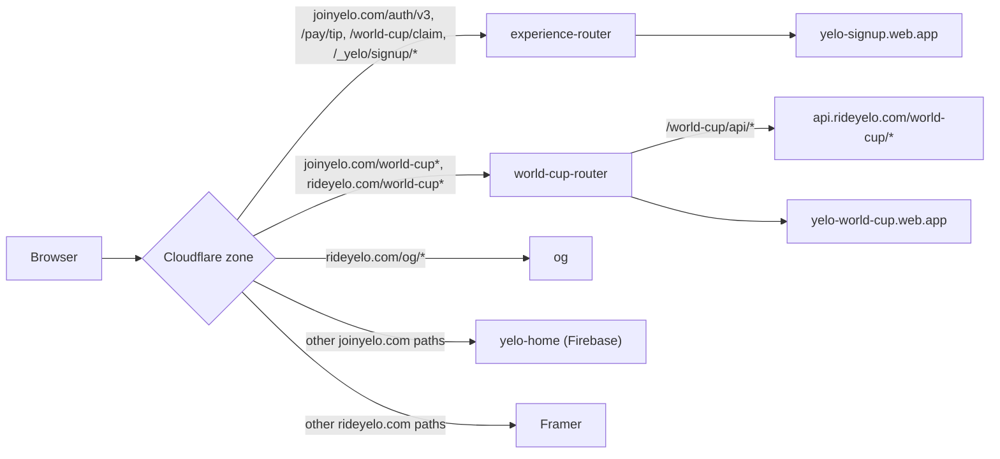

Requests for Yelo web properties pass through up to three layers: a Cloudflare Worker on a marketing domain, Firebase Hosting for the static site, and the API on Cloud Run. This page lists every rule in each layer. For the build that produces the static files, see [Multisite build](/engineering/web/multisite).

## Hostnames referenced in code

| Hostname | Served by | Evidence in code |
| --- | --- | --- |
| `joinyelo.com`, `www.joinyelo.com` | Firebase `home` site, proxied through Cloudflare. Worker routes intercept specific paths. | `home/index.html` `og:url`; `docs/authv3-web-native.md` ("Unmatched requests continue to the Firebase home origin") |
| `rideyelo.com`, `www.rideyelo.com` | Framer, proxied through Cloudflare. Worker routes intercept `/world-cup*` and `/og/*`. | `workers/world-cup-router/README.md` |
| `yelo-signup.web.app` | Firebase `signup` site | `experience-router` `SIGNUP_ORIGIN` |
| `yelo-world-cup.web.app` | Firebase `world-cup` site | `world-cup-router` `WORLD_CUP_ORIGIN` |
| `api.joinyelo.com`, `api.rideyelo.com` | Cloud Run API (both names) | `src/lib/api-client.ts`, `authV3BaseURL.ts`, `JobsPage.tsx`, signup CSP |
| `signup.yelo.link`, `invite.yelo.link`, `event.yelo.link`, `join.yelo.link`, `pay.yelo.link`, `yelo.link` | Short-link hosts. `docs/authv3-web-native.md` calls `yelo.link` Dub-managed; the repo does not record which subdomains are Firebase custom domains. | `invite/firebase.json`, `invite/index.html`, `EventFormSheet.tsx`, `referralHandoff.ts`, `QRConfigCards.tsx`, `openApp.ts` |

Firebase Hosting site IDs come from `.firebaserc`: `yelo-dashboard-v2`, `yelo-signup`, `yelo-event`, `yelo-home`, `yelo-maestro`, `yelo-invite`, and `yelo-world-cup`, all in project `yelo-dashboard-v2`.

## Cloudflare Workers

All three Workers set `workers_dev: false` and `preview_urls: false`, enable observability with a head sampling rate of 1, and use `nodejs_compat`. They deploy with `pnpm worker:<name>:deploy`, independently of any site.

### experience-router

`workers/experience-router/src/index.ts` keeps signup-owned experiences on `joinyelo.com` URLs.

| Route pattern (`wrangler.jsonc`) | Zone |
| --- | --- |
| `joinyelo.com/auth/v3*`, `www.joinyelo.com/auth/v3*` | `joinyelo.com` |
| `joinyelo.com/pay/tip*`, `www.joinyelo.com/pay/tip*` | `joinyelo.com` |
| `joinyelo.com/world-cup/claim*`, `www.joinyelo.com/world-cup/claim*` | `joinyelo.com` |
| `joinyelo.com/_yelo/signup/*`, `www.joinyelo.com/_yelo/signup/*` | `joinyelo.com` |

A route match only invokes the Worker. The Worker then classifies the exact path:

| Public path | Experience | Upstream request | `X-Yelo-Proxy` |
| --- | --- | --- | --- |
| `/auth/v3` or `/auth/v3/` | `auth-v3` | `SIGNUP_ORIGIN/auth/v3/` (always the trailing-slash form) | `experience-auth-v3` |
| `/pay/tip` or `/pay/tip/<rest>` | `tip` | `SIGNUP_ORIGIN/tip/<rest>` | `experience-tip` |
| `/world-cup/claim` or `/world-cup/claim/` | `world-cup` | `SIGNUP_ORIGIN/world-cup?intent=world-cup` | `experience-world-cup` |
| `/_yelo/signup/<path>` | Asset | `SIGNUP_ORIGIN/<path>` | `experience-assets` |
| Anything else that matched a route | None | Passed through with `fetch(request)` to the zone origin | — |

Request handling:

- Only `GET` and `HEAD` are allowed. Other methods get `405` with `Allow: GET, HEAD`.
- The query string is copied upstream. For World Cup, `intent=world-cup` is set on top of it.
- `Host` is removed and `X-Forwarded-Host` is set to the public host. Upstream redirects are not followed (`redirect: 'manual'`).

Response handling:

- **Location rewriting.** A same-origin `Location` from Firebase is mapped back to the public path: `/auth/v3/` becomes `/auth/v3`, `/tip/...` becomes `/pay/tip/...`, and `/world-cup` becomes `/world-cup/claim`. Requesting `/auth/v3/` directly exists to avoid Firebase's trailing-slash `301` bouncing back to the same public URL in a loop.
- **HTML asset namespacing.** For `GET` responses with `Content-Type: text/html`, `namespaceSignupAssets()` rewrites `src` and `href` attributes that start with `/assets/`, `/fonts/`, `/favicon-`, `/apple-touch-icon`, or `/app-store-badge` to `/_yelo/signup/...`, then drops `Content-Encoding`, `Content-Length`, and `ETag`.
- **Missing assets.** If an `/_yelo/signup/*` request comes back as HTML, which is Firebase's SPA fallback for a missing file, the Worker returns `404 Asset not found` with `Cache-Control: no-store`. This prevents the edge from caching `index.html` as a JS or image file while a new Firebase release propagates.

Signup code that renders outside the proxied HTML uses absolute namespaced URLs directly, such as `APP_STORE_BADGE_URL = 'https://joinyelo.com/_yelo/signup/app-store-badge.svg'` in `src/shared/signup/openApp.ts`.

### world-cup-router

`workers/world-cup-router/src/index.ts` serves the World Cup site under a path on both marketing domains.

| Route pattern | Zone |
| --- | --- |
| `rideyelo.com/world-cup*`, `www.rideyelo.com/world-cup*` | `rideyelo.com` |
| `joinyelo.com/world-cup*`, `www.joinyelo.com/world-cup*` | `joinyelo.com` |

| Public path | Upstream | `X-Yelo-Proxy` |
| --- | --- | --- |
| Not exactly `/world-cup` and not under `/world-cup/` (for example `/world-cupcake`) | Passed through to the zone origin | — |
| `/world-cup` | `WORLD_CUP_ORIGIN/world-cup/` | `world-cup` |
| `/world-cup/<path>` | `WORLD_CUP_ORIGIN/world-cup/<path>` | `world-cup` |
| `/world-cup/api` or `/world-cup/api/<path>` | `WORLD_CUP_API_ORIGIN/world-cup/<path>` (`https://api.rideyelo.com`) | `world-cup-api` |

The same `GET`/`HEAD`-only rule, query copying, header handling, and manual redirects apply. `Location` headers are rewritten to the public host for site responses but not for API responses. There is no HTML rewriting, because the site is built with `base: '/world-cup/'` and all asset URLs already sit under the path.

The Vite dev server mimics this with a `/world-cup/api` proxy that rewrites to `/world-cup` on `VITE_API_PROXY_TARGET` (`tools/vite/base/config.ts:164`).

### og

`workers/og/src/index.ts` renders 1200×630 PNG link-preview cards for invite links on `rideyelo.com/og/*` and `www.rideyelo.com/og/*`.

| Path | Production | Development |
| --- | --- | --- |
| `/og/<template>?...&sig=` | Verify signature, render PNG, `Cache-Control: public, max-age=31536000, immutable`, `X-Yelo-Template` | Same, but `no-store`; `?svg=1` returns SVG |
| `/og/_gallery` | `404` | HTML gallery of every template's fixtures |
| `/og/_sign?template=&...` | `404` | Returns a signed URL for testing |
| Anything else under `/og/` | `404 Unknown template` | Same |

Security and failure handling:

- `yelo-api` signs each card URL when it creates the Dub link (`internal/utilities/ogcard/url.go`). The signature is HMAC-SHA256 over decoded, key-sorted parameters, each key and value prefixed with its UTF-8 byte length, excluding `sig`, truncated to 32 hex characters. Length prefixes stop a first name containing a delimiter from forging an extra parameter. Verification compares SHA-256 digests in constant time. A bad signature returns `403`.
- The `p` photo parameter must be `https:`, or the Worker returns `400`. If satori cannot fetch or decode the photo, the Worker renders once more without it, so a dead photo URL falls back to initials instead of a `500`.
- `resvg` and satori's yoga WASM are instantiated at module scope. Lazy instantiation inside a request hung cold isolates.
- `limits.cpu_ms` is `30000` because rasterizing costs about 250 ms of CPU, well above the plan default.
- `OG_SIGNING_SECRET` is a Wrangler secret shared with the API. `ENVIRONMENT` other than `production` enables the dev endpoints.

The only template today is `invite` (`src/templates/invite.tsx`). Adding one means writing the `.tsx` file and registering it in `src/templates/index.ts`.

## Firebase Hosting rules per site

Each site owns `src/sites/<site>/firebase.json`; `pnpm firebase:config` merges them into the root `firebase.json`.

| Site | Headers | Rewrites | Redirects | Ignore |
| --- | --- | --- | --- | --- |
| `dashboard` | `**`: `no-cache, no-store, must-revalidate`. `/assets/**`: `public, max-age=31536000, immutable`. | `**` → `/index.html` | — | `**/.*` (no `.well-known` deployed) |
| `signup` | `.well-known` files: JSON, 1 h. `/`: no-store. `/assets/**`: immutable 1 y. `/fonts/**`: 7 d. `/auth/v3{,/**}`: `no-store`, `Referrer-Policy: no-referrer`, `nosniff`, `X-Frame-Options: DENY`, `Permissions-Policy` (camera, microphone, geolocation off), CSP. `/delete-account{,/}`: `no-store`, no-referrer, nosniff, DENY. `/world-cup`, `/tip/**`, `/web/tip/**`: no-store. | `/auth/v3{,/,/callback}` → `/auth/v3/index.html`; `**` → `/index.html` | — | `firebase.json`, `node_modules` |
| `event` | `/.well-known/apple-app-site-association`: JSON | `**` → `/index.html` | — | `firebase.json`, `node_modules` |
| `home` | `.well-known`: JSON, 1 h. `/`: `no-cache`. `/assets/**`: immutable 1 y. Media and fonts by extension: 30 d. Named routes: `no-cache`. | `/partner`, `/drivers`, `/vision`, `/fleets`, `/safety`, `/privacy`, `/tos`, `/terms` (each `{,/}`) → `/<route>/index.html`; `**` → `/index.html` | — | `firebase.json`, `node_modules` |
| `invite` | `.well-known`: JSON, 1 h | `**` → `/index.html` | `/` and `/index.html` → `https://signup.yelo.link/` (`302`) | `firebase.json`, `node_modules` |
| `maestro` | `/auth/v3{,/**}`: same security set as signup with a different CSP | `/auth/v3{,/,/callback}` → `/auth/v3/index.html`; `**` → `/index.html` | — | `**/.*` |
| `world-cup` | `/world-cup{,/}`: no-store | `/world-cup{,/**}` → `/world-cup/index.html` | `/` → `/world-cup` (`302`) | `**/.*` |

Every site except `dashboard`, `maestro`, and `world-cup` sets `appAssociation: "NONE"`, so Firebase serves the committed `.well-known` files instead of generating its own.

### Content Security Policies

| Directive | `signup` `/auth/v3` | `maestro` `/auth/v3` |
| --- | --- | --- |
| `default-src`, `script-src`, `base-uri` | `'self'` | `'self'` |
| `style-src` | `'self' 'unsafe-inline'` | same |
| `img-src` | `'self' data: https:` | same |
| `connect-src` | `'self'`, `https://api.joinyelo.com`, `https://api.rideyelo.com`, PostHog (`us.i.posthog.com`, `*.i.posthog.com`, `wss://*.i.posthog.com`) | `'self'`, `https://*.run.app`, PostHog |
| `form-action` | `'self'`, `https://accounts.google.com`, `https://appleid.apple.com` | `'self'` |
| `frame-ancestors`, `object-src` | `'none'` | `'none'` |

## App association files

The shared `public/.well-known/apple-app-site-association` registers the iOS app ID `6CUL8VB632.io.flutterflow.ridedesi.desirider` for `webcredentials`, and its `applinks` components only **exclude** `/tip/*` and `/web/tip/*`. `assetlinks.json` delegates `handle_all_urls` to Android package `com.rideyelo` with two certificate fingerprints.

| Site | Source of `.well-known` | Effect |
| --- | --- | --- |
| `signup`, `event` | Shared `public/` copied as the public dir | Tip paths stay in the browser |
| `home` | `emit-site-app-associations` plugin (the site has its own `public/`) | Same as shared |
| `invite` | Plugin, with `{"/": "/auth/*", "exclude": true}` and `{"/": "/*"}` appended | Every invite path except `/auth/*` opens the app |
| `dashboard`, `maestro`, `world-cup` | Not deployed (`ignore: **/.*` or no shared `public/`) | — |

## Where this lives in code

| Concern | Path |
| --- | --- |
| experience-router | `yelo-web/workers/experience-router/src/index.ts`, `wrangler.jsonc`, `README.md` |
| world-cup-router | `workers/world-cup-router/src/index.ts`, `wrangler.jsonc`, `README.md` |
| og | `workers/og/src/` (`index.ts`, `sign.ts`, `render.ts`, `gallery.ts`, `templates/`), `wrangler.jsonc`, `README.md` |
| OG URL signing (API) | `yelo-api/internal/utilities/ogcard/url.go`, `color.go` |
| Per-site Hosting | `src/sites/<site>/firebase.json`, root `firebase.json`, `.firebaserc`, `scripts/gen-firebase-config.mjs` |
| App association | `public/.well-known/`, `tools/vite/base/config.ts` |
| Worker tests | `workers/*/src/*.test.ts`; `pnpm test:experience-router`, `test:world-cup-router`, `test:og` |

## Gotchas and edge cases

- **Overlapping World Cup routes.** `joinyelo.com/world-cup/claim*` matches both `experience-router` and `world-cup-router` (`joinyelo.com/world-cup*`). Cloudflare runs the more specific pattern, so claims reach the signup site. Changing either pattern can silently send claims to the race page.
- **Only exact paths are proxied.** `joinyelo.com/auth/v3/callback` matches the `auth/v3*` route but not `experienceForPath()`, so it passes through to the `home` site and renders the marketing landing. Keep Auth v3 `web_redirect_uri` at `/auth/v3` on `joinyelo.com`, or on a host that serves the signup site directly.
- **CSS fonts escape the asset namespace.** The Worker rewrites HTML attributes only. `src/sites/signup/styles.css` loads `url('/fonts/switzer/...')`, which on `joinyelo.com` is served by the `home` site. It works because `home/public/fonts` has identical file names, while the preload `<link>` points at `/_yelo/signup/fonts/...`, so the preload is wasted.
- **Workers only allow reads.** `experience-router` and `world-cup-router` reject every method except `GET` and `HEAD`. World Cup writes such as `PUT /world-cup/education-claim` must go to the API host directly, which the signup site does.
- **World Cup API always targets production.** `WORLD_CUP_API_ORIGIN` is `https://api.rideyelo.com` in `wrangler.jsonc`, with no staging variant.
- **Deploy order matters for World Cup.** Deploy the Firebase site before the Worker route, as the README says, or the path proxy serves a missing build.
- **DNS must stay proxied.** Worker routes only run when the apex and `www` records are orange-clouded. Keep Firebase ownership TXT records DNS-only.
- **Dotfile ignores drop app association.** `ignore: **/.*` in `dashboard` and `maestro` means their `.well-known` copies are never deployed. If a site ever needs universal links, remove that ignore and set `appAssociation: "NONE"` like the other sites.
