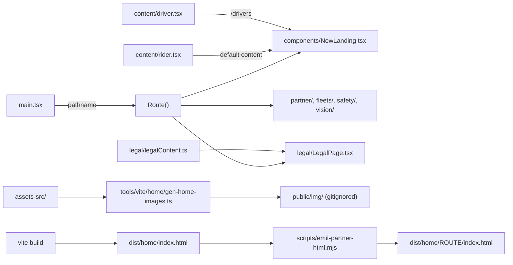

`home` is the marketing site in `yelo-web`. It lives in `src/sites/home/` and deploys to the `home` Firebase Hosting target. It uses no Tailwind, no `renderSite`, no router library, and no API client. [Sites](/engineering/web/sites#home) summarises what it serves, and [Public sites](/engineering/web/public-sites#home) covers its routing and link previews next to the other public sites. This page covers how the site is put together and how to change it.

## How it fits together

`main.tsx` is the whole runtime shell. It normalizes the pathname, calls `prepareRoute()`, and renders `HomeApp`, which mounts three things: `Nav`, the current page inside `Suspense`, and one `ContactModal`. Every page is a `lazy()` import, so each route ships its own JavaScript and CSS chunk.

## Routes

`Route()` in `main.tsx` picks the page. `prepareRoute()` sets `data-page` (and `data-variant` for the two landings) on `<html>` and writes the tab title and description.

| Path | Component | `data-page` | Runtime title | Nav |
| --- | --- | --- | --- | --- |
| `/` and any unmatched path | `NewLanding` with `RIDER` | `landing`, `data-variant="rider"` | `Yelo \| Get Out There` | `rider` on `/`, `none` on an unmatched path |
| `/drivers` | `NewLanding` with `DRIVER` from `content/driver.tsx` | `landing`, `data-variant="driver"` | `Yelo \| Driver` | `driver` |
| `/partner` | `partner/PartnerPage` | `partner` | `Yelo \| Partner` | `none` |
| `/fleets` | `fleets/FleetsPage` | `fleets` | `Yelo \| Fleets` | `none` |
| `/safety` | `safety/SafetyPage` | `safety` | `Yelo \| Safety` | `none`, dark |
| `/vision` | `vision/VisionPage` | `vision` | `Yelo \| Vision` | `none` |
| `/privacy` | `legal/LegalPage` with `document="privacy"` | `legal` | `Privacy Policy \| Yelo` | Not rendered |
| `/tos`, `/terms` | `legal/LegalPage` with `document="terms"` | `legal` | `Terms of Service \| Yelo` | Not rendered |

`/farefinder` is not a route. It is a static page in `public/farefinder/` that Firebase serves before the catch-all rewrite. See [Sites](/engineering/web/sites#home).

A route is registered in up to five places. They are not derived from each other.

| Place | What it holds | What happens if a route is missing |
| --- | --- | --- |
| `main.tsx` (`prepareRoute`, `Route`) | Page component, `data-page`, runtime title and description | The path renders the rider landing |
| `navigation.ts` (`HOME_ROUTES`) | Paths that navigate client-side | Links to the path do a full page load |
| `components/Nav.tsx` (`PAGE_PREFETCHERS`, `ALL_LINKS`) | Chunk prefetch on hover, focus, and pointer down; header and menu links | No prefetch, and no header link |
| `scripts/emit-partner-html.mjs` (`PAGES`) | Crawler-visible title, description, and `og:url` | Readers are unaffected; shared links preview as the rider landing |
| `firebase.json` (rewrites and the `no-cache` header glob) | Mapping from the path to its emitted `index.html` | Firebase serves the root `index.html`, so crawlers get the landing's tags |

`HOME_ROUTES` contains `/`, `/drivers`, `/safety`, `/vision`, `/fleets`, and `/partner`. The legal paths are not in it, so every link to `/privacy` or `/tos` reloads the page.

### Client-side navigation

`navigation.ts` holds one module-level route handler that `HomeApp` registers. `handleHomeLink()` ignores modified clicks, then calls `navigateHome()`. `navigateHome()` falls back to `window.location.assign()` for other origins and for paths outside `HOME_ROUTES`. Otherwise it pushes history, runs `prepareRoute()`, and switches the page inside `startTransition`. It scrolls to the top unless the link has a hash.

`Nav` warms every route chunk once after mount (`warmRouteCode`) and again per link on pointer enter, pointer down, and focus.

## Content model

The rider and driver landings are one component, `components/NewLanding.tsx`, rendered with two `LandingContent` objects. `content/types.ts` defines the type. `NewLanding` defaults its `content` prop to `RIDER`, and `main.tsx` passes `DRIVER` for `/drivers`.

The rule stated in `content/types.ts` is that geometry and behaviour stay in `NewLanding.tsx`, and copy, artwork, and which sections exist are data. A nullable field switches its own section off. No section is switched by the absence of another.

| Field | Renders | Rider (`content/rider.tsx`) | Driver (`content/driver.tsx`) |
| --- | --- | --- | --- |
| `variant` | Names the palette and artwork variant. The component never reads it: `prepareRoute()` sets `data-variant` on `<html>` from the path, and the stylesheet keys on that attribute | `rider` | `driver` |
| `hero.lines` | Headline, one entry per rendered line | `Get rides. Find` | Two static lines |
| `hero.ticker` | Rotating last word, with `words`, per-word `nudge`, and `minWord` | Six words | `null` |
| `hero.subtitle` | Line under the headline | `null` | Set |
| `hero.cta` | `kind: 'app'` renders the sign-up pill. `kind: 'text'` renders an `sms:` pill with an optional mobile-only `note` | `app`, label `sign up` | `text`, label `Text us` |
| `tagline` | `leadAfterBrand` and `sub`. The wordmark before the lead stays in the component | Set | Set |
| `polaroids`, `latePolaSrc` | Bottom-right print stack and the late bottom-left print | Three prints plus one | `[]` and `null` |
| `dreamOverlay` | Cutout laid over the hero plate that prints in after the headline | `null` | `null` |
| `phones` | Three `PhoneSpec` screens for the scroll sequence | `map5`, `phone2`, `phone3` | `driver2`, `driver3`, `driver1` |
| `fareBoard` | Split-flap board in the first value card | `{ kind: 'rider' }` | `{ kind: 'driver', fares: [20, 32, 14] }` |
| `fareCard`, `trustCard` | Heading, body, and optional `cta` for the two value cards. `trustCard.figure` picks `drivers` or `payout` | Both have a `cta` | Neither has a `cta`; `figure: 'payout'`, no `logos` |
| `quote` | Testimonial and rating | Rating `4.6` | Rating `4.6` |
| `video` | Film section with `desktop`, `mobile`, and `poster` | Set | `null` |
| `routes` | "Which one are you" columns | `null` | Three items |
| `faq` | Q&A block, plus an optional `contact` line | `null` | Set, with `contact` |
| `resources` | Shelf with one pill. An `http` href opens in a new tab | `null` | Links to a Notion page |
| `strip` | Section above the footer | Links to `/partner` | `null` |
| `outro` | Footer heading and app pill label | `Get out there.` | `Start earning.` |

Things to know before you edit a content file:

- **Title and description are not in `LandingContent`.** `main.tsx` sets them before the content chunk loads. They live in `prepareRoute()` and in `PAGES` in `scripts/emit-partner-html.mjs`.
- **`PhoneSpec` widths must match the image manifest.** `wide` and `narrow` name the two generated files, and `box` and `boxNarrow` are the displayed CSS widths that feed `sizes`. Without `box`, `sizes` falls back to `wide / 2` and `narrow / 2`.
- **Hand-authored line breaks are intentional.** Several fields carry ` ` with an explicit `{' '}` before it, so words do not fuse when a breakpoint hides the break.
- **`.nl-people` is the accent run.** Wrap a span in `className="nl-people"` to set it in the accent face.
- **Not every string is content.** The rider fare board's figures come from `FARES` (`CITIES[2]`) in `components/ValueCards.tsx`. The header links are in `components/Nav.tsx`, and the footer link columns are in `components/Footer.tsx`.
- **`variant` allows `'fleet'`, but nothing uses it.** No content file sets it, and `/fleets` is its own page component.

`content/driver.tsx` also imports `content/static-hero.css` and `content/driver.css`, so only `/drivers` pays for the driver skin.

### Standalone pages

`/partner`, `/fleets`, `/safety`, and `/vision` do not use `LandingContent`. Each is one component with its copy inline in JSX or in module constants (for example `VISION_COPY` and `FILM` in `vision/VisionPage.tsx`, and `ROOMS`, `WE_HANDLE`, and `PRESS` in `partner/PartnerPage.tsx`), and each has its own `styles.css`.

| Page | Prefix | Shared pieces it reuses |
| --- | --- | --- |
| `partner/PartnerPage.tsx` | `pg-` | `contact.ts` constants; its own compact footer |
| `fleets/FleetsPage.tsx` | `fl-` | `contact.ts` constants; its own compact footer; the generated coverage map in `public/map/us-growth-map.svg` |
| `safety/SafetyPage.tsx` | `sf-` | `components/Footer`, and `useFlapLine` with `AMOUNT_DRUM` for the `$17k` figure |
| `vision/VisionPage.tsx` | `vi-` | `components/Footer`, `useDitherReveal`, and the landing's `styles.css` |

`/partner` and `/fleets` reveal sections with an `IntersectionObserver` that adds `is-in`. `prepareRoute()` adds `pg-motion` or `fl-motion` to `<html>` only when `IntersectionObserver` exists. `/vision` gets `vi-armed`, a pre-paint hide that `VisionPage` removes; it is skipped under reduced motion.

The `/fleets` map is regenerated by `scripts/gen-fleets-map.mjs`. See [Web build helpers and fixtures](/engineering/web-extra/tooling-and-fixtures).

## Animation building blocks

All of these live in `src/sites/home/components/`.

**`PhoneScroll.tsx`** drives the hero scroll sequence. It uses GSAP `ScrollTrigger` only as a 0-to-1 progress source over `.nl-scroll`, with no `pin` and no `scrub`; pinning is CSS `position: sticky` on `.nl-stage`. `apply()` writes CSS custom properties such as `--c-rise`, `--c-scale`, `--hero-fade`, and `--cap` on the stage, and the stylesheet does the rest. Progress is scaled by `SEQ_END`, which is `0.47` on desktop and `0.678` at `max-width: 980px`. Those values are paired with the `.nl-scroll` height in `styles.css` (`298vh` and `411vh`), so change both together. Under reduced motion it calls `apply(1)` and creates no trigger. It also sets `data-scrolling` on `<html>` while the page moves.

**`dotfield.tsx`** exports `DotField`, the canvas behind the hero. It draws a dot lattice and an ambient loop of generated ride routes: a pickup dot, a dotted line along a Catmull-Rom path, a destination dot, a hold, and a fade. The `RT_*` constants set the timeline and `SHOW_ROUTES` switches the routes off. It lowers the repaint rate at `max-width: 980px`, parks its loop when the hero is off screen, and draws a single static frame under reduced motion.

**`dither.tsx`** exports `useDitherReveal(targets)`. Each target prints in through a CSS mask built from an 8×8 Bayer matrix: 32 frames over 720 ms, with 7 px cells. Options per target are `delay`, `printBias` (top prints first), and `whenVisible` (waits for 20% visibility and replays on every return). It waits up to 1.2 s for the element's artwork to decode, and a failsafe strips the mask if the frame loop stalls. It does nothing under reduced motion. The landing headline, the footer sign-off, and the `/vision` title use it.

**`flap.tsx`** is the split-flap board. `useFlapLine(target, cols, active, drum, tick, initial?)` advances each cell one step along a character drum until it reaches its target, and returns `chars` and `landed`. `FlapLine` renders the cells. Three drums are exported: `PRICE_DRUM`, `LETTER_DRUM`, and `AMOUNT_DRUM`. A target character that is not on the drum never lands, so the cell flips forever.

**`ValueCards.tsx`** renders the two cards under the hero. `FlapFigure` builds the fare board from `flap.tsx`: the rider board flips between `RIDER PAYS` and `DRIVER KEEPS`, and the driver board cycles `fares`, showing half the fare for Uber and all of it for Yelo. The board starts at 50% visibility and resets when it leaves. The second card renders `ChloeFigure` or `PayoutFigure` from `trustCard.figure`. A card without a `cta` gets the `is-nobtn` class.

**`FareSplit.tsx`** is a stacked-bar fare comparison on a shared $20 scale. It is not rendered. `ValueCards.tsx` imports it and references it with `void FareSplit`, alongside `RideNotification` and several older figures kept out of the tree.

**`bandfit.ts`** exports `useBandFit`, which seats the tagline against the `.nl-w3` wave path and can wrap it along the curve with `shape-outside`. It is not called. `NewLanding.tsx` references it with `void useBandFit`, and the wave SVG it measures is off (`SHOW_WAVES = false`). The curved wrap is additionally gated on `VITE_CURVED_BAND_FIT=true`.

**`Nav.tsx`** is the persistent header. It hides on scroll down past 64 px and returns on scroll up, with a 6 px deadband. On mobile, tapping the logo unrolls the mark, navigates home after `MARK_UNROLL` (380 ms), and rolls it up after `MARK_HOLD` (1500 ms). It exports `SIGNUP_URL` (`/auth/v3`), `APP_STORE_URL`, and `useSignupHref()`, which returns the App Store URL at `max-width: 980px` and `/auth/v3` otherwise.

`components/ease.ts` holds the shared easing helpers (`smooth`, `win`, `mix`, `range`) that `PhoneScroll` uses.

## Image pipeline

Raster images are not committed in their shipped form. Sources live in `src/sites/home/assets-src/`. `tools/vite/home/gen-home-images.ts` encodes them to WebP in `src/sites/home/public/img/`, which is gitignored.

- **Manifest.** `ASSETS` maps each source path to a list of widths. The first width is written as `<name>.webp`. Each further width is written as `<name>-<width>.webp`.
- **Encoding.** `sharp` resizes with `withoutEnlargement` and encodes WebP at quality 80, effort 6. Sources listed in `TRIM` have their transparent border cropped first.
- **Caching.** A file re-encodes when its source is newer than its output. A hash of the quality, effort, `ASSETS`, and `TRIM` is stored in `public/img/.settings`; any change to it re-encodes everything.
- **Orphans.** Any `.webp` under `public/img/` that is no longer in the manifest is deleted.
- **When it runs.** `tools/vite/base/config.ts` registers a `gen-home-images` plugin for `SITE=home` that calls `generate()` on `buildStart`, for dev and build alike. Per-file logging is on only for `build`. Run it by hand with `pnpm images:home`.
- **CI.** `ci.yml` and `firebase.yml` cache `src/sites/home/public/img` keyed on `assets-src/**` and the generator file.

Everything else under `public/` (video, fonts, SVG icons, `art/`, `sky/`, `nights/`) is committed and copied as-is.

To add or replace an image:

<Steps>
  <Step title="Add the source">
    Put the file in `src/sites/home/assets-src/`.
  </Step>
  <Step title="Add a manifest entry">
    Add the path and widths to `ASSETS` in `tools/vite/home/gen-home-images.ts`. The manifest's rule is that a width is 2× the largest size the image is displayed at, measured in the browser.
  </Step>
  <Step title="Reference the output">
    Use `/img/<name>.webp` for the default width and `/img/<name>-<width>.webp` for the others. For a phone screen, set `wide`, `narrow`, `box`, and `boxNarrow` on its `PhoneSpec` to match.
  </Step>
  <Step title="Check the build log">
    `SITE=home pnpm exec vite build` prints each written file with its real dimensions. A width larger than the source is capped at the source width.
  </Step>
</Steps>

## Build and link previews

The `build` target in `src/sites/home/project.json` runs `SITE=home pnpm exec vite build && node scripts/emit-partner-html.mjs`. The second step copies `dist/home/index.html` into `dist/home/<route>/index.html` for each entry in `PAGES` and rewrites `<title>`, `description`, `og:title`, `og:description`, and `og:url`. Each substitution is asserted, so a renamed meta tag fails the build. [Public sites](/engineering/web/public-sites#link-previews) explains why crawlers need this.

`scripts/build-partner.mjs` wraps the same two steps. Like the Nx target, it runs no `tsc -b`. Its header describes it as a Vercel build command, but the repository has no `vercel.json` and nothing else references the script.

Run the site locally with `make dev SITE=home`. See [Multisite build](/engineering/web/multisite#commands) for the other targets.

## Change copy

| What you want to change | Where |
| --- | --- |
| Rider landing copy, hero words, card text, quote | `content/rider.tsx` |
| Driver landing copy, route columns, Q&A, resources link | `content/driver.tsx` |
| Rider fare board prices | `CITIES` and `FARES` in `components/ValueCards.tsx` |
| Driver fare board amounts | `fareBoard.fares` in `content/driver.tsx` |
| Header and burger links | `ALL_LINKS` and `DESKTOP_LINKS` in `components/Nav.tsx` |
| Footer link columns and social links | `components/Footer.tsx` |
| Contact sheet text | `components/ContactModal.tsx` |
| `/partner`, `/fleets`, `/safety`, `/vision` copy | The page component in that folder |
| Tab title and description | `prepareRoute()` in `main.tsx` **and** the matching `PAGES` entry in `scripts/emit-partner-html.mjs` |
| Rider landing title, description, and share image | `index.html`, plus the fallback branch of `prepareRoute()` |

<Warning>
Titles and descriptions exist twice. `prepareRoute()` sets what a reader's tab shows, and `PAGES` sets what a link-preview crawler sees. Change both, or the two drift.
</Warning>

## Change contact details

`contact.ts` is the intended single source. It also holds the store that opens the contact sheet: `handleContactLink()` on any anchor calls `openContact()`, and the one `ContactModal` in `HomeApp` subscribes.

| Constant | Value in code | Used by |
| --- | --- | --- |
| `CONTACT_PHONE_DISPLAY` | `+1 (802) 242-8819` | `ContactModal` |
| `CONTACT_PHONE_SHORT` | `(802) 242-8819` | Driver hero pill, `/partner`, `/fleets` |
| `CONTACT_PHONE_HREF` | `tel:+18022428819` | Exported; no importer in `src/sites/home/` |
| `CONTACT_SMS_HREF` | `sms:+18022428819` | `ContactModal`, `/partner`, `/fleets` |
| `DRIVER_SMS_HREF` | `sms:` link with a pre-filled body | Driver hero pill |
| `CONTACT_EMAIL` | `hello@rideyelo.com` | `ContactModal`, the `contact` nav link's `mailto:` fallback |
| `CAREERS_URL` | Notion board URL | `Footer`, `/partner`, `/fleets`, `/vision` |
| `PARTNER_FORM_URL` | Typeform URL | **Partner with us** buttons on `/partner` and `/fleets` |

Several values are not read from `contact.ts`. Update them by hand when a number or address changes:

| Value | Hard-coded in |
| --- | --- |
| Driver Q&A text number (`display`, `tel`) | `faq.contact` in `content/driver.tsx` |
| `alekos@rideyelo.com` `mailto:` fallback | `CONTACT` in `fleets/FleetsPage.tsx` and `partner/PartnerPage.tsx`, the `contact` link in `components/Footer.tsx`, and **Email us** in `safety/SafetyPage.tsx` |
| `hello@rideyelo.com` | The footer of `legal/LegalPage.tsx`, and the contact clauses in `legal/legalContent.ts` |
| Instagram, LinkedIn, and TikTok URLs | `components/Footer.tsx`, `fleets/FleetsPage.tsx`, `partner/PartnerPage.tsx` |
| App Store URL | `APP_STORE_URL` in `components/Nav.tsx` and `APP_STORE_LINK` in `safety/SafetyPage.tsx` |

The `mailto:` fallbacks in `Footer`, `/fleets`, and `/partner` only apply to modified clicks and no-JavaScript visits, because `handleContactLink` opens the sheet on a plain click. The **Email us** link on `/safety` is a plain `mailto:`.

## Change legal text

`legal/legalContent.ts` holds both documents as data. `legal/LegalPage.tsx` renders them and takes `document="privacy"` or `document="terms"`.

| Export | Shape |
| --- | --- |
| `PRIVACY_INTRO`, `TERMS_INTRO` | Arrays of paragraph strings shown above the sections |
| `PRIVACY_ENTRIES`, `TERMS_ENTRIES` | Arrays of `[depth, text]` tuples |

- A depth `0` entry starts a numbered section. `splitLead()` cuts its text at the first full stop: everything up to it becomes the `<h2>`, and the remainder becomes the section's first paragraph.
- Depth `1` and deeper entries become nested `<ol>` items under the current section. An entry attaches to the most recent entry one level up.
- Section numbers (`01`, `02`, …) come from position. Do not write them into the text.
- React keys are the entry text, so two identical sibling entries collide.

The date line is not in `legalContent.ts`. `HOSTED_DATE` in `LegalPage.tsx` feeds both documents, and the terms line also contains a hard-coded source date. Update `HOSTED_DATE` when you publish a text change. The page title strings are `Privacy Policy` and `Terms and Conditions`, also in `LegalPage.tsx`.

`/tos` and `/terms` render the same document. `Nav` is not rendered on legal routes; `LegalPage` has its own header with **Privacy** and **Terms** links.

## Add a route

<Steps>
  <Step title="Create the page">
    Add `src/sites/home/<name>/<Name>Page.tsx` with its own `styles.css`, imported from the component. Importing the stylesheet from the page, not from `main.tsx`, keeps it in that route's chunk.
  </Step>
  <Step title="Register it in main.tsx">
    Add a `lazy()` import, a branch in `prepareRoute()` that sets `root.dataset.page` and calls `setDocumentMetadata()`, and a branch in `Route()`. If the page should not show the header, extend the `Nav` condition in `HomeApp`.
  </Step>
  <Step title="Enable client-side navigation">
    Add the path to `HOME_ROUTES` in `navigation.ts` and a loader to `PAGE_PREFETCHERS` in `components/Nav.tsx`. Add an entry to `ALL_LINKS` if it belongs in the header.
  </Step>
  <Step title="Emit its static document">
    Add a `PAGES` entry in `scripts/emit-partner-html.mjs` with the same title and description as `prepareRoute()`. Add `preload` only if the page has a hero image worth preloading, as `/safety` does.
  </Step>
  <Step title="Add the Hosting rewrite">
    In `src/sites/home/firebase.json`, add a rewrite from `/<name>{,/}` to `/<name>/index.html` above the `**` rule, and add the name to the `no-cache` header glob. Then run `pnpm firebase:config` and commit the regenerated root `firebase.json`.
  </Step>
  <Step title="Link to it">
    Use `handleHomeLink(event, href)` on anchors that should navigate without a reload. Plain `<a href>` works and reloads the page.
  </Step>
</Steps>

To add a third landing built on `NewLanding` instead, create a `LandingContent` file in `content/`, then follow the same steps and render `<NewLanding content={...} />` from a `lazy()` wrapper, as `DriverPage` does. Add a field to `LandingContent` when a mechanic must differ; do not branch on `variant` in the component.

## Where this lives in code

| Area | Paths |
| --- | --- |
| Shell and routing | `yelo-web/src/sites/home/main.tsx`, `navigation.ts`, `index.html`, `firebase.json`, `project.json` |
| Content model | `content/types.ts`, `content/rider.tsx`, `content/driver.tsx`, `content/driver.css`, `content/static-hero.css` |
| Landing | `components/NewLanding.tsx`, `components/ValueCards.tsx`, `components/Footer.tsx`, `styles.css` |
| Animation | `components/PhoneScroll.tsx`, `dotfield.tsx`, `dither.tsx`, `flap.tsx`, `ease.ts`; unrendered: `FareSplit.tsx`, `RideNotification.tsx`, `bandfit.ts` |
| Header and contact | `components/Nav.tsx`, `components/ContactModal.tsx`, `contact.ts` |
| Standalone pages | `partner/PartnerPage.tsx`, `fleets/FleetsPage.tsx`, `safety/SafetyPage.tsx`, `vision/VisionPage.tsx` |
| Legal | `legal/LegalPage.tsx`, `legal/legalContent.ts` |
| Images | `assets-src/`, `tools/vite/home/gen-home-images.ts`, the `gen-home-images` plugin in `tools/vite/base/config.ts` |
| Link previews | `scripts/emit-partner-html.mjs`, `scripts/build-partner.mjs` |

## Gotchas and edge cases

- **A new route works without `PAGES` or a rewrite, and that hides the bug.** The `**` rewrite serves `index.html` and `main.tsx` routes on the pathname, so readers see the right page. Only crawlers get the wrong card.
- **Unknown paths render the rider landing.** There is no not-found page.
- **`public/img/` is empty on a fresh checkout.** The first dev or build run for `SITE=home` generates it, and the generator warns that the first run takes a moment.
- **Deleting a manifest entry deletes the file.** The orphan sweep removes any `.webp` under `public/img/` that the manifest no longer lists, so never put hand-made WebP files there.
- **`SEQ_END` and the `.nl-scroll` height are one setting in two files.** Changing only one re-times the whole phone sequence.
- **Breakpoint choices are sampled once.** `PhoneScroll`, the fare board, and the film's desktop or mobile cut read `max-width: 980px` at mount and do not re-evaluate on resize.
- **The driver landing's artwork switches are data, not deletions.** `polaroids: []`, `latePolaSrc: null`, and `dreamOverlay: null` turn those layers off. The assets and styles they need are still in the manifest and stylesheets.

## Related

- [Sites](/engineering/web/sites): the per-site inventory
- [Public sites](/engineering/web/public-sites): routing, link previews, and the other public sites
- [Multisite build](/engineering/web/multisite): the `SITE` variable, Nx projects, and Firebase config
- [Edge and routing](/engineering/web/edge-and-routing): domains and Workers in front of `joinyelo.com`
- [Web build helpers and fixtures](/engineering/web-extra/tooling-and-fixtures): `build-partner.mjs` and the `/fleets` map generator
