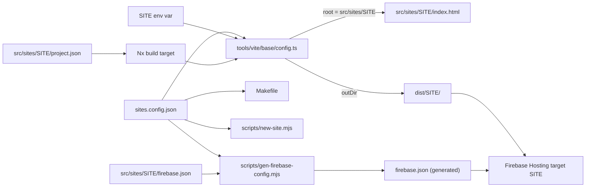

`yelo-web` is a single Vite + React project that builds several independent web properties: the admin dashboard, the signup and Auth v3 flow, the marketing landing page, and a handful of small public sites. Each site builds into its own `dist/<site>/` directory and deploys to its own Firebase Hosting site.

This page explains the moving parts so you can work on an existing site or add a new one. For the per-site inventory, see [Sites](/engineering/web/sites). For CI and production rollout, see [Deployment](/engineering/deployment).

## How it fits together



## The pieces

| File | Role |
| --- | --- |
| `sites.config.json` | The registry. A JSON array of site names. Everything else reads it. |
| `vite.config.ts` | A one-line re-export of `tools/vite/base/config.ts`, which holds the real config. |
| `tools/vite/base/config.ts` | Reads `SITE`, validates it against the registry, and sets `root`, `outDir`, `publicDir`, `base`, plugins, and dev-server proxies. |
| `src/sites/<site>/project.json` | Nx project for the site: its build command, cache inputs, required build variables, and implicit dependencies. |
| `src/sites/<site>/firebase.json` | That site's Hosting config: headers, rewrites, redirects. |
| `firebase.json` (root) | Generated by `pnpm firebase:config` from the per-site files. Do not edit by hand. |
| `.firebaserc` | Maps each Hosting target name to a Firebase Hosting site ID in the `yelo-dashboard-v2` project. |
| `Makefile` | Per-site and bulk `build`, `deploy`, and `dev` targets, all derived from the registry. |
| `scripts/new-site.mjs` | The `make new-site` generator. |
| `src/shared/bootstrap/` | `renderSite()` and `ClerkAuth`, the shared app bootstrap. |

### The SITE variable

`tools/vite/base/config.ts` reads `process.env.SITE` and defaults to `dashboard`. An unknown value throws `Unknown SITE "..."` and lists the valid names. For the selected site, the config sets:

- `root` to `src/sites/<site>/`, so Vite uses that folder's `index.html` as the entry.
- `build.outDir` to `dist/<site>/`. The one exception is `world-cup`, which builds into `dist/world-cup/world-cup/` with `base: '/world-cup/'` so it can be served under a path on the marketing domains.
- `cacheDir` to `node_modules/.vite/<site>`, so sites never share a dependency pre-bundle cache.
- `publicDir` to `src/sites/<site>/public/` if it exists, otherwise the shared root `public/`. `home` and `world-cup` use site-local public directories so their heavy media never ships with another site.
- `envDir` to the workspace root, so every site reads the same `.env`.
- The `@/` alias to `src/`.

It also applies site-specific plugins and inputs:

| Site | Extra behavior |
| --- | --- |
| `dashboard` | `dashboardSearchIndexPlugin` generates the `virtual:dashboard-search-index` module for global search. |
| `signup` | A second HTML entry, `src/sites/signup/auth/v3/index.html`, so `/auth/v3` ships only React and its own code. In dev, `VITE_AUTH_V3_DEVICE_TEST=true` enables a mock Auth v3 server plugin. |
| `maestro` | A second HTML entry at `src/sites/maestro/auth/v3/index.html` that reuses the signup Auth v3 page. |
| `home` | Generates `public/img/` from `assets-src/` at build start, and emits `.well-known` app-association files. |
| `invite` | Emits `.well-known` app-association files with invite-specific link paths. |
| `world-cup` | Cleans its hosting root before each build. |

Every build also defines `__BUILD_SHA__` (short git SHA), `__BUILD_TIME__`, and `__AUTH_V3_DEVICE_TEST__`.

### Dev server proxies

The dev server proxies `/api` and `/riverui` to `VITE_API_PROXY_TARGET` (default `https://api.rideyelo.com`), and `/world-cup/api` to the same target with a path rewrite. Set `VITE_API_PROXY_TARGET` before you run a site locally, because create and update actions hit whatever environment it points at. See [Local development](/engineering/local-development) for the full setup, including the `dev.dash.rideyelo.com` HTTPS mode.

### Per-site Nx projects

Each site is an Nx application project tagged `firebase-site`. The build target runs `SITE=<site> pnpm exec vite build`, caches `dist/<site>`, and lists the environment variables that affect the output as cache inputs. `metadata.requiredBuildEnv` names the variables that must be present in CI; `scripts/require-site-env.mjs` fails the pipeline if any are missing.

Shared code is split into library projects (`dashboard-components`, `shared-theme`, `vite-config`, the per-consumer generated clients, and others) so `nx affected` rebuilds only the sites that import a changed file. CI also checks that the set of `firebase-site` projects matches `sites.config.json` exactly.

<Note>
`tools/vite/base/config.ts` is an implicit dependency of every site. Changing it marks every site as affected and redeploys all of them on the next `main` push. Prefer site-local build steps when a change only matters to one site. The `home` site's `scripts/emit-partner-html.mjs` runs from its own build target for this reason.
</Note>

### Per-site Firebase config

Each site owns `src/sites/<site>/firebase.json`. `scripts/gen-firebase-config.mjs` concatenates them into the root `firebase.json` and validates that:

- the file exists for every registered site;
- `target` equals the site name;
- `public` equals `dist/<site>`.

Run `pnpm firebase:config` after you edit any site's Hosting config, and commit the regenerated root file. `pnpm firebase:config:check` fails if the root file is stale, and both CI and `make deploy-<site>` run it.

## The shared bootstrap

Most sites call `renderSite()` from `src/shared/bootstrap/renderSite.tsx` in their `main.tsx` instead of wiring providers by hand. It mounts into `#root` inside `StrictMode` and wraps the app with only the providers you enable:

| Option | Provider |
| --- | --- |
| `query` | TanStack `QueryClientProvider` with a 5-minute `staleTime` and `retry: 1` |
| `router` | `BrowserRouter` |
| `toaster` | sonner `Toaster` (bottom-right, rich colors) |
| `tooltip` | Radix `TooltipProvider` |
| `dubAnalytics` | Dub analytics, with its cookie scoped to `.joinyelo.com` for 90 days |

```tsx src/sites/event/main.tsx
import { renderSite } from '@/shared/bootstrap/renderSite';
import App from './App.tsx';
import './styles.css';

renderSite(<App />, { query: true, router: true, toaster: true });
```

`src/shared/bootstrap/ClerkAuth.tsx` wraps children in `ClerkProvider` using `VITE_CLERK_PUBLISHABLE_KEY` and throws if the key is missing. Clerk is isolated there so sites that never import it tree-shake Clerk out of their bundle.

<Warning>
No site currently imports `ClerkAuth`. The dashboard is the only authenticated site, and it keeps a bespoke `src/sites/dashboard/main.tsx` that sets up Sentry, `ClerkProvider`, the theme, a per-session `QueryClient`, `CommunityProvider`, and the Clerk axios interceptor directly. `home` also skips `renderSite` and calls `createRoot` itself. See [Dashboard architecture](/engineering/web/dashboard-architecture) for the dashboard bootstrap.
</Warning>

### Styling per site

Because Vite's `root` is the site folder, Tailwind v4 only auto-scans that folder. Each site has a `styles.css` that imports the shared theme from `src/shared/theme/index.css` and adds an `@source` line for every shared directory or component it renders:

```css src/sites/<site>/styles.css
@import '../../shared/theme/index.css';
@source "../../components/ui/button.tsx";
```

The dashboard scans all of `src/components`, `src/contexts`, `src/hooks`, and `src/lib`. Smaller sites list only what they use to keep their CSS small. If a shared component renders unstyled in `make dev`, you are missing its `@source` line. `home` does not use Tailwind at all.

## Commands

| Task | Command |
| --- | --- |
| List sites and their commands | `make sites` |
| Dev server for the dashboard | `make dev` |
| Dev server for another site | `SITE=signup make dev` |
| Build one site | `make build-site SITE=signup` (runs `pnpm nx build signup`) |
| Build every site | `make build-all` (clears `dist/`, typechecks, then `pnpm build:all`) |
| Build only affected sites | `pnpm build:affected -- --base=origin/main --head=HEAD` |
| List affected sites | `pnpm affected:sites -- --base=origin/main --head=HEAD` |
| Regenerate root `firebase.json` | `pnpm firebase:config` |
| Preview Hosting locally | `make serve` (Firebase emulator) |
| Build and deploy one site | `make deploy-<site>` |
| Build and deploy every site | `make deploy-all` |

<Note>
`make deploy-<site>` runs the Nx build only and skips `tsc`. Run `pnpm typecheck` first if you deploy manually. Production deploys normally happen from CI on `main`; see [Deployment](/engineering/deployment).
</Note>

## Add a new site

For a fuller recipe, see [Add a web site](/engineering/cookbook/add-a-web-site). For the generator and fixture scripts, see [Web build helpers and fixtures](/engineering/web-extra/tooling-and-fixtures).

<Steps>
  <Step title="Scaffold the site">
    Run `make new-site NAME=<name>`. The name must be lowercase letters, digits, and dashes, and start with a letter.

    The generator copies `scripts/templates/site/` into `src/sites/<name>/`, which gives you `index.html`, `main.tsx`, `App.tsx`, `styles.css`, `project.json`, and `firebase.json`. It appends the name to `sites.config.json` and regenerates the root `firebase.json`.
  </Step>
  <Step title="Run it locally">
    Run `SITE=<name> make dev`. The template renders a "coming soon" page through `renderSite(<App />, { query: true, toaster: true })`. It is a public site with no auth.
  </Step>
  <Step title="Declare build inputs">
    In `src/sites/<name>/project.json`, list every `VITE_*` variable the site reads under `metadata.requiredBuildEnv` and as `env` inputs on the build target. Add shared library projects to `implicitDependencies` only if Nx cannot infer the import.
  </Step>
  <Step title="Configure Hosting behavior">
    Edit `src/sites/<name>/firebase.json` for headers, rewrites, and redirects. Keep `target` and `public` unchanged. Run `pnpm firebase:config` afterward.
  </Step>
  <Step title="Create the Firebase Hosting site">
    Someone with Firebase project access creates the Hosting site and maps the target once. The generator prints these commands:

    ```bash
    firebase hosting:sites:create yelo-<name> --project yelo-dashboard-v2
    firebase target:apply hosting <name> yelo-<name> --project yelo-dashboard-v2
    ```

    Hosting site IDs are globally unique. If `yelo-<name>` is taken, choose another ID; the target name stays `<name>`. Commit the resulting `.firebaserc` change.
  </Step>
  <Step title="Add CI variables and deploy">
    Add any new `VITE_*` values as GitHub repository variables and reference them in both workflow `env` blocks. Merge to `main`, and CI builds and deploys the new site because it is affected.
  </Step>
</Steps>

<Tip>
To add auth to a new site, wrap the app in `ClerkAuth` and pass `router: true` to `renderSite`. Clerk keys and roles are covered in [Dashboard roles](/administration/dashboard-roles).
</Tip>

## Related

<CardGroup cols={2}>
  <Card title="Sites" href="/engineering/web/sites">What each site does, who uses it, and how it authenticates.</Card>
  <Card title="Dashboard architecture" href="/engineering/web/dashboard-architecture">Routing, roles, and data fetching in the admin app.</Card>
  <Card title="OpenAPI and clients" href="/engineering/openapi-and-clients">How the per-consumer Orval clients are generated.</Card>
  <Card title="Deployment" href="/engineering/deployment">The Nx affected pipeline and Firebase deploys.</Card>
</CardGroup>
