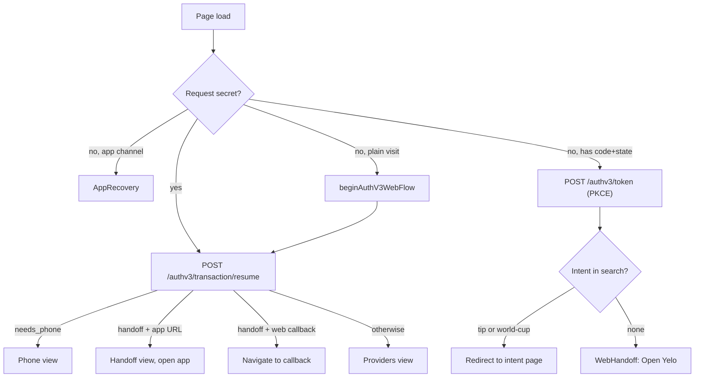

The `signup` site (`src/sites/signup/`) is the browser half of Yelo sign-in. It hosts the Auth v3 transaction page that the app opens in a browser, runs a web-only PKCE flow for people who arrive without the app, and carries three intent flows: tipping, World Cup claims, and account deletion. The API side of Auth v3 is covered in [Identity overview](/engineering/identity/overview) and [Auth v3 transaction lifecycle](/engineering/identity/auth-v3-transactions). This page covers what the browser does.

## Two bundles, one site

| Entry | HTML | Mounts | Loads |
| --- | --- | --- | --- |
| Auth v3 | `src/sites/signup/auth/v3/index.html` → `auth/v3/main.tsx` | `AuthV3Page` directly with `createRoot` | React, `posthog-js` (lazy by config), the Auth v3 fetch client. No router, React Query, axios, sonner, or Dub. |
| Main | `src/sites/signup/index.html` → `main.tsx` | `App` through `renderSite({ query, toaster, router, dubAnalytics })` | Tip, World Cup, delete-account, and the fallback Auth v3 route |

`tools/vite/base/config.ts` adds the second Rollup input only when `SITE=signup`. Firebase rewrites `/auth/v3`, `/auth/v3/`, and `/auth/v3/callback` to `/auth/v3/index.html` and everything else to `/index.html` (`src/sites/signup/firebase.json`). `App.tsx` still lazy-loads `AuthV3Page` for those paths as a fallback if the rewrite ever misses.

Both entries call `captureAuthV3RequestSecret()` before React mounts, so the `#request=` fragment never reaches Dub, PostHog, or React state.

## Main-bundle routing

`App.tsx` routes on `window.location.pathname` and query parameters, not React Router routes:

| Condition (checked in order) | Renders |
| --- | --- |
| `isAuthV3Path()`: `/auth/v3` or `/auth/v3/callback`, trailing slashes ignored | `AuthV3Page` (lazy) |
| `isDeleteAccountPath()`: `/delete-account`, case-insensitive | `DeleteAccountPage` (lazy) |
| Dev build and `?preview=all` or `?preview=<step>` | `PreviewGallery` or a single step. Stubs `GET /tips/*` with sample data. |
| A `tip` path segment followed by a slug, and `?status=success` | `TipComplete` |
| A `tip` segment with a slug | `TipStep`, authenticated if `?auth=complete` |
| `?intent=world-cup`, or a path ending in `/world-cup` or `/world-cup/claim` | `AuthV3Redirect` until `?auth=complete`, then `WorldCupClaimFlow` |
| Anything else, including `/` | `AuthV3Redirect` with the current search string |

The tip match looks for a `tip` segment anywhere in the path, so `/tip/<slug>`, `/web/tip/<slug>`, and the proxied `/pay/tip/<slug>` all work.

## The Auth v3 page state machine

`AuthV3Page` (`src/sites/signup/auth-v3/AuthV3Page.tsx`) decides what to render from three inputs: whether a request secret was captured, whether this is an app-channel transaction, and whether the URL is a web callback.

### Views and API calls

| View or action | API call (`generated/auth-v3/client/endpoints.ts` through `authV3Client.ts`) | Notes |
| --- | --- | --- |
| Configuration | `GET /authv3/config` | Loaded lazily; the provider buttons paint before it returns. A tap awaits the same promise. |
| Legal acceptance | `POST /authv3/transaction/accept` with `terms_version`, `privacy_version`, `attribution` | Sent on the first provider or phone tap, never on load. Skipped for Google or Apple phone continuations. |
| Google or Apple | `POST /authv3/providers/google/start` or `/apple/start` | Response `authorization_url` must be `https:` (`isSafeProviderURL`) or the page refuses to navigate. |
| Phone send | `POST /authv3/providers/phone/send` with `+1` and 10 digits | US numbers only. `Retry-After` drives the resend cooldown. |
| Phone verify | `POST /authv3/providers/phone/verify` | On a network or 5xx error, calls `resume` before asking for a new code, because the server may have committed. |
| Resume | `POST /authv3/transaction/resume` | On mount and on `pageshow` from the back-forward cache. |
| Handoff | — | `redirect_url` must be `<scheme>://auth/v3/callback` (`isSafeAppHandoffURL`) or a same-origin `/auth/v3[/callback]?code&state` (`isSafeWebAuthCallbackURL`). |

Every request goes through `authV3Fetch` (`authV3Fetch.ts`): a 12-second `AbortController` timeout, `X-API-Version: v2`, `credentials: 'omit'` unless the caller asks for `include`, and an `Authorization: AuthV3 <requestSecret>` header for transaction-bound calls. Any non-`success` envelope becomes an `AuthV3ClientError` whose `kind` comes from `authV3ErrorKind()`: `409` or `IdentityConflictError` is `conflict`, `410` or `AuthTransactionExpiredError` is `expired`, `429` is `rate_limit`, `503` or `ProviderUnavailableError` is `provider_unavailable`.

The API base is `authV3APIBaseURL()`: `VITE_API_URL`, or `https://api.joinyelo.com` when a production build has a relative value.

### App recovery

For an app transaction whose secret is missing or expired, `AppRecovery` navigates to `com.rideyelo://auth/v3/callback?error=web_recovery` when the app advertised `app_recovery=1` (captured and stored with the transaction). Without that capability it shows "Close this browser to return to Yelo". The recovery URL is a signal, not a credential. The app resumes with its own stored secret. The canonical web redirect is `/auth/v3/callback`, and `/auth/v3` is still accepted.

### Terminal errors

`conflict`, `account_merge_required`, `verify_existing_account`, and `expired` replace the page with `TerminalError`. Configuration failures show the same screen with **Try again**, which resets the cached config and acceptance promises. Every error screen shows the support phone, email, and the `request_id` from the error envelope as a "Support ID".

### Mobile keyboard handling

iOS opens the keyboard only for focus changes inside a user gesture. `showPhoneInput` and `showOTPInput` use `flushSync` to mount and focus the input in the same tap, and the Continue button no longer auto-advances on the tenth digit. The OTP auto-submits on its last digit. `useAuthV3VisualViewport` mirrors `visualViewport` into `--auth-v3-visual-viewport-height`. `pnpm dev:signup-device` (which sets `VITE_AUTH_V3_DEVICE_TEST=true`) plus `?device-test=1` enables a mock server and an on-screen keyboard trace; production builds compile the trace out through `__AUTH_V3_DEVICE_TEST__`.

## Web PKCE flow

People who reach `/auth/v3` without a request secret, for example from a tip link, run a browser-only flow in `webFlow.ts`:

<Steps>
  <Step title="Read public config">
    `beginAuthV3WebFlow()` calls `GET /authv3/config` and requires `web_auth_url` and `web_redirect_uri` on the same origin, with the redirect path `/auth/v3` or `/auth/v3/callback`, over HTTPS (or `http://localhost`).
  </Step>
  <Step title="Hand off cross-origin if needed">
    If `web_auth_url` is on another origin, the browser navigates there with the current search string and stops. PKCE state is per-origin `sessionStorage`, so it must be created where the callback lands.
  </Step>
  <Step title="Authorize">
    Generate a 32-byte `state` and a 64-byte `code_verifier`, store both with the redirect URI and return search under `yelo.auth-v3.web-pending`, then `POST /authv3/authorize` with `channel: 'web'`, `client_id: 'yelo-web'`, and an `S256` challenge. The response `web_url` must be same-origin `/auth/v3`. The page adopts the returned `#request=` secret in place with `adoptAuthV3RequestSecret()` because a fragment-only change does not reload the document.
  </Step>
  <Step title="Exchange the code">
    After the provider or OTP step, the API redirects to the web callback with `code` and `state`. `completeAuthV3WebFlow()` checks `state`, calls `POST /authv3/token` with `credentials: 'include'` so the API can set its refresh cookie, stores the returned JWT with `setSignupToken()`, and rewrites the URL to `/auth/v3` plus the saved return search.
  </Step>
  <Step title="Route to the intent">
    `authV3WebCompletionPath()` maps `intent=world-cup` to `/world-cup/claim?auth=complete` and `intent=tip` to `/pay/tip/<slug>?auth=complete[&amount=]`, or `?status=success&signed_up=true` when `after=tip-success`. Otherwise the page shows `WebHandoff` with an **Open Yelo** link. On current main the intent is stripped before this mapping runs, so every web completion shows `WebHandoff`. See [Gotchas and edge cases](#gotchas-and-edge-cases).
  </Step>
</Steps>

`authV3EntryPath()` builds the entry URL and copies only allowlisted attribution parameters (`utm_*`, `source_channel`, `channel`, `dub_id`, `ref`, `referral_code`, `code`), each truncated to 256 characters. `tip_slug` must match `[A-Za-z0-9_-]` and be at most 128 characters; `amount` must be 2 to 8 digits.

## Tip links

QR payment configs show a Dub short link (`pay.yelo.link/<slug>` in `QRConfigCards`). The canonical tip page is `joinyelo.com/pay/tip/<slug>`, which the `experience-router` Worker proxies to this site's `/tip/<slug>`. See [Edge and routing](/engineering/web/edge-and-routing).

| Step | Call | Auth |
| --- | --- | --- |
| Load config | `tippingGetConfig` → `GET /tips/{slug}` | Public. Returns fleet name, optional driver name and photo, and `fixed` or `custom` pricing in cents. |
| Record visit | `tippingTrackVisit` → `POST /tips/{slug}/visit` | Presignup JWT; only when `?auth=complete` |
| Tip as guest | `tippingCreateGuestCheckout` → `POST /tips/{slug}/guest-checkout` | Public |
| Tip with Yelo | `startAuth()` → web PKCE flow with `intent=tip`, then `tippingCreateCheckout` → `POST /tips/{slug}/checkout` | Presignup JWT |
| Return from Stripe | `?status=success&checkout=guest\|yelo&session_id=` or `?status=canceled` | Success and cancel URLs are built from `https://joinyelo.com/pay/tip/<slug>` in `yelo-api/internal/service/tipping/tipping.go:17` |

Custom amounts show preset buttons for $5, $10, $15, and the config's preset, filtered to the allowed range. A `?amount=` in cents pre-selects a value. `TipComplete` offers **continue with yelo signup** unless `?signed_up=true`.

## World Cup claim

`/world-cup/claim` (proxied from `joinyelo.com/world-cup/claim`) first runs the web flow with `intent=world-cup`. With `?auth=complete`, `WorldCupClaimFlow` shows `EduClaimStep`, which validates `*.edu` in the browser and calls `worldCupClaimEducationEmail` → `PUT /world-cup/education-claim`, behind the presignup-token middleware. **Skip for now** asks for confirmation, then both paths end at `Handoff`, which links back to `https://rideyelo.com/world-cup`.

## Account deletion

`/delete-account` runs Auth v2 phone OTP (`POST /authv2/phone/request-otp`, `/verify-otp`). Only a response with `status: 'authenticated'` and a token can continue (`classifyVerifyResponse`), so Auth v3 accounts without an email (phone sign-ups) or without a phone (web Google or Apple sign-ups) can't delete here. The page then loads `GET /user/current-user`, shows a masked email or last four phone digits, requires the word `DELETE`, and calls `DELETE /user/i/{id}`. A `401` or `404` on that call is treated as already deleted, because the identity transaction can commit `is_deleted` and a later step (the legacy scrub or the response) can still fail. The comment in `deleteAccount.ts` says `is_deleted` is committed before details are wiped, but each scrub sets both in one `UPDATE`.

## Browser storage and cookies

| Key | Type | Written by | Purpose |
| --- | --- | --- | --- |
| `yelo.auth-v3.request-record-v1` | `sessionStorage` | `requestSecret.ts` | The request secret and its context (`id`, `app`, `transactionID`, `recovery`) committed together. An app transaction survives a reload when the history marker matches, or when the URL has `channel=app` and the same `transaction_id`. Cleared after an app handoff. |
| `yeloAuthV3` | `history.state` | `requestSecret.ts` | Binds the stored record to this history entry so an unrelated visit cannot adopt it. Never holds the secret. |
| `yelo.auth-v3.request-secret`, `yelo.auth-v3.request-context` | `sessionStorage` | Legacy | Only removed now; never read. |
| `yelo.auth-v3.web-pending` | `sessionStorage` | `webFlow.ts` | PKCE `state`, `codeVerifier`, redirect URI, and return search |
| `yelo_signup_jwt` | `sessionStorage` | `signupTokenStore.ts` | Presignup or full JWT for `/authv2/`, `/user/`, `/world-cup/`, and `/tips/` requests |
| `yelo.auth-v3.analytics-context` | `sessionStorage` | `analytics.ts` | Correlation IDs for PostHog, without email |
| `yelo_anon_id` | Cookie, 90 days, `SameSite=Lax`, `Secure` on HTTPS | `attribution.ts` | Anonymous ID sent in legal-acceptance attribution. Scoped to `.joinyelo.com` on that domain. |
| `dub_id` | Cookie (read only) | Dub | Fallback click ID when `?dub_id=` is absent |
| Dub analytics cookie | Cookie, `.joinyelo.com`, 90 days | `renderSite({ dubAnalytics })` | Main bundle only |

`signupSession.ts` installs an axios interceptor on import. It attaches the token only to signup paths. On a `401` it calls `POST /authv3/session/refresh` with credentials and retries that request once (`_yeloAuthRetried`). Concurrent 401s in one tab share a single module-level refresh promise. Other tabs don't share it. A failed refresh clears the token. A `401` whose body marks the account deleted clears the token and sends the browser to `/`.

## Analytics

`initializeAuthV3Analytics()` initializes PostHog only when `VITE_POSTHOG_KEY` is set, `VITE_APP_ENV` (or Vite mode) is `production`, and the context is not an emulator, a test account, or an `@rideyelo.com` email. Pageview, pageleave, and autocapture are off; session replay masks inputs and anything with `ph-no-capture`. Events are the `auth_v3_*` set in `analytics.ts` with `event_schema_version: 2`. On a `pagehide` before completion, the page sends `auth_v3_abandoned` with the last stage.

## Where this lives in code

| Concern | Path |
| --- | --- |
| Main router | `yelo-web/src/sites/signup/App.tsx` |
| Entries | `src/sites/signup/main.tsx`, `src/sites/signup/auth/v3/main.tsx` |
| Auth v3 page and helpers | `src/sites/signup/auth-v3/` (`AuthV3Page.tsx`, `requestSecret.ts`, `webFlow.ts`, `webIntent.ts`, `redirects.ts`, `authV3Fetch.ts`, `attribution.ts`, `analytics.ts`) |
| Recovery notes | `src/sites/signup/auth-v3/README.md` |
| Shared steps | `src/shared/signup/steps/` (`TipStep`, `EduClaimStep`, `Handoff`, `OtpStep`, `PhoneStep`, `OAuthStep`) |
| Token store and interceptor | `src/shared/signup/signupTokenStore.ts`, `signupSession.ts` |
| Hosting headers and CSP | `src/sites/signup/firebase.json` |
| Device-test mock | `tools/vite/signup/auth-v3-device-test.ts` |
| API routes | `yelo-api/internal/server/http/router.go` (Auth v3, `/tips`, `/world-cup` groups), `server/http/tipping/routes.go`, `server/http/worldcup/routes.go` |

## Gotchas and edge cases

- **Web completion loses the intent.** On the callback load, `completeAuthV3WebFlow()` restores the saved return search with `replaceState`, so `intent`, `tip_slug`, `amount`, and `after` are briefly back in the URL. Its `.then` then calls `initializeAuthV3Analytics()` before `authV3WebCompletionPath(window.location.search)` (`AuthV3Page.tsx:595-596`). The provider round trip was a full page load, so analytics initializes again, and `sanitizedAuthV3Search()` rewrites the URL to the safe correlation keys only. The completion path then sees no intent, and the user lands on the generic **Open Yelo** screen instead of the tip or World Cup page. Computing the path from the pending record's `returnSearch` would avoid this.
- **Stale comment about tip config.** The preview stub in `App.tsx` says the tip config "needs a verified session". `GET /tips/{slug}` is public (`tipping/routes.go`); only `visit` and `checkout` need a token.
- **Authenticated tippers see a signup prompt.** Stripe returns to `?status=success&checkout=yelo` without `signed_up=true`, so `TipComplete` still shows **continue with yelo signup** after a signed-in tip.
- **Two app schemes.** Auth v3 uses `VITE_AUTH_V3_APP_SCHEME` (default `com.rideyelo`, `com.rideyelo.e2e` for maestro). The fleet invite page on the `invite` site uses `yelo:///`.
- **US phone numbers only.** The phone view prefixes `+1` and strips a leading `1` from 11-digit input.
- **World Cup `.edu` check is loose.** The browser regex accepts any address ending in `.edu`, including subdomains; the API normalizes and validates.
- **Auth v3 disabled returns `503`.** When `AUTH_V3_ENABLED` is off, the API answers every `/authv3/*` path with `AuthV3UnavailableError`, which the page maps to `provider_unavailable`.
- **The CSP limits API hosts.** `/auth/v3` only allows `connect-src` to `api.joinyelo.com`, `api.rideyelo.com`, and PostHog. A new API hostname needs a `firebase.json` change and `pnpm firebase:config`.
