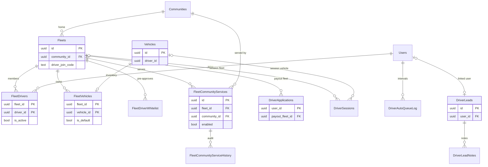

A fleet is the operator that drives rides in one or more communities. Drivers belong to fleets through `"FleetDrivers"`. Vehicles are either personal (owned by a driver) or shared fleet inventory (`"FleetVehicles"`). `"FleetCommunityServices"` decides which fleet serves which community. Fleet calendars are on [Fleet calendars](/reference/database/fleets-calendars). Driver columns on `"Users"` are on [Users and identity](/reference/database/users-and-identity).

## Fleets

| Column | Type | Null | Default | Meaning |
| --- | --- | --- | --- | --- |
| `id` | `uuid` | no | `gen_random_uuid()` | Primary key. |
| `name` | `text` | no | | Display name. The fleet named `Yelo` is special-cased in T0 ride notifications, which reach only founding drivers of that fleet. |
| `logo_url` | `text` | yes | | Logo. |
| `has_owner_operators` | `boolean` | no | `true` | Set to `payment_model = 'owner_operator'` at creation (`internal/service/dashboard/fleet.go`). |
| `has_custom_payouts` | `boolean` | no | `false` | Payouts go to the fleet's Stripe account instead of each driver. |
| `stripe_merchant_id` | `text` | yes | | Fleet's connected Stripe account. Partial index where not null. |
| `primary_vehicle_type` | `text` | no | `'x'` | Default vehicle type slug. |
| `community_id` | `uuid` | no | | Home community. FK to `"Communities"`. Where the fleet operates is decided by `"FleetCommunityServices"`. |
| `payment_model` | `text` | no | `'owner_operator'` | `owner_operator` or `fleet_merchant` (`models.PaymentModel`). No CHECK. |
| `supported_vehicle_types` | `text[]` | no | `'{x}'` | Vehicle types the fleet offers. Validated against the vehicle type catalog on create. |
| `stripe_status` | `text` | no | `'not_required'` | Fleet Stripe onboarding state. `complete` is required for payout readiness. |
| `stripe_onboarding_url` | `text` | yes | | Stripe onboarding link. |
| `is_active` | `boolean` | no | `true` | Inactive fleets are hidden from pricing, joins, and vehicle availability. |
| `deleted_at` | `timestamptz` | yes | | Archive time. Set by **Archive fleet**. Partial index on rows where it is null. See [Fleet archival](#fleet-archival). |
| `created_at`, `updated_at` | `timestamptz` | no | `now()` | Timestamps. |
| `requires_confirmation_code` | `boolean` | no | `true` | When `false`, `generateConfirmCodeForFleet` in `internal/service/ride/rider.go` skips the pickup PIN. |
| `is_student_only` | `boolean` | no | `false` | Hides the fleet's ride options from riders without a student account (`filterRideTypesForRider`). |
| `driver_join_code` | `text` | yes | | Code in the driver join link. Unique partial index where not null. |
| `driver_join_code_rotated_at` | `timestamptz` | yes | | Last rotation or disable. |

**Payout readiness.** `models.Fleet.IsDriverPayoutReady` and the matching SQL in `queries/fleet_join.sql` and `queries/community.sql` require: not deleted, active, `payment_model = 'fleet_merchant'`, `has_custom_payouts`, a non-blank `stripe_merchant_id`, and `stripe_status = 'complete'`. Owner-operator fleets can accept joins only when `has_custom_payouts` is `false`.

**Join codes.** `internal/service/fleetjoin` rotates codes with `SetFleetJoinCode`, which compares against the expected old code so concurrent rotations cannot both win. `DisableFleetJoinCode` sets the code to null.

**Written by / read by.** `internal/service/dashboard/fleet.go` creates fleets and can copy pricing from a source fleet. Queries live in `queries/driver_fleet_primitives.sql` and `queries/fleet_join.sql`, with dashboard reads in `internal/data/repository/dashboard.go`.

Dashboard fleet invites are Clerk invitations with fleet assignments in metadata (`internal/service/dashboard/dashboard.go`). No invite table exists in Postgres.

### Fleet archival

`DELETE /dashboard/communities/{id}/fleets/{fleet_id}` archives a fleet through `DeleteFleet` in `internal/data/repository/dashboard.go`. It locks the fleet, then runs `GetFleetArchiveBlockers` (`queries/fleet_archive.sql`). Archival is refused while any of these exist:

- An active `"FleetDrivers"` row for the fleet.
- A `"DriverApplications".payout_fleet_id` pointing at it.
- An open `"DriverSessions"` row (`end_time IS NULL`).
- A `"Rides"` row for the fleet outside `complete`, `pending_rider_rating`, and `no_drivers_available`.
- A `"Communities".primary_fleet_id` pointing at it.
- A fleet vehicle that is unarchived or selected as some user's `vehicle_id`.
- An active `"QrPaymentConfigs"` row.

When nothing blocks, one transaction runs `DeactivateDashboardFleet` (`is_active = false`, `deleted_at = now()`, `driver_join_code = NULL`), `RetireArchivedFleetServices` (`updated_by = 'fleet_archive'`), `EndArchivedFleetPricing`, and `DisableArchivedFleetWhitelist`. The row, historical rides, and `stripe_merchant_id` are kept. There is no unarchive path.

**Archive guard triggers.** Migration `000346_fleet_archive_reference_guards` adds `guard_unarchived_fleet_reference()`. It takes `FOR SHARE` on the referenced fleet row, which conflicts with archival's `UPDATE`, and raises `Fleet is archived or missing` (SQLSTATE `23514`) when the fleet has `deleted_at` set or doesn't exist. It checks on insert, when the fleet column changes, and for `"FleetDrivers"` and `"QrPaymentConfigs"` whenever the row is active. For `"QrPaymentConfigs"` it also checks when `stripe_payment_link_id` changes. Historical rows stay editable while their fleet reference doesn't change.

| Trigger | Table | Fires before |
| --- | --- | --- |
| `guard_fleet_membership_archive` | `"FleetDrivers"` | Insert, or update of `fleet_id` or `is_active` |
| `guard_fleet_ride_archive` | `"Rides"` | Insert, or update of `fleet_id` |
| `guard_fleet_primary_archive` | `"Communities"` | Insert, or update of `primary_fleet_id` |
| `guard_fleet_vehicle_archive` | `"FleetVehicles"` | Insert, or update of `fleet_id` |
| `guard_fleet_payout_archive` | `"DriverApplications"` | Insert, or update of `payout_fleet_id` |
| `guard_fleet_qr_archive` | `"QrPaymentConfigs"` | Insert, or update of `fleet_id`, `is_active`, or `stripe_payment_link_id` |
| `guard_fleet_session_archive` | `"DriverSessions"` | Insert, or update of `fleet_id` |

The migration adds no columns and backfills nothing. Its down migration drops the triggers and the function.

## Fleet drivers

`"FleetDrivers"` records fleet membership.

| Column | Type | Null | Default | Meaning |
| --- | --- | --- | --- | --- |
| `fleet_id` | `uuid` | no | | FK to `"Fleets"` `ON DELETE CASCADE`. |
| `driver_id` | `uuid` | no | | FK to `"Users"` `ON DELETE CASCADE`. |
| `is_active` | `boolean` | no | `true` | The driver's currently selected fleet. Inactive rows still mean membership: the driver selected another fleet. |

- Primary key `(fleet_id, driver_id)`. Unique partial index `fleet_drivers_one_active_per_driver` on `driver_id` where `is_active`, so a driver has at most one active fleet.
- `SetDriverActiveFleet` flips every membership in one statement. `UpsertDriverFleetMembership` inserts or reactivates. `DeactivateOtherDriverFleets` clears the others.
- The admin membership editor (`GET` and `PUT /dashboard/users/detail/{id}/fleets`, `internal/data/repository/driver_fleet_memberships.go`) reads `ListDriverFleetMemberships`, which includes archived fleets as `is_archived`. A confirmed edit locks the user, compares the expected memberships and active fleet, then locks the fleets in order. It adds rows with `AddInactiveDriverFleetMembership`, deletes explicit removals with `RemoveDriverFleetMemberships`, and clears a fleet vehicle the driver can no longer use (`ClearRevokedDriverFleetVehicle`). A driver with an active ride blocks the whole edit.
- Inactive memberships in archived fleets remain and can be removed, but the archive guard rejects reactivating them.
- Trigger `fleet_driver_default_vehicle` runs `select_fleet_default_vehicle()` after insert or update of `is_active`. When a membership becomes active, it sets `"Users".vehicle_id` to the fleet's default approved, unarchived vehicle. If the fleet has none and the user's current vehicle is fleet inventory, it clears `vehicle_id`.
- Assignment on going online (`reconcileFleetAssignmentForUser` in `internal/service/driver/driver.go`): keep the active fleet, else activate the first existing membership, else call `AddDriverToDefaultFleet` with the `primary_fleet_id` of the default community (`GetDefaultCommunity`: `is_default`, not test, not archived). That insert only happens when the driver still has no membership under the driver lock, and the fleet must be ready and `owner_operator`. The email whitelist and a market community's `primary_fleet_id` aren't used.

## Fleet driver whitelist

`"FleetDriverWhitelist"` maps an email to a fleet and community. Automatic fleet assignment no longer reads it, so an entry doesn't create a membership.

| Column | Type | Null | Default | Meaning |
| --- | --- | --- | --- | --- |
| `id` | `uuid` | no | `gen_random_uuid()` | Primary key. |
| `email` | `text` | no | | Driver email. Globally unique, so one email maps to one fleet. Matched exactly. |
| `fleet_id` | `uuid` | no | | FK to `"Fleets"` `ON DELETE CASCADE`. |
| `community_id` | `uuid` | no | | FK to `"Communities"` `ON DELETE CASCADE`. |
| `added_by` | `uuid` | yes | | FK to `"Users"` `ON DELETE SET NULL`. |
| `is_active` | `boolean` | no | `true` | Only active entries apply. |
| `created_at`, `updated_at` | `timestamptz` | no | `now()` | Timestamps. |

- Indexes on `community_id`, `email` (redundant with the unique constraint), and `(fleet_id, is_active)` where active.
- `UpsertFleetDriverWhitelist` moves an existing email to the new fleet and reactivates it.
- Read only by `GetWhitelistSchoolMatch` (`queries/education_commerce.sql`, called from `internal/data/repository/schools.go`) to place a whitelisted user in the right community.
- `DisableArchivedFleetWhitelist` sets `is_active = false` on a fleet's entries when the fleet is archived.

## Fleet community services

`"FleetCommunityServices"` says which fleets serve which communities. A fleet can price and dispatch in a community only while it has an enabled service there.

| Column | Type | Null | Default | Meaning |
| --- | --- | --- | --- | --- |
| `id` | `uuid` | no | `gen_random_uuid()` | Primary key. |
| `fleet_id` | `uuid` | no | | FK to `"Fleets"`. No cascade. |
| `community_id` | `uuid` | no | | FK to `"Communities"`. No cascade. |
| `enabled` | `boolean` | no | `true` | Service is on. CHECK `enabled = (retired_at IS NULL)`. |
| `revision` | `bigint` | no | `1` | Optimistic-concurrency counter. `UpdateFleetCommunityService` requires the expected revision. |
| `origin` | `text` | no | | Why the row exists: `admin`, `current_price`, `primary_fleet`, or `fleet_creation` (CHECK). |
| `updated_by` | `text` | no | | Actor, copied into history. System writers use labels such as `primary_fleet_configuration` and `community_archive`. |
| `created_at`, `updated_at` | `timestamptz` | no | `now()` | Timestamps. |
| `retired_at` | `timestamptz` | yes | | When the service was disabled. |

**Keys.** Unique `(fleet_id, community_id)`. Unique `fleet_services_scope_key` on `(id, community_id)` backs a composite FK from `"CalendarConnections"`. Index on `(community_id, fleet_id)`.

**Triggers**

| Trigger | Effect |
| --- | --- |
| `validate_fleet_service_parents` (before insert or update) | Rejects changes to `fleet_id` or `community_id`. On update, sets `revision = OLD.revision + 1` and `updated_at`. For enabled rows, locks the community then the fleet and rejects archived communities or deleted fleets (SQLSTATE `23514`). |
| `audit_fleet_community_service` (after insert or update) | Appends to `"FleetCommunityServiceHistory"` and upserts `"CommunityCacheInvalidations"` for the community. |
| `calendar_service_dirty` (after update) | Calls `dirty_calendar_sources()`. |

Related triggers on `"Communities"`: `ensure_primary_fleet_service` inserts a `primary_fleet` service when `primary_fleet_id` changes, and `retire_archived_community_services` disables every service and closes open `"RidePriceParameters"` when a community is archived.

**Written by / read by.** `internal/data/repository/fleet_community_service.go` (`queries/fleet_community_services.sql`) locks the community then the fleet in the same order as the trigger. Price and calendar code reads the `"ActiveFleetCommunityServices"` view.

### FleetCommunityServiceHistory

Append-only audit of service changes, written only by `audit_fleet_community_service()`.

| Column | Type | Null | Default | Meaning |
| --- | --- | --- | --- | --- |
| `id` | `bigint` | no | identity | Primary key. |
| `service_id` | `uuid` | no | | FK to `"FleetCommunityServices"`. No cascade. |
| `enabled` | `boolean` | no | | State after the change. |
| `revision` | `bigint` | no | | Revision after the change. |
| `changed_by` | `text` | no | | Copied from `updated_by`. |
| `changed_at` | `timestamptz` | no | `clock_timestamp()` | Change time. |

No index on `service_id`, and no query reads the table.

### ActiveFleetCommunityServices (view)

Services that are live right now: enabled service, active and undeleted fleet, active and unarchived community.

| Column | Type | Meaning |
| --- | --- | --- |
| `id` | `uuid` | Service ID. |
| `fleet_id` | `uuid` | Fleet. |
| `community_id` | `uuid` | Community. |
| `community_name` | `text` | Community name. |

Used by dashboard pricing lists in `queries/community.sql`, `ListActiveFleetCommunities`, and `ListFleetCommunityServices`, which reports `is_operational`.

## Vehicles

`"Vehicles"` holds personal driver vehicles and shared fleet inventory. The primary key constraint is still named `Cars_pkey`.

| Column | Type | Null | Default | Meaning |
| --- | --- | --- | --- | --- |
| `id` | `uuid` | no | `gen_random_uuid()` | Primary key. |
| `driver_id` | `uuid` | yes | | Owner of a personal vehicle. Null for fleet inventory since migration `000333_fleet_owned_vehicles`. No foreign key. |
| `color`, `make`, `model`, `license_plate` | `varchar(255)` | no | | Vehicle details. |
| `year` | `integer` | no | | Model year. |
| `num_seats` | `integer` | no | `4` | Seats. Must be at least the vehicle type's `min_seats`. Dispatch doesn't compare it to `Rides.num_riders`, which is only set after the trip. |
| `license_plate_state` | `text` | no | `''` | Plate state. |
| `application_status` | `text` | no | `'not_applied'` | Review state: `not_applied`, `pending`, `complete`, `failed`, or `restricted` (`models.ApplicationStatus`). Only `complete` vehicles can go online. |
| `application_submission_time` | `timestamptz` | yes | | Submission time. |
| `application_reviewer` | `uuid` | yes | | Reviewer. No foreign key. |
| `application_review_time` | `timestamptz` | yes | | Review time. |
| `application_rejection_reason` | `text` | yes | | Rejection reason. |
| `vehicle_type` | `text` | no | `'x'` | `"VehicleTypes".slug`. CHECK non-empty. No foreign key. |
| `archived_at` | `timestamptz` | yes | | Soft delete for fleet inventory. |

**Triggers**

- `vehicles_create_driver_lead` runs `create_driver_lead_for_vehicle_application()` once a vehicle is submitted.
- `vehicles_enqueue_quo_sync` runs `enqueue_quo_user_sync()` on changes to `driver_id` or `application_status`. See [Notifications and messaging](/reference/database/growth-notifications-and-messaging).
- `contact_sync_vehicles` runs `enqueue_contact_sync()`.

**Written by / read by.** `internal/service/vehicle` and `internal/data/repository/vehicle.go` handle personal vehicles. `FleetVehicleStore` in `internal/data/repository/fleet_vehicle.go` handles admin inventory. It locks users, then fleet, then vehicle, the same order as enrollment and going online. Archiving refuses a vehicle with an open driver session, clears `is_default`, and unsets `"Users".vehicle_id`.

## Fleet vehicles

`"FleetVehicles"` marks a vehicle as fleet inventory.

| Column | Type | Null | Default | Meaning |
| --- | --- | --- | --- | --- |
| `fleet_id` | `uuid` | no | | FK to `"Fleets"` `ON DELETE CASCADE`. |
| `vehicle_id` | `uuid` | no | | FK to `"Vehicles"` `ON DELETE CASCADE`. |
| `is_default` | `boolean` | no | `false` | Vehicle picked for drivers when they activate this fleet. |

- Primary key `(fleet_id, vehicle_id)`. Unique `fleet_vehicle_owner` on `vehicle_id`: a vehicle belongs to at most one fleet. Unique `fleet_default_vehicle` on `fleet_id` where `is_default`: at most one default per fleet.
- Dispatch excludes a vehicle that belongs to a different fleet than the ride (`queries/community.sql`).

### AvailableDriverVehicles (view)

Which driver can use which vehicle, and under which fleet.

| Column | Type | Meaning |
| --- | --- | --- |
| `vehicle_id` | `uuid` | Vehicle. |
| `driver_id` | `uuid` | Driver allowed to use it. |
| `fleet_id` | `uuid` | Null for personal vehicles, otherwise the owning fleet. |

A personal, unarchived vehicle is available to its owner under any fleet that has no inventory. An unarchived fleet vehicle is available to every member of an active, undeleted fleet, whether their membership is active or not. Read by dispatch, fleet join eligibility, and the session guard.

## Mobile vehicle catalogs

`"MobileVehicleCatalogs"` stores the vehicle artwork bundled in the latest iOS and Android releases. Pricing and vehicle types may only select artwork present in both.

| Column | Type | Null | Default | Meaning |
| --- | --- | --- | --- | --- |
| `platform` | `text` | no | | Primary key. `ios` or `android` (CHECK). |
| `source_commit` | `text` | no | | Mobile repo commit. |
| `release_id` | `text` | no | | Release identifier. |
| `run_id`, `run_attempt` | `bigint` | no | | CI run that published it. |
| `assets` | `jsonb` | no | | Array of `key`, `label`, `url`, and `sha256`. CHECK is an array. |
| `published_at` | `timestamptz` | no | `now()` | Publish time. |

- Row level security is enabled with no policies.
- CI publishes through `internal/server/http/vehiclecatalog`, which uploads new images and then calls `VehicleCatalogStore.Publish`. The upsert only replaces a row when `(run_id, run_attempt)` is not older, so a stale CI run returns 409.

## Driver applications, sessions, and auto-queue log

These three tables are documented in full elsewhere. The fleet-relevant facts:

- `"DriverApplications"` ([Users and identity](/reference/database/users-and-identity#driverapplications)) holds one row per user. `payout_fleet_id` (FK to `"Fleets"` `ON DELETE SET NULL`) routes a driver's payouts to a fleet-merchant fleet, and null means the driver is paid directly. Fleet join (`internal/service/fleetjoin`) creates the row if missing and sets `payout_fleet_id`. `ActivateEligibleDriver` sets `is_active` only when the photo and license are `complete`, the payout path is ready, and the driver has an approved vehicle in `"AvailableDriverVehicles"`. Its `driver_applications_create_lead` trigger feeds `"DriverLeads"`. The `"DriverApplicationStatus"` enum type exists in the schema, but no column uses it.
- `"DriverSessions"` ([Rides](/reference/database/rides#driversessions)) records online periods with the `fleet_id` and `vehicle_id` in use. Its `fleet_vehicle_session_guard` trigger (`guard_fleet_vehicle_session()`) locks the user and vehicle when a session opens. When fleet inventory is involved, it requires an approved vehicle available to the driver under an active membership in that fleet, and otherwise raises `vehicle is not approved for this fleet and driver` (SQLSTATE `23514`).
- `"DriverAutoQueueLog"` ([Rides](/reference/database/rides#driverautoqueuelog)) records auto-queue intervals per driver and community for uptime analytics.

## Driver leads

`"DriverLeads"` is the driver recruiting pipeline. It holds prospects from the driver app, CSV imports, and referrals, linked to a user once they sign up.

| Column | Type | Null | Default | Meaning |
| --- | --- | --- | --- | --- |
| `id` | `uuid` | no | `gen_random_uuid()` | Primary key. |
| `phone_number` | `text` | no | | Lead phone. Unique on `normalize_driver_lead_phone(phone_number)`: digits only, with a leading US `1` dropped from 11-digit numbers. |
| `first_name`, `last_name` | `text` | yes | | Name. Imports never overwrite a non-empty value. |
| `user_id` | `uuid` | yes | | Linked user. Unique. FK to `"Users"` `ON DELETE SET NULL`. |
| `community_id` | `uuid` | yes | | FK to `"Communities"` `ON DELETE SET NULL`. |
| `source` | `text` | no | `'driver_app'` | First source. |
| `sources` | `text[]` | no | `'{}'` | Every source seen. |
| `referrer_user_id` | `uuid` | yes | | Referring user. FK to `"Users"` `ON DELETE SET NULL`. |
| `referrer_name` | `text` | yes | | Free-text referrer. Imports set a referrer only when none exists. |
| `tags` | `text[]` | no | `'{}'` | Lead tags. Imports merge them into `"Users".tags` too. |
| `quo_contact_id` | `text` | yes | | Quo contact. The dashboard prefers the user's own `quo_contact_id`. |
| `last_correspondence_at` | `timestamptz` | yes | | Last contact, from CSV import. Imports keep the greater value. |
| `disqualified_at`, `disqualification_reason` | `timestamptz`, `text` | yes | | Disqualification. `DisqualifyDriverLead` also writes a note. |
| `created_at`, `updated_at` | `timestamptz` | no | `now()` | Timestamps. |

- Indexes on `community_id` and `last_correspondence_at`.
- The dashboard derives a pipeline stage at read time (`internal/data/repository/driver_leads.go`): `disqualified`, `new`, `pending_referral_payout`, `zero_drives`, `application`, `pending_approval`, or `pending_background_check`.
- Created automatically by `create_driver_lead_for_application()` and `create_driver_lead_for_vehicle_application()` once a user starts a driver application. Both upsert by normalized phone.
- The `users_link_driver_lead` trigger on `"Users"` runs `link_driver_lead_to_user()` on insert or phone change. It links the lead with the same normalized phone, merges a user's older lead into it (notes, sources, tags, referrer), and deletes the duplicate.

### DriverLeadNotes

| Column | Type | Null | Default | Meaning |
| --- | --- | --- | --- | --- |
| `id` | `uuid` | no | `gen_random_uuid()` | Primary key. |
| `lead_id` | `uuid` | no | | FK to `"DriverLeads"` `ON DELETE CASCADE`. |
| `body` | `text` | no | | Note text. CHECK non-blank after trim. |
| `author_id` | `text` | no | | Dashboard (Clerk) user ID. |
| `created_at` | `timestamptz` | no | `now()` | Insert time. |

Index on `(lead_id, created_at DESC)`. Written and read by `internal/data/repository/driver_leads.go`.
