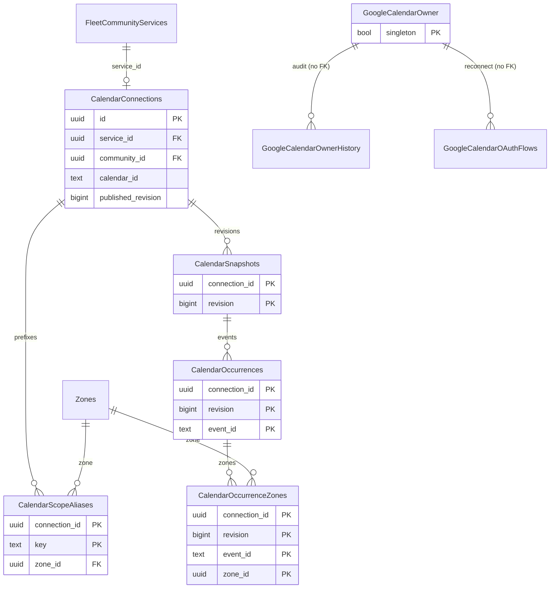

A fleet can publish its operating hours in a community as a Google Calendar. Each event title starts with zone prefixes such as `[FREE]` or `[NORTH,SOUTH]`. The API mirrors the calendar into immutable snapshots. When the community's primary fleet has a connected calendar, those hours replace `"CommunityOperatingWindows"` for market status. See [Markets, communities, and zones](/reference/database/markets-communities-and-zones#community-operating-windows).

One Google account (the calendar owner) holds read access to every fleet calendar. Its refresh token is stored encrypted in `"GoogleCalendarOwner"`.

For repository conventions, see [Data layer](/engineering/api/data-layer).

All eight tables have row level security enabled with no policies, so only the table owner (the API role) can read them.

## Code map

| Area | Location |
| --- | --- |
| Sync repository (claim, publish, fail) | `internal/data/repository/calendar_sync.go`, `queries/calendar_sync.sql` |
| Dashboard repository (setup, prefixes, calendar ID) | `internal/data/repository/calendar_dashboard.go`, `queries/calendar_dashboard.sql` |
| Owner and OAuth repository | `internal/data/repository/calendar_owner.go`, `queries/calendar_owner.sql` |
| Services | `internal/service/operatinghours` (`sync.go`, `ingest.go`, `aliases.go`, `owner.go`, `dashboard.go`), wired in `internal/service/calendar_composition.go` |
| Google client | `internal/data/googlecalendar` |
| Workers | `calendarDispatchWorker` and `calendarSyncWorker` in `internal/notify/queue/queue.go` (queue `calendarSyncQueue`, 2 workers). The `community_geography_maintenance` job deletes expired OAuth flows. |

## Trigger functions

| Function | Used by | Effect |
| --- | --- | --- |
| `calendar_immutable()` | Update on `"CalendarSnapshots"`, `"CalendarOccurrences"`, and `"CalendarOccurrenceZones"`. Delete on `"CalendarScopeAliases"`. | Always raises `Calendar aliases and published content are immutable` (SQLSTATE `23514`). |
| `guard_calendar_snapshot_insert()` | Insert on snapshots, occurrences, and occurrence zones | Locks the connection and requires `published_revision = NEW.revision - 1`, `enabled`, and an unexpired lease. Only the current lease holder can publish the next revision. |
| `guard_calendar_connection()` | Update on `"CalendarConnections"` | Makes `id`, `service_id`, `community_id`, and `owner_subject` immutable. Changing `enabled` or `calendar_id` bumps `dirty_generation`, sets `next_sync_at` to now, and recomputes `sync_state`. Replacing an existing `calendar_id` also clears health, bumps `lease_token`, and drops the lease. |
| `guard_calendar_alias_update()` | Update on `"CalendarScopeAliases"` | Only `key`, `updated_by`, and `updated_at` may change. |
| `dirty_calendar_sources()` | See the next table | Marks matching connections dirty: bumps `dirty_generation`, sets `next_sync_at` to now, and sets `sync_state = 'pending'` when enabled with a calendar. |

`dirty_calendar_sources()` runs from these triggers:

| Table | Trigger | Connections marked |
| --- | --- | --- |
| `"CalendarScopeAliases"` | `calendar_alias_dirty` (insert), `calendar_alias_update_dirty` (key change) | The alias's connection |
| `"FleetCommunityServices"` | `calendar_service_dirty` (any update) | The service's connection |
| `"GoogleCalendarOwner"` | `calendar_owner_dirty` (any update) | Connections with the owner's `subject` |
| `"Communities"` | `calendar_geography_dirty` (geography revision, timezone status, active, or archive change) | Every connection in the community |
| `"Zones"` | `calendar_zone_dirty` (active, geometry, or community change) | Every connection in the zone's community |

## CalendarConnections

One Google Calendar per fleet community service.

| Column | Type | Null | Default | Meaning |
| --- | --- | --- | --- | --- |
| `id` | `uuid` | no | | Primary key. Generated by the app. |
| `service_id` | `uuid` | no | | `"FleetCommunityServices".id`. Unique: one calendar per service. |
| `community_id` | `uuid` | no | | Service community. The composite FK `(service_id, community_id)` guarantees the pair matches. |
| `owner_subject` | `text` | no | | Google subject of the owner account at creation. CHECK non-empty. Immutable. |
| `calendar_id` | `text` | yes | | Google calendar ID. Globally unique. CHECK not empty and not `primary`. Null until attached. |
| `enabled` | `boolean` | no | `true` | Sync enabled. |
| `sync_state` | `text` | no | `'awaiting_calendar'` | `awaiting_calendar`, `pending`, `ready`, `validation_error`, `needs_auth`, `error`, or `disabled` (CHECK). |
| `dirty_generation` | `bigint` | no | `1` | Bumped whenever an input changes. `FinishCalendarSync` only succeeds if the generation still matches the claim, so a stale sync cannot publish. |
| `published_revision` | `bigint` | no | `0` | Current snapshot revision. `0` means nothing is published yet. |
| `lease_token` | `bigint` | no | `0` | Fencing token, bumped on each claim. |
| `lease_until` | `timestamptz` | yes | | Lease expiry. A claim holds it for 4 minutes. |
| `next_sync_at` | `timestamptz` | no | `clock_timestamp()` | Next due time. A successful sync schedules the next one 270 to 330 seconds later. Failures back off by the service's retry interval. |
| `last_success_at` | `timestamptz` | yes | | Last publish. A published snapshot is only served when this is set. |
| `last_error_code` | `text` | no | `''` | Last failure code. |
| `diagnostics` | `jsonb` | no | `'[]'` | Per-event validation diagnostics (`models.CalendarEventDiagnostic`) shown on the dashboard. |
| `created_by` | `text` | no | | Dashboard actor. |
| `created_at` | `timestamptz` | no | `clock_timestamp()` | Creation time. |

- Unique `(id, community_id)` backs composite FKs from aliases and occurrence zones. Partial index `calendar_connections_due` on `next_sync_at` where enabled and a calendar is attached.
- **Sync loop.** `ListDueCalendarSyncs` picks up to 100 due, unleased connections whose service is active. `ClaimCalendarSync` takes the lease. `CalendarSyncRepository.Claim` locks community, then fleet, then service, then connection, the same order as service mutations and archival. The community must be active, unarchived, and have `timezone_status = 'resolved'`.
- **Publish.** `publishCalendarSnapshot` inserts a snapshot at `published_revision + 1`, then its occurrences and occurrence zones, runs `FinishCalendarSync`, and deletes every other revision (`DeletePreviousCalendarSnapshots`). It also enqueues a `"CommunityCacheInvalidations"` row. The code comment calls the table a read-only mirror, not an archive.
- **Serving.** `GetPublishedCalendarSnapshot` only returns a snapshot when the connection is enabled, has succeeded at least once, its service is active, and the snapshot's `geography_revision` and `time_zone` still match the community. A geography change hides stale hours until the next sync.

## CalendarScopeAliases

Zone prefixes that calendar event titles may use.

| Column | Type | Null | Default | Meaning |
| --- | --- | --- | --- | --- |
| `connection_id` | `uuid` | no | | Connection. Composite FK with `community_id` to `"CalendarConnections"`. |
| `community_id` | `uuid` | no | | Community. Composite FK with `zone_id` to `"Zones"`, so the zone must be in the same community. |
| `key` | `text` | no | | Prefix such as `FREE`. CHECK `^[A-Z][A-Z0-9_-]{0,31}$`. Matches `operatinghours.ValidAlias`. |
| `zone_id` | `uuid` | no | | Zone the prefix selects. |
| `created_by` | `text` | no | | Actor. |
| `created_at` | `timestamptz` | no | `clock_timestamp()` | Creation time. |
| `updated_by`, `updated_at` | `text`, `timestamptz` | yes | | Last rename. |

- Primary key `(connection_id, key)`. Unique `(connection_id, zone_id)`: one prefix per zone per calendar.
- Aliases cannot be deleted, and only the key can change. `RenameCalendarPrefix` compares against the expected old key.
- `operatinghours.ParseTitle` reads the leading `[KEY,KEY]` prefix, upper-cases each key, and resolves it through this registry. Titles without a known prefix fail validation. Alias identity survives zone renames and archival.

## CalendarSnapshots

One published revision of a connection's hours.

| Column | Type | Null | Default | Meaning |
| --- | --- | --- | --- | --- |
| `connection_id` | `uuid` | no | | FK to `"CalendarConnections"`. No cascade. |
| `revision` | `bigint` | no | | Revision number. Must be `published_revision + 1` at insert. |
| `geography_revision` | `bigint` | no | | Community geography revision the snapshot was built against. |
| `time_zone` | `text` | no | | Community timezone used for expansion. |
| `coverage_start`, `coverage_end` | `timestamptz` | no | | Fetched window. CHECK end after start and at most 100 days long. |

Primary key `(connection_id, revision)`. Immutable after insert. Deleting a snapshot cascades to its occurrences and occurrence zones.

## CalendarOccurrences

Expanded event instances in a snapshot.

| Column | Type | Null | Default | Meaning |
| --- | --- | --- | --- | --- |
| `connection_id`, `revision` | `uuid`, `bigint` | no | | Snapshot. FK to `"CalendarSnapshots"` `ON DELETE CASCADE`. |
| `event_id` | `text` | no | | Google event instance ID. |
| `summary` | `text` | no | | Title with the zone prefix removed. |
| `starts_at`, `ends_at` | `timestamptz` | no | | Instance window. CHECK end after start. The ingester rejects timestamps without offsets and never guesses ambiguous DST times. |

Primary key `(connection_id, revision, event_id)`. Index `calendar_occurrences_range` on `(connection_id, revision, starts_at, ends_at)`. Immutable.

## CalendarOccurrenceZones

Zones each occurrence covers.

| Column | Type | Null | Default | Meaning |
| --- | --- | --- | --- | --- |
| `connection_id`, `revision`, `event_id` | `uuid`, `bigint`, `text` | no | | Occurrence. FK `ON DELETE CASCADE`. |
| `community_id` | `uuid` | no | | Community. Composite FKs to the connection and the zone enforce the same community. |
| `zone_id` | `uuid` | no | | Zone. |

Primary key `(connection_id, revision, event_id, zone_id)`. Immutable. `ListDashboardCalendarHours` aggregates zone IDs per occurrence.

## GoogleCalendarOwner

A single row describing the Google account whose token reads fleet calendars.

| Column | Type | Null | Default | Meaning |
| --- | --- | --- | --- | --- |
| `singleton` | `boolean` | no | `true` | Primary key. CHECK true. |
| `email` | `text` | no | | Owner email. Seeded by `EnsureCalendarOwner`. |
| `subject` | `text` | no | `''` | Google subject. Connections record it as `owner_subject`. |
| `client_id` | `text` | no | `''` | OAuth client used. |
| `refresh_token_ciphertext` | `bytea` | yes | | Encrypted refresh token. |
| `granted_scopes` | `text[]` | no | `'{}'` | Scopes Google granted. |
| `revision` | `bigint` | no | `0` | Bumped on every reconnect. OAuth flows record the revision they started from. |
| `connected_at` | `timestamptz` | yes | | Last connect. |
| `updated_by` | `text` | no | | Actor. |

Any update fires `calendar_owner_dirty`, which re-syncs connections owned by this subject. `SaveCalendarOwner` writes the new credentials. `AuditCalendarOwner` records the change in history.

## GoogleCalendarOwnerHistory

Append-only audit of owner reconnects.

| Column | Type | Null | Default | Meaning |
| --- | --- | --- | --- | --- |
| `id` | `bigint` | no | identity | Primary key. |
| `owner_email`, `subject`, `client_id` | `text` | no | | Owner identity after the change. |
| `revision` | `bigint` | no | | Owner revision after the change. |
| `changed_by` | `text` | no | | Actor. |
| `changed_at` | `timestamptz` | no | `clock_timestamp()` | Change time. |

Written only by `AuditCalendarOwner`. No query reads it.

## GoogleCalendarOAuthFlows

Short-lived state for the owner OAuth reconnect flow.

| Column | Type | Null | Default | Meaning |
| --- | --- | --- | --- | --- |
| `id` | `uuid` | no | | Primary key. |
| `state_hash` | `text` | no | | Hash of the OAuth `state` parameter. Unique. |
| `actor` | `text` | no | | Dashboard user who started the flow. Only that actor can read or finish it. |
| `owner_email` | `text` | no | | Expected owner email. |
| `client_id` | `text` | no | | OAuth client. |
| `owner_revision` | `bigint` | no | | Owner revision when the flow started. |
| `verifier_ciphertext` | `bytea` | yes | | Encrypted PKCE verifier. Cleared after the code exchange. |
| `credential_ciphertext` | `bytea` | yes | | Encrypted credentials staged by the callback. Cleared on completion or failure. |
| `status` | `text` | no | | `pending`, `exchanging`, `authorized`, `completed`, or `failed` (CHECK). |
| `expires_at` | `timestamptz` | no | `clock_timestamp() + 10 minutes` | Flow expiry. Every query filters on it. |
| `created_at` | `timestamptz` | no | `clock_timestamp()` | Start time. |

- Index `calendar_oauth_expiry` on `expires_at`. `CleanCalendarOAuthFlows` deletes expired rows during `community_geography_maintenance` when calendars are enabled.
- State machine: `pending`, then `exchanging` (single-use claim by state hash), then `authorized` (credentials staged), then `completed` once the actor confirms with a fresh Clerk admin session (`internal/service/operatinghours/owner.go`). A failed exchange moves to `failed`.
