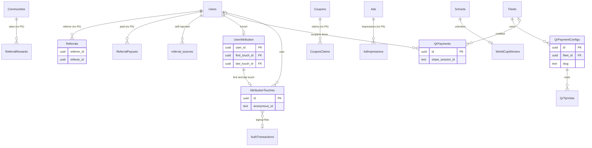

These tables support acquisition and side revenue: referrals and their payouts, marketing attribution, partner coupons and ads, in-app promo placements, the World Cup school campaign, QR code tips paid through Stripe payment links, and short links. Ride payments and Stripe payment intents are on [Payments](/reference/database/payments).

Many of these tables are older and have no foreign keys. The per-table notes call that out.

## Referrals

### Referrals

Who referred whom.

| Column | Type | Null | Default | Meaning |
| --- | --- | --- | --- | --- |
| `referrer_id` | `uuid` | no | | Referring user. No foreign key. |
| `referee_id` | `uuid` | no | | Referred user. Unique, so each user has one referrer. No foreign key. |
| `referral_time` | `timestamptz` | no | `now()` | When the referral was recorded. Used to pick the reward period. |

- There is no primary key, only the unique constraint `referrals_referee_id_unique`.
- `AddReferral` (`queries/referral.sql`) and `AssignAuthV3Referral` (`queries/authv3.sql`) insert with `ON CONFLICT (referee_id) DO UPDATE SET referrer_id = "Referrals".referrer_id`, so the first referrer wins and the call still returns the stored referrer.
- During auth v3 signup, the referral code comes from the transaction's earliest `"AttributionTouches".referral_code` and resolves to a referrer through `"Users".referral_code`, excluding deleted and banned users.
- Read by `GetUserReferrals`, `GetReferrers` (dashboard leaderboard), and `analytics.sql`.

### ReferralRewards

Versioned referral bonus amounts per community.

| Column | Type | Null | Default | Meaning |
| --- | --- | --- | --- | --- |
| `community_id` | `uuid` | no | | Community. No foreign key. |
| `rider_value` | `double precision` | no | | Earned when a referee completes a ride as a rider. |
| `driver_value` | `double precision` | no | | Earned when a referee completes a ride as a driver. |
| `start_time` | `timestamptz` | no | | Period start. |
| `end_time` | `timestamptz` | no | | `'infinity'` for the current period. |

- Primary key `(community_id, start_time)`.
- `CloseCurrentReferralReward` then `CreateReferralReward` version the amounts. `GetCommunityDetail` shows the reward active now.
- Earnings are computed at read time by joining the reward period that contains `"Referrals".referral_time`. `GetUserReferrals` joins on the referee's `community_id`, but `GetReferrers` joins on the referee's `home_community_id`, so the two views can disagree for users whose current and home communities differ.

### ReferralPayouts

Manual payouts to referrers.

| Column | Type | Null | Default | Meaning |
| --- | --- | --- | --- | --- |
| `payout_id` | `uuid` | no | `gen_random_uuid()` | Primary key. |
| `user_id` | `uuid` | no | | Referrer paid. No foreign key. |
| `approver_id` | `uuid` | no | | Approving user. No foreign key. |
| `amount` | `double precision` | no | | Amount paid. |
| `timestamp` | `timestamptz` | no | | Payout time. |

`GetReferrers` subtracts the sum of payouts from computed earnings to report `total_outstanding`. No index on `user_id`.

### ReferralLookup

Legacy mapping from phone number to referral code.

| Column | Type | Null | Default | Meaning |
| --- | --- | --- | --- | --- |
| `id` | `uuid` | no | `gen_random_uuid()` | Primary key. |
| `referral_code` | `text` | no | | Code. |
| `phone_number` | `text` | no | | Unique phone. |

No code references it. Referral codes live on `"Users".referral_code`.

### referral_sources

Self-reported "how did you hear about us" answers.

| Column | Type | Null | Default | Meaning |
| --- | --- | --- | --- | --- |
| `id` | `uuid` | no | `gen_random_uuid()` | Primary key. |
| `user_id` | `uuid` | no | | FK to `"Users"`. No cascade. |
| `source` | `text` | no | | Free-text source. |
| `created_at` | `timestamptz` | no | `now()` | Answer time. |

Written by `InsertReferralSource` (`queries/account_utilities.sql`). Analytics use the earliest non-blank answer per user. Like `surge_history` and the River tables, it uses a lowercase name.

## Attribution

### AttributionTouches

Marketing touchpoints captured before and during signup.

| Column | Type | Null | Default | Meaning |
| --- | --- | --- | --- | --- |
| `id` | `uuid` | no | `gen_random_uuid()` | Primary key. |
| `anonymous_id` | `text` | no | | Client-generated visitor ID. CHECK non-blank. |
| `auth_transaction_id` | `uuid` | yes | | Signup flow. FK to `"AuthTransactions"` `ON DELETE SET NULL`. |
| `user_id` | `uuid` | yes | | Set once the flow authenticates. FK to `"Users"` `ON DELETE SET NULL`. |
| `touched_at` | `timestamptz` | no | `now()` | Touch time. Orders first and last touch. |
| `landing_surface` | `text` | no | | Where the visitor landed. CHECK non-blank. |
| `utm_source`, `utm_medium`, `utm_campaign`, `utm_term`, `utm_content` | `text` | yes | | UTM parameters. |
| `referrer_host`, `referrer_path` | `text` | yes | | HTTP referrer. |
| `source_channel` | `text` | yes | | Derived channel. |
| `dub_click_id` | `text` | yes | | Dub short-link click ID. |
| `referral_code` | `text` | yes | | Referral code from the link. |
| `metadata` | `jsonb` | no | `'{}'` | Extra fields. CHECK object and at most 4096 bytes. |
| `created_at` | `timestamptz` | no | `now()` | Insert time. |

Indexes on `(anonymous_id, touched_at)`, on `auth_transaction_id` where set, and on `(user_id, touched_at)` where set. Written by `CreateAuthV3AttributionTouch` in the auth v3 flow. Read by `analytics.sql` and `internal/service/notifications/signup_alert.go`.

### UserAttribution

One row per user summarizing attribution and funnel milestones.

| Column | Type | Null | Default | Meaning |
| --- | --- | --- | --- | --- |
| `user_id` | `uuid` | no | | Primary key. FK to `"Users"` `ON DELETE CASCADE`. |
| `first_touch_id` | `uuid` | yes | | Earliest touch. Never overwritten once set. FK `ON DELETE SET NULL`. |
| `last_touch_id` | `uuid` | yes | | Latest touch. Updated on each association. FK `ON DELETE SET NULL`. |
| `authenticated_at` | `timestamptz` | yes | | First authentication. |
| `profile_completed_at` | `timestamptz` | yes | | Profile completion. |
| `first_ride_at` | `timestamptz` | yes | | First ride. |
| `created_at`, `updated_at` | `timestamptz` | no | `now()` | Timestamps. |

- `AssociateAuthV3TransactionAttribution` claims the transaction's unowned touches for the user and upserts first and last touch.
- `MarkAuthV3AttributionConversion` records milestones. Every milestone is first-write-wins (`COALESCE(existing, new)`).
- Read by `analytics.sql` and `supply_demand.sql`.

## Coupons

### Coupons

Partner coupons shown to a community.

| Column | Type | Null | Default | Meaning |
| --- | --- | --- | --- | --- |
| `id` | `uuid` | no | `gen_random_uuid()` | Primary key. |
| `created_at`, `updated_at` | `timestamptz` | no | `now()` | Timestamps. |
| `preview_at` | `timestamptz` | no | | When the coupon becomes visible. |
| `release_at` | `timestamptz` | no | | When it becomes claimable. |
| `expire_at` | `timestamptz` | yes | | Expiry. Indexed. |
| `community_id` | `uuid` | no | | Community. No foreign key. |
| `enterprise_id` | `uuid` | no | | Sponsoring `"EnterpriseAccounts".id`. No foreign key. |
| `venue_id` | `uuid` | no | | `"Venues".id` where it is redeemed. No foreign key. |
| `title`, `description` | `text` | no | | Content. |
| `photo_url` | `text` | yes | | Image. |
| `num_total` | `integer` | no | | Total issued. |
| `num_available` | `integer` | no | `0` | Remaining. `DecrementCouponAvailability` only decrements while it is above 0. |

The API has no insert path for coupons. `internal/data/repository/coupon.go` lists coupons with the caller's claim state (`ListCouponsForCommunity`) and claims inside one transaction: check, decrement, insert claim.

### CouponClaims

| Column | Type | Null | Default | Meaning |
| --- | --- | --- | --- | --- |
| `id` | `uuid` | no | `gen_random_uuid()` | Primary key. |
| `coupon_id` | `uuid` | no | | Coupon. No foreign key. |
| `user_id` | `uuid` | no | | Claimer. No foreign key. |
| `created_at`, `updated_at` | `timestamptz` | no | `now()` | Timestamps. |
| `code` | `uuid` | yes | `gen_random_uuid()` | Redemption code. Indexed, not unique. |
| `redeemed` | `boolean` | no | `false` | Redeemed flag. |
| `redeemed_at` | `timestamptz` | yes | | Redemption time. |

Unique `(coupon_id, user_id)`: one claim per user per coupon. Index on `user_id`. No query sets `redeemed`.

## Ads

### Ads

In-app ad placements bought by enterprise accounts.

| Column | Type | Null | Default | Meaning |
| --- | --- | --- | --- | --- |
| `id` | `uuid` | no | `gen_random_uuid()` | Primary key. |
| `enterprise_account_id` | `uuid` | no | | Advertiser. No foreign key. |
| `community_ids` | `uuid[]` | no | | Target communities. Matched with `= ANY(community_ids)`, with no GIN index. |
| `start_time`, `end_time` | `timestamptz` | no | | Flight window. |
| `link` | `text` | no | | Click-through URL. |
| `media_url`, `media_type` | `text` | no | | Creative. |
| `tier` | `integer` | no | | Priority tier. `GetRandomActiveAd` requires a minimum tier. |
| `size`, `shape` | `text` | no | | Slot fit (`models.AdSize`, `models.AdShape`). |
| `height`, `width` | `integer` | no | | Creative dimensions. |

`internal/service/ad` creates, updates, and serves ads. `GetRandomActiveAd` picks a random in-flight ad for the community, tier, size, and shape. `GetCommunityAds` orders by tier, then randomly.

### AdImpressions

| Column | Type | Null | Default | Meaning |
| --- | --- | --- | --- | --- |
| `id` | `uuid` | no | `gen_random_uuid()` | Primary key. |
| `ad_id` | `uuid` | no | | Ad. Indexed. No foreign key. |
| `user_id` | `uuid` | no | | Viewer. FK to `"Users"`. No cascade. |
| `start_time` | `timestamptz` | no | | Impression start. |
| `duration` | `bigint` | no | `0` | Time on screen, as sent by the client. |
| `location` | `text` | no | `''` | App screen. |
| `clicks` | `integer` | no | `0` | Clicks during the impression. |
| `impression_type` | `text` | no | `''` | Client-defined type. |

Written by `AddAdImpression` through `internal/service/ad`. No query reads it.

## Promo placements

### PromoBars

A text promo bar per community.

| Column | Type | Null | Default | Meaning |
| --- | --- | --- | --- | --- |
| `id` | `uuid` | no | `gen_random_uuid()` | Primary key. |
| `community_id` | `uuid` | no | | Community. No foreign key or unique constraint. |
| `text`, `text_color` | `text` | yes | | Copy and color. |
| `url` | `text` | yes | | Tap target. |
| `background_url`, `background_color` | `text` | yes | | Background. |

Read by `internal/service/promobar` through `queries/engagement.sql`. The API never writes it.

### PromoBanners

Image banners returned with community details.

| Column | Type | Null | Default | Meaning |
| --- | --- | --- | --- | --- |
| `id` | `uuid` | no | `gen_random_uuid()` | Primary key. |
| `community_id` | `uuid` | no | | Community. No foreign key or index. |
| `image_url` | `text` | no | | Banner image. |
| `link` | `text` | no | | Tap target. |
| `is_pinned` | `boolean` | no | `false` | Pinned banner. |

Read by `ListCommunityPromoBanners` in `internal/data/repository/community.go`. The API never writes it.

## WorldCupWinners

Schools that unlocked the World Cup campaign reward.

| Column | Type | Null | Default | Meaning |
| --- | --- | --- | --- | --- |
| `id` | `uuid` | no | `gen_random_uuid()` | Primary key. |
| `school_id` | `uuid` | no | | FK to `"Schools"`. Unique. |
| `reached_threshold_at` | `timestamptz` | no | `now()` | Unlock time. Indexed with `id` for the activity feed cursor. |
| `created_at` | `timestamptz` | no | `now()` | Insert time. |

- `EnsureWorldCupWinner` (`queries/education_commerce.sql`) runs under the advisory lock `world_cup_winners`. It inserts a winner only while fewer than `models.WorldCupWinnerSlots` (25) exist and the school's campaign claims plus verified signups since the campaign start reach `models.WorldCupThreshold` (500).
- Claims live in `"UserEducationClaims"` with `campaign_key = 'world_cup'` (see [Users and identity](/reference/database/users-and-identity)).
- Service: `internal/service/worldcup`. Standings, totals, and the activity feed read this table.

## QR payments and tips

Riders tip drivers or fleets by scanning an in-car QR code. The code opens a Stripe payment link or checkout on the fleet's connected account. [Payments](/reference/database/payments) also covers these tables and `"ReferralPayouts"` from the money-movement side.

### QrPaymentConfigs

One QR product per fleet slug.

| Column | Type | Null | Default | Meaning |
| --- | --- | --- | --- | --- |
| `id` | `uuid` | no | `gen_random_uuid()` | Primary key. |
| `fleet_id` | `uuid` | no | | FK to `"Fleets"`. No cascade. |
| `slug` | `text` | no | | Public slug. Unique. CHECK non-empty. |
| `product_name` | `text` | no | | Stripe product name. |
| `pricing_mode` | `text` | no | | `fixed` or `custom` (CHECK). |
| `fixed_amount` | `bigint` | yes | | Price in cents for `fixed`. |
| `custom_min`, `custom_max`, `custom_preset` | `bigint` | yes | | Bounds and preset in cents for `custom`. |
| `stripe_product_id`, `stripe_price_id`, `stripe_payment_link_id`, `stripe_payment_link_url` | `text` | no | | Stripe objects on the connected account. Re-pricing mints new ones. |
| `dub_link_id`, `dub_short_url` | `text` | no | `''` | Dub short link printed on the QR. |
| `is_active` | `boolean` | no | `true` | `DeactivateQrPaymentConfig` turns it off. The public lookup requires it. |
| `created_at`, `updated_at` | `timestamptz` | no | `now()` | Timestamps. |

`internal/service/qrpayment` creates configs, updates pricing, and deactivates. Updates and deactivation compare the expected `stripe_payment_link_id`, and trigger `guard_fleet_qr_archive` rejects active configs on archived fleets. See [QrPaymentConfigs](/reference/database/payments#qrpaymentconfigs). It checks that the caller's fleet scope covers the config's fleet, and reports an out-of-scope config as not found. List queries are fail-closed on fleet scope.

### QrPayments

Completed QR checkout sessions, recorded from Stripe `checkout.session.completed` webhooks.

| Column | Type | Null | Default | Meaning |
| --- | --- | --- | --- | --- |
| `id` | `uuid` | no | `gen_random_uuid()` | Primary key. |
| `stripe_session_id` | `text` | no | | Checkout session. Unique. Inserts use `ON CONFLICT DO NOTHING`, so webhook retries are idempotent. |
| `stripe_payment_intent_id` | `text` | yes | | Payment intent. |
| `stripe_account_id` | `text` | no | | Connected account that received the funds. Indexed. |
| `amount_total` | `bigint` | no | | Amount in cents. |
| `currency` | `text` | no | `'usd'` | Currency. |
| `payment_status` | `text` | no | | Stripe session payment status. |
| `customer_name`, `customer_email`, `customer_phone` | `text` | yes | | From Stripe customer details, falling back to session metadata. |
| `payment_method_type` | `text` | yes | | First payment method type on the session. |
| `card_brand`, `card_last4`, `wallet_type` | `text` | yes | | Card details. The webhook path never sets them. |
| `metadata` | `jsonb` | no | `'{}'` | Session metadata. |
| `stripe_created_at` | `timestamptz` | yes | | Never set by the webhook path. |
| `created_at` | `timestamptz` | no | `now()` | Insert time. Indexed. |
| `fleet_id` | `uuid` | yes | | Credited fleet. FK to `"Fleets"`. |
| `recipient_driver_id` | `uuid` | yes | | Tipped driver. FK to `"Users"` `ON DELETE SET NULL`. |

- Written by `internal/service/payment/payment.go`, which resolves `fleet_id` and `recipient_driver_id` from session metadata and the connected account.
- Read by the dashboard payment list (`ListQrPayments`, `CountQrPayments`) with fleet scoping, date, amount, and name or email search, and by `analytics.sql`. An index on `(recipient_driver_id, created_at DESC)` supports driver tip history.

### QrTipVisits

Funnel tracking for signed-in users who open a tip page.

| Column | Type | Null | Default | Meaning |
| --- | --- | --- | --- | --- |
| `id` | `uuid` | no | `gen_random_uuid()` | Primary key. |
| `user_id` | `uuid` | no | | Visitor. FK to `"Users"` `ON DELETE CASCADE`. |
| `config_id` | `uuid` | yes | | Fleet QR config visited. FK `ON DELETE CASCADE`. |
| `recipient_driver_id` | `uuid` | yes | | Driver tip page visited. FK to `"Users"` `ON DELETE CASCADE`. |
| `first_seen_at`, `last_seen_at` | `timestamptz` | no | `now()` | First and latest visit. |
| `checkout_started_at` | `timestamptz` | yes | | Latest checkout start. |
| `stripe_checkout_session_id` | `text` | yes | | Latest checkout session. Unique where set. |

- Unique `(user_id, config_id)` for fleet pages. Unique `(user_id, recipient_driver_id)` where the driver is set, for driver pages.
- Driver-page rows leave `config_id` null. Because nulls are distinct, the `(user_id, config_id)` constraint never conflicts for them. The driver upserts target the partial index instead.
- Written by `internal/data/repository/qr_payment_config.go` (`RecordQrTipVisit`, `RecordQrTipCheckout`, and the driver variants).

## ShortenedLinks

Yelo's own short links.

| Column | Type | Null | Default | Meaning |
| --- | --- | --- | --- | --- |
| `encoded_path` | `varchar(255)` | no | | Primary key. A random string from `models.NewShortenedPathRecord`. |
| `original_path` | `varchar(255)` | no | | Target path. |
| `created_at` | `timestamptz` | no | `now()` | Creation time. |

`internal/service/link` encodes by inserting a new random path and decodes by primary key lookup. Encoding does not reuse an existing row for the same target. Links for QR codes and marketing use Dub instead (`internal/data/dub`), stored on `"QrPaymentConfigs"`.
