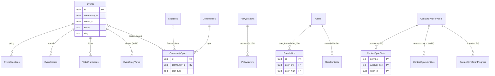

This page covers community content (events, the featured spot, polls), the friend graph built from referrals and address-book matching, and the generic contact sync engine that mirrors users into external contact providers. Venues are on [Locations and places](/reference/database/markets-locations-and-places#venues). Bumps (friend ride intents) are on [Rides](/reference/database/rides).

For repository conventions, see [Data layer](/engineering/api/data-layer).

## Community feed

There is no feed table. `generateCommunityFeed` in `internal/service/community/feed_logic.go` builds a randomized, paginated feed from ads (`"Ads"`), recent public rides, and friend bumps, and caches it in Redis with an in-memory fallback (`feed_cache_redis.go`, `feed_cache_memory.go`). `cmd/api/main.go` refreshes every community's feed every 2 minutes. Event items are currently disabled: the event query is commented out, and the feed passes an empty event list.

## Events

### Events

Community events created from the dashboard.

| Column | Type | Null | Default | Meaning |
| --- | --- | --- | --- | --- |
| `id` | `uuid` | no | `gen_random_uuid()` | Primary key. |
| `name`, `description` | `text` | no | | Content. |
| `start_time` | `timestamptz` | no | `now()` | Event start. |
| `end_time` | `timestamptz` | yes | | Event end. |
| `release_time` | `timestamptz` | yes | | When the event becomes visible. |
| `close_time` | `timestamptz` | yes | | When it stops being shown. `ArchivePastEvents` archives published events once `COALESCE(close_time, end_time)` has passed. |
| `photo_url` | `text` | yes | | Cover image. |
| `venue_id` | `uuid` | yes | | `"Venues".id`. No foreign key. |
| `location_name`, `location_address` | `text` | yes | | Free-form location when there is no venue. |
| `location_latitude`, `location_longitude` | `real` | yes | | Free-form coordinates. |
| `ticket_url` | `text` | yes | | External ticket link. |
| `price` | `real` | yes | | Display price. |
| `posh_event_id` | `text` | yes | | Posh ticketing ID. |
| `card_size` | `text` | yes | `'medium'` | `small`, `medium`, or `large`. Orders feed candidates. |
| `tickets_available` | `integer` | no | `0` | Ticket count shown. |
| `tags` | `text[]` | yes | `'{}'` | Tags. |
| `has_dynamic_pricing` | `boolean` | no | `false` | Dynamic pricing flag. |
| `enterprise_account_id` | `uuid` | yes | | Host `"EnterpriseAccounts".id`. No foreign key. |
| `community_id` | `uuid` | yes | | Community. No foreign key. Every dashboard mutation scopes by it. |
| `is_repeating` | `boolean` | yes | `false` | Repeating flag. |
| `status` | `text` | no | `'draft'` | `draft`, `pending_review`, `published`, or `archived` (`models.EventStatus*`). No CHECK. Public reads require `published`. |
| `created_at`, `updated_at` | `timestamptz` | no | `now()` | Timestamps. |
| `created_by` | `uuid` | yes | | Creator. No foreign key. |
| `slug` | `text` | yes | | Public URL slug. Unique case-insensitively where set (`idx_events_slug_unique` on `lower(slug)`). |

- Index `idx_events_community_status` on `(community_id, status)`.
- Queries: `queries/engagement.sql` (`CreateEvent`, `UpdateEvent`, `SetEventStatus`, `GetPublishedEventByID`, `GetPublishedEventBySlug`, `ListUpcomingEvents`, `ListCommunityEvents`, and dashboard lists). Service: `internal/service/event`. Event reads flag whether an active `"Discounts"` row targets the venue address at the event's start.

### EventAttendees

RSVPs.

| Column | Type | Null | Default | Meaning |
| --- | --- | --- | --- | --- |
| `event_id` | `uuid` | no | | FK to `"Events"`. No cascade. |
| `user_id` | `uuid` | no | | Attendee. No foreign key. |
| `status` | `text` | no | `'going'` | Always `going`. `AddEventAttendee` inserts it, and leaving deletes the row. |
| `created_at` | `timestamptz` | no | `now()` | RSVP time. |

Primary key `(event_id, user_id)`. Index on `user_id`. `internal/data/repository/event_attendee.go`.

### EventShares

| Column | Type | Null | Default | Meaning |
| --- | --- | --- | --- | --- |
| `id` | `uuid` | no | `gen_random_uuid()` | Primary key. |
| `event_id` | `uuid` | no | | FK to `"Events"`. |
| `user_id` | `uuid` | no | | FK to `"Users"`. |
| `graduation_year` | `integer` | no | | Sharer's class year. |
| `created_at` | `timestamptz` | no | `now()` | Share time. |

Only `CountEventShares` reads it. No query inserts rows.

### EventStoryViews

Which users have seen an event's story card.

| Column | Type | Null | Default | Meaning |
| --- | --- | --- | --- | --- |
| `event_id` | `uuid` | no | | Event. No foreign key. |
| `user_id` | `uuid` | no | | Viewer. No foreign key. |
| `viewed_at` | `timestamp` | no | | Last view, without timezone. |

Primary key `(event_id, user_id)`, plus a unique index on `(user_id, event_id)`. Upserted by `UpsertEventStoryView` and joined into event reads.

### EventFollows

Legacy follow-an-event table (`id`, `event_id`, `user_id`, `expiry`, `is_canceled`, and `created_at`, with only a primary key). No code references it.

### TicketPurchases

| Column | Type | Null | Default | Meaning |
| --- | --- | --- | --- | --- |
| `id` | `uuid` | no | `gen_random_uuid()` | Primary key. |
| `event_id` | `uuid` | no | | FK to `"Events"`. |
| `user_id` | `uuid` | no | | FK to `"Users"`. |
| `total_price` | `double precision` | no | | Amount. |
| `item_name` | `text` | no | | Ticket name. |
| `community_id` | `uuid` | no | | FK to `"Communities"`. |
| `created_at` | `timestamptz` | no | `now()` | Purchase time. |

Only `CountEventTicketPurchases` reads it. No query inserts rows.

## Polls

`"PollQuestions"` (`id`, `community_id`, `question`, `start_time`, `end_time`, `answers` `text[]`, and `shortened_answers` `text[]`) and `"PollAnswers"` (`id`, `question_id`, `user_id`, `answer` as an index into `answers`, and `timestamp`, unique on `(question_id, user_id)`) back the `ActivePoll` field on `models.Community`. No query reads or writes either table, and neither has foreign keys. The field is never populated.

## CommunitySpots

The single featured spot per community: an event or a location, with optional overrides for display copy.

| Column | Type | Null | Default | Meaning |
| --- | --- | --- | --- | --- |
| `id` | `uuid` | no | `gen_random_uuid()` | Primary key. |
| `community_id` | `uuid` | no | | FK to `"Communities"`. |
| `spot_type` | `text` | no | | `event` or `location` (CHECK). |
| `event_id` | `uuid` | yes | | FK to `"Events"`. Required when `spot_type = 'event'`. |
| `location_id` | `uuid` | yes | | FK to `"Locations"`. Required when `spot_type = 'location'`. |
| `is_active` | `boolean` | no | `false` | Active spot. At most one per community (unique partial index `idx_community_spots_active`). |
| `starts_at`, `ends_at` | `timestamptz` | yes | | Serving window. `GetActiveSpotByCommunity` requires now to be inside it when set. |
| `title`, `description`, `image_url`, `cta_label`, `cta_url` | `text` | yes | | Display overrides. |
| `display_start_time`, `display_end_time` | `timestamptz` | yes | | Times shown to users. |
| `created_at`, `updated_at` | `timestamptz` | no | `now()` | Timestamps. |
| `created_by` | `uuid` | yes | | FK to `"Users"`. |

- CHECK `CommunitySpots_check` requires exactly one of `event_id` and `location_id`, matching `spot_type`.
- Queries are in `queries/places.sql`. `DeactivateSpotsByCommunity` runs before activating another spot so the unique index holds. Service: `internal/service/spot`.

## Friend graph

### Friendships

Undirected friend edges.

| Column | Type | Null | Default | Meaning |
| --- | --- | --- | --- | --- |
| `id` | `uuid` | no | `gen_random_uuid()` | Primary key. |
| `user_low` | `uuid` | no | | Smaller user ID. FK to `"Users"` `ON DELETE CASCADE`. |
| `user_high` | `uuid` | no | | Larger user ID. FK to `"Users"` `ON DELETE CASCADE`. |
| `source` | `text` | no | | How the edge was made: `referral` or `contact_match` (`models.FriendshipSource*`). |
| `created_at` | `timestamptz` | no | `now()` | Creation time. |

- CHECK `user_low < user_high` and unique `(user_low, user_high)` make each pair one row. Inserts order the pair with `LEAST` and `GREATEST`, and the first source wins on conflict.
- Index on `user_high` covers lookups from the other side.
- Written by `internal/data/repository/friendship.go` from `internal/service/authv2/profile.go` (the referrer and new user become friends) and `internal/service/user/contacts.go` (mutual contact matches). Read for the friends list, map friends, bump recipients, and place-change fan-out.

### UserContacts

Hashed phone numbers from a user's address book, used for mutual matching.

| Column | Type | Null | Default | Meaning |
| --- | --- | --- | --- | --- |
| `id` | `uuid` | no | `gen_random_uuid()` | Primary key. |
| `owner_id` | `uuid` | no | | Uploading user. FK to `"Users"` `ON DELETE CASCADE`. |
| `contact_phone_hash` | `text` | no | | Hex HMAC-SHA256 of the E.164 number, keyed with a server pepper. Raw numbers never persist. |
| `created_at` | `timestamptz` | no | `now()` | Insert time. |

- Unique `(owner_id, contact_phone_hash)`. Index on `contact_phone_hash` for reverse lookup (`OwnersHolding`).
- `internal/service/user/contacts.go` normalizes numbers, drops the caller's own number, and replaces the owner's set when the snapshot hash on `"Users".contacts_snapshot_hash` changes. It then links as friends every candidate who also holds the caller's hash. Uploads are rate limited in Redis to 30 per hour.

## Contact sync

The generic contact sync engine projects users into external contact providers: `quo` (SMS and CRM) and `resend` (email marketing). Triggers record intent. The drain fans intent out to each provider as versioned per-user state. Leased River jobs apply changes. Code: `internal/service/contactsync`, `internal/data/repository/contact_sync.go`, `contact_sync_status.go`, `queries/contact_sync.sql`, and `queries/contact_profiles.sql`. The legacy Quo outbox is on [Notifications and messaging](/reference/database/growth-notifications-and-messaging#quo-contact-sync).

### Trigger functions

`enqueue_contact_sync()` appends a `"ContactSyncRequests"` row when a contact-relevant fact changes:

| Table | Trigger | Relevant change |
| --- | --- | --- |
| `"Users"` | `contact_sync_users` | Name, email, phone, current or home community, school, account type, acquisition source, created time, profile completion, banned, test, deleted. The old and new IDs are both enqueued. |
| `"DriverApplications"` | `contact_sync_drivers` | `user_id`, `is_active`, `activated_at`, `license_status`, `stripe_status`, `payout_fleet_id` |
| `"Vehicles"` | `contact_sync_vehicles` | `driver_id`, `application_status`, `application_submission_time` (old and new driver) |
| `"Rides"` | `contact_sync_rides` | Entering or leaving a completed, uncanceled state, or a change of rider, driver, or `complete_time` on such a ride (rider and driver) |
| `"Communities"` | `contact_sync_communities` | `name` change or delete. Enqueues a `community` request. |
| `"Schools"` | `contact_sync_schools` | `name` change or delete. Enqueues a `school` request. |

`enqueue_contact_activity()` enqueues a `user` request when activity crosses a 5-minute bucket: `"Users".last_pinged_driver` or `location_updated_at` (trigger `contact_sync_activity`), or `"DeviceTelemetry".updated_at` (trigger `contact_sync_telemetry`).

### ContactSyncRequests

Append-only intent inbox.

| Column | Type | Null | Default | Meaning |
| --- | --- | --- | --- | --- |
| `id` | `bigint` | no | identity | Primary key and drain order. |
| `entity_kind` | `text` | no | | `user`, `community`, or `school` (CHECK). |
| `entity_id` | `uuid` | no | | Entity ID. |
| `requested_at` | `timestamptz` | no | `now()` | Request time. |
| `expand_after_id` | `uuid` | no | nil UUID | Pagination cursor while a community or school request fans out to its users. |

- `DrainRequests` runs in one transaction. `expandContactEntityRequest` expands one community or school request into per-user requests, a page at a time. Then `DrainContactSyncUserRequests` deletes user requests with `FOR UPDATE SKIP LOCKED` and upserts `"ContactSyncState"` for every configured provider, bumping `desired_version`.
- User requests are only drained while at least one `"ContactSyncProviders"` row exists.

### ContactSyncProviders

One row per provider and account.

| Column | Type | Null | Default | Meaning |
| --- | --- | --- | --- | --- |
| `provider` | `text` | no | | `quo` or `resend`. |
| `account_key` | `text` | no | | Provider account. |
| `mode` | `text` | no | `'paused'` | `legacy`, `paused`, or `generic` (CHECK). `generic` means this engine owns the destination. The legacy Quo worker defers to it. |
| `mode_changed_at` | `timestamptz` | no | `now()` | Last mode change. |
| `schema_version` | `integer` | no | `0` | Provider schema prepared (Quo `1`, Resend `2`). `SchemaReady` gates admission. |
| `schema_checked_at` | `timestamptz` | yes | | Last schema check. |
| `config_revision` | `bigint` | no | `1` | Bumped on configuration changes. Blocked contacts record the revision they were blocked under. |
| `blocked_reason` | `text` | yes | | Reason for a temporary pause (`PauseProvider`). |
| `retry_at` | `timestamptz` | yes | | When a temporary pause ends. |

Primary key `(provider, account_key)`. `EnsureProvider` inserts with the deployment's initial mode. Activation requires an already paused destination (`internal/service/contactsync/admin.go`).

### ContactSyncState

Per provider, account, and user sync state.

| Column | Type | Null | Default | Meaning |
| --- | --- | --- | --- | --- |
| `provider`, `account_key`, `user_id` | `text`, `text`, `uuid` | no | | Primary key. `user_id` has no foreign key. |
| `desired_version` | `bigint` | no | `0` | Bumped per drained request. |
| `applied_version` | `bigint` | no | `0` | Last version applied. CHECK `0 <= applied_version <= desired_version`. Pending means desired is greater than applied. |
| `requested_at` | `timestamptz` | no | `now()` | Latest request. |
| `first_pending_at` | `timestamptz` | yes | | Oldest unapplied request. Dispatch order. |
| `last_synced_at`, `last_remote_checked_at` | `timestamptz` | yes | | Last successful apply and last remote read. |
| `force_remote_version` | `bigint` | no | `0` | Forces a remote re-read during reconciliation. |
| `payload_hash` | `text` | no | `''` | Hash of the last payload, so unchanged projections skip writes. |
| `schema_version` | `integer` | no | `0` | Provider schema used. |
| `outcome` | `text` | no | `'pending'` | `pending`, `synced`, `ineligible`, `removed`, or `blocked` (CHECK). |
| `reason_code` | `text` | yes | | Outcome detail. |
| `lease_token`, `lease_until` | `uuid`, `timestamptz` | yes | | Worker lease. `Claim`, `Renew`, `Complete`, `Block`, and `Release` all fence on the token. |
| `blocked_version`, `blocked_fingerprint`, `blocked_config_revision` | `bigint`, `text`, `bigint` | yes | | What was blocked. A blocked contact stays parked until the version, fingerprint, or config changes. |
| `observed_email_opt_out` | `boolean` | no | `false` | Provider reported an unsubscribe. |
| `ever_had_contact` | `boolean` | no | `false` | A remote contact existed at some point. Deletion is conservative afterwards. |

Partial index `contact_sync_pending_idx` on `(provider, account_key, first_pending_at, user_id)` where pending. `ListDispatchableFor` skips users that already have an active River job before applying the limit.

### ContactSyncIdentities

Remote contact records for a user in a provider, keyed by a hash of the identity key (for example an email or phone).

| Column | Type | Null | Default | Meaning |
| --- | --- | --- | --- | --- |
| `provider`, `account_key` | `text` | no | | Destination. |
| `key_hash` | `bytea` | no | | SHA-256 of the identity key. Primary key with provider and account. |
| `user_id` | `uuid` | yes | | Owner. Null only when retired. |
| `identity_key` | `text` | yes | | Plain identity key. Null only when retired. |
| `remote_id` | `text` | yes | | Provider contact ID once known. |
| `stage` | `text` | no | | `prepared`, `active`, `retiring`, or `retired` (CHECK). A retired row must clear `user_id`, `identity_key`, and `remote_id`. |
| `prepared_at`, `updated_at` | `timestamptz` | no | `now()` | Timestamps. |
| `observed_unsubscribed` | `boolean` | yes | | Unsubscribe seen remotely. |
| `create_unsubscribed` | `boolean` | yes | | Create the remote contact as unsubscribed. Sticky once any prior unsubscribe was observed. |
| `create_attempted` | `boolean` | no | `false` | A create request was journaled before the POST. It guards against duplicate remote contacts. `RejectIdentityCreate` clears it only after a definitive rejection. |

Index `contact_sync_identity_owner_idx` on `(provider, account_key, user_id)`. Mutations run in `identityTx`, which locks the lease row first.

### ContactSyncScanProgress

Cursors for periodic full scans.

| Column | Type | Null | Default | Meaning |
| --- | --- | --- | --- | --- |
| `provider`, `account_key` | `text` | no | | Destination. |
| `mode` | `text` | no | | `bootstrap`, `reconcile`, `orphans`, or `legacy_bindings` (CHECK). |
| `cursor_id` | `uuid` | no | nil UUID | Last user ID scanned. |
| `next_due_at` | `timestamptz` | no | `now()` | Next batch. |
| `started_at`, `completed_at` | `timestamptz` | yes | | Current pass start and last completion. |

Primary key `(provider, account_key, mode)`. `ContactSyncStore.Scan` advances the cursor atomically with invalidating the scanned users. Reconciliation also replays blocked contacts.
