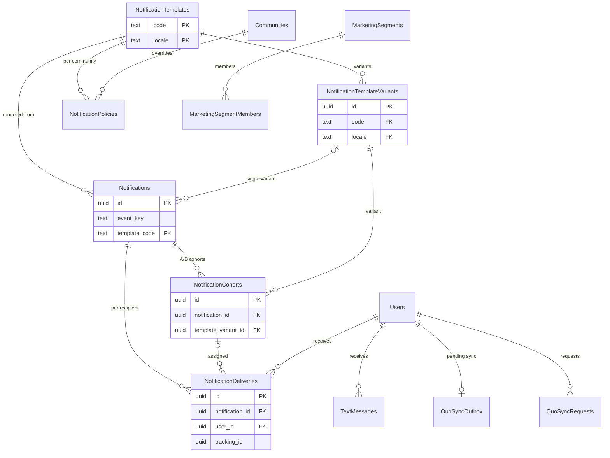

Push notifications go through one pipeline in `internal/notify`. `notify.Emit` enqueues a River job inside the caller's transaction. The orchestrator job writes one `"Notifications"` row and one `"NotificationDeliveries"` row per recipient, then the send worker delivers to Expo. Templates and their A/B variants are editable from the dashboard. Ride-specific push logs (`"RideNotifications"`) are on the [Rides](/reference/database/rides) page.

For repository conventions, see [Data layer](/engineering/api/data-layer).

## Code map

| Area | Location |
| --- | --- |
| Emit API and template codes | `internal/notify/notify.go`, `emit.go`, `codes.go` |
| Pipeline repositories | `internal/notify/repository` (`templates.go`, `variants.go`, `policies.go`, `notifications.go`, `cohorts.go`, `deliveries.go`, `pipeline.go`, `recipients.go`) |
| Workers | `internal/notify/queue`: `orchestrate.go` (orchestrator), `send.go` (Expo send), `maintenance.go` (receipt poll and stuck-delivery recovery), `stale.go` (cancel expired orchestration jobs) |
| A/B allocation and quiet hours | `internal/notify/orchestrator` |
| Dashboard admin (templates, variants, policies) | `internal/notify/admin` |
| Seed catalog | `internal/notify/seed`. Insert-only at startup, so dashboard edits survive. |
| Dashboard logs and analytics | `queries/notification_log.sql`, `internal/data/repository/notification.go` |

## NotificationTemplates

One row per template code and locale. The code catalog in `internal/notify/codes.go` defines the valid codes. Every code must have a seed variant, and CI enforces it.

| Column | Type | Null | Default | Meaning |
| --- | --- | --- | --- | --- |
| `code` | `text` | no | | Template code, such as `ride_available` or `waitlist_cleared`. |
| `locale` | `text` | no | `'en'` | Locale. |
| `channel` | `text` | no | `'push'` | Delivery channel. The orchestrator cancels jobs for non-push templates. `friend_bump_sms` is read directly by the bump SMS worker. |
| `deeplink` | `text` | yes | | Deep link template. |
| `client_data_type` | `text` | yes | | Overrides `data.type` in the push payload. Defaults to the code. Exists for legacy app handlers, for example `ride_available` sends `ride_request`. |
| `variables` | `jsonb` | no | `'{}'` | Variable schema: name to `type` (`string`, `integer`, `uuid`, `number`, or `boolean`), `required`, and optional `enum`. Invalid variables cancel the job. |
| `haptic`, `sound`, `android_channel`, `priority` | `text` | no | `'default'` | Push presentation settings. |
| `category` | `text` | no | `'transactional'` | `transactional`, `marketing`, or `safety` (CHECK). Quiet-hours deferral only applies to `marketing` and `community_broadcast`. |
| `max_recipients` | `integer` | yes | | Recipient cap. CHECK positive. The orchestrator rejects larger audiences. |
| `is_active` | `boolean` | no | `true` | Inactive templates are skipped with a metric. |
| `version` | `integer` | no | `1` | Bumped on each dashboard edit. Snapshotted in `"NotificationTemplateVersions"`. |
| `created_at`, `updated_at` | `timestamptz` | no | `now()` | Timestamps. |
| `updated_by` | `uuid` | yes | | FK to `"Users"` `ON DELETE SET NULL`. Legacy. |
| `updated_by_clerk_id` | `text` | yes | | Dashboard editor. |
| `user_cooldown_seconds`, `community_cooldown_seconds` | `integer` | yes | | Default cooldowns. CHECK non-negative. Policies can override them. |
| `quiet_hours_behavior` | `text` | no | `'bypass'` | `bypass` or `defer` (CHECK). |
| `max_defer_seconds` | `integer` | yes | | Longest a deferral may wait. A deferral beyond it expires the delivery. CHECK positive. |
| `silent` | `boolean` | no | `false` | Data-only push. The send worker drops title, body, and sound and sets `_contentAvailable`. Used for cache-invalidation pings such as `ride_status_changed`. |

Primary key `(code, locale)`.

## NotificationTemplateVariants

Copy variants for a template. Active variants split the audience by percentage.

| Column | Type | Null | Default | Meaning |
| --- | --- | --- | --- | --- |
| `id` | `uuid` | no | `gen_random_uuid()` | Primary key. |
| `code`, `locale` | `text` | no | | FK to `"NotificationTemplates"` `ON DELETE CASCADE`. |
| `label` | `text` | no | | Variant name. Unique per template. |
| `title`, `body` | `text` | no | | Copy templates. |
| `weight` | `integer` | no | `1` | Exact audience percentage. Active percentages must total 100 before send. CHECK non-negative. |
| `is_active` | `boolean` | no | `true` | Only active variants with a weight above 0 are used (index `idx_variants_active_lookup`). |
| `version` | `integer` | no | `1` | Edit counter. CHECK positive. |
| `created_at`, `updated_at` | `timestamptz` | no | `now()` | Timestamps. |
| `created_by`, `updated_by` | `uuid` | yes | | FKs to `"Users"`. Legacy. |
| `created_by_clerk_id`, `updated_by_clerk_id` | `text` | yes | | Dashboard editors. |

Variants referenced by a notification or cohort cannot be deleted (`ON DELETE RESTRICT`).

## NotificationTemplateVersions

Append-only snapshots of template and variant edits for the dashboard's history view.

| Column | Type | Null | Default | Meaning |
| --- | --- | --- | --- | --- |
| `id` | `uuid` | no | `gen_random_uuid()` | Primary key. |
| `source_table` | `text` | no | | `template` or `variant` (CHECK). |
| `source_id` | `text` | no | | `code:locale` for templates or the variant ID. |
| `version` | `integer` | no | | Version captured. Unique per source. |
| `snapshot` | `jsonb` | no | | Full row before the change. |
| `snapshot_at` | `timestamptz` | no | `now()` | Capture time. |
| `snapshot_by` | `uuid` | yes | | FK to `"Users"`. Legacy. |
| `snapshot_by_clerk_id` | `text` | yes | | Editor. |

Written by `internal/notify/repository/templates.go` and `variants.go`. The lookup index `idx_template_versions_lookup` duplicates the unique constraint's columns with `version DESC`.

## NotificationPolicies

Per-community overrides of a template's quiet hours and cooldowns.

| Column | Type | Null | Default | Meaning |
| --- | --- | --- | --- | --- |
| `community_id` | `uuid` | no | | FK to `"Communities"` `ON DELETE CASCADE`. |
| `template_code`, `template_locale` | `text` | no | | FK to `"NotificationTemplates"` `ON DELETE CASCADE`. Locale defaults to `'en'`. |
| `quiet_start`, `quiet_end` | `time` | yes | | Local quiet window in the community timezone. CHECK both set or both null. |
| `user_cooldown_seconds`, `community_cooldown_seconds` | `integer` | yes | | Cooldown overrides. CHECK non-negative. |
| `is_active` | `boolean` | no | `true` | Inactive policies are ignored. |
| `created_at`, `updated_at` | `timestamptz` | no | `now()` | Timestamps. |
| `updated_by` | `uuid` | yes | | FK to `"Users"`. Legacy. |
| `updated_by_clerk_id` | `text` | yes | | Dashboard editor. |

Primary key `(community_id, template_code, template_locale)`. `internal/notify/repository/policies.go` reads and upserts policies. The orchestrator merges them with template defaults.

## Notifications

One row per emitted notification: the audit record of what was rendered and to how many people.

| Column | Type | Null | Default | Meaning |
| --- | --- | --- | --- | --- |
| `id` | `uuid` | no | `gen_random_uuid()` | Primary key. |
| `event_key` | `text` | no | | Idempotency key. Unique. CHECK 1 to 256 characters. Defaults to `{code}:{entity}:{5-minute bucket}`. A conflict means the event was already orchestrated. |
| `template_code`, `template_locale` | `text` | no | | FK to `"NotificationTemplates"`. Locale defaults to `'en'`. |
| `template_version` | `integer` | no | | Template version used. |
| `template_variant_id` | `uuid` | yes | | Variant used when there is a single variant. FK `ON DELETE RESTRICT`. |
| `rendered_title`, `rendered_body` | `text` | no | | Rendered copy. |
| `rendered_deeplink` | `text` | yes | | Rendered link. |
| `data` | `jsonb` | no | `'{}'` | Exact push data payload the app received. |
| `variables` | `jsonb` | no | `'{}'` | Input variables. |
| `ride_id` | `uuid` | yes | | FK to `"Rides"` `ON DELETE SET NULL`. |
| `community_id` | `uuid` | yes | | FK to `"Communities"` `ON DELETE SET NULL`. |
| `triggered_by` | `uuid` | yes | | FK to `"Users"` `ON DELETE SET NULL`. |
| `triggered_by_clerk_id` | `text` | no | `''` | Dashboard user who sent a broadcast. |
| `recipient_count`, `delivered_count`, `failed_count`, `suppressed_count`, `deferred_count` | `integer` | no | `0` except `recipient_count` | Aggregates recomputed from deliveries. CHECK non-negative. |
| `status` | `text` | no | `'pending'` | `pending`, `deferred`, `sent`, `partial_failure`, `failed`, or `suppressed` (CHECK). |
| `trace_id` | `text` | yes | | OpenTelemetry trace. |
| `created_at` | `timestamptz` | no | `now()` | Emit time. |
| `is_test` | `boolean` | no | `false` | Test send. |
| `scheduled_for` | `timestamptz` | yes | | Earliest deferred send time. |
| `expires_at` | `timestamptz` | yes | | `scheduled_for` plus the template's `max_defer_seconds`. |
| `deferred_reason` | `text` | yes | | Why sending was deferred. |
| `delivery_event_recorded_at` | `timestamptz` | yes | | At-most-once guard for the aggregate `notification_delivered` ride timeline event. |

Partial indexes on `community_id` and `created_at`, `ride_id`, and `triggered_by`, plus `(template_code, created_at DESC)`.

## NotificationCohorts

When a template has several active variants, the orchestrator splits recipients into one cohort per variant.

| Column | Type | Null | Default | Meaning |
| --- | --- | --- | --- | --- |
| `id` | `uuid` | no | `gen_random_uuid()` | Primary key. |
| `notification_id` | `uuid` | no | | FK to `"Notifications"` `ON DELETE CASCADE`. |
| `template_variant_id` | `uuid` | no | | FK to the variant `ON DELETE RESTRICT`. Unique per notification. |
| `variant_label` | `text` | no | | Label at send time. |
| `template_version`, `variant_version` | `integer` | no | | Versions used. CHECK positive. |
| `configured_percentage` | `integer` | no | | Variant weight at send time. CHECK 1 to 100. |
| `allocated_count` | `integer` | no | | Recipients assigned. |
| `rendered_title`, `rendered_body` | `text` | no | | Cohort copy. |
| `rendered_deeplink` | `text` | yes | | Cohort link. |
| `created_at` | `timestamptz` | no | `now()` | Insert time. |

The plain index `idx_notification_cohorts_notification` duplicates the leading column of the unique constraint. Variant analytics (`ListNotificationVariantAnalytics`) read cohorts joined to deliveries.

## NotificationDeliveries

One row per recipient per notification.

| Column | Type | Null | Default | Meaning |
| --- | --- | --- | --- | --- |
| `id` | `uuid` | no | `gen_random_uuid()` | Primary key. |
| `notification_id` | `uuid` | no | | FK to `"Notifications"` `ON DELETE CASCADE`. |
| `user_id` | `uuid` | no | | FK to `"Users"` `ON DELETE CASCADE`. Unique with `notification_id`. |
| `push_token` | `text` | no | | Expo token captured at orchestration. |
| `channel` | `text` | no | `'push'` | Channel. |
| `status` | `text` | no | `'queued'` | `queued`, `deferred`, `sending`, `sent`, `delivered`, `failed`, or `suppressed` (CHECK). |
| `expo_ticket_id` | `text` | yes | | Expo ticket from send. |
| `expo_receipt_status` | `text` | yes | | Expo receipt outcome. |
| `error_code`, `error_message` | `text` | yes | | Failure details. `DeviceNotRegistered` receipts clear the user's token. |
| `sending_started_at` | `timestamptz` | yes | | Worker claim time. The recovery job requeues rows stuck in `sending` past the lease. |
| `sent_at`, `delivered_at`, `failed_at` | `timestamptz` | yes | | Transition times. |
| `created_at` | `timestamptz` | no | `now()` | Insert time. |
| `cohort_id` | `uuid` | yes | | FK to `"NotificationCohorts"` `ON DELETE RESTRICT`. |
| `community_id` | `uuid` | yes | | FK to `"Communities"` `ON DELETE SET NULL`. |
| `scheduled_for` | `timestamptz` | yes | | Release time for `deferred` rows. |
| `suppression_reason` | `text` | yes | | Why the delivery was suppressed, such as a cooldown or an unavailable token. |
| `is_test` | `boolean` | no | `false` | Test send. |
| `triggered_by` | `uuid` | yes | | FK to `"Users"` `ON DELETE SET NULL`. |
| `opened_at` | `timestamptz` | yes | | First tap. Set once by tracking ID and user. |
| `tracking_id` | `uuid` | no | `gen_random_uuid()` | Opaque ID in the push payload for authenticated, idempotent tap recording. Unique. |

- Partial indexes support the workers: `idx_deliveries_scheduled` (deferred rows by `scheduled_for`), `idx_deliveries_sending` (stuck sends), `idx_deliveries_ticket` (receipt lookup), `idx_deliveries_opened`, and `idx_deliveries_cohort`. `idx_deliveries_notification` duplicates the unique constraint's leading column.
- Deferred deliveries become sendable once `scheduled_for` has passed (`internal/notify/repository/deliveries.go`).
- The user notification history (`ListNotificationDeliveriesByUser`) and the community history read this table.

## ScheduledCommunityNotifications

Dashboard community broadcasts scheduled for later.

| Column | Type | Null | Default | Meaning |
| --- | --- | --- | --- | --- |
| `id` | `uuid` | no | `gen_random_uuid()` | Primary key. |
| `community_id` | `uuid` | no | | Target community. No foreign key. |
| `title`, `body`, `link` | `text` | no | | Content. |
| `recipients` | `text` | no | | Audience scope, validated by `models.ValidateCommunityNotification`. |
| `sender_id` | `uuid` | yes | | Legacy sender. Current inserts leave it null. |
| `sender_clerk_id` | `text` | no | `''` | Dashboard sender. |
| `created_timestamp` | `timestamptz` | no | `now()` | Created. |
| `schedule_send_timestamp` | `timestamptz` | no | | Due time. |
| `is_sending` | `boolean` | no | `false` | Claim flag set by `MarkScheduledNotificationSending`. |

`DashboardService.ProcessScheduledNotifications` runs every minute from a goroutine in `cmd/api/main.go`, not from River. It lists due rows, claims each with `is_sending`, sends through `SendNotificationToCommunity`, and deletes the row on success.

<Warning>
A row that fails validation or sending keeps `is_sending = true` and is never deleted. The due-row query does not filter on `is_sending`, so the row is re-read every minute and skipped when the claim fails. The partial index `idx_scheduled_notifications_send_time` (`WHERE NOT is_sending`) does not match that query.
</Warning>

## DriverNotifications

The legacy per-community log of driver-supply pings (`fare_increase`, `unclaimed_ride`, `unclaimed_ride_recent_only`, and `renew_online`) used for cooldowns. It is documented on [Rides](/reference/database/rides#drivernotifications).

## TextMessages

Outbound SMS log. Today the only writer is the friend-bump SMS flow.

| Column | Type | Null | Default | Meaning |
| --- | --- | --- | --- | --- |
| `id` | `uuid` | no | `gen_random_uuid()` | Primary key. |
| `recipient_id` | `uuid` | no | | FK to `"Users"`. No cascade. |
| `recipient_phone_number` | `text` | no | | Destination number. |
| `sender_id` | `uuid` | no | | Sending user. No foreign key. |
| `is_from_dashboard` | `boolean` | no | `false` | Sent by staff from the dashboard. |
| `message` | `text` | no | | Body. |
| `created_at` | `timestamptz` | no | `now()` | Insert time. |
| `event_key` | `text` | yes | | Idempotency key, such as `friend_bump:...`. Unique with `recipient_id` where not null. |
| `status` | `text` | no | `'sent'` | `sending`, `sent`, or `failed` (CHECK). |
| `error_message` | `text` | yes | | Failure detail. |
| `sent_at` | `timestamptz` | yes | | Provider acceptance time. The cooldown counts from here. |
| `claimed_at` | `timestamptz` | yes | | Worker lease start. |

- `ClaimTextMessage` (`queries/engagement.sql`) takes an advisory lock per recipient, then inserts a `sending` claim unless another friend bump to that recipient is inside its cooldown or has a live lease. A `failed` row, or a `sending` row with an expired lease, can be reclaimed. `CompleteTextMessage` finalizes it. `CountRecentBumpsBySender` rate-limits senders.
- Workers: `internal/notify/queue/bump_sms.go` and `internal/notify/bump_sms.go`.
- `AddTextMessage` (`internal/data/repository/text_messages.go`) is a legacy dashboard insert with no callers.

## Quo contact sync

Quo is the SMS and CRM provider. Every user is mirrored as a Quo contact. Changes are captured by triggers, coalesced in an outbox, and pushed by River jobs in `internal/service/quo/jobs.go`. The generic contact sync system can take over this work (see [Events, spots, and social graph](/reference/database/growth-events-and-social#contact-sync)). When the contact mode is `generic`, legacy Quo jobs forward to it, and when it is `paused`, they snooze.

### enqueue_quo_user_sync()

Trigger function that appends a `"QuoSyncRequests"` row for the affected user:

| Trigger | Fires on |
| --- | --- |
| `users_enqueue_quo_sync` on `"Users"` | Insert, or update of `first_name`, `last_name`, `email`, `phone_number`, `community_id`, `school_id`, or `is_deleted` |
| `driver_applications_enqueue_quo_sync` on `"DriverApplications"` | Insert, delete, or update of `is_active`, `license_status`, or `stripe_status` |
| `vehicles_enqueue_quo_sync` on `"Vehicles"` | Insert, delete, or update of `driver_id` or `application_status` |

### QuoSyncRequests

| Column | Type | Null | Default | Meaning |
| --- | --- | --- | --- | --- |
| `id` | `bigint` | no | identity | Primary key and drain order. |
| `user_id` | `uuid` | no | | FK to `"Users"` `ON DELETE CASCADE`. |
| `requested_at` | `timestamptz` | no | `now()` | Request time. |

Append-only inbox. `DrainQuoSyncRequests` deletes a batch with `FOR UPDATE SKIP LOCKED` and coalesces it into the outbox in the same statement.

### QuoSyncOutbox

| Column | Type | Null | Default | Meaning |
| --- | --- | --- | --- | --- |
| `user_id` | `uuid` | no | | Primary key. FK to `"Users"` `ON DELETE CASCADE`. |
| `version` | `bigint` | no | `1` | Incremented by the number of coalesced requests. Acknowledgment deletes the row only if the version is unchanged. |
| `requested_at` | `timestamptz` | no | `now()` | Latest request. |
| `first_requested_at` | `timestamptz` | no | `now()` | Oldest pending request. Dispatch order. |
| `job_id` | `bigint` | yes | | `river_job.id` of the dispatched sync job. Null means eligible. |
| `blocked_version` | `bigint` | yes | | Version whose job was discarded or cancelled. The row stays parked until a newer version arrives. |

The outbox worker first clears `job_id` for jobs that finished or disappeared from `river_job` (`recoverQuoJobs`), then drains requests, selects eligible rows, inserts one sync job per user, and links the job IDs.

### QuoScanProgress

| Column | Type | Null | Default | Meaning |
| --- | --- | --- | --- | --- |
| `mode` | `text` | no | | Primary key. `backfill` or `reconcile` (CHECK). |
| `cursor_id` | `uuid` | no | nil UUID | Last user ID scanned. |
| `next_due_at` | `timestamptz` | no | `now()` | Next scan batch. |

Cursor for scans that find users without a `quo_contact_id` (`ListQuoMissingContactIDs`) and periodic reconciliation. Locked with `FOR UPDATE SKIP LOCKED`.

### QuoRequestControl

| Column | Type | Null | Default | Meaning |
| --- | --- | --- | --- | --- |
| `credential_key` | `text` | no | | Primary key. One row per Quo API credential. |
| `next_request_at` | `timestamptz` | no | `'-infinity'` | Earliest next API call. `AdmitQuoRequest` advances it by the pacing interval. |
| `cooldown_until` | `timestamptz` | no | `'-infinity'` | Backoff after a rate limit (`CooldownQuoRequests`). |

A cross-instance rate limiter: a call proceeds only when `AdmitQuoRequest` updates a row. Otherwise `QuoRequestWait` returns how long to wait.

## Marketing segments

Saved audience filters synced to the marketing email provider (Resend) as segments. Code: `internal/data/repository/marketing_segments.go`, `internal/service/contactsync/segments.go`, and dashboard routes in `internal/server/http/dashboard/contactsync/segments.go`.

### MarketingSegments

| Column | Type | Null | Default | Meaning |
| --- | --- | --- | --- | --- |
| `id` | `uuid` | no | | Primary key. Generated by the app. |
| `account_key` | `text` | no | | Provider account. Taken from the `resend` row in `"ContactSyncProviders"` with mode `generic`. |
| `name` | `text` | no | | Segment name. CHECK 1 to 100 characters. Unique per account. |
| `filters` | `jsonb` | no | | Filter definition. |
| `match_mode` | `text` | no | | `all` or `any` (CHECK). |
| `remote_id` | `text` | yes | | Provider segment ID once created. |
| `create_attempted` | `boolean` | no | `false` | Provider create was attempted. Guards against duplicate remote creation. |
| `deleting` | `boolean` | no | `false` | Delete in progress. |
| `revision` | `bigint` | no | `1` | Edit counter. `FinishSegment` only writes results for the revision it computed. |
| `matched_count`, `pending_count` | `bigint` | no | `0` | Last computed membership counts. |
| `last_checked_at`, `remote_checked_at` | `timestamptz` | yes | | Last successful local and remote checks. |
| `next_due_at` | `timestamptz` | no | `now()` | Next reconciliation: 1 minute after success, immediately while members are pending, or 5 minutes after an error. |
| `error_code` | `text` | no | `''` | Last error. |
| `created_at` | `timestamptz` | no | `now()` | Creation time. |

An account can have at most 20 segments. `createSegment` counts them under an advisory lock.

### MarketingSegmentMembers

| Column | Type | Null | Default | Meaning |
| --- | --- | --- | --- | --- |
| `segment_id` | `uuid` | no | | FK to `"MarketingSegments"` `ON DELETE CASCADE`. |
| `contact_id` | `text` | no | | Provider contact ID confirmed in the remote segment. |

Primary key `(segment_id, contact_id)`. Maintained by `SaveSegmentMember` and `ReplaceSegmentMembers`.
