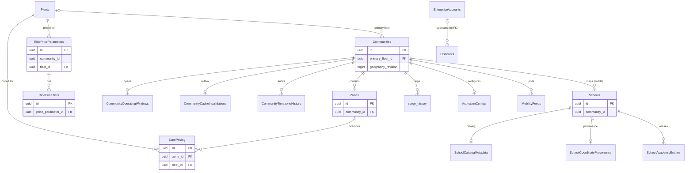

A community is a Yelo market: a bounding box with a timezone, operating rules, and a set of prices. Schools map to communities by coordinates. Zones carve a community into priced polygons. Everything on this page hangs off `"Communities"`.

For how repositories and sqlc queries are organized, see [Data layer](/engineering/api/data-layer).

## Communities

`"Communities"` is the market table. Almost every rider, driver, fleet, and pricing query filters by `community_id`. Public reads exclude archived rows (`archived_at IS NULL`).

| Column | Type | Null | Default | Meaning |
| --- | --- | --- | --- | --- |
| `id` | `uuid` | no | `gen_random_uuid()` | Primary key. |
| `name` | `text` | no | | Display name. `GetCommunityByName` matches case-insensitively. |
| `is_active` | `boolean` | no | `false` | Operational flag. Coordinate lookup, school mapping, and archive replacement only consider active communities. `CreateCommunity` inserts `false`. |
| `min_riders` | `integer` | no | `200` | Returned to clients as a launch threshold. `CreateCommunity` inserts `1`. |
| `min_drivers` | `integer` | no | `50` | Returned to clients as a launch threshold. `CreateCommunity` inserts `1`. |
| `min_latitude`, `max_latitude` | `real` | no | `0` | Latitude bounds of the service area. |
| `min_longitude`, `max_longitude` | `real` | no | `0` | Longitude bounds of the service area. |
| `background_photo_url` | `text` | yes | | Community artwork returned in community reads. No write path in the API. |
| `max_riders` | `integer` | yes | | Rider capacity returned in reads. `CreateCommunity` inserts `200`. The repository errors if it is null when read through the max-riders path (`internal/data/repository/community.go`). |
| `featured_discount_partner` | `text` | yes | | Partner name shown in the app. Read-only in the API. |
| `featured_discount_partner_logo_url` | `text` | yes | | Partner logo. Read-only in the API. |
| `banner_type` | `text` | no | `'driver'` | Legacy. No code reads it. |
| `show_driver_banner` | `boolean` | no | `false` | Legacy. No code reads it. |
| `promo_text`, `promo_color`, `promo_text_color` | `text` | yes | | Promo strip content returned by `GetCommunityDetail`. Read-only in the API. |
| `hourly_demand_graph_x`, `hourly_demand_graph_y` | `double precision[]` | no | `'{}'` | Legacy. No code reads them. Demand curves now live in `"RideDemandCurves"`. |
| `slack_updates_channel_id` | `text` | yes | | Slack channel for market updates. Read-only in the API. |
| `time_zone` | `text` | no | `'America/New_York'` | IANA timezone. Derived from the bounds by the timezone resolver (see below). |
| `is_default` | `boolean` | no | `false` | Marks the fallback community for users and schools outside every active market. Excluded from coordinate lookup. Its `primary_fleet_id` is the fleet that drivers with no membership are enrolled in (`GetDefaultCommunity`, non-test and unarchived only). |
| `primary_school_ids` | `uuid[]` | no | `'{}'` | Schools featured for the market. Returned in reads. No write path in the API. |
| `is_hidden` | `boolean` | no | `false` | Hides the community from listings. |
| `rides_disabled` | `boolean` | no | `false` | Kill switch for ride requests. `CreateCommunity` inserts `true`. |
| `primary_fleet_id` | `uuid` | yes | | Fallback ride option fleet. FK to `"Fleets"`. Setting it triggers `ensure_primary_fleet_service`. Only the default community's value drives automatic driver enrollment. A reference blocks archiving the fleet. |
| `primary_vehicle_type` | `text` | no | `'x'` | Default vehicle type slug (see `"VehicleTypes"`). |
| `auto_queue_max_minutes` | `integer` | no | `120` | Maximum auto-queue depth a driver can pick. |
| `auto_queue_default_minutes` | `integer` | no | `60` | Default auto-queue depth. |
| `surge_multiplier` | `numeric(3,2)` | no | `1.00` | Live surge multiplier set from the dashboard. Ride pricing applies it only while `surge_expires_at` is in the future. |
| `surge_expires_at` | `timestamptz` | yes | | When the current surge stops applying. |
| `surge_set_by` | `text` | yes | | Clerk user ID of the dashboard user who set the surge. |
| `is_test` | `boolean` | no | `false` | Excludes the market from coordinate lookup, school mapping, analytics, and archive replacement. |
| `limited_hours_enabled` | `boolean` | no | `false` | When `true`, `"CommunityOperatingWindows"` drive the LIVE or OFF_PEAK market status. When `false`, the market runs 24/7. |
| `active_experiments` | `text[]` | no | `'{}'` | Experiments that users in this community can opt into. Updates replace the whole list. |
| `map_moves_window_hours` | `integer` | no | `168` | Lookback window for the anonymized community map moves layer. |
| `archived_at` | `timestamptz` | yes | | Soft delete. `ArchiveCommunity` also sets `is_active = false`, `is_hidden = true`, and `rides_disabled = true`. |
| `timezone_status` | `text` | no | `'pending'` | Resolver state: `pending`, `resolved`, `unresolved`, or `non_geographic`. |
| `timezone_resolver_version` | `text` | no | `''` | Resolver version that produced the current value. A version bump re-queues the row. |
| `timezone_bounds_fingerprint` | `text` | no | `''` | Fingerprint of the bounds the resolver saw. |
| `timezone_derived_value` | `text` | no | `''` | Last timezone the resolver derived. |
| `timezone_message` | `text` | no | `''` | Human-readable resolver outcome shown on the dashboard. |
| `timezone_checked_at` | `timestamptz` | yes | | When the resolver last ran. |
| `geography_revision` | `bigint` | no | `1` | Optimistic-concurrency counter for the service area. The dashboard sends `expected_geography_revision` to reject stale saves. Maintained by a trigger. |

**Keys and constraints**

- Primary key on `id`. Partial index `idx_communities_not_archived` on `id` where `archived_at IS NULL`.
- CHECKs: latitudes within -90 to 90, longitudes within -180 to 180, `map_moves_window_hours` between 1 and 720, and `timezone_status` in the four values above.
- FK `primary_fleet_id` to `"Fleets"(id)` `ON DELETE SET NULL`.

**Triggers**

| Trigger | When | Effect |
| --- | --- | --- |
| `community_timezone_dirty` | Before update | Bumps `geography_revision` and resets `timezone_status` to `pending` when bounds or `is_default` change. A manual `time_zone` change also bumps the revision. Otherwise it pins `geography_revision` to its old value, so you cannot set it directly. |
| `community_cache_invalidation` | After insert or update | Upserts a row into `"CommunityCacheInvalidations"`. When `time_zone` changes, it also appends to `"CommunityTimezoneHistory"`. |
| `communities_reconcile_schools_after_insert` and `_after_update` | After insert, or after update of bounds, `is_active`, `is_test`, or `archived_at` | Re-resolves `"Schools".community_id` for every non-synthetic school with valid coordinates. |
| `calendar_geography_dirty` | After update of `geography_revision`, `timezone_status`, `is_active`, or `archived_at` | Calls `dirty_calendar_sources()` to re-sync fleet calendars. See [Fleet calendars](/reference/database/fleets-calendars). |
| `ensure_primary_fleet_service` | After update of `primary_fleet_id` on a live community | Ensures the primary fleet has an enabled service row. See [Fleets, vehicles, and driver supply](/reference/database/fleets-and-vehicles). |
| `retire_archived_community_services` | After `archived_at` goes from null to set | Retires the community's fleet services. |
| `guard_fleet_primary_archive` | Before insert, or update of `primary_fleet_id` | Rejects an archived or missing fleet with `Fleet is archived or missing` (SQLSTATE `23514`). See [Fleet archival](/reference/database/fleets-and-vehicles#fleet-archival). |
| `contact_sync_communities` | After update or delete | Calls `enqueue_contact_sync()` for contact matching. |

**Relationships.** Referenced by most market-scoped tables, including `"Zones"`, `"Fleets"`, `"FleetCommunityServices"`, `"Locations"`, `"Notifications"`, `"ActivationConfigs"`, `"MobilityFeeds"`, and `surge_history`. `"Users".community_id` and `home_community_id` and `"Schools".community_id` point here without a foreign key.

**Written by / read by**

- `internal/data/repository/community.go` with `queries/community.sql`: create, update, archive, detail, list, coordinate lookup, operating windows, price parameters, and demand curves.
- `internal/data/repository/community_timezone.go` and `queries/community_timezone.sql`: timezone resolution through `internal/data/timezone`.
- `internal/data/repository/supply_demand.go` and `queries/supply_demand.sql`: surge and market summaries.
- `internal/service/dashboard/community.go`, `internal/service/dashboard/supply_demand.go`, `internal/service/ride/rider.go`, `internal/service/authv3` (active community resolution).
- The `community_geography_maintenance` River job in `internal/notify/queue/community_timezone.go` resolves pending timezones and drains the cache invalidation outbox.

**Gotchas**

- Community `87794dc9-7ef8-438c-b2e8-ba6fd77e66aa` is reserved as the Yelo community. Coordinate lookup, default lookup, and archive replacement exclude it by hard-coded ID in `queries/community.sql`, and `internal/service/authv3/yelo_community_repair.go` repairs users assigned to it.
- Coordinate lookup (`GetCommunityByCoordinates`) picks the smallest bounding box that contains the point.
- Archiving calls `FindCommunityArchiveReplacement`, reassigns `"Users".community_id`, `"Users".home_community_id`, and `"Schools".community_id` to a replacement, then closes open `"RidePriceParameters"` rows.
- Market status is computed, not stored. `computeMarketStatus` in `internal/data/repository/community.go` returns LIVE if a driver is online, if limited hours are on and now falls inside a window, or if the last driver went offline less than one hour ago.

## Community operating windows

`"CommunityOperatingWindows"` holds one open and close time per weekday. The windows matter only when `"Communities".limited_hours_enabled` is `true`.

<Note>
If the community's primary fleet has a connected, non-disabled calendar, the community read path in `internal/data/repository/community.go` ignores these rows. It projects operating windows from the published calendar, forces `limited_hours_enabled` to `true` in the response, and computes market status from calendar hours. See [Fleet calendars](/reference/database/fleets-calendars).
</Note>

| Column | Type | Null | Default | Meaning |
| --- | --- | --- | --- | --- |
| `community_id` | `uuid` | no | | FK to `"Communities"` `ON DELETE CASCADE`. |
| `day_of_week` | `smallint` | no | | 0 is Sunday, 6 is Saturday. CHECK 0 to 6. |
| `open_time` | `time` | no | | Local opening time, in the community timezone. |
| `close_time` | `time` | no | | Local closing time. |

- Primary key `(community_id, day_of_week)`, so each day has at most one window.
- The dashboard replaces the whole set: `DeleteCommunityOperatingWindows` then `CreateCommunityOperatingWindow` per day.
- Read by `internal/data/repository/community.go` for market status and the next-window label, by `supply_demand.go` for market summaries, and by `driver_auto_queue_log_overlap.go` to compute how much of a driver's auto-queue time overlapped operating hours. The overlap code also reads `"CommunityTimezoneHistory"` so past intervals use the timezone in effect at the time.

## Community cache invalidations

`"CommunityCacheInvalidations"` is a transactional outbox that tells API instances to drop cached community data in Redis.

| Column | Type | Null | Default | Meaning |
| --- | --- | --- | --- | --- |
| `community_id` | `uuid` | no | | Primary key. FK to `"Communities"` `ON DELETE CASCADE`. |
| `version` | `bigint` | no | `1` | Overwritten from sequence `community_cache_invalidation_version` on every insert or update. |
| `updated_at` | `timestamptz` | no | `clock_timestamp()` | Last enqueue time. The drain reads oldest first. |

- The `community_cache_invalidation` trigger on `"Communities"` writes it. The `version_community_cache_invalidation` trigger assigns a fresh global version on every write.
- The `community_geography_maintenance` River worker reads up to 100 rows, calls `redisclient.InvalidateCommunityCaches`, then deletes each row with `AckCommunityCacheInvalidation`, which matches both `community_id` and `version`.
- Migration `000318_calendar_snapshots` switched `version` to a sequence so a deleted and recreated row never reuses version 1. Otherwise a slow worker's acknowledgment could delete a newer signal.

## Community timezone history

`"CommunityTimezoneHistory"` is an append-only audit of `time_zone` changes.

| Column | Type | Null | Default | Meaning |
| --- | --- | --- | --- | --- |
| `id` | `bigint` | no | identity | Primary key. |
| `community_id` | `uuid` | no | | FK to `"Communities"`. No cascade, so a community with history cannot be hard-deleted. |
| `previous_time_zone` | `text` | no | | Zone before the change. |
| `time_zone` | `text` | no | | Zone after the change. |
| `changed_at` | `timestamptz` | no | `clock_timestamp()` | Change time. |
| `geography_revision` | `bigint` | no | | Community revision at the change. |

- Index `community_timezone_history_lookup` on `(community_id, changed_at)`.
- Written only by the `enqueue_community_cache_invalidation()` trigger function.
- Read by `ListCommunityTimezoneHistory` in `internal/data/repository/driver_auto_queue_log.go`.

## Schools

`"Schools"` lists the colleges users sign up under. A school's `community_id` decides which market its students join.

| Column | Type | Null | Default | Meaning |
| --- | --- | --- | --- | --- |
| `id` | `uuid` | no | `gen_random_uuid()` | Primary key. |
| `name` | `text` | no | | Unique school name. |
| `community_id` | `uuid` | no | `gen_random_uuid()` | Market the school maps to. Maintained by triggers. No foreign key. |
| `logo_url` | `text` | yes | | School logo. |
| `extensions` | `text[]` | yes | `'{}'` | Email domains for the school, such as `fsu.edu`. Education verification matches normalized domains here, and community reads aggregate them. |
| `admin_otp` | `text` | no | `'12345'` | Carried through every school read but never checked. The school catalog sync inserts a random UUID string. |
| `latitude`, `longitude` | `double precision` | no | `0.0` | Campus point. `(0, 0)` means missing. |
| `is_synthetic` | `boolean` | no | `false` | Protects hand-made schools, such as E2E fixtures, from coordinate mapping and catalog sync. |

**Keys.** Primary key on `id`, unique `name`, index on `community_id`.

**Triggers**

- `schools_assign_community_from_coordinates`, before insert or update of `latitude`, `longitude`, or `community_id`, runs `assign_school_community_from_coordinates()`. For non-synthetic schools with a valid point, it sets `community_id` to `resolve_school_community(lat, lon)`. If the point is invalid and `community_id` is null or the nil UUID, it falls back to the default community.
- `contact_sync_schools` calls `enqueue_contact_sync()` after update or delete.

**Mapping functions**

- `school_community_candidates(lat, lon, proposed_id, proposed)` returns active, non-test, non-default, non-archived communities whose bounds contain the point, smallest area first. The optional `proposed` JSON lets the dashboard preview a bounds edit before saving.
- `preview_school_community(...)` returns the first candidate, or the default community.
- `resolve_school_community(lat, lon)` wraps `preview_school_community` for the triggers.
- `school_management(school_id)` returns a JSON diagnostic: mapping mode (`coordinates` or `legacy`), reason (`synthetic_school`, `missing_coordinates`, `outside_active_bounds`, `smallest_overlapping_bounds`, or `inside_active_bounds`), the resolved community, match count, and catalog and coordinate provenance. `queries/school_management.sql` exposes it to the dashboard.

**Written by / read by**

- `cmd/sync-school-catalog` inserts and backfills schools from NCES data. It is dry-run by default.
- `internal/data/repository/schools.go`, `education_verification.go`, `education_claim.go`, and `dashboard.go` read schools.
- `queries/community.sql` moves schools between communities (`MoveSchoolToCommunity`, `MoveSchoolToDefaultCommunity`, `ReassignSchoolsCommunity`). For non-synthetic schools with valid coordinates, the trigger re-resolves `community_id` on those updates, so a manual move only sticks for schools without coordinates.
- `internal/server/http/e2econtrol/routes.go` inserts synthetic schools for E2E runs.

## School academic entities

`"SchoolAcademicEntities"` caches the mapping from an external institution ID, returned by student ID verification, to a Yelo school.

| Column | Type | Null | Default | Meaning |
| --- | --- | --- | --- | --- |
| `entity_id` | `text` | no | | External institution identifier. Primary key. CHECK non-blank. |
| `school_id` | `uuid` | no | | FK to `"Schools"` `ON DELETE CASCADE`. |
| `created_at` | `timestamptz` | no | `now()` | When the mapping was learned. |

`educationVerificationRepository.ResolveSchool` in `internal/data/repository/education_verification.go` looks up the entity first. On a miss, it matches the verification's email scopes against `"Schools".extensions`. If exactly one school matches, it inserts the mapping with `ON CONFLICT DO NOTHING`.

## School catalog metadata

`"SchoolCatalogMetadata"` stores the IPEDS catalog record behind a school. Only `cmd/sync-school-catalog` writes it.

| Column | Type | Null | Default | Meaning |
| --- | --- | --- | --- | --- |
| `school_id` | `uuid` | no | | Primary key. FK to `"Schools"` `ON DELETE CASCADE`. |
| `ipeds_unit_id` | `text` | no | | IPEDS unit ID. Unique. CHECK non-blank. |
| `address`, `city`, `state`, `postal_code`, `website_url` | `text` | no | `''` | Catalog address and website. |
| `source_year` | `text` | no | `''` | Catalog vintage. |
| `synced_at` | `timestamptz` | no | `now()` | Last sync. |

Index `school_catalog_metadata_state_city_idx` on `(state, city)`. `school_management()` reads it.

## School coordinate provenance

`"SchoolCoordinateProvenance"` records where a school's current coordinates came from.

| Column | Type | Null | Default | Meaning |
| --- | --- | --- | --- | --- |
| `school_id` | `uuid` | no | | Primary key. FK to `"Schools"` `ON DELETE CASCADE`. |
| `latitude`, `longitude` | `double precision` | no | | The coordinates this record describes. CHECK valid range and not `(0, 0)`. |
| `source` | `text` | no | | Source name. |
| `source_id`, `source_url`, `source_year`, `accuracy` | `text` | no | `''` | Source details. |
| `recorded_at` | `timestamptz` | no | `now()` | When the sync applied the coordinates. |

`school_management()` joins it only when its coordinates equal the school's current coordinates, so a later manual move shows the source as `unknown`. Written by `cmd/sync-school-catalog/coordinates.go`.

## Zones

`"Zones"` are GeoJSON polygons inside a community. They drive zone pricing, calendar scoping, and an optional rider map layer.

| Column | Type | Null | Default | Meaning |
| --- | --- | --- | --- | --- |
| `id` | `uuid` | no | `gen_random_uuid()` | Primary key. |
| `community_id` | `uuid` | no | | FK to `"Communities"` `ON DELETE CASCADE`. |
| `name` | `text` | no | | Display name. |
| `color` | `text` | no | `'#eab308'` | Map color. |
| `priority` | `integer` | no | `0` | Overlap tie-breaker. `models.ResolveZone` picks the highest priority, then the smallest area, then the lowest ID. |
| `geometry` | `jsonb` | no | | `models.GeoPolygon`: `type` `Polygon` and `coordinates` as rings of `[lng, lat]`. Ring 0 is the outer ring. |
| `is_active` | `boolean` | no | `true` | Inactive zones are ignored by pricing and calendars. |
| `created_at`, `updated_at` | `timestamptz` | no | `now()` | Timestamps. |
| `description` | `text` | yes | | Optional description. PATCH distinguishes an omitted field from an explicit null. |
| `show_on_map` | `boolean` | no | `true` | Rider map shows only active zones with this flag. |

- Index `zones_community_id_idx`. Unique constraint `zones_scope_key` on `(id, community_id)` exists so calendar tables can use a composite FK that proves a zone belongs to the same community.
- Trigger `calendar_zone_dirty` calls `dirty_calendar_sources()` when `is_active`, `geometry`, or `community_id` change.
- Written through `queries/places.sql` from `internal/data/repository/community.go` and `internal/server/http/community/zone_handler.go`. Read by `internal/utilities/pricing/zoned.go`, `internal/service/ride/rider.go`, `internal/service/dashboard/zone_pricing.go`, and the calendar repositories.

## Zone pricing

`"ZonePricing"` overrides a fleet's per-mile, per-minute, or flat fee inside one zone.

| Column | Type | Null | Default | Meaning |
| --- | --- | --- | --- | --- |
| `id` | `uuid` | no | `gen_random_uuid()` | Primary key. |
| `zone_id` | `uuid` | no | | FK to `"Zones"` `ON DELETE CASCADE`. |
| `fleet_id` | `uuid` | no | | FK to `"Fleets"` `ON DELETE CASCADE`. |
| `per_mile` | `double precision` | yes | | Replaces the tiered distance rate for miles driven inside the zone. Null keeps the default tiers. |
| `per_minute` | `double precision` | yes | | Replaces the per-minute rate inside the zone. Null keeps the default. |
| `flat_fee` | `double precision` | yes | | Added once per ride that enters the zone. |
| `created_at`, `updated_at` | `timestamptz` | no | `now()` | Timestamps. |

- Unique `(zone_id, fleet_id)`, plus index `idx_zonepricing_zone`.
- `internal/data/repository/zone_pricing.go` lists overrides by community, upserts, and deletes.
- `internal/utilities/pricing/zoned.go` prices a route piecewise. It resolves the zone at each segment midpoint, scales polyline miles and minutes to the routed totals, and bills each segment at the zone override or the default rate.

## Vehicle types

`"VehicleTypes"` is the catalog of vehicle classes. Migration `000200_vehicle_types` seeded `x` (Car), `xl` (Big Car), `cart` (Cart), and `minibus` (Mini Bus).

| Column | Type | Null | Default | Meaning |
| --- | --- | --- | --- | --- |
| `id` | `uuid` | no | `gen_random_uuid()` | Primary key. |
| `slug` | `text` | no | | Unique key referenced by `"Vehicles".vehicle_type`, `"Rides".vehicle_type`, `"RidePriceParameters".vehicle_type`, and `"Communities".primary_vehicle_type`. CHECK non-empty. |
| `display_name` | `text` | no | | Rider-facing name. |
| `description` | `text` | yes | | Optional description. |
| `icon_name` | `text` | no | `'car'` | Client icon key. |
| `min_seats`, `max_seats` | `integer` | no | `4` | Seat range. |
| `sort_order` | `integer` | no | `0` | List order. |
| `is_active` | `boolean` | no | `true` | Deactivation is a soft delete (`DeactivateVehicleType`). |
| `metadata` | `jsonb` | no | `'{}'` | Free-form metadata. |
| `created_at`, `updated_at` | `timestamptz` | no | `now()` | Timestamps. The app passes `updated_at` explicitly. |
| `image_asset` | `text` | no | `''` | Artwork key from `"MobileVehicleCatalogs"`. `VehicleCatalogStore.Validate` only allows new keys present in both the iOS and Android catalogs. |

- Queries live in `queries/driver_fleet_primitives.sql` (`ListVehicleTypes`, `ListActiveVehicleTypes`, `GetVehicleTypeBySlug`, `CreateVehicleType`, `UpdateVehicleType`, `DeactivateVehicleType`).
- The slug is not a foreign key anywhere. Tables that store a vehicle type rely only on CHECKs that it is non-empty.

## Ride price parameters

`"RidePriceParameters"` is the versioned price card for a community, fleet, vehicle type, and pricing type. `RidePriceParameters.adjustment` is mapped to `models.PricingAdjustment` by an override in `sqlc.yaml`.

| Column | Type | Null | Default | Meaning |
| --- | --- | --- | --- | --- |
| `id` | `uuid` | no | `gen_random_uuid()` | Primary key. |
| `community_id` | `uuid` | no | | Market. No foreign key. |
| `fleet_id` | `uuid` | yes | | FK to `"Fleets"` `ON DELETE CASCADE`. |
| `vehicle_type` | `text` | no | `'x'` | Vehicle type slug. |
| `pricing_type` | `text` | no | `'per_ride'` | `per_ride` or `per_person` (CHECK). Rider quoting (`ListActiveRidePriceParameters`) only loads `per_ride`. |
| `base_price` | `real` | no | | Flat base fare. |
| `price_per_minute` | `real` | no | | Time rate. |
| `start_time` | `timestamptz` | no | | When the version takes effect. A future start stays out of the active set until it arrives. |
| `end_time` | `timestamptz` | yes | | Null means current. Closing a version sets it. |
| `is_featured` | `boolean` | no | `false` | Highlights the option in the rider picker. |
| `display_name` | `text` | no | `''` | Option label override. CHECK length at most 80. |
| `image_asset` | `text` | no | `''` | Artwork key override. CHECK length at most 96. |
| `adjustment` | `jsonb` | no | `'{"mode": "jitter"}'` | Fare adjustment. CHECK: an object whose `mode` is `jitter`, `rounded`, or `none`. |

**Keys and constraints**

- Unique partial index `idx_price_params_unique_active` on `(community_id, fleet_id, vehicle_type, pricing_type)` where `end_time IS NULL`: one current version per combination.
- Non-unique partial index `idx_price_params_community_active` on the same columns and predicate.
- Trigger `validate_current_price_parents` runs `validate_fleet_service_parents()` before insert or update. For current rows with a fleet, it locks the community and fleet rows in that order and rejects archived communities or deleted fleets with SQLSTATE `23514`.

**Lifecycle.** Dashboard edits never update prices in place. `internal/data/repository/dashboard.go` locks the current row (`GetActiveDashboardRidePriceParameterForUpdate`), closes it with `CloseDashboardRidePriceParameter`, inserts a new version, and copies or replaces its tiers. The dashboard lists only versions whose fleet has an active service in the community (`"ActiveFleetCommunityServices"`). Everything else appears in the history view.

**Read by** `queries/ride_matching.sql` and `internal/service/ride/rider.go` for quotes, `internal/utilities/pricing` for the fare math, and the dashboard pricing preview.

## Ride price tiers

`"RidePriceTiers"` holds distance bands for a price parameter version.

| Column | Type | Null | Default | Meaning |
| --- | --- | --- | --- | --- |
| `id` | `uuid` | no | `gen_random_uuid()` | Primary key. |
| `price_parameter_id` | `uuid` | no | | FK to `"RidePriceParameters"` `ON DELETE CASCADE`. |
| `min_distance_miles` | `real` | no | | Band start. |
| `max_distance_miles` | `real` | yes | | Band end. Null means open-ended. |
| `price_per_mile` | `real` | no | | Rate within the band. |
| `sort_order` | `integer` | no | | Band order. Unique with `price_parameter_id`. |
| `created_at` | `timestamptz` | no | `now()` | Insert time. |

Tiers are immutable per version. A price edit deletes and re-inserts them or copies them to the new version (`CopyDashboardRidePriceTiers`).

## Pricing jitter settings

`"PricingJitterSettings"` is a single-row table that holds the platform-wide jitter tuning used when a price card's adjustment mode is `jitter`.

| Column | Type | Null | Default | Meaning |
| --- | --- | --- | --- | --- |
| `singleton` | `boolean` | no | `true` | Primary key. CHECK `singleton` is true, so only one row can exist. |
| `settings` | `jsonb` | no | | `models.PricingJitterSettings`: `min`, `max`, `clamp_overshoot_limit`, `clamp_range_min`, `clamp_range_max`, `anchor_inflation_min`, `anchor_inflation_max`. |
| `updated_at` | `timestamptz` | no | `now()` | Last change. |

- The creating migration seeds the row, and `PricingJitterStore.Set` in `internal/data/repository/pricing_jitter.go` only updates it. `Get` and `Set` both run `Validate()`, which requires finite non-negative values, `min` at most `max`, a clamp range below 1, and anchor inflation at least 1.
- The same migration stripped per-card jitter overrides from `"RidePriceParameters".adjustment`, leaving only `mode`.
- Dashboard route: `internal/server/http/dashboard/pricingjitter`.

## Surge history

`surge_history` audits every surge the dashboard sets or clears. The live value lives on `"Communities"`.

| Column | Type | Null | Default | Meaning |
| --- | --- | --- | --- | --- |
| `id` | `uuid` | no | `gen_random_uuid()` | Primary key. |
| `community_id` | `uuid` | no | | FK to `"Communities"`. |
| `multiplier` | `numeric(3,2)` | no | | Multiplier set. `1.0` records a clear. |
| `expires_at` | `timestamptz` | no | | Scheduled expiry. |
| `ended_at` | `timestamptz` | yes | | When a later action ended it early. |
| `end_reason` | `text` | yes | | `overwritten` or `manually_cleared`. |
| `set_by_clerk_id` | `text` | no | | Clerk user ID. |
| `set_by_name`, `set_by_email` | `text` | no | | Resolved from Clerk. Falls back to the Clerk ID when lookup fails. |
| `created_at` | `timestamptz` | no | `now()` | Insert time. |

- Index `idx_surge_history_community_created` on `(community_id, created_at DESC)`.
- `SupplyDemandService` in `internal/service/dashboard/supply_demand.go` closes the active row, inserts a new row, and then updates `"Communities"`. The history writes only log a warning on failure, so history can miss entries.
- The API derives a display status. Rows with multiplier `1.0` show as `clear_action`.

## Ride demand curves

`"RideDemandCurves"` stores the expected demand curve per community and weekday that the driver demand screen shows.

| Column | Type | Null | Default | Meaning |
| --- | --- | --- | --- | --- |
| `community_id` | `uuid` | no | | Market. No foreign key. |
| `day_of_week` | `integer` | no | | 0 to 6. No CHECK. |
| `start_time` | `timestamptz` | no | | Version start. |
| `end_time` | `timestamptz` | no | | `'infinity'` for the current version. |
| `x`, `y` | `double precision[]` | no | | Curve points. |

- Primary key `(community_id, day_of_week, start_time)`.
- `SetExpectedDemandCurve` in `internal/data/repository/community.go` closes the open version and inserts a new one in one transaction. The driver demand statistics query reads the newest version whose `end_time` is in the future.

## Discounts

`"Discounts"` gives riders a discount when the ride's destination address matches `target_address` during a time window.

| Column | Type | Null | Default | Meaning |
| --- | --- | --- | --- | --- |
| `id` | `uuid` | no | `gen_random_uuid()` | Primary key. |
| `discount_rate` | `real` | no | | Discount amount. The highest active rate wins. |
| `discount_type` | `text` | no | | Discount kind carried to `models.Discount`. |
| `target_address` | `text` | no | | Exact destination address string to match. |
| `start_time`, `end_time` | `timestamptz` | no | `CURRENT_TIMESTAMP` | Active window. |
| `community_id` | `uuid` | no | `'783f9e7b-9b96-44e2-b038-68f6a4908b27'` | Legacy market tag from migration `000061`. No code filters on it. |
| `sponsor_id` | `uuid` | yes | | Sponsoring `"EnterpriseAccounts".id`. No foreign key. |

- Only the primary key. No index on `target_address`.
- The API never inserts discounts. `internal/data/repository/discount.go` reads them with `GetBestDiscount` and `IsAddressDiscounted`. `internal/service/ride/rider.go` applies the best discount when quoting and at ride creation. `queries/places.sql` and `queries/engagement.sql` flag discounted locations and events.

## Activation configs

`"ActivationConfigs"` overrides the dispatch activation ladder for one community: how far and how fast ride offers fan out to drivers.

| Column | Type | Null | Default | Meaning |
| --- | --- | --- | --- | --- |
| `id` | `uuid` | no | `gen_random_uuid()` | Primary key. |
| `community_id` | `uuid` | no | | Unique. FK to `"Communities"` `ON DELETE CASCADE`. |
| `tiers` | `jsonb` | no | | Array of `models.ActivationTier`: `delay_seconds`, `radius_km`, `target_drivers`, `warm_age_minutes`, `ignore_already_notified`. |
| `cooldown_minutes` | `integer` | no | `15` | Minimum time before notifying a driver again. |
| `rescue_enabled` | `boolean` | no | `false` | Enables the rescue pass. |
| `rescue_grace_minutes` | `integer` | no | `5` | Grace period before rescue. |
| `created_at`, `updated_at` | `timestamptz` | no | `now()` | Timestamps. |

- Unique constraint on `community_id` plus a redundant plain index `idx_activation_configs_community_id`.
- With no row, `internal/service/activation/activation.go` uses `models.DefaultActivationConfig()`: four tiers at 45, 120, 300, and 480 seconds.
- Upserted and deleted from the dashboard through `internal/service/dashboard/community.go`. Queries are in `queries/driver_fleet_primitives.sql`.

## Mobility feeds

`"MobilityFeeds"` registers GBFS and GTFS feeds whose vehicles appear on the community map.

| Column | Type | Null | Default | Meaning |
| --- | --- | --- | --- | --- |
| `id` | `uuid` | no | `gen_random_uuid()` | Primary key. |
| `community_id` | `uuid` | no | | FK to `"Communities"`. |
| `source` | `text` | no | | `gbfs`, `gtfs`, or `gtfs_rt` (CHECK). |
| `name` | `text` | no | | Display name. |
| `feed_url` | `text` | no | | Feed endpoint. |
| `vehicle_type` | `text` | no | `'bike'` | Map vehicle kind. |
| `is_active` | `boolean` | no | `true` | Only active feeds are polled. |
| `created_at` | `timestamptz` | no | `now()` | Insert time. |
| `last_error`, `last_error_at` | `text`, `timestamptz` | yes | | Last fetch failure. |
| `consecutive_failures` | `integer` | no | `0` | Drives exponential backoff. |

`internal/service/maplayer/mobility.go` polls active feeds and backs off `2^n` minutes after `n` consecutive failures, capped at one hour. A success resets the health columns. The dashboard manages feeds through `internal/server/http/dashboard/mobilityfeed`. Updating a feed can reset health with `reset_health`.

## Enterprise accounts

`"EnterpriseAccounts"` stores business partners that sponsor discounts, own venues, or host events.

| Column | Type | Null | Default | Meaning |
| --- | --- | --- | --- | --- |
| `id` | `uuid` | no | `gen_random_uuid()` | Primary key (constraint still named `Merchants_pkey`). |
| `name`, `logo_url`, `website_url`, `phone_number`, `email` | `text` | no | | Account profile. |
| `business_address`, `contact_name` | `text` | yes | | Optional details. |

Written and listed through `queries/engagement.sql`. Read through `"Events".enterprise_account_id`, `"Venues".enterprise_account_id`, and `"Discounts".sponsor_id`, with no foreign keys from any of them.

## Waitlist

`"Waitlist"` is a legacy pre-launch signup list.

| Column | Type | Null | Default | Meaning |
| --- | --- | --- | --- | --- |
| `id` | `uuid` | no | `gen_random_uuid()` | Primary key. |
| `school` | `text` | no | `''` | Free-text school. |
| `created_at` | `timestamp(3)` | no | `CURRENT_TIMESTAMP` | Signup time, without timezone. |
| `name` | `text` | yes | | Name. |
| `phone_number` | `text` | no | | Contact number. |

No query or repository reads or writes this table. It appears only in generated sqlc models. Waitlisting is retired everywhere: the `users_retire_waitlisting` trigger on `"Users"` forces `is_waitlisted` to `false` on every insert and update. See [Users and identity](/reference/database/users-and-identity).
