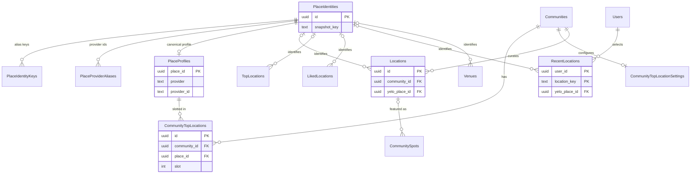

Yelo stores places in two layers. Snapshot tables (`"Locations"`, `"LikedLocations"`, `"RecentLocations"`, `"Venues"`, `"TopLocations"`, and ride pickups and destinations) keep the name and coordinates they were saved with. The place identity tables give every snapshot a stable `yelo_place_id`, so the app can merge and re-categorize the same place across tables.

For repository conventions, see [Data layer](/engineering/api/data-layer).

## Place identity system

### How identities are assigned

Tables with a `yelo_place_id` column run the `attach_yelo_place('', 'yelo_place_id', 'mapbox_id')` trigger before insert or update. The trigger arguments are a column prefix, the identity column, and the provider ID column. `"Bumps"` passes the `destination_` prefix, and `"Rides"` runs two variants that fill `pickup_place_id` and `destination_place_id` (see [Rides](/reference/database/rides)).

| Function | What it does |
| --- | --- |
| `yelo_place_key(name, lat, lng)` | MD5 of the normalized name (lowercase, alphanumerics only) and coordinates rounded to 6 decimals. Immutable. |
| `ensure_yelo_place(name, lat, lng, legacy_id)` | Returns null for a blank name or invalid coordinates. Otherwise it finds the identity by key in `"PlaceIdentityKeys"`, then `"PlaceIdentities"`, or inserts a new one. A non-empty `legacy_id` (the row's `mapbox_id`) is recorded as a `legacy` provider alias. |
| `attach_yelo_place()` | On update, keeps the existing ID when coordinates are unchanged and either the name or the provider ID is unchanged. A rename records the new key as an alias in `"PlaceIdentityKeys"`, unless that key already belongs to another place, in which case the row moves to that place. Every other case calls `ensure_yelo_place`. |
| `admit_place_provider_alias()` | Before insert or update on `"PlaceProviderAliases"`, silently drops rows whose `provider_id` is empty or longer than 1024 bytes. |
| `known_place_categories(values)` | True when the array contains at least one of Yelo's canonical categories, such as `bar`, `cafe`, `frat`, `library`, or `stadium`. |
| `resolved_place_categories(place, snapshot, curated)` | Returns the snapshot categories when they are known and the row is curated or tagged `frat` or `sorority`. Otherwise it prefers the identity's categories when `category_version = 1` and they are known. Read queries use it instead of raw `categories`. |
| `backfill_yelo_places(batch_size)` | Walks one incomplete source in `"PlaceIdentityBackfills"` by cursor and re-saves each row so the trigger attaches an identity. Returns rows processed, or -1 when every source is done. |

### PlaceIdentities

One row per real-world place.

| Column | Type | Null | Default | Meaning |
| --- | --- | --- | --- | --- |
| `id` | `uuid` | no | `gen_random_uuid()` | The `yelo_place_id` exposed to clients. |
| `snapshot_key` | `text` | no | | `yelo_place_key` of the first snapshot. Unique. |
| `categories` | `text[]` | no | `'{}'` | Provider-derived categories. Replaced only when the new set is known or the old set is not (`ImprovePlaceCategories`). |
| `category_version` | `integer` | no | `0` | Set to `1` once categories come from the current mapping. `resolved_place_categories` only trusts version 1. |
| `metadata_expires_at` | `timestamptz` | no | `'-infinity'` | Provider metadata stays fresh for 7 days after a successful fetch. |
| `retry_after` | `timestamptz` | no | `'-infinity'` | Backoff after a failed provider lookup (`SetPlaceRetry`). |
| `updated_at` | `timestamptz` | no | `now()` | Last change. |

Referenced by `"PlaceIdentityKeys"`, `"PlaceProviderAliases"`, `"PlaceProfiles"`, `"Locations"`, `"TopLocations"`, `"LikedLocations"`, `"RecentLocations"`, `"Venues"`, `"Bumps"`, and `"Rides"` (`pickup_place_id` and `destination_place_id`). None of these foreign keys cascade.

Written and read by `internal/data/repository/place_catalog.go` (`queries/place_catalog.sql`), which serves `internal/service/mapping` (POI details and categories) and `internal/service/user/likes.go`. `GetPlaceAffectedUsers` finds users to refresh after a place changes: likers, their friends, users with the place in recents, and users in communities that feature it.

### PlaceIdentityKeys

Extra snapshot keys that resolve to an existing identity, for example after a rename.

| Column | Type | Null | Default | Meaning |
| --- | --- | --- | --- | --- |
| `snapshot_key` | `text` | no | | Primary key. |
| `place_id` | `uuid` | no | | FK to `"PlaceIdentities"`. |

Written by `attach_yelo_place()` and `RecordPlaceSnapshotAlias`. `RecordPlaceSnapshotAlias` refuses a key that is already another identity's primary key.

### PlaceProviderAliases

Provider IDs (Google, Mapbox, or legacy strings) known for a place.

| Column | Type | Null | Default | Meaning |
| --- | --- | --- | --- | --- |
| `place_id` | `uuid` | no | | FK to `"PlaceIdentities"`. |
| `provider` | `text` | no | | `google`, `mapbox`, or `legacy` (CHECK). |
| `provider_id` | `text` | no | | Provider identifier. `legacy` stores whatever the snapshot's `mapbox_id` held. |
| `verified` | `boolean` | no | `false` | Set once a provider lookup confirms the ID. `RecordPlaceProvider` never unsets it. |
| `updated_at` | `timestamptz` | no | `now()` | Last upsert. |

- Primary key `(place_id, provider, provider_id)`. Index `place_provider_alias_lookup` on `(provider_id, provider)`.
- `GetPlaceIdentity` prefers the newest verified Google ID, then a legacy ID that looks like a Google place ID (`google:`, `places/`, `ChIJ`, or `GhIJ`).
- `LookupLegacyPlaceIdentities` returns at most two matches. Callers treat two as ambiguous and never redirect automatically.

### PlaceProfiles

Canonical name, address, and coordinates for a place, used by top locations. Added in migration `000345_canonical_top_locations`.

| Column | Type | Null | Default | Meaning |
| --- | --- | --- | --- | --- |
| `place_id` | `uuid` | no | | Primary key. FK to `"PlaceIdentities"`. |
| `provider` | `text` | no | | `google`, `mapbox`, or `legacy` (CHECK). |
| `provider_id` | `text` | no | | Provider identifier. CHECK non-empty. Unique with `provider`. |
| `name` | `text` | no | | Canonical name. CHECK non-empty. |
| `address` | `text` | no | | Canonical address. |
| `latitude`, `longitude` | `double precision` | no | | Canonical coordinates. CHECK valid range. |
| `categories` | `text[]` | no | `'{}'` | Categories. |
| `verified_at` | `timestamptz` | yes | | Set when a provider retrieval or dashboard replacement confirms the profile. Rider reads require it. |
| `verification_attempted_at` | `timestamptz` | yes | | Last automatic verification attempt. Retries wait 24 hours. |

- Row level security is enabled with no policies, so only the table owner (the API role) can access it.
- The migration seeded `legacy` profiles from `"TopLocations"` without `verified_at`: legacy coordinates are never served until verified.
- `UpsertCanonicalPlace` only overwrites an unverified profile or one with the same provider and ID. A verified profile cannot switch providers.
- Written by `internal/service/toplocations`. `LockCanonicalProvider` takes an advisory lock per provider ID to serialize concurrent resolution.

### PlaceIdentityBackfills

Cursor state for `backfill_yelo_places`.

| Column | Type | Null | Default | Meaning |
| --- | --- | --- | --- | --- |
| `source` | `text` | no | | Primary key. One of `Locations`, `LikedLocations`, `RecentLocations`, `TopLocations`, `Venues`, `Bumps`, or `Rides` (CHECK). |
| `cursor_id` | `uuid` | yes | | Last processed ID, or `user_id` for `RecentLocations`. |
| `cursor_key` | `text` | yes | | Last processed `location_key` for `RecentLocations`. |
| `completed` | `boolean` | no | `false` | Source finished. |
| `processed` | `bigint` | no | `0` | Rows processed. |
| `updated_at` | `timestamptz` | no | `now()` | Last batch. |

The `placeIdentityBackfillWorker` River worker in `internal/notify/queue/queue.go` calls `BackfillPlaceIdentities`. The function uses `FOR UPDATE SKIP LOCKED`, so concurrent workers take different sources.

## Locations

`"Locations"` is both the shared geocoding cache for addresses riders pick and the table of curated community points of interest.

| Column | Type | Null | Default | Meaning |
| --- | --- | --- | --- | --- |
| `id` | `uuid` | no | `gen_random_uuid()` | Primary key. |
| `name` | `text` | no | | Place name. |
| `address` | `text` | no | | Full address. Cache lookups key on it (`TouchLocationByAddress`). |
| `latitude`, `longitude` | `real` | no | | Coordinates. |
| `last_requested` | `timestamptz` | no | `now()` | Updated on every cache hit. |
| `categories` | `text[]` | yes | `'{}'` | Canonical categories. The cache path stores one canonical category from `category.FromMapbox`. |
| `mapbox_id` | `text` | no | `''` | Provider place ID, despite the name. Google IDs are stored here too. |
| `feature_type` | `text` | yes | | Provider feature type. |
| `community_id` | `uuid` | yes | | FK to `"Communities"`. Null for cache rows. Set for curated rows. |
| `description`, `image_url` | `text` | yes | | Curated POI content. |
| `created_at`, `updated_at` | `timestamptz` | yes | `now()` | Timestamps. |
| `show_on_map` | `boolean` | no | `false` | Curated POI shown on the community map. Cache upserts never touch curated rows. |
| `raw_categories` | `text[]` | no | `'{}'` | Raw provider types, kept so category mapping can be re-derived. |
| `is_public` | `boolean` | no | `false` | Public venue flag from reverse geocoding. Only public locations qualify as automatic top-location candidates. |
| `yelo_place_id` | `uuid` | yes | | FK to `"PlaceIdentities"`. Set by the trigger. |

**Indexes.** Unique `idx_locations_community_address` on `(community_id, address)`. Indexes on `community_id`, on `community_id` where `show_on_map`, hash on `mapbox_id` where non-empty, and on `yelo_place_id` where not null.

**Written by / read by**

- `internal/data/repository/locations.go` (`AddLocation`, `GetLocation`, and `GetLocationById`), called from `internal/service/location` and `internal/service/ride/rider.go` when a ride is created.
- Dashboard POI management through `internal/server/http/dashboard/location` (`CreateManagedLocation`, `UpdateManagedLocation`, `DeleteManagedLocation`, `UpsertManagedLocation`). Updates and deletes are scoped by the owning community.
- `cmd/import-pois` and `cmd/backfill-categories`.
- `ListLocationsByAddresses` joins active `"Discounts"` and events within 24 hours to decorate search results.

<Warning>
`UpsertCachedLocation` in `queries/places.sql` uses `ON CONFLICT (address)`, but no migration creates a unique constraint on `address` alone. The integration test harness (`internal/utilities/testutils/db.go`) adds `"Locations_address_key" UNIQUE (address)` after running migrations. Production must carry that constraint out of band, or the cache write fails.
</Warning>

## Top locations

Top locations are up to four featured places per community, shown as quick picks.

### CommunityTopLocations

The current slot assignments.

| Column | Type | Null | Default | Meaning |
| --- | --- | --- | --- | --- |
| `id` | `uuid` | no | `gen_random_uuid()` | Primary key. Migrated rows kept their `"TopLocations".id`. |
| `community_id` | `uuid` | no | | FK to `"Communities"` `ON DELETE CASCADE`. |
| `place_id` | `uuid` | no | | FK to `"PlaceProfiles"(place_id)`. |
| `slot` | `integer` | no | | Position 0 to 3 (CHECK). Exposed to the API as `priority`. |
| `manual` | `boolean` | no | `true` | `false` for rows the automatic refresh filled. Refresh only deletes non-manual rows. A dashboard edit sets it back to `true`. |
| `created_at` | `timestamptz` | no | `now()` | Insert time. |

- Unique `(community_id, slot)` and `(community_id, place_id)`. A unique violation maps to "that slot or place is already assigned in this community".
- Row level security is enabled with no policies.
- Riders read verified profiles only (`ListTopLocations`), and only when top locations are enabled for the community.

### CommunityTopLocationSettings

Per-community switches for top locations.

| Column | Type | Null | Default | Meaning |
| --- | --- | --- | --- | --- |
| `community_id` | `uuid` | no | | Primary key. FK to `"Communities"` `ON DELETE CASCADE`. |
| `enabled` | `boolean` | no | `true` | Shows top locations to riders. A missing row counts as enabled unless the community is the default. |
| `automatic` | `boolean` | no | `false` | Lets the refresh job fill empty slots. |
| `refreshed_at` | `timestamptz` | yes | | Last automatic refresh. Refresh is due after 24 hours. |
| `revision` | `bigint` | no | `0` | Bumped on every settings change and refresh, and locked with `FOR UPDATE` to serialize slot edits. |

**Service.** `internal/service/toplocations` owns both tables. River workers in `internal/notify/queue/top_locations.go` dispatch due refreshes every 5 minutes and verify legacy profiles every hour. `ListTopLocationCandidates` scores Mapbox IDs from `"LocationBrowses"` selections in the last 30 days (1 point each) and `"LikedLocations"` by community members (10 points each), restricted to public `"Locations"` inside the community bounds.

### TopLocations (legacy)

The pre-`000345` top locations table. New writes go to `"CommunityTopLocations"`.

| Column | Type | Null | Default | Meaning |
| --- | --- | --- | --- | --- |
| `id` | `uuid` | no | `gen_random_uuid()` | Primary key. Reused as `"CommunityTopLocations".id`. |
| `community_id` | `uuid` | no | | Community. No foreign key. |
| `name`, `address`, `mapbox_id` | `text` | no | | Legacy snapshot. |
| `latitude`, `longitude` | `real` | no | | Legacy coordinates. |
| `categories` | `text[]` | no | `'{}'` | Legacy categories. |
| `priority` | `integer` | no | `0` | Legacy order. |
| `created_at` | `timestamptz` | no | `now()` | Insert time. |
| `yelo_place_id` | `uuid` | yes | | FK to `"PlaceIdentities"`. |

The only remaining reader is `ListLegacyTopLocations`, which joins on `id` to recover the legacy `mapbox_id` when verifying unverified profiles.

## Per-user places

### LikedLocations

Places a user hearted. Friends can see each other's likes.

| Column | Type | Null | Default | Meaning |
| --- | --- | --- | --- | --- |
| `id` | `uuid` | no | `gen_random_uuid()` | Primary key. |
| `user_id` | `uuid` | no | | Owner. No foreign key. |
| `name`, `address`, `mapbox_id` | `text` | no | | Snapshot. |
| `latitude`, `longitude` | `double precision` | no | | Snapshot coordinates. |
| `categories` | `text[]` | no | `'{}'` | Frozen at like time. Empty or `{misc}` falls back at read time to the newest `"Locations"` row for the same place in the user's community. |
| `created_at` | `timestamptz` | no | `now()` | Like time. |
| `yelo_place_id` | `uuid` | yes | | FK to `"PlaceIdentities"`. |

Index on `user_id` and on `yelo_place_id`. `internal/data/repository/liked_locations.go` via `internal/service/user`. Deleting requires both `id` and `user_id`.

### RecentLocations

The server-side list of places a user recently selected, synced across devices.

| Column | Type | Null | Default | Meaning |
| --- | --- | --- | --- | --- |
| `user_id` | `uuid` | no | | FK to `"Users"` `ON DELETE CASCADE`. |
| `location_key` | `text` | no | | Dedup key built by the service: `place:` plus the provider ID, or `coordinates:` plus coordinates rounded to 6 decimals and the normalized address. Client-supplied keys are ignored. |
| `name`, `address` | `text` | no | | Snapshot. |
| `mapbox_id` | `text` | no | `''` | Provider ID. |
| `latitude`, `longitude` | `double precision` | no | | CHECK valid range. |
| `categories` | `text[]` | no | `'{}'` | Snapshot categories. |
| `last_selected_at` | `timestamptz` | no | | Selection time. Upserts only apply when newer (last writer wins). |
| `yelo_place_id` | `uuid` | yes | | FK to `"PlaceIdentities"`. |

- Primary key `(user_id, location_key)`. Index on `(user_id, last_selected_at DESC, location_key)`.
- `internal/data/repository/recent_locations.go` locks the user row (`LockRecentLocationsUser`), upserts, then prunes to `models.RecentLocationsLimit` (50).
- The `clear_recent_locations_on_user_deletion` trigger on `"Users"` deletes a user's rows when `is_deleted` becomes true.

### SavedLocations

Named saved places, such as home.

| Column | Type | Null | Default | Meaning |
| --- | --- | --- | --- | --- |
| `id` | `uuid` | no | `gen_random_uuid()` | Primary key. |
| `user_id` | `uuid` | no | | Owner. No foreign key. |
| `name`, `address`, `mapbox_id`, `type` | `text` | no | | Snapshot and save type. |
| `latitude`, `longitude` | `double precision` | no | | Coordinates. |
| `categories` | `text[]` | no | `'{}'` | Categories. |
| `created_at` | `timestamptz` | no | `now()` | Insert time. |

No API code reads or writes it. Only `cmd/backfill-categories` references it, to decide which `"Locations"` rows to re-categorize.

### LocationFollows

Legacy table for following a location until `expiry`.

| Column | Type | Null | Default | Meaning |
| --- | --- | --- | --- | --- |
| `id` | `uuid` | no | `gen_random_uuid()` | Primary key. |
| `user_id` | `uuid` | no | | Follower. No foreign key. |
| `latitude`, `longitude` | `real` | no | | Location. |
| `address`, `name` | `text` | no | | Snapshot. |
| `expiry` | `timestamptz` | no | | Follow expiry. |
| `is_canceled` | `boolean` | no | `false` | Canceled flag. |
| `location_id` | `uuid` | yes | | Location. No foreign key. |

No code references it.

### FeaturedLocations

Legacy per-community featured places, targeted by graduation year.

| Column | Type | Null | Default | Meaning |
| --- | --- | --- | --- | --- |
| `id` | `uuid` | no | `gen_random_uuid()` | Primary key. |
| `community_id` | `uuid` | no | | Community. No foreign key. |
| `name`, `address` | `text` | no | | Place. |
| `latitude`, `longitude` | `real` | no | | Coordinates. |
| `priority` | `integer` | no | | Order. |
| `graduation_years` | `integer[]` | no | `'{}'` | Target class years. |
| `categories` | `text[]` | yes | `'{}'` | Categories. |
| `location_id` | `uuid` | yes | | Location. No foreign key. |
| `mapbox_id` | `text` | yes | | Provider ID. |

No code references it. Top locations and community spots replaced it.

## Search and share analytics

These append-only tables have no foreign keys.

### LocationBrowses

Autocomplete impressions and selections.

| Column | Type | Null | Default | Meaning |
| --- | --- | --- | --- | --- |
| `id` | `uuid` | no | `gen_random_uuid()` | Primary key. |
| `timestamp` | `timestamptz` | no | `now()` | Event time. |
| `user_id`, `community_id` | `uuid` | no | | Searcher and community. |
| `search_query` | `text` | no | `''` | Typed query. |
| `address`, `mapbox_id` | `text` | no | `''` | Suggested or selected place. |
| `latitude`, `longitude` | `double precision` | no | `0` | Place coordinates. |
| `graduation_year` | `integer` | no | `0` | Searcher's class year. |
| `result_position` | `integer` | no | `0` | Rank in the suggestion list. |
| `action` | `text` | no | `''` | `suggestion_viewed` (one row per suggestion, batch-inserted) or `result_selected`. |
| `session_token` | `text` | no | `''` | Autocomplete session. |

Indexes on `(community_id, action)` and `(community_id, timestamp DESC)`. Written by `internal/service/mapping/analytics.go` through `internal/data/repository/location_browse.go`. Read by top-location candidate scoring and `analytics.sql`.

### LocationSearches

One row per destination a rider searched for or requested.

| Column | Type | Null | Default | Meaning |
| --- | --- | --- | --- | --- |
| `id` | `uuid` | no | `gen_random_uuid()` | Primary key. |
| `timestamp` | `timestamptz` | no | `now()` | Event time. |
| `user_id`, `community_id` | `uuid` | no | | Searcher and community. |
| `address` | `text` | no | `''` | Destination address. |
| `latitude`, `longitude` | `double precision` | no | `0` | Coordinates. |
| `graduation_year` | `integer` | no | `0` | Searcher's class year. |

Indexes on `(address, graduation_year)`, `(community_id, timestamp DESC)`, and `user_id`. Written by `internal/service/mapping/analytics.go` and `internal/service/ride/rider.go`. Read by `analytics.sql` and `ride_history.sql`.

### LocationShares

Records of a user sharing a location.

| Column | Type | Null | Default | Meaning |
| --- | --- | --- | --- | --- |
| `id` | `uuid` | no | `gen_random_uuid()` | Primary key. |
| `timestamp` | `timestamptz` | no | `now()` | Event time. |
| `user_id` | `uuid` | no | | Sharer. |
| `graduation_year` | `integer` | no | `0` | Sharer's class year. |
| `address` | `text` | no | `''` | Shared address. |
| `latitude`, `longitude` | `double precision` | no | `0` | Coordinates. |

Index on `(address, timestamp DESC)`. `internal/data/repository/locations.go` has create and count methods, but no service calls them.

## Venues

`"Venues"` are event venues owned by an enterprise account. See [Events, spots, and social graph](/reference/database/growth-events-and-social) for `"Events"`.

| Column | Type | Null | Default | Meaning |
| --- | --- | --- | --- | --- |
| `id` | `uuid` | no | `gen_random_uuid()` | Primary key. |
| `name` | `text` | no | | Venue name. |
| `enterprise_account_id` | `uuid` | no | | Owning `"EnterpriseAccounts".id`. No foreign key. |
| `address` | `text` | no | | Full address. Discount matching compares it to `"Discounts".target_address`. |
| `latitude`, `longitude` | `real` | no | | Coordinates. |
| `capacity` | `integer` | yes | | Capacity. Not written by current queries. |
| `age_group` | `text` | yes | | Unused. |
| `categories` | `text[]` | yes | `'{}'` | Categories. |
| `community_id` | `uuid` | yes | | Community. No foreign key. Not written by current queries. |
| `street_address`, `city`, `state`, `zip_code` | `text` | no | `''` | Address parts. |
| `mapbox_id` | `text` | no | `''` | Provider ID. |
| `logo_url` | `text` | yes | | Venue logo. |
| `yelo_place_id` | `uuid` | yes | | FK to `"PlaceIdentities"`. |

Created, updated, and listed through `queries/engagement.sql` (`CreateEventVenue`, `UpdateEventVenue`, `ListEventVenues`). Event reads join it with `LEFT JOIN`.
